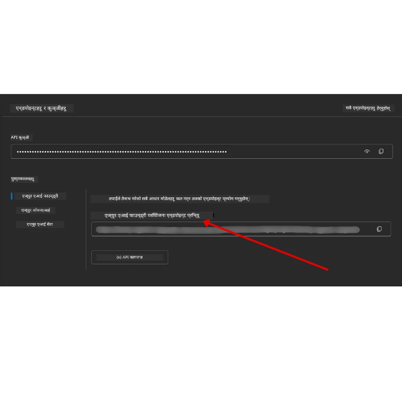

# कोर्स सेटअप

## परिचय

यो पाठले यस कोर्सका कोड नमूनाहरू कसरी चलाउने भन्ने समावेश गर्नेछ।

## अन्य सिक्नेहरूसँग सहभागी हुनुहोस् र सहयोग पाउनुहोस्

क्लोन गर्नु अघि, सेटअपमा सहयोग पाउन, कोर्स सम्बन्धी कुनै प्रश्नको लागि, वा अन्य सिक्नेहरूसँग जडान हुन [AI Agents शुरुआतीहरूका लागि Discord च्यानल](https://aka.ms/ai-agents/discord) मा सामेल हुनुहोस्।

## यो रिपो क्लोन वा फोर्क गर्नुहोस्

सुरु गर्न कृपया GitHub रिपोजिटरी क्लोन वा फोर्क गर्नुहोस्। यसले पाठ्यक्रम सामग्रीको आफ्नो अलग भर्सन बनाउनेछ जसले गर्दा तपाईंले कोड चलाउन, परीक्षण गर्न, र परिमार्जन गर्न सक्नुहुनेछ!

यो गर्न सकिन्छ <a href="https://github.com/microsoft/ai-agents-for-beginners/fork" target="_blank">रिपो फोर्क गर्नुहोस्</a> लिंकमा क्लिक गरेर

तपाईंले अब निम्न लिंकमा यो कोर्सको आफ्नो फोर्क गरिएको भर्सन पाउनुपर्छ:


### शैलो क्लोन (वर्कशप / Codespaces का लागि सिफारिस)

  > पूरै रिपोजिटरी पूर्ण इतिहास र सबै फाइलहरू डाउनलोड गर्दा ठूलो (~3 GB) हुन सक्छ। यदि तपाईं केवल वर्कशपमा सहभागी हुनुहुन्छ वा केवल केही पाठ्यक्रम फोल्डरहरू चाहिन्छ भने, शैलो क्लोन (वा sparse clone) इतिहास छोटो पारेर र/वा ब्लबहरू स्किप गरेर त्यो अधिकांश डाउनलोडबाट बचाउँछ।

#### द्रुत शैलो क्लोन — न्यूनतम इतिहास, सबै फाइलहरू

तलका कमाण्डहरूमा `<your-username>` लाई आफ्नो फोर्क URL (वा चाहनुहुन्छ भने अपस्ट्रीम URL) सँग प्रतिस्थापन गर्नुहोस्।

हालको कमिट इतिहास मात्र क्लोन गर्न (सानो डाउनलोड) :

```bash|powershell
git clone --depth 1 https://github.com/<your-username>/ai-agents-for-beginners.git
```

विशेष ब्रान्च क्लोन गर्न:

```bash|powershell
git clone --depth 1 --branch <branch-name> https://github.com/<your-username>/ai-agents-for-beginners.git
```

#### आंशिक (sparse) क्लोन — न्यूनतम ब्लबहरू + केवल चयन गरिएका फोल्डरहरू

यसले partial clone र sparse-checkout प्रयोग गर्छ (Git 2.25+ आवश्यक र partial clone समर्थन भएको आधुनिक Git सिफारिस गरिन्छ):

```bash|powershell
git clone --depth 1 --filter=blob:none --sparse https://github.com/<your-username>/ai-agents-for-beginners.git
```

रिपो फोल्डरमा जानुहोस्:

```bash|powershell
cd ai-agents-for-beginners
```

त्यसपछि तपाइँले चाहनु भएका फोल्डरहरू निर्दिष्ट गर्नुहोस् (तलको उदाहरणले दुईवटा फोल्डर देखाउँछ):

```bash|powershell
git sparse-checkout set 00-course-setup 01-intro-to-ai-agents
```

क्लोन गरेर फाइलहरू जाँच गरेपछि, यदि तपाईंलाई केवल फाइलहरू मात्र चाहिन्छ र ठाउँ खाली गर्न चाहनुहुन्छ (git इतिहास चाहिँन), भने कृपया रिपोजिटरी मेटाडाटा मेटाउनुहोस् (💀अपरिवर्तनीय — तपाईले सबै Git कार्यक्षमता गुमाउनुहुनेछ: कुनै कमिटहरू, पुल, पुशहरू, वा इतिहास पहुँच हुनेछैन।)

```bash
# zsh/bash
rm -rf .git
```

```powershell
# पावरशेल
Remove-Item -Recurse -Force .git
```

#### GitHub Codespaces प्रयोग गर्दै (स्थानीय ठूलो डाउनलोडहरूबाट बच्न सिफारिस गरिन्छ)

- [GitHub UI](https://github.com/codespaces) मार्फत यो रिपोका लागि नयाँ Codespace सिर्जना गर्नुहोस्।  

- नयाँ सिर्जना गरिएको codespace को टर्मिनलमा माथिका शैलो/स्पार्स क्लोन कमाण्डहरू मध्ये एउटा चलाएर केवल तपाइँलाई चाहिने पाठ्यक्रम फोल्डरहरू मात्रै Codespace कार्यक्षेत्रमा ल्याउनुहोस्।
- वैकल्पिक: Codespaces भित्र क्लोन गरेपछि थप ठाउँ फर्काउन .git हटाउनुहोस् (माथिका हटाउने कमाण्डहरू हेर्नुहोस्)।
- नोट: यदि तपाईं अतिरिक्त क्लोन नगरी सिधै रिपो Codespaces मा खोल्न चाहनुहुन्छ भने, Codespaces ले devcontainer वातावरण निर्माण गर्नेछ र सम्भवतः तपाईंले चाहनुभन्दा बढी संसाधन प्रोभिजन हुन सक्छ। नयाँ Codespace भित्र शैलो कपी क्लोन गर्दा डिस्क प्रयोगमा बढी नियन्त्रण प्राप्त हुन्छ।

#### सुझावहरू

- सम्पादन/कमिट गर्न चाहनुहुन्छ भने क्लोन URL सधैं आफ्नो फोर्कसँग प्रतिस्थापन गर्नुहोस्।
- पछि थप इतिहास वा फाइलहरू चाहिँएमा, तपाईं तिनीहरू फेच गर्न वा sparse-checkout समायोजन गरेर अतिरिक्त फोल्डरहरू समावेश गर्न सक्नुहुन्छ।

## कोड चलाउने

यस कोर्सले Jupyter Notebookहरूको श्रृंखला प्रदान गर्दछ जुन तपाईंले चलाएर AI Agents बनाउने व्यावहारिक अनुभव प्राप्त गर्न सक्नुहुन्छ।

कोड नमूनाहरूले **Microsoft Agent Framework (MAF)** र `AzureAIProjectAgentProvider` प्रयोग गर्छ, जुन **Azure AI Agent Service V2** (Responses API) लाई **Microsoft Foundry** मार्फत जोड्छ।

सबै Python नोटबुकहरू `*-python-agent-framework.ipynb` ले लेबल गरिएका छन्।

## आवश्यकताहरू

- Python 3.12+
  - **नोट**: यदि तपाईंसँग Python3.12 स्थापना छैन भने, कृपया यसलाई स्थापना गर्नुहोस्। त्यसपछि requirements.txt फाइलबाट सही भर्सनहरू स्थापना हुन सुनिश्चित गर्न python3.12 प्रयोग गरेर आफ्नो venv सिर्जना गर्नुहोस्।
  
    > उदाहरण

    Python venv निर्देशिका सिर्जना गर्नुहोस्:

    ```bash|powershell
    python -m venv venv
    ```

    त्यसपछि venv वातावरण सक्रिय गर्नुहोस्:

    ```bash
    # zsh/bash
    source venv/bin/activate
    ```
  
    ```dos
    # Command Prompt for Windows
    venv\Scripts\activate
    ```

- .NET 10+: .NET प्रयोग गरेर नमूना कोडका लागि, कृपया [.NET 10 SDK](https://dotnet.microsoft.com/download/dotnet/10.0) वा त्यसपछि स्थापना गर्न सुनिश्चित गर्नुहोस्। त्यसपछि आफ्नो स्थापना गरिएको .NET SDK भर्सन जाँच्नुहोस्:

    ```bash|powershell
    dotnet --list-sdks
    ```

- **Azure CLI** — प्रमाणिकरणका लागि आवश्यक। [aka.ms/installazurecli](https://aka.ms/installazurecli) बाट स्थापना गर्नुहोस्।
- **Azure Subscription** — Microsoft Foundry र Azure AI Agent Service पहुँचका लागि।
- **Microsoft Foundry Project** — डिप्लोय गरिएको मोडेल भएको प्रोजेक्ट (उदाहरणका लागि `gpt-4o`)। तलको [चरण 1](../../../00-course-setup) हेर्नुहोस्।

हामीले यो रिपोजिटरीको रुटमा `requirements.txt` फाइल समावेश गरेका छौं जसले कोड नमूनाहरू चलाउन आवश्यक सबै Python प्याकेजहरू समावेश गर्छ।

तपाईंले तिनीहरूलाई रुटमा आफ्नो टर्मिनलमा तलको कमाण्ड चलाएर स्थापना गर्न सक्नुहुन्छ:

```bash|powershell
pip install -r requirements.txt
```

कुनै द्वन्द्व र समस्या बाट बच्न Python भर्चुअल वातावरण सिर्जना गर्न सुझाव दिन्छौं।

## VSCode सेटअप

VSCode मा प्रयोग गरिरहनुभएको Python को सही भर्सन प्रयोग भइरहेको छ भनी सुनिश्चित गर्नुहोस्।


## Microsoft Foundry र Azure AI Agent Service सेटअप गर्नुहोस्

### चरण 1: Microsoft Foundry प्रोजेक्ट सिर्जना गर्नुहोस्

नोटबुकहरू चलाउन तपाईंलाई Azure AI Foundry मा डिप्लोय गरिएको मोडेलसहितको **hub** र **project** चाहिन्छ।

1. आफ्नो Azure खातासँग साइन इन गर्न [ai.azure.com](https://ai.azure.com) मा जानुहोस्।
2. एउटा **hub** सिर्जना गर्नुहोस् (वा पहिले नै रहेको कुनै एक प्रयोग गर्नुहोस्)। हेर्नुहोस्: [Hub resources overview](https://learn.microsoft.com/azure/ai-foundry/concepts/ai-resources)।
3. हब भित्र, एउटा **project** सिर्जना गर्नुहोस्।
4. **Models + Endpoints** → **Deploy model** बाट मोडेल (उदाहरण: `gpt-4o`) डिप्लोय गर्नुहोस्।

### चरण 2: आफ्नो प्रोजेक्ट अन्तबिन्दु र मोडेल डिप्लोयमेन्ट नाम प्राप्त गर्नुहोस्

Microsoft Foundry पोर्टलमा तपाइँको प्रोजेक्टबाट:

- **Project Endpoint** — **Overview** पृष्ठमा जानुहोस् र अन्तबिन्दु URL कपि गर्नुहोस्।



- **Model Deployment Name** — **Models + Endpoints** मा जानुहोस्, तपाइँले डिप्लोय गरेको मोडेल चयन गर्नुहोस्, र **Deployment name** नोट गर्नुहोस् (उदाहरण: `gpt-4o`)।

### चरण 3: `az login` मार्फत Azure मा साइन इन गर्नुहोस्

सबै नोटबुकहरूले प्रमाणिकरणका लागि **`AzureCliCredential`** प्रयोग गर्छन् — कुनै API कुञ्जीहरू व्यवस्थापन गर्नु पर्ने छैन। यसका लागि Azure CLI मार्फत साइन इन हुनु आवश्यक छ।

1. **Azure CLI स्थापना गर्नुहोस्** यदि तपाईंले अझै स्थापना गर्नु भएको छैन भने: [aka.ms/installazurecli](https://aka.ms/installazurecli)

2. **साइन इन** गर्न:

    ```bash|powershell
    az login
    ```

    वा यदि तपाईं रिमोट/Codespace वातावरणमा हुनुहुन्छ र ब्राउजर उपलब्ध छैन भने:

    ```bash|powershell
    az login --use-device-code
    ```

3. यदि सोधियो भने **आफ्नो सदस्यता चयन** गर्नुहोस् — त्यो सदस्यता छान्नुहोस् जसमा तपाईंको Foundry प्रोजेक्ट छ।

4. **प्रमाणित भएको जाँच गर्नुहोस्**:

    ```bash|powershell
    az account show
    ```

> **किन `az login`?** नोटबुकहरूले `azure-identity` प्याकेजबाट `AzureCliCredential` प्रयोग गरी प्रमाणिकरण गर्छन्। यसको अर्थ तपाईंको Azure CLI सत्रले प्रमाणपत्रहरू प्रदान गर्छ — .env फाइलमा कुनै API कुञ्जीहरू वा संवेदनशील वस्तुहरू राख्नु पर्दैन। यो [सुरक्षा उत्तम अभ्यास](https://learn.microsoft.com/azure/developer/ai/keyless-connections) हो।

### चरण 4: आफ्नो `.env` फाइल सिर्जना गर्नुहोस्

उदाहरण फाइल प्रतिलिपि गर्नुहोस्:

```bash
# zsh/bash
cp .env.example .env
```

```powershell
# पावरशेल
Copy-Item .env.example .env
```

`.env` खोलेर यी दुई मानहरू भर्नुहोस्:

```env
AZURE_AI_PROJECT_ENDPOINT=https://<your-project>.services.ai.azure.com/api/projects/<your-project-id>
AZURE_AI_MODEL_DEPLOYMENT_NAME=gpt-4o
```

| भेरिएबल | कहाँ पाउन सकिन्छ |
|----------|-----------------|
| `AZURE_AI_PROJECT_ENDPOINT` | Foundry पोर्टल → तपाईंको प्रोजेक्ट → **Overview** पृष्ठ |
| `AZURE_AI_MODEL_DEPLOYMENT_NAME` | Foundry पोर्टल → **Models + Endpoints** → तपाईंले डिप्लोय गरेको मोडेलको नाम |

धेरै पाठहरूका लागि यत्ति नै हो! नोटबुकहरूले तपाईंको `az login` सत्र मार्फत स्वचालित रूपमा प्रमाणिकरण गर्नेछन्।

### चरण 5: Python निर्भरता स्थापना गर्नुहोस्

```bash|powershell
pip install -r requirements.txt
```

हामी सिफारिस गर्छौं कि यो पहिले सिर्जना गरेको भर्चुअल वातावरण भित्र चलाउनुहोस्।

## पाठ 5 का लागि अतिरिक्त सेटअप (Agentic RAG)

पाठ 5 ले retrieval-augmented generation का लागि **Azure AI Search** प्रयोग गर्छ। यदि तपाईं त्यो पाठ चलाउने योजना बनाउँदै हुनुहुन्छ भने यी भेरिएबलहरू आफ्नो `.env` फाइलमा थप गर्नुहोस्:

| भेरिएबल | कहाँ पाउन सकिन्छ |
|----------|-----------------|
| `AZURE_SEARCH_SERVICE_ENDPOINT` | Azure पोर्टल → तपाईंको **Azure AI Search** स्रोत → **Overview** → URL |
| `AZURE_SEARCH_API_KEY` | Azure पोर्टल → तपाईंको **Azure AI Search** स्रोत → **Settings** → **Keys** → प्राथमिक एड्मिन कुञ्जी |

## पाठ 6 र पाठ 8 का लागि अतिरिक्त सेटअप (GitHub Models)

पाठ 6 र 8 का केही नोटबुकहरूले Azure AI Foundry सट्टा **GitHub Models** प्रयोग गर्छन्। यदि तपाईं ती नमूनाहरू चलाउने योजना बनाउनुहुन्छ भने यी भेरिएबलहरू आफ्नो `.env` फाइलमा थप गर्नुहोस्:

| भेरिएबल | कहाँ पाउन सकिन्छ |
|----------|-----------------|
| `GITHUB_TOKEN` | GitHub → **Settings** → **Developer settings** → **Personal access tokens** |
| `GITHUB_ENDPOINT` | Use `https://models.inference.ai.azure.com` (default value) |
| `GITHUB_MODEL_ID` | प्रयोग गर्न चाहिने मोडेल नाम (उदाहरण: `gpt-4o-mini`) |

## पाठ 8 का लागि अतिरिक्त सेटअप (Bing Grounding Workflow)

पाठ 8 को सर्तआधारित workflow नोटबुकले Azure AI Foundry मार्फत **Bing grounding** प्रयोग गर्छ। यदि तपाईं त्यो नमूनालाई चलाउने योजना बनाउनुहुन्छ भने यो भेरिएबल आफ्नो `.env` फाइलमा थप गर्नुहोस्:

| भेरिएबल | कहाँ पाउन सकिन्छ |
|----------|-----------------|
| `BING_CONNECTION_ID` | Azure AI Foundry पोर्टल → तपाईंको प्रोजेक्ट → **Management** → **Connected resources** → तपाईंको Bing कनेक्सन → कनेक्सन ID कपि गर्नुहोस् |

## समस्या निवारण

### macOS मा SSL प्रमाणपत्र प्रमाणिकरण त्रुटिहरू

यदि तपाईं macOS मा हुनुहुन्छ र जस्तै त्रुटि आउँछ भने:

```plaintext
ssl.SSLCertVerificationError: [SSL: CERTIFICATE_VERIFY_FAILED] certificate verify failed: self-signed certificate in certificate chain
```

यो Python मा macOS सँगको एक चिनिएको समस्या हो जहाँ सिस्टम SSL प्रमाणपत्रहरू स्वचालित रूपमा ट्रस्ट गरिँदैनन्। तलका समाधानहरू क्रमशः प्रयास गर्नुहोस्:

**विकल्प 1: Python को Install Certificates स्क्रिप्ट चलाउनुहोस् (सिफारिस गरिन्छ)**

```bash
# 3.XX लाई आफ्नो इन्स्टल गरिएको Python संस्करण (उदाहरण: 3.12 वा 3.13) ले प्रतिस्थापन गर्नुहोस्:
/Applications/Python\ 3.XX/Install\ Certificates.command
```

**विकल्प 2: आफ्नो नोटबुकमा `connection_verify=False` प्रयोग गर्नुहोस् (केवल GitHub Models नोटबुकहरूको लागि)**

Lesson 6 नोटबुक (`06-building-trustworthy-agents/code_samples/06-system-message-framework.ipynb`) मा एक कमेन्ट गरिएको वर्कअराउन्ड पहिले नै समावेश गरिएको छ। क्लाइन्ट सिर्जना गर्दा `connection_verify=False` अनकमेन्ट गर्नुहोस्:

```python
client = ChatCompletionsClient(
    endpoint=endpoint,
    credential=AzureKeyCredential(token),
    connection_verify=False,  # यदि प्रमाणपत्र त्रुटिहरू देखिए भने SSL जाँच अक्षम गर्नुहोस्
)
```

> **⚠️ चेतावनी:** SSL प्रमाणिकरण डिसेबल गर्दा (`connection_verify=False`) प्रमाणपत्र सत्यापन स्किप गरेर सुरक्षा कम हुन्छ। यसलाई केवल विकास वातावरणका अस्थायी वर्कअराउन्डको रूपमा प्रयोग गर्नुहोस्, उत्पादनमा कहिल्यै प्रयोग नगर्नुहोस्।

**विकल्प 3: `truststore` इन्स्टल र प्रयोग गर्नुहोस्**

```bash
pip install truststore
```

त्यसपछि आफ्नो नोटबुक वा स्क्रिप्टको सुरुमा कुनै पनि नेटवर्क कल गर्नु अघि तलको कुरा थप्नुहोस्:

```python
import truststore
truststore.inject_into_ssl()
```

## कतै अड्किनुभयो?

यदि यो सेटअप चलाउन कुनै समस्या भएमा, हाम्रो <a href="https://discord.gg/kzRShWzttr" target="_blank">Azure AI समुदाय Discord</a> मा आउनुहोस् वा <a href="https://github.com/microsoft/ai-agents-for-beginners/issues?WT.mc_id=academic-105485-koreyst" target="_blank">इश्यू सिर्जना गर्नुहोस्</a>।

## अर्को पाठ

अब तपाईं यस कोर्सको कोड चलाउन तयार हुनुहुन्छ। AI Agents को संसारबारे थप सिक्नको लागि शुभकामना!

[AI Agents र एजेन्ट प्रयोग केसहरूको परिचय](../01-intro-to-ai-agents/README.md)

---

<!-- CO-OP TRANSLATOR DISCLAIMER START -->
अस्वीकरण:
यो दस्तावेज AI अनुवाद सेवा Co-op Translator (https://github.com/Azure/co-op-translator) प्रयोग गरी अनुवाद गरिएको हो। हामी शुद्धताको लागि प्रयास गर्छौं, तर कृपया ध्यान दिनुहोस् कि स्वचालित अनुवादमा त्रुटि वा असमानता हुन सक्दछ। यसको मूल भाषामा रहेको मूल दस्तावेजलाई अधिकारिक स्रोत मानिनु पर्छ। महत्वपूर्ण जानकारीका लागि व्यावसायिक मानव अनुवाद सिफारिस गरिन्छ। यस अनुवादको प्रयोगबाट उत्पन्न कुनै पनि गलतफहमी वा गलत व्याख्याका लागि हामी जिम्मेवार छैनौं।
<!-- CO-OP TRANSLATOR DISCLAIMER END -->