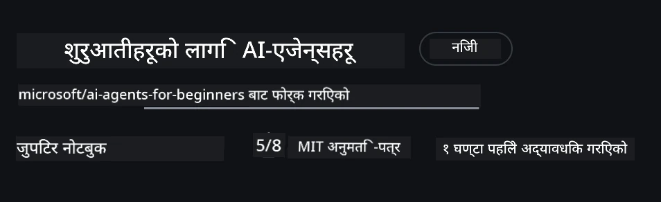
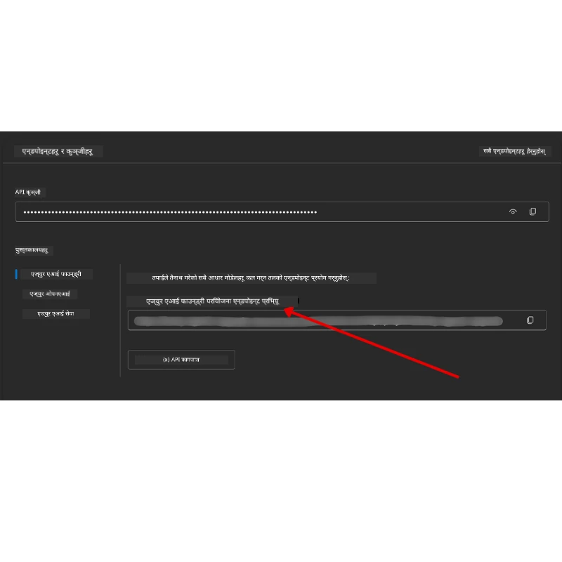

# कोर्ष सेटअप

## परिचय

यो पाठले कसरी यो कोर्सका कोड नमूनाहरू चलाउने बारेमा छलफल गर्नेछ।

## अन्य सिक्नेहरूसँग जोडिनुहोस् र सहायता पाउनुहोस्

तपाईँले आफ्नो रिपो क्लोन गर्न सुरु गर्नु अघि, सेटअपमा कुनै पनि सहयोग, कोर्स सम्बन्धी प्रश्नहरू वा अन्य सिक्नेहरूसँग जडान हुनका लागि [AI Agents For Beginners Discord च्यानल](https://aka.ms/ai-agents/discord) मा सामेल हुनुहोस्।

## यो रिपो क्लोन वा फोर्क गर्नुहोस्

सुरु गर्नको लागि, कृपया GitHub रिपोजिटोरी क्लोन वा फोर्क गर्नुहोस्। यसले तपाईंको आफ्नै संस्करण सिर्जना गर्नेछ जसले तपाईंलाई कोड चलाउन, परिक्षण गर्न र परिमार्जन गर्न मद्दत गर्नेछ!

यो <a href="https://github.com/microsoft/ai-agents-for-beginners/fork" target="_blank">रिपो फोर्क गर्न</a> लिंकमा क्लिक गरेर गर्न सकिन्छ

अब तपाईंले यस कोर्सको आफ्नै फोर्क गरिएको संस्करण निम्न लिंकमा पाउनु हुनेछ:



### सानो क्लोन (कार्यशाला / Codespaces का लागि सिफारिस गरिएको)

  >जब तपाईं पूर्ण इतिहास र सबै फाइलहरू डाउनलोड गर्नुहुन्छ, सम्पूर्ण रिपोजिटोरी ठुलो (~3 GB) हुन सक्छ। यदि तपाईं केवल कार्यशालामा सहभागी हुनुहुन्छ वा केही पाठ्यक्रम फोल्डरहरू मात्र चाहिन्छ भने, सानो क्लोन (वा सपरस क्लोन) धेरै कम डाउनलोड गर्दछ।

#### छिटो सानो क्लोन — न्यूनतम इतिहास, सबै फाइलहरू

तलका कमाण्डहरूमा `<your-username>` लाई आफ्नो फोर्क URL (वा तपाईँलाई मनपर्ने भए अपस्ट्रीम URL) सँग प्रतिस्थापन गर्नुहोस्।

पछिल्लो कमिट इतिहास मात्र क्लोन गर्न (सानो डाउनलोड):

```bash
git clone --depth 1 https://github.com/<your-username>/ai-agents-for-beginners.git
```

विशेष शाखा क्लोन गर्न:

```bash
git clone --depth 1 --branch <branch-name> https://github.com/<your-username>/ai-agents-for-beginners.git
```

#### आंशिक (सपरस) क्लोन — न्यूनतम ब्लब्स + छनौट गरिएका फोल्डरहरू मात्र

यसले आंशिक क्लोन र सपरस-चेकआउट प्रयोग गर्दछ (Git 2.25+ आवश्यक र आधुनिक Git सिफारिस गरिएको जुन आंशिक क्लोन समर्थन गर्दछ):

```bash
git clone --depth 1 --filter=blob:none --sparse https://github.com/<your-username>/ai-agents-for-beginners.git
```

रिपो फोल्डर भित्र जानुहोस्:

```bash
cd ai-agents-for-beginners
```

त्यसपछि तपाईंलाई चाहिने फोल्डरहरू निर्दिष्ट गर्नुहोस् (तलको उदाहरणले दुई फोल्डर देखाउँछ):

```bash
git sparse-checkout set 00-course-setup 01-intro-to-ai-agents
```

क्लोन गरी फाइलहरू भेट्टाएपछि, यदि तपाईंलाई फाइलहरू मात्र चाहिन्छ र ठाउँ खाली गर्न चाहनुहुन्छ (git इतिहास नचाहिने), कृपया रिपो मेटाडाटा मेटाउनुहोस् (💀अपरिवर्तनीय — तपाईंले सबै Git कार्यक्षमता गुमाउनुहुनेछ):

```bash
# zsh/bash
rm -rf .git
```

```powershell
# पावरशेल
Remove-Item -Recurse -Force .git
```

#### GitHub Codespaces प्रयोग गर्दै (स्थानीय ठूला डाउनलोडहरू बाट बच्न सिफारिस गरिएको)

- [GitHub UI](https://github.com/codespaces) मार्फत यस रिपोको नयाँ Codespace सिर्जना गर्नुहोस्।  

- नयाँ बनाइएको codespace को टर्मिनलमा, माथिका सानो/सपरस क्लोन कमाण्डहरू मध्ये एक चलाउनुहोस् ताकि तपाईंलाई चाहिने पाठ्यक्रम फोल्डरहरू मात्र Codespace कार्यक्षेत्रमा ल्याउन सकियोस्।
- वैकल्पिक: Codespaces भित्र क्लोन गरेपछि .git हटाउन सकिन्छ (माथिका हटाउने कमाण्डहरू हेर्नुहोस्) अतिरिक्त ठाउँको लागि।
- नोट: यदि तपाईं रिपोलाई प्रत्यक्ष Codespaces मा खोल्न चाहनुहुन्छ (अतिरिक्त क्लोन बिना), ध्यान दिनुहोस् Codespaces ले devcontainer वातावरण निर्माण गर्नेछ र आवश्यकभन्दा बढी सन्चालन गर्न सक्छ।

#### सुझावहरू

- यदि तपाईंले सम्पादन/कमिट गर्न चाहनुहुन्छ भने सधैं क्लोन URL आफ्नो फोर्क संग प्रतिस्थापन गर्नुहोस्।
- पछि थप इतिहास वा फाइलहरू चाहिएको खण्डमा, तपाईं तिनीहरूलाई फेच गर्न सक्नुहुन्छ वा sparse-checkout समायोजन गरेर अतिरिक्त फोल्डरहरू समावेश गर्न सक्नुहुन्छ।

## कोड चलाउने तरिका

यस कोर्सले Jupyter नोटबुकहरूको श्रृंखला प्रदान गर्दछ जुन प्रयोगकर्ताले AI एजेन्टहरू बनाउन व्यावहारिक अनुभव प्राप्त गर्न चलाउन सक्छन्।

कोड नमूनाहरूले **Microsoft Agent Framework (MAF)** प्रयोग गर्दछ जुन `FoundryChatClient` सँग काम गर्छ, यो **Microsoft Foundry Agent Service V2** (Responses API) मार्फत **Microsoft Foundry** सँग जोडिन्छ।

सबै Python नोटबुकहरू `*-python-agent-framework.ipynb` ले लेबल गरिएका छन्।

## आवश्यकताहरू

- Python 3.12+
  - **नोट**: यदि तपाईंले Python 3.12 स्थापना गर्नुभएको छैन भने, कृपया स्थापना गर्नुहोस्। त्यसपछि python3.12 प्रयोग गरेर आफ्नो venv सिर्जना गर्नुहोस् ताकि requirements.txt फ़ाइलबाट सही संस्करणहरू स्थापना होस्।
  
    >उदाहरण

    Python venv डिरेक्टरी बनाउनुहोस्:

    ```bash
    python -m venv venv
    ```

    त्यसपछि venv वातावरण सक्रिय गर्नुहोस्:

    ```bash
    # zsh/bash
    source venv/bin/activate
    ```
  
    ```dos
    # Command Prompt for Windows
    venv\Scripts\activate
    ```

- .NET 10+: .NET प्रयोग गर्ने नमूना कोडका लागि, सुनिश्चित गर्नुहोस् कि तपाईंले [.NET 10 SDK](https://dotnet.microsoft.com/download/dotnet/10.0) वा त्यसपछि संस्करण स्थापना गर्नुभएको छ। त्यसपछि, तपाईंको .NET SDK संस्करण जाँच गर्नुहोस्:

    ```bash
    dotnet --list-sdks
    ```

- **Azure CLI** — प्रमाणिकरणका लागि आवश्यक। स्थापना गर्न [aka.ms/installazurecli](https://aka.ms/installazurecli) बाट गर्नुहोस्।
- **Azure Subscription** — Microsoft Foundry र Microsoft Foundry Agent Service पहुँचको लागि।
- **Microsoft Foundry Project** — डिप्लोय गरिएको मोडेल भएको एउटा प्रोजेक्ट (उदाहरणका लागि, `gpt-5-mini`)। तलको [स्टेप 1](#चरण-१-microsoft-foundry-प्रोजेक्ट-सिर्जना-गर्नुहोस्) हेर्नुहोस्।

हामीले यो रिपोको रुटमा `requirements.txt` फाइल समावेश गरेका छौं जसले कोड नमूनाहरू चलाउनका लागि आवश्यक सबै Python प्याकेजहरू राख्दछ।

तपाईंले तिनीहरूलाई रिपोको रुटमा रहेको टर्मिनलमा निम्न कमाण्ड चलाएर स्थापना गर्न सक्नुहुन्छ:

```bash
pip install -r requirements.txt
```

हामी सिफारिस गर्छौं कि कुनै पनि द्वैधता र समस्याहरूबाट बच्न Python भर्चुअल वातावरण सिर्जना गर्नुहोस्।

## VSCode सेटअप

निश्चित गर्नुहोस् कि तपाईंले VSCode मा सही Python संस्करण प्रयोग गर्दै हुनुहुन्छ।


## Microsoft Foundry र Microsoft Foundry Agent Service सेट अप गर्नुहोस्

### चरण १: Microsoft Foundry प्रोजेक्ट सिर्जना गर्नुहोस्

नोटबुकहरू चलाउन तपाईंलाई Microsoft Foundry **hub** र **project** आवश्यक छ जहाँ मोडेल डिप्लोय गरिएको छ।

1. [ai.azure.com](https://ai.azure.com) मा जानुहोस् र आफ्नो Azure खाताबाट साइन इन गर्नुहोस्।
2. एउटा **hub** सिर्जना गर्नुहोस् (वा अस्तित्वमा भएको प्रयोग गर्नुहोस्)। हेर्नुहोस्: [Hub resources overview](https://learn.microsoft.com/azure/ai-foundry/concepts/ai-resources)।
3. हबसँग भित्र एउटा **project** सिर्जना गर्नुहोस्।
4. मोडेल डिप्लोय गर्नुहोस् (उदाहरणका लागि, `gpt-5-mini`) **Models + Endpoints** → **Deploy model** बाट।

### चरण २: आफ्नो प्रोजेक्ट एन्डपोइन्ट र मोडेल डिप्लोयमेन्ट नाम प्राप्त गर्नुहोस्

Microsoft Foundry पोर्टलमा आफ्नो प्रोजेक्टबाट:

- **Project Endpoint** — **Overview** पृष्ठमा जानुहोस् र एन्डपोइन्ट URL कपी गर्नुहोस्।



- **Model Deployment Name** — **Models + Endpoints** मा जानुहोस्, तपाईँले डिप्लोय गरेको मोडेल चयन गर्नुहोस्, र **Deployment name** (जस्तै, `gpt-5-mini`) नोट गर्नुहोस्।

### चरण ३: `az login` मार्फत Azure मा साइन इन गर्नुहोस्

धेरै नोटबुकहरूले तपाईंको **Azure CLI साइन इन** मार्फत प्रमाणिकरण गर्छन् — `azure-identity` प्याकेजबाट `AzureCliCredential` वा `DefaultAzureCredential` (जसले तपाईंको `az login` सेसन उठाउँछ) प्रयोग गरेर — त्यसैले API कुञ्जीहरू आवश्यक पर्दैनन्। केही पाठहरू र वैकल्पिक इन्टेग्रेशनहरूले API कुञ्जीहरू प्रयोग गर्छन्; प्रत्येक पाठका पूर्वआवश्यकताहरू जाँच्नुहोस् यदि अतिरिक्त वातावरण भेरिएबलहरू आवश्यक छन् भने। यसका लागि तपाईंलाई Azure CLI बाट साइन इन गरिएको हुनुपर्नेछ।

1. यदि अझै Azure CLI स्थापना गरेको छैन भने, स्थापना गर्नुहोस्: [aka.ms/installazurecli](https://aka.ms/installazurecli)

2. त्यसपछि साइन इन गर्नुहोस्:

    ```bash
    az login
    ```

    वा तपाईंको रिमोट/Codespace वातावरण ब्राउजर बिना भएमा:

    ```bash
    az login --use-device-code
    ```

3. यदि सोधिएको भए **तपाईंको सदस्यता चयन गर्नुहोस्** — आफ्नो Foundry प्रोजेक्ट भएको चयन गर्नुहोस्।

4. सुनिश्चित गर्नुहोस् कि तपाईं साइन इन हुनु भएको छ:

    ```bash
    az account show
    ```

> **किन `az login`?** नोटबुकहरूले `azure-identity` बाट `AzureCliCredential` (वा `DefaultAzureCredential`, जसले Azure CLI साइन इन पनि समेट्छ) प्रयोग गरेर प्रमाणिकरण गर्छन्। यसको अर्थ तपाईंको Azure CLI सेसनले प्रमाणपत्रहरु प्रदान गर्छ — कुनै API कुञ्जी वा गुप्तचर तपाईंको `.env` फाइलमा हुँदैन। यो [सुरक्षा उत्तम अभ्यास](https://learn.microsoft.com/azure/developer/ai/keyless-connections) हो।

### चरण ४: आफ्नो `.env` फाइल बनाउनुहोस्

उदाहरण फाइल कपी गर्नुहोस्:

```bash
# zsh/bash
cp .env.example .env
```

```powershell
# पावरशेल
Copy-Item .env.example .env
```

`.env` खोल्नुहोस् र यी दुई मानहरू भर्नुहोस्:

```env
AZURE_AI_PROJECT_ENDPOINT=https://<your-project>.services.ai.azure.com/api/projects/<your-project-id>
AZURE_AI_MODEL_DEPLOYMENT_NAME=gpt-5-mini
```

| भेरिएबल | कहाँ फेला पार्ने |
|----------|-----------------|
| `AZURE_AI_PROJECT_ENDPOINT` | Foundry पोर्टल → तपाईंको प्रोजेक्ट → **Overview** पृष्ठ |
| `AZURE_AI_MODEL_DEPLOYMENT_NAME` | Foundry पोर्टल → **Models + Endpoints** → तपाईंले डिप्लोय गरेको मोडेलको नाम |

अधिकांश पाठहरूका लागि त्यति नै हो! नोटबुकहरूले स्वतः तपाईंको `az login` सेसन मार्फत प्रमाणिकरण गर्नेछन्।

### चरण ५: Python निर्भरताहरू स्थापना गर्नुहोस्

```bash
pip install -r requirements.txt
```

सिफारिस गरिन्छ कि यो तपाईँले अघि सिर्जना गरेको भर्चुअल वातावरण भित्र चलाउनुहोस्।

## वैकल्पिक सेटअप: Azure AI Search (पाठ ५ र १६)

पाठ ५ (Agentic RAG) र पाठ १६ नोटबुकहरू बाहिरी स्रोत बिनाै **in-memory knowledge base** प्रयोग गरेर सजिलै चल्छन्। यदि तपाईं वास्तवमै **Azure AI Search** सूचकांक (index) प्रयोग गर्न चाहनुहुन्छ भने, पाठ १६ नोटबुक हाल केवल **key-based authentication** प्रयोग गर्दछ: यो इन-मेमोरी खोजबाट Azure AI Search मा तब मात्र सर्छ जब **दुबै** `AZURE_SEARCH_SERVICE_ENDPOINT` **र** `AZURE_SEARCH_API_KEY` सेट गरिएको हुन्छ, अन्यथा इन-मेमोरी खोजमै रहन्छ — त्यसैले यसलाई वास्तविक सूचकांकसँग चलाउन प्रशासक कुञ्जी पनि सेट गर्नुपर्छ। Microsoft Entra ID (RBAC) को साथ keyless authentication तपाईंको आफ्नै उत्पादन कोडका लागि सिफारिस गरिन्छ, जुन यस कोर्सको बाँकी ठाउँमा ‘az login’ बाट गरिन्छ।

तलका RBAC चरणहरू सेटअप-गाइड नमूनाहरू र तपाईंको आफ्नै कोडमा लागू हुन्छन्। यिनीहरूले पाठ १६ नोटबुकमा keyless authentication सक्षम गर्दैनन्; पाठ १६ अझै पनि Azure AI Search प्रयोग गर्न एन्डपोइन्ट र प्रशासक कुञ्जी दुवै चाहिन्छ।

1. तपाईंको सर्च सेवामा **role-based access** सक्षम गर्नुहोस्:

    ```bash
    az search service update --name <service-name> --resource-group <resource-group> --auth-options aadOrApiKey
    ```

2. आवश्यक भूमिकाहरू आफैंलाई **प्रदान गर्नुहोस्** (इन्डेक्सहरू सिर्जना/लोड र सोधपुछ गर्न):

    ```bash
    az role assignment create --assignee <your-user-or-principal-id> --role "Search Service Contributor" --scope $(az search service show -g <resource-group> -n <service-name> --query id -o tsv)
    az role assignment create --assignee <your-user-or-principal-id> --role "Search Index Data Contributor" --scope $(az search service show -g <resource-group> -n <service-name> --query id -o tsv)
    ```

3. आफ्नो `.env` फाइलमा एन्डपोइन्ट थप्नुहोस्:

| भेरिएबल | कहाँ फेला पार्ने |
|----------|-----------------|
| `AZURE_SEARCH_SERVICE_ENDPOINT` | Azure पोर्टल → तपाईंको **Azure AI Search** स्रोत → **Overview** → URL |
| `AZURE_SEARCH_API_KEY` | पाठ १६ नोटबुकमा Azure AI Search सक्षम गर्न आवश्यक (एन्डपोइन्टसँगै), जुन key-based auth प्रयोग गर्छ। Azure पोर्टल → **Settings** → **Keys** → प्राथमिक प्रशासक कुञ्जी |

> **किन keyless?** प्रशासक कुञ्जीहरूले तपाईंको सर्च सेवामा पूरै लेख्ने पहुँच दिन्छ र .env फाइल मार्फत चुहाउन सक्छ। RBAC द्वारा, तपाईंको `az login` पहिचान प्रयोग गरिन्छ — सोही keyless Entra ID ढाँचा जुन कोर्स नोटबुकहरूले प्रयोग गर्छन् (AzureCliCredential / DefaultAzureCredential बाट)। हेर्नुहोस् [RBAC प्रयोग गरी Azure AI Search सँग जडान](https://learn.microsoft.com/azure/search/search-security-rbac)।

पूर्ण सूचकांक सिर्जना नमूनाहरूका लागि [Azure AI Search सेटअप गाइड](./AzureSearch.md) हेर्नुहोस्, Python र .NET दुबैमा।

## थप सेटअप ती पाठहरूका लागि जुन Azure OpenAI सिधै कल गर्छन् (पाठ ६ र ८)

केही नोटबुकहरू (पाठ ६ र ८) सिधै **Azure OpenAI** कल गर्छन् (Responses API प्रयोग गरेर) Microsoft Foundry प्रोजेक्टबाट नहिँडेर। यी नमूनाहरूले पहिले GitHub Models प्रयोग गर्थे, जुन दिगो छैन र Responses API समर्थन गर्दैन। यी भेरिएबलहरू आफ्नो `.env` फाइलमा थप्नुहोस्:

| भेरिएबल | कहाँ फेला पार्ने |
|----------|-----------------|
| `AZURE_OPENAI_ENDPOINT` | Azure पोर्टल → तपाईंको **Azure OpenAI** स्रोत → **Keys and Endpoint** → एन्डपोइन्ट (जस्तै `https://<your-resource>.openai.azure.com`) |
| `AZURE_OPENAI_DEPLOYMENT` | तपाईंले डिप्लोय गरेको मोडेलको नाम (जस्तै `gpt-5-mini`) जसले Responses API समर्थन गर्दछ |
| `AZURE_OPENAI_API_KEY` | वैकल्पिक — केवल यदि तपाईंले key-based auth प्रयोग गरिरहनुभएको छ भन्दा `az login` / Entra ID साटो |

> Responses API स्थिर `/openai/v1/` एन्डपोइन्ट प्रयोग गर्छ, त्यसैले कुनै `api-version` आवश्यक पर्दैन। keyless Entra ID प्रमाणिकरणको लागि `az login` सँग साइन इन गर्नुहोस्।

## वैकल्पिक प्रदायक: MiniMax (OpenAI-समर्थक)

[MiniMax](https://platform.minimaxi.com/) ठूलो सन्दर्भ मोडेलहरू (अझै 204K टोकन्स सम्म) प्रदान गर्दछ OpenAI-संगत API मार्फत। Microsoft Agent Framework को `OpenAIChatClient` कुनै OpenAI-संगत एन्डपोइन्टसँग काम गर्दा, तपाईं MiniMax लाई विकल्पको रूपमा प्रयोग गर्न सक्नुहुन्छ जुन `OpenAIChatClient` प्रयोग गर्ने पाठहरूमा।

यी भेरिएबलहरू आफ्नो `.env` फाइलमा थप्नुहोस्:

| भेरिएबल | कहाँ फेला पार्ने |
|----------|-----------------|
| `MINIMAX_API_KEY` | [MiniMax Platform](https://platform.minimaxi.com/) → API कुञ्जीहरू |
| `MINIMAX_BASE_URL` | `https://api.minimax.io/v1` (डिफल्ट मान) प्रयोग गर्नुहोस् |
| `MINIMAX_MODEL_ID` | प्रयोग गर्ने मोडेल नाम (जस्तै, `MiniMax-M3`) |

**मोडेलहरू उदाहरण**: `MiniMax-M3` (सिफारिस गरिएको), `MiniMax-M2.7`, `MiniMax-M2.7-highspeed` (छिटो जवाफ)। मोडेल नामहरू र उपलब्धता समय अनुसार परिवर्तन हुन सक्छ, र कुनै मोडेलमा पहुँच तपाईंको खाता अनुसार निर्भर हुन सक्छ।

जसले `OpenAIChatClient` प्रयोग गर्ने कोड नमूनाहरू (जस्तै, पाठ १४ होटल बुकिङ कार्यप्रवाह) सँग तपाईंको MiniMax कन्फिगरेशन `MINIMAX_API_KEY` सेट हुँदा स्वतः पहिचान गरेर प्रयोग गर्नेछ।


## वैकल्पिक प्रदायक: Foundry Local (आफ्नो उपकरणमा मोडेलहरू चलाउनुहोस्)

[Foundry Local](https://foundrylocal.ai) एक lightweight runtime हो जसले भाषा मोडेलहरूलाई **पूरै आफ्नै मेसिनमा** डाउनलोड, व्यवस्थापन, र सेवा दिन्छ OpenAI-समर्थित API मार्फत — कुनै क्लाउड आवश्यक छैन।

किनभने Microsoft Agent Framework को `OpenAIChatClient` कुनै पनि OpenAI-समर्थित अन्तबिन्दुसँग काम गर्छ, Foundry Local Azure OpenAI को लागि एक drop-in स्थानीय विकल्प हो।

**1. Foundry Local स्थापना गर्नुहोस्**

```bash
# विन्डोज
winget install Microsoft.FoundryLocal

# म्याकओएस
brew install foundrylocal
```

**2. एक मोडेल डाउनलोड र चलाउनुहोस्** (यसले स्थानीय सेवा पनि सुरु गर्छ):

```bash
foundry model list          # उपलब्ध मोडेलहरू हेर्नुहोस्
foundry model run phi-4-mini
```

**3. स्थानीय अन्तबिन्दु पत्ता लगाउन प्रयोग हुने Python SDK स्थापना गर्नुहोस्:**

```bash
pip install foundry-local-sdk
```

**4. Microsoft Agent Framework लाई आफ्नो स्थानीय मोडेलमा देखाउनुहोस्:**

```python
from foundry_local import FoundryLocalManager
from agent_framework.openai import OpenAIChatClient

# मोडेललाई स्थानीय रूपमा डाउनलोड (आवश्यक भएमा) र सेवा गर्छ, त्यसपछि अन्त बिन्दु/पोर्ट पत्ता लगाउँछ।
manager = FoundryLocalManager("phi-4-mini")

chat_client = OpenAIChatClient(
    base_url=manager.endpoint,      # उदाहरणका लागि http://localhost:<port>/v1
    api_key=manager.api_key,        # Foundry Local को लागि सधैं "not-required"
    model_id=manager.get_model_info("phi-4-mini").id,
)

agent = chat_client.as_agent(
    name="LocalAgent",
    instructions="You are a helpful assistant running fully on-device.",
)
```

> **टिप्पणी:** Foundry Local ले OpenAI-समर्थित **Chat Completions** अन्तबिन्दु प्रदर्शन गर्छ। यसलाई स्थानीय विकास र अफलाइन अवस्थामा प्रयोग गर्नुहोस्। पूर्ण **Responses API** सुविधाहरूका लागि (राज्ययुक्त संवादहरू, आदि), Azure OpenAI वा Microsoft Foundry परियोजना प्रयोग गर्नुहोस्।

## पाठ ८ को लागि थप सेटअप (Bing Grounding Workflow)

पाठ ८ को सशर्त workflow notebook मा Microsoft Foundry मार्फत **Bing grounding** प्रयोग गरिएको छ। यदि तपाईं त्यो नमूना चलाउन चाहनुहुन्छ भने, आफ्नो `.env` फाइलमा यो भेरिएबल थप्नुहोस्:

| भेरिएबल | कहाँ पाउने |
|----------|-----------------|
| `BING_CONNECTION_ID` | Microsoft Foundry पोर्टल → तपाईंको परियोजना → **प्रबंधन** → **Connected resources** → तपाईंको Bing कनेक्शन → कनेक्शन ID कपी गर्नुहोस् |

## समस्यासमाधान

### macOS मा SSL प्रमाणपत्र प्रमाणीकरण त्रुटिहरू

यदि तपाईं macOS मा हुनुहुन्छ र यस प्रकारको त्रुटि आउँछ:

```plaintext
ssl.SSLCertVerificationError: [SSL: CERTIFICATE_VERIFY_FAILED] certificate verify failed: self-signed certificate in certificate chain
```

यो Python को macOS संस्करणमा एउटा ज्ञात समस्या हो जहाँ प्रणाली SSL प्रमाणपत्रहरू स्वतः विश्वसनीय हुँदैनन्। तलका समाधानहरू क्रमशः प्रयास गर्नुहोस्:

**विकल्प १: Python को Install Certificates स्क्रिप्ट चलाउनुहोस् (सिफारिस गरिएको)**

```bash
# 3.XX लाई तपाईंले इन्स्टल गरेको Python संस्करणसँग प्रतिस्थापन गर्नुहोस् (जस्तै, 3.12 वा 3.13):
/Applications/Python\ 3.XX/Install\ Certificates.command
```

**विकल्प २: आफ्नो नोटबुकमा `connection_verify=False` प्रयोग गर्नुहोस् (GitHub Models नोटबुकहरूका लागि मात्र)**

पाठ ६ को नोटबुक (`06-building-trustworthy-agents/code_samples/06-system-message-framework.ipynb`) मा टिप्पणी गरिएको workaround पहिले नै समावेश छ। प्रमाणपत्र त्रुटिहरू आएमा `connection_verify=False` लाई अनकमेन्ट गर्नुहोस्:

```python
client = ChatCompletionsClient(
    endpoint=endpoint,
    credential=AzureKeyCredential(token),
    connection_verify=False,  # प्रमाणपत्र त्रुटिहरू आएमा SSL प्रमाणीकरण अक्षम गर्नुहोस्
)
```

> **⚠️ चेतावनी:** SSL प्रमाणीकरण अक्षम गर्नु (`connection_verify=False`) ले सुरक्षा कम गर्छ किनभने प्रमाणपत्र मान्यताको जाँच गर्न छोडिन्छ। विकास वातावरणमा मात्र अस्थायी उपायको रूपमा प्रयोग गर्नुहोस्। उत्पादनमा कहिल्यै प्रयोग नगर्नुहोस्।

**विकल्प ३: `truststore` स्थापना र प्रयोग गर्नुहोस्**

```bash
pip install truststore
```

त्यसपछि आफ्नो नोटबुक वा स्क्रिप्टको माथि कुनै पनि नेटवर्क कल गर्नु अघि निम्न थप्नुहोस्:

```python
import truststore
truststore.inject_into_ssl()
```

## कतै अड्किनुभएको छ?

यदि तपाईंलाई यो सेटअप चलाउन कुनै समस्या छ भने, हाम्रो <a href="https://discord.gg/kzRShWzttr" target="_blank">Azure AI Community Discord</a> मा जानुहोस् वा <a href="https://github.com/microsoft/ai-agents-for-beginners/issues?WT.mc_id=academic-105485-koreyst" target="_blank">इश्यू सिर्जना गर्नुहोस्</a>।

## अर्को पाठ

अब तपाईं यस कोर्सको कोड चलाउन तयार हुनुहुन्छ। AI एजेन्टहरूको संसारबारे अझ बढी सिक्न सफल हुनुहोस्!

[AI एजेन्टहरू र एजेन्ट प्रयोग केसहरूको परिचय](../01-intro-to-ai-agents/README.md)

---

<!-- CO-OP TRANSLATOR DISCLAIMER START -->
**अस्वीकरण**:
यो दस्तावेज़ AI अनुवाद सेवा [Co-op Translator](https://github.com/Azure/co-op-translator) प्रयोग गरेर अनुवाद गरिएको हो। हामी सही हुन प्रयास गर्छौं, तर कृपया जानकार हुनुस् कि स्वचालित अनुवादमा त्रुटिहरू वा अशुद्धताहरू हुन सक्छन्। मूल दस्तावेज़ यसको मूल भाषामा आधिकारिक स्रोत मानिनुपर्छ। महत्वपूर्ण जानकारीका लागि व्यावसायिक मानव अनुवाद सिफारिस गरिन्छ। यस अनुवादको प्रयोगबाट उत्पन्न कुनै पनि गलत बुझाइ वा त्रुटिको लागि हामी जिम्मेवार छैनौं।
<!-- CO-OP TRANSLATOR DISCLAIMER END -->