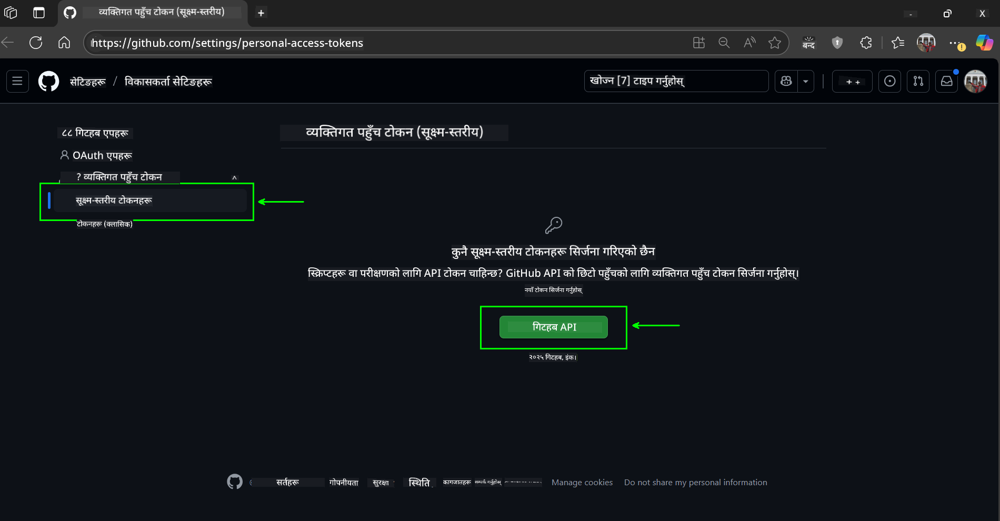
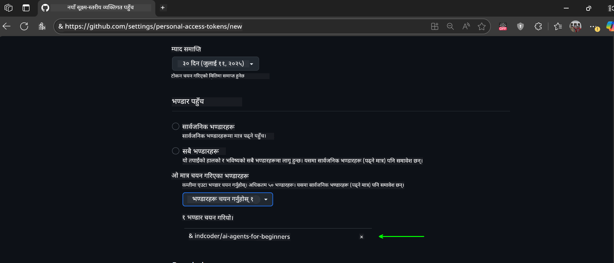
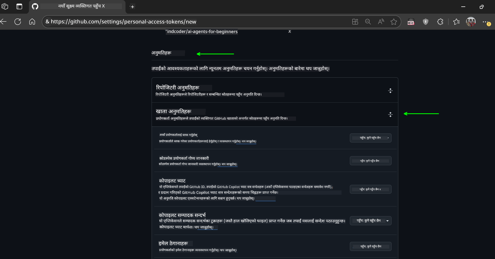

<!--
CO_OP_TRANSLATOR_METADATA:
{
  "original_hash": "c6a79c8f2b56a80370ff7e447765524f",
  "translation_date": "2025-07-24T08:06:00+00:00",
  "source_file": "00-course-setup/README.md",
  "language_code": "ne"
}
-->
# कोर्स सेटअप

## परिचय

यो पाठले यस कोर्सका कोड नमूनाहरू कसरी चलाउने भन्ने कुरा समेट्नेछ।

## यो रिपोजिटरी क्लोन वा फोर्क गर्नुहोस्

सुरु गर्न, कृपया GitHub रिपोजिटरी क्लोन वा फोर्क गर्नुहोस्। यसले तपाईंलाई कोर्स सामग्रीको आफ्नै संस्करण बनाउने मौका दिन्छ ताकि तपाईं कोड चलाउन, परीक्षण गर्न र परिमार्जन गर्न सक्नुहुन्छ!

यो लिंक क्लिक गरेर गर्न सकिन्छ:


## कोड चलाउने

यो कोर्सले Jupyter Notebooks को श्रृंखला प्रदान गर्दछ जसले तपाईंलाई AI एजेन्टहरू निर्माण गर्न व्यावहारिक अनुभव दिन्छ।

कोड नमूनाहरू निम्नमा आधारित छन्:

**GitHub खाता आवश्यक छ - निःशुल्क**:

1) Semantic Kernel Agent Framework + GitHub Models Marketplace। (semantic-kernel.ipynb) भनेर चिन्हित।
2) AutoGen Framework + GitHub Models Marketplace। (autogen.ipynb) भनेर चिन्हित।

**Azure सदस्यता आवश्यक छ**:
3) Azure AI Foundry + Azure AI Agent Service। (azureaiagent.ipynb) भनेर चिन्हित।

हामी तपाईंलाई यी तीन प्रकारका उदाहरणहरू सबै प्रयास गर्न प्रोत्साहित गर्छौं ताकि कुन तपाईंका लागि उपयुक्त छ भनेर पत्ता लगाउन सक्नुहुन्छ।

तपाईंले जुन विकल्प चयन गर्नुहुन्छ, त्यसले तलका सेटअप चरणहरू निर्धारण गर्नेछ:

## आवश्यकताहरू

- Python 3.12+
  - **NOTE**: यदि तपाईंले Python3.12 स्थापना गर्नुभएको छैन भने, यसलाई स्थापना गर्नुहोस्। त्यसपछि python3.12 प्रयोग गरेर आफ्नो venv बनाउनुहोस् ताकि requirements.txt फाइलबाट सही संस्करणहरू स्थापना गरियोस्।
- GitHub खाता - GitHub Models Marketplace पहुँचको लागि
- Azure सदस्यता - Azure AI Foundry पहुँचको लागि
- Azure AI Foundry खाता - Azure AI Agent Service पहुँचको लागि

हामीले यस रिपोजिटरीको मूलमा `requirements.txt` फाइल समावेश गरेका छौं जसमा कोड नमूनाहरू चलाउन आवश्यक सबै Python प्याकेजहरू छन्।

तपाईं यसलाई निम्न आदेश चलाएर स्थापना गर्न सक्नुहुन्छ:

```bash
pip install -r requirements.txt
```
हामी कुनै पनि द्वन्द्व र समस्याहरूबाट बच्न Python भर्चुअल वातावरण सिर्जना गर्न सिफारिस गर्छौं।

## VSCode सेटअप गर्नुहोस्
VSCode मा तपाईंले सही संस्करणको Python प्रयोग गरिरहनुभएको छ भनेर सुनिश्चित गर्नुहोस्।


## GitHub Models प्रयोग गरेर नमूनाहरूको सेटअप

### चरण १: आफ्नो GitHub Personal Access Token (PAT) प्राप्त गर्नुहोस्

यो कोर्सले GitHub Models Marketplace प्रयोग गर्दछ, जसले तपाईंलाई ठूलो भाषा मोडेलहरू (LLMs) नि:शुल्क पहुँच दिन्छ, जसलाई तपाईंले AI एजेन्टहरू निर्माण गर्न प्रयोग गर्नुहुनेछ।

GitHub Models प्रयोग गर्न, तपाईंले [GitHub Personal Access Token](https://docs.github.com/en/authentication/keeping-your-account-and-data-secure/managing-your-personal-access-tokens) सिर्जना गर्नुपर्नेछ।

यो तपाईंको GitHub खातामा गएर गर्न सकिन्छ।

कृपया [Principle of Least Privilege](https://docs.github.com/en/get-started/learning-to-code/storing-your-secrets-safely) पालना गर्नुहोस् जब तपाईं आफ्नो टोकन सिर्जना गर्नुहुन्छ। यसको मतलब तपाईंले टोकनलाई यस कोर्सका कोड नमूनाहरू चलाउन आवश्यक अनुमति मात्र दिनुपर्छ।

1. आफ्नो स्क्रिनको बायाँपट्टि `Fine-grained tokens` विकल्प चयन गर्नुहोस्।

    त्यसपछि `Generate new token` चयन गर्नुहोस्।

    

1. आफ्नो टोकनको उद्देश्य झल्काउने वर्णनात्मक नाम प्रविष्ट गर्नुहोस्, जसले पछि यसलाई सजिलैसँग पहिचान गर्न मद्दत गर्दछ। समाप्ति मिति सेट गर्नुहोस् (सिफारिस: ३० दिन; तपाईं चाहनुहुन्छ भने ७ दिन जस्तो छोटो अवधि चयन गर्न सक्नुहुन्छ।)

    

1. टोकनको स्कोपलाई यस रिपोजिटरीको फोर्कमा सीमित गर्नुहोस्।

    

1. टोकनको अनुमति प्रतिबन्धित गर्नुहोस्: **Permissions** अन्तर्गत, **Account Permissions** टगल गर्नुहोस्, **Models** मा जानुहोस् र GitHub Models को लागि आवश्यक मात्र पढ्ने पहुँच सक्षम गर्नुहोस्।

    

    

तपाईंले अहिले सिर्जना गर्नुभएको नयाँ टोकन प्रतिलिपि गर्नुहोस्। अब तपाईंले यसलाई यस कोर्समा समावेश गरिएको `.env` फाइलमा थप्नु हुनेछ।

### चरण २: आफ्नो `.env` फाइल सिर्जना गर्नुहोस्

तपाईंको टर्मिनलमा निम्न आदेश चलाएर आफ्नो `.env` फाइल सिर्जना गर्नुहोस्।

```bash
cp .env.example .env
```

यसले उदाहरण फाइललाई प्रतिलिपि गर्नेछ र `.env` तपाईंको डाइरेक्टरीमा सिर्जना गर्नेछ, जहाँ तपाईं वातावरण चरहरूको मानहरू भर्न सक्नुहुन्छ।

तपाईंको टोकन प्रतिलिपि गरेर, `.env` फाइललाई तपाईंको मनपर्ने पाठ सम्पादकमा खोल्नुहोस् र `GITHUB_TOKEN` फिल्डमा तपाईंको टोकन टाँस्नुहोस्।

अब तपाईं यस कोर्सका कोड नमूनाहरू चलाउन सक्षम हुनुहुनेछ।

## Azure AI Foundry र Azure AI Agent Service प्रयोग गरेर नमूनाहरूको सेटअप

### चरण १: आफ्नो Azure प्रोजेक्ट Endpoint प्राप्त गर्नुहोस्

Azure AI Foundry मा हब र प्रोजेक्ट सिर्जना गर्ने चरणहरू यहाँ पत्ता लगाउनुहोस्: [Hub resources overview](https://learn.microsoft.com/en-us/azure/ai-foundry/concepts/ai-resources)

एक पटक तपाईंले आफ्नो प्रोजेक्ट सिर्जना गर्नुभयो भने, तपाईंले आफ्नो प्रोजेक्टको लागि कनेक्शन स्ट्रिङ प्राप्त गर्नुपर्नेछ।

यो Azure AI Foundry पोर्टलमा तपाईंको प्रोजेक्टको **Overview** पृष्ठमा गएर गर्न सकिन्छ।


### चरण २: आफ्नो `.env` फाइल सिर्जना गर्नुहोस्

तपाईंको टर्मिनलमा निम्न आदेश चलाएर आफ्नो `.env` फाइल सिर्जना गर्नुहोस्।

```bash
cp .env.example .env
```

यसले उदाहरण फाइललाई प्रतिलिपि गर्नेछ र `.env` तपाईंको डाइरेक्टरीमा सिर्जना गर्नेछ, जहाँ तपाईं वातावरण चरहरूको मानहरू भर्न सक्नुहुन्छ।

तपाईंको टोकन प्रतिलिपि गरेर, `.env` फाइललाई तपाईंको मनपर्ने पाठ सम्पादकमा खोल्नुहोस् र `PROJECT_ENDPOINT` फिल्डमा तपाईंको टोकन टाँस्नुहोस्।

### चरण ३: Azure मा साइन इन गर्नुहोस्

सुरक्षा उत्तम अभ्यासको रूपमा, हामी [keyless authentication](https://learn.microsoft.com/azure/developer/ai/keyless-connections?tabs=csharp%2Cazure-cli?WT.mc_id=academic-105485-koreyst) प्रयोग गर्नेछौं Microsoft Entra ID को साथ Azure OpenAI मा प्रमाणित गर्न।

अर्को, टर्मिनल खोल्नुहोस् र `az login --use-device-code` चलाएर आफ्नो Azure खातामा साइन इन गर्नुहोस्।

एक पटक तपाईंले लग इन गर्नुभयो भने, टर्मिनलमा आफ्नो सदस्यता चयन गर्नुहोस्।

## थप वातावरण चरहरू - Azure Search र Azure OpenAI

Agentic RAG पाठ - पाठ ५ - का लागि Azure Search र Azure OpenAI प्रयोग गर्ने नमूनाहरू छन्।

यदि तपाईं यी नमूनाहरू चलाउन चाहनुहुन्छ भने, तपाईंले आफ्नो `.env` फाइलमा निम्न वातावरण चरहरू थप्नुपर्नेछ:

### Overview पृष्ठ (प्रोजेक्ट)

- `AZURE_SUBSCRIPTION_ID` - **Overview** पृष्ठको **Project details** मा जाँच गर्नुहोस्।

- `AZURE_AI_PROJECT_NAME` - तपाईंको प्रोजेक्टको **Overview** पृष्ठको शीर्षमा हेर्नुहोस्।

- `AZURE_OPENAI_SERVICE` - **Overview** पृष्ठको **Included capabilities** ट्याबमा **Azure OpenAI Service** को लागि हेर्नुहोस्।

### व्यवस्थापन केन्द्र

- `AZURE_OPENAI_RESOURCE_GROUP` - **Management Center** को **Overview** पृष्ठमा **Project properties** मा जानुहोस्।

- `GLOBAL_LLM_SERVICE` - **Connected resources** अन्तर्गत, **Azure AI Services** कनेक्शन नाम फेला पार्नुहोस्। यदि सूचीबद्ध छैन भने, आफ्नो स्रोत समूह अन्तर्गत Azure पोर्टलमा AI Services स्रोत नाम जाँच गर्नुहोस्।

### Models + Endpoints पृष्ठ

- `AZURE_OPENAI_EMBEDDING_DEPLOYMENT_NAME` - आफ्नो embedding मोडेल (जस्तै, `text-embedding-ada-002`) चयन गर्नुहोस् र मोडेल विवरणबाट **Deployment name** नोट गर्नुहोस्।

- `AZURE_OPENAI_CHAT_DEPLOYMENT_NAME` - आफ्नो chat मोडेल (जस्तै, `gpt-4o-mini`) चयन गर्नुहोस् र मोडेल विवरणबाट **Deployment name** नोट गर्नुहोस्।

### Azure पोर्टल

- `AZURE_OPENAI_ENDPOINT` - **Azure AI services** हेर्नुहोस्, यसमा क्लिक गर्नुहोस्, त्यसपछि **Resource Management**, **Keys and Endpoint** मा जानुहोस्, "Azure OpenAI endpoints" मा स्क्रोल गर्नुहोस्, र "Language APIs" भन्ने एउटा प्रतिलिपि गर्नुहोस्।

- `AZURE_OPENAI_API_KEY` - त्यही स्क्रिनबाट, KEY 1 वा KEY 2 प्रतिलिपि गर्नुहोस्।

- `AZURE_SEARCH_SERVICE_ENDPOINT` - आफ्नो **Azure AI Search** स्रोत फेला पार्नुहोस्, यसमा क्लिक गर्नुहोस्, र **Overview** हेर्नुहोस्।

- `AZURE_SEARCH_API_KEY` - त्यसपछि **Settings** मा जानुहोस् र **Keys** मा गएर प्राथमिक वा द्वितीयक प्रशासक कुञ्जी प्रतिलिपि गर्नुहोस्।

### बाह्य वेबपृष्ठ

- `AZURE_OPENAI_API_VERSION` - [API version lifecycle](https://learn.microsoft.com/en-us/azure/ai-services/openai/api-version-deprecation#latest-ga-api-release) पृष्ठ अन्तर्गत **Latest GA API release** हेर्नुहोस्।

### Keyless authentication सेटअप गर्नुहोस्

तपाईंको प्रमाणहरू हार्डकोड नगरी, हामी Azure OpenAI सँग keyless कनेक्शन प्रयोग गर्नेछौं। यसका लागि, हामी `DefaultAzureCredential` आयात गर्नेछौं र पछि `DefaultAzureCredential` फङ्सनलाई credential प्राप्त गर्न कल गर्नेछौं।

```python
from azure.identity import DefaultAzureCredential, InteractiveBrowserCredential
```

## कतै अड्किनुभयो?

यदि तपाईंलाई यो सेटअप चलाउन कुनै समस्या छ भने, हाम्रो

## अर्को पाठ

अब तपाईं यो कोर्सको कोड चलाउन तयार हुनुहुन्छ। AI एजेन्टहरूको संसारबारे थप सिक्न शुभकामना!

[AI एजेन्टहरू र एजेन्ट प्रयोग केसहरूको परिचय](../01-intro-to-ai-agents/README.md)

**अस्वीकरण**:  
यो दस्तावेज़ AI अनुवाद सेवा [Co-op Translator](https://github.com/Azure/co-op-translator) प्रयोग गरेर अनुवाद गरिएको छ। हामी यथार्थताको लागि प्रयास गर्छौं, तर कृपया ध्यान दिनुहोस् कि स्वचालित अनुवादहरूमा त्रुटिहरू वा अशुद्धताहरू हुन सक्छ। यसको मूल भाषा मा रहेको मूल दस्तावेज़लाई आधिकारिक स्रोत मानिनुपर्छ। महत्वपूर्ण जानकारीको लागि, व्यावसायिक मानव अनुवाद सिफारिस गरिन्छ। यस अनुवादको प्रयोगबाट उत्पन्न हुने कुनै पनि गलतफहमी वा गलत व्याख्याको लागि हामी जिम्मेवार हुने छैनौं।