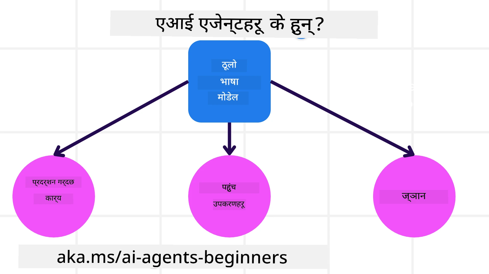
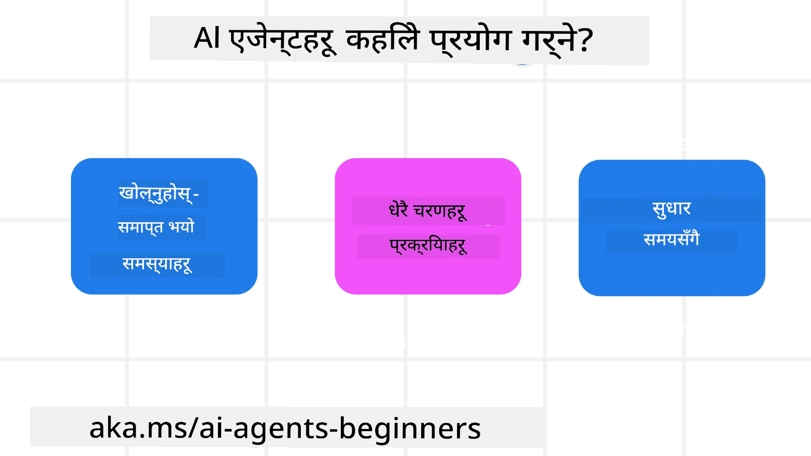

> _(उपरोक्त छविमा क्लिक गरी यस पाठको भिडियो हेर्नुहोस्)_

# AI एजेन्टहरू र एजेन्ट प्रयोग केसहरूमा परिचय

Welcome to the "AI Agents for Beginners" course! This course provides fundamental knowledge and applied samples for building AI Agents.

Join the <a href="https://discord.gg/kzRShWzttr" target="_blank">Azure AI Discord समुदाय</a> to meet other learners and AI Agent Builders and ask any questions you have about this course.

To start this course, we begin by getting a better understanding of what AI Agents are and how we can use them in the applications and workflows we build.

## परिचय

This lesson covers:

- What are AI Agents and what are the different types of agents?
- What use cases are best for AI Agents and how can they help us?
- What are some of the basic building blocks when designing Agentic Solutions?

## सिकाइ लक्ष्यहरू
After completing this lesson, you should be able to:

- Understand AI Agent concepts and how they differ from other AI solutions.
- Apply AI Agents most efficiently.
- Design Agentic solutions productively for both users and customers.

## AI एजेन्टहरूको परिभाषा र प्रकारहरू

### AI एजेन्टहरू के हुन्?

AI एजेन्टहरू **प्रणालीहरू** हुन् जसले **ठूला भाषा मोडेलहरू(LLMs)** लाई उनीहरूको क्षमता विस्तार गरेर LLMs लाई **उपकरणहरूमा पहुँच** र **ज्ञान** दिएर **कार्यहरू गर्न** सक्षम बनाउँछन्।

Let's break this definition into smaller parts:

- **System** - It's important to think about agents not as just a single component but as a system of many components. At the basic level, the components of an AI Agent are:
  - **Environment** - The defined space where the AI Agent is operating. For example, if we had a travel booking AI Agent, the environment could be the travel booking system that the AI Agent uses to complete tasks.
  - **Sensors** - Environments have information and provide feedback. AI Agents use sensors to gather and interpret this information about the current state of the environment. In the Travel Booking Agent example, the travel booking system can provide information such as hotel availability or flight prices.
  - **Actuators** - Once the AI Agent receives the current state of the environment, for the current task the agent determines what action to perform to change the environment. For the travel booking agent, it might be to book an available room for the user.

**ठूला भाषा मोडेलहरू(LLMs)** - एजेन्टहरूको अवधारणा LLMs को सिर्जना हुनु अघि नै अस्तित्वमा थियो। LLMs सँग AI एजेन्टहरू निर्माण गर्दा फाइदा भनेको मानिसको भाषा र डाटा व्याख्या गर्ने क्षमता हो। यस क्षमतालाई प्रयोग गरेर LLMs वातावरणीय जानकारी व्याख्या गर्न र वातावरण परिवर्तन गर्ने योजना परिभाषित गर्न सक्षम हुन्छन्।

**कार्यहरू सञ्चालन** - AI एजेन्ट प्रणाली बाहिर, LLMs प्रायः प्रयोगकर्ताको प्रम्प्टको आधारमा सामग्री वा जानकारी उत्पन्न गर्ने कार्यमा सीमित हुन्छन्। AI एजेन्ट प्रणाली भित्र, LLMs प्रयोगकर्ताको अनुरोध व्याख्या गरेर र वातावरणमा उपलब्ध उपकरणहरू प्रयोग गरेर कार्यहरू पूरा गर्न सक्छन्।

**उपकरणहरूमा पहुँच** - LLM ले कुन उपकरणहरू पहुँच गर्न सक्छ भन्ने कुरा परिभाषित हुन्छ: 1) त्यो कुन वातावरणमा काम गरिरहेको छ र 2) AI एजेन्टको विकासकर्ताले के सीमाहरू राख्छ। हाम्रो यात्रा एजेन्टको उदाहरणमा, एजेन्टका उपकरणहरू बुकिङ प्रणालीमा उपलब्ध अपरेसनहरूले सीमित हुन्छन्, र/वा विकासकर्ताले एजेन्टको उपकरण पहुँचलाई फ्लाइटहरूमा सीमित गर्न सक्छ।

**स्मृति+ज्ञान** - स्मृति प्रयोगकर्ता र एजेन्ट बीचको संवादको सन्दर्भमा छोटो अवधिको हुन सक्छ। लामो अवधिमा, वातावरणले प्रदान गरेको जानकारी बाहेक, AI एजेन्टहरूले अन्य प्रणालीहरू, सेवाहरू, उपकरणहरू, र अन्य एजेन्टहरूबाट पनि ज्ञान पुनर्स्रोत गर्न सक्छन्। यात्रा एजेन्टको उदाहरणमा, यो ज्ञान ग्राहक डाटाबेसमा रहेको प्रयोगकर्ताका यात्रा प्राथमिकताहरूको जानकारी हुन सक्छ।

### एजेन्टका विभिन्न प्रकारहरू

Now that we have a general definition of AI Agents, let us look at some specific agent types and how they would be applied to a travel booking AI agent.

| **एजेन्ट प्रकार**                | **विवरण**                                                                                                                       | **उदाहरण**                                                                                                                                                                                                                   |
| ----------------------------- | ------------------------------------------------------------------------------------------------------------------------------------- | ----------------------------------------------------------------------------------------------------------------------------------------------------------------------------------------------------------------------------- |
| **Simple Reflex Agents**      | पूर्वनिर्धारित नियमहरूमा आधारित तुरुन्त कार्यहरू गर्ने।                                                                                  | यात्रा एजेन्टले इमेलको सन्दर्भ व्याख्या गरेर यात्रा गुनासोहरूलाई ग्राहक सेवा समक्ष अग्रेषित गर्छ।                                                                                                                          |
| **Model-Based Reflex Agents** | विश्वको मोडेल र त्यस मोडेलमा हुने परिवर्तनहरूको आधारमा कार्यहरू गर्ने।                                                              | यात्रा एजेन्टले ऐतिहासिक मूल्य डेटा पहुँचको आधारमा महत्वपूर्ण मूल्य परिवर्तन भएका मार्गहरूलाई प्राथमिकता दिन्छ।                                                                                                             |
| **Goal-Based Agents**         | लक्ष्यलाई व्याख्या गरेर र त्यसमा पुग्न आवश्यक कार्यहरू निर्धारण गरेर विशेष लक्ष्यहरू प्राप्त गर्न योजना बनाउने।                                  | यात्रा एजेन्टले हालको स्थानबाट गन्तव्यसम्म पुग्न आवश्यक यात्रा व्यवस्था (कार, सार्वजनिक यातायात, उडानहरू) निर्धारण गरी यात्रा बुक गर्छ।                                                                                |
| **Utility-Based Agents**      | पसन्दहरू विचार गरेर लक्ष्य प्राप्तिका लागि सन्तुलन र व्यापार-व्यवहार (tradeoffs) लाई गणितीय रूपमा तौल गर्ने।                                               | यात्रा एजेन्टले यात्रा बुक गर्दा सुविधाजनकता र लागतलाई तौल गरेर उपयोगिता अधिकतम बनाउँछ।                                                                                                                                          |
| **Learning Agents**           | फिडब्याकको उत्तर दिएर र तदनुसार कार्यहरू समायोजन गरेर समयसँग सुधार गर्ने।                                                        | यात्रा एजेन्टले यात्रापछि सर्वेक्षणबाट प्राप्त ग्राहक प्रतिक्रियाको प्रयोग गरेर भविष्यका बुकिङहरू परिवर्तन गर्छ।                                                                                                               |
| **Hierarchical Agents**       | टियर प्रणालीमा अनेक एजेन्टहरू समावेश गरिने, जहाँ उच्च-स्तरीय एजेन्टहरूले कार्यहरूलाई तल्लो-स्तरीय एजेन्टहरूले पूरा गर्न उपकार्यहरूमा विभाजन गर्छन्। | यात्रा एजेन्टले कुनै यात्रा रद्द गर्दा कार्यलाई उपकार्यहरूमा विभाजन गर्छ (उदाहरणका लागि, विशेष बुकिङहरू रद्द गर्नु) र तल्लो-स्तरीय एजेन्टहरूलाई ती पूरा गराएर उच्च-स्तरीय एजेन्टलाई रिपोर्ट गर्छ।                                     |
| **Multi-Agent Systems (MAS)** | एजेन्टहरूले स्वतन्त्र रूपमा कार्यहरू पूरा गर्ने, सहकारी वा प्रतिस्पर्धात्मक रूपमा।                                                           | सहकारी: बहु एजेन्टहरूले होटल, उडान, र मनोरञ्जन जस्ता विशिष्ट यात्रा सेवाहरू बुक गर्छन्। प्रतिस्पर्धात्मक: बहु एजेन्टहरूले साझा होटल बुकिङ क्यालेन्डरमा व्यवस्थापन र प्रतिस्पर्धा गरेर ग्राहकहरूको लागि कोठा बुक गर्छन्। |

## कहिले AI एजेन्टहरू प्रयोग गर्ने

In the earlier section, we used the Travel Agent use-case to explain how the different types of agents can be used in different scenarios of travel booking. We will continue to use this application throughout the course.

Let's look at the types of use cases that AI Agents are best used for:

- **खुला-समाप्तिका समस्याहरू** - LLM लाई आवश्यक कदमहरू निर्धारण गर्न अनुमति दिने, किनकि यी सधैं वर्कफ्लोमा हार्डकोड गर्न सम्भव हुँदैन।
- **बहु-चरणीय प्रक्रियाहरू** - त्यस्ता कार्यहरू जसले जटिलताको स्तर माग्छ जहाँ AI एजेन्टले एकल पटकको पुनःप्राप्ति सट्टा एकभन्दा बढी चरणहरूमा उपकरणहरू वा जानकारी प्रयोग गर्नुपर्छ।  
- **समयसँग सुधार** - त्यस्ता कार्यहरू जहाँ एजेन्टले वातावरण वा प्रयोगकर्ताबाट फिडब्याक प्राप्त गरेर समयसँगै सुधार गर्न सक्छ र राम्रो उपयोगिता प्रदान गर्न सक्छ।

We cover more considerations of using AI Agents in the Building Trustworthy AI Agents lesson.

## एजेण्टिक समाधानहरूको आधारभूत कुरा

### एजेण्ट विकास

The first step in designing an AI Agent system is to define the tools, actions, and behaviors. In this course, we focus on using the **Azure AI Agent Service** to define our Agents. It offers features like:

- Selection of Open Models such as OpenAI, Mistral, and Llama
- Use of Licensed Data through providers such as Tripadvisor
- Use of standardized OpenAPI 3.0 tools

### एजेण्टिक ढाँचाहरू

Communication with LLMs is through prompts. Given the semi-autonomous nature of AI Agents, it isn't always possible or required to manually reprompt the LLM after a change in the environment. We use **एजेण्टिक ढाँचाहरू** that allow us to prompt the LLM over multiple steps in a more scalable way.

This course is divided into some of the current popular Agentic patterns.

### एजेण्टिक फ्रेमवर्कहरू

Agentic Frameworks allow developers to implement agentic patterns through code. These frameworks offer templates, plugins, and tools for better AI Agent collaboration. These benefits provide abilities for better observability and troubleshooting of AI Agent systems.

In this course, we will explore the Microsoft Agent Framework (MAF) for building production-ready AI agents.

## नमूना कोडहरू

- Python: [एजेण्ट फ्रेमवर्क](./code_samples/01-python-agent-framework.ipynb)
- .NET: [एजेण्ट फ्रेमवर्क](./code_samples/01-dotnet-agent-framework.md)

## AI एजेन्टहरू बारे थप प्रश्नहरू छन्?

Join the [Microsoft Foundry Discord](https://aka.ms/ai-agents/discord) to meet with other learners, attend office hours and get your AI Agents questions answered.

## अघिल्लो पाठ

[पाठ्यक्रम सेटअप](../00-course-setup/README.md)

## अर्को पाठ

[एजेण्टिक फ्रेमवर्कहरू अन्वेषण](../02-explore-agentic-frameworks/README.md)

---

<!-- CO-OP TRANSLATOR DISCLAIMER START -->
अस्वीकरण:
यो दस्तावेज AI अनुवाद सेवा Co-op Translator (https://github.com/Azure/co-op-translator) प्रयोग गरेर अनुवाद गरिएको हो। हामी शुद्धताको लागि प्रयास गर्छौं, तर कृपया ध्यान दिनुहोस् कि स्वचालित अनुवादमा त्रुटि वा असन्तुष्टता हुनसक्छ। मूल भाषामा रहेको दस्तावेजलाई आधिकारिक स्रोत मान्नुपर्छ। महत्वपूर्ण जानकारीका लागि पेशेवर मानव अनुवाद सिफारिस गरिन्छ। यस अनुवादको प्रयोगबाट उत्पन्न भएका कुनै पनि गलतफहमी वा गलत व्याख्याका लागि हामी उत्तरदायी छैनौं।
<!-- CO-OP TRANSLATOR DISCLAIMER END -->