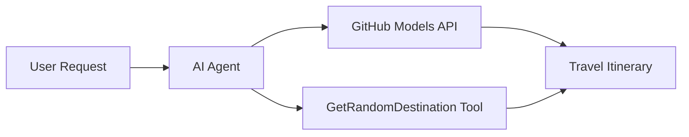

# 🌍 माइक्रोसफ्ट एजेन्ट फ्रेमवर्क (.NET) संग AI ट्राभल एजेन्ट

## 📋 परिदृश्यको अवलोकन

यो नोटबुकले माइक्रोसफ्ट एजेन्ट फ्रेमवर्कको प्रयोग गरेर एक बुद्धिमान यात्रा योजना बनाउने एजेन्ट कसरी निर्माण गर्ने भनेर देखाउँछ। यो एजेन्टले विश्वभरका विभिन्न गन्तव्यहरूको लागि व्यक्तिगत दिन-यात्राको योजना स्वतः तयार गर्न सक्छ।

**मुख्य क्षमताहरू:**
- 🎲 **र्यान्डम गन्तव्य चयन**: छुट्टीको स्थान चयन गर्न कस्टम टूल प्रयोग गर्दछ
- 🗺️ **बुद्धिमान यात्रा योजना**: विस्तृत दिन-प्रतिदिनको यात्रा योजना बनाउँछ
- 🔄 **रियल-टाइम स्ट्रिमिङ**: तत्काल र स्ट्रिमिङ प्रतिक्रियाहरूलाई समर्थन गर्दछ
- 🛠️ **कस्टम टूल एकीकरण**: एजेन्टको क्षमताहरू विस्तार गर्ने तरिका देखाउँछ

## 🔧 प्राविधिक वास्तुकला

### मुख्य प्रविधिहरू
- **माइक्रोसफ्ट एजेन्ट फ्रेमवर्क**: AI एजेन्ट विकासको लागि .NET को नवीनतम कार्यान्वयन
- **GitHub मोडेल्स एकीकरण**: GitHub को AI मोडेल इन्फरेन्स सेवा प्रयोग गर्दछ
- **OpenAI API अनुकूलता**: कस्टम अन्तर्क्रियासँग OpenAI क्लाइन्ट लाइब्रेरी प्रयोग गर्दछ
- **सुरक्षित कन्फिगरेसन**: वातावरण-आधारित API कुञ्जी व्यवस्थापन

### मुख्य घटकहरू
1. **AIAgent**: मुख्य एजेन्ट आयोजक जसले संवाद प्रवाहलाई व्यवस्थापन गर्दछ
2. **कस्टम टूलहरू**: `GetRandomDestination()` फङ्सन एजेन्टलाई उपलब्ध छ
3. **च्याट क्लाइन्ट**: GitHub मोडेल्स-समर्थित संवाद इन्टरफेस
4. **स्ट्रिमिङ समर्थन**: रियल-टाइम प्रतिक्रिया उत्पादन क्षमताहरू

### एकीकरण ढाँचा


## 🚀 सुरु गर्दै

**पूर्वापेक्षाहरू:**
- .NET 9.0 वा उच्च
- GitHub मोडेल्स API पहुँच टोकन
- `.env` फाइलमा कन्फिगर गरिएको वातावरण चरहरू

**आवश्यक वातावरण चरहरू:**
```env
GITHUB_TOKEN=your_github_token
GITHUB_ENDPOINT=https://models.inference.ai.azure.com
GITHUB_MODEL_ID=gpt-4o-mini
```

तलका सेलहरू क्रमशः चलाउनुहोस् र ट्राभल एजेन्टलाई कार्यमा हेर्नुहोस्!

---

## .NET Single File App: AI Travel Agent Example

See `01-dotnet-agent-framework.cs` for the complete runnable code sample.

तलको कोड नमूना चलाउनुहोस्:

```bash
dotnet run 01-dotnet-agent-framework.cs
```

### Sample Code

```csharp
static string GetRandomDestination()
{
    var destinations = new List<string>
    {
        "Paris, France",
        "Tokyo, Japan",
        "New York City, USA",
        "Sydney, Australia",
        "Rome, Italy",
        "Barcelona, Spain",
        "Cape Town, South Africa",
        "Rio de Janeiro, Brazil",
        "Bangkok, Thailand",
        "Vancouver, Canada"
    };
    var random = new Random();
    int index = random.Next(destinations.Count);
    return destinations[index];
}

// Extract configuration from environment variables
var github_endpoint = Environment.GetEnvironmentVariable("GITHUB_ENDPOINT") ?? throw new InvalidOperationException("GITHUB_ENDPOINT is not set.");
var github_model_id = Environment.GetEnvironmentVariable("GITHUB_MODEL_ID") ?? "gpt-4o-mini";
var github_token = Environment.GetEnvironmentVariable("GITHUB_TOKEN") ?? throw new InvalidOperationException("GITHUB_TOKEN is not set.");

// Configure OpenAI Client Options
var openAIOptions = new OpenAIClientOptions()
{
    Endpoint = new Uri(github_endpoint)
};

// Initialize OpenAI Client with GitHub Models Configuration
var openAIClient = new OpenAIClient(new ApiKeyCredential(github_token), openAIOptions);

// Create AI Agent with Travel Planning Capabilities
AIAgent agent = openAIClient
    .GetChatClient(github_model_id)
    .CreateAIAgent(
        instructions: "You are a helpful AI Agent that can help plan vacations for customers at random destinations",
        tools: [AIFunctionFactory.Create(GetRandomDestination)]
    );

// Execute Agent: Plan a Day Trip (Non-Streaming)
Console.WriteLine(await agent.RunAsync("Plan me a day trip"));

// Execute Agent: Plan a Day Trip (Streaming Response)
await foreach (var update in agent.RunStreamingAsync("Plan me a day trip"))
{
    Console.Write(update);
}
```
