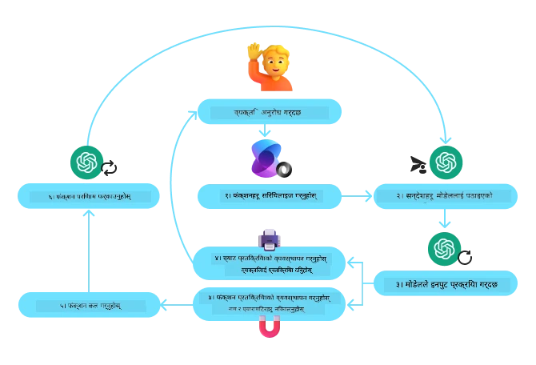
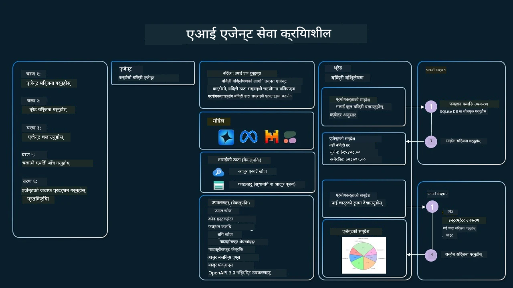

[](https://youtu.be/vieRiPRx-gI?si=cEZ8ApnT6Sus9rhn)

> _(यो पाठको भिडियो हेर्न माथिको तस्वीरमा क्लिक गर्नुहोस्)_

# उपकरण प्रयोग डिजाइन ढाँचा

अधिकारहरू रोचक हुन्छन् किनकि यसले AI एजेन्टहरूलाई फराकिलो क्षमताको दायरामा पुग्न अनुमति दिन्छ। एजेन्टले सीमित कार्यहरूको सेट गर्ने सट्टा, उपकरण थपेर एजेन्टले अब फराकिलो दायराका कार्यहरू गर्न सक्छ। यस अध्यायमा, हामी उपकरण प्रयोग डिजाइन ढाँचाको बारेमा अध्ययन गर्नेछौं, जसले AI एजेन्टहरूले आफ्ना लक्ष्यहरू हासिल गर्न कसरी विशेष उपकरणहरू प्रयोग गर्न सक्छन् भन्ने कुरा वर्णन गर्छ।

## परिचय

यस पाठमा हामी निम्न प्रश्नहरूको उत्तर खोज्दैछौं:

- उपकरण प्रयोग डिजाइन ढाँचा के हो?
- कुन प्रयोग केसहरूमा यसलाई लागू गर्न सकिन्छ?
- डिजाइन ढाँचा कार्यान्वयन गर्न आवश्यक तत्वहरू/निर्माण ब्लकहरू के के हुन्?
- विश्वासिलो AI एजेन्टहरू बनाउन उपकरण प्रयोग डिजाइन ढाँचा प्रयोग गर्दा विशेष विचारहरू के के हुन्?

## सिकाइ लक्ष्यहरू

यस पाठ पूरा गरेपछि तपाईले गर्न सक्नुहुनेछ:

- उपकरण प्रयोग डिजाइन ढाँचाको परिभाषा र यसको उद्देश्य बताउन।
- उपकरण प्रयोग डिजाइन ढाँचा लागू गर्न सकिने प्रयोग केसहरू चिन्हित गर्न।
- डिजाइन ढाँचा कार्यान्वयन गर्दा आवश्यक प्रमुख तत्वहरू बुझ्न।
- यस डिजाइन ढाँचामा आधारित AI एजेन्टहरूको विश्वासनीयता सुनिश्चित गर्न विचारहरू बुझ्न।

## उपकरण प्रयोग डिजाइन ढाँचा के हो?

**उपकरण प्रयोग डिजाइन ढाँचा** ले LLM हरूलाई बाह्य उपकरणहरूसँग अन्तरक्रिया गर्ने क्षमता दिने कुरामा केन्द्रित छ जसले विशेष लक्ष्यहरू पूरा गर्छ। उपकरणहरू कोड हुन् जुन एजेन्टले कार्यहरू गर्नका लागि चलाउन सक्छ। एउटा उपकरणले क्यालकुलेटर जस्तो सरल कार्य गर्न सक्ने फङ्सन हुन सक्छ, या तेस्रो पक्ष सेवाको API कल जस्तै स्टक मूल्य खोजी वा मौसम पूर्वानुमान हुन सक्छ। AI एजेन्टहरूको सन्दर्भमा, उपकरणहरूलाई **मोडेल-जेनरेट गरिएको फङ्सन कलहरू** को जवाफमा एजेन्टहरूले चलाउने गरी डिजाइन गरिएको हुन्छ।

## कुन प्रयोग केसहरूमा यसलाई लागू गर्न सकिन्छ?

AI एजेन्टहरूले जटिल कार्यहरू पूरा गर्न, जानकारी प्राप्त गर्न, वा निर्णय लिन उपकरणहरू प्रयोग गर्न सक्छन्। उपकरण प्रयोग डिजाइन ढाँचा प्रायः गतिशील अन्तरक्रियाको आवश्यकता पर्ने परिदृश्यहरूमा प्रयोग गरिन्छ, जस्तै डेटाबेसहरू, वेब सेवा, वा कोड व्याख्याकारहरूसँग। यो क्षमता विभिन्न प्रयोग केसहरूमा उपयोगी छ, जसमध्ये केही यस्ता छन्:

- **गतिशील सूचना प्राप्ति:** एजेन्टहरूले बाह्य API वा डेटाबेसहरूमा क्वेरी गरेर नवीनतम डेटा ल्याउन सक्छन् (जस्तै, डेटा विश्लेषणका लागि SQLite डेटाबेस क्वेरी, स्टक मूल्य वा मौसम जानकारी ल्याउने)।
- **कोड कार्यान्वयन र व्याख्या:** एजेन्टहरूले गणितीय समस्याहरू समाधान गर्न, रिपोर्टहरू तयार गर्न, वा सिमुलेशन गर्न कोड चलाउन सक्छन्।
- **कार्यप्रवाह स्वचालन:** कार्य अनुसूचक, इमेल सेवा, वा डेटा पाइपलाइनहरू जस्ता उपकरणहरूलाई एकीकृत गरेर दोहोरो वा बहु-चरण कार्यप्रवाहहरू स्वचालित गर्ने।
- **ग्राहक समर्थन:** एजेन्टहरूले CRM प्रणाली, टिकटिङ प्लेटफर्म, वा ज्ञान आधारहरूसँग अन्तरक्रिया गरेर प्रयोगकर्ताका प्रश्नहरूको समाधान गर्न सक्छन्।
- **सामग्री सिर्जना र सम्पादन:** एजेन्टहरूले व्याकरण जाँच, पाठ सारांश, वा सामग्री सुरक्षितता मूल्याङ्कनजस्ता उपकरणहरू प्रयोग गरेर सामग्री सिर्जनामा सहयोग गर्न सक्छन्।

## उपकरण प्रयोग डिजाइन ढाँचा कार्यान्वयन गर्न आवश्यक तत्वहरू/निर्माण ब्लकहरू के हुन्?

यी निर्माण ब्लकहरूले AI एजेन्टलाई फराकिलो दायराका कार्यहरू गर्न अनुमति दिन्छ। आउनुहोस् उपकरण प्रयोग डिजाइन ढाँचा कार्यान्वयन गर्न आवश्यक मुख्य तत्वहरू हेरौं:

- **फङ्सन/उपकरण स्किमाहरू**: उपलब्ध उपकरणहरूको विस्तृत परिभाषाहरू, जसमा फङ्सन नाम, उद्देश्य, आवश्यक प्यारामिटरहरू, र अपेक्षित आउटपुटहरू समावेश छन्। यी स्किमाहरूले LLM लाई के उपकरणहरू उपलब्ध छन् र कसरी मान्य अनुरोध बनाउने भनी बुझ्न सक्षम पार्छ।

- **फङ्सन कार्यान्वयन तर्क:** प्रयोगकर्ताको अभिप्राय र संवाद सन्दर्भको आधारमा उपकरणहरू कहिले र कसरी कल गर्ने नियमन गर्दछ। यसमा योजनाकार मोड्युलहरू, रूटिङ मिकेनिज्महरू, वा सशर्त प्रवाहहरू समावेश हुन सक्छ जुन उपकरण प्रयोगलाई गतिशील रूपमा निर्धारण गर्छ।

- **सन्देश व्यवस्थापन प्रणाली:** प्रयोगकर्ता इनपुटहरू, LLM प्रतिक्रियाहरू, उपकरण कलहरू, र उपकरण परिणामहरूको बीच संवाद प्रवाह व्यवस्थापन गर्ने कम्पोनेन्टहरू।

- **उपकरण एकीकरण फ्रेमवर्क:** एजेन्टलाई विभिन्न उपकरणहरू जडान गर्ने पूर्वाधार, चाहें तिनीहरू सरल फङ्सनहरू हुन् वा जटिल बाह्य सेवाहरू।

- **त्रुटि व्यवस्थापन र प्रमाणीकरण:** उपकरण कार्यान्वयनमा असफलताहरूको व्यवस्थापन, प्यारामिटरहरूको प्रमाणीकरण, र अप्रत्याशित प्रतिक्रियाहरूको व्यवस्थित व्यवस्थापन गर्ने मेकानिज्महरू।

- **अवस्था व्यवस्थापन:** बहु-चरण अन्तरक्रियाहरूमा स्थिरतालाई सुनिश्चित गर्दै संवाद सन्दर्भ, पूर्व उपकरण अन्तरक्रियाहरू, र निरंतर डेटा ट्र्याक गर्ने।

अब, फङ्सन/उपकरण कललाई विस्तारमा हेरौं।

### फङ्सन/उपकरण कल

फङ्सन कल ठूलो भाषा मोडेलहरू (LLMs) लाई उपकरणहरूसँग अन्तरक्रिया गर्न सक्षम गराउने प्राथमिक तरिका हो। तपाईंले अक्सर 'फङ्सन' र 'उपकरण' शब्दहरू परस्पर प्रयोग हुन्छन् किनकि 'फङ्सनहरू' (पुन: प्रयोग गर्न मिल्ने कोडका ब्लकहरू) एजेन्टहरूले कार्यहरू पूरा गर्न प्रयोग गर्ने 'उपकरणहरू' हुन्। एउटा फङ्सनको कोडलाई कार्यान्वयन गर्न, LLM ले प्रयोगकर्ताको अनुरोधलाई फङ्सनको विवरणसँग तुलना गर्नुपर्छ। यसका लागि सबै उपलब्ध फङ्सनहरूको विवरण भएको स्किमा LLM लाई पठाइन्छ। त्यसपछि LLMले कार्यको लागि सबैभन्दा उपयुक्त फङ्सन चयन गरी यसको नाम र तर्कहरू फर्काउँछ। चयन गरिएको फङ्सनलाई चलाइन्छ, यसको प्रतिक्रिया LLM लाई पठाइन्छ, जसले त्यस जानकारी प्रयोगकर्ताको अनुरोधको जवाफ बनाउन प्रयोग गर्छ।

एजेन्टहरूका लागि फङ्सन कल कार्यान्वयन गर्न तपाईलाई आवश्यक हुनेछ:

1. फङ्सन कल समर्थन गर्ने LLM मोडेल
2. फङ्सन विवरण भएका स्किमा
3. प्रत्येक फङ्सनको कोड

हामी सहरमा हालको समय पत्ता लगाउने उदाहरण प्रयोग गरौं:

1. **फङ्सन कल समर्थन गर्ने LLM आरम्भ गर्नुहोस्:**

    सबै मोडेलहरूले फङ्सन कल समर्थन गर्दैनन्, त्यसैले तपाईले प्रयोग गर्दै हुनु भएको LLM यसले गर्छ कि गर्दैन जाँच गर्नु महत्त्वपूर्ण छ। <a href="https://learn.microsoft.com/azure/ai-services/openai/how-to/function-calling" target="_blank">Azure OpenAI</a> ले फङ्सन कल समर्थन गर्दछ। हामी Azure OpenAI क्लाइन्ट सुरु गरेर सुरु गर्न सक्छौं।

    ```python
    # Azure OpenAI क्लाइन्टलाई सुरु गर्नुहोस्
    client = AzureOpenAI(
        azure_endpoint = os.getenv("AZURE_AI_PROJECT_ENDPOINT"), 
        api_key=os.getenv("AZURE_OPENAI_API_KEY"),  
        api_version="2024-05-01-preview"
    )
    ```

1. **फङ्सन स्किमा बनाउनुहोस्:**

    अब हामी एउटा JSON स्किमा परिभाषित गर्नेछौं जसमा फङ्सन नाम, फङ्सन के गर्छ भन्ने वर्णन, र फङ्सन प्यारामिटरहरूका नाम र विवरण हुन्छ।
    त्यसपछि यो स्किमा पहिले बनाएको क्लाइन्टमा पठाउनेछौं, साथै प्रयोगकर्ताको अनुरोध पनि पठाउनेछौं जसले सान फ्रान्सिस्कोको समय खोज्दछ। महत्वपूर्ण कुरा के हो भने **टूल कल** फर्काइन्छ, **प्रश्नको अन्तिम उत्तर होइन**। पहिले भनिएझैँ, LLM ले कार्यका लागि चयन गरेको फङ्सनको नाम र त्यसलाई पठाइने तर्कहरू फर्काउँछ।

    ```python
    # मोडेलले पढ्ने कार्य विवरण
    tools = [
        {
            "type": "function",
            "function": {
                "name": "get_current_time",
                "description": "Get the current time in a given location",
                "parameters": {
                    "type": "object",
                    "properties": {
                        "location": {
                            "type": "string",
                            "description": "The city name, e.g. San Francisco",
                        },
                    },
                    "required": ["location"],
                },
            }
        }
    ]
    ```
   
    ```python
  
    # प्रारम्भिक प्रयोगकर्ता सन्देश
    messages = [{"role": "user", "content": "What's the current time in San Francisco"}] 
  
    # पहिलो API कल: मोडेललाई फंक्शन प्रयोग गर्न अनुरोध गर्नुहोस्
      response = client.chat.completions.create(
          model=deployment_name,
          messages=messages,
          tools=tools,
          tool_choice="auto",
      )
  
      # मोडेलको प्रतिक्रिया प्रक्रिया गर्नुहोस्
      response_message = response.choices[0].message
      messages.append(response_message)
  
      print("Model's response:")  

      print(response_message)
  
    ```

    ```bash
    Model's response:
    ChatCompletionMessage(content=None, role='assistant', function_call=None, tool_calls=[ChatCompletionMessageToolCall(id='call_pOsKdUlqvdyttYB67MOj434b', function=Function(arguments='{"location":"San Francisco"}', name='get_current_time'), type='function')])
    ```
  
1. **कार्य सञ्चालन गर्न आवश्यक फङ्सन कोड:**

    अब LLM ले कुन फङ्सन चलाउनुपर्ने छ निर्धारण गरेको छ, उक्त कार्य सम्पन्न गर्ने कोड कार्यान्वयन र चलाउनु पर्छ।
    हामी पाईथनमा हालको समय प्राप्त गर्ने कोड कार्यान्वयन गर्न सक्छौं। अन्तिम नतिजा पाउनको लागि प्रतिक्रिया सन्देशबाट नाम र तर्कहरू निकाल्ने कोड पनि लेख्नुपर्छ।

    ```python
      def get_current_time(location):
        """Get the current time for a given location"""
        print(f"get_current_time called with location: {location}")  
        location_lower = location.lower()
        
        for key, timezone in TIMEZONE_DATA.items():
            if key in location_lower:
                print(f"Timezone found for {key}")  
                current_time = datetime.now(ZoneInfo(timezone)).strftime("%I:%M %p")
                return json.dumps({
                    "location": location,
                    "current_time": current_time
                })
      
        print(f"No timezone data found for {location_lower}")  
        return json.dumps({"location": location, "current_time": "unknown"})
    ```

     ```python
     # फंक्शन कलहरूको ह्यान्डल गर्नुहोस्
      if response_message.tool_calls:
          for tool_call in response_message.tool_calls:
              if tool_call.function.name == "get_current_time":
     
                  function_args = json.loads(tool_call.function.arguments)
     
                  time_response = get_current_time(
                      location=function_args.get("location")
                  )
     
                  messages.append({
                      "tool_call_id": tool_call.id,
                      "role": "tool",
                      "name": "get_current_time",
                      "content": time_response,
                  })
      else:
          print("No tool calls were made by the model.")  
  
      # दोस्रो API कल: मोडेलबाट अन्तिम प्रतिक्रिया प्राप्त गर्नुहोस्
      final_response = client.chat.completions.create(
          model=deployment_name,
          messages=messages,
      )
  
      return final_response.choices[0].message.content
     ```

     ```bash
      get_current_time called with location: San Francisco
      Timezone found for san francisco
      The current time in San Francisco is 09:24 AM.
     ```

फङ्सन कल अधिकांश, यदि नभए सबै एजेन्ट उपकरण प्रयोग डिजाइनमा केन्द्रिय हुन्छ, तर यसलाई प्रारम्भदेखि कार्यान्वयन गर्नु कहिलेकाहीं चुनौतीपूर्ण हुन सक्छ।
जस्तो कि हामीले [पाठ २](../../../02-explore-agentic-frameworks) मा सिक्यौं, एजेन्टिक फ्रेमवर्कहरूले उपकरण प्रयोग कार्यान्वयन गर्न पूर्वनिर्मित निर्माण ब्लकहरू प्रदान गर्छ।

## एजेन्टिक फ्रेमवर्कहरूसँग उपकरण प्रयोगका उदाहरणहरू

यहाँ विभिन्न एजेन्टिक फ्रेमवर्कहरू प्रयोग गरी उपकरण प्रयोग डिजाइन ढाँचा कार्यान्वयन गर्ने केही उदाहरणहरू छन्:

### Microsoft एजेन्ट फ्रेमवर्क

<a href="https://learn.microsoft.com/azure/ai-services/agents/overview" target="_blank">Microsoft Agent Framework</a> खुला स्रोत AI फ्रेमवर्क हो जसले AI एजेन्टहरू बनाउन मद्दत गर्दछ। यसले `@tool` डेकोरेटर प्रयोग गरेर उपकरणहरूलाई पाईथन फङ्सनको रूपमा परिभाषित गर्न सजिलो बनाउँछ। यो फ्रेमवर्कले मोडेल र तपाईको कोडमा सञ्चार स्वयमेव व्यवस्थित गर्छ। यसले `AzureAIProjectAgentProvider` मार्फत फाइल सर्च र कोड व्याख्याकारजस्ता पूर्वनिर्मित उपकरणहरू पहुँचमा प्रदान गर्दछ।

तलको चित्र Microsoft Agent Framework सँग फङ्सन कल प्रक्रिया देखाउँछ:



Microsoft Agent Framework मा उपकरणहरूलाई डेकोरेट गरिएको फङ्सनहरूका रूपमा परिभाषित गरिन्छ। हामीले पहिले देखेको `get_current_time` फङ्सनलाई `@tool` डेकोरेटर प्रयोग गरेर उपकरणमा रूपान्तरण गर्न सक्छौं। फ्रेमवर्कले स्वचालित रूपमा फङ्सन र यसको प्यारामिटरहरूलाई सिरियलाइज गरी LLM सँग पठाउनका लागि स्किमा तयार गर्छ।

```python
from agent_framework import tool
from agent_framework.azure import AzureAIProjectAgentProvider
from azure.identity import AzureCliCredential

@tool
def get_current_time(location: str) -> str:
    """Get the current time for a given location"""
    ...

# ग्राहक बनाउनुहोस्
provider = AzureAIProjectAgentProvider(credential=AzureCliCredential())

# एउटा एजेन्ट बनाउनुहोस् र उपकरणसँग चलाउनुहोस्
agent = await provider.create_agent(name="TimeAgent", instructions="Use available tools to answer questions.", tools=get_current_time)
response = await agent.run("What time is it?")
```
  
### Azure AI Agent Service

<a href="https://learn.microsoft.com/azure/ai-services/agents/overview" target="_blank">Azure AI Agent Service</a> एक नयाँ एजेन्टिक फ्रेमवर्क हो जसले विकासकर्ताहरूलाई सरल, सुरक्षित, स्केलेबल, उच्च गुणस्तरका AI एजेन्टहरू बनाउन सक्षम बनाउँछ जसले आधारभूत कम्प्युट र स्टोरेज स्रोतहरूको व्यवस्थापन आवश्यक पर्दैन। यो विशेषगरी उद्यम अनुप्रयोगहरूका लागि उपयोगी छ किनकि यो पूर्ण रूपमा प्रबन्धित सेवा हो र उद्यम स्तरको सुरक्षा प्रदान गर्दछ।

प्रत्यक्ष LLM API विकाससँग तुलना गर्दा Azure AI Agent Service ले केही फाइदाहरू दिन्छ, जस्तै:

- स्वतः उपकरण कल – उपकरण कल पार्स, उपकरण चलाउने र प्रतिक्रिया व्यवस्थापन गर्ने आवश्यक छैन; यी सबै सर्भर-पार्श्वमा हुन्छन्
- सुरक्षित डेटा व्यवस्थापन – आफ्नो संवाद अवस्था व्यवस्थापन गर्नुको सट्टा, तपाई थ्रेडहरूमा आवश्यक सबै जानकारी भण्डारण गर्न सक्नुहुन्छ
- तयार उपकरणहरू – Bing, Azure AI Search, र Azure Functions जस्ता डेटा स्रोतहरूसँग अन्तरक्रिया गर्न सफल उपकरणहरू।

Azure AI Agent Service मा उपलब्ध उपकरणहरू दुई वर्गमा विभाजित छन्:

1. ज्ञान उपकरणहरू:
    - <a href="https://learn.microsoft.com/azure/ai-services/agents/how-to/tools/bing-grounding?tabs=python&pivots=overview" target="_blank">Bing Searchसँग ग्राउन्डिंग</a>
    - <a href="https://learn.microsoft.com/azure/ai-services/agents/how-to/tools/file-search?tabs=python&pivots=overview" target="_blank">फाइल सर्च</a>
    - <a href="https://learn.microsoft.com/azure/ai-services/agents/how-to/tools/azure-ai-search?tabs=azurecli%2Cpython&pivots=overview-azure-ai-search" target="_blank">Azure AI Search</a>

2. कार्य उपकरणहरू:
    - <a href="https://learn.microsoft.com/azure/ai-services/agents/how-to/tools/function-calling?tabs=python&pivots=overview" target="_blank">फङ्सन कल</a>
    - <a href="https://learn.microsoft.com/azure/ai-services/agents/how-to/tools/code-interpreter?tabs=python&pivots=overview" target="_blank">कोड व्याख्याकार</a>
    - <a href="https://learn.microsoft.com/azure/ai-services/agents/how-to/tools/openapi-spec?tabs=python&pivots=overview" target="_blank">OpenAPI परिभाषित उपकरणहरू</a>
    - <a href="https://learn.microsoft.com/azure/ai-services/agents/how-to/tools/azure-functions?pivots=overview" target="_blank">Azure Functions</a>

एजेन्ट सेवा हामीलाई यी उपकरणहरूलाई `toolset` को रूपमा प्रयोग गर्ने सुविधा दिन्छ। यसले `threads` पनि प्रयोग गर्छ जसले विशेष संवादको सन्देशको इतिहास ट्र्याक गर्छ।

मानौँ तपाई Contoso नामक कम्पनीमा बिक्री एजेन्ट हुनुहुन्छ। तपाई यस्तो संवादात्मक एजेन्ट विकास गर्न चाहनुहुन्छ जसले तपाईको बिक्री डेटा सम्बन्धी प्रश्नहरूको जवाफ दिन सकोस्।

निम्न चित्रले Azure AI Agent Service प्रयोग गरी बिक्री डेटा विश्लेषण गर्ने तरिका देखाउँछ:



यी उपकरणहरू मध्ये कुनै पनि सेवा संग प्रयोग गर्न हामी क्लाइन्ट सिर्जना गरी उपकरण वा उपकरण सेट परिभाषित गर्न सक्छौं। व्यवहारमा कार्यान्वयन गर्न हामी तल दिइएको पाईथन कोड प्रयोग गर्न सक्छौं। LLM टूलसेटमा हेरेर निर्णय गर्नेछ कि प्रयोगकर्ताले बनाएको फङ्सन `fetch_sales_data_using_sqlite_query` वा पूर्वनिर्मित कोड व्याख्याकार प्रयोग गर्ने।

```python 
import os
from azure.ai.projects import AIProjectClient
from azure.identity import DefaultAzureCredential
from fetch_sales_data_functions import fetch_sales_data_using_sqlite_query # fetch_sales_data_using_sqlite_query फंक्शन जुन fetch_sales_data_functions.py फाइलमा फेला पार्न सकिन्छ।
from azure.ai.projects.models import ToolSet, FunctionTool, CodeInterpreterTool

project_client = AIProjectClient.from_connection_string(
    credential=DefaultAzureCredential(),
    conn_str=os.environ["PROJECT_CONNECTION_STRING"],
)

# उपकरण सेट सुरु गर्नुहोस्
toolset = ToolSet()

# fetch_sales_data_using_sqlite_query फंक्शनसहित function calling agent सुरु गर्नुहोस् र उपकरण सेटमा थप्नुहोस्
fetch_data_function = FunctionTool(fetch_sales_data_using_sqlite_query)
toolset.add(fetch_data_function)

# Code Interpreter उपकरण सुरु गर्नुहोस् र उपकरण सेटमा थप्नुहोस्।
code_interpreter = code_interpreter = CodeInterpreterTool()
toolset.add(code_interpreter)

agent = project_client.agents.create_agent(
    model="gpt-4o-mini", name="my-agent", instructions="You are helpful agent", 
    toolset=toolset
)
```

## विश्वासिलो AI एजेन्टहरू बनाउन उपकरण प्रयोग डिजाइन ढाँचा प्रयोग गर्दा विशेष विचारहरू के के हुन्?

LLM द्वारा गतिशील रूपमा सिर्जना गरिएको SQL को सामान्य चिन्ता सुरक्षा सम्बन्धी हुन्छ, विशेषगरी SQL इन्जेक्सन वा दुष्ट कार्यहरू जस्तै डेटाबेस ड्रप वा छेँडछाडको जोखिम। यी चिन्ताहरू मान्य छन्, तर डेटाबेस पहुँच अनुमति ठीकसँग कन्फिगर गरेर प्रभावकारी रूपमा नियन्त्रण गर्न सकिन्छ। धेरै डेटाबेसहरूको लागि यो डेटाबेसलाई रिड-ओनली बनाउने समावेश छ। PostgreSQL वा Azure SQL जस्ता डेटाबेस सेवा लागि, एप्पलाई रिड-ओनली (SELECT) भूमिका प्रदान गर्नुपर्छ।

एप्पलाई सुरक्षित वातावरणमा चलाउनु सुरक्षा अझ बढाउँछ। उद्यम परिदृश्यहरूमा, डेटा प्रायः संचालन प्रणालीहरूबाट एक्स्ट्राक्ट र ट्रान्सफर्म गरी रिड-ओनली डेटाबेस वा डेटा वेयरहाउसमा सजिलो स्किमा सहित स्थानान्तरण गरिन्छ। यस तरिकाले डेटा सुरक्षित हुन्छ, प्रदर्शन र पहुँचयोग्यता अनुकूलित हुन्छ, र एप्पको पहुँच सीमित र लिनको रूपमा हुने सुनिश्चित हुन्छ।

## नमूना कोडहरू

- पाईथन: [एजेन्ट फ्रेमवर्क](./code_samples/04-python-agent-framework.ipynb)
- .NET: [एजेन्ट फ्रेमवर्क](./code_samples/04-dotnet-agent-framework.md)

## उपकरण प्रयोग डिजाइन ढाँचाहरू बारे थप प्रश्नहरू छन्?

[Microsoft Foundry Discord](https://aka.ms/ai-agents/discord) मा सामेल हुनुहोस् अन्य सिक्नेहरूसँग भेटघाट गर्न, अफिस घण्टामा जान र AI एजेन्टहरू सम्बन्धी प्रश्नहरूको उत्तर पाउन।

## थप स्रोतहरू

- <a href="https://microsoft.github.io/build-your-first-agent-with-azure-ai-agent-service-workshop/" target="_blank">Azure AI Agents Service कार्यशाला</a>
- <a href="https://github.com/Azure-Samples/contoso-creative-writer/tree/main/docs/workshop" target="_blank">Contoso Creative Writer बहु-एजेन्ट कार्यशाला</a>
- <a href="https://learn.microsoft.com/azure/ai-services/agents/overview" target="_blank">Microsoft Agent Framework अवलोकन</a>

## अघिल्लो पाठ

[एजेन्टिक डिजाइन ढाँचाहरू बुझ्ने](../03-agentic-design-patterns/README.md)

## अर्को पाठ
[एजेन्सिक RAG](../05-agentic-rag/README.md)

---

<!-- CO-OP TRANSLATOR DISCLAIMER START -->
**अस्वीकरण**:  
यस दस्तावेजलाई AI अनुवाद सेवा [Co-op Translator](https://github.com/Azure/co-op-translator) प्रयोग गरेर अनुवाद गरिएको हो। हामी शुद्धताका लागि प्रयासरत छौं, तर कृपया सचेत हुनुहोस् कि स्वचालित अनुवादमा गल्ती वा अशुद्धता हुन सक्छ। मूल दस्तावेज यसको स्वदेशी भाषामा अधिकारिक स्रोत मानिनुपर्छ। महत्वपूर्ण जानकारीको लागि, व्यावसायिक मानवीय अनुवाद सिफारिस गरिन्छ। यस अनुवादको प्रयोगबाट उत्पन्न कुनै पनि गलतफहमी वा गलत व्याख्याको लागि हामी जिम्मेवार छैनौं।
<!-- CO-OP TRANSLATOR DISCLAIMER END -->