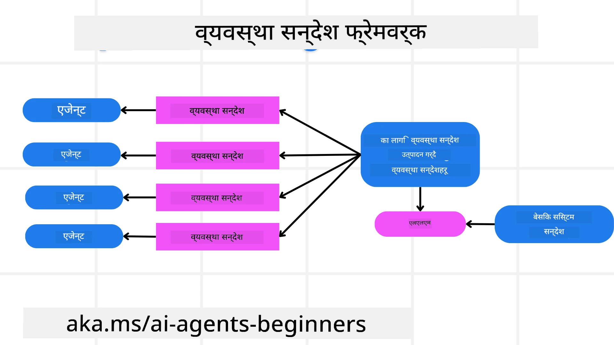
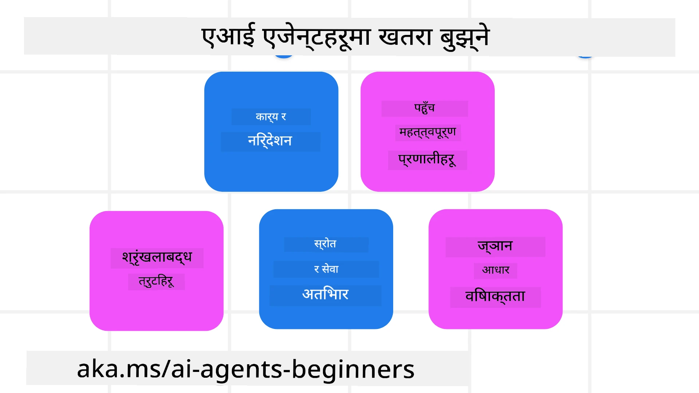
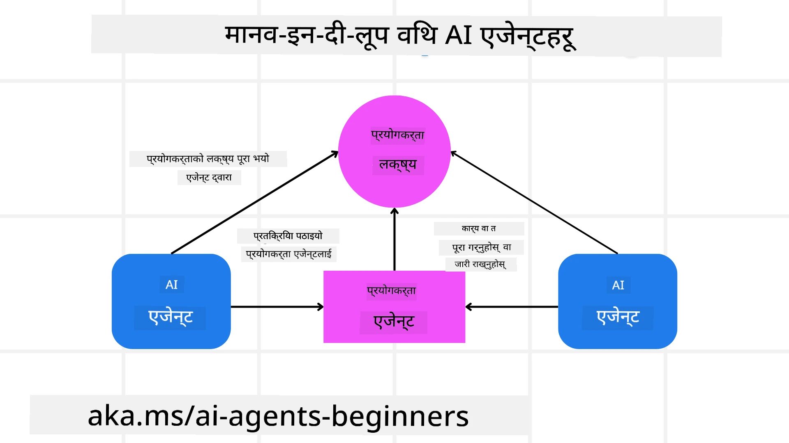

[](https://youtu.be/iZKkMEGBCUQ?si=Q-kEbcyHUMPoHp8L)

> _(यस पाठको भिडियो हेर्न माथि रहेको तस्बिरमा क्लिक गर्नुहोस्)_

# विश्वसनीय AI एजेन्टहरू निर्माण

## परिचय

यस पाठले समेट्नेछ:

- सुरक्षित र प्रभावकारी AI एजेन्टहरू कसरी निर्माण र तैनाथ गर्ने
- AI एजेन्टहरू विकास गर्दा महत्वपूर्ण सुरक्षा विचारहरू।
- AI एजेन्टहरू विकास गर्दा डाटा र प्रयोगकर्ता गोपनीयता कसरी कायम गर्ने।

## सिकाइ लक्ष्यहरू

यस पाठ पूरा गरेपछि, तपाईंलाई थाहा हुनेछ:

- AI एजेन्टहरू सिर्जना गर्दा जोखिमहरू कसरी पहिचान र कम गर्ने।
- डाटा र पहुँच सही तरिकाले व्यवस्थापन भएको सुनिश्चित गर्न सुरक्षा उपायहरू लागू गर्ने।
- डाटा गोपनीयता कायम गर्ने र गुणस्तरीय प्रयोगकर्ता अनुभव दिने AI एजेन्टहरू सिर्जना गर्ने।

## सुरक्षा

पहिला सुरक्षित एजेन्टिक अनुप्रयोगहरू निर्माणमा ध्यान दिनुहोस्। सुरक्षा भन्नाले AI एजेन्टले डिजाइन अनुसार काम गर्ने अर्थ हुन्छ। एजेन्टिक अनुप्रयोगहरू निर्माणकर्ताको रूपमा, हामीसँग सुरक्षा अधिकतम गर्नका लागि विधि र उपकरणहरू छन्:

### सिस्टम मेसेज फ्रेमवर्क निर्माण

यदि तपाईंले कुनै बेला ठूलो भाषा मोडेल (LLMs) प्रयोग गरेर AI अनुप्रयोग बनाउनु भएको छ भने, तपाईंलाई सिस्टम प्रॉम्प्ट वा सिस्टम मेसेज डिजाइन गर्नुको महत्त्व थाहा हुनेछ। यी प्रॉम्प्टहरूले LLM ले प्रयोगकर्ता र डाटासँग कसरी अन्तरक्रिया गर्ने भन्ने बारे मेटा नियमहरू, निर्देशनहरू, र दिशानिर्देशहरू स्थापना गर्छ।

AI एजेन्टहरूको लागि, सिस्टम प्रॉम्प्ट अझ महत्वपूर्ण छ किनभने AI एजेन्टहरूले हामीले डिजाइन गरेका कार्यहरू पूरा गर्न अत्यधिक विशिष्ट निर्देशनहरू चाहिन्छ।

स्केलेबल सिस्टम प्रॉम्प्टहरू सिर्जना गर्न, हामी हाम्रो अनुप्रयोगमा एक वा बढी एजेन्टहरू निर्माण गर्न सिस्टम मेसेज फ्रेमवर्क प्रयोग गर्न सक्छौं:



#### चरण १: मेटा सिस्टम मेसेज सिर्जना गर्नुहोस्

मेटा प्रॉम्प्टलाई LLM द्वारा हामीले निर्माण गर्ने एजेन्टहरूको लागि सिस्टम प्रॉम्प्टहरू उत्पन्न गर्न प्रयोग गरिनेछ। हामी यसलाई एउटा टेम्प्लेटको रूपमा डिजाइन गर्छौं ताकि आवश्यक पर्दा छिटो र सजिलै धेरै एजेन्टहरू सिर्जना गर्न सकियोस्।

यहाँ मेटा सिस्टम मेसेजको उदाहरण छ जुन हामी LLM लाई दिनेछौं:

```plaintext
You are an expert at creating AI agent assistants. 
You will be provided a company name, role, responsibilities and other
information that you will use to provide a system prompt for.
To create the system prompt, be descriptive as possible and provide a structure that a system using an LLM can better understand the role and responsibilities of the AI assistant. 
```

#### चरण २: आधारभूत प्रॉम्प्ट सिर्जना गर्नुहोस्

अर्को चरणमा AI एजेन्टलाई वर्णन गर्ने आधारभूत प्रॉम्प्ट सिर्जना गर्ने हो। तपाईंले एजेन्टको भूमिका, एजेन्टले पूरा गर्ने कार्यहरू, र अन्य जिम्मेवारीहरू समावेश गर्नु पर्छ।

यहाँ एउटा उदाहरण छ:

```plaintext
You are a travel agent for Contoso Travel that is great at booking flights for customers. To help customers you can perform the following tasks: lookup available flights, book flights, ask for preferences in seating and times for flights, cancel any previously booked flights and alert customers on any delays or cancellations of flights.  
```

#### चरण ३: LLM लाई आधारभूत सिस्टम मेसेज प्रदान गर्नुहोस्

अब हामी यस सिस्टम मेसेजलाई मेता सिस्टम मेसेज र हाम्रो आधारभूत सिस्टम मेसेज दुवैलाई प्रदान गरेर अनुकूलित गर्न सक्छौं।

यसले हाम्रो AI एजेन्टहरूलाई मार्गदर्शन गर्न राम्रो डिजाईन गरिएको सिस्टम मेसेज उत्पन्न गर्नेछ:

```markdown
**Company Name:** Contoso Travel  
**Role:** Travel Agent Assistant

**Objective:**  
You are an AI-powered travel agent assistant for Contoso Travel, specializing in booking flights and providing exceptional customer service. Your main goal is to assist customers in finding, booking, and managing their flights, all while ensuring that their preferences and needs are met efficiently.

**Key Responsibilities:**

1. **Flight Lookup:**
    
    - Assist customers in searching for available flights based on their specified destination, dates, and any other relevant preferences.
    - Provide a list of options, including flight times, airlines, layovers, and pricing.
2. **Flight Booking:**
    
    - Facilitate the booking of flights for customers, ensuring that all details are correctly entered into the system.
    - Confirm bookings and provide customers with their itinerary, including confirmation numbers and any other pertinent information.
3. **Customer Preference Inquiry:**
    
    - Actively ask customers for their preferences regarding seating (e.g., aisle, window, extra legroom) and preferred times for flights (e.g., morning, afternoon, evening).
    - Record these preferences for future reference and tailor suggestions accordingly.
4. **Flight Cancellation:**
    
    - Assist customers in canceling previously booked flights if needed, following company policies and procedures.
    - Notify customers of any necessary refunds or additional steps that may be required for cancellations.
5. **Flight Monitoring:**
    
    - Monitor the status of booked flights and alert customers in real-time about any delays, cancellations, or changes to their flight schedule.
    - Provide updates through preferred communication channels (e.g., email, SMS) as needed.

**Tone and Style:**

- Maintain a friendly, professional, and approachable demeanor in all interactions with customers.
- Ensure that all communication is clear, informative, and tailored to the customer's specific needs and inquiries.

**User Interaction Instructions:**

- Respond to customer queries promptly and accurately.
- Use a conversational style while ensuring professionalism.
- Prioritize customer satisfaction by being attentive, empathetic, and proactive in all assistance provided.

**Additional Notes:**

- Stay updated on any changes to airline policies, travel restrictions, and other relevant information that could impact flight bookings and customer experience.
- Use clear and concise language to explain options and processes, avoiding jargon where possible for better customer understanding.

This AI assistant is designed to streamline the flight booking process for customers of Contoso Travel, ensuring that all their travel needs are met efficiently and effectively.

```

#### चरण ४: पुनरावृत्ति र सुधार

यो सिस्टम मेसेज फ्रेमवर्कको मूल्य यो हो कि यो धेरै एजेन्टहरूबाट सिस्टम मेसेजहरू बनाउन सजिलो बनाउँछ साथै तपाईंको सिस्टम मेसेजहरूलाई समयसँगै सुधार गर्ने अवसर दिन्छ। तपाईंलाई पहिलो पटक तपाईंको सम्पूर्ण प्रयोग केसको लागि काम गर्ने सिस्टम मेसेज मिल्नु दुर्लभ हुन्छ। आधारभूत सिस्टम मेसेज परिवर्तन गरेर साना सुधारहरू गर्न र परिणामहरू तुलना तथा मूल्यांकन गर्न सकिन्छ।

## जोखिमहरू बुझ्नु

विश्वसनीय AI एजेन्ट निर्माण गर्न, तपाईंको AI एजेन्टमा भएका जोखिम र खतराहरू बुझ्न र तिनीहरूलाई कम गर्न महत्वपूर्ण छ। विभिन्न खतराहरू मध्ये केहीमात्र हामी यहाँ हेरौं र कसरी तपाईं प्लानिङ गरी तयारी गर्न सक्नुहुन्छ।



### कार्य र निर्देशन

**वर्णन:** आक्रमणकारीहरूले प्रॉम्प्टिङ वा इनपुटहरू हेरफेर गरेर AI एजेन्टका निर्देशन वा लक्ष्यहरू परिवर्तन गर्न प्रयास गर्छन्।

**कमजोर पार्ने उपाय**: AI एजेन्टले प्रक्रिया गर्ने पूर्व खतरा भएको प्रॉम्प्ट पत्ता लगाउन जांच र इनपुट फिल्टर चलाउनुहोस्। किनभने यी आक्रमणहरू प्रायः एजेन्टसँग बारम्बार अन्तरक्रिया चाहिन्छ, त्यस्ता कुराकानीको संख्या सीमित गर्नु अर्को उपाय हो।

### संवेदनशील प्रणालीहरूमा पहुँच

**वर्णन:** यदि AI एजेन्टसँग संवेदनशील डेटा भण्डारण गर्ने प्रणाली र सेवाहरूको पहुँच छ भने, आक्रमणकारीले एजेन्ट र ती सेवाहरूबीचको सञ्चारमा बाधा पुर्याउन सक्छन्। यी सिधा आक्रमण या अप्रत्यक्ष रूपमा एजेन्ट मार्फत प्रणालीहरूबारे जानकारी लिन खोज्ने प्रयास हुन सक्छ।

**कमजोर पार्ने उपाय:** यी किसिमका आक्रमण रोक्न AI एजेन्टहरूले आवश्यकता अनुसार मात्र प्रणालीहरूको पहुँच पाउनु पर्छ। एजेन्ट र प्रणालीबीचको सञ्चार पनि सुरक्षित हुनु आवश्यक छ। प्रमाणीकरण र पहुँच नियन्त्रण लागू गर्नु अर्को सुरक्षा उपाय हो।

### स्रोत र सेवा अत्यधिक लोड पार्नु

**वर्णन:** AI एजेन्टहरूले कार्यहरू पूरा गर्न विभिन्न उपकरण र सेवाहरू पहुँच गर्ने क्षमता राख्छन्। आक्रमणकारीहरूले AI एजेन्टमार्फत धेरै अनुरोधहरू पठाएर सेवाहरूमा आक्रमण गर्न सक्छन् जसले प्रणालीमा समस्या वा उच्च लागत निम्त्याउन सक्छ।

**कमजोर पार्ने उपाय:** AI एजेन्टले कुनै सेवा समक्ष पठाउन सक्ने अनुरोधहरूको संख्या सीमित गर्ने नीति लागू गर्नुहोस्। कुराकानीका पटक र AI एजेन्टप्रति अनुरोधहरूको संख्या सीमित गर्नु अर्को उपाय हो।

### ज्ञान आधार विषाक्त पार्नु

**वर्णन:** यो आक्रमणले AI एजेन्टलाई सिधा लक्षित गर्ने छैन तर AI एजेन्टले प्रयोग गर्ने ज्ञान आधार र अन्य सेवाहरूमा लक्षित हुनेछ। यसले डेटालाई भ्रष्ट बनाएर एजेन्टले काम गर्दा पक्षपातपूर्ण वा अनपेक्षित प्रतिक्रिया दिन सक्छ।

**कमजोर पार्ने उपाय:** AI एजेन्टले आफ्नो कार्यप्रवाहमा प्रयोग गर्ने डेटाको नियमित जाँच गर्नुहोस्। यस डेटामा पहुँच सुरक्षित राख्नुहोस् र भरोसायोग्य व्यक्तिहरूले मात्र परिमार्जन गर्न पाउनुहोस् ताकि यस्तो हमला टार्न सकियोस्।

### सङ्क्रमणात्मक त्रुटिहरू

**वर्णन:** AI एजेन्टहरूले कार्यहरू पूरा गर्न विभिन्न उपकरण र सेवाहरू प्रयोग गर्छन्। आक्रमणकर्ताद्वारा उत्पन्न भएको त्रुटिले अन्य प्रणालीहरूमा असफलता निम्त्याउन सक्छ जसले आक्रमणलाई व्यापक र समस्याग्रस्त बनाउँछ।

**कमजोर पार्ने उपाय:** यसको लागि एउटा उपाय हो AI एजेन्टलाई सीमित वातावरणमा सञ्चालन गराउनु, जस्तै Docker कन्टेनरमा कार्यहरू गर्ने, ताकि प्रत्यक्ष प्रणाली आक्रमणहरू रोक्न सकियोस्। कुनै प्रणालीले त्रुटि जनाउँदा फallback मेकानिज्म र पुन: प्रयास तर्क सिर्जना गर्नु अर्को उपाय हो।

## मानव इन-द-लूप

विश्वसनीय AI एजेन्ट प्रणालीहरू निर्माण गर्ने अर्को प्रभावकारी तरिका भनेको मानव-इन-द-लूप प्रयोग गर्नु हो। यसले प्रयोगकर्ताहरूलाई एजेन्टहरूका प्रतिक्रिया तथा प्रक्रियामा स्वीकृति वा समापन गर्न सक्षम बनाउने प्रवाह सिर्जना गर्छ। प्रयोगकर्ताहरू बहु-एजेन्ट प्रणालीमा एजेन्टको रूपमा कार्य गर्दछन्।



यस विचारको कार्यान्वयन देखाउन माइक्रोसफ्ट एजेन्ट फ्रेमवर्कको कोड स्निपेट यहाँ छ:

```python
import os
from agent_framework.azure import AzureAIProjectAgentProvider
from azure.identity import AzureCliCredential

# मानव-सहभागी अनुमोदन सहित प्रदायक सिर्जना गर्नुहोस्
provider = AzureAIProjectAgentProvider(
    credential=AzureCliCredential(),
)

# मानव अनुमोदन चरण सहित एजेन्ट सिर्जना गर्नुहोस्
response = provider.create_response(
    input="Write a 4-line poem about the ocean.",
    instructions="You are a helpful assistant. Ask for user approval before finalizing.",
)

# प्रयोगकर्ताले प्रतिक्रिया समीक्षा र अनुमोदन गर्न सक्छन्
print(response.output_text)
user_input = input("Do you approve? (APPROVE/REJECT): ")
if user_input == "APPROVE":
    print("Response approved.")
else:
    print("Response rejected. Revising...")
```

## निष्कर्ष

विश्वसनीय AI एजेन्टहरू निर्माण गर्न सावधानीपूर्वक डिजाइन, दृढ सुरक्षा उपायहरू, र निरन्तर पुनरावृत्ति आवश्यक पर्छ। संरचित मेटा प्रॉम्प्टिङ सिस्टमहरू लागू गरेर, सम्भावित खतराहरू बुझेर र कम गर्ने रणनीतीहरू प्रयोग गरेर, विकासकर्ताले सुरक्षित र प्रभावकारी AI एजेन्टहरू सिर्जना गर्न सक्छन्। साथै, मानव-इन-द-लूप दृष्टिकोण समावेश गर्दा AI एजेन्टहरूले प्रयोगकर्ताको आवश्यकतासँग मेल खान्छन् र जोखिमहरू न्यून गर्छन्। AI निरन्तर विकास हुँदै गइरहेकाले सुरक्षा, गोपनीयता, र नैतिकतामा सक्रिय दृष्टिकोण राख्नु विश्वसनीयता र विश्वासको लागि महत्वपूर्ण छ।

### विश्वसनीय AI एजेन्टहरू निर्माण बारे थप प्रश्नहरू छन्?

[Microsoft Foundry Discord](https://aka.ms/ai-agents/discord) मा सामेल हुनुहोस् अन्य सिक्नेहरूसँग भेटघाट गर्न, अफिस घण्टा सहभागी हुन र AI एजेन्टको प्रश्नहरूको जवाफ पाउन।

## थप स्रोतहरू

- <a href="https://learn.microsoft.com/azure/ai-studio/responsible-use-of-ai-overview" target="_blank">उत्तरदायी AI अवलोकन</a>
- <a href="https://learn.microsoft.com/azure/ai-studio/concepts/evaluation-approach-gen-ai" target="_blank">सिर्जनात्मक AI मोडेल र AI अनुप्रयोगहरूको मूल्याङ्कन</a>
- <a href="https://learn.microsoft.com/azure/ai-services/openai/concepts/system-message?context=%2Fazure%2Fai-studio%2Fcontext%2Fcontext&tabs=top-techniques" target="_blank">सुरक्षा सिस्टम मेसेजहरू</a>
- <a href="https://blogs.microsoft.com/wp-content/uploads/prod/sites/5/2022/06/Microsoft-RAI-Impact-Assessment-Template.pdf?culture=en-us&country=us" target="_blank">जोखिम मूल्याङ्कन ढाँचा</a>

## अघिल्लो पाठ

[Agentic RAG](../05-agentic-rag/README.md)

## अर्को पाठ

[Planning Design Pattern](../07-planning-design/README.md)

---

<!-- CO-OP TRANSLATOR DISCLAIMER START -->
**अस्वीकरण**:
यो दस्तावेज AI अनुवाद सेवा [Co-op Translator](https://github.com/Azure/co-op-translator) प्रयोग गरी अनुवाद गरिएको हो। हामी सटीकता को लागि प्रयास गरिरहेका छौं, तर कृपया अवगत हुनुहोस् कि स्वचालित अनुवादमा त्रुटि वा अभिप्रायको फरक हुनसक्छ। मूल दस्तावेज यसको मूल भाषामा अधिकारिक स्रोत मानिनु पर्छ। महत्वपूर्ण जानकारीको लागि, पेशेवर मानव अनुवाद सिफारिस गरिन्छ। यस अनुवादको प्रयोगबाट उत्पन्न कुनै पनि गलत बुझाइ वा गलत व्याख्यामा हामी जिम्मेवार छैनौं।
<!-- CO-OP TRANSLATOR DISCLAIMER END -->