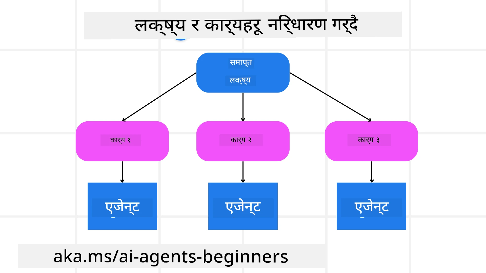

[](https://youtu.be/kPfJ2BrBCMY?si=9pYpPXp0sSbK91Dr)

> _(यो पाठको भिडियो हेर्न माथि रहेको चित्रमा क्लिक गर्नुहोस्)_

# योजना डिजाइन

## परिचय

यस पाठले समेट्नेछ

* स्पष्ट समग्र लक्ष्य निर्धारण गर्ने र जटिल कार्यलाई व्यवस्थापन गर्न मिल्ने कार्यहरूमा विभाजन गर्ने।
* अधिक विश्वसनीय र मेसिन-पठनीय प्रतिक्रियाहरूका लागि संरचित आउटपुटको उपयोग गर्ने।
* गतिशील कार्यहरू र आकस्मिक इनपुटहरूलाई ह्यान्डल गर्न इभेन्ट-ड्राइभेन दृष्टिकोण लागू गर्ने।

## सिकाइका लक्ष्यहरू

यस पाठ पूरा गरेपछि, तपाईंलाई निम्न विषयहरूमा बुझाइ हुनेछ:

* AI एजेन्टको लागि समग्र लक्ष्य पहिचान गर्ने र सेट गर्ने, जसले स्पष्ट रूपमा थाहा पाओस् के हासिल गर्न आवश्यक छ।
* जटिल कार्यलाई स-साना, व्यवस्थापन गर्न मिल्ने उपकार्यहरूमा विभाजन गर्ने र तिनीहरूलाई तार्किक अनुक्रममा व्यवस्थित गर्ने।
* एजेन्टहरूलाई उपयुक्त औजारहरू (जस्तै खोजी उपकरण वा डेटा विश्लेषण उपकरणहरू) उपलब्ध गराउने, कति र कहिले ती प्रयोग गर्ने निर्णय गर्ने, र आउन सक्ने अप्रत्याशित अवस्थाहरूलाई ह्यान्डल गर्ने।
* उपकार्यका परिणामहरूको मूल्याङ्कन गर्ने, प्रदर्शन मापन गर्ने, र अन्तिम आउटपुट सुधार गर्न क्रियाकलापहरूमाथि पुनरावृत्ति गर्ने।

## समग्र लक्ष्य निर्धारण र कार्य विभाजन



धेरै वास्तविक विश्वका कार्यहरू एकैचोटि समाधान गर्न जटिल हुन्छन्। AI एजेन्टले आफ्नो योजना र क्रियाकलापहरूलाई निर्देशन दिनको लागि सार्थक उद्देश्य चाहिन्छ। उदाहरणका लागि, लक्ष्य विचार गर्नुहोस्:

    "3-दिने यात्रा योजना तयार पार्नु।"

यो भने सरल देखिए पनि अझै परिमार्जन आवश्यक छ। लक्ष्य जति स्पष्ट हुन्छ, त्यति नै एजेन्ट (र कुनै पनि मानव सहभागीहरू) ले सही परिणाम प्राप्त गर्नमा ध्यान केन्द्रित गर्न सक्छन्, जस्तै उडान विकल्पहरू, होटल सिफारिसहरू, र क्रियाकलाप सुझावहरू सहित पूर्ण यात्राकोर योजना बनाउनु।

### कार्य विभाजन

ठूला वा जटिल कार्यहरू स-साना, लक्ष्य-केन्द्रित उपकार्यहरूमा विभाजन गर्दा सजिलो हुन्छ।
यात्रा योजनाको उदाहरणका लागि, तपाईंले लक्ष्यलाई निम्न उपकार्यहरूमा विभाजन गर्न सक्नुहुन्छ:

* उडान बुकिङ
* होटल बुकिङ
* कार भाडामा लिने
* व्यक्तिगतकरण

प्रत्येक उपकार्य समर्पित एजेन्टहरू वा प्रक्रियाहरूले पूरा गर्न सक्छन्। एउटा एजेन्टले उत्कृष्ट उडान सम्झौता खोज्नमा विशेषज्ञता राख्न सक्छ, अर्कोले होटल बुकिङमा केन्द्रित हुन सक्छ, र यस्तै। समन्वयकारी वा "डाउनस्ट्रीम" एजेन्टले यी परिणामहरूलाई एक एकीकृत योजनामा प्रयोगकर्तालाई उपलब्ध गराउन सक्छ।

यो मोड्युलर दृष्टिकोणले क्रमिक सुधारहरूको लागि पनि अनुमति दिन्छ। उदाहरणका लागि, तपाईंले खाना सिफारिस वा स्थानीय क्रियाकलाप सुझावका लागि विशेष एजेन्टहरू थप्न सक्नुहुन्छ र समयसँगै योजना सुधार गर्न सक्नुहुन्छ।

### संरचित आउटपुट

ठूला भाषा मोडेलहरू (LLMs) संरचित आउटपुट (जस्तै JSON) उत्पादन गर्न सक्छन् जसलाई डाउनस्ट्रीम एजेन्टहरू वा सेवाहरूले सजिलै पार्स र प्रक्रिया गर्न सक्छन्। विशेष गरी बहु-एजेन्ट सन्दर्भमा उपयोगी हुन्छ, जहाँ योजना आउटपुट प्राप्त भएपछि यी कार्यहरू कार्यान्वयन गर्न सकिन्छ।

तलको Python स्निपेटले लक्ष्यलाई उपकार्यमा विभाजन गर्ने र संरचित योजना उत्पादन गर्ने सरल योजना एजेन्ट देखाउँछ:

```python
from pydantic import BaseModel
from enum import Enum
from typing import List, Optional, Union
import json
import os
from typing import Optional
from pprint import pprint
from agent_framework.azure import AzureAIProjectAgentProvider
from azure.identity import AzureCliCredential

class AgentEnum(str, Enum):
    FlightBooking = "flight_booking"
    HotelBooking = "hotel_booking"
    CarRental = "car_rental"
    ActivitiesBooking = "activities_booking"
    DestinationInfo = "destination_info"
    DefaultAgent = "default_agent"
    GroupChatManager = "group_chat_manager"

# यात्रा उपकार्य मोडेल
class TravelSubTask(BaseModel):
    task_details: str
    assigned_agent: AgentEnum  # हामी टास्क एजेन्टलाई दिन चाहन्छौं

class TravelPlan(BaseModel):
    main_task: str
    subtasks: List[TravelSubTask]
    is_greeting: bool

provider = AzureAIProjectAgentProvider(credential=AzureCliCredential())

# प्रयोगकर्ता सन्देश परिभाषित गर्नुहोस्
system_prompt = """You are a planner agent.
    Your job is to decide which agents to run based on the user's request.
    Provide your response in JSON format with the following structure:
{'main_task': 'Plan a family trip from Singapore to Melbourne.',
 'subtasks': [{'assigned_agent': 'flight_booking',
               'task_details': 'Book round-trip flights from Singapore to '
                               'Melbourne.'}
    Below are the available agents specialised in different tasks:
    - FlightBooking: For booking flights and providing flight information
    - HotelBooking: For booking hotels and providing hotel information
    - CarRental: For booking cars and providing car rental information
    - ActivitiesBooking: For booking activities and providing activity information
    - DestinationInfo: For providing information about destinations
    - DefaultAgent: For handling general requests"""

user_message = "Create a travel plan for a family of 2 kids from Singapore to Melbourne"

response = client.create_response(input=user_message, instructions=system_prompt)

response_content = response.output_text
pprint(json.loads(response_content))
```

### बहु-एजेन्ट समन्वयनसहित योजना एजेन्ट

यस उदाहरणमा, एक Semantic Router Agent प्रयोगकर्ताको अनुरोध (जस्तै, "म मेरो यात्राको लागि होटल योजना चाहन्छु।") प्राप्त गर्दछ।

प्लानरले त्यसपछि:

* होटल योजना ग्रहण गर्छ: प्रयोगकर्ताको सन्देश लिन्छ र प्रणाली प्राँप्ट (उपलब्ध एजेन्ट विवरण सहित) अनुसार संरचित यात्रा योजना बनाउँछ।
* एजेन्टहरू र तिनीहरूको उपकरणहरू सूचीबद्ध गर्छ: एजेन्ट रजिष्ट्रिले एजेन्टहरूको सूची समातेको हुन्छ (जस्तै उडान, होटल, कार भाडामा लिने, र क्रियाकलापका लागि) र तिनीहरूले प्रस्ताव गर्ने उपकरण वा कार्यहरू।
* योजना सम्बन्धित एजेन्टहरूलाई मार्गनिर्देशन गर्छ: उपकार्यहरूको सङ्ख्यामा निर्भर गर्दै, प्लानरले सन्देश सोझै समर्पित एजेन्टमात्र पठाउँछ (एकल कार्य अवस्थामा) वा बहु-एजेन्ट सहकार्यका लागि समूह च्याट प्रबन्धक मार्फत समन्वय गर्छ।
* परिणाम संक्षेप गर्छ: अन्तमा, प्लानरले उत्पन्न योजना स्पष्टताका लागि संक्षेप गर्दछ।
तलको Python कोड नमूना यी चरणहरू देखाउँछ:

```python

from pydantic import BaseModel

from enum import Enum
from typing import List, Optional, Union

class AgentEnum(str, Enum):
    FlightBooking = "flight_booking"
    HotelBooking = "hotel_booking"
    CarRental = "car_rental"
    ActivitiesBooking = "activities_booking"
    DestinationInfo = "destination_info"
    DefaultAgent = "default_agent"
    GroupChatManager = "group_chat_manager"

# यात्रा उपकार्य मोडेल

class TravelSubTask(BaseModel):
    task_details: str
    assigned_agent: AgentEnum # हामीले कार्य एजेन्टलाई सुम्पन चाहन्छौं

class TravelPlan(BaseModel):
    main_task: str
    subtasks: List[TravelSubTask]
    is_greeting: bool
import json
import os
from typing import Optional

from agent_framework.azure import AzureAIProjectAgentProvider
from azure.identity import AzureCliCredential

# क्लाइन्ट सिर्जना गर्नुहोस्

provider = AzureAIProjectAgentProvider(credential=AzureCliCredential())

from pprint import pprint

# प्रयोगकर्ता सन्देश परिभाषित गर्नुहोस्

system_prompt = """You are a planner agent.
    Your job is to decide which agents to run based on the user's request.
    Below are the available agents specialized in different tasks:
    - FlightBooking: For booking flights and providing flight information
    - HotelBooking: For booking hotels and providing hotel information
    - CarRental: For booking cars and providing car rental information
    - ActivitiesBooking: For booking activities and providing activity information
    - DestinationInfo: For providing information about destinations
    - DefaultAgent: For handling general requests"""

user_message = "Create a travel plan for a family of 2 kids from Singapore to Melbourne"

response = client.create_response(input=user_message, instructions=system_prompt)

response_content = response.output_text

# JSON को रूपमा लोड गरेपछि प्रतिक्रिया सामग्री प्रिन्ट गर्नुहोस्

pprint(json.loads(response_content))
```

तलको आउटपुट अघिल्लो कोडबाट प्राप्त आउटपुट हो र तपाईंले यस संरचित आउटपुटलाई `assigned_agent` मा मार्गनिर्देशन गर्न र अन्तिम प्रयोगकर्तालाई यात्रा योजना संक्षेप गर्न प्रयोग गर्न सक्नुहुन्छ।

```json
{
    "is_greeting": "False",
    "main_task": "Plan a family trip from Singapore to Melbourne.",
    "subtasks": [
        {
            "assigned_agent": "flight_booking",
            "task_details": "Book round-trip flights from Singapore to Melbourne."
        },
        {
            "assigned_agent": "hotel_booking",
            "task_details": "Find family-friendly hotels in Melbourne."
        },
        {
            "assigned_agent": "car_rental",
            "task_details": "Arrange a car rental suitable for a family of four in Melbourne."
        },
        {
            "assigned_agent": "activities_booking",
            "task_details": "List family-friendly activities in Melbourne."
        },
        {
            "assigned_agent": "destination_info",
            "task_details": "Provide information about Melbourne as a travel destination."
        }
    ]
}
```

अघिल्लो कोड नमूनासहितको नोटबुक यहाँ उपलब्ध छ [यहाँ](07-python-agent-framework.ipynb)।

### पुनरावृत्त योजना

केही कार्यहरू दुईतर्फी वा पुनः योजना आवश्यक हुन्छन्, जहाँ एक उपकार्यको परिणाम अर्को उपकार्यलाई प्रभाव पार्छ। उदाहरणका लागि, यदि एजेन्टले उडान बुकिङ गर्दा आकस्मिक डेटा ढाँचा भेट्टाउँछ भने, उसले अर्को होटल बुकिङ अघि आफ्नो रणनीति समायोजन गर्नुपर्ने हुन्छ।

थप रूपमा, प्रयोगकर्ता प्रतिक्रिया (जस्तै कुनै मानिसले पहिलेको उडान रोज्न चाहन्छ) आंशिक पुनः योजना ट्रिगर गर्न सक्छ। यस गतिशील, पुनरावृत्त दृष्टिकोणले अन्तिम समाधानलाई वास्तविक विश्वका सीमाहरू र विकासशील प्रयोगकर्ता प्राथमिकतासँग सुसंगत बनाउँछ।

उदाहरण कोड

```python
from agent_framework.azure import AzureAIProjectAgentProvider
from azure.identity import AzureCliCredential
#.. पहिलाको कोड जस्तै र प्रयोगकर्ताको इतिहास, वर्तमान योजना पठाउनुहोस्

system_prompt = """You are a planner agent to optimize the
    Your job is to decide which agents to run based on the user's request.
    Below are the available agents specialized in different tasks:
    - FlightBooking: For booking flights and providing flight information
    - HotelBooking: For booking hotels and providing hotel information
    - CarRental: For booking cars and providing car rental information
    - ActivitiesBooking: For booking activities and providing activity information
    - DestinationInfo: For providing information about destinations
    - DefaultAgent: For handling general requests"""

user_message = "Create a travel plan for a family of 2 kids from Singapore to Melbourne"

response = client.create_response(
    input=user_message,
    instructions=system_prompt,
    context=f"Previous travel plan - {TravelPlan}",
)
# .. पुन: योजना बनाउनुहोस् र कार्यहरू सम्बन्धित एजेन्टहरूमा पठाउनुहोस्
```

थप व्यापक योजना लागि Magnetic One <a href="https://www.microsoft.com/research/articles/magentic-one-a-generalist-multi-agent-system-for-solving-complex-tasks" target="_blank">ब्लगपोस्ट</a> हेर्नुहोस् जसले जटिल कार्यहरू समाधान गर्दछ।

## सारांश

यस लेखमा हामीले कसरी योजनाकारलाई गतिशील रूपमा उपलब्ध एजेन्टहरू चयन गर्ने बनाउन सकिन्छ भनेर एक उदाहरण हेर्‍यौं। योजनाकारले कार्यहरू विभाजन गर्दछ र एजेन्टहरूलाई कार्यहरू कार्यान्वयन गर्न तोक्छ। एजेन्टहरूले आवश्यक कार्यहरू गर्नका लागि कार्य/औजारहरूमा पहुँच भएको मानिन्छ। एजेन्टहरूका अतिरिक्त, तपाईं परावर्तन, संक्षेप गर्ने, र राउन्ड रॉबिन च्याट जस्ता अन्य ढाँचाहरू समावेश गरेर थप अनुकूलन गर्न सक्नुहुन्छ।

## थप स्रोतहरू

Magentic One - जटिल कार्यहरू समाधानका लागि एउटा सामान्य बहु-एजेन्ट प्रणाली हो जसले धेरै चुनौतीपूर्ण एजेन्टिक बेन्चमार्कहरूमा प्रभावकारी परिणामहरू प्राप्त गरेको छ। सन्दर्भ: <a href="https://www.microsoft.com/research/articles/magentic-one-a-generalist-multi-agent-system-for-solving-complex-tasks" target="_blank">Magentic One</a>. यस कार्यान्वयनमा आयोजकले कार्य विशेष योजनाहरू बनाउँछ र ती कार्यहरू उपलब्ध एजेन्टहरूलाई जिम्मा लगाउँछ। योजनाका अतिरिक्त, आयोजकले कार्यको प्रगतिको निगरानी गर्न ट्र्याकिङ मेकानिजम पनि प्रयोग गर्छ र आवश्यक अनुसार पुनः योजना बनाउँछ।

### योजना डिजाइन ढाँचाबारे थप प्रश्न छ?

[Microsoft Foundry Discord](https://aka.ms/ai-agents/discord) मा सहभागी हुनुहोस् जहाँ तपाईं अन्य सिक्नेहरूलाई भेट्न, अफिस आवरहरूमा भाग लिन, र तपाईंका AI एजेन्टहरू सम्बन्धी प्रश्नहरूको जवाफ पाउन सक्नुहुन्छ।

## अघिल्लो पाठ

[भरपर्दो AI एजेन्टहरू बनाउँदै](../06-building-trustworthy-agents/README.md)

## अर्को पाठ

[बहु-एजेन्ट डिजाइन ढाँचा](../08-multi-agent/README.md)

---

<!-- CO-OP TRANSLATOR DISCLAIMER START -->
**अस्वीकरण**:  
यो दस्तावेज AI अनुवाद सेवा [Co-op Translator](https://github.com/Azure/co-op-translator) द्वारा अनुवाद गरिएको हो। हामी शुद्धताका लागि प्रयासरत छौं भने तापनि, कृपया ध्यान दिनुहोस् कि स्वचालित अनुवादहरूमा त्रुटि वा असत्यताहरू हुन सक्दछन्। मूल भाषा मा रहेको दस्तावेजलाई आधिकारिक स्रोतको रूपमा लिनुपर्छ। महत्वपूर्ण जानकारीको लागि पेशेवर मानव अनुवाद सिफारिस गरिन्छ। यस अनुवादको प्रयोगबाट उत्पन्न कुनै पनि गलतफहमी वा गलत व्याख्याको लागि हामी जिम्मेवार छैनौं।
<!-- CO-OP TRANSLATOR DISCLAIMER END -->