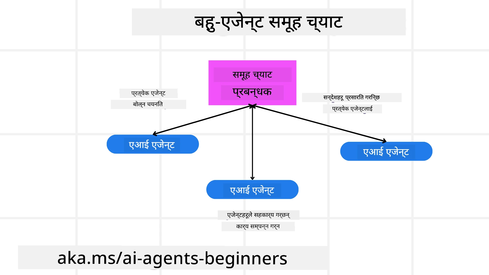
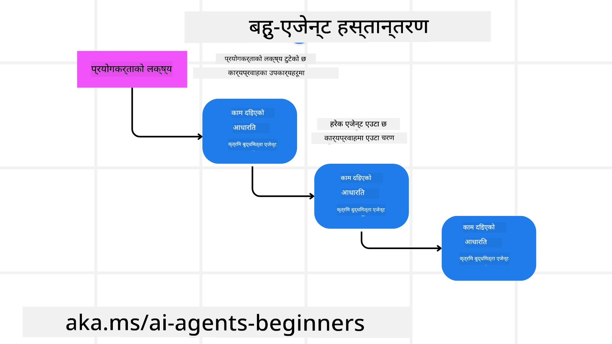
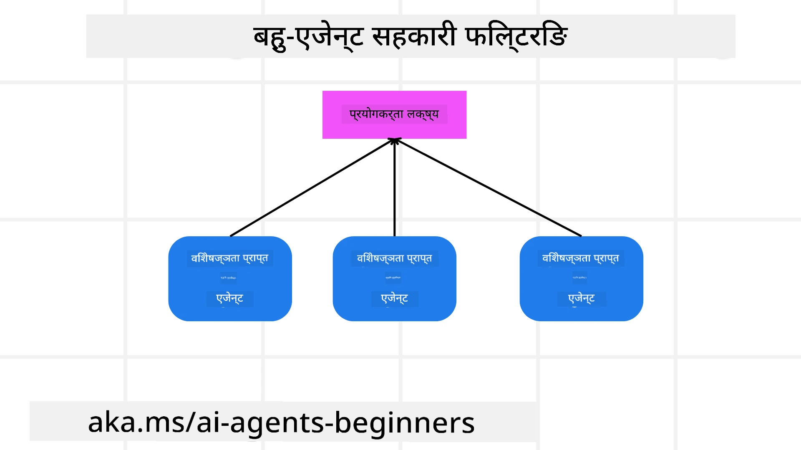

> _(यस पाठको भिडियो हेर्न माथिको तस्बिर क्लिक गर्नुहोस्)_

# बहु-एजेन्ट डिजाइन ढाँचा

जब तपाईं बहु-एजेन्टहरू सम्लग्न परियोजनामा काम गर्न थाल्नुहुन्छ, तपाईंलाई बहु-एजेन्ट डिजाइन ढाँचाको बारेमा विचार गर्न आवश्यक पर्छ। तर तुरंत स्पष्ट नहुन सक्छ कहिले बहु-एजेन्टमा स्विच गर्ने र यसको फाइदाहरू के-के हुन्।

## परिचय

यस पाठमा हामी तलका प्रश्नहरूको उत्तर खोज्ने छौं:

- कुन परिदृश्यहरूमा बहु-एजेन्टहरू लागू हुन्छन्?
- एउटा मात्र एजेण्टले धेरै काम गर्दा भन्दा बहु-एजेन्टहरू प्रयोग गर्दा के फाइदा हुन्छन्?
- बहु-एजेन्ट डिजाइन ढाँचा कार्यान्वयनका निर्माण खण्डहरू के-के हुन्?
- कसरी हामीसँग बहु-एजेन्टहरूले कसरी अन्तरक्रिया गरिरहेका छन् भन्ने दृश्यता हुन्छ?

## सिकाइ लक्ष्यहरू

यस पाठपछि तपाईं सक्षम हुनुहुनेछ:

- कुन परिदृश्यहरूमा बहु-एजेन्टहरू लागू हुन्छन् पहिचान गर्न
- एउटा मात्र एजेण्टभन्दा बहु-एजेन्टहरूको फाइदा चिन्ह्न
- बहु-एजेन्ट डिजाइन ढाँचा कार्यान्वयनका निर्माण खण्डहरू बुझ्न

ठूलो तस्वीर के हो?

*बहु-एजेन्टहरू एउटा डिजाइन ढाँचा हो जसले धेरै एजेन्टहरूलाई एउटै साझा लक्ष्य प्राप्त गर्न मिलेर काम गर्न अनुमति दिन्छ।*

यो ढाँचा विभिन्न क्षेत्रहरूमा व्यापक रूपमा प्रयोग हुन्छ, जस्तै रोबोटिक्स, स्वायत्त प्रणालीहरू, र वितरण गरिएको कम्प्युटिङमा।

## बहु-एजेन्ट प्रयोग योग्य परिदृश्यहरू

कुन परिदृश्यहरू बहु-एजेन्टहरूको लागि राम्रो प्रयोग हुँदछन्? धेरै परिदृश्यहरू छन् जहाँ धेरै एजेन्टहरू प्रयोग गर्नु लाभकारी हुन्छ, विशेष गरी तलका अवस्थामा:

- **ठूला कार्यभारहरू**: ठूला कार्यभारहरू साना कार्यहरूमा विभाजन गरेर फरक एजेन्टहरूलाई दिन सकिन्छ, जसले समानान्तर प्रशोधन र छिटो पूरा हुन सहयोग गर्छ। जस्तै, ठूलो डाटा प्रशोधन कार्य।
- **जटिल कार्यहरू**: जटिल कार्यहरू पनि साना उपकार्यहरूमा विभाजित गरिन्छ र हरेक एजेन्टलाई कार्यको विशेष पक्षमा विशेषज्ञता दिइन्छ। जस्तै स्वायत्त सवारी साधनहरू जहाँ फरक एजेन्टहरूले नेभिगेसन, अवरोध पत्ता लगाउने, र सवारी साधनहरूसँग संचार व्यवस्थापन गर्छन्।
- **विविध विशेषज्ञता**: फरक एजेन्टहरूमा विविध विशेषज्ञता हुन्छ, जसले एउटै एजेन्ट भन्दा विभिन्न पक्षहरूलाई राम्ररी सम्हाल्न सक्छ। जस्तै स्वास्थ्य क्षेत्रमा एजेन्टहरूले निदान, उपचार योजना, र बिरामी निगरानी गर्न सक्छन्।

## एउटा मात्र एजेण्टको तुलनामा बहु-एजेन्ट प्रयोगको फाइदा

एकल एजेन्ट प्रणाली सरल कार्यहरूका लागि राम्रो हुनसक्छ, तर जटिल कार्यहरूका लागि बहु-एजेन्टले धेरै फाइदा दिन सक्छ:

- **विशेषीकरण**: हरेक एजेन्ट विशिष्ट कार्यको लागि विशेषज्ञ हुन सक्छ। एकल एजेन्टमा विशेषज्ञता नहुँदा एजेण्ट सबै कुरा गर्न सक्ने तर जटिल कार्यमा भ्रमित हुन सक्ने हुन्छ। उदाहरणका लागि गलत काम गर्न सक्छ।
- **स्केलेबिलिटी**: प्रणालीलाई सजिलै फरक एजेन्ट थपेर विस्तारित गर्न सकिन्छ, एउटा एजेन्टमा अधिभार दिँदा भन्दा।
- **फोल्ट टोलरेन्स**: एक एजेन्ट विफल भए पनि अरूले काम जारी राख्न सक्छन्, जसले प्रणालीको विश्वसनीयता सुनिश्चित गर्छ।

उदाहरणका लागि, प्रयोगकर्ताका लागि ट्रिप बुक गरौं। एकल एजेन्टले सम्पूर्ण ट्रिप बुकिंग प्रक्रिया सम्हाल्नुपर्छ, उडान खोज्नदेखि होटल र कार भाडामा लिनेसम्म। यो एक अत्यन्त जटिल र मोनोलिथिक प्रणाली बनाउँछ जुन मर्मत र विस्तारमा गाह्रो हुन्छ। बहु-एजेन्ट प्रणालीमा फरक एजेन्टहरू उडान, होटल, र कारको बुकिंगमा विशेषज्ञ हुन सक्छन्, जसले प्रणालीलाई अधिक मोडुलर, सजिलो मर्मतयोग्य, र स्केलेबल बनाउँछ।

यसलाई तुलना गरौं एउटा परिवारले चलाएको ट्राभल कार्यालय र एउटा फ्रेन्चाइज ट्राभल कार्यालय। परिवारले चलाएकोमा एकल एजेन्टले सबै सम्हाल्छ भने फ्रेन्चाइजमा फरक एजेन्टहरूले विभिन्न पक्ष सम्हाल्छन्।

## बहु-एजेन्ट डिजाइन ढाँचा कार्यान्वयनका निर्माण खण्डहरू

बहु-एजेन्ट डिजाइन ढाँचा कार्यान्वयन गर्न अघि, तपाईंलाई यसका निर्माण खण्डहरू बुझ्नुपर्छ।

फेरि प्रयोगकर्ताका लागि ट्रिप बुक गर्ने उदाहरण हेरौं। यस अवस्थामा, निर्माण खण्डहरूमा समावेश छन्:

- **एजेन्ट सञ्चार**: उडान, होटल, र कार भाडा बुक गर्ने एजेन्टहरूले प्रयोगकर्ताका प्राथमिकता र सिमाहरूको बारेमा जानकारी आदान-प्रदान गर्नुपर्छ। तपाईंले यो सञ्चारका लागि प्रोटोकल र विधिहरू निर्णय गर्नुपर्छ। जस्तो कि उडान खोज्ने एजेन्टले होटल बुक गर्ने एजेन्टसँग सञ्चार गर्नुपर्छ ताकि होटल उडानको मितिसँग मिल्ने होस्। यसको मतलब एजेन्टहरूले प्रयोगकर्ताको यात्रा मिति साझा गर्छन्; तपाईंले निर्णय गर्नुपर्छ *कुन एजेन्टहरूले के जानकारी साझा गर्छन् र कसरी*।
- **समन्वय संयन्त्रहरू**: एजेन्टहरूले आफ्नो कार्यहरू समन्वय गर्नुपर्छ ताकि प्रयोगकर्ताका प्राथमिकता र सिमाहरू पूरा होऊन्। जस्तो कि प्रयोगकर्ताले एयरपोर्ट नजिकै होटल चाहन्छ भने र कार एयरपोर्टमै मात्र उपलब्ध छ भने, होटल बुक गर्ने एजेन्टले कार भाडामा दिने एजेन्टसँग समन्वय गर्नुपर्छ। तपाईंले निर्णय गर्नुपर्छ *एजेन्टहरूले कसरी आफ्नो क्रियाकलाप समन्वय गर्छन्*।
- **एजेन्ट संरचना**: एजेन्टहरूले निर्णय गर्न र प्रयोगकर्तासँग अन्तरक्रिया गरेर सिक्न आन्तरिक संरचना हुनुपर्छ। जस्तो उडान खोज्ने एजेन्टले कुन उडान सिफारिस गर्ने निर्णय गर्न आन्तरिक संरचना चाहिन्छ। तपाईंले निर्णय गर्नुपर्छ *एजेन्टहरूले कसरी निर्णय गर्छन् र अन्तरक्रिया बाट सिक्छन्*। उदाहरणका लागि उडान खोज्ने एजेन्टले मेशिन लर्निङ मोडेल प्रयोग गरी पुराना प्राथमिकतामा आधारित उडान सिफारिस गर्न सक्छ।
- **बहु-एजेन्ट अन्तरक्रियामा दृश्यता**: तपाईंलाई थाहा हुनु पर्छ कि बहु-एजेन्टहरूले कसरी अन्तरक्रिया गरिरहेका छन्। यसको लागि ट्र्याकिङ उपकरण र विधि चाहिन्छ। जस्तो लगिङ्ग र अनुगमन उपकरण, भिजुलाइजेसन उपकरण, र प्रदर्शन मेट्रिक्स।
- **बहु-एजेन्ट ढाँचाहरू**: बहु-एजेन्ट प्रणालीका लागि विभिन्न ढाँचाहरू छन्, जस्तै केन्द्रीकृत, विकेन्द्रीकृत, र हाइब्रिड आर्किटेक्चर। तपाईंले आफ्नो प्रयोगको लागि उपयुक्त ढाँचा चयन गर्नुपर्छ।
- **मानव समावेशी प्रक्रिया**: धेरै अवस्थामा मानव समावेश हुन्छ र एजेन्टले कहिले मानव हस्तक्षेप माग्ने भनेर निर्देशन दिनुपर्छ। जस्तै प्रयोगकर्ताले विशेष होटल वा उडान चाहेमा जुन एजेन्टहरूले सिफारिस नगरेको छ या बुकिंग अघि पुष्टि माग्दा।

## बहु-एजेन्ट अन्तरक्रियामा दृश्यता

तपाईंलाई थाहा हुनु आवश्यक छ कि बहु-एजेन्टहरूले कसरी अन्तरक्रिया गरिरहेका छन्। यस दृश्यताले डिबग, समायोजन, र प्रणालीको प्रभावकारिता सुनिश्चित गर्न मद्दत गर्छ। यसको लागि तपाईंलाई ट्र्याकिङ उपकरण र विधि चाहिन्छ। जस्तै लगिङ्ग र अनुगमन, भिजुलाइजेसन, र प्रदर्शन मेट्रिक्स।

उदाहरणका लागि, ट्रिप बुक गर्दा तपाईंको एउटा ड्यासबोर्ड हुन सक्छ जुन हरेक एजेन्टको स्थिति, प्रयोगकर्ताका प्राथमिकता र सिमाहरू, र एजेन्टहरू बीचको अन्तरक्रिया देखाउँछ। यसले प्रयोगकर्ताको यात्रा मिति, उडानले सिफारिस गरेको उडान, होटलले सिफारिस गरेको होटल, र कार भाडामा दिने एजेन्टले सिफारिस गरेको कार देखाउन सक्छ। यसले स्पष्ट देखाउँछ एजेन्टहरूले कसरी अन्तरक्रिया गरिरहेका छन् र प्रयोगकर्ताका प्राथमिकता र सिमाहरू पूरा भइरहेका छन् कि छैनन्।

आउनुहोस् यी प्रत्येक पक्षलाई धेरै विस्तारमा हेरौं।

- **लगिङ्ग र अनुगमन उपकरणहरू**: प्रत्येक एजेन्टले गरेको हरेक क्रियाको लगिङ्ग गर्न चाहिन्छ। लग इन्ट्रीमा एजेन्ट, गरिएको क्रिया, समय, र परिणामको जानकारी हुन सक्छ। यसलाई डिबग, अनुकूलनमा प्रयोग गर्न सकिन्छ।
- **भिजुलाइजेसन उपकरणहरू**: एजेन्टहरू बीचको अन्तरक्रिया सहज तरिकाले बुझ्न दृश्य उपकरण उपयोगी हुन्छ। जस्तै, जानकारीको प्रवाह देखाउने ग्राफ प्रयोग गर्न सकिन्छ जसले प्रणालीका गति धिमा गर्ने ठाउँहरू वा अन्य समस्या देखाउँछ।
- **प्रदर्शन मेट्रिक्स**: बहु-एजेन्ट प्रणालीको प्रभावकारिता ट्र्याक गर्न मेट्रिक्स चाहिन्छ। जस्तै कार्य पूरा गर्न लागेको समय, प्रति समय पूरा हुने कार्यको संख्या, र एजेन्टहरूले दिएको सिफारिसको सटीकता। यसले सुधारको क्षेत्र चिन्ह्न र प्रणाली अनुकूलनमा मद्दत गर्छ।

## बहु-एजेन्ट ढाँचाहरू

अब केही वास्तविक बहु-एजेन्ट अनुप्रयोगहरू सिर्जना गर्न सकिने ढाँचाहरूमा जानौं। यहाँ केही रमाइला ढाँचाहरू छन् जुन विचार योग्य छन्:

### समूह च्याट

यो ढाँचा तब उपयोगी हुन्छ जब तपाईँले यस्तो समूह च्याट एप बनाउनु छ जहाँ धेरै एजेन्टहरू आपसमा संवाद गर्न सकून्। यसका साधारण प्रयोगहरूमा टिम सहकार्य, ग्राहक समर्थन, र सामाजिक नेटवर्किङ पर्दछन्।

यसमा हरेक एजेन्टले समूह च्याटमा प्रयोगकर्ताको प्रतिनिधित्व गर्छ, र संदेशहरू एजेन्टहरू बीच सन्देश प्रोटोकल प्रयोग गरी आदान-प्रदान हुन्छ। एजेन्टहरूले समूहलाई संदेश पठाउन, समूहबाट संदेश लिन, र अन्य एजेन्टहरूको संदेशमा जवाफ दिन सक्दछन्।

यो प्रणाली केन्द्रीकृत आर्किटेक्चर प्रयोग गरेर जहाँ सबै संदेशहरू एक केन्द्रीय सर्भरबाट जान्छन् वा विकेन्द्रीकृत आर्किटेक्चरमा जहाँ सिधै संवाद हुन्छ लागू गर्न सकिन्छ।

### हस्तान्तरण (Hand-off)

यो ढाँचा तब उपयोगी हुन्छ जब तपाईँले यस्तो एप बनाउन चाहनुहुन्छ जहाँ धेरै एजेन्टहरूले कार्यहरू एक अर्कालाई हस्तान्तरण गर्न सक्छन्।

यो ढाँचाका साधारण प्रयोगहरूमा ग्राहक समर्थन, कार्य व्यवस्थापन, र कार्यप्रवाह स्वचालन पर्दछन्।

यसमा हरेक एजेन्टले कार्य वा कार्यप्रवाहको एउटा चरण प्रतिनिधित्व गर्दछ र पूर्वनिर्धारित नियमहरू अनुसार कार्यहरू अन्य एजेन्टहरूलाई हस्तान्तरण गर्न सक्छ।

### सहयोगी फिल्टरिङ

यो ढाँचा तब उपयोगी हुन्छ जब तपाईँले विभिन्न एजेन्टहरूले सँगै मिलेर प्रयोगकर्तालाई सिफारिस बनाउन सक्ने एप बनाउन चाहनुहुन्छ।

बहु एजेन्टले सहयोग किन गर्छ भने हरेक एजेन्टसँग फरक विशेषज्ञता हुन्छ र सिफारिस प्रक्रियामा फरक तरिकाले योगदान दिन सक्छ।

उदाहरणका लागि, प्रयोगकर्ताले स्टक बजारमा कस्तो स्टक किन्न सिफारिस चाहन्छन् भने:

- **उद्योग विज्ञ**: एउटा एजेन्ट विशेष उद्योगमा विशेषज्ञ हुन्छ।
- **प्राविधिक विश्लेषण**: अर्को एजेन्ट प्राविधिक विश्लेषणमा विशेषज्ञ हुन्छ।
- **मूलभूत विश्लेषण**: अर्को एजेन्ट मूलभूत विश्लेषणमा विशेषज्ञ हुन्छ। यी एजेन्टहरूको सहकार्यले प्रयोगकर्तालाई बढी समग्र सिफारिस दिन्छ।

## परिदृश्य: फिर्ता प्रक्रिया

कल्पना गर्नुहोस् ग्राहकले कुनै उत्पादनको फिर्ता पाउन खोजिरहेको छ। यो प्रक्रियामा धेरै एजेन्टहरू सम्लग्न हुन सक्छन् तर हामी यसलाई प्रक्रिया विशेष र सामान्य एजेन्टहरूमा बाँड्छौं।

**फिर्ता प्रक्रियाका लागि विशेष एजेन्टहरू**:

फिर्ता प्रक्रियामा सम्लग्न सम्भावित एजेन्टहरू:

- **ग्राहक एजेन्ट**: ग्राहक प्रतिनिधित्व गर्छ र फिर्ता प्रक्रिया सुरु गर्छ।
- **बिक्रेता एजेन्ट**: बिक्रेतालाई प्रतिनिधित्व गर्छ र फिर्ता प्रक्रिया व्यवस्थापन गर्छ।
- **भुक्तानी एजेन्ट**: भुक्तानी प्रक्रिया प्रतिनिधित्व गर्छ र ग्राहकलाई फिर्ता रकम दिन्छ।
- **समाधान एजेन्ट**: प्रक्रियाको क्रममा देखिने समस्या समाधान गर्छ।
- **अनुपालन एजेन्ट**: प्रविधि र नीतिहरूको अनुपालन सुनिश्चित गर्छ।

**सामान्य एजेन्टहरू**:

यी एजेन्टहरू तपाईंको व्यापारका अन्य भागहरूमा पनि प्रयोग गर्न सकिन्छ।

- **ढुवानी एजेन्ट**: ढुवानी प्रक्रिया प्रतिनिधित्व गर्छ र उत्पादन बिक्रेतालाई फिर्ता पठाउँछ। यो फिर्ता प्रक्रिया र सामान्य उत्पादन ढुवानी दुवैमा उपयोगी।
- **प्रतिक्रिया एजेन्ट**: ग्राहकबाट प्रतिक्रिया सङ्कलन गर्छ। प्रतिक्रिया कुनै पनि समय हुनसक्छ, फिर्ता प्रक्रियामा मात्र होइन।
- **चरणवृद्धि एजेन्ट (Escalation Agent)**: समस्या उच्च स्तरमा बढाउँछ। कुनै पनि प्रक्रियामा समस्या बढाउन प्रयोग गर्न सकिन्छ।
- **सूचना एजेन्ट**: फिर्ता प्रक्रियाका विभिन्न चरणमा ग्राहकलाई सूचित गर्छ।
- **विश्लेषण एजेन्ट**: फिर्ता प्रक्रियासँग सम्बन्धित डाटा विश्लेषण गर्छ।
- **परीक्षण एजेन्ट**: फिर्ता प्रक्रियाको परीक्षण गर्छ कि सबै ठिक चलिरहेको छ भनी।
- **प्रतिवेदन एजेन्ट**: फिर्ता प्रक्रियाबारे प्रतिवेदन तयार पार्छ।
- **ज्ञान एजेन्ट**: फिर्ता प्रक्रिया र अन्य व्यापार सम्बन्धी ज्ञान आधार राख्छ।
- **सुरक्षा एजेन्ट**: फिर्ता प्रक्रियाको सुरक्षा सुनिश्चित गर्छ।
- **गुणस्तर एजेन्ट**: फिर्ता प्रक्रियाको गुणस्तर सुनिश्चित गर्छ।

यो सूचीले तपाईंलाई बहु-एजेन्ट प्रणालीमा कुन एजेन्टहरू समावेश गर्ने निर्णय कसरी गर्ने भन्ने विचार दिन्छ।

## कार्य

ग्राहक समर्थन प्रक्रियाका लागि बहु-एजेन्ट प्रणाली डिजाइन गर्नुहोस्। यस प्रक्रियामा सम्लग्न एजेन्टहरू, तिनीहरूको भूमिका र जिम्मेवारीहरू, र कसरी तिनीहरू एकअर्कासँग अन्तरक्रिया गर्छन् भन्ने पहिचान गर्नुहोस्। ग्राहक समर्थन प्रक्रिया विशेष एजेन्ट र व्यापारका अन्य भागहरूमा प्रयोग हुने सामान्य एजेन्ट दुवैलाई विचार गर्नुहोस्।
> निम्न समाधान पढ्नुअघि सोच्नुहोस्, तपाईंले सोचेभन्दा बढी एजेन्टहरूको आवश्यकता पर्न सक्छ।

> TIP: ग्राहक समर्थन प्रक्रियाका विभिन्न चरणहरूको बारेमा सोच्नुहोस् र कुनै प्रणालीका लागि आवश्यक एजेन्टहरूलाई पनि विचार गर्नुहोस्।

## समाधान

[Solution](./solution/solution.md)

## ज्ञान परीक्षण

प्रश्न: तपाईंले कहिले बहु-एजेन्टहरू प्रयोग गर्ने विचार गर्नु पर्छ?

- [ ] A1: जब तपाईं सानो कार्यभार र सरल कार्य छ।
- [ ] A2: जब तपाईं ठूलो कार्यभार छ।
- [ ] A3: जब तपाईंसँग सरल कार्य छ।

[Solution quiz](./solution/solution-quiz.md)

## सारांश

यस पाठमा, हामीले बहु-एजेन्ट डिजाइन प्याटनमा हेर्यौं, जसमा बहु-एजेन्टहरू कहिले लागू हुने, एकल एजेन्टको तुलनामा बहु-एजेन्ट प्रयोग गर्ने फाइदाहरू, बहु-एजेन्ट डिजाइन प्याटन कार्यान्वयनका निर्माण ब्लकहरू, र कसरी बहु एजेन्टहरू एकअर्कासँग अन्तर्क्रिया गरिरहेका छन् भनेर हेर्ने तरिका समावेश छन्।

### बहु-एजेन्ट डिजाइन प्याटन सम्बन्धी थप प्रश्न छ?

[Microsoft Foundry Discord](https://aka.ms/ai-agents/discord) मा सहभागी हुनुहोस् जहाँ तपाईंले अरू सिक्नेहरूलाई भेट्न, कार्यालय समयहरूमा भाग लिन र तपाईका AI एजेन्ट सम्बन्धी प्रश्नहरूको उत्तर पाउन सक्नुहुन्छ।

## थप स्रोतहरू

- <a href="https://learn.microsoft.com/azure/ai-services/agents/overview" target="_blank">Microsoft Agent Framework कागजातहरू</a>
- <a href="https://www.analyticsvidhya.com/blog/2024/10/agentic-design-patterns/" target="_blank">Agentic डिजाइन प्याटनहरू</a>

## अघिल्लो पाठ

[Planning Design](../07-planning-design/README.md)

## अर्को पाठ

[AI एजेन्टहरूमा मेटाकग्निसन](../09-metacognition/README.md)

---

<!-- CO-OP TRANSLATOR DISCLAIMER START -->
**अस्वीकरण**:
यो दस्तावेज AI अनुवाद सेवा [Co-op Translator](https://github.com/Azure/co-op-translator) प्रयोग गरी अनुवाद गरिएको हो। हामी शुद्धताको प्रयास गर्छौं तापनि स्वचालित अनुवादमा त्रुटिहरू वा अशुद्धिहरू हुन सक्ने हुनाले कृपया यसलाई ध्यानमा राख्नुहोस्। मूल दस्तावेज यसको मूल भाषामा आधिकारिक स्रोतको रूपमा मानिनुपर्छ। महत्वपूर्ण जानकारीका लागि पेशेवर मानव अनुवाद सिफारिस गरिन्छ। यस अनुवादको प्रयोगबाट उत्पन्न कुनै पनि गलतफहमी वा गलत व्याख्याको लागि हामी जिम्मेवार छैनौं।
<!-- CO-OP TRANSLATOR DISCLAIMER END -->