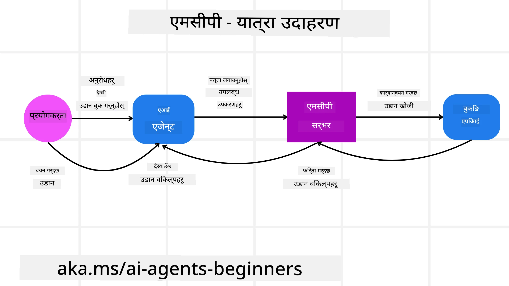
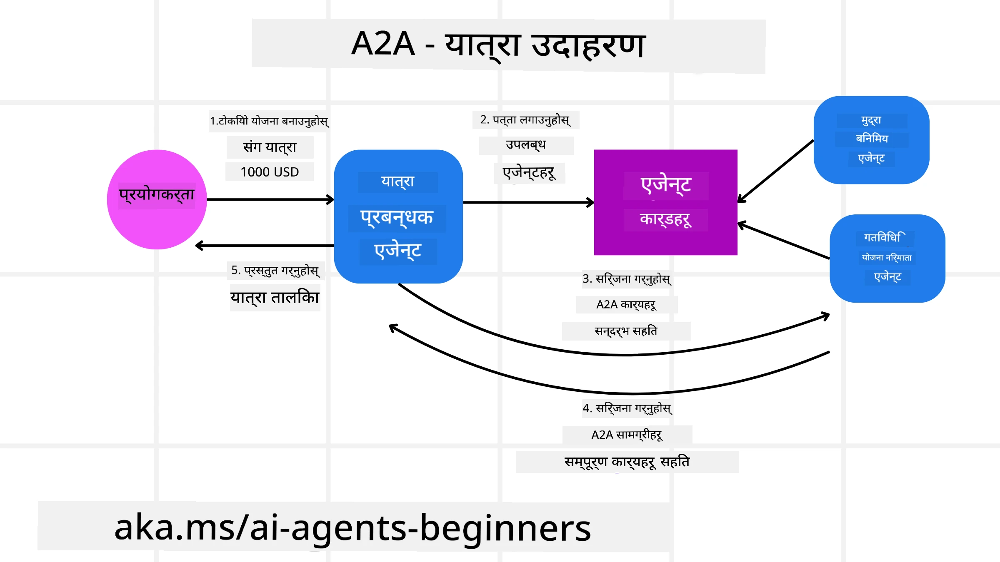
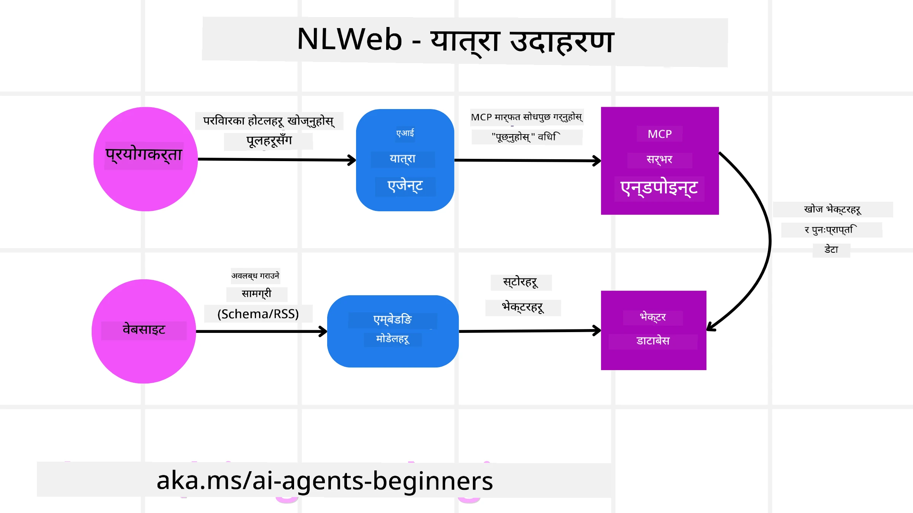

# एजेन्टिक प्रोटोकलहरू प्रयोग गर्ने (MCP, A2A र NLWeb)

> _(माथिको तस्बिरमा क्लिक गरेर यस पाठको भिडियो हेर्नुहोस्)_

जसै–जसै AI एजेन्टहरूको प्रयोग बढ्दैछ, त्यति नै आवश्यकता बढ्दो छ यस्ता प्रोटोकलहरूको जसले मानकीकरण, सुरक्षा र खुला नवप्रवर्तनलाई समर्थन गर्छ। यस पाठमा हामी 3 ओटा प्रोटोकलहरू कभ गर्नेछौं जुन यो आवश्यकता पूरा गर्न खोजिरहेका छन् - Model Context Protocol (MCP), Agent to Agent (A2A) र Natural Language Web (NLWeb)।

## परिचय

यस पाठमा हामीले समेट्नेछौं:

• कसरी **MCP** ले AI एजेन्टहरूलाई बाह्य उपकरण र डाटामा पहुँच दिन्छ ताकि प्रयोगकर्ताको कार्य पूरा गर्न सकियोस्।

• कसरी **A2A** ले विभिन्न AI एजेन्टहरूबीच सञ्चार र सहयोग सक्षम पार्छ।

• कसरी **NLWeb** ले कुनै पनि वेबसाइटमा प्राकृतिक भाषा इन्टरफेस ल्याउँछ, जसले AI एजेन्टहरूले सामग्री पत्ता लगाएर अन्तरक्रिया गर्न सक्छन्।

## सिकाइका लक्ष्यहरू

• **पहिचान गर्नुहोस्** MCP, A2A, र NLWeb को मुख्य उद्देश्य र फाइदाहरू AI एजेन्टहरूको सन्दर्भमा।

• **व्याख्या गर्नुहोस्** कसरी प्रत्येक प्रोटोकलले LLMs, उपकरणहरू, र अन्य एजेन्टहरूबीच सञ्चार र अन्तरक्रिया सजिलो बनाउँछ।

• **चिन्हित गर्नुहोस्** जटिल एजेन्टिक प्रणालीहरू निर्माण गर्दा प्रत्येक प्रोटोकलले खेल्ने फरक भूमिकाहरू।

## Model Context Protocol

**Model Context Protocol (MCP)** एउटा खुला मानक हो जसले अनुप्रयोगहरूलाई LLMs लाई सन्दर्भ र उपकरणहरू प्रदान गर्ने स्ट्यान्डर्ड तरिका दिन्छ। यसले विभिन्न डाटा स्रोत र उपकरणहरूका लागि "युनिभर्सल एडाप्टर" सक्षम बनाउँछ जसमा AI एजेन्टहरूले एकसमान तरिकाले जडान हुन सक्छन्।

अब MCP का कम्पोनेन्टहरू, सिधा API प्रयोगसँग तुलना गर्दा फाइदाहरू, र कसरी AI एजेन्टहरूले MCP सर्भर प्रयोग गर्न सक्छन् भन्ने उदाहरण हेरौं।

### MCP कोर कम्पोनेन्टहरू

MCP **क्लाइन्ट-सर्भर आर्किटेक्चर** मा सञ्चालन हुन्छ र मुख्य कम्पोनेन्टहरू हुन्:

• **Hosts** LLM अनुप्रयोगहरू हुन् (उदाहरणका लागि VSCode जस्तो कोड एडिटर) जसले MCP सर्भरसँग जडान सुरु गर्छन्।

• **Clients** होस्ट अनुप्रयोग भित्रका कम्पोनेन्टहरू हुन् जसले सर्भरसँग एक-देखि-एक जडानहरू कायम राख्छन्।

• **Servers** सन्सारमा प्रकाश पार्ने हल्का प्रोग्रामहरू हुन् जसले विशिष्ट क्षमताहरू प्रदर्शन गर्छन्।

प्रोटोकलमा समावेश तीन मुख्य प्रिमिटिवहरू छन् जुन MCP सर्भरका क्षमताहरू हुन्:

• **Tools**: यी पृथक क्रियाहरू वा कार्यहरू हुन् जुन AI एजेन्टले कुनै कार्य गर्न कल गर्न सक्छ। उदाहरणका लागि, मौसम सेवाले "get weather" उपकरण प्रदर्शन गर्न सक्छ, वा ई–कमर्स सर्भरले "purchase product" उपकरण देखाउन सक्छ। MCP सर्भरहरूले आफ्नो क्षमताहरूको सूचीमा हरेक टूलको नाम, वर्णन, र इनपुट/आउटपुट स्किमालाई विज्ञापन गर्छन्।

• **Resources**: यी पढ्न मात्र मिल्ने डाटा वस्तुहरू वा कागजातहरू हुन् जुन MCP सर्भरले प्रदान गर्न सक्छ र क्लाइन्टहरूले डिमाण्डमा फetch गर्न सक्छन्। उदाहरणहरूमा फाइल सामग्री, डेटाबेस रेकर्डहरू, वा लग फाइलहरू समावेश छन्। Resources टेक्स्ट (जस्तै कोड वा JSON) वा बाइनरी (जस्तै छविहरू वा PDFs) हुन सक्छन्।

• **Prompts**: यी पूर्वनिर्धारित टेम्प्लेटहरू हुन् जसले सिफारिस गरिएको प्रॉम्प्टहरू प्रदान गर्छन्, जसले थप जटिल कार्यप्रवाहहरूलाई अनुमति दिन्छ।

### MCP का फाइदाहरू

MCP ले AI एजेन्टहरूका लागि महत्वपूर्ण लाभहरू दिन्छ:

• **डाइनामिक टुल डिस्कभरी**: एजेन्टहरूले सर्भरबाट उपलब्ध टुलहरूको सूची गतिशील रूपमा प्राप्त गर्न सक्छन् र ती के गर्छन् भन्ने विवरणहरू पनि। यो पारम्परिक API हरूबाट फरक छ, जसमा प्रायः एकीकृत गर्न स्थिर कोडिङ चाहिन्छ; जसको अर्थ कुनै API परिवर्तनले कोड अपडेट आवश्यक पार्छ। MCP ले "एक पटक एकीकृत गर्नुहोस्" विधि प्रदान गर्छ, जसले बढी अनुकूलनीयता ल्याउँछ।

• **विभिन्न LLMs सँग अन्तरकियता**: MCP विभिन्न LLMs बीच काम गर्छ, जसले कोर मोडेलहरू परिवर्तन गरेर प्रदर्शन मूल्याङ्कन गर्ने लचीलोपन दिन्छ।

• **मानकीकृत सुरक्षा**: MCP ले एक मानक प्रमाणीकरण विधि समावेश गर्छ, जसले थप MCP सर्भरहरूमा पहुँच थप्दा स्केलेबिलिटी सुधार्छ। यो विभिन्न परम्परागत API हरूको लागि फरक किज र प्रमाणीकरण प्रकारहरू व्यवस्थापन गर्नुभन्दा सरल छ।

### MCP उदाहरण

कल्पना गर्नुहोस् प्रयोगकर्ताले AI सहायक प्रयोग गरेर उडान बुक गर्न चाहन्छ जुन MCP द्वारा सञ्चालित छ।

1. **जडान**: AI सहायक (MCP क्लाइन्ट) एयरलाइनले प्रदान गरेको MCP सर्भरसँग जडिन्छ।

2. **टुल डिस्कभरी**: क्लाइन्टले एयरलाइनको MCP सर्भरलाई सोध्छ, "तपाईं कहाँ–कहाँ टुलहरू उपलब्ध गराउनुहुन्छ?" सर्भरले "search flights" र "book flights" जस्ता टुलहरू फर्काउँछ।

3. **टुल इन्भोकेसन**: त्यसपछि तपाईं AI सहायकलाई भन्छु, "कृपया Portland बाट Honolulu को लागि उडान खोज्नुहोस्।" AI सहायकले आफ्नो LLM प्रयोग गरी पत्ता लगाउँछ कि यसले "search flights" टुल कल गर्न आवश्यक छ र सम्बन्धित प्यारामिटरहरू (उद्गम, गन्तव्य) MCP सर्भरमा पठाउँछ।

4. **कार्य निष्पादन र प्रतिक्रिया**: MCP सर्भरले एउटा रापरको रूपमा काम गर्दै एयरलाइनको आन्तरिक बुकिंग API मा वास्तविक कल गर्छ। त्यसपछि यसले उडान जानकारी (उदाहरणका लागि JSON डेटा) प्राप्त गरी AI सहयोगीलाई फिर्ता पठाउँछ।

5. **अनि थप अन्तरक्रिया**: AI सहायकले उडान विकल्पहरू प्रस्तुत गर्छ। तपाइँले उडान चुनेपछि, सहायकले सोही MCP सर्भरमा "book flight" टुल इन्भोकेसन गर्न सक्छ र बुकिंग पूरा हुन्छ।

## Agent-to-Agent Protocol (A2A)

जब MCP ले LLMs लाई उपकरणहरूसँग जडान गर्नेमा केन्द्रित हुन्छ, **Agent-to-Agent (A2A) प्रोटोकल** ले एक कदम अगाडि बढ्दै विभिन्न AI एजेन्टहरूबीच सञ्चार र सहयोग सक्षम पार्छ। A2A ले विभिन्न संगठनहरू, वातावरणहरू र प्रविधि स्ट्याकहरूमा रहेका AI एजेन्टहरूलाई साझा कार्य पूरा गर्न जडान गर्छ।

हामी A2A का कम्पोनेन्टहरू र फाइदाहरू हेर्नेछौं, साथै हाम्रो यात्रा अनुप्रयोगमा यसलाई कसरी लागू गर्न सकिन्छ भन्ने उदाहरण पनि हेर्नेछौं।

### A2A कोर कम्पोनेन्टहरू

A2A एजेन्टहरूबीच सञ्चार सक्षम पार्न र उनीहरूलाई प्रयोगकर्ताको उप–कार्य पूरा गर्न सँगै काम गर्न केन्द्रित हुन्छ। प्रोटोकलका प्रत्येक कम्पोनेन्टले यसमा योगदान पुर्‍याउँछ:

#### Agent Card

MCP सर्भरले कसरी टुलहरूको सूची साझा गर्छ त्यसैगरी, Agent Card मा हुन्छ:
- एजेन्टको नाम।
- यसले पूरा गर्ने सामान्य कार्यहरूको **वर्णन**।
- अन्य एजेन्टहरू (वा मानव प्रयोगकर्ताहरू) लाई बुझ्न र निर्णय लिन मद्दत गर्ने **विशिष्ट सीपहरूको सूची** र तिनको विवरण।
- एजेन्टको **हालको Endpoint URL**
- एजेन्टको **भर्सन** र यस्तो **क्षमताहरू** जस्तै स्ट्रीमिङ प्रतिक्रिया र पुश सूचना।

#### Agent Executor

Agent Executor को जिम्मेवारी हुन्छ **प्रयोगकर्ता च्याटको सन्दर्भलाई रिमोट एजेन्टमा पास गर्ने**। रिमोट एजेन्टलाई काम बुझ्नका लागि यो सन्दर्भ आवश्यक पर्छ। A2A सर्भरमा, एउटा एजेन्टले आफ्नो आफ्नै LLM प्रयोग गरी आउने अनुरोधहरू पार्स गर्छ र आफ्नै आन्तरिक उपकरणहरू प्रयोग गरी कार्यहरू सञ्चालन गर्छ।

#### Artifact

एक पटक रिमोट एजेन्टले अनुरोध गरिएको कार्य पूरा गरेपछि, यसको कार्य उत्पादनलाई एउटा artifact को रूपमा सिर्जना गरिन्छ। एउटा artifact मा समावेश हुन्छ: एजेन्टको कामको नतिजा, के पूरा गरियो भन्ने **वर्णन**, र प्रोटोकल मार्फत पठाइने **टेक्स्ट सन्दर्भ**। artifact पठाइसकेपछि रिमोट एजेन्टसँगको जडान बन्द गरिन्छ जबसम्म फेरि आवश्यक नपरोस्।

#### Event Queue

यो कम्पोनेन्ट **अपडेटहरू व्यवस्थापन गर्ने र सन्देशहरू पास गर्ने** कामका लागि प्रयोग हुन्छ। उत्पादनमा एजेन्टिक प्रणालीहरूका लागि यो विशेष गरी महत्वपूर्ण हुन्छ ताकि एजेन्टहरूबीचको जडान कार्य पूरा हुनुअघि बन्द नहोस्, विशेष गरी जब कार्य पूरा हुन समय लामो लाग्न सक्छ।

### A2A का फाइदाहरू

• **सुदृढ सहयोग**: यसले विभिन्न विक्रेता र प्लेटफर्मका एजेन्टहरूलाई अन्तरक्रिया गर्न, सन्दर्भ साझा गर्न, र सँगै काम गर्न सक्षम बनाउँछ, परम्परागत रूपमा अलग–अलग सिस्टमहरूबीच सहज अटोमेसनलाई प्रवर्द्धन गर्छ।

• **मोडेल छनोटमा लचिलोपन**: प्रत्येक A2A एजेन्टले आफ्नो अनुरोधहरूको सेवा दिन कुन LLM प्रयोग गर्ने निर्णय लिन सक्छ, जसले एजेन्टअनुसार अनुकूलित वा फाइन–ट्युन गरिएको मोडेलहरू प्रयोग गर्ने सुविधा दिन्छ, जुन केहि MCP परिदृश्यहरूमा एकल LLM जडानको विपरीत हो।

• **निर्मित–भएको प्रमाणीकरण**: प्रमाणीकरण सिधै A2A प्रोटोकलमा समाहित हुन्छ, जसले एजेन्ट अन्तरक्रियाहरूका लागि बलियो सुरक्षा ढाँचा प्रदान गर्छ।

### A2A उदाहरण

हामी हाम्रो यात्रा बुकिंग परिदृश्य विस्तार गरौं, तर यस पटक A2A प्रयोग गरेर।

1. **प्रयोगकर्ताको अनुरोध मल्टि–एजेन्टमा**: प्रयोगकर्ताले "Travel Agent" A2A क्लाइन्ट/एजेन्टसँग अन्तरक्रिया गर्दछ, सम्भवतः भन्छ, "कृपया अर्को हप्ताको लागि Honolulu को लागि पूरा यात्रा बुक गर्नुहोस्, उडान, होटल, र भाडाको कार सहित।"

2. **Travel Agent द्वारा व्यवस्थापन**: Travel Agent ले यो जटिल अनुरोध प्राप्त गर्छ। यसले आफ्नो LLM प्रयोग गरी कार्यसम्बन्धी तर्क गर्छ र निर्धारण गर्छ कि यसले अन्य विशेषज्ञ एजेन्टहरूसंग अन्तरक्रिया गर्नुपर्छ।

3. **एजेन्ट–बीच सञ्चार**: Travel Agent ले A2A प्रोटोकल प्रयोग गरी डाउनस्ट्रीम एजेन्टहरू जस्तै "Airline Agent," "Hotel Agent," र "Car Rental Agent" जस्ता विभिन्न कम्पनीहरूले बनाएका एजेन्टहरूसँग जडान गर्छ।

4. **हस्तान्तरण गरिएको कार्य निष्पादन**: Travel Agent ले यी विशेषज्ञ एजेन्टहरूलाई विशिष्ट कार्यहरू पठाउँछ (उदाहरणका लागि, "Find flights to Honolulu," "Book a hotel," "Rent a car")। यी प्रत्येक विशेषज्ञ एजेन्टहरूले आफ्नै LLM चलाउँछन् र आफ्नै उपकरणहरू (जुन MCP सर्भरहरू पनि हुन सक्छन्) प्रयोग गरी आफ्नो भागको बुकिंग पूरा गर्दछन्।

5. **समेकित प्रतिक्रिया**: सबै डाउनस्ट्रीम एजेन्टहरूले आफ्नो कार्यहरू पूरा गरेपछि, Travel Agent ले नतिजाहरू (उडान विवरणहरू, होटल पुष्टि, कार भाडा बुकिंग) संकलन गरी प्रयोगकर्तालाई विस्तृत, च्याट–शैली प्रतिक्रिया पठाउँछ।

## Natural Language Web (NLWeb)

वेबसाइटहरू लामो समयदेखि इन्टरनेटभरि प्रयोगकर्ताहरूले जानकारी र डाटा पहुँच गर्नको प्रमुख माध्यम भएका छन्।

हामी NLWeb का विभिन्न कम्पोनेन्टहरू, NLWeb का फाइदाहरू र हाम्रो यात्रा अनुप्रयोगले कसरी NLWeb प्रयोग गर्छ भन्ने उदाहरण हेरौं।

### NLWeb का कम्पोनेन्टहरू

- **NLWeb अनुप्रयोग (कोर सेवा कोड)**: प्राकृतिक भाषा प्रश्नहरू प्रक्रिया गर्ने प्रणाली। यसले प्लेटफर्मका विभिन्न भागहरू जडान गरी प्रतिक्रिया सिर्जना गर्छ। यसलाई कुनै वेबसाइटका प्राकृतिक भाषा सुविधाहरू चलाउने इन्जिनको रूपमा सोच्न सकिन्छ।

- **NLWeb प्रोटोकल**: वेबसाइटसँग प्राकृतिक भाषा अन्तरक्रियाका लागि **आधारभूत नियमहरूको सेट** हो। यो प्रायः Schema.org प्रयोग गरेर JSON ढाँचामा प्रतिक्रिया फर्काउँछ। यसको उद्देश्य “AI वेब” को लागी सरल आधार सिर्जना गर्नु हो, जसरी HTML ले अनलाइन कागजातहरू साझा गर्न सम्भव बनायो।

- **MCP सर्भर (Model Context Protocol Endpoint)**: प्रत्येक NLWeb सेटअप पनि एउटा **MCP सर्भर** को रूपमा काम गर्छ। यसको अर्थ यो हो कि यसले अन्य AI प्रणालीहरूसँग **टुलहरू (जस्तै “ask” विधि) र डाटा** साझा गर्न सक्छ। व्यवहारमा, यसले वेबसाइटको सामग्री र क्षमताहरू AI एजेन्टहरूले प्रयोग गर्न मिल्ने बनाउँछ, जसले साइटलाई व्यापक “एजेन्ट इकोसिस्टम” को भाग बनाउँछ।

- **एम्बेडिङ मोडेलहरू**: यी मोडेलहरू वेबसाइट सामग्रीलाई संख्यात्मक प्रतिनिधित्वहरू (भेक्टर) मा रूपान्तरण गर्न प्रयोग हुन्छन्। यी भेक्टरहरूले कम्प्युटरहरूले तुलना र खोज गर्न सक्ने तरिकाले अर्थ समात्छन्। तिनीहरू विशेष डेटाबेसमा भण्डारण गरिन्छन्, र प्रयोगकर्ताले कुन एम्बेडिङ मोडेल प्रयोग गर्ने चाहन्छन् भनेर छनोट गर्न सक्छन्।

- **भेक्टर डेटाबेस (प्राप्ति मेकानिज्म)**: यो डेटाबेसले **वेबसाइट सामग्रीको एम्बेडिङहरू भण्डारण** गर्छ। जब कसैले प्रश्न सोध्छ, NLWeb ले भेक्टर डेटाबेस जाँच गरेर सबैभन्दा सम्बन्धित जानकारी छिटो फेला पार्छ। यसले समानताका आधारमा क्रमबद्ध गरिएको सम्भावित उत्तरहरूको छिटो सूची दिन्छ। NLWeb ले Qdrant, Snowflake, Milvus, Azure AI Search, र Elasticsearch जस्ता विभिन्न भेक्टर भण्डारण प्रणालीहरूसँग काम गर्छ।

### NLWeb उदाहरणद्वारा

फेरि हाम्रो यात्रा बुकिंग वेबसाइट विचार गर्नुहोस्, तर यस पटक यो NLWeb द्वारा संचालित छ।

1. **डाटा इन्जेस्टन**: यात्रा वेबसाइटका विद्यमान उत्पाद क्याटलगहरू (उदाहरणका लागि, उडान सूचीहरू, होटल विवरणहरू, भ्रमण प्याकेजहरू) Schema.org प्रयोग गरी ढाँचाबद्ध गरिन्छ वा RSS फिडहरू मार्फत लोड गरिन्छ। NLWeb का उपकरणहरूले यो संरचित डाटा इन्जेस्ट गर्छन्, एम्बेडिङ बनाउँछन्, र तिनीहरूलाई स्थानीय वा रिमोट भेक्टर डेटाबेसमा भण्डारण गर्छन्।

2. **प्राकृतिक भाषा क्वेरी (मानव)**: प्रयोगकर्ता वेबसाइट भ्रमण गर्छ र मेनुहरूमा नेभिगेट गर्नुको सट्टा च्याट इन्टरफेसमा टाइप गर्छ: "अर्को हप्ताका लागि Honolulu मा पुल भएको पारिवारिक–मैत्री होटल फेला पार्नुहोस्"।

3. **NLWeb प्रक्रिया**: NLWeb अनुप्रयोगले यो क्वेरी प्राप्त गर्छ। यसले क्वेरीलाई बुझ्न LLM लाई पठाउँछ र सँगै यसको भेक्टर डेटाबेसमा सम्बन्धित होटल सूचीहरूको खोजी पनि गर्छ।

4. **सटीक परिणामहरू**: LLM ले डेटाबेसबाट प्राप्त खोज परिणामहरू व्याख्या गर्न मद्दत गर्छ, "परिवार–मैत्री," "पुल," र "Honolulu" मापदण्डहरूका आधारमा सबैभन्दा उपयुक्त मेलहरू पहिचान गर्छ, र त्यसपछि प्राकृतिक भाषा प्रतिक्रिया ढाँचामा तयार गर्छ। निर्णायक रूपमा, जवाफले वेबसाइटको क्याटलगबाट वास्तविक होटलहरूलाई सन्दर्भ गर्छ, निर्मित जानकारीबाट जोगिन्छ।

5. **AI एजेन्ट अन्तरक्रिया**: किनकि NLWeb एउटा MCP सर्भरको रूपमा सेवा गर्छ, बाह्य AI यात्रा एजेन्टले पनि यस वेबसाइटको NLWeb इन्स्ट्यान्समा जडान गर्न सक्छ। AI एजेन्ट त्यसपछि `ask("Are there any vegan-friendly restaurants in the Honolulu area recommended by the hotel?")` विधि प्रयोग गरी साइटलाई सिधा क्वेरी गर्न सक्छ। NLWeb इन्स्ट्यान्सले यो प्रक्रिया गर्नेछ, यदि रेस्टुरेन्ट जानकारी लोड गरिएको छ भने त्यसको डाटाबेस प्रयोग गरेर प्रक्रिया गरी संरचित JSON प्रतिक्रिया फर्काउनेछ।

### MCP/A2A/NLWeb सम्बन्धी थप प्रश्नहरू छन्?

[Microsoft Foundry Discord](https://aka.ms/ai-agents/discord) मा सामेल हुनुहोस् अन्य सिक्नेहरूलाई भेट्न, अफिस आवर्समा सहभागी हुन र तपाईंका AI एजेन्ट सम्बन्धी प्रश्नहरूको उत्तर पाउन।

## स्रोतहरू

- [MCP for Beginners](https://aka.ms/mcp-for-beginners)  
- [MCP Documentation](https://learn.microsoft.com/python/api/overview/azure/ai-projects-readme)
- [NLWeb Repo](https://github.com/nlweb-ai/NLWeb)
- [Microsoft Agent Framework](https://aka.ms/ai-agents-beginners/agent-framewrok)

---

<!-- CO-OP TRANSLATOR DISCLAIMER START -->
अस्वीकरण:
यस दस्तावेजलाई AI अनुवाद सेवा Co-op Translator (https://github.com/Azure/co-op-translator) प्रयोग गरेर अनुवाद गरिएको हो। हामी शुद्धताको लागि प्रयास गर्छौं भने पनि कृपया ध्यान दिनुहोस् कि स्वचालित अनुवादमा त्रुटि वा असत्यता हुन सक्छ। मूल दस्तावेजलाई यसको मातृ भाषामा अधिकारप्राप्त स्रोत मानिनुपर्छ। महत्वपूर्ण सूचनाका लागि व्यावसायिक मानव अनुवाद सिफारिस गरिन्छ। यस अनुवादको प्रयोगबाट जन्मिने कुनै पनि गलतफहमी वा गलत व्याख्याका लागि हामी जिम्मेवार हुने छैनौं।
<!-- CO-OP TRANSLATOR DISCLAIMER END -->