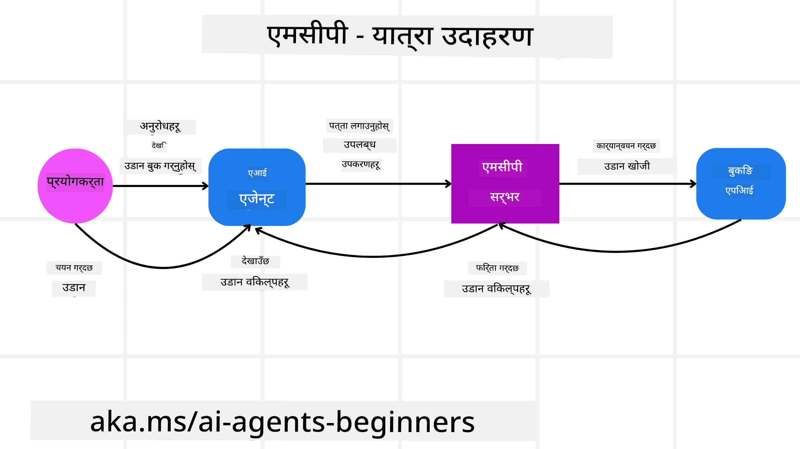
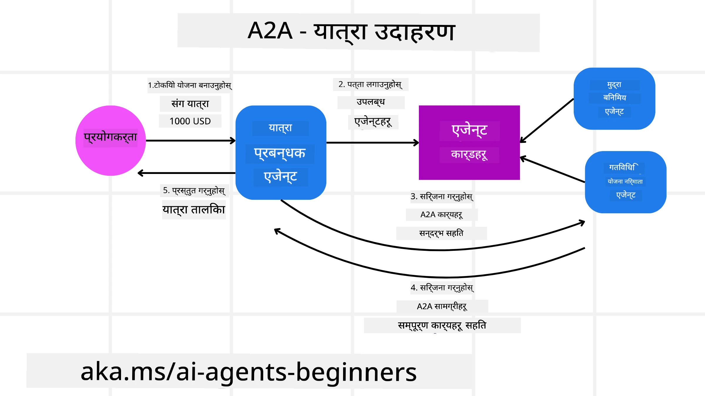
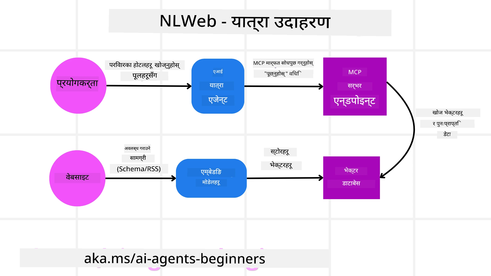

# एजेन्टिक प्रोटोकलहरू प्रयोग गर्दै (MCP, A2A र NLWeb)

> _(यो पाठको भिडियो हेर्न माथि रहेको तस्बिरमा क्लिक गर्नुहोस्)_

AI एजेन्टहरूको प्रयोग जति बढ्दो छ, मानकीकरण, सुरक्षा, र खुला नवप्रवर्तनको समर्थन गर्न प्रोटोकलहरूको आवश्यकता पनि बढ्दो छ। यस पाठमा, हामी यस आवश्यकता पुरा गर्न खोज्ने ३ प्रोटोकलहरू - मोडल कन्टेक्स्ट प्रोटोकल (MCP), एजेन्ट टु एजेन्ट (A2A) र प्राकृतिक भाषा वेब (NLWeb) बारे छलफल गर्नेछौं।

## परिचय

यस पाठमा हामीले समेट्ने विषयहरू:

• **MCP** ले कसरी AI एजेन्टहरूलाई प्रयोगकर्ताको कार्य पूरा गर्न बाह्य उपकरण र डाटा पहुँच गर्न अनुमति दिन्छ।

• **A2A** ले कसरी विभिन्न AI एजेन्टहरूबीच सञ्चार र सहकार्य सक्षम पार्छ।

• **NLWeb** ले कसरी कुनै पनि वेबसाइटमा प्राकृतिक भाषा इन्टरफेस ल्याएर AI एजेन्टहरूलाई सामग्री खोज्न र अन्तरक्रिया गर्न सक्षम बनाउँछ।

## सिकाइ लक्ष्यहरू

• AI एजेन्टहरूको सन्दर्भमा MCP, A2A, र NLWeb को मूल उद्देश्य र फाइदाहरू **पहिचान गर्नुहोस्**।

• हरेक प्रोटोकलले कसरी LLMs, उपकरणहरू, र अन्य एजेन्टहरूबीच सञ्चार र अन्तरक्रिया सहज बनाउँछ **व्याख्या गर्नुहोस्**।

• जटिल एजेन्टिक प्रणाली निर्माणमा हरेक प्रोटोकलले खेल्ने विशिष्ट भूमिका **पहिचान गर्नुहोस्**।

## मोडल कन्टेक्स्ट प्रोटोकल

**मोडल कन्टेक्स्ट प्रोटोकल (MCP)** एक खुला मानक हो जुन एप्लिकेसनहरूलाई LLMs लाई सन्दर्भ र उपकरणहरू प्रदान गर्न मानकीकृत तरिका दिन्छ। यसले AI एजेन्टहरूले विभिन्न डाटा स्रोत र उपकरणहरूसँग सुसंगत तरिकाले जडान गर्न "युनिभर्सल एडाप्टर" को भूमिका गर्छ।

आउनुहोस् MCP का तत्वहरू, सिधा API प्रयोगसँग तुलना गर्दा फाइदाहरू, र AI एजेन्टहरूले कसरी MCP सर्भर प्रयोग गर्न सक्छन् भन्ने उदाहरण हेरौं।

### MCP को मूल तत्वहरू

MCP ले **क्लाइन्ट-सर्भर आर्किटेक्चर** मा काम गर्दछ र मूल तत्वहरू हुन्:

• **होस्टहरू** LLM एप्लिकेसनहरू हुन् (जस्तै VSCode जस्तो कोड सम्पादक) जुन MCP सर्भरमा जडान सुरु गर्छन्।

• **क्लाइन्टहरू** होस्ट एप्लिकेसन भित्रका कम्पोनेन्टहरू हुन् जुन सर्भरहरूसँग एक-एक गरी जडान कायम राख्छन्।

• **सर्भरहरू** तिनीहरू छन् जसले विशेष क्षमता प्रदान गर्ने हल्का प्रोग्रामहरू हुन्।

प्रोटोकलमा तीन मूल आदान-प्रदानहरू छन् जुन MCP सर्भरका क्षमताहरू हुन्:

• **टूलहरू**: यी विशिष्ट कार्यहरू अथवा क्रियाहरू हुन् जुन AI एजेन्टले कल गरेर कार्य सम्पन्न गर्दछ। उदाहरणमा, मौसम सेवा "get weather" टूल प्रदान गर्न सक्छ, अथवा ई-कमर्स सर्भरले "purchase product" टूल दिन सक्छ। MCP सर्भरहरूले प्रत्येक टूलको नाम, व्याख्या, र इनपुट/आउटपुट ढाँचा विज्ञापन गर्छन्।

• **स्रोतहरू**: यो पढ्न मात्रै मिल्ने डाटा वा दस्तावेजहरू हुन् जुन MCP सर्भरले उपलब्ध गराउँछ, र क्लाइन्टहरूले आवश्यकता अनुसार तिनीहरू प्राप्त गर्न सक्छन्। उदाहरणका लागि फाइल सामग्री, डेटाबेस रेकर्ड, वा लग फाइलहरू। स्रोतहरू टेक्स्ट (जस्तै कोड वा JSON) वा बाइनरी (जस्तै छवि वा PDF) हुन सक्छन्।

• **प्रम्प्टहरू**: यी पूर्वनिर्धारित ढाँचाहरू हुन् जसले सुझाव दिने प्रम्प्टहरू प्रदान गर्दछन्, अधिक जटिल कार्यप्रवाहका लागि अनुमति दिन्छ।

### MCP का फाइदाहरू

MCP ले AI एजेन्टहरूका लागि महत्वपूर्ण फाइदाहरू प्रदान गर्दछ:

• **डायनामिक टूल खोज**: एजेन्टहरूले सर्भरबाट उपलब्ध टूलहरूको सूची प्राप्त गर्न सक्छन् साथै उनीहरूले के गर्छन् भन्ने विवरण पनि। परम्परागत API हरू जस्तै एकपटकको स्टेटिक कोडिङको आवश्यकता पर्दैन जसले कोड अपडेट आवश्यक पर्छ। MCP ले "एक पटक एकीकृत गर्नुहोस्" विधि प्रस्ताव गर्दछ, जसले बढी अनुकूलता दिन्छ।

• **LLMs बीच अन्तःसंचालनयोग्यता**: MCP विभिन्न LLMs मा काम गर्छ जसले मूल मोडेल साट्न सहज बनाउँछ राम्रो प्रदर्शनका लागि।

• **मानकीकृत सुरक्षा**: MCP ले मानकीकृत प्रमाणीकरण विधि समावेश गर्दछ, जसले थप MCP सर्भरहरूमा पहुँच थप्दा मामिलाहरू सरल बनाउँछ। यो विभिन्न प्रकारका परम्परागत API का लागि साँचो र प्रमाणीकरण प्रकारहरू व्यवस्थित गर्नभन्दा सजिलो हुन्छ।

### MCP उदाहरण

कल्पना गर्नुहोस्, एक प्रयोगकर्ताले MCP द्वारा संचालित AI सहायकको मद्दतले उडान बुक गर्न चाहन्छ।

१. **जडान**: AI सहायक (MCP क्लाइन्ट) एयरलाइन द्वारा प्रदान गरिएको MCP सर्भरसँग जडान गर्छ।

२. **टूल खोज**: क्लाइन्ट एयरलाइनको MCP सर्भरलाई सोध्छ, "के-के टूलहरू उपलब्ध छन्?" सर्भरले टूलहरू जस्तै "search flights" र "book flights" प्रतिक्रिया दिन्छ।

३. **टूल आह्वान**: तपाईं AI सहायकलाई सोध्नुहुन्छ, "कृपया पोर्टलैंडबाट होनोलुलुका लागि उडान खोज्नुहोस्।" AI सहायकले यसको LLM प्रयोग गरेर थाहा पाउँछ कि "search flights" टूल कल गर्नुपर्छ र सम्बन्धित प्यारामिटरहरू (उडान स्रोत, गन्तव्य) MCP सर्भरलाई दिइन्छ।

४. **कार्यसम्पादन र प्रतिक्रिया**: MCP सर्भरले एयरलाइनको आन्तरिक बुकिंग API लाई कल गर्छ। त्यसपछि प्राप्त उडान जानकारी (जस्तै JSON डाटा) फर्काएर AI सहायकलाई पठाउँछ।

५. **अगाडि अन्तरक्रिया**: AI सहायकले उडान विकल्पहरू देखाउँछ। तपाईंले उडान चयन गरेपछि, सहायकले एउटै MCP सर्भरमा "book flight" टूललाई कल गरेर बुकिंग पूरा गर्न सक्छ।

## एजेन्ट-टु-एजेन्ट प्रोटोकल (A2A)

MCP ले LLMs लाई उपकरणहरूसँग जडानमा ध्यान दिन्छ, भने **एजेन्ट-टु-एजेन्ट (A2A) प्रोटोकल** ले अर्को स्तरमा पुर्‍याउँछ, विभिन्न AI एजेन्टहरूबीच सञ्चार र सहकार्य सक्षम बनाउँछ। A2A ले विभिन्न संगठन, वातावरण र प्रविधि स्ट्याकका AI एजेन्टहरूलाई जडान गरेर साझा कार्य पूरा गर्न मद्दत गर्दछ।

हामी A2A का तत्वहरू, फाइदाहरू, र हाम्रो यात्रा एप्लिकेसनमा यसको प्रयोगको उदाहरण हेर्नेछौं।

### A2A को मूल तत्वहरू

A2A को ध्यान एजेन्टहरूबीच सञ्चार र सहकार्यमा छ जसले प्रयोगकर्ताको उपकार्य पूरा गर्छ। प्रोटोकलका प्रत्येक कम्पोनेन्ट यसमा योगदान दिन्छ:

#### एजेन्ट कार्ड

MCP सर्भरले टूलहरूको सूची साझा गर्ने जस्तै, एजेन्ट कार्डमा हुन्छ:
- एजेन्टको नाम।
- यसले पूरा गर्ने **सामान्य कार्यहरूको वर्णन**।
- अन्य एजेन्टहरू (वा मानव प्रयोगकर्ताहरू) ले यो एजेन्टलाई कहिलेसम्म र किन कल गर्ने भनेर बुझ्न मद्दत गर्ने **विशिष्ट कौशलहरूको सूची** र तिनको वर्णन।
- एजेन्टको वर्तमान **एन्डपोइन्ट URL**।
- एजेन्टको **संस्करण** र **क्षमताहरू**, जस्तै स्ट्रिमिङ प्रतिक्रिया र पुश सूचना।

#### एजेन्ट एक्जिक्युटर

एजेन्ट एक्जिक्युटरले **प्रयोगकर्ताको च्याट सन्दर्भलाई रिमोट एजेन्टसम्म पठाउने काम** गर्छ, किनभने रिमोट एजेन्टलाई कार्य बुझ्न यो आवश्यक हुन्छ। A2A सर्भरमा, एजेन्टले आफ्नै LLM प्रयोग गरेर आगन्तुक अनुरोधहरू पार्स गरी आफ्ना आन्तरिक उपकरणहरू प्रयोग गरेर कार्य सम्पन्न गर्छ।

#### आर्टिफ्याक्ट

जब रिमोट एजेन्टले अनुरोध गरिएको कार्य पूरा गर्यो, यसको काम परिणाम आर्टिफ्याक्टको रूपमा सिर्जना हुन्छ। आर्टिफ्याक्टले एजेन्टको कामको **परिणाम**, **के पूरा भयो भन्ने वर्णन**, र प्रोटोकल मार्फत पठाइएको **टेक्स्ट सन्दर्भ** समावेश गर्दछ। आर्टिफ्याक्ट पठाएपछि रिमोट एजेन्टसँगको जडान आवश्यक पर्दा मात्र फेरि खोलिन्छ।

#### घटना क्व्यु

यस कम्पोनेन्टले **अपडेटहरू सम्हाल्ने र सन्देशहरू पास गर्ने काम** गर्छ। एजेन्टिक प्रणालीहरूमा कामता पूरा नभएसम्म एजेन्टहरूबीचको जडान बन्द हुन नदिन यो उत्पादनका लागि विशेष रूपमा महत्त्वपूर्ण हुन्छ, विशेष गरी जब कार्य पूरा हुन केही समय लाग्न सक्छ।

### A2A का फाइदाहरू

• **बढेको सहकार्य**: यसले विभिन्न विक्रेता र प्लेटफर्मका एजेन्टहरूलाई अन्तरक्रिया गर्न, सन्दर्भ साझा गर्न, र सँगै काम गर्न सक्षम पार्छ, जुन परम्परागत रूपमा अलग प्रणालीहरू बाहेक कडा स्वचालन सहज बनाउँछ।

• **मोडेल चयनको लचकता**: प्रत्येक A2A एजेन्टले आफ्नो अनुरोध सेवा गर्न कुन LLM प्रयोग गर्ने निर्णय गर्छ, जसले हरेक एजेन्टका लागि अनुकूलित वा फाइन-ट्यून गरिएको मोडेलहरू अनुमति दिन्छ, MCP का केही परिदृश्यहरूमा एकल LLM जडानभन्दा फरक।

• **समावेशी प्रमाणीकरण**: प्रमाणीकरण A2A प्रोटोकलमा सीधै समाहित छ, जसले एजेन्ट अन्तरक्रियाको लागि बलियो सुरक्षा ढाँचा प्रदान गर्दछ।

### A2A उदाहरण

हाम्रो यात्रा बुकिङ परिदृश्यलाई विस्तार गरौं, तर यसपालि A2A प्रयोग गरेर।

१. **प्रयोगकर्ताको अनुरोध बहु-एजेन्टमा**: प्रयोगकर्ताले "ट्राभल एजेन्ट" A2A क्लाइन्ट/एजेन्टसँग कुराकानी गर्छ, जस्तै, "कृपया अर्को हप्ता होनोलुलुका लागि उडान, होटल, र कार भाडामा लिएर पूर्ण यात्रा बुक गर्नुहोस्।"

२. **ट्राभल एजेन्टद्वारा व्यवस्थापन**: ट्राभल एजेन्टले यो जटिल अनुरोध प्राप्त गर्छ। यसको LLM प्रयोग गरेर कार्य सम्बन्धी तार्किक विचार गर्छ र अरू विशेषज्ञ एजेन्टहरूसँग अन्तरक्रिया आवश्यक ठान्छ।

३. **एजेन्टहरुबीच सञ्चार**: ट्राभल एजेन्टले A2A प्रोटोकल प्रयोग गरेर "एयरलाइन एजेन्ट", "होटल एजेन्ट", र "कार भाडा एजेन्ट" जस्ता विभिन्न कम्पनीहरूले बनाएको डाउनस्ट्रीम एजेन्टहरूसँग जडान गर्छ।

४. **कार्य प्रतिनिधित्व गर्ने कार्यान्वयन**: ट्राभल एजेन्टले यी विशेषज्ञ एजेन्टहरूलाई विशिष्ट कार्यहरू पठाउँछ (जस्तै "होनोलुलुका उडानहरू खोज", "होटल बुक गर", "कार भाडामा लिउ")। यी प्रत्येक एजेन्टले आफ्ना LLM र आफ्ना उपकरणहरू (जुन MCP सर्भर पनि हुन सक्छ) प्रयोग गरी आफ्नो भाग पूरा गर्छ।

५. **एकीकृत प्रतिक्रिया**: सबै डाउनस्ट्रीम एजेन्टहरूले कार्य पूरा गरेपछि, ट्राभल एजेन्टले परिणामहरू (उडान विवरण, होटल पुष्टिकरण, कार बुकिङ) सङ्ग्रह गरी प्रयोगकर्तालाई समग्र, च्याट-शैलीमा प्रतिक्रिया पठाउँछ।

## प्राकृतिक भाषा वेब (NLWeb)

वेबसाइटहरू लामो समयदेखि इन्टरनेटभरि प्रयोगकर्ताहरूले जानकारी र डाटा पहुँच गर्ने प्रमुख माध्यम हुन्।

हामी NLWeb का विभिन्न कम्पोनेन्टहरू, NLWeb का फाइदाहरू, र हाम्रो यात्रा एप्लिकेसनमा NLWeb कसरि काम गर्छ भनेर हेर्नेछौं।

### NLWeb का कम्पोनेन्टहरू

- **NLWeb एप्लिकेसन (कोर सेवा कोड)**: प्राकृतिक भाषा प्रश्नहरू प्रक्रिया गर्ने प्रणाली। यो प्ल्याटफर्मका विभिन्न भागहरूलाई जोडेर प्रतिक्रिया सिर्जना गर्छ। यसलाई वेबसाइटको प्राकृतिक भाषा सुविधाहरू चलाउने **इन्जिन** पनि भन्न सकिन्छ।

- **NLWeb प्रोटोकल**: वेबसाइटसँग प्राकृतिक भाषा अन्तरक्रियाका लागि **मूल नियमहरूको सेट**। यसले JSON ढाँचामा (प्रायः Schema.org प्रयोग गरी) प्रतिक्रिया पठाउँछ। यसको उद्देश्य “AI वेब” को लागि सरल आधार निर्माण गर्नु हो, HTML ले अनलाइन कागजातहरू साझा गर्न सम्भव बनाएको जस्तै।

- **MCP सर्भर (मोडल कन्टेक्स्ट प्रोटोकल एन्डपोइन्ट)**: प्रत्येक NLWeb सेटअपले **MCP सर्भरको रूपमा पनि काम गर्छ**। यसको अर्थ यो हो कि यो अन्य AI प्रणालीहरूसँग उपकरणहरू (जस्तै “ask” विधि) र डाटा साझा गर्न सक्छ। व्यवहारमा, यो वेबसाइटको सामग्री र क्षमता AI एजेन्टहरूद्वारा प्रयोग गर्न सक्ने बनाउँछ, जसले साइटलाई व्यापक “एजेन्ट इकोसिस्टम” को भाग बनाउँछ।

- **एम्बेडिङ मोडेलहरू**: यी मोडेलहरू वेबसाइट सामग्रीलाई गणितीय प्रतिनिधित्वमा (वेक्टरहरू) रूपान्तरण गर्न प्रयोग गरिन्छ। यी वेक्टरहरूले अर्थ समात्छन् जसलाई कम्प्युटरले तुलना र खोज्न सक्छ। तिनीहरू विशेष डेटाबेसमा भण्डारण गरिन्छन्, र प्रयोगकर्ताले कुन एम्बेडिङ मोडेल प्रयोग गर्ने छनोट गर्न सक्छ।

- **वेक्टर डेटाबेस (पुनःप्राप्ति मेकानिज्म)**: यो डेटाबेसले वेबसाइट सामग्रीका एम्बेडिङहरू भण्डारण गर्छ। कसैले प्रश्न सोध्दा, NLWeb वेक्टर डेटाबेस चाँडो सबैभन्दा सान्दर्भिक सूचना फेला पार्छ। यसले सम्भावित जवाफहरूको द्रुत सूची दिन्छ, समानताका आधारमा क्रमबद्ध। NLWeb ले Qdrant, Snowflake, Milvus, Azure AI Search, र Elasticsearch जस्ता विभिन्न वेक्टर भण्डारण प्रणालीहरूसँग काम गर्दछ।

### NLWeb उदाहरणद्वारा

फेरि हाम्रो यात्रा बुकिंग वेबसाइटलाई विचार गरौं, तर यस पटक, यो NLWeb द्वारा सञ्चालित छ।

१. **डाटा खाद्यान्न**: यात्रा वेबसाइटका विद्यमान उत्पादन सूचीहरू (जस्तै उडान सूची, होटल विवरण, टूर प्याकेजहरू) Schema.org प्रयोग गरेर ढाँचाबद्ध गरिन्छ वा RSS फिडमार्फत लोड गरिन्छ। NLWeb का उपकरणहरूले यो संरचित डेटा ग्रहण गरेर एम्बेडिङहरू बनाउँछन् र तिनीहरूलाई स्थानीय वा दूरस्थ वेक्टर डेटाबेसमा भण्डारण गर्छन्।

२. **प्राकृतिक भाषा प्रश्न (मानव)**: प्रयोगकर्ता वेबसाइट भ्रमण गर्छ र मेनुहरू नहेरी, च्याट इन्टरफेसमा भन्छ, "मलाई अर्को हप्ता होनोलुलुमा परिवार अनुकूल होटल फेला पारिदिनुहोस् जुन स्विमिङ पुल छ।"

३. **NLWeb प्रक्रिया**: NLWeb एप्लिकेसनले यो प्रश्न प्राप्त गर्छ। यसले प्रश्नलाई बुझ्नका लागि LLM लाई दिन्छ र एकै समयमा यसको वेक्टर डेटाबेसमा सान्दर्भिक होटल सूची खोज्छ।

४. **सही परिणामहरू**: LLM ले डेटाबेसबाट खोज परिणामहरू व्याख्या गर्न मद्दत गर्छ, "परिवार अनुकूल," "पूल," र "होनोलुलु" आधारमा उत्तम मेलहरू पहिचान गर्छ, र प्राकृतिक भाषामा प्रतिक्रिया तयार गर्छ। मुख्य कुरा यो हो कि प्रतिक्रिया वेबसाइटको वास्तविक होटल सूचीलाई संकेत गर्दछ, काल्पनिक जानकारी होइन।

५. **AI एजेन्ट अन्तरक्रिया**: NLWeb MCP सर्भरको रूपमा सेवा दिने भएकाले, बाह्य AI यात्रा एजेन्टले पनि यो वेबसाइटको NLWeb उदाहरणसँग जडान गर्न सक्छ। AI एजेन्टले `ask` MCP विधि प्रयोग गरी वेबसाईटलाई सोध्न सक्छ: `ask("के होनोलुलु क्षेत्रमा होटलले सिफारिस गरेका भेगन-मैत्री रेस्टुराँ छन्?")`। NLWeb ले यसलाई प्रक्रिया गरी, यदि लोड गरिएको छ भने, रेस्टुराँ सूचना डेटाबेसको प्रयोग गरेर संरचित JSON प्रतिक्रिया फर्काउँछ।

### MCP/A2A/NLWeb बारे थप प्रश्नहरू छन्?

अरू सिक्नेहरूलाई भेट्न, अफिस आवर्समा भाग लिन र AI एजेन्टहरू सम्बन्धी प्रश्नहरूको उत्तर पाउन [Microsoft Foundry Discord](https://discord.com/invite/ATgtXmAS5D) मा सामेल हुनुहोस्।

## स्रोतहरू

- [MCP for Beginners](https://aka.ms/mcp-for-beginners)  
- [MCP Documentation](https://learn.microsoft.com/python/api/overview/azure/ai-projects-readme)
- [NLWeb Repo](https://github.com/nlweb-ai/NLWeb)
- [Microsoft Agent Framework](https://learn.microsoft.com/en-us/agent-framework/overview/?wt.mc_id=youtube_26688_organicsocial_reactor&pivots=programming-language-python)

## अघिल्लो पाठ

[AI Agents in Production](../10-ai-agents-production/README.md)

## अर्को पाठ

[AI एजेन्टहरूका लागि कन्टेक्स्ट इन्जिनियरिङ](../12-context-engineering/README.md)

---

<!-- CO-OP TRANSLATOR DISCLAIMER START -->
**अस्वीकरण**:
यो दस्तावेज़ AI अनुवाद सेवा [Co-op Translator](https://github.com/Azure/co-op-translator) प्रयोग गरेर अनुवाद गरिएको हो। हामी सही हुन प्रयास गर्छौं, तर कृपया जानकार हुनुस् कि स्वचालित अनुवादमा त्रुटिहरू वा अशुद्धताहरू हुन सक्छन्। मूल दस्तावेज़ यसको मूल भाषामा आधिकारिक स्रोत मानिनुपर्छ। महत्वपूर्ण जानकारीका लागि व्यावसायिक मानव अनुवाद सिफारिस गरिन्छ। यस अनुवादको प्रयोगबाट उत्पन्न कुनै पनि गलत बुझाइ वा त्रुटिको लागि हामी जिम्मेवार छैनौं।
<!-- CO-OP TRANSLATOR DISCLAIMER END -->