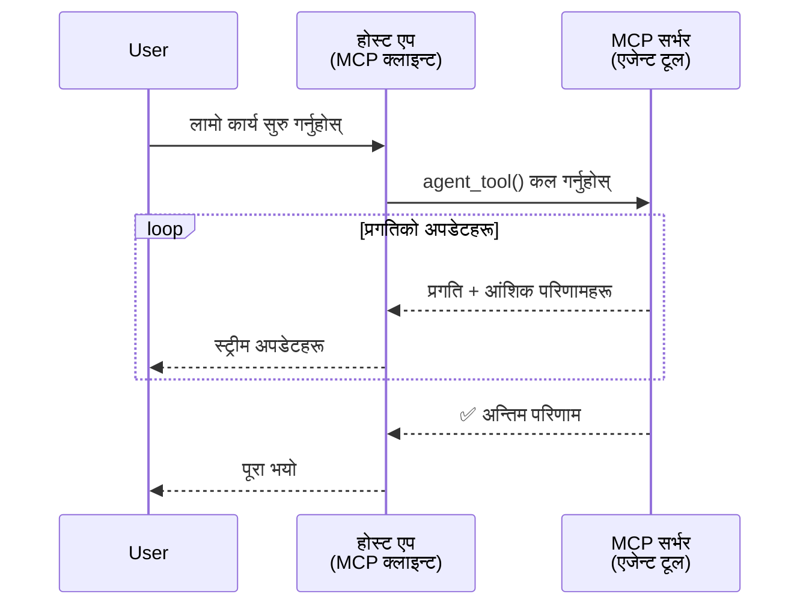
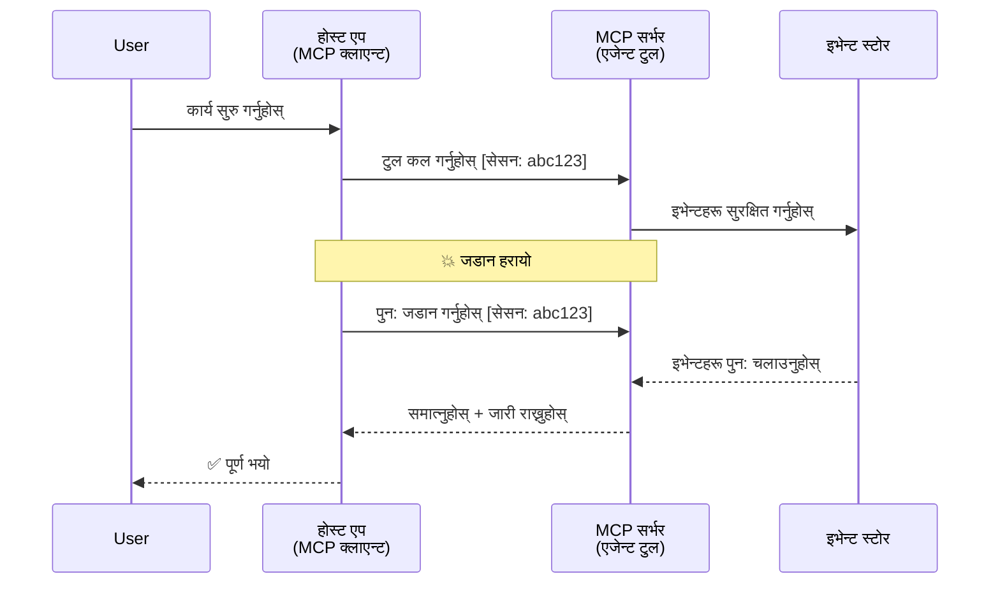
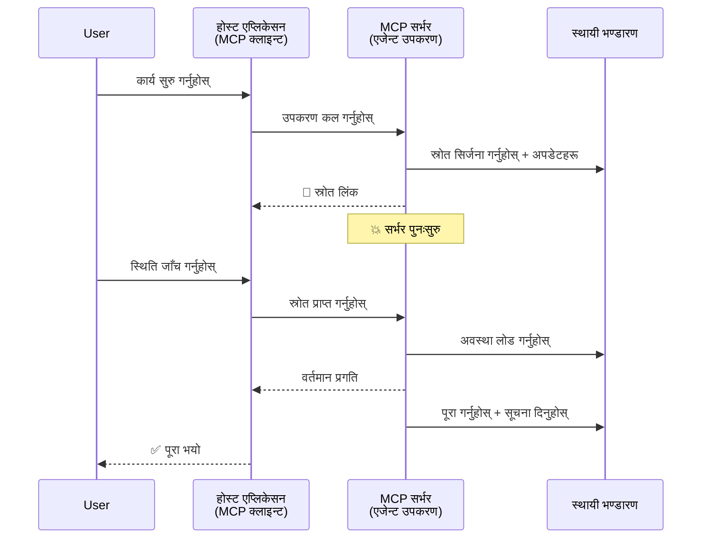
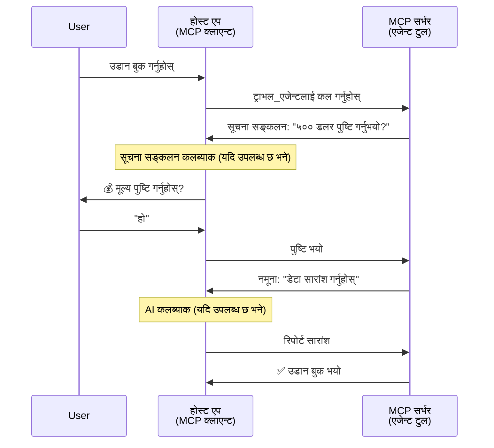
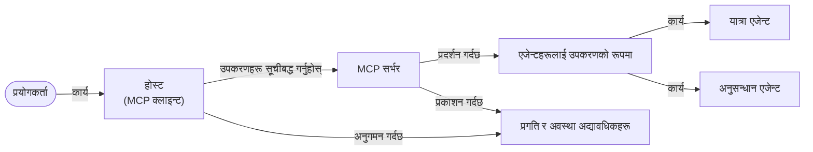

# MCP सँग एजेन्ट-टु-एजेन्ट सञ्चार प्रणाली निर्माण

> TL;DR - के तपाईँ MCP मा एजेन्ट2एजेन्ट सञ्चार निर्माण गर्न सक्नुहुन्छ? हो!

MCP ले "LLM हरूलाई सन्दर्भ प्रदान गर्ने" यसको मूल लक्ष्यभन्दा धेरै विकास गरेको छ। हालसालैका सुधारहरू जस्तै [पुन: सुरु गर्न योग्य स्ट्रिमहरू](https://modelcontextprotocol.io/docs/concepts/transports#resumability-and-redelivery), [प्रेरणा](https://modelcontextprotocol.io/specification/2025-06-18/client/elicitation), [नमूना सङ्कलन](https://modelcontextprotocol.io/specification/2025-06-18/client/sampling), र सूचनाहरू ([प्रगति](https://modelcontextprotocol.io/specification/2025-06-18/basic/utilities/progress) र [स्रोतहरू](https://modelcontextprotocol.io/specification/2025-06-18/schema#resourceupdatednotification)) समावेश गरेर, MCP अब जटिल एजेन्ट-टु-एजेन्ट सञ्चार प्रणाली बनाउनको लागि एक मजेदार आधार प्रदान गर्दछ।

## एजेन्ट/साधन गलत धारण

जब धेरै विकासकर्ताहरू एजेन्टिक व्यवहार भएका उपकरणहरू (दीर्घकालीन चल्ने, कार्यको बीचमा थप इनपुट आवश्यक हुन सक्छ, आदि) अन्वेषण गर्छन्, तब एउटा सामान्य गलत धारण हुन्छ कि MCP उपयुक्त छैन किनभने यसको प्रारम्भिक उपकरण उदाहरणहरू सरल अनुरोध-प्रतिक्रिया ढाँचामा केन्द्रित थिए।

यो दृष्टिकोण पुरानो भइसकेको छ। MCP विनिर्देशनले विगत केही महिनामा धेरै सुधारहरू गरिसकेको छ जसले दीर्घकालीन एजेन्टिक व्यवहार निर्माणमा खाडललाई बुज्न सक्षम बनाउँछ:

- **स्ट्रिमिङ र आंशिक परिणामहरू**: कार्यसम्पादनको समयमा वास्तविक-समय प्रगति अद्यावधिकहरू
- **पुन: सुरु गर्न सक्ने क्षमता**: क्लाइन्टहरू पुन: जडान भएर बन्द भएपछि पुन: सुरुवात गर्न सक्छन्
- **दृढता**: परिणामहरूले सर्भर पुनः सुरु भएपनि बाँचिरहन्छन् (जस्तै स्रोत लिङ्कहरू मार्फत)
- **धेरै चरणहरू**: कार्यसम्पादनको समयमा अन्तरक्रियात्मक इनपुट प्रेरणा र नमूना सङ्कलन मार्फत

यी सुविधाहरू जटिल एजेन्टिक र बहु-एजेन्ट अनुप्रयोगहरू सक्षम बनाउन संयोजन गर्न सकिन्छ, जे सबै MCP प्रोटोकलमा आधारित छन्।

सन्दर्भका लागि, हामी एजेन्टलाई "साधन" भनेर सम्बोधन गर्नेछौं जसले MCP सर्भरमा उपलब्ध छ। यसको मतलब हुन्छ एउटा होस्ट आवेदन जसले MCP क्लाइन्ट कार्यान्वयन गर्दछ र MCP सर्भरसँग सत्र स्थापना गरी एजेन्टलाई कल गर्न सक्छ।

## के कुरा MCP उपकरणलाई "एजेन्टिक" बनाउँछ?

कार्यान्वयनमा डुब्नु अघि, दीर्घकालसम्म चल्ने एजेन्टहरूलाई समर्थन गर्न आवश्यक पूर्वाधार क्षमताहरू के हुन्छन् भनेर स्थापन गरौं।

> हामी एजेन्टलाई एउटा यस्तै इकाइको रूपमा परिभाषित गर्नेछौं जसले स्वतन्त्र रूपमा लामो समयसम्म काम गर्न सक्छ, जटिल कार्यहरू ह्याण्डल गर्नसक्छ जुन धेरै अन्तरक्रियाहरू वा वास्तविक-समय प्रतिक्रिया अनुसार समायोजन आवश्यक हुन सक्छ।

### 1. स्ट्रिमिङ र आंशिक परिणामहरू

पारम्परिक अनुरोध-प्रतिक्रिया ढाँचाहरू लामोकार्यका लागि काम गर्दैनन्। एजेन्टहरूले प्रदान गर्नुपर्ने हुन्छ:

- वास्तविक-समय प्रगति अद्यावधिकहरू
- मध्यवर्ती परिणामहरू

**MCP समर्थन**: स्रोत अपडेट सूचना स्ट्रिम गर्दै आंशिक परिणामहरू उपलब्ध गराउँछ, यद्यपि यसले JSON-RPC को १:१ अनुरोध/प्रतिक्रिया मोडेलसँग द्वन्द्वबाट बच्न सावधानीपूर्ण डिजाइन आवश्यक पर्छ।

| सुविधा                    | प्रयोग केस                                                                                                                                                                       | MCP समर्थन                                                                                |
| -------------------------- | ------------------------------------------------------------------------------------------------------------------------------------------------------------------------------ | ------------------------------------------------------------------------------------------ |
| वास्तविक-समय प्रगति अद्यावधिकहरू | प्रयोगकर्ताले कोडबेस माइग्रेसन कार्य अनुरोध गर्दछ। एजेन्टले प्रगति स्ट्रिम गर्दछ: "१०% - निर्भरता विश्लेषण... २५% - TypeScript फाइलहरू रूपान्तरण... ५०% - आयातहरू अपडेट गर्दै..."          | ✅ प्रगति सूचनाहरू                                                                  |
| आंशिक परिणामहरू            | "किताब सिर्जना गर्नुहोस्" कार्यले आंशिक परिणामहरू स्ट्रिम गर्दछ, जस्तै १) कथा रेखाचित्र, २) अध्याय सूची, ३) प्रत्येक अध्याय पूर्ण भएपछि। होस्टले कुनै पनि चरणमा जाँच, रद्द वा पुनर्निर्देशन गर्न सक्छ। | ✅ सूचनाहरूलाई आंशिक परिणामहरू समावेश गर्न "विस्तार" गर्न सकिन्छ, PR 383, 776 मा प्रस्ताव हेर्नुहोस् |

<div align="center" style="font-style: italic; font-size: 0.95em; margin-bottom: 0.5em;">
<strong>आकृति १:</strong> यस चित्रले देखाउँछ कसरी MCP एजेन्टले लामो समयसम्म जारी रहने कार्यको दौरान होस्ट एप्लिकेसनलाई वास्तविक-समय प्रगति अद्यावधिक र आंशिक परिणाम स्ट्रिम गर्दछ, जसले प्रयोगकर्तालाई कार्यसम्पादनलाई वास्तविक समयमा अनुगमन गर्न सक्षम बनाउँछ।
</div>



### 2. पुन: सुरु गर्न सक्ने क्षमता

एजेन्टहरूले नेटवर्क अवरोधलाई सहज रूपमा ह्याण्डल गर्नुपर्छ:

- (क्लाइन्ट) डिस्कनेक्शन पछि पुन: जडान
- जहाँ छोडे त्यहाँबाट जारी राख्ने (सन्देश पुन: डेलिभरी)

**MCP समर्थन**: MCP StreamableHTTP ट्रान्सपोर्टले अहिले सत्र पुनः सुरु र सन्देश पुन: डेलिभरी session ID र अन्तिम घटना ID सँग समर्थन गर्दछ। महत्वपूर्ण कुरा यो हो कि सर्भरले यस्तो EventStore लागू गर्नुपर्छ जसले क्लाइन्ट पुन: जडानमा घटना पुन: प्ले सक्षम बनाउँछ।  
ध्यान दिनुपर्ने कुरा के छ भने एउटा समुदाय प्रस्ताव (PR #975) ट्रान्सपोर्ट-एग्नोस्टिक पुन: सुरु गर्नयोग्य स्ट्रिमहरू खोजिरहेको छ।

| सुविधा      | प्रयोग केस                                                                                                                                                   | MCP समर्थन                                                                |
| ------------ | ---------------------------------------------------------------------------------------------------------------------------------------------------------- | -------------------------------------------------------------------------- |
| पुन: सुरु गर्न सक्ने क्षमता | क्लाइन्टले लामोकार्यको दौरान डिस्कनेक्ट हुन्छ। पुन: जडान हुँदा सत्र पुन: सुरु हुन्छ, गुमेको घटनाहरू पुन: प्ले हुन्छन्, त्यसपछि कार्य अविरल जारी रहन्छ। | ✅ StreamableHTTP ट्रान्सपोर्ट सँग session ID, घटना पुन: प्ले र EventStore |

<div align="center" style="font-style: italic; font-size: 0.95em; margin-bottom: 0.5em;">
<strong>आकृति २:</strong> यस चित्रले देखाउँछ कसरी MCP को StreamableHTTP ट्रान्सपोर्ट र इभेन्ट स्टोरले सहज सत्र पुनः सुरु गर्न सक्षम बनाउँछ: यदि क्लाइन्ट डिस्कनेक्ट हुन्छ भने, पुन: जडान गरेर गुमेका घटनाहरू पुन: प्ले गर्न सक्छ, र कार्य प्रगति बिना रोकावट जारी राख्छ।
</div>



### 3. दृढता

लामोसमयसम्म सञ्चालन गर्ने एजेन्टहरूले दिर्घकालीन अवस्था आवश्यक छ:

- परिणामहरू सर्भर पुनः सुरु हुँदा टिक्छन्
- स्थिति बाहिरबाट प्राप्त गर्न सकिन्छ
- विभिन्न सत्रहरूमा प्रगति ट्र्याकिङ

**MCP समर्थन**: MCP ले अहिले टूल कलहरूको लागि स्रोत लिंक फिर्ता प्रकार समर्थन गर्दछ। सम्भावित ढाँचा यस्तै छ कि एउटा टूलले स्रोत सिर्जना गरी तुरुन्तै स्रोत लिंक फिर्ता गर्छ। टूल पृष्ठभूमिमा कार्यलाई सम्बोधन गर्न जारी राख्न सक्दछ र स्रोत अपडेट गर्छ। क्लाइन्टले यो स्रोतको अवस्था पोल गरेर आंशिक वा पूर्ण परिणाम प्राप्त गर्न सक्छ (सर्भरले प्रदान गर्ने स्रोत अपडेट अनुसार) वा स्रोत अपडेट सूचनाहरू सदस्यता लिन सक्छ।

यहाँको एउटा सीमितता भनेको स्रोतहरू पोलिङ वा अपडेटका लागि सदस्यता लिने कार्यले स्केलमा परिणामहरूको खपत गर्न सक्छ। खुला समुदाय प्रस्ताव (#992 सहित) वेबहुक वा ट्रिगरहरू समावेश गर्ने सम्भावना अनुसन्धान गर्दैछ जुन सर्भरले क्लाइन्ट/होस्टलाई अपडेटको जानकारी दिन बोलाउन सक्छ।

| सुविधा    | प्रयोग केस                                                                                                                                        | MCP समर्थन                                                        |
| ---------- | ----------------------------------------------------------------------------------------------------------------------------------------------- | ------------------------------------------------------------------ |
| दृढता | डाटा माइग्रेशन कार्यको दौरान सर्भर क्र्यास भयो। परिणाम र प्रगति पुनः सुरु भयो, क्लाइन्टले स्थिति जाँच गर्न र दिर्घकालीन स्रोतबाट जारी राख्न सक्छ। | ✅ स्रोत लिंकहरू दृढ भण्डारण र स्थिति सूचनाका साथ |

अहिले एउटा सामान्य ढाँचाले एउटा टूल डिजाइन गर्नुपर्छ जुन स्रोत सिर्जना गर्छ र तुरन्त स्रोत लिंक फिर्ता गर्छ। टूल पृष्ठभूमिमा कार्य पूरा गर्न जारी राख्न सक्छ, प्रगति अद्यावधिकका रूपमा स्रोत सूचनाहरू जारी गर्न सक्छ वा आंशिक परिणामहरू समावेश गर्न सक्छ, र स्रोतको सामग्री आवश्यक अनुसार अपडेट गर्न सक्छ।

<div align="center" style="font-style: italic; font-size: 0.95em; margin-bottom: 0.5em;">
<strong>आकृति ३:</strong> यस चित्रले देखाउँछ कसरी MCP एजेन्टहरूले दृढ स्रोत र स्थिति सूचनाहरू प्रयोग गरी लामो समयसम्म बाँचेका कार्यहरू सर्भर पुनः सुरु भएपछि पनि सुरक्षित रहन्छन्, जसले क्लाइन्टहरूलाई प्रगति जाँच गर्न र असफलतापछि पनि परिणाम प्राप्त गर्न अनुमति दिन्छ।
</div>



### 4. धेरै चरण इन्टरएक्शनहरू

एजेन्टहरूले प्रायः कार्यसम्पादनको बीचमा थप इनपुट आवश्यक पर्छ:

- मानव स्पष्टीकरण वा अनुमोदन
- जटिल निर्णयका लागि एआई सहयोग
- गतिशील प्यारामिटर समायोजन

**MCP समर्थन**: sampling (एआई इनपुटका लागि) र elicitation (मानव इनपुटका लागि) द्वारा पूर्ण रूपमा समर्थन छ।

| सुविधा                 | प्रयोग केस                                                                                                                                     | MCP समर्थन                                           |
| ----------------------- | -------------------------------------------------------------------------------------------------------------------------------------------- | ----------------------------------------------------- |
| धेरै चरण इन्टरएक्शनहरू | यात्रा बुकिङ एजेन्टले प्रयोगकर्ताबाट मूल्य पुष्टि माग्छ, त्यसपछि बुकिङ कार्य पूरा गर्नु अघि सहायक एआई लाई यात्रा डाटा सारांश गर्न बोलाउँछ। | ✅ मानवीय इनपुटका लागि प्रेरणा, एआई इनपुटका लागि नमूना सङ्कलन |

<div align="center" style="font-style: italic; font-size: 0.95em; margin-bottom: 0.5em;">
<strong>आकृति ४:</strong> यस चित्रले देखाउँछ कसरी MCP एजेन्टहरूले अन्तरक्रियात्मक रूपमा मानव इनपुट प्राप्त गर्न वा कार्यसम्पादनको बीचमा एआई सहयोग माग्न सक्छन्, पुष्टि र गतिशील निर्णय-निर्माण जस्ता जटिल, धेरै चरणका कार्यप्रवाहहरू समर्थन गर्दै।
</div>



## MCP मा दीर्घकालीन एजेन्टहरू कार्यान्वयन गर्ने - कोड अवलोकन

यस लेखको भागको रूपमा, हामीले [कोड रिपोजिटरी](https://github.com/victordibia/ai-tutorials/tree/main/MCP%20Agents) प्रदान गरेका छौं जुन MCP Python SDK सँग StreamableHTTP ट्रान्सपोर्ट प्रयोग गरी दीर्घकालीन एजेन्टहरूको पूर्ण कार्यान्वयन समावेश गर्दछ, जसले सत्र पुनः सुरु र सन्देश पुन: डेलिभरी देखाउँछ। कार्यान्वयनले देखाउँछ कसरी MCP क्षमताहरू संयोजन गरी जटिल एजेन्ट-जस्तो व्यवहार सक्षम गर्न सकिन्छ।

विशेष रूपमा, हामी दुई मुख्य एजेन्ट उपकरणहरूसँग सर्भर कार्यान्वयन गर्छौं:

- **यात्रा एजेन्ट** - प्रेरणा द्वारा मूल्य पुष्टि समेत यात्रा बुकिङ सेवा सिमुलेट गर्छ
- **अनुसन्धान एजेन्ट** - नमूना सङ्कलन द्वारा एआई-सहायता प्राप्त सारांश सहित अनुसन्धान कार्य गर्छ

दुवै एजेन्टहरूले वास्तविक-समय प्रगति अद्यावधिक, अन्तरक्रियात्मक पुष्टि, र पूर्ण सत्र पुनः सुरु क्षमताहरू प्रदर्शित गर्छन्।

### मुख्य कार्यान्वयन अवधारणाहरू

तलका खण्डहरूले प्रत्येक क्षमताको लागि सर्भर-पक्ष एजेन्ट कार्यान्वयन र क्लाइन्ट-पक्ष होस्ट ह्यान्डलिंग देखाउँछन्:

#### स्ट्रिमिङ र प्रगति अद्यावधिकहरू - वास्तविक-समय कार्य स्थिति

स्ट्रिमिङले एजेन्टहरूलाई दीर्घकालीन कार्यको दौरान वास्तविक-समय प्रगति अद्यावधिकहरू प्रदान गर्न सक्षम बनाउँछ, जसले प्रयोगकर्तालाई कार्य स्थिति र मध्यवर्ती परिणामहरूसँग सूचित राख्छ।

**सर्भर कार्यान्वयन (एजेन्टले प्रगति सूचनाहरू पठाउँछ):**

```python
# server/server.py बाट - यात्रा एजेन्ट प्रगति अपडेटहरू पठाउँदै
for i, step in enumerate(steps):
    await ctx.session.send_progress_notification(
        progress_token=ctx.request_id,
        progress=i * 25,
        total=100,
        message=step,
        related_request_id=str(ctx.request_id)
    )
    await anyio.sleep(2)  # काम अनुकरण गर्नुहोस्

# वैकल्पिक: विस्तृत चरण-द्वारा-चरण अपडेटहरूको लागि लग सन्देशहरू
await ctx.session.send_log_message(
    level="info",
    data=f"Processing step {current_step}/{steps} ({progress_percent}%)",
    logger="long_running_agent",
    related_request_id=ctx.request_id,
)
```

**क्लाइन्ट कार्यान्वयन (होस्टले प्रगति अद्यावधिकहरू प्राप्त गर्छ):**

```python
# client/client.py बाट - रियल-टाइम सूचनाहरू ह्यान्डल गर्दै क्लाइन्ट
async def message_handler(message) -> None:
    if isinstance(message, types.ServerNotification):
        if isinstance(message.root, types.LoggingMessageNotification):
            console.print(f"📡 [dim]{message.root.params.data}[/dim]")
        elif isinstance(message.root, types.ProgressNotification):
            progress = message.root.params
            console.print(f"🔄 [yellow]{progress.message} ({progress.progress}/{progress.total})[/yellow]")

# सेसन सिर्जना गर्दा मेसेज ह्यान्डलर दर्ता गर्नुहोस्
async with ClientSession(
    read_stream, write_stream,
    message_handler=message_handler
) as session:
```

#### प्रेरणा - प्रयोगकर्ता इनपुट अनुरोध

प्रेरणाले एजेन्टहरूलाई कार्यसम्पादनको बीचमा प्रयोगकर्ता इनपुट अनुरोध गर्न सक्षम बनाउँछ। लामो कार्यको दौरान पुष्टि, स्पष्टीकरण वा अनुमोदनका लागि यो आवश्यक छ।

**सर्भर कार्यान्वयन (एजेन्टले पुष्टि माग्छ):**

```python
# सर्भर/server.py बाट - यात्रा एजेन्ट मूल्य पुष्टि गर्न अनुरोध गर्दैछ
elicit_result = await ctx.session.elicit(
    message=f"Please confirm the estimated price of $1200 for your trip to {destination}",
    requestedSchema=PriceConfirmationSchema.model_json_schema(),
    related_request_id=ctx.request_id,
)

if elicit_result and elicit_result.action == "accept":
    # बुकिङ् जारी राख्नुहोस्
    logger.info(f"User confirmed price: {elicit_result.content}")
elif elicit_result and elicit_result.action == "decline":
    # बुकिङ् रद्द गर्नुहोस्
    booking_cancelled = True
```

**क्लाइन्ट कार्यान्वयन (होस्टले प्रेरणा कलब्याक प्रदान गर्छ):**

```python
# client/client.py बाट - क्लाइंट ह्यान्डलिङ अनुरोधहरू संकलन गर्दै
async def elicitation_callback(context, params):
    console.print(f"💬 Server is asking for confirmation:")
    console.print(f"   {params.message}")

    response = console.input("Do you accept? (y/n): ").strip().lower()

    if response in ['y', 'yes']:
        return types.ElicitResult(
            action="accept",
            content={"confirm": True, "notes": "Confirmed by user"}
        )
    else:
        return types.ElicitResult(
            action="decline",
            content={"confirm": False, "notes": "Declined by user"}
        )

# सेसन सिर्जना गर्दा कलब्याक दर्ता गर्नुहोस्
async with ClientSession(
    read_stream, write_stream,
    elicitation_callback=elicitation_callback
) as session:
```

#### नमूना सङ्कलन - AI सहयोग अनुरोध

नमूना सङ्कलनले एजेन्टहरूलाई जटिल निर्णय वा सामग्री सिर्जनाको लागि LLM सहयोग माग्न सक्षम पार्दछ। यसले मानव-एआई संयुक्त कार्यप्रवाहलाई सक्षम बनाउँछ।

**सर्भर कार्यान्वयन (एजेन्टले AI सहयोग माग्छ):**

```python
# server/server.py बाट - अनुसन्धान एजेन्टले AI सारांश अनुरोध गर्दैछ
sampling_result = await ctx.session.create_message(
    messages=[
        SamplingMessage(
            role="user",
            content=TextContent(type="text", text=f"Please summarize the key findings for research on: {topic}")
        )
    ],
    max_tokens=100,
    related_request_id=ctx.request_id,
)

if sampling_result and sampling_result.content:
    if sampling_result.content.type == "text":
        sampling_summary = sampling_result.content.text
        logger.info(f"Received sampling summary: {sampling_summary}")
```

**क्लाइन्ट कार्यान्वयन (होस्टले नमूना कलब्याक प्रदान गर्छ):**

```python
# client/client.py बाट - क्लाएन्टले नमुना अनुरोधहरू ह्यान्डल गर्दै
async def sampling_callback(context, params):
    message_text = params.messages[0].content.text if params.messages else 'No message'
    console.print(f"🧠 Server requested sampling: {message_text}")

    # वास्तविक अनुप्रयोगमा, यसले LLM API कल गर्न सक्छ
    # डेमो उद्देश्यका लागि, हामी नकली प्रतिक्रिया प्रदान गर्छौं
    mock_response = "Based on current research, MCP has evolved significantly..."

    return types.CreateMessageResult(
        role="assistant",
        content=types.TextContent(type="text", text=mock_response),
        model="interactive-client",
        stopReason="endTurn"
    )

# सेसन सिर्जना गर्दा कलब्याक दर्ता गर्नुहोस्
async with ClientSession(
    read_stream, write_stream,
    sampling_callback=sampling_callback,
    elicitation_callback=elicitation_callback
) as session:
```

#### पुन: सुरु गर्न सक्ने क्षमता - डिस्कनेक्शनपछि सत्र निरन्तरता

पुन: सुरु गर्न सक्ने क्षमताले सुनिश्चित गर्छ कि दीर्घकालीन एजेन्ट कार्यहरूले क्लाइन्ट डिस्कनेक्शनहरूबाट बचेर पुन: जडानमा बिना रोकावट जारी रहन्छ। यो घटना भण्डार र पुन: सुरु टोकनहरू मार्फत कार्यान्वित हुन्छ।

**इभेन्ट स्टोर कार्यान्वयन (सर्भरले सत्र अवस्था राख्छ):**

```python
# server/event_store.py बाट - सरल इन-मेमोरी इभेन्ट स्टोर
class SimpleEventStore(EventStore):
    def __init__(self):
        self._events: list[tuple[StreamId, EventId, JSONRPCMessage]] = []
        self._event_id_counter = 0

    async def store_event(self, stream_id: StreamId, message: JSONRPCMessage) -> EventId:
        """Store an event and return its ID."""
        self._event_id_counter += 1
        event_id = str(self._event_id_counter)
        self._events.append((stream_id, event_id, message))
        return event_id

    async def replay_events_after(self, last_event_id: EventId, send_callback: EventCallback) -> StreamId | None:
        """Replay events after the specified ID for resumption."""
        start_index = None
        stream_id = None
        for index, (event_stream_id, event_id, _) in enumerate(self._events):
            if event_id == last_event_id:
                start_index = index + 1
                stream_id = event_stream_id
                break

        if start_index is None:
            return None

        # सत्रको मूल स्ट्रिमबाट मात्र पछि भएका घटनाहरू पुन:चलाउनुहोस्।
        for event_stream_id, event_id, message in self._events[start_index:]:
            if event_stream_id != stream_id:
                continue
            await send_callback(EventMessage(message, event_id))

        return stream_id

# server/server.py बाट - सत्र प्रबन्धकलाई इभेन्ट स्टोर पठाउन
def create_server_app(event_store: Optional[EventStore] = None) -> Starlette:
    server = ResumableServer()

    # पुनः सुरुका लागि इभेन्ट स्टोर सहित सत्र प्रबन्धक सिर्जना गर्नुहोस्
    session_manager = StreamableHTTPSessionManager(
        app=server,
        event_store=event_store,  # इभेन्ट स्टोरले सत्र पुनः सुरु गर्न सक्षम पार्दछ
        json_response=False,
        security_settings=security_settings,
    )

    return Starlette(routes=[Mount("/mcp", app=session_manager.handle_request)])

# प्रयोग: इभेन्ट स्टोरसँग प्रारम्भ गर्नुहोस्
event_store = SimpleEventStore()
app = create_server_app(event_store)
```

**क्लाइन्ट मेटाडाटा पुनः सुरु टोकनसहित (क्लाइन्टले सुरक्षित अवस्थामा पुन: जडान गर्छ):**

```python
# client/client.py बाट - मेटाडाटा सहित क्लाइन्ट पुनः सुरुवात
if existing_tokens and existing_tokens.get("resumption_token"):
    # जहाबाट छोड्यौं त्यहींबाट जारी राख्नको लागि अवस्थित पुनः सुरुवात टोकन प्रयोग गर्नुहोस्
    metadata = ClientMessageMetadata(
        resumption_token=existing_tokens["resumption_token"],
    )
else:
    # पुनः सुरुवात टोकन प्राप्त हुँदा बचत गर्नको लागि कलब्याक बनाउनुहोस्
    def enhanced_callback(token: str):
        protocol_version = getattr(session, 'protocol_version', None)
        token_manager.save_tokens(session_id, token, protocol_version, command, args)

    metadata = ClientMessageMetadata(
        on_resumption_token_update=enhanced_callback,
    )

# पुनः सुरुवात मेटाडाटा सहित अनुरोध पठाउनुहोस्
result = await session.send_request(
    types.ClientRequest(
        types.CallToolRequest(
            method="tools/call",
            params=types.CallToolRequestParams(name=command, arguments=args)
        )
    ),
    types.CallToolResult,
    metadata=metadata,
)
```

होस्ट एप्लिकेसनले सत्र ID र पुन: सुरु टोकनहरू स्थानीय रूपमा राख्छ, जसले यसलाई प्रगतिलाई वा अवस्थालाई गुमाउनुपर्ने बिना विद्यमान सत्रहरूसँग पुन: जडान गर्न सक्षम बनाउँछ।

### कोड संगठन

<div align="center" style="font-style: italic; font-size: 0.95em; margin-bottom: 0.5em;">
<strong>आकृति ५:</strong> MCP-आधारित एजेन्ट सिस्टम वास्तुकला
</div>



**मुख्य फाइलहरू:**

- **`server/server.py`** - पुन: सुरु गर्न सकिने MCP सर्भर यात्रा र अनुसन्धान एजेन्टहरूसँग जसले प्रेरणा, नमूना सङ्कलन र प्रगति अद्यावधिकहरू प्रदर्शन गर्छन्
- **`client/client.py`** - अन्तरक्रियात्मक होस्ट एप्लिकेसन पुन: सुरु समर्थन, कलब्याक ह्यान्डलरहरू, र टोकन प्रबंधन सहित
- **`server/event_store.py`** - सत्र पुन: सुरु र सन्देश पुन: डेलिभरी सक्षम पार्ने इभेन्ट स्टोर कार्यान्वयन

## MCP मा बहु-एजेन्ट सञ्चारमा विस्तार

माथिको कार्यान्वयन होस्ट एप्लिकेसनको बुद्धिमत्ता र दायराले विस्तार गरेर बहु-एजेन्ट प्रणालीमा रूपान्तरण गर्न सकिन्छ:

- **बुद्धिमान कार्य विघटन**: होस्टले जटिल प्रयोगकर्ता अनुरोधहरू विश्लेषण गरी विभिन्न विशेष एजेन्टहरूका लागि उप-कार्यहरूमा विभाजन गर्छ
- **बहु-सर्भर समन्वय**: होस्टले धेरै MCP सर्भरसँग जडानहरू राख्छ, प्रत्येकले फरक एजेन्ट क्षमताहरू खोल्दछ
- **कार्य अवस्था व्यवस्थापन**: होस्टले एकैचोटि धेरै एजेन्ट कार्यहरूको प्रगति ट्र्याक गर्छ, निर्भरता र अनुक्रमण ह्याण्डल गर्दै
- **प्रतिरोध र पुनः प्रयासहरू**: होस्टले असफलता प्रबंधन, पुनः प्रयास तर्क कार्यान्वयन, र एजेन्टहरू अनुपलब्ध हुँदा कार्य फेरि मार्गनिर्देशन गर्दछ
- **परिणाम संश्लेषण**: होस्टले धेरै एजेन्टहरूको आउटपुटहरूलाई सुसंगत अंतिम परिणाममा संयोजन गर्छ

होस्ट सादा क्लाइन्टबाट बुद्धिमान समन्वयकमा विकसित हुन्छ, वितरण गरिएको एजेन्ट क्षमताहरू समन्वय गर्दै तर समान MCP प्रोटोकल आधार कायम राख्दै।

## निष्कर्ष

MCP को प्रवर्द्धित क्षमताहरू - स्रोत सूचनाहरू, प्रेरणा/नमूना सङ्कलन, पुन: सुरु गर्न योग्य स्ट्रिमहरू, र दिर्घकालीन स्रोतहरू - जटिल एजेन्ट-टु-एजेन्ट अन्तरक्रियाहरूलाई सक्षम बनाउँछन् जबकि प्रोटोकल सरलता कायम राख्छन्।

## सुरु गर्ने तरिका

आफ्नो एजेन्ट2एजेन्ट प्रणाली निर्माण गर्न तयार? यी चरणहरू पालना गर्नुहोस्:

### 1. डेमो चलाउनुहोस्

```bash
# पुनः सुरु गर्न इभेन्ट स्टोर सहित सर्भर सुरु गर्नुहोस्
python -m server.server --port 8006

# अर्को टर्मिनलमा, अन्तरक्रियात्मक क्लाइन्ट चलाउनुहोस्
python -m client.client --url http://127.0.0.1:8006/mcp
```

**अन्तरक्रियात्मक मोडमा उपलब्ध आदेशहरू:**

- `travel_agent` - यात्रा बुक गर्नुहोस् मूल्य पुष्टि सहायतासहित प्रेरणाको माध्यमबाट
- `research_agent` - अनुसन्धान विषयहरू AI-सहायता प्राप्त सारांशका साथ नमूना सङ्कलन संग
- `list` - सबै उपलब्ध उपकरणहरू देखाउनुहोस्
- `clean-tokens` - पुनः सुरु टोकनहरू सफा गर्नुहोस्
- `help` - विस्तृत आदेश सहायताहरू देखाउनुहोस्
- `quit` - क्लाइन्ट निकास गर्नुहोस्

### 2. पुन: सुरु क्षमताहरू परीक्षण गर्नुहोस्

- लामो चलेको एजेन्ट सुरू गर्नुहोस् (उदाहरणका लागि, `travel_agent`)
- कार्यसम्पादन बीचमा क्लाइन्टलाई अवरोध गर्नुहोस् (Ctrl+C)
- क्लाइन्ट पुनः सुरु गर्नुहोस् - यो स्वचालित रूपमा जहाँ छोड्यो त्यहाँबाट पुनः सुरु हुनेछ

### 3. खोजी र विस्तार गर्नुहोस्

- **उदाहरणहरू अन्वेषण गर्नुहोस्**: यसलाई हेर्नुहोस् [mcp-agents](https://github.com/victordibia/ai-tutorials/tree/main/MCP%20Agents)
- **समुदायमा सहभागी हुनुहोस्**: GitHub मा MCP छलफलहरूमा सहभागी हुनुहोस्
- **प्रयोग गर्नुहोस्**: एक सरल दीर्घकालीन कार्यबाट सुरु गर्नुहोस् र क्रमशः स्ट्रिमिङ, पुनः सुरु गर्न सक्ने क्षमता, र बहु-एजेन्ट समन्वय थप्दै जानुहोस्

यसले देखाउँछ कि कसरी MCP ले बुद्धिमान एजेन्ट व्यवहारहरू सक्षम पार्दछ जबकि उपकरण-आधारित सरलता कायम राख्दै।

समग्रमा, MCP प्रोटोकल विशिष्टता छिटो विकास भइरहेको छ; पाठकले सबैभन्दा नयाँ अद्यावधिकहरूको लागि आधिकारिक डकुमेन्टेसन वेबसाइट - https://modelcontextprotocol.io/introduction -- हेर्न उत्साहित गरिन्छ

---

<!-- CO-OP TRANSLATOR DISCLAIMER START -->
**अस्वीकरण**:
यो दस्तावेज़ AI अनुवाद सेवा [Co-op Translator](https://github.com/Azure/co-op-translator) प्रयोग गरेर अनुवाद गरिएको हो। हामी सही हुन प्रयास गर्छौं, तर कृपया जानकार हुनुस् कि स्वचालित अनुवादमा त्रुटिहरू वा अशुद्धताहरू हुन सक्छन्। मूल दस्तावेज़ यसको मूल भाषामा आधिकारिक स्रोत मानिनुपर्छ। महत्वपूर्ण जानकारीका लागि व्यावसायिक मानव अनुवाद सिफारिस गरिन्छ। यस अनुवादको प्रयोगबाट उत्पन्न कुनै पनि गलत बुझाइ वा त्रुटिको लागि हामी जिम्मेवार छैनौं।
<!-- CO-OP TRANSLATOR DISCLAIMER END -->