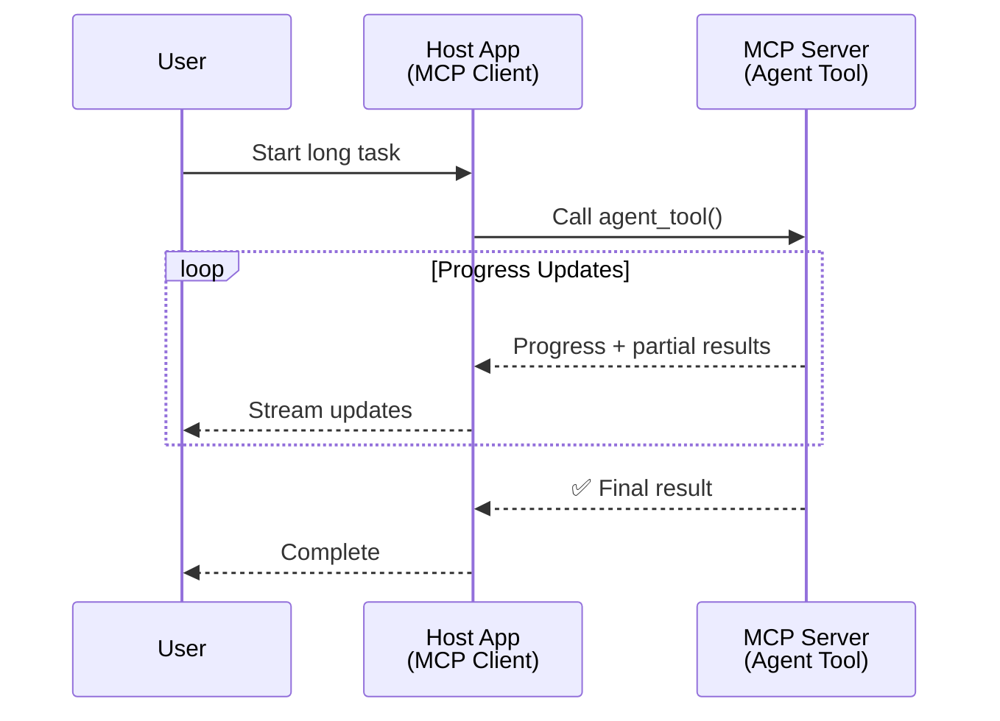
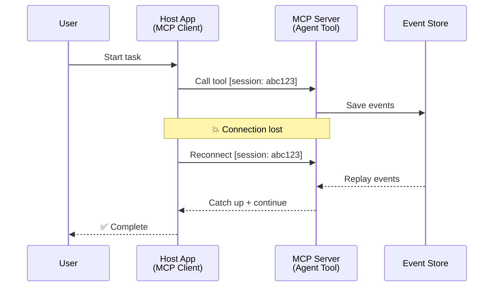
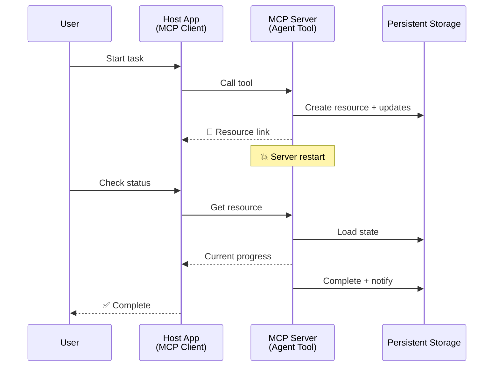
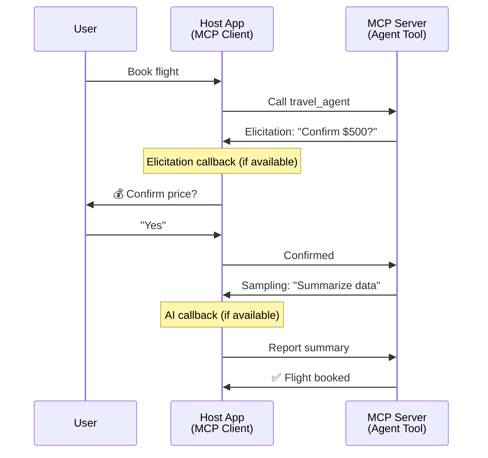

<!--
CO_OP_TRANSLATOR_METADATA:
{
  "original_hash": "5cc6836626047aa055e8960c8484a7d0",
  "translation_date": "2025-07-24T09:41:17+00:00",
  "source_file": "11-mcp/code_samples/mcp-agents/README.md",
  "language_code": "ne"
}
-->
# MCP प्रयोग गरेर एजेन्ट-देखि-एजेन्ट संचार प्रणाली निर्माण

> संक्षेपमा - के तपाई MCP मा Agent2Agent संचार प्रणाली निर्माण गर्न सक्नुहुन्छ? हो, सकिन्छ!

MCP आफ्नो प्रारम्भिक उद्देश्य "LLMs लाई सन्दर्भ प्रदान गर्ने" भन्दा धेरै परिपक्व भइसकेको छ। हालैका सुधारहरू जस्तै [resumable streams](https://modelcontextprotocol.io/docs/concepts/transports#resumability-and-redelivery), [elicitation](https://modelcontextprotocol.io/specification/2025-06-18/client/elicitation), [sampling](https://modelcontextprotocol.io/specification/2025-06-18/client/sampling), र सूचनाहरू ([progress](https://modelcontextprotocol.io/specification/2025-06-18/basic/utilities/progress) र [resources](https://modelcontextprotocol.io/specification/2025-06-18/schema#resourceupdatednotification)) को समावेशले MCP लाई जटिल एजेन्ट-देखि-एजेन्ट संचार प्रणाली निर्माणका लागि बलियो आधार प्रदान गरेको छ।

## एजेन्ट/टूलको भ्रम

जब धेरै विकासकर्ताहरूले एजेन्टिक व्यवहार भएका उपकरणहरू (लामो समयसम्म चल्ने, कार्यान्वयनको बीचमा थप इनपुट आवश्यक पर्ने, आदि) अन्वेषण गर्न थाल्छन्, एउटा सामान्य भ्रम यो हो कि MCP उपयुक्त छैन, मुख्यतः किनभने यसको प्रारम्भिक उपकरणहरूको उदाहरणले साधारण अनुरोध-प्रतिक्रिया ढाँचामा ध्यान केन्द्रित गरेको थियो।

यो धारणा अब पुरानो भइसकेको छ। पछिल्ला केही महिनाहरूमा MCP विशिष्टतामा भएका महत्वपूर्ण सुधारहरूले लामो समयसम्म चल्ने एजेन्टिक व्यवहार निर्माणका लागि आवश्यक क्षमताहरूको खाडललाई पूर्ति गरेका छन्:

- **Streaming & Partial Results**: कार्यान्वयनको क्रममा वास्तविक-समय प्रगति अद्यावधिकहरू
- **Resumability**: डिस्कनेक्शनपछि पुन: जडान र निरन्तरता
- **Durability**: परिणामहरू सर्भर पुनःसुरु भएपछि पनि सुरक्षित रहन्छन् (जस्तै, resource links मार्फत)
- **Multi-turn**: कार्यान्वयनको बीचमा अन्तरक्रियात्मक इनपुट (elicitation र sampling मार्फत)

यी सुविधाहरूलाई संयोजन गरेर जटिल एजेन्टिक र बहु-एजेन्ट अनुप्रयोगहरू सक्षम बनाउन सकिन्छ, जुन सबै MCP प्रोटोकलमा तैनाथ गर्न सकिन्छ।

सन्दर्भका लागि, हामी एजेन्टलाई MCP सर्भरमा उपलब्ध "टूल" को रूपमा उल्लेख गर्नेछौं। यसको मतलब होस्ट एप्लिकेसनको अस्तित्व, जसले MCP क्लाइन्ट कार्यान्वयन गर्दछ, MCP सर्भरसँग सत्र स्थापना गर्दछ, र एजेन्टलाई कल गर्न सक्छ।

## के MCP टूललाई "एजेन्टिक" बनाउँछ?

कार्यान्वयनमा जानु अघि, लामो समयसम्म चल्ने एजेन्टहरूलाई समर्थन गर्न आवश्यक पूर्वाधार क्षमताहरू के हुन् भनेर निर्धारण गरौं।

> हामी एजेन्टलाई यस्तो इकाईको रूपमा परिभाषित गर्नेछौं, जसले विस्तारित अवधिमा स्वतन्त्र रूपमा सञ्चालन गर्न सक्छ, जटिल कार्यहरू सम्हाल्न सक्षम छ, जसमा बहु-अन्तरक्रिया वा वास्तविक-समय प्रतिक्रिया अनुसार समायोजन आवश्यक पर्न सक्छ।

### 1. Streaming & Partial Results

पारम्परिक अनुरोध-प्रतिक्रिया ढाँचाहरू लामो समयसम्म चल्ने कार्यहरूको लागि उपयुक्त हुँदैनन्। एजेन्टहरूले निम्न प्रदान गर्न आवश्यक छ:

- वास्तविक-समय प्रगति अद्यावधिकहरू
- मध्यवर्ती परिणामहरू

**MCP समर्थन**: Resource update notifications ले आंशिक परिणामहरूको स्ट्रिमिङ सक्षम बनाउँछ, यद्यपि यो JSON-RPC को 1:1 अनुरोध/प्रतिक्रिया मोडेलसँग द्वन्द्व टार्न सावधानीपूर्वक डिजाइन आवश्यक छ।

| सुविधा                     | प्रयोग केस                                                                                                                                                                       | MCP समर्थन                                                                                 |
| -------------------------- | ------------------------------------------------------------------------------------------------------------------------------------------------------------------------------ | ------------------------------------------------------------------------------------------ |
| वास्तविक-समय प्रगति अद्यावधिक | प्रयोगकर्ताले कोडबेस माइग्रेसन कार्य अनुरोध गर्दछ। एजेन्टले प्रगति स्ट्रिम गर्दछ: "१०% - निर्भरता विश्लेषण गर्दै... २५% - टाइपस्क्रिप्ट फाइलहरू रूपान्तरण गर्दै... ५०% - आयात अद्यावधिक गर्दै..."          | ✅ प्रगति सूचनाहरू                                                                  |
| आंशिक परिणामहरू            | "पुस्तक उत्पन्न गर्नुहोस्" कार्यले आंशिक परिणामहरू स्ट्रिम गर्दछ, जस्तै, १) कथा चाप रूपरेखा, २) अध्याय सूची, ३) प्रत्येक अध्याय पूरा भएपछि। होस्टले कुनै पनि चरणमा निरीक्षण, रद्द, वा पुन: निर्देशन गर्न सक्छ। | ✅ सूचनाहरूलाई "विस्तारित" गर्न सकिन्छ, आंशिक परिणामहरू समावेश गर्न PR 383, 776 मा प्रस्तावहरू हेर्नुहोस् |

<strong>चित्र १:</strong> यो आरेखले देखाउँछ कि कसरी MCP एजेन्टले लामो समयसम्म चल्ने कार्यको क्रममा होस्ट एप्लिकेसनमा वास्तविक-समय प्रगति अद्यावधिकहरू र आंशिक परिणामहरू स्ट्रिम गर्दछ, प्रयोगकर्तालाई कार्यान्वयन वास्तविक समयमा अनुगमन गर्न सक्षम बनाउँछ।

### 2. Resumability

एजेन्टहरूले नेटवर्क अवरोधहरूलाई सहज रूपमा सम्हाल्न सक्षम हुनुपर्छ:

- (क्लाइन्ट) डिस्कनेक्शनपछि पुन: जडान
- जहाँबाट छोडिएको थियो, त्यहाँबाट निरन्तरता (सन्देश पुन: डेलिभरी)

**MCP समर्थन**: MCP StreamableHTTP ट्रान्सपोर्टले आज सत्र पुन: सुरु र सन्देश पुन: डेलिभरीलाई सत्र आईडीहरू र अन्तिम घटना आईडीहरूसँग समर्थन गर्दछ। यहाँ महत्त्वपूर्ण कुरा यो हो कि सर्भरले EventStore कार्यान्वयन गर्नुपर्छ, जसले क्लाइन्ट पुन: जडानमा घटना पुन: प्ले सक्षम गर्दछ।  
ध्यान दिनुहोस् कि त्यहाँ एक समुदाय प्रस्ताव (PR #975) छ, जसले ट्रान्सपोर्ट-अज्ञेय पुन: सुरु गर्न मिल्ने स्ट्रिमहरूको अन्वेषण गर्दछ।

| सुविधा      | प्रयोग केस                                                                                                                                                   | MCP समर्थन                                                                |
| ------------ | ---------------------------------------------------------------------------------------------------------------------------------------------------------- | -------------------------------------------------------------------------- |
| Resumability | क्लाइन्ट लामो समयसम्म चल्ने कार्यको क्रममा डिस्कनेक्ट हुन्छ। पुन: जडानमा, सत्र पुन: सुरु हुन्छ, छुटेका घटनाहरू पुन: प्ले गरिन्छ, जहाँबाट छोडिएको थियो, त्यहाँबाट सहज रूपमा निरन्तरता हुन्छ। | ✅ StreamableHTTP ट्रान्सपोर्ट सत्र आईडी, घटना पुन: प्ले, र EventStore को साथ |

<strong>चित्र २:</strong> यो आरेखले देखाउँछ कि कसरी MCP को StreamableHTTP ट्रान्सपोर्ट र इभेन्ट स्टोरले सहज सत्र पुन: सुरु सक्षम गर्दछ: यदि क्लाइन्ट डिस्कनेक्ट हुन्छ भने, यसले पुन: जडान गर्न सक्छ र छुटेका घटनाहरू पुन: प्ले गर्न सक्छ, प्रगति गुमाउन बिना कार्य निरन्तरता गर्दै।

### 3. Durability

लामो समयसम्म चल्ने एजेन्टहरूले स्थायी अवस्था आवश्यक पर्छ:

- परिणामहरू सर्भर पुनःसुरु भएपछि पनि सुरक्षित रहन्छन्
- स्थिति बाहिरी रूपमा पुन: प्राप्त गर्न सकिन्छ
- सत्रहरूमा प्रगति ट्र्याकिङ

**MCP समर्थन**: MCP ले अब टूल कलहरूको लागि Resource link रिटर्न प्रकारलाई समर्थन गर्दछ। आज, एउटा सम्भावित ढाँचा भनेको एउटा टूल डिजाइन गर्नु हो, जसले एउटा स्रोत सिर्जना गर्दछ र तुरुन्तै स्रोत लिङ्क फिर्ता गर्दछ। टूलले पृष्ठभूमिमा कार्यलाई सम्बोधन गर्न जारी राख्न सक्छ र स्रोतलाई अद्यावधिक गर्न सक्छ। बदलेमा, क्लाइन्टले यो स्रोतको स्थिति प्राप्त गर्न, आंशिक वा पूर्ण परिणामहरू प्राप्त गर्न (सर्भरले प्रदान गर्ने स्रोत अद्यावधिकहरूमा आधारित) वा अद्यावधिकहरूको लागि स्रोतलाई सदस्यता लिन छनोट गर्न सक्छ।

यहाँ एउटा सीमितता भनेको स्रोतहरू पोल गर्नु वा अद्यावधिकहरूको लागि सदस्यता लिनु स्रोतहरू खपत गर्न सक्छ, जसले स्केलमा प्रभाव पार्न सक्छ। त्यहाँ एउटा खुला समुदाय प्रस्ताव (जसमा #992 समावेश छ) छ, जसले वेबहुकहरू वा ट्रिगरहरू समावेश गर्ने सम्भावनाको अन्वेषण गर्दछ, जसले सर्भरले क्लाइन्ट/होस्ट एप्लिकेसनलाई अद्यावधिकहरूको सूचित गर्न कल गर्न सक्छ।

| सुविधा    | प्रयोग केस                                                                                                                                        | MCP समर्थन                                                        |
| ---------- | ----------------------------------------------------------------------------------------------------------------------------------------------- | ------------------------------------------------------------------ |
| Durability | सर्भर डाटा माइग्रेसन कार्यको क्रममा क्र्यास हुन्छ। परिणामहरू र प्रगति पुनःसुरु भएपछि सुरक्षित रहन्छ, क्लाइन्टले स्थिति जाँच गर्न सक्छ र स्थायी स्रोतबाट निरन्तरता दिन सक्छ। | ✅ स्रोत लिङ्कहरू स्थायी भण्डारण र स्थिति सूचनाहरूको साथ |

आज, एउटा सामान्य ढाँचा भनेको एउटा टूल डिजाइन गर्नु हो, जसले एउटा स्रोत सिर्जना गर्दछ र तुरुन्तै स्रोत लिङ्क फिर्ता गर्दछ। टूलले पृष्ठभूमिमा कार्यलाई सम्बोधन गर्न जारी राख्न सक्छ, स्रोत सूचनाहरू जारी गर्न सक्छ, जसले प्रगति अद्यावधिकहरू वा आंशिक परिणामहरूका रूपमा काम गर्दछ, र आवश्यकतानुसार स्रोतको सामग्री अद्यावधिक गर्न सक्छ।

<strong>चित्र ३:</strong> यो आरेखले देखाउँछ कि कसरी MCP एजेन्टहरूले स्थायी स्रोतहरू र स्थिति सूचनाहरू प्रयोग गरेर लामो समयसम्म चल्ने कार्यहरू सर्भर पुनःसुरु भए पनि सुरक्षित राख्छन्, क्लाइन्टलाई प्रगति जाँच गर्न र असफलतापछि पनि परिणामहरू पुन: प्राप्त गर्न अनुमति दिन्छ।

### 4. Multi-Turn Interactions

एजेन्टहरूले कार्यान्वयनको बीचमा थप इनपुट आवश्यक पर्न सक्छ:

- मानव स्पष्टीकरण वा स्वीकृति
- जटिल निर्णयहरूको लागि AI सहायता
- गतिशील प्यारामिटर समायोजन

**MCP समर्थन**: Sampling (AI इनपुटको लागि) र elicitation (मानव इनपुटको लागि) मार्फत पूर्ण रूपमा समर्थित।

| सुविधा                 | प्रयोग केस                                                                                                                                     | MCP समर्थन                                           |
| ----------------------- | -------------------------------------------------------------------------------------------------------------------------------------------- | ----------------------------------------------------- |
| Multi-Turn Interactions | यात्रा बुकिङ एजेन्टले प्रयोगकर्ताबाट मूल्य पुष्टि अनुरोध गर्दछ, त्यसपछि बुकिङ लेनदेन पूरा गर्नु अघि यात्रा डाटाको सारांशको लागि AI लाई सोध्छ। | ✅ मानव इनपुटको लागि Elicitation, AI इनपुटको लागि Sampling |

<strong>चित्र ४:</strong> यो आरेखले देखाउँछ कि कसरी MCP एजेन्टहरूले अन्तरक्रियात्मक रूपमा कार्यान्वयनको बीचमा मानव इनपुटको लागि अनुरोध गर्न सक्छन् वा जटिल, बहु-टर्न वर्कफ्लोहरू जस्तै पुष्टि र गतिशील निर्णय-निर्माणलाई समर्थन गर्न AI सहायता अनुरोध गर्न सक्छन्।

## MCP मा लामो समयसम्म चल्ने एजेन्टहरूको कार्यान्वयन - कोड अवलोकन

यस लेखको भागको रूपमा, हामीले [कोड रिपोजिटरी](https://github.com/victordibia/ai-tutorials/tree/main/MCP%20Agents) प्रदान गरेका छौं, जसमा MCP Python SDK प्रयोग गरेर StreamableHTTP ट्रान्सपोर्टको साथ सत्र पुन: सुरु र सन्देश पुन: डेलिभरीको साथ लामो समयसम्म चल्ने एजेन्टहरूको पूर्ण कार्यान्वयन समावेश छ। कार्यान्वयनले देखाउँछ कि कसरी MCP क्षमताहरूलाई संयोजन गरेर परिष्कृत एजेन्ट-जस्तै व्यवहारहरू सक्षम बनाउन सकिन्छ।

**अस्वीकरण**:  
यो दस्तावेज़ AI अनुवाद सेवा [Co-op Translator](https://github.com/Azure/co-op-translator) प्रयोग गरी अनुवाद गरिएको हो। हामी यथासम्भव सटीकता सुनिश्चित गर्न प्रयास गर्छौं, तर कृपया ध्यान दिनुहोस् कि स्वचालित अनुवादहरूमा त्रुटिहरू वा अशुद्धताहरू हुन सक्छन्। यसको मूल भाषामा रहेको मूल दस्तावेज़लाई आधिकारिक स्रोत मानिनुपर्छ। महत्त्वपूर्ण जानकारीका लागि, व्यावसायिक मानव अनुवाद सिफारिस गरिन्छ। यस अनुवादको प्रयोगबाट उत्पन्न हुने कुनै पनि गलतफहमी वा गलत व्याख्याको लागि हामी जिम्मेवार हुने छैनौं।