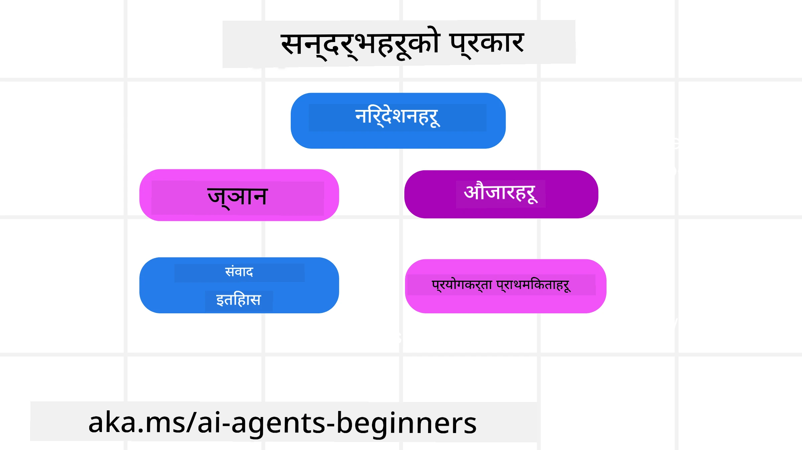
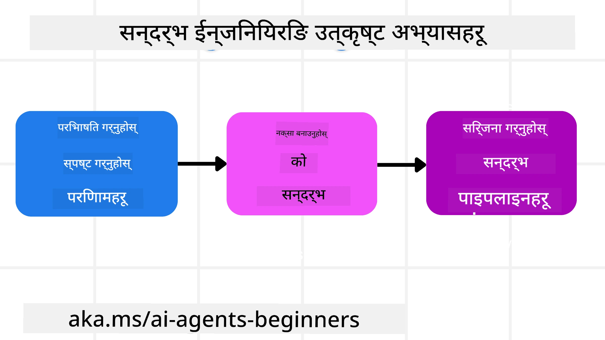

# AI एजेन्टहरूको लागि सन्दर्भ इन्जिनियरिङ

> _(यस पाठको भिडियो हेर्न माथिको तस्वीरमा क्लिक गर्नुहोस्)_

तपाईंले बनाउँदै हुनु भएको AI एजेन्टको अनुप्रयोगको जटिलतालाई बुझ्नु विश्वसनीय एक बनाउनका लागि महत्वपूर्ण छ। हामीलाई AI एजेन्टहरू बनाउन आवश्यक छ जसले जटिल आवश्यकताहरूलाई सम्बोधन गर्न प्रभावकारी रूपमा जानकारी व्यवस्थापन गर्छन्, प्रॉम्प्ट इन्जिनियरिङभन्दा पर।

यस पाठमा, हामी सन्दर्भ इन्जिनियरिङ के हो र AI एजेन्टहरू निर्माण गर्ने क्रममा यसको भूमिका के छ भन्ने कुरा हेरौँला।

## परिचय

यस पाठमा समेटिने विषयहरू:

• **सन्दर्भ इन्जिनियरिङ के हो** र यो प्रॉम्प्ट इन्जिनियरिङदेखि किन फरक छ।

• **प्रभावकारी सन्दर्भ इन्जिनियरिङका रणनीतिहरू**, जसमध्ये कसरी लिख्ने, चयन गर्ने, संकुचित गर्ने र अलग पार्ने समावेश छ।

• **सामान्य सन्दर्भ असफलताहरू** जुन तपाईंको AI एजेन्टलाई बिगार्न सक्छ र तीलाई कसरी सुधार्ने।

## सिकाइ लक्ष्यहरू

यस पाठ पूरा गरेपछि, तपाईं यसरी जान्नुहुनेछ:

• **सन्दर्भ इन्जिनियरिङ परिभाषित गर्ने** र यसलाई प्रॉम्प्ट इन्जिनियरिङसँग फरक छुट्याउने।

• ठूलो भाषा मोडेल (LLM) अनुप्रयोगहरूमा सन्दर्भका मुख्य घटकहरू पहिचान गर्ने।

• एजेन्टको प्रदर्शन सुधार गर्न सन्दर्भ लेख्ने, चयन गर्ने, संकुचित गर्ने, र अलग पार्ने रणनीतिहरू लागू गर्ने।

• विषाक्तता, ध्यान भटकाउने, भ्रम र विरोधजस्ता सामान्य सन्दर्भ असफलताहरू चिन्हारी गर्ने र रोकथाम प्रविधिहरू कार्यान्वयन गर्ने।

## सन्दर्भ इन्जिनियरिङ के हो?

AI एजेन्टहरूको लागि, सन्दर्भ त्यो हो जसले AI एजेन्टलाई निश्चित क्रियाहरू लिन योजना बनाउनमा प्रेरित गर्छ। सन्दर्भ इन्जिनियरिङ भनेको AI एजेन्टले कार्यको अर्को कदम पूरै गर्नका लागि सही जानकारी राख्न सुनिश्चित गर्ने अभ्यास हो। सन्दर्भ विन्डो सानो आकारको हुन्छ, त्यसैले एजेन्ट निर्माता भएर हामीले प्रणाली र प्रक्रिया बनाउनुपर्छ जसले सन्दर्भ विन्डोमा जानकारी थप्ने, हटाउने, र संकुचित गर्ने व्यवस्थापन गर्छ।

### प्रॉम्प्ट इन्जिनियरिङ vs सन्दर्भ इन्जिनियरिङ

प्रॉम्प्ट इन्जिनियरिङ एक स्थिर निर्देशनको सेटमा केन्द्रित हुन्छ जसले नियमहरूको सेटसँग AI एजेन्टलाई प्रभावकारी रूपमा मार्गदर्शन गर्छ। सन्दर्भ इन्जिनियरिङ भने गतिशील जानकारीको सेट, जसमा प्राथमिक प्रॉम्प्ट पनि समावेश छ, लाई कसरी व्यवस्थापन गर्ने हो ताकि समयसँगै AI एजेन्टसँग आवश्यक वस्तुहरू रहोस्। सन्दर्भ इन्जिनियरिङको मुख्य विचार यो प्रक्रिया दोहोर्याउन योग्य र भरपर्दो बनाउनु हो।

### सन्दर्भका प्रकारहरू

स्मरण राख्न जरुरी छ कि सन्दर्भ केवल एउटै कुरा होइन। AI एजेन्टलाई चाहिने जानकारी धेरै विभिन्न स्रोतहरूबाट आउन सक्छ र एजेन्टसँग ती स्रोतहरूमा पहुँच सुनिश्चित गर्नु हाम्रो जिम्मेवारी हो:

एआई एजेन्टले व्यवस्थापन गर्नुपर्ने सन्दर्भका प्रकारहरू यस्ता हुनसक्छन्:

• **निर्देशनहरू:** यी एजेन्टका "नियम" जस्ता हुन्छन् – प्रॉम्प्टहरू, प्रणाली सन्देशहरू, थोरै शट उदाहरणहरू (एआईलाई कसरी के गर्ने देखाउने), र उपकरणहरूको वर्णनहरू। यहाँ प्रॉम्प्ट इन्जिनियरिङको फोकस सन्दर्भ इन्जिनियरिङसँग मिल्छ।

• **ज्ञान:** तथ्यहरू, डाटाबेसबाट प्राप्त गरिएको जानकारी, वा एजेन्टले संचित गरेका लामो समयका सम्झनाहरू। यसमा Retrieval Augmented Generation (RAG) प्रणाली एकीकरण पनि समावेश छ, यदि एजेन्टलाई विभिन्न ज्ञान स्रोत र डाटाबेसहरूमा पहुँच चाहिन्छ भने।

• **उपकरणहरू:** बाह्य कार्यहरू, API र MCP सर्भरको परिभाषाहरू जसलाई एजेन्ट कल गर्न सक्छ, साथै तिनलाई प्रयोग गर्दा प्राप्त प्रतिक्रिया (परिणाम)।

• **संवाद इतिहास:** प्रयोगकर्तासँग चलिरहेको संवाद। समयसँगै यी संवादहरू लामो र जटिल बन्दै जान्छन् जसले सन्दर्भ विन्डोमा स्थान लिन्छ।

• **प्रयोगकर्ताको प्राथमिकताहरू:** समयसँगै प्रयोगकर्ताका पसंद-नापसन्दबारे जानकारी। यी भण्डारण गरी महत्वपूर्ण निर्णय गर्दा प्रयोग गर्न सकिन्छ।

## प्रभावकारी सन्दर्भ इन्जिनियरिङका रणनीतिहरू

### योजना बनाउने रणनीतिहरू

राम्रो सन्दर्भ इन्जिनियरिङ राम्रो योजनाबाट शुरू हुन्छ। यहाँ एउटा दृष्टिकोण छ जसले तपाईंलाई सन्दर्भ इन्जिनियरिङको अवधारणा कसरी लागू गर्ने बारे सोच्न मद्दत गर्दछ:

1. **स्पष्ट नतिजा परिभाषित गर्ने** - AI एजेन्टले दिने कार्यका नतिजाहरू स्पष्ट हुनुपर्छ। प्रश्नको उत्तर दिनुहोस् - "एआई एजेन्टले आफ्नो कार्य पूरा गरेपछि संसार कस्तो देखिन्छ?" अर्थात, प्रयोगकर्ताले AI एजेन्टसँग अन्तर्क्रिया गर्दा कुन परिवर्तन, जानकारी, वा प्रतिक्रिया पाउनु पर्छ।
2. **सन्दर्भ नक्सा बनाउने** - नतिजा परिभाषित गरेपछि प्रश्न सोध्नुपर्छ "AI एजेन्टले काम पूरा गर्न के जानकारी चाहियो?". यसरी तपाईं उक्त जानकारी कहाँ अवस्थित छ भन्ने सन्दर्भ नक्सा बनाइरहन सक्नुहुन्छ।
3. **सन्दर्भ पाइपलाइनहरू सिर्जना गर्ने** - अब जानकारी कहाँ छ थाहा पाएपछि प्रश्न यसको जवाफ दिनुहोस् "एजेन्टले यो जानकारी कसरी पाउने?". यो विभिन्न तरिकाले गर्न सकिन्छ, जस्तै RAG, MCP सर्भरहरूको प्रयोग, र अन्य उपकरणहरू।

### व्यावहारिक रणनीतिहरू

योजना महत्वपूर्ण भए पनि जब जानकारी हाम्रो एजेन्टको सन्दर्भ विन्डोमा प्रवाह हुन थाल्छ, तिनी व्यवस्थापन गर्न व्यावहारिक रणनीतिहरू आवश्यक पर्छ:

#### सन्दर्भ व्यवस्थापन

केही जानकारी सन्दर्भ विन्डोमा स्वचालित थपिए पनि, सन्दर्भ इन्जिनियरिङले यस जानकारीलाई सक्रिय भूमिकामा लिन मद्दत गर्छ जुन केही रणनीतिहरूबाट गर्न सकिन्छ:

 1. **एजेन्ट स्क्रयाचप्याड**  
 यसले AI एजेन्टलाई एउटै सेसनमा हालको कार्य र प्रयोगकर्ता अन्तरक्रियाको सान्दर्भिक जानकारी नोट गर्न अनुमति दिन्छ। यो सन्दर्भ विन्डो बाहिर, एउटा फाइल वा रनटाइम वस्तुमा हुनुपर्छ जुन आवश्यक परेपछि एजेन्टले यस सेसनमा फिर्ता ल्याउन सक्छ।

 2. **स्मृतिहरू**  
 स्क्रयाचप्याडहरूले एउटै सेसनको सन्दर्भ विन्डो बाहिर सूचना व्यवस्थापन गर्छन्। स्मृतिहरूले एजेन्टहरूलाई विभिन्न सेसनहरूमा सान्दर्भिक जानकारी भण्डारण र पुनःप्राप्त गर्न सक्षम पार्छ। यसमा संक्षेपहरू, प्रयोगकर्ताको प्राथमिकताहरू र भविष्यमा सुधारका लागि प्रतिक्रिया समावेश हुन सक्छ।

 3. **सन्दर्भ संकुचन**  
 सन्दर्भ विन्डो भइरोसँगै र सीमा नजिकिँदै गर्दा संक्षेप र छाट्ने प्रविधिहरू प्रयोग गर्न सकिन्छ। यसले सबैभन्दा सान्दर्भिक जानकारी मात्र राख्न वा पुराना सन्देशहरू हटाउन सहयोग गर्छ।

 4. **बहु-एजेन्ट प्रणालीहरू**  
 बहु-एजेन्ट प्रणाली विकास गर्नु सन्दर्भ इन्जिनियरिङकै एउटा प्रकार हो किनभने प्रत्येक एजेन्टसँग आफ्नो सन्दर्भ विन्डो हुन्छ। त्यो सन्दर्भ कसरी साझा र विभिन्न एजेन्टहरूमा पास हुन्छ भन्ने कुरा योजना गर्नुपर्ने कुरा हो।

 5. **स्यान्डबक्स वातावरणहरू**  
 यदि एजेन्टले कुनै कोड चलाउन वा ठूलो कागजातमा धेरै जानकारी प्रक्रियाकरण गर्नुपर्छ भने प्रक्रिया गर्न धेरै टोकन लाग्न सक्छ। सबै कुरा सन्दर्भ विन्डोमा भण्डारण गर्नुको सट्टा, एजेन्टले स्यान्डबक्स वातावरण प्रयोग गर्न सक्छ जुन कोड चलाउन सक्छ र मात्र परिणाम र सान्दर्भिक जानकारी पढ्न सक्छ।

 6. **रनटाइम अवस्था वस्तुहरू**  
 यो अवस्थाहरूको व्यवस्थापन गर्न सूचना कन्टेनर सिर्जना गरेर गरिन्छ जहाँ एजेन्टलाई निश्चित जानकारी पहुँच आवश्यक पर्छ। जटिल कार्यका लागि, यसले एजेन्टलाई प्रत्येक उप-कार्यको परिणाम क्रमशः भण्डारण गर्न सक्षम पार्छ, जसले सन्दर्भलाई मात्र त्यो विशिष्ट उप-कार्यसँग जडित राख्छ।

#### सन्दर्भ निरीक्षण

यी रणनीतिहरू प्रयोग गरेपछि, अर्को मोडेल कलले वास्तवमा के प्राप्त गर्‍यो भनी जाँच्न मूल्यवान हुन्छ। उपयोगी डिबगिङ प्रश्न हो:

> एजेन्टले धेरै सन्दर्भ लोड गर्‍यो कि गलत सन्दर्भ, वा चाहिएको सन्दर्भ छुटायो?

तपाईंलाई कच्चा प्रॉम्प्टहरू, उपकरण आउटपुटहरू, वा स्मृति सामग्रीहरू लग गर्न आवश्यक छैन। उत्पादनमा सानो सन्दर्भ निरीक्षण रेकर्डहरू प्राथमिकता दिनुहोस् जसले गणना, आईडीहरू, ह्यासहरू, र नीति लेबलहरू समेट्छ:

- **चयन:** कति उम्मेदवार खण्डहरू, उपकरणहरू वा स्मृतिहरू विचार गरियो, कति चयन गरियो, र कुन नियम वा स्कोरले बाँकीहरू फिल्टर गर्‍यो ट्रयाक गर्नुहोस्।
- **संकुचन:** स्रोत दायरा वा ट्रेस आईडी, सारांश आईडी, संकुचन अघि र पछि अनुमानित टोकन गणना, र कच्चा सामग्री अर्को कलबाट बाहिर राखियो कि छैन रेकर्ड गर्नुहोस्।
- **अलगाव:** कुन उप-कार्य अलग एजेन्ट, सेसन वा स्यान्डबक्समा चल्यो, के सिमित सारांश फिर्ता गरियो, र ठूलो उपकरण आउटपुट मूल एजेन्ट सन्दर्भभन्दा बाहिर रह्यो कि छैन नोट गर्नुहोस्।
- **स्मृति र RAG:** पूर्ण पुनःप्राप्त लेखलाई होइन, पुनःप्राप्त दस्तावेज़ आईडीहरू, स्मृति आईडीहरू, स्कोरहरू, चयनित आईडीहरू, र रेड्याक्सन स्थिति भण्डारण गर्नुहोस्।
- **सुरक्षा र गोपनीयता:** संवेदनशील प्रॉम्प्ट पाठ, उपकरण तर्कहरू, उपकरण परिणामहरू, वा प्रयोगकर्ता स्मृति सामग्रीको सट्टा ह्यासहरू, आईडीहरू, टोकन बाल्टिनहरू, र नीति लेबलहरू प्राथमिकता दिनुहोस्।

लक्ष्य धेरै सन्दर्भ राख्नु होइन। यो यति प्रमाण छोड़्नु हो कि विकासकर्ताले कुन सन्दर्भ रणनीति चल्यो र के यसले अर्को मोडेल कललाई इच्छित तरिकाले परिवर्तन गर्‍यो भनी बुझ्न सकून्।

### सन्दर्भ इन्जिनियरिङको उदाहरण

मानौं हामी चाहन्छौं AI एजेन्टले **"पेरिसको यात्रा बुक गरिदेऊ।"**

• केवल प्रॉम्प्ट इन्जिनियरिङ प्रयोग गर्ने एजेन्टले मात्र प्रतिक्रिया दिन सक्छ: **"ठीक छ, तपाईं कहिले पेरिस जान चाहनुहुन्छ?"** यो समयमा प्रयोगकर्ताको सोधिएको प्रत्यक्ष प्रश्न मात्र प्रक्रियागरेको छ।

• सन्दर्भ इन्जिनियरिङ रणनीतिहरू प्रयोग गर्ने एजेन्ट त यो भन्दा धेरै गर्छ। जवाफ दिने अघि यसको प्रणालीले:

  ◦ **तपाईंको क्यालेन्डर जाँच्ने** (ठ्याक्कै समय जानकारी प्राप्त गरी)।

 ◦ **अघिल्लो यात्रा प्राथमिकताहरू सम्झने** (लामो समयको स्मृतिबाट) जस्तै तपाईंको रुचाइएको एयरलाइन, बजेट, वा सिधै उडान रोज्ने।

 ◦ **उपलब्ध उपकरणहरू पहिचान गर्ने** उडान र होटल बुकिंगका लागि।

- तब, एउटा उदाहरण प्रतिक्रिया हुन सक्छ: "हे [तपाईंको नाम]! म देख्छु तपाईं अक्टोबरको पहिलो हप्ता खाली हुनुहुन्छ। के म तपाईंको सामान्य बजेट [बजेट] भित्र [रुचाइएको एयरलाइन] मा पेरिसको सिधा उडान खोजौं?" यो समृद्ध, सन्दर्भ-जानकारी भएको प्रतिक्रिया सन्दर्भ इन्जिनियरिङको शक्ति देखाउँछ।

## सामान्य सन्दर्भ असफलताहरू

### सन्दर्भ विषाक्तता

**के हो:** जब LLM ले उत्पन्न गरेको भ्रम (गलत जानकारी) वा त्रुटि सन्दर्भमा प्रवेश गर्छ र बारम्बार उद्धृत हुन्छ जसले एजेन्टलाई असम्भव लक्ष्यहरू पछ्याउन वा बेतुकाको रणनीतिहरू विकास गर्न थाल्छ।

**के गर्ने:** **सन्दर्भ मान्यकरण** र **विभाजन** लागू गर्नुहोस्। लामो समयको स्मृतिमा थप्नु अघि जानकारीलाई मान्य गर्नुहोस्। सम्भावित विषाक्तता पत्ता लागेमा खराब जानकारी फैलिनबाट रोक्न नया सन्दर्भ थ्रेड सुरु गर्नुहोस्।

**यात्रा बुकिंग उदाहरण:** तपाईंको एजेन्टले **सानो स्थानीय विमानस्थलबाट टाढा अन्तर्राष्ट्रिय शहरमा सिधा उडान** कल्पना गर्छ जुन वास्तवमा अन्तर्राष्ट्रिय उडान दिँदैन। यो अवास्तविक उडान विवरण सन्दर्भमा सहेजहैं हुन्छ। पछि, तपाईंले बुक गर्न माग्दा एजेन्टले बारम्बार यो असंभव मार्गका टिकेट खोज्न खोज्दै जाँदा त्रुटि दोहोरिन्छ।

**समाधान:** यो चरण लागू गर्नुहोस् जहाँ उडान अस्तित्व र मार्गहरू वास्तविक समय API सँग **मान्य गरिन्छ** _एजेन्टको कार्य सन्दर्भमा उडान विवरण थप्नु अघि_। मान्यता असफल भएमा, गलत जानकारीलाई "विभाजन" गरेर अर्को प्रयोग नगरिने बनाउनुहोस्।

### सन्दर्भ ध्यानभंग

**के हो:** जब सन्दर्भ धेरै ठूलो हुन्छ र मोडेलले प्रशिक्षणमा सिकेको कुराबीचको इतिहासमा धेरै ध्यान केन्द्रित गर्छ, जसले दोहोरिने वा अव्यवहारिक कार्यहरूमा पुर्‍याउँछ। यस्तो समस्याले मोडेल सन्दर्भ विन्डो भर्नुअघि नै गल्ती गर्न सुरु गर्न सक्छ।

**के गर्ने:** **सन्दर्भ सङ्क्षेप** प्रयोग गर्नुहोस्। नियमित रूपमा संचित जानकारीलाई छोटो सारांशमा संकुचित गर्नुहोस्, महत्वपूर्ण विवरण राख्दै दोहोरिएको इतिहास हटाउनुहोस्। यसले "फोकस रिसेट" गर्न सहयोग गर्छ।

**यात्रा बुकिंग उदाहरण:** तपाईंले लामो समयदेखि विभिन्न सपना यात्रा गन्तव्यहरू छलफल गर्दै आउनुभएको छ, जसमा दुई वर्षअघि गरेको ब्याकप्याकिङ यात्राको विस्तृत ब्याख्या पनि छ। अन्ततः तपाईंले **"अर्को महिनाको लागि सस्तो उडान फेला पारे"** भनेपछि एजेन्ट पुराना, सान्दर्भिक नभएका विवरणमा अल्झिन्छ र तपाईंको बीकायाकिङ गियर वा विगतको यात्रा योजना बारे सोधिरहन्छ, वर्तमान अनुरोधलाई बेवास्ता गर्छ।

**समाधान:** एक निश्चित तहपछि वा सन्दर्भ धेरै हुँदा, एजेन्टले **सबैभन्दा नयाँ र सान्दर्भिक संवादका भागहरू सारांश गर्नु पर्छ** – तपाईंको वर्तमान यात्रा मिति र गन्तव्यमा ध्यान केन्द्रित गर्दै – र त्यो संक्षिप्त सारांशलाई अर्को LLM कलका लागि प्रयोग गरी कम सान्दर्भिक ऐतिहासिक कुराकानीलाई फाल्दिनु हो।

### सन्दर्भ भ्रम

**के हो:** धेरै उपलब्ध उपकरणहरूको रूपमा अनावश्यक सन्दर्भ हुँदा मोडेलले खराब प्रतिक्रिया दिन्छ वा अप्रासंगिक उपकरणहरू कल गर्छ। साना मोडेलहरूमा यो बढी हुन्छ।

**के गर्ने:** RAG प्रविधि प्रयोग गरेर **उपकरण लोडआउट व्यवस्थापन** लागू गर्नुहोस्। उपकरण वर्णनहरू भेक्टर डाटाबेसमा भण्डारण गरी प्रत्येक कार्यको लागि _सर्वोत्तम_ उपकरणहरू मात्र चयन गर्ने। अनुसन्धानले ३० भन्दा कम उपकरण सीमित गर्न सुझाव दिएको छ।

**यात्रा बुकिंग उदाहरण:** तपाईंको एजेन्टसँग दर्जनौं उपकरणहरू छन्: `book_flight`, `book_hotel`, `rent_car`, `find_tours`, `currency_converter`, `weather_forecast`, `restaurant_reservations` आदि। तपाईंले सोध्नुभयो, **"पेरिसमा घुम्न सबैभन्दा राम्रो तरिका के हो?"** साध्य उपकरण धेरै भएकाले एजेन्टले भ्रमित भएर पेरिस भित्र `book_flight` कल गर्ने प्रयास गर्छ, वा तपाईं सार्वजनिक यातायात रुचाउनुभए पनि `rent_car` कल गर्ने प्रयास गर्छ किनभने उपकरण वर्णनहरू आंशिक रूपमा ओभरल्याप हुन सक्छ वा यो उत्तम उपकरण चिन्हारी गर्न सक्दैन।

**समाधान:** उपकरण वर्णनहरूमा **RAG प्रयोग गर्नुहोस्**। तपाईंले पेरिसमा घुम्ने तरिका सोध्दा प्रणालीले तपाईंको सोधअनुसार _सबैभन्दा सान्दर्भिक उपकरणहरू जस्तै `rent_car` वा `public_transport_info` मात्रै पुनःप्राप्त गर्छ_, LLM लाई केन्द्रित "लोडआउट" प्रदान गर्छ।

### सन्दर्भ टक्कर

**के हो:** सन्दर्भमा विरोधाभासी जानकारी हुँदा असंगत तर्क वा खराब अन्तिम जवाफहरू दिने। यो प्रायः जानकारी चरणबद्ध रूपमा आउँदा र सुरुआती गलत अनुमान सन्दर्भमा बाँकी रहँदा हुन्छ।

**के गर्ने:** **सन्दर्भ छाँट्ने (pruning)** र **अफलोडिङ** प्रयोग गर्नुहोस्। छाँट्नेले पुरानो वा विरोधाभासी जानकारी हटाउँछ नयाँ विवरणहरू आउँदा। अफलोडिङले मोडेललाई एउटा अलग "स्क्र्याचप्याड" कार्यक्षेत्र दिन्छ जसले मुख्य सन्दर्भलाई क्लटर नगरी जानकारी प्रक्रिया गर्न मद्दत गर्छ।
**यात्रा बुकिंग उदाहरण:** तपाईंले सुरुमा तपाईंको एजेन्टलाई भन्नुहुन्छ, **"म अर्थोपार्जन कक्षामा उडान गर्न चाहन्छु।"** संवादको क्रममा पछि, तपाईं आफ्नो विचार परिवर्तन गर्दै भन्नुहुन्छ, **"वास्तवमा, यस यात्राका लागि, हामी व्यवसाय कक्षामा जाऔं।"** यदि दुबै निर्देशनहरू सन्दर्भमा रहन्छ भने, एजेन्टले विरोधाभासी खोज परिणामहरू प्राप्त गर्न सक्छ वा कुन प्राथमिकता लागू गर्ने बारे भ्रमित हुन सक्छ।

**समाधान:** **सन्दर्भ pruning** कार्यान्वयन गर्नुहोस्। जब नयाँ निर्देशन पुरानो निर्देशनसँग विरोधाभासी हुन्छ, पुरानो निर्देशन हटाइन्छ वा स्पष्ट रूपमा सन्दर्भमा अधिलेखित गरिन्छ। वैकल्पिक रूपमा, एजेन्टले विरोधाभासी प्राथमिकताहरू मिलाउनको लागि **scratchpad** प्रयोग गर्न सक्छ, र अन्ततः मात्र अन्तिम, सुसंगत निर्देशनले यसको कार्यहरू मार्गदर्शन गर्ने सुनिश्चित गर्दछ।

## सन्दर्भ इन्जिनियरिङबारे थप प्रश्नहरू छन्?

[Microsoft Foundry Discord](https://aka.ms/ai-agents/discord) मा सहभागी हुनुहोस् जहाँ तपाईं अन्य सिक्नेहरूसँग भेट्न, कार्यालय समयहरूमा भाग लिन र तपाईंका AI एजेन्ट सम्वन्धी प्रश्नहरूको जवाफ पाउन सक्नुहुन्छ।

---

<!-- CO-OP TRANSLATOR DISCLAIMER START -->
**अस्वीकरण**:
यो दस्तावेज़ AI अनुवाद सेवा [Co-op Translator](https://github.com/Azure/co-op-translator) प्रयोग गरेर अनुवाद गरिएको हो। हामी सही हुन प्रयास गर्छौं, तर कृपया जानकार हुनुस् कि स्वचालित अनुवादमा त्रुटिहरू वा अशुद्धताहरू हुन सक्छन्। मूल दस्तावेज़ यसको मूल भाषामा आधिकारिक स्रोत मानिनुपर्छ। महत्वपूर्ण जानकारीका लागि व्यावसायिक मानव अनुवाद सिफारिस गरिन्छ। यस अनुवादको प्रयोगबाट उत्पन्न कुनै पनि गलत बुझाइ वा त्रुटिको लागि हामी जिम्मेवार छैनौं।
<!-- CO-OP TRANSLATOR DISCLAIMER END -->