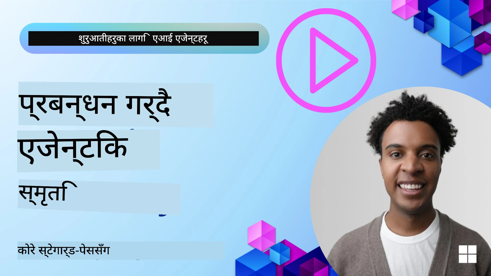

# AI एजेन्टहरूको स्मृति 

जब AI एजेन्टहरू सिर्जना गर्ने अनौठो फाइदाहरूको बारेमा छलफल गरिन्छ, दुई कुरा मुख्य रूपमा छलफल गरिन्छ: कार्यहरू पूरा गर्न उपकरणहरू सञ्चालन गर्ने क्षमता र समयसँगै सुधार गर्ने क्षमता। स्मृति आत्म-सुधार गर्ने एजेन्ट सिर्जना गर्ने आधार हो जसले हाम्रा प्रयोगकर्ताहरूका लागि बेहतर अनुभवहरू सिर्जना गर्न सक्छ।

यस पाठमा, हामी हेर्नेछौं कि AI एजेन्टहरूको लागि स्मृति के हो र हामी यसलाई कसरी व्यवस्थित र प्रयोग गर्न सक्छौं हाम्रो अनुप्रयोगहरूको लाभका लागि।

## परिचय

यो पाठले समावेश गर्नेछ:

• **एआई एजेन्ट स्मृतिलाई बुझ्नुहोस्**: स्मृति के हो र एजेन्टहरूका लागि किन आवश्यक छ।

• **स्मृति कार्यान्वयन र भण्डारण**: तपाईंका AI एजेन्टहरूमा स्मृति क्षमताहरू थप्ने व्यावहारिक विधिहरू, छोटो अवधिको र दीर्घकालीन स्मृतिमा केन्द्रित।

• **एआई एजेन्टहरूलाई आत्म-सुधारयोग्य बनाउने**: कसरी स्मृतिले एजेन्टहरूलाई विगतका अन्तरक्रियाहरूबाट सिक्न र समयसँगै सुधार गर्न सक्षम बनाउँछ।

## उपलब्ध कार्यान्वयनहरू

यस पाठमा दुईवटा विस्तृत नोटबुक ट्यूटोरियलहरू समावेश छन्:

• **[13-agent-memory.ipynb](./13-agent-memory.ipynb)**: Mem0 र Azure AI Search प्रयोग गरी Microsoft Agent Framework संग स्मृति कार्यान्वयन गर्दछ

• **[13-agent-memory-cognee.ipynb](./13-agent-memory-cognee.ipynb)**: Cognee प्रयोग गरी संरचित स्मृति कार्यान्वयन गर्दछ, स्वतः एम्बेडिङले समर्थित ज्ञान ग्राफ निर्माण गर्छ, ग्राफ दृश्य बनाउँछ, र बुद्धिमान पुनःप्राप्ति गर्दछ

## सिकाइ लक्ष्यहरू

यो पाठ पूरा गरेपछि, तपाईं जान्नेहुनेछ कसरी:

• **विभिन्न प्रकारका AI एजेन्ट स्मृतिहरू बीच फरक छुट्याउने**, जसमा कार्य स्मृति, छोटो-अवधि र दीर्घकालीन स्मृति, साथै पर्सोना र एपिसोडिक जस्ता विशेष प्रकारहरू समावेश छन्।

• **Microsoft Agent Framework प्रयोग गरी AI एजेन्टहरूको लागि छोटो-अवधि र दीर्घकालीन स्मृति कार्यान्वयन र व्यवस्थापन गर्ने**, Mem0, Cognee, Whiteboard स्मृति जस्ता उपकरणहरू प्रयोग गरी र Azure AI Search सँग एकीकरण गर्दै।

• **आत्म-सुधार गर्ने AI एजेन्टहरूको सिद्धान्तहरू बुझ्ने** र कसरी बलियो स्मृति व्यवस्थापन प्रणालीहरूले निरन्तर सिकाइ र अनुकूलनमा योगदान पुर्‍याउँछन्।

## एआई एजेन्ट स्मृति बुझ्नुहोस्

यसको मूलमा, **एआई एजेन्टहरूको लागि स्मृति उनीहरूलाई जानकारी राख्न र स्मरण गर्न अनुमति दिने मेकानिज्महरूलाई जनाउँछ**। यो जानकारी वार्तालापका विशिष्ट विवरणहरू, प्रयोगकर्ता प्राथमिकताहरू, अघिल्लो कार्यहरू, वा सिकिएका ढाँचाहरू हुन सक्छ।

स्मृतिविहीन, AI अनुप्रयोगहरू प्रायः स्टेटलेस हुन्छन्, जसको अर्थ प्रत्येक अन्तरक्रिया नयाँबाट सुरु हुन्छ। यसले दोहोरिने र निराशाजनक प्रयोगकर्ता अनुभव जन्माउँछ जहाँ एजेन्टले अघिल्लो सन्दर्भ वा प्राथमिकताहरू "भुल्छ"।

### स्मृति किन महत्वपूर्ण छ?

एजेन्टको बुद्धि यसको अघिल्लो जानकारी सम्झने र प्रयोग गर्ने क्षमतासँग गहिरो रूपमा जोडिएको छ। स्मृतिले एजेन्टहरूलाई निम्न बनाउन अनुमति दिन्छ:

• **प्रतिबिम्बात्मक**: अघिल्लो कार्यहरू र परिणामहरूबाट सिक्ने।

• **इन्टरएक्टिभ**: एक जारी वार्तालापमा सन्दर्भ कायम राख्ने।

• **प्रोएक्टिभ र रियाक्टिभ**: ऐतिहासिक डेटाका आधारमा आवश्यकताहरू अनुमान वा उपयुक्त उत्तर दिने।

• **स्वायत्त**: संग्रहीत ज्ञानबाट निक्षेप गर्दै स्वतन्त्र रूपमा काम गर्ने।

स्मृति कार्यान्वयन गर्ने उद्देश्य एजेन्टहरूलाई अधिक **भरपर्दो र सक्षम** बनाउनु हो।

### स्मृतिका प्रकारहरू

#### कार्य स्मृति

यसलाई एक प्रकारको स्क्र्याच पेपरको रूपमा सोच्नुहोस् जुन एजेन्टले एकल, चलिरहँदा कार्य वा विचार प्रक्रियाको दौरान प्रयोग गर्छ। यो अर्को कदम गणना गर्न आवश्यक तत्काल जानकारी राख्छ।

AI एजेन्टहरूको लागि, कार्य स्मृतिले प्रायः वार्तालापबाट सबैभन्दा सान्दर्भिक जानकारी समेट्छ, चाहे पूर्ण च्याट इतिहास लामो वा ट्रन्केटेड किन नहोस्। यसले आवश्यकताहरू, प्रस्तावहरू, निर्णयहरू, र क्रियाकलाप जस्ता मुख्य तत्वहरू निकाल्नमा केन्द्रित गर्दछ।

**कार्य स्मृतिको उदाहरण**

यात्रा बुकिंग एजेन्टमा, कार्य स्मृतिले प्रयोगकर्ताको हालको अनुरोध समात्न सक्छ, जस्तै "म पेरिसको यात्रा बुक गर्न चाहन्छु"। यो विशिष्ट आवश्यकता एजेन्टको तत्काल सन्दर्भमा राखिन्छ ताकि हालको अन्तरक्रियालाई मार्गदर्शन गर्न सकोस्।

#### छोटो अवधिको स्मृति

यस प्रकारको स्मृतिले एकल वार्तालाप वा सत्रको अवधि भर जानकारी राख्छ। यो हालको च्याटको सन्दर्भ हो, जसले एजेन्टलाई संवादका अघिल्ला चरणहरूमा फर्केर हेर्न अनुमति दिन्छ।

**छोटो अवधिको स्मृतिको उदाहरण**

यदि प्रयोगकर्ताले सोध्छ, "पेरिस पुग्ने उडान कति पर्ने हुन्छ?" र त्यसपछि "त्यहाँ आवासको के?" भन्छ, छोटो-अवधिको स्मृतिले सुनिश्चित गर्दछ कि एजेन्टले त्यो "त्यहाँ" लाई सोही वार्तालाप भित्र "पेरिस" संग सम्बन्धित भएको बुझ्छ।

#### दीर्घकालीन स्मृति

यो जानकारी बहु वार्तालाप वा सत्रहरूमा कायम रहने हुन्छ। यसले एजेन्टलाई प्रयोगकर्ताका प्राथमिकताहरू, ऐतिहासिक अन्तरक्रियाहरू, वा लामो अवधिको सामान्य ज्ञान सम्झन अनुमति दिन्छ। यो वैयक्तिकरणका लागि महत्वपूर्ण छ।

**दीर्घकालीन स्मृतिको उदाहरण**

दीर्घकालीन स्मृतिले भण्डारण गर्न सक्छ कि "बेनलाई स्किइङ र बाहिरी गतिविधिहरू मनपर्छ, ऊ पर्वतीय दृश्यसहित कफी मनपराउँछ, र विगतको चोटको कारणले उन्नत स्की ढलानहरू टाढा राख्न चाहन्छ"। यस जानकारीले भविष्यको यात्रा योजना सत्रहरूमा सिफारिसहरूलाई व्यक्तिगत बनाउँछ।

#### पर्सोना स्मृति

यो विशेषीकृत स्मृति प्रकारले एजेन्टलाई एक सुसंगत "व्यक्तित्व" वा "पर्सोना" विकास गर्न मद्दत गर्छ। यसले एजेन्टलाई आफू वा उसको निर्धारित भूमिकाका बारेमा विवरणहरू सम्झन अनुमति दिन्छ, जसले अन्तरक्रियाहरू अधिक प्रवाही र केन्द्रित बनाउँछ।

**पर्सोना स्मृतिको उदाहरण**
यदि यात्रा एजेन्टलाई "विशेषज्ञ स्की योजनाकार" को रूपमा डिजाइन गरिएको छ भने, पर्सोना स्मृतिले यस भूमिकालाई सुदृढ पार्न सक्छ, यसको उत्तरहरूलाई विशेषज्ञको टोन र ज्ञानअनुसार मिलाउन प्रभाव पार्छ।

#### कार्यप्रवाह/एपिसोडिक स्मृति

यस स्मृतिले एउटा जटिल कार्यको दौरान एजेन्टले लिएका कदमहरूको अनुक्रम, सफलताहरू र असफलताहरू समात्छ। यो खास "एपिसोड" वा अघिल्लो अनुभवहरू सम्झन जस्तै हो र तिनबाट सिक्छ।

**एपिसोडिक स्मृतिको उदाहरण**

यदि एजेन्टले विशेष उडान बुक गर्ने प्रयास गर्यो तर उपलब्धताका कारण असफल भयो भने, एपिसोडिक स्मृतिले यो असफलता रेकर्ड गर्न सक्छ, जसले पछि पुनः प्रयास गर्दा वैकल्पिक उडानहरू प्रयास गर्न वा प्रयोगकर्तालाई समस्या सम्बन्धमा अझ सूचित तरिकाले बताउन सक्षम बनाउँछ।

#### एन्टिटी स्मृति

यसले वार्तालापबाट विशिष्ट एन्टिटीज (जस्तै व्यक्ति, स्थान, वा वस्तु) र घटनाहरू निकालेर सम्झन समावेश गर्दछ। यसले एजेन्टलाई छलफल गरिएका मुख्य तत्वहरूको संरचित समझ निर्माण गर्न अनुमति दिन्छ।

**एन्टिटी स्मृतिको उदाहरण**

अघिल्लो यात्राको बारेमा गरिएको वार्तालापबाट, एजेन्टले "पेरिस," "आइफल टावर," र "Le Chat Noir रेस्टुरेन्टमा डिनर" लाई एन्टिटीका रूपमा निकाल्न सक्छ। भविष्यको अन्तरक्रियामा, एजेन्ट "Le Chat Noir" सम्झेर त्यहाँ नयाँ आरक्षण गर्ने प्रस्ताव गर्न सक्छ।

#### संरचित RAG (Retrieval Augmented Generation)

RAG व्यापक प्रविधि भए तापनि, "संरचित RAG" शक्तिशाली स्मृति प्रविधिको रूपमा हाइलाइट गरिएको छ। यसले विभिन्न स्रोतहरू (वार्तालाप, इमेल, छविहरू) बाट घना, संरचित जानकारी निकाल्छ र जवाफहरूमा सटीकता, रिकॉल, र गतिमा सुधार गर्न प्रयोग गर्छ। क्लासिक RAG ले मात्र सेमान्टिक समानतामा भर पर्छ भने, संरचित RAG जानकारीको अन्तर्निहित संरचनासँग काम गर्छ।

**संरचित RAG उदाहरण**

मात्रै कीवर्ड मिलाउने सट्टा, संरचित RAG ले इमेलबाट उडान विवरणहरू (गन्तव्य, मिति, समय, एयरलाइन) पार्स गरेर संरचित तरिकाले भण्डारण गर्न सक्छ। यसले "मले मंगलवारका लागि पेरिसको कुन उडान बुक गरेको थिएँ?" जस्ता ठ्याक्कै प्रश्नहरू सोध्न अनुमति दिन्छ।

## स्मृति कार्यान्वयन र भण्डारण

एआई एजेन्टहरूको लागि स्मृति कार्यान्वयनमा प्रणालीगत प्रक्रिया समावेश हुन्छ जुनमा **स्मृति व्यवस्थापन** समावेश छ, जसमा उत्पादन, भण्डारण, पुनःप्राप्ति, एकीकरण, अद्यावधिक, र जान भुल्नु (वा मेटाउने) सम्म गइरहेको छ। पुनःप्राप्ति विशेष गरी महत्त्वपूर्ण पक्ष हो।

### विशेषीकृत स्मृति उपकरणहरू

#### Mem0

एजेन्ट स्मृति भण्डारण र व्यवस्थापन गर्ने एउटा तरिका विशेषीकृत उपकरणहरू जस्तै Mem0 प्रयोग गर्नु हो। Mem0 स्थायी स्मृति तहको रूपमा काम गर्छ, जसले एजेन्टहरूले सम्बन्धित अन्तरक्रियाहरू सम्झन, प्रयोगकर्ता प्राथमिकताहरू र तथ्यगत सन्दर्भहरू स्टोर गर्न, र समयसँगै सफलताहरू र असफलताबाट सिक्न अनुमति दिन्छ। यहाँ विचार यो हो कि स्टेटलेस एजेन्टहरू स्टेटफुलमा रूपान्तरित हुन्छन्।

यसले दुई-चरणीय स्मृति पाइपलाइन मार्फत काम गर्छ: निकासी र अद्यावधिक। पहिलो, एजेन्टको थ्रेडमा थपिएका सन्देशहरू Mem0 सेवा तिर पठाइन्छ, जुन वार्तालाप इतिहास सारांश गर्न र नयाँ स्मृतिहरू निकाल्न LLM प्रयोग गर्छ। पछि, LLM-चालित अद्यावधिक चरणले यी स्मृतिहरू थप्ने, संशोधन गर्ने, वा मेटाउने निर्णय गर्छ, र तिनीहरूलाई भेक्टर, ग्राफ, र की-भ्यालु डेटाबेसहरू सहितको हाइब्रिड डाटा स्टोरमा संग्रह गर्दछ। यो प्रणालीले विभिन्न स्मृति प्रकारहरू समर्थन गर्छ र एन्टिटीहरूबीच सम्बन्धहरू व्यवस्थापन गर्न ग्राफ स्मृति पनि समावेश गर्न सक्छ।

#### Cognee

अर्को शक्तिशाली दृष्टिकोण हो **Cognee**, एउटा ओपन-सोर्स सेमान्तिक स्मृति जुन संरचित र असंरचित डाटालाई एम्बेडिङद्वारा समर्थन गरिएको क्वेनेबल ज्ञान ग्राफमा रूपान्तरण गर्छ। Cognee ले **डुअल-स्टोर आर्किटेक्चर** प्रदान गर्छ जसले भेक्टर समानता खोज र ग्राफ सम्बन्धहरूलाई संयोजन गर्दै एजेन्टहरूलाई केवल के समान छ भन्ने मात्र होइन, कसरि अवधारणाहरू आपसमा सम्बन्धित छन् भन्ने बुझ्न सक्षम बनाउँछ।

यो **हाइब्रिड पुनःप्राप्तिमा** उत्कृष्ट छ जसले भेक्टर समानता, ग्राफ संरचना, र LLM तर्कलाई मिश्रण गर्छ - कच्चा चंक्स खोज्नदेखि ग्राफ-जानकारीयुक्त प्रश्नोत्तरसम्म। प्रणालीले “लिभिङ मेमोरी” कायम राख्छ जुन बढ्छ र विकसित हुन्छ भने पनि एकै जोडिएको ग्राफको रूपमा क्वेरीयोग्य रहन्छ, छोटो-अवधि सत्र सन्दर्भ र दीर्घकालीन स्थायी स्मृतिलाई दुवै समर्थन गर्छ।

Cognee नोटबुक ट्युटोरियल ([13-agent-memory-cognee.ipynb](./13-agent-memory-cognee.ipynb)) ले यो एकीकृत स्मृति तह निर्माण गर्ने तरिका देखाउँछ, विविध डाटा स्रोतहरू इनहेष्ट गर्ने, ज्ञान ग्राफ दृश्य बनाउने, र विभिन्न खोज रणनीतिहरू प्रयोग गरी क्वेरी गर्ने व्यावहारिक उदाहरणहरूसँग।

### RAG सँग स्मृति भण्डारण

विशेषीकृत स्मृति उपकरणहरू जस्तै mem0 , बाहेक, तपाईं बलियो खोज सेवाहरू जस्तै **Azure AI Search लाई स्मृतिहरू भण्डारण र पुनःप्राप्ति गर्न ब्याकएन्डको रूपमा प्रयोग गर्न सक्नुहुन्छ**, विशेष गरी संरचित RAG का लागि।

यसले तपाईंको एजेन्टका उत्तरहरूलाई तपाईंको आफ्नै डेटासँग ग्राउन्ड गर्न अनुमति दिन्छ, जसले अधिक सान्दर्भिक र सही उत्तर सुनिश्चित गर्छ। Azure AI Search लाई प्रयोगकर्तासँग सम्बन्धित यात्रा स्मृतिहरू, उत्पादन क्याटलगहरू, वा कुनै पनि डोमेन-विशेष ज्ञान भण्डारण गर्न प्रयोग गर्न सकिन्छ।

Azure AI Search ले **संरचित RAG** जस्ता क्षमताहरू समर्थन गर्छ, जुन ठूलो डाटासेटहरू जस्तै वार्तालाप इतिहास, इमेलहरू, वा छविहरूबाट घना, संरचित जानकारी निकाल्न र पुनःप्राप्ति गर्न उत्कृष्ट हुन्छ। यसले पारम्परिक टेक्स्ट चंकिन्ग र एम्बेडिङ दृष्टिकोणहरूको तुलनामा "अधिमानवीय सटीकता र रिकॉल" प्रदान गर्छ।

## AI एजेन्टहरूलाई आत्म-सुधारयोग्य बनाउने

आत्म-सुधार गर्ने एजेन्टहरूको लागि सामान्य ढाँचा भनेको एउटा **"ज्ञान एजेन्ट"** परिचय गराउनु हो। यो अलग एजेन्टले प्रयोगकर्ता र प्रमुख एजेन्टबीचको मुख्य वार्तालाप निरीक्षण गर्छ। यसको भूमिका हो:

1. **मूल्यवान जानकारी पहिचान गर्नु**: वार्तालापको कुनै भाग सामान्य ज्ञान वा विशिष्ट प्रयोगकर्ता प्राथमिकता जस्तो बचत गर्ने लायक छ कि छैन निर्धारण गर्नु।

2. **निकाल्नु र संक्षेप गर्नु**: वार्तालापबाट आवश्यक सिकाइ वा प्राथमिकतालाई संक्षेपमा निकाल्नु।

3. **ज्ञान भण्डारणमा राख्नु**: यो निकालेको जानकारी भेक्टर डेटाबेसमा प्राय: जोगाउने गरी कायम गर्नु ताकि पछि पुनःप्राप्त गर्न सकियोस्।

4. **भविष्यका प्रश्नहरूलाई समृद्ध गर्नु**: जब प्रयोगकर्ताले नयाँ प्रश्न सुरु गर्छ, ज्ञान एजेन्ट सम्बन्धित संग्रहित जानकारी पुनःप्राप्त गरेर प्रयोगकर्ताको प्राम्प्टमा थप्छ, प्रमुख एजेन्टलाई महत्वपूर्ण सन्दर्भ प्रदान गर्छ (RAG जस्तै)।

### स्मृतिका लागि अनुकूलनहरू

• **प्रतिक्रियाशीलता व्यवस्थापन**: प्रयोगकर्ता अन्तरक्रियाहरू ढिला नगर्ने बनाउन, प्रारम्भमा सस्तो र छिटो मोडल प्रयोग गरी छिटो जाँच्न सकिन्छ कि जानकारी स्टोर गर्न वा पुनःप्राप्त गर्न योग्य छ कि छैन, र केवल आवश्यक परेमा जटिल निकासी/पुनःप्राप्ति प्रक्रिया बोलाउने।

• **ज्ञान भण्डार मर्मत**: बढ्दो ज्ञान भण्डारका लागि, कम प्रयोग हुने जानकारी लागत व्यवस्थापन गर्न "कोल्ड स्टोरेज" मा सार्न सकिन्छ।

## एजेन्ट स्मृतिबारे थप प्रश्नहरू छन्?

अन्य शिक्षा लिनेहरूलाई भेट्न, अफिस घण्टा उपस्थित हुन र तपाईंका AI एजेन्ट सम्बन्धी प्रश्नहरूको जवाफ पाउन [Microsoft Foundry Discord](https://aka.ms/ai-agents/discord) मा सामेल हुनुहोस्।

---

<!-- CO-OP TRANSLATOR DISCLAIMER START -->
अस्वीकरण:
यो कागजात AI अनुवाद सेवा Co-op Translator (https://github.com/Azure/co-op-translator) प्रयोग गरेर अनुवाद गरिएको हो। हामी सटीकता सुनिश्चित गर्न प्रयास गर्छौं; तथापि, कृपया ध्यान दिनुहोस् कि स्वचालित अनुवादमा त्रुटि वा अशुद्धता हुन सक्छ। मूल भाषामा रहेको कागजातलाई आधिकारिक स्रोत मानिनु पर्छ। महत्वपूर्ण जानकारीका लागि पेशेवर मानवीय अनुवाद सिफारिस गरिन्छ। यस अनुवादको प्रयोगबाट उत्पन्न कुनै पनि गलतफहमी वा गलत व्याख्याका लागि हामी उत्तरदायी छैनौं।
<!-- CO-OP TRANSLATOR DISCLAIMER END -->