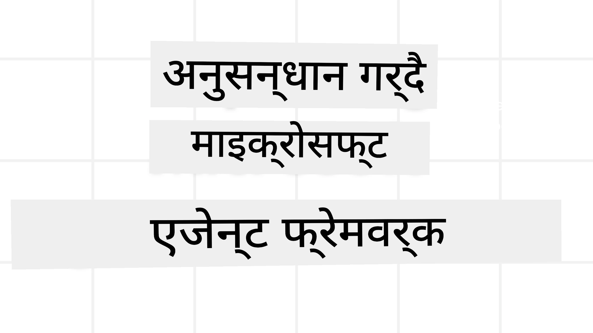
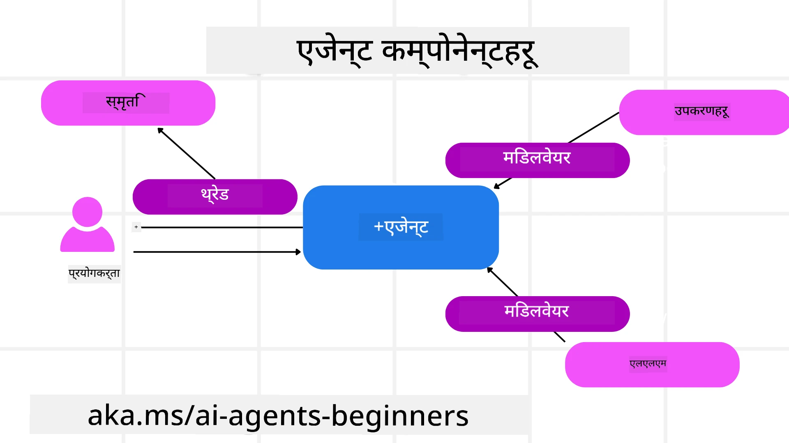

# माइक्रोसफ्ट एजेन्ट फ्रेमवर्क अन्वेषण



### परिचय

यो पाठले समेट्नेछ:

- माइक्रोसफ्ट एजेन्ट फ्रेमवर्क बुझ्नु: प्रमुख सुविधाहरू र मूल्य  
- माइक्रोसफ्ट एजेन्ट फ्रेमवर्कका मुख्य अवधारणाहरू अन्वेषण गर्नु
- उन्नत MAF ढाँचाहरू: कार्यप्रवाहहरू, मिडलवेयर, र मेमोरी

## सिकाइ लक्ष्यहरू

यस पाठ पूरा गरेपछि, तपाईं जान्नु हुनेछ:

- माइक्रोसफ्ट एजेन्ट फ्रेमवर्क प्रयोग गरी उत्पादन तयारीको AI एजेन्टहरू निर्माण गर्ने तरिका
- माइक्रोसफ्ट एजेन्ट फ्रेमवर्कका मुख्य सुविधाहरू तपाईंको एजेन्टिक प्रयोग केसहरूमा लागू गर्ने
- कार्यप्रवाहहरू, मिडलवेयर, र अवलोकनीयता सहित उन्नत ढाँचाहरू प्रयोग गर्ने

## कोड नमूना

[Microsoft Agent Framework (MAF)](https://aka.ms/ai-agents-beginners/agent-framewrok) को कोड नमूनाहरू यस रिपोजिटोरीमा `xx-python-agent-framework` र `xx-dotnet-agent-framework` फाइलहरू अन्तर्गत फेला पार्न सकिन्छ।

## माइक्रोसफ्ट एजेन्ट फ्रेमवर्क बुझ्नु


[Microsoft Agent Framework (MAF)](https://aka.ms/ai-agents-beginners/agent-framewrok) माइक्रोसफ्टको एउटै फ्रेमवर्क हो AI एजेन्टहरू निर्माण गर्नको लागि। यसले निम्न उत्पादन र अनुसन्धान वातावरणहरूमा देखिएका फरक-फरक एजेन्टिक प्रयोग केसहरूलाई सम्बोधन गर्ने लचिलोपन प्रदान गर्दछ:

- चरण-दर-चरण कार्यप्रवाह आवश्यक पर्ने अवस्थाहरूमा **क्रमिक एजेन्ट सङ्गठन**।
- एजेन्टहरूले एकै समयमा कार्यहरू पूरा गर्नुपर्ने अवस्थाहरूमा **समान्तर सङ्गठन**।
- एजेन्टहरूले एउटै कार्यमा सँगै सहयोग गर्नसक्ने अवस्थाहरूमा **समूह च्याट सङ्गठन**।
- एजेन्टहरूले उपकार्यहरू पूरा गर्दा कार्य अर्को एजेन्टलाई हस्तान्तरण गर्ने अवस्थाहरूमा **ह्यान्डअफ सङ्गठन**।
- प्रबन्धक एजेन्टले कार्य सूची सिर्जना र परिमार्जन गरी उपएजेन्टहरूको समन्वय गर्ने अवस्थाहरूमा **磁कीय सङ्गठन**।

उत्पादनमा AI एजेन्टहरू प्रदान गर्न MAF ले यी सुविधाहरू पनि समावेश गरेको छ:

- **अवलोकनीयता** OpenTelemetry मार्फत जहाँ AI एजेन्टको प्रत्येक क्रिया, उपकरण आह्वान, सङ्गठन चरणहरू, तर्क प्रवाह र प्रदर्शन निगरानी Microsoft Foundry ड्यासबोर्डहरूमार्फत हुन्छ।
- **सुरक्षा** एजेन्टहरू Microsoft Foundry मा स्वदेशी रूपमा होस्ट गरिन्छन् जसमा भूमिका आधारित पहुँच, निजी डेटा ह्यान्डलिङ र निर्मित सामग्री सुरक्षा जस्ता सुरक्षा नियन्त्रणहरू समावेश छन्।
- **टिकाउपन** एजेन्ट थ्रेडहरू र कार्यप्रवाहहरू रोक्न, पुन: सुरु गर्न र त्रुटिहरूबाट पुनः प्राप्त गर्न सकिन्छ जसले लामो समयसम्म चल्ने प्रक्रियालाई सक्षम पार्छ।
- **नियन्त्रण** मानव इन द लूप कार्यप्रवाहहरू समर्थन गर्दछ जहाँ कार्यहरूलाई मानव अनुमोदन आवश्यक छ भनेर चिन्ह लगाइन्छ।

माइक्रोसफ्ट एजेन्ट फ्रेमवर्कले निम्न कुरामा पनि ध्यान दिन्छ:

- **क्लाउड-उदार** - एजेन्टहरू कन्टेनरहरूमा, स्थानिय रुपमा र विभिन्न क्लाउडहरूमा चलाउन सकिन्छ।
- **प्रदायक-उदार** - Azure OpenAI र OpenAI सहित तपाईंको रोजाइको SDK मार्फत एजेन्टहरू सिर्जना गर्न सकिन्छ।
- **खुला मानकहरू समाहित गर्ने** - एजेन्टहरूले Agent-to-Agent(A2A) र Model Context Protocol (MCP) जस्ता प्रोटोकलहरू प्रयोग गरी अन्य एजेन्ट र उपकरणहरू पत्ता लगाउन र प्रयोग गर्न सक्दछन्।
- **प्लगइन्स र कनेक्टर्स** - Microsoft Fabric, SharePoint, Pinecone र Qdrant जस्ता डेटा र मेमोरी सेवाहरूसँग जडान गर्न सकिन्छ।

अब हेरौं यी सुविधाहरू माइक्रोसफ्ट एजेन्ट फ्रेमवर्कका केही मुख्य अवधारणाहरूमा कसरी लागू हुन्छन्।

## माइक्रोसफ्ट एजेन्ट फ्रेमवर्कका मुख्य अवधारणाहरू

### एजेन्टहरू



**एजेन्टहरू सिर्जना गर्दै**

एजेन्ट सिर्जना जाँच सेवा (LLM प्रदायक), AI एजेन्टले अनुसरण गर्ने निर्देशनहरूको सेट, र `name` निर्धारण गरेर गरिन्छ:

```python
agent = AzureOpenAIChatClient(credential=AzureCliCredential()).create_agent( instructions="You are good at recommending trips to customers based on their preferences.", name="TripRecommender" )
```

माथिको उदाहरण `Azure OpenAI` प्रयोग गर्दैछ तर एजेन्टहरू `Microsoft Foundry Agent Service` लगायत विभिन्न सेवाहरू प्रयोग गरेर सिर्जना गर्न सकिन्छ:

```python
AzureAIAgentClient(async_credential=credential).create_agent( name="HelperAgent", instructions="You are a helpful assistant." ) as agent
```

OpenAI `Responses`, `ChatCompletion` APIहरू

```python
agent = OpenAIResponsesClient().create_agent( name="WeatherBot", instructions="You are a helpful weather assistant.", )
```

```python
agent = OpenAIChatClient().create_agent( name="HelpfulAssistant", instructions="You are a helpful assistant.", )
```

या A2A प्रोटोकल मार्फत टाढाका एजेन्टहरू:

```python
agent = A2AAgent( name=agent_card.name, description=agent_card.description, agent_card=agent_card, url="https://your-a2a-agent-host" )
```

**एजेन्टहरूको सञ्चालन**

एजेन्टहरू `.run` वा `.run_stream` विधिहरू प्रयोग गरेर सञ्चालन गरिन्छन्, जुन नन-स्ट्रीमिङ वा स्ट्रीमिङ प्रतिक्रियाहरूको लागि प्रयोग हुन्छ।

```python
result = await agent.run("What are good places to visit in Amsterdam?")
print(result.text)
```

```python
async for update in agent.run_stream("What are the good places to visit in Amsterdam?"):
    if update.text:
        print(update.text, end="", flush=True)

```

प्रत्येक एजेन्ट सञ्चालनले `max_tokens`, एजेन्टाले कल गर्न सक्ने `tools`, र प्रयोग हुने `model` जस्ता प्यारामिटरहरू अनुकूलन गर्ने विकल्पहरू पनि राख्न सक्छ।

यो विशेष मोडलहरू वा उपकरणहरू प्रयोग गर्न आवश्यक पर्ने प्रयोगकर्ताको कार्य पूरा गर्न उपयोगी हुन्छ।

**उपकरणहरू (Tools)**

एजेन्ट परिभाषित गर्दा उपकरणहरू निर्धारण गर्न सकिन्छ:

```python
def get_attractions( location: Annotated[str, Field(description="The location to get the top tourist attractions for")], ) -> str: """Get the top tourist attractions for a given location.""" return f"The top attractions for {location} are." 


# जब सिधा ChatAgent बनाउनुपर्दा

agent = ChatAgent( chat_client=OpenAIChatClient(), instructions="You are a helpful assistant", tools=[get_attractions]

```

र एजेन्ट सञ्चालन गर्दा पनि:

```python

result1 = await agent.run( "What's the best place to visit in Seattle?", tools=[get_attractions] # यो कार्यकालको लागि मात्र उपलब्ध उपकरण)
```

**एजेन्ट थ्रेडहरू**

एजेन्ट थ्रेडहरू बहु-पालो संवादहरू व्यवस्थापन गर्न प्रयोग गरिन्छ। थ्रेडहरू निम्न विधिहरूबाट सिर्जना गर्न सकिन्छ:

- `get_new_thread()` प्रयोग गरी, जसले थ्रेडलाई समयसँगै सुरक्षित गर्न सक्षम बनाउँछ
- एजेन्ट चलाउँदा स्वतः थ्रेड सिर्जना र वर्तमान चलाइ अवधिभर थ्रेड अस्तित्वमा राख्ने

थ्रेड सिर्जना गर्न कोड यसरी देखिन्छ:

```python
# नयाँ थ्रेड सिर्जना गर्नुहोस्।
thread = agent.get_new_thread() # थ्रेडसँग एजेन्ट चलाउनुहोस्।
response = await agent.run("Hello, I am here to help you book travel. Where would you like to go?", thread=thread)

```

पछि तपाईं थ्रेडलाई पछि प्रयोगका लागि सीरियलाइज गर्न सक्नुहुन्छ:

```python
# नयाँ थ्रेड सिर्जना गर्नुहोस्।
thread = agent.get_new_thread() 

# थ्रेडसँग एजेन्ट चलाउनुहोस्।

response = await agent.run("Hello, how are you?", thread=thread) 

# भण्डारणका लागि थ्रेडलाई सिरियलाइज गर्नुहोस्।

serialized_thread = await thread.serialize() 

# भण्डारणबाट लोड गरेपछि थ्रेडको स्थिति डिसिरियलाइज गर्नुहोस्।

resumed_thread = await agent.deserialize_thread(serialized_thread)
```

**एजेन्ट मिडलवेयर**

एजेन्टहरूले उपकरणहरू र LLM हरूसँग अन्तरक्रिया गरी प्रयोगकर्ताका कार्यहरू पूरा गर्दछन्। केही अवस्थाहरूमा यी अन्तरक्रियाहरूको बिचमा केही क्रिया सञ्चालन वा ट्र्याक गर्न चाहिन्छ। एजेन्ट मिडलवेयरले यसलाई सम्भव बनाउँछ:

*फंक्शन मिडलवेयर*

यस मिडलवेयरले एजेन्ट र फंक्शन/उपकरणको बिचमा कार्यान्वयन गर्न अनुमति दिन्छ। जस्तै फंक्शन कलमा लगिङ् गर्न आवश्यक पर्दा उपयोगी हुन्छ।

तलको कोडमा `next` ले पछिल्लो मिडलवेयर वा वास्तविक फंक्शन कल गर्ने निर्धारित गर्दछ।

```python
async def logging_function_middleware(
    context: FunctionInvocationContext,
    next: Callable[[FunctionInvocationContext], Awaitable[None]],
) -> None:
    """Function middleware that logs function execution."""
    # पूर्व-प्रसंस्करण: कार्यसम्पादन अघि लग गर्नुहोस्
    print(f"[Function] Calling {context.function.name}")

    # अर्को मिडलवेयर वा कार्यसम्पादनमा जारी राख्नुहोस्
    await next(context)

    # पश्चात-प्रसंस्करण: कार्यसम्पादन पछि लग गर्नुहोस्
    print(f"[Function] {context.function.name} completed")
```

*च्याट मिडलवेयर*

यस मिडलवेयरले एजेन्ट र LLM बीचमा अनुरोधहरूमा क्रिया गर्न वा लग गर्न अनुमति दिन्छ।

यसमा AI सेवा पठाइएका `messages` जस्ता महत्त्वपूर्ण जानकारी हुन्छ।

```python
async def logging_chat_middleware(
    context: ChatContext,
    next: Callable[[ChatContext], Awaitable[None]],
) -> None:
    """Chat middleware that logs AI interactions."""
    # पूर्व-प्रक्रिया: AI कल भन्दा पहिले लग गर्नुहोस्
    print(f"[Chat] Sending {len(context.messages)} messages to AI")

    # अर्को मिडलवेयर वा AI सेवा तर्फ जारी राख्नुहोस्
    await next(context)

    # पश्च-प्रक्रिया: AI प्रतिक्रिया पछि लग गर्नुहोस्
    print("[Chat] AI response received")

```

**एजेन्ट मेमोरी**

`Agentic Memory` पाठमा बताइएअनुसार, मेमोरी एजेन्टलाई विभिन्न सन्दर्भहरूमा काम गर्न सक्षम बनाउने महत्त्वपूर्ण तत्व हो। MAF ले विभिन्न प्रकारका मेमोरीहरू प्रदान गर्दछ:

*इन-मेमोरी स्टोरेज*

यो मेमोरी एप्लिकेसन रनटाइमको समयमा थ्रेडहरूमा सञ्चय गरिन्छ।

```python
# नयाँ थ्रेड सिर्जना गर्नुहोस्।
thread = agent.get_new_thread() # थ्रेडसहित एजेन्ट चलाउनुहोस्।
response = await agent.run("Hello, I am here to help you book travel. Where would you like to go?", thread=thread)
```

*पर्सिस्टेन्ट मेसेजहरू*

यो मेमोरी विभिन्न सत्रहरूमा संवाद इतिहास भण्डारण गर्न प्रयोग गरिन्छ। `chat_message_store_factory` द्वारा परिभाषित हुन्छ:

```python
from agent_framework import ChatMessageStore

# अनुकूलित सन्देश स्टोर सिर्जना गर्नुहोस्
def create_message_store():
    return ChatMessageStore()

agent = ChatAgent(
    chat_client=OpenAIChatClient(),
    instructions="You are a Travel assistant.",
    chat_message_store_factory=create_message_store
)

```

*डायनामिक मेमोरी*

यो मेमोरी एजेन्टहरू चलाउनुअघि सन्दर्भमा थपिन्छ। यी मेमोरीहरू बाह्य सेवाहरूमा जस्तै mem0 मा पनि भण्डारण गर्न सकिन्छ:

```python
from agent_framework.mem0 import Mem0Provider

# उन्नत मेमोरी क्षमताहरूको लागि Mem0 प्रयोग गर्दै
memory_provider = Mem0Provider(
    api_key="your-mem0-api-key",
    user_id="user_123",
    application_id="my_app"
)

agent = ChatAgent(
    chat_client=OpenAIChatClient(),
    instructions="You are a helpful assistant with memory.",
    context_providers=memory_provider
)

```

**एजेन्ट अवलोकनीयता**

अवलोकनीयता भरपर्दो र सञ्चालनयोग्य एजेन्टिक प्रणाली बनाउने लागि महत्त्वपूर्ण छ। MAF ले OpenTelemetry सँग एकीकृत भएर ट्रेसिङ र मिटरहरू प्रदान गर्छ।

```python
from agent_framework.observability import get_tracer, get_meter

tracer = get_tracer()
meter = get_meter()
with tracer.start_as_current_span("my_custom_span"):
    # केहि गर्नुहोस्
    pass
counter = meter.create_counter("my_custom_counter")
counter.add(1, {"key": "value"})
```

### कार्यप्रवाहहरू

MAF ले कार्यप्रवाहहरू प्रदान गर्छ, जुन पूर्वनिर्धारित चरणहरू हुन् कार्य पूरा गर्न, जसमा AI एजेन्टहरू ती चरणका कम्पोनेन्टहरूका रूपमा हुन्छन्।

कार्यप्रवाहहरू विभिन्न कम्पोनेन्टहरूबाट बनेका हुन्छन् जसले राम्रो नियन्त्रण प्रवाह दिन्छ। कार्यप्रवाहहरूले **बहु-एजेन्ट सङ्गठन** र **चेकप्वाइन्टिङ** समर्थन गर्दछ जसले कार्यप्रवाह अवस्थाहरू सुरक्षित गर्छ।

कार्यप्रवाहका मुख्य कम्पोनेन्टहरू:

**कार्यकारीहरू (Executors)**

कार्यकारीहरूले इनपुट सन्देशहरू प्राप्त गर्छन्, अपने कार्यहरू पूरा गर्छन् र आउटपुट सन्देश उत्पादन गर्छन्। यसले कार्यप्रवाहलाई ठूलो कार्य पूरा गर्न अघि बढाउँछ। कार्यकारीहरू AI एजेन्ट वा कस्टम मात्र हुन सक्छन्।

**एजहरू (Edges)**

एजहरू कार्यप्रवाहमा सन्देशहरूको प्रवाह परिभाषित गर्न प्रयोग गरिन्छ। यी हुनसक्छन्:

*प्रत्यक्ष एजहरू* - कार्यकारीहरू बीच सायद एक देखि एक सम्बन्ध:

```python
from agent_framework import WorkflowBuilder

builder = WorkflowBuilder()
builder.add_edge(source_executor, target_executor)
builder.set_start_executor(source_executor)
workflow = builder.build()
```

*सशर्त एजहरू* - जब कुनै शर्त पूरा हुन्छ तब सक्रिय हुन्छ। उदाहरणका लागि, होटल कोठा उपलब्ध नहुने अवस्थामा, कार्यकारीले अन्य विकल्पहरू सिफारिस गर्न सक्छ।

*स्विच-केस एजहरू* - परिभाषित सर्तहरूका आधारमा सन्देशहरू विभिन्न कार्यकारीतर्फ पठाउँछन्। उदाहरणका लागि, यदि यात्रु ग्राहकसँग प्राथमिकता पहुँच छ भने उनका कार्यहरू अर्को कार्यप्रवाह मार्फत सम्बोधन गरिन्छ।

*फ्यान-आउट एजहरू* - एउटै सन्देश धेरै गन्तव्यहरूमा पठाउने।

*फ्यान-इन एजहरू* - विभिन्न कार्यकारीहरूबाट धेरै सन्देशहरू संकलन गरी एउटै गन्तव्यमा पठाउने।

**घटना (Events)**

कार्यप्रवाहहरूमा राम्रो अवलोकनीयता दिन MAF ले निम्न कार्यान्वयन घटनाहरू समावेश गरेको छ:

- `WorkflowStartedEvent`  - कार्यप्रवाह सञ्चालन सुरु हुन्छ
- `WorkflowOutputEvent` - कार्यप्रवाहले आउटपुट निकाल्छ
- `WorkflowErrorEvent` - कार्यप्रवाह त्रुटिमा पर्दछ
- `ExecutorInvokeEvent`  - कार्यकारीले प्रक्रिया सुरु गर्दछ
- `ExecutorCompleteEvent`  -  कार्यकारीले प्रक्रिया समाप्त गर्दछ
- `RequestInfoEvent` - अनुरोध जारी गरिन्छ

## उन्नत MAF ढाँचाहरू

माथि खण्डहरूले माइक्रोसफ्ट एजेन्ट फ्रेमवर्कका मुख्य अवधारणाहरू समेटेका छन्। जटिल एजेन्टहरू बनाउँदै जाँदा यहाँ केही उन्नत ढाँचाहरू विचार गर्न योग्य छन्:

- **मिडलवेयर संयोजन**: धेरै मिडलवेयर ह्यान्डलरहरू (लगिङ, प्रमाणीकरण, दर-सीमा) लाई फंक्शन र च्याट मिडलवेयरमार्फत एजेन्ट व्यवहारमा सूक्ष्म नियन्त्रणको लागि जङ्गल बनाउने।
- **कार्यप्रवाह चेकप्वाइन्टिङ**: कार्यप्रवाह घटनाहरू र सीरियलाइजेशन प्रयोग गरी लामो चल्ने एजेन्ट प्रक्रिया सुरक्षित र पुनः सुरु गर्ने।
- **डायनामिक उपकरण छनोट**: उपकरण वर्णनहरूमा RAG को संयोजन गरी MAF को उपकरण दर्तासँग मिलाएर प्रत्येक सोधपुछमा मात्र सान्दर्भिक उपकरणहरू प्रस्तुत गर्ने।
- **बहु-एजेन्ट ह्यान्डअफ**: कार्यप्रवाह एजहरू र सशर्त राउटिङ प्रयोग गरी विशेषीकृत एजेन्टहरूबीच ह्यान्डअफको समन्वय गर्ने।

## कोड नमूना

माइक्रोसफ्ट एजेन्ट फ्रेमवर्कका कोड नमूनाहरू यस रिपोजिटोरीमा `xx-python-agent-framework` र `xx-dotnet-agent-framework` फाइलहरू अन्तर्गत फेला पार्न सकिन्छ।

## माइक्रोसफ्ट एजेन्ट फ्रेमवर्क सम्बन्धी थप प्रश्नहरू छन्?

अन्य सिक्नेहरूसँग भेट गर्न, अफिस आवरहरूमा सहभागी हुन र AI एजेन्ट सम्बन्धी प्रश्नहरूको उत्तर पाउन [Microsoft Foundry Discord](https://aka.ms/ai-agents/discord) मा सहभागी हुनुहोस्।

---

<!-- CO-OP TRANSLATOR DISCLAIMER START -->
**अस्वीकरण**:
यो दस्तावेज़ AI अनुवाद सेवा [Co-op Translator](https://github.com/Azure/co-op-translator) को प्रयोग गरेर अनुवाद गरिएको हो। हामी शुद्धताका लागि प्रयासरत छौं, तर कृपया जानकार हुनुहोस् कि स्वचालित अनुवादमा त्रुटिहरू वा असंवेदनशीलताहरू हुन सक्छन्। मूल भाषा मा रहेको दस्तावेज़लाई आधिकारिक स्रोत मान्नुपर्छ। महत्वपूर्ण जानकारीका लागि व्यावसायिक मानवीय अनुवाद सिफारिस गरिन्छ। यस अनुवादको प्रयोगबाट उत्पन्न भएका कुनै पनि गलतफहमी वा गलत व्याख्याको लागि हामी जिम्मेवार छैनौं।
<!-- CO-OP TRANSLATOR DISCLAIMER END -->