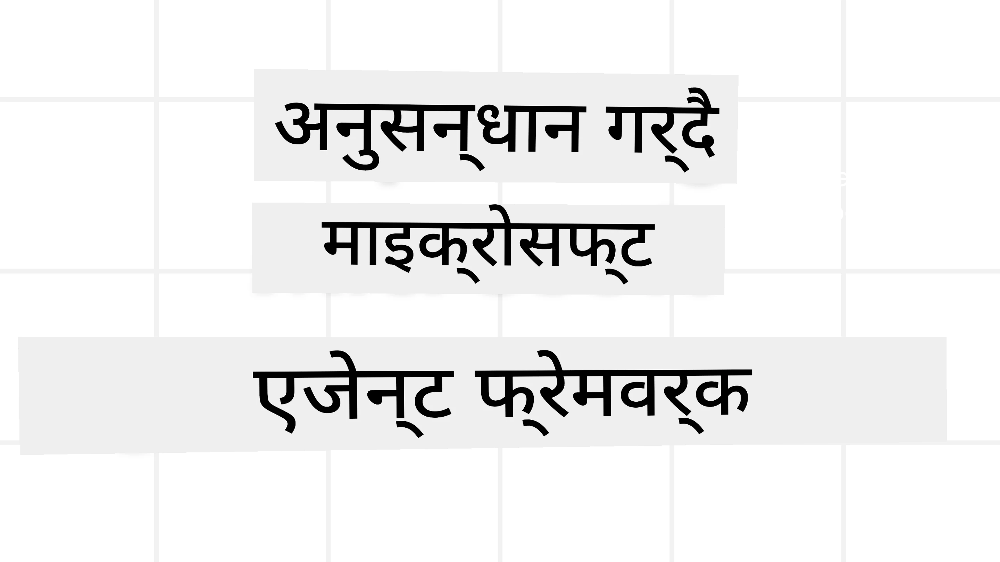
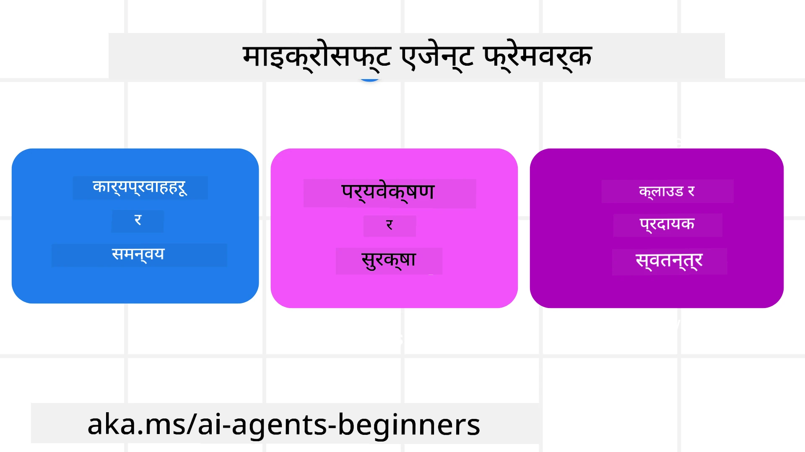
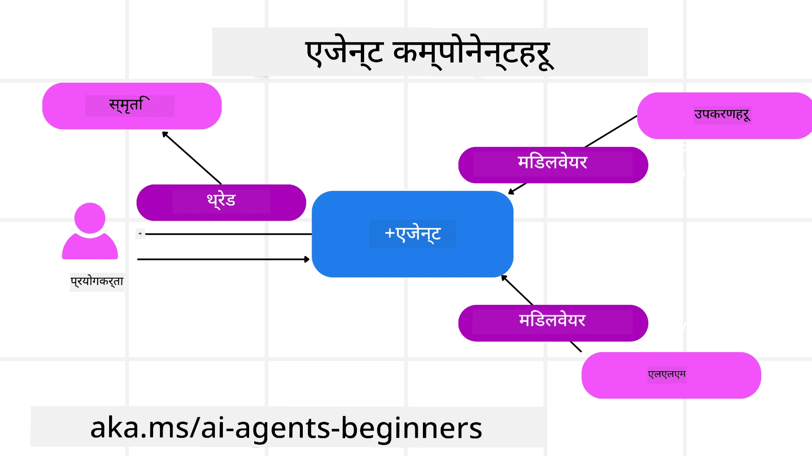

# माइक्रोसफ्ट एजेन्ट फ्रेमवर्क अन्वेषण



### परिचय

यो पाठमा समावेश हुनेछ:

- माइक्रोसफ्ट एजेन्ट फ्रेमवर्कलाई बुझ्नु: मुख्य विशेषताहरु र मूल्य  
- माइक्रोसफ्ट एजेन्ट फ्रेमवर्कका मुख्य अवधारणाहरु अन्वेषण गर्ने
- उन्नत MAF ढाँचा: कार्यप्रवाहहरू, मिडलवेयर, र मेमोरी

## सिकाइ लक्ष्यहरू

यस पाठ समाप्त गरेपछि, तपाईं जान्नु हुनेछ कसरी:

- माइक्रोसफ्ट एजेन्ट फ्रेमवर्क प्रयोग गरी उत्पादन तयार AI एजेन्टहरू बनाउने
- माइक्रोसफ्ट एजेन्ट फ्रेमवर्कका मुख्य विशेषताहरूलाई एजेन्ट उपयोग मामिलाहरूमा लागू गर्ने
- कार्यप्रवाहहरू, मिडलवेयर र अवलोकनक्षमतासहित उन्नत ढाँचाहरू प्रयोग गर्ने

## कोड नमूनाहरू 

[Microsoft Agent Framework (MAF)](https://learn.microsoft.com/en-us/agent-framework/overview/?wt.mc_id=youtube_26688_organicsocial_reactor&pivots=programming-language-python) का कोड नमूनाहरू यस रिपोजिटरीमा `xx-python-agent-framework` र `xx-dotnet-agent-framework` फाइलहरू अन्तर्गत पाइन्छन्।

## माइक्रोसफ्ट एजेन्ट फ्रेमवर्क बुझ्न



[Microsoft Agent Framework (MAF)](https://learn.microsoft.com/en-us/agent-framework/overview/?wt.mc_id=youtube_26688_organicsocial_reactor&pivots=programming-language-python) माइक्रोसफ्टको एउटै फ्रेमवर्क हो जसले AI एजेन्टहरू निर्माण गर्न मद्दत गर्छ। यसले उत्पादन र अनुसन्धान दुवै वातावरणमा देखिएका विभिन्न प्रकारका एजेन्ट उपयोग मामिलाहरू समाधान गर्न लचिलोपन प्रदान गर्छ, जस्तै:

- **क्रमिक एजेन्ट व्यवस्थापन** जहाँ चरण-द्वारा-चरण कार्यप्रवाह आवश्यक हुन्छ।
- **समानान्तर व्यवस्थापन** जहाँ एजेन्टहरूले एकै समयमा कार्यहरू पूरा गर्नुपर्ने हुन्छ।
- **समुह संवाद व्यवस्थापन** जहाँ एजेन्टहरूले एउटै कार्यमा एकसाथ मिलेर काम गर्न सक्छन्।
- **कार्य हस्तान्तरण व्यवस्थापन** जहाँ एजेन्टहरूले एउटा अर्कोमा साना कार्यहरू पूरा भएपछि कार्य हस्तान्तरण गर्छन्।
- **चुंबकीय व्यवस्थापन** जहाँ व्यवस्थापक एजेन्टले कार्य सूची सिर्जना र संशोधन गर्छ र उप-एजेन्टहरूको समन्वय गर्दै कार्य पूरा गर्छ।

उत्पादनमा AI एजेन्टहरू उपलब्ध गराउन, MAF मा यी सुविधाहरू पनि समावेश छन्:

- **अवलोकनक्षमता** OpenTelemetry प्रयोग गरी जहाँ AI एजेन्टका हरेक क्रिया, उपकरण कल, व्यवस्थापन चरणहरू, तर्क प्रवाहहरू र Microsoft Foundry ड्यासबोर्डमार्फत प्रदर्शन अनुगमन गरिन्छ।
- **सुरक्षा** एजेन्टहरू Microsoft Foundry मा मूल रूपमा होस्ट गरिन्छ जसमा रोल-आधारित पहुँच, निजी डेटा ह्यान्डलिङ र बिल्ट-इन सामग्री सुरक्षा जस्ता सुरक्षा नियन्त्रणहरू समावेश छन्।
- **दृढता** एजेन्ट थ्रेडहरू र कार्यप्रवाहहरू रोक्न, फेरि सुरु गर्न र त्रुटिबाट पुनर्प्राप्त गर्न सकिन्छ जसले लामो समयसम्म चल्ने प्रक्रियाहरू सक्षम बनाउँछ।
- **नियन्त्रण** मानव अनुमोदन आवश्यक पर्ने कार्यहरूलाई मार्क गरेर मानव सहभागी कार्यप्रवाहहरू समर्थन गर्दै।

माइक्रोसफ्ट एजेन्ट फ्रेमवर्क पनि अन्तरक्रियाशील हुन केन्द्रित छ:

- **क्लाउड-उदारवादी हुन** - एजेन्टहरू कन्टेनरहरू, स्थानीय र विभिन्न क्लाउडहरूसँग चलाउन सकिन्छ।
- **प्रदाता-उदारवादी हुन** - तपाईंको मनपर्ने SDK मार्फत एजेन्टहरू सिर्जना गर्न सकिन्छ जस्तै Azure OpenAI र OpenAI।
- **खुला मानकहरू एकीकृत गर्दै** - एजेन्टहरूले Agent-to-Agent(A2A) र Model Context Protocol (MCP) जस्ता प्रोटोकलहरू प्रयोग गरी अन्य एजेन्ट र उपकरणहरू पत्ता लगाउन र प्रयोग गर्न सक्ने।
- **प्लगइन र कनेक्टरहरू** - Microsoft Fabric, SharePoint, Pinecone र Qdrant जस्ता डेटा र मेमोरी सेवाहरूसँग जडान गर्न सकिन्छ।

यसरी यी विशेषताहरू Microsoft Agent Framework का केही मुख्य अवधारणाहरूमा कसरी लागू गरिन्छ हेर्दछौं।

## माइक्रोसफ्ट एजेन्ट फ्रेमवर्कका मुख्य अवधारणाहरू

### एजेन्टहरू



**एजेन्ट सिर्जना गर्ने**

एजेन्ट सिर्जना LLM प्रदायक (inference service), AI एजेन्टले पालना गर्ने निर्देशनहरूको सेट, र एक नियुक्त `name` सँग हुन्छ:


```python
agent = AzureOpenAIChatClient(credential=AzureCliCredential()).create_agent( instructions="You are good at recommending trips to customers based on their preferences.", name="TripRecommender" )
```

माथिको `Azure OpenAI` प्रयोग गरेको हो तर एजेन्टहरू विभिन्न सेवाहरू प्रयोग गरी पनि बनाउन सकिन्छ जस्तै `Microsoft Foundry Agent Service`:

```python
AzureAIAgentClient(async_credential=credential).create_agent( name="HelperAgent", instructions="You are a helpful assistant." ) as agent
```

OpenAI `Responses`, `ChatCompletion` API हरु

```python
agent = OpenAIResponsesClient().create_agent( name="WeatherBot", instructions="You are a helpful weather assistant.", )
```

```python
agent = OpenAIChatClient().create_agent( name="HelpfulAssistant", instructions="You are a helpful assistant.", )
```

वा [MiniMax](https://platform.minimaxi.com/), जुन OpenAI-संग अनुरूप API प्रदान गर्दछ र ठूलो सन्दर्भ विन्डोहरू (२०४K टोकनसम्म) समर्थन गर्दछ:

```python
agent = OpenAIChatClient(base_url="https://api.minimax.io/v1", api_key=os.environ["MINIMAX_API_KEY"], model_id="MiniMax-M3").create_agent( name="HelpfulAssistant", instructions="You are a helpful assistant.", )
```

वा A2A प्रोटोकल प्रयोग गरी रिमोट एजेन्टहरू:

```python
agent = A2AAgent( name=agent_card.name, description=agent_card.description, agent_card=agent_card, url="https://your-a2a-agent-host" )
```

**एजेन्ट सञ्चालन**

एजेन्टहरू `.run` वा `.run_stream` विधिहरू प्रयोग गरी नन-स्ट्रीमिङ वा स्ट्रीमिङ प्रतिक्रिया दुवैका लागि चलाइन्छ।

```python
result = await agent.run("What are good places to visit in Amsterdam?")
print(result.text)
```

```python
async for update in agent.run_stream("What are the good places to visit in Amsterdam?"):
    if update.text:
        print(update.text, end="", flush=True)

```

प्रत्येक एजेन्ट रनको लागि विकल्पहरू पनि हुन्छन्, जस्तै एजेन्टले प्रयोग गर्ने `max_tokens`, एजेन्टले कल गर्न सक्ने `tools`, र एजेन्टका लागि प्रयोग गरिएको `model` सम्म।

यो त्यस्ता अवस्थाहरूमा उपयोगी हुन्छ जहाँ प्रयोगकर्ताको कार्य पूरा गर्न विशेष मोडेल वा उपकरणहरू आवश्यक हुन्छन्।

**उपकरणहरू**

उपकरणहरू एजेन्टको निर्माण गर्दा परिभाषित गर्न सकिन्छ:

```python
def get_attractions( location: Annotated[str, Field(description="The location to get the top tourist attractions for")], ) -> str: """Get the top tourist attractions for a given location.""" return f"The top attractions for {location} are." 


# सिधा ChatAgent बनाउँदा

agent = ChatAgent( chat_client=OpenAIChatClient(), instructions="You are a helpful assistant", tools=[get_attractions]

```

र एजेन्ट सञ्चालन गर्दा पनि:

```python

result1 = await agent.run( "What's the best place to visit in Seattle?", tools=[get_attractions] # यो रनको लागि मात्र प्रदान गरिएको उपकरण )
```

**एजेन्ट थ्रेडहरू**

एजेन्ट थ्रेडहरू बहु-वृद्धि संवादहरू व्यवस्थापन गर्न प्रयोग गरिन्छ। थ्रेडहरू यस्तो गरि सिर्जना गर्न सकिन्छ:

- `get_new_thread()` प्रयोग गरी जुन थ्रेडलाई समयक्रमसँग सुरक्षित गर्न सक्षम बनाउँछ
- एजेन्ट चलाउँदा स्वतः थ्रेड सिर्जना गर्ने र त्यो थ्रेड हालको रनमा मात्र कायम रहन्छ।

थ्रेड सिर्जना गर्न कोड यसरी देखिन्छ:

```python
# नयाँ थ्रेड सिर्जना गर्नुहोस्।
thread = agent.get_new_thread() # थ्रेडसँग एजेन्ट चलाउनुहोस्।
response = await agent.run("Hello, I am here to help you book travel. Where would you like to go?", thread=thread)

```

पछि उक्त थ्रेडलाई पछि प्रयोगको लागि serialize गर्न सकिन्छ:

```python
# नयाँ थ्रेड सिर्जना गर्नुहोस्।
thread = agent.get_new_thread() 

# थ्रेडसँग एजेन्ट चलाउनुहोस्।

response = await agent.run("Hello, how are you?", thread=thread) 

# भण्डारणको लागि थ्रेड सिरीयलाइज गर्नुहोस्।

serialized_thread = await thread.serialize() 

# भण्डारणबाट लोड गरेपछि थ्रेड स्थिति डीसिरीयलाइज गर्नुहोस्।

resumed_thread = await agent.deserialize_thread(serialized_thread)
```

**एजेन्ट मिडलवेयर**

एजेन्टहरूले उपकरणहरू र LLM सँग अन्तरक्रिया गरेर प्रयोगकर्ताका कार्यहरू पूरा गर्छन्। कतिपय अवस्थामा यी अन्तरक्रियाबीच कुनै क्रिया सञ्चालन वा ट्र्याक गर्न आवश्यक हुन्छ। एजेन्ट मिडलवेयरले यसलाई सम्भव बनाउँछ:

*कार्य मिडलवेयर*

यस मिडलवेयरले एजेन्ट र कल गरिने कार्य/उपकरणबीच क्रिया सञ्चालन गर्न अनुमति दिन्छ। जस्तै कार्य कलमा केही लगिङ गर्न चाहिने अवस्थामा।

तलको कोडमा `next` ले अर्को मिडलवेयर वा वास्तविक कार्य कल हुने निर्धारण गर्छ।

```python
async def logging_function_middleware(
    context: FunctionInvocationContext,
    next: Callable[[FunctionInvocationContext], Awaitable[None]],
) -> None:
    """Function middleware that logs function execution."""
    # पूर्व-प्रशोधन: कार्य सञ्चालन अघि लग
    print(f"[Function] Calling {context.function.name}")

    # अर्को मिडलवेयर वा कार्य सञ्चालनमा जारी राख्नुहोस्
    await next(context)

    # पश्चात-प्रशोधन: कार्य सञ्चालन पछि लग
    print(f"[Function] {context.function.name} completed")
```

*संवाद मिडलवेयर*

यस मिडलवेयरले एजेन्ट र LLM बीचको अनुरोधहरूबीच क्रिया सञ्चालन वा लगिङ गर्न अनुमति दिन्छ।

यसमा AI सेवा पठाइएका `messages` जस्ता महत्वपूर्ण जानकारीहरू हुन्छन्।

```python
async def logging_chat_middleware(
    context: ChatContext,
    next: Callable[[ChatContext], Awaitable[None]],
) -> None:
    """Chat middleware that logs AI interactions."""
    # पूर्व-प्रक्रिया: AI कल अघि लग
    print(f"[Chat] Sending {len(context.messages)} messages to AI")

    # अर्को मिडलवेयर वा AI सेवामा जारी राख्नुहोस्
    await next(context)

    # पश्चात-प्रक्रिया: AI प्रतिक्रियापछि लग गर्नुहोस्
    print("[Chat] AI response received")

```

**एजेन्ट मेमोरी**

`Agentic Memory` पाठअनुसार, मेमोरी एजेन्टलाई विभिन्न सन्दर्भहरूमा संचालन गर्न महत्वपूर्ण तत्व हो। MAF ले विभिन्न प्रकारका मेमोरीहरू उपलब्ध गराउँछ:

*इन-मेमोरी सञ्चय*

यो मेमोरी एप्लिकेशन रनटाइमका क्रममा थ्रेडहरूमा संग्रहित हुन्छ।

```python
# नयाँ थ्रेड सिर्जना गर्नुहोस्।
thread = agent.get_new_thread() # थ्रेडसँग एजेन्ट चलाउनुहोस्।
response = await agent.run("Hello, I am here to help you book travel. Where would you like to go?", thread=thread)
```

*दिगो सन्देशहरू*

यो मेमोरी विभिन्न सत्रमा कुराकानी इतिहास सङ्ग्रह गर्न प्रयोग हुन्छ। यसलाई `chat_message_store_factory` प्रयोग गरी परिभाषित गरिन्छ:

```python
from agent_framework import ChatMessageStore

# एउटा अनुकूल सन्देश भण्डार सिर्जना गर्नुहोस्
def create_message_store():
    return ChatMessageStore()

agent = ChatAgent(
    chat_client=OpenAIChatClient(),
    instructions="You are a Travel assistant.",
    chat_message_store_factory=create_message_store
)

```

*डायनामिक मेमोरी*


यो मेमोरी एजेन्टहरू चलाउनु अघि सन्दर्भमा थपिन्छ। यी मेमोरीहरू mem0 जस्ता बाह्य सेवाहरूमा सुरक्षित गर्न सकिन्छ:

```python
from agent_framework.mem0 import Mem0Provider

# उन्नत मेमोरी क्षमता को लागि Mem0 को प्रयोग गर्दै
memory_provider = Mem0Provider(
    api_key="your-mem0-api-key",
    user_id="user_123",
    application_id="my_app"
)

agent = ChatAgent(
    chat_client=OpenAIChatClient(),
    instructions="You are a helpful assistant with memory.",
    context_providers=memory_provider
)

```

**एजेन्ट अवलोकनशीलता**

अवलोकनशीलता विश्वसनीय र मर्मतयोग्य एजेन्टिक प्रणालीहरू निर्माण गर्न महत्त्वपूर्ण छ। MAF ले OpenTelemetry सँग एकीकृत भएर राम्रो अवलोकनशीलताको लागि ट्रेसिङ र मीटरहरू प्रदान गर्छ।

```python
from agent_framework.observability import get_tracer, get_meter

tracer = get_tracer()
meter = get_meter()
with tracer.start_as_current_span("my_custom_span"):
    # केहि गर्नुहोस्
    pass
counter = meter.create_counter("my_custom_counter")
counter.add(1, {"key": "value"})
```

### कार्यप्रवाहहरू

MAF ले कार्य पूरा गर्न पूर्व-परिभाषित कदमहरू भएको कार्यप्रवाहहरू प्रस्ताव गर्छ र ती कदमहरूमा AI एजेन्टहरूलाई कम्पोनेन्टहरूका रूपमा समावेश गर्दछ।

कार्यप्रवाहहरू विभिन्न कम्पोनेन्टहरू मिलेर बनेका हुन्छन् जसले राम्रो नियन्त्रण प्रवाहलाई अनुमति दिन्छ। कार्यप्रवाहहरूले **बहु-एजेन्ट संयोजन** र **चेकपोइन्टिंग** पनि सक्षम बनाउँछन् जसले कार्यप्रवाह अवस्थाहरू सुरक्षित गर्दछ।

कार्यप्रवाहका मुख्य कम्पोनेन्टहरू हुन्:

**प्रवर्तकहरू**

प्रवर्तकहरूले इनपुट सन्देशहरू प्राप्त गर्छन्, कार्यहरू सम्पन्न गर्छन्, र त्यसपछि आउटपुट सन्देश उत्पादन गर्छन्। यसले कार्यप्रवाहलाई ठूलो कार्य पूरा गर्नतर्फ अगाडि बढाउँछ। प्रवर्तकहरू AI एजेन्ट वा कस्टम लॉजिक हुन सक्छन्।

**एजहरू**

एजहरू कार्यप्रवाहमा सन्देशहरूको प्रवाह निर्धारण गर्न प्रयोग गरिन्छ। यी हुन सक्छन्:

*प्रत्यक्ष एजहरू* - प्रवर्तकहरू बीचको सरल एक-देखि-एक जडानहरू:

```python
from agent_framework import WorkflowBuilder

builder = WorkflowBuilder()
builder.add_edge(source_executor, target_executor)
builder.set_start_executor(source_executor)
workflow = builder.build()
```

*सशर्त एजहरू* - निश्चित सर्त पूरा भएपछि सक्रिय हुन्छन्। उदाहरणका लागि, जब होटल कोठा उपलब्ध हुँदैन, एक प्रवर्तकले अन्य विकल्पहरू सिफारिस गर्न सक्छ।

*स्विच-कस एजहरू* - परिभाषित सर्तहरूमा आधारित विभिन्न प्रवर्तकहरूतर्फ सन्देशहरू मार्गनिर्देशन गर्छन्। उदाहरणका लागि, यदि यात्री ग्राहकसँग प्राथमिकता पहुँच छ भने उनीहरूको कार्यहरू अर्को कार्यप्रवाहमार्फत व्यवस्थापन गरिन्छ।

*फ्यान-आउट एजहरू* - एउटै सन्देश धेरै लक्षितहरूमा पठाउन।

*फ्यान-इन एजहरू* - विभिन्न प्रवर्तकहरूबाट धेरै सन्देशहरू सङ्कलन गरेर एउटै लक्ष्यमा पठाउन।

**घटनाहरू**

कार्यप्रवाहहरूमा राम्रो अवलोकनशीलता प्रदान गर्न MAF ले कार्यान्वयनको लागि तयार गरिएको घटनाहरू प्रस्ताव गर्छ:

- `WorkflowStartedEvent`  - कार्यप्रवाह कार्यान्वयन सुरु हुन्छ
- `WorkflowOutputEvent` - कार्यप्रवाहले आउटपुट उत्पादन गर्छ
- `WorkflowErrorEvent` - कार्यप्रवाहमा त्रुटि आउँछ
- `ExecutorInvokeEvent`  - प्रवर्तकले प्रक्रिया सुरु गर्छ
- `ExecutorCompleteEvent`  -  प्रवर्तकले प्रक्रिया समाप्त गर्छ
- `RequestInfoEvent` - अनुरोध जारी हुन्छ

## उन्नत MAF ढाँचा

माथिका खण्डहरूले Microsoft Agent Framework का प्रमुख अवधारणाहरू कभर गर्छन्। तपाईंले जादा जटिल एजेन्टहरू बनाउँदा, यहाँ केही उन्नत ढाँचा विचार गर्न:

- **मिडलवेयर संयोजन**: एजेन्ट व्यवहारमा सूक्ष्म नियन्त्रणका लागि धेरै मिडलवेयर ह्यान्डलरहरू (लगिङ, प्रमाणीकरण, दर सीमांकन) चेन गर्नुहोस्।
- **कार्यप्रवाह चेकपोइन्टिंग**: लामो संचालन गर्ने एजेन्ट प्रक्रियाहरू सुरक्षित र पुनः आरम्भ गर्न कार्यप्रवाह घटनाहरू तथा सिरीयलाइजेशन प्रयोग गर्नुहोस्।
- **डाइनामिक उपकरण चयन**: RAG लाई उपकरण विवरणहरूसँग संयोजन गरेर MAF को उपकरण पञ्जीकृतसँग मात्र सम्बन्धित उपकरणहरू क्वेरी अनुसार प्रस्तुत गर्नुहोस्।
- **बहु-एजेन्ट हस्तान्तरण**: कार्यप्रवाह एजहरू र सशर्त मार्गनिर्देशन प्रयोग गरेर विशेषज्ञ एजेन्टहरू बीच हस्तान्तरण व्यवस्थापन गर्नुहोस्।

## Microsoft Foundry मा LangChain / LangGraph एजेन्टहरू होस्ट गर्न

Microsoft Agent Framework **फ्रेamework-इंटरओपेरेबल** हो — तपाईं मात्र MAF सँग लेखिएका एजेन्टहरूमा सीमित हुनु पर्दैन। यदि तपाईंले पहिले नै **LangChain** वा **LangGraph** प्रयोग गरेर एजेन्ट बनाउनु भएको छ भने, तपाईं यसलाई **Microsoft Foundry होस्ट गरिएको एजेन्ट** को रूपमा चलाउन सक्नुहुन्छ जसले Foundry ले रनटाइम, सेसनहरू, स्केलिंग, पहिचान, र प्रोटोकल अन्त बिन्दुहरू व्यवस्थापन गर्छ, जबकि तपाईंको एजेन्ट लॉजिक LangGraph मा रहनेछ।

यो `langchain_azure_ai.agents.hosting` प्याकेजको साथ गरिन्छ, जसले Foundry होस्ट गरिएको एजेन्टहरूले प्रयोग गर्ने समान प्रोटोकलहरूमा संकलित LangGraph ग्राफ एक्स्पोज गर्छ।

**1. होस्टिङ एक्स्ट्रा स्थापना गर्नुहोस्:**

```bash
pip install -U "langchain-azure-ai[hosting]>=1.2.4" azure-identity
```

`hosting` एक्स्ट्राले Foundry प्रोटोकल पुस्तकालयहरू स्थापना गर्छ: `azure-ai-agentserver-responses` (OpenAI- अनुकूल `/responses` अन्त बिन्दु) र `azure-ai-agentserver-invocations` (सामान्य `/invocations` अन्त बिन्दु)।

**2. होस्टिङ प्रोटोकल रोज्नुहोस्:**

| प्रोटोकल | होस्ट कक्षा | अन्त बिन्दु | प्रयोग गर्ने बेला |
|----------|-----------|----------|----------|
| **Responses** | `ResponsesHostServer` | `/responses` | तपाईंलाई OpenAI-संगत कुराकानी, स्ट्रिमिङ, प्रतिक्रिया इतिहास र संवाद धागोलाई चाहिएको छ — कुराकानी एजेन्टहरूका लागि सिफारिस गरिएको पूर्वनिर्धारित। |
| **Invocations** | `InvocationsHostServer` | `/invocations` | तपाईंलाई कस्टम JSON ढाँचा, वेबहुक शैली अन्त बिन्दु, वा गैर-कुराकानी प्रक्रिया चाहिन्छ। |

किनभने **Responses API Foundry मा एजेन्ट-शैली विकासको प्राथमिक API हो**, अधिकाँश एजेन्टहरूका लागि `ResponsesHostServer` बाट सुरु गर्नुहोस्।

**3. वातावरण भेरिएबलहरू कन्फिगर गर्नुहोस्** (`az login` पहिले गर्नुपर्ने ताकि `DefaultAzureCredential` प्रमाणीकरण गर्न सकोस्):

```bash
export FOUNDRY_PROJECT_ENDPOINT="https://<resource>.services.ai.azure.com/api/projects/<project>"
export FOUNDRY_MODEL_NAME="gpt-5-mini"
```

जब एजेन्ट पछि Foundry मा होस्ट गरिएको एजेन्टको रूपमा चल्छ, प्लेटफर्मले स्वतः `FOUNDRY_PROJECT_ENDPOINT` इन्जेक्ट गर्छ।

**4. Responses प्रोटोकलमाथि LangGraph एजेन्ट एक्स्पोज गर्नुहोस्:**

```python
import os

from azure.ai.projects import AIProjectClient
from azure.identity import DefaultAzureCredential, get_bearer_token_provider
from langchain.agents import create_agent
from langchain_openai import ChatOpenAI
from langchain_azure_ai.agents.hosting import ResponsesHostServer

_AZURE_AI_SCOPE = "https://ai.azure.com/.default"


def build_chat_model() -> ChatOpenAI:
    project_endpoint = os.environ["FOUNDRY_PROJECT_ENDPOINT"].rstrip("/")
    deployment = os.environ.get("FOUNDRY_MODEL_NAME", "gpt-5-mini")
    credential = DefaultAzureCredential()
    project = AIProjectClient(endpoint=project_endpoint, credential=credential)
    openai_client = project.get_openai_client()
    token_provider = get_bearer_token_provider(credential, _AZURE_AI_SCOPE)

    # ChatOpenAI यहाँ Foundry प्रोजेक्टको OpenAI-अनुकूल (प्रतिक्रियाहरू) अन्त बिन्दुलाई लक्षित गर्दछ।
    return ChatOpenAI(
        model=deployment,
        base_url=str(openai_client.base_url),
        api_key=token_provider,
    )


def main() -> None:
    graph = create_agent(build_chat_model(), tools=[])
    port = int(os.environ.get("PORT", "8088"))
    ResponsesHostServer(graph).run(port=port)


if __name__ == "__main__":
    main()
```

यसलाई स्थानीय रूपमा `python main.py` सँग चलाउनुहोस्, पछि `http://localhost:8088/responses` मा Responses अनुरोध पठाउनुहोस्।

**मुख्य व्यवहारहरू:**

- **संवादहरू**: क्लाइन्टहरूले `previous_response_id` वा `conversation` ID पास गरेर संवाद जारी राख्छन्। यदि तपाईको ग्राफ LangGraph चेकपोइन्टरसहित कम्पाइल गरिएको छ भने, Foundry ले संवाद अवस्थालाई चेकपोइन्टसँग की गर्दछ (उत्पादनमा दृढ चेकपोइन्टर प्रयोग गर्नुहोस्; स्थानीय परीक्षणका लागि `MemorySaver` पर्याप्त छ)।
- **मानव-इन-द-लूप**: यदि तपाईको ग्राफले LangGraph `interrupt()` प्रयोग गर्छ भने, `ResponsesHostServer` पर्खिरहेका इन्टरप्टलाई Responses `function_call` / `mcp_approval_request` वस्तुका रूपमा देखाउँछ र क्लाइन्टहरूले मेल खाने `function_call_output` / `mcp_approval_response` सँग पुनः सुरु गर्छन्।
- **Foundry मा डिप्लोय गर्नुहोस्**: Azure Developer CLI प्रयोग गर्नुहोस् — `azd ext install azure.ai.agents`, `azd ai agent init -m <manifest>`, `azd ai agent run` (स्थानीय, Docker आवश्यक), त्यसपछि `azd provision` र `azd deploy`। होस्टेड-एजेन्ट डिप्लोयमेन्टका लागि **Foundry Project Manager** भूमिका आवश्यक छ।

यो उदाहरणको चलाउन सकिने संस्करण [code-samples/14-langchain-hosted-agent.py](../../../14-microsoft-agent-framework/code-samples/14-langchain-hosted-agent.py) मा छ। पूर्ण वाकथ्रू (Invocations प्रोटोकल, कस्टम अनुरोध स्कीमा, र समस्या समाधान) का लागि, [Host LangGraph agents as Foundry hosted agents](https://learn.microsoft.com/azure/foundry/how-to/develop/langchain-hosted-agents) हेर्नुहोस्।

## कोड नमूनाहरू 

Microsoft Agent Framework का कोड नमूनाहरू यस रिपोजिटरीमा `xx-python-agent-framework` र `xx-dotnet-agent-framework` फाइलहरूमा फेला पार्न सकिन्छ।

## Microsoft Agent Framework सम्बन्धि थप प्रश्नहरू छन्?

अरू सिक्नेलाई भेट्न, अफिस आवर्समा जान, र आफ्नो AI एजेन्ट सम्बन्धी प्रश्नहरूको उत्तर पाउन [Microsoft Foundry Discord](https://discord.com/invite/ATgtXmAS5D) मा सहभागी हुनुहोस्।
## अघिल्लो पाठ

[AI एजेन्टहरूमाझ मेमोरी](../13-agent-memory/README.md)

## अर्को पाठ


[कम्प्युटर उपयोग एजेन्टहरू (CUA) बनाउने] (../15-browser-use/README.md)

---

<!-- CO-OP TRANSLATOR DISCLAIMER START -->
**अस्वीकरण**:
यो दस्तावेज़ AI अनुवाद सेवा [Co-op Translator](https://github.com/Azure/co-op-translator) प्रयोग गरेर अनुवाद गरिएको हो। हामी सही हुन प्रयास गर्छौं, तर कृपया जानकार हुनुस् कि स्वचालित अनुवादमा त्रुटिहरू वा अशुद्धताहरू हुन सक्छन्। मूल दस्तावेज़ यसको मूल भाषामा आधिकारिक स्रोत मानिनुपर्छ। महत्वपूर्ण जानकारीका लागि व्यावसायिक मानव अनुवाद सिफारिस गरिन्छ। यस अनुवादको प्रयोगबाट उत्पन्न कुनै पनि गलत बुझाइ वा त्रुटिको लागि हामी जिम्मेवार छैनौं।
<!-- CO-OP TRANSLATOR DISCLAIMER END -->