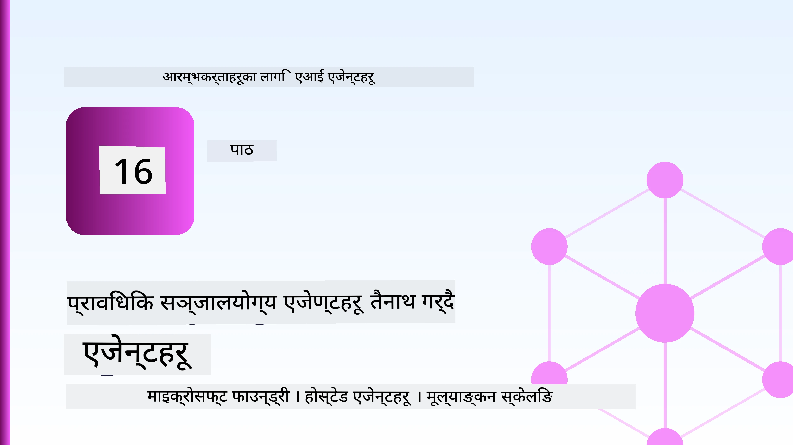
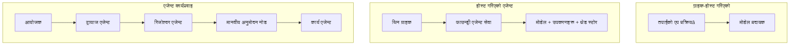
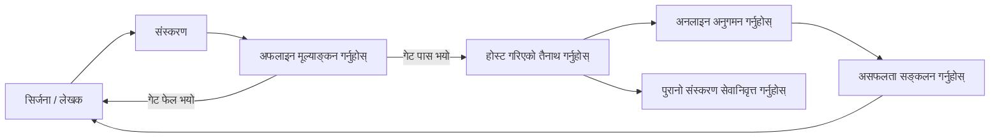
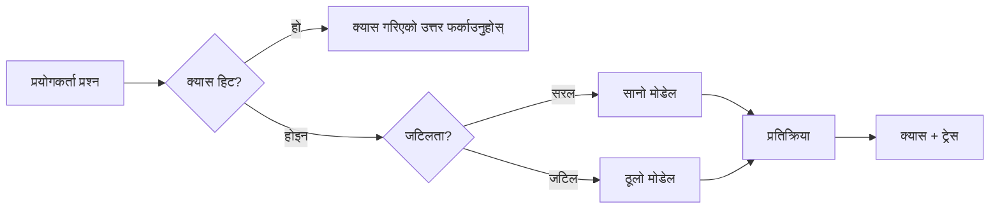
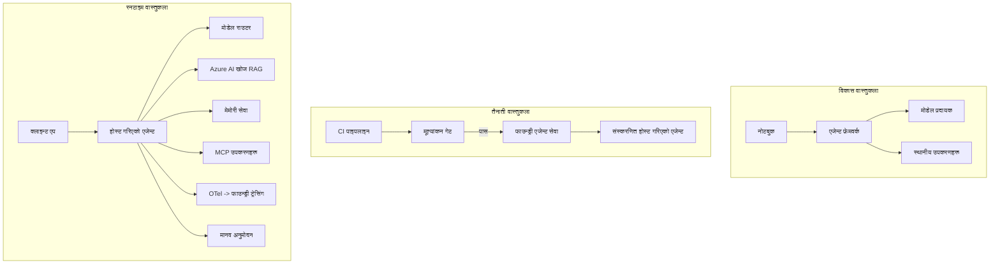

# Microsoft Foundry सँग स्केलेबल एजेन्टहरू परिनियोजन गर्दै



यस पाठ्यक्रमसम्म तपाईंले त्यस्ता एजेन्टहरू निर्माण गर्नुभएको छ जुन तपाईंको ल्यापटपमा, नोटबुक भित्र, `az login` र केही परिवेश परिवर्तनीयहरूमार्फत चल्छन्। यसरी सिक्नु बिल्कुलै सहि तरीका हो। तर हजारौं ग्राहकहरू ३ बजेको समयमा भर पर्नुपर्ने एजेन्ट चलाउनका लागि यो तरिका सहि छैन।

यो पाठ "मेरो मेसिनमा काम गर्छ" र "उत्पादनमा भरपर्दो र सस्तोमा काम गर्छ" बीचको दूरीको बारेमा हो। हामी **Microsoft Foundry** र **Microsoft Foundry Agent Service** प्रयोग गर्दै त्यो दूरीलाई बन्द गर्छौं, र हामी एउटा वास्तविक ग्राहक समर्थन एजेन्ट निर्माण गरेर गर्छौं जसमा उपकरण, पुनःप्राप्ति, स्मृति, मूल्याङ्कन, र अनुगमन हुन्छ।

## परिचय

यस पाठले समेट्ने विषयहरू:

- **प्रोटोटाइप एजेन्ट** र **परिनियोजित एजेन्ट** बीचको भिन्नता, र किन मुख्य रूपमा मोडेलको वरिपरि सबैकुरा परिवर्तन हुन्छ।
- एजेन्टहरूको **परिनियोजन ढाँचा**: क्लाइन्ट-होस्टेड, सेवा-होस्टेड (Hosted Agents), र वर्कफलो-अर्केस्ट्रेटेड।
- Microsoft Foundry मा **एजेन्ट जीवनचक्र** — सिर्जना, संस्करण, परिनियोजन, मूल्याङ्कन, अनुगमन, सेवानिवृत्ति।
- **स्केलिङ रणनीतिहरू**: मोडेल राउटिङ, क्याचिङ, समवर्तीता, र स्टेटलेस डिजाइन।
- OpenTelemetry र Foundry ट्रेसिङसँग **पर्यवेक्षणीयता**।
- मोडेल चयन, राउटिङ, र मूल्याङ्कन गेटहरू मार्फत **लागत अनुकूलन**।
- **एंटरप्राइज विचारहरू**: शासन, मानव अनुमोदन, र उत्पादनमा MCP सर्भरहरू सुरक्षित रूपमा चलाउने।

## सिकाइ उद्देश्यहरू

यस पाठ पूरा गरेपछि तपाईं जान्नुहुनेछ कसरी:

- दिइएको एजेन्ट कार्यभारका लागि सहि परिनियोजन ढाँचा छान्ने।
- एजेन्टलाई Microsoft Foundry Agent Service मा परिनियोजन गर्ने ताकि यो संस्करणबद्ध, शासन गरिएको, र देखिने योग्य होस्।
- एजेन्टलाई ट्रेसिङका लागि उपकरण गर्ने र प्रत्येक रिलिज अघि चल्ने मूल्याङ्कन पाइपलाइन जोड्ने।
- मोडेल राउटिङ र क्याचिङ लागू गर्ने जसले ढिलाइ र लागतलाई नियन्त्रण गर्छ।
- उच्च जोखिमका कार्यहरूका लागि मानव अनुमोदन गेट थप्ने र उत्पादन-सुरक्षित तरिकाले MCP सर्भर एकीकृत गर्ने।

## पूर्व-आवश्यकताहरू

यो पाठले पूर्व पाठहरू पूरा गरेको र यी कुराहरूमा सहज हुनु आवश्यक छ:

- [Microsoft Agent Framework](../14-microsoft-agent-framework/README.md) (पाठ १४) सँग एजेन्टहरू निर्माण गर्ने।
- [उपकरण प्रयोग](../04-tool-use/README.md) (पाठ ४) र [Agentic RAG](../05-agentic-rag/README.md) (पाठ ५)।
- [एजेन्ट मेमोरी](../13-agent-memory/README.md) (पाठ १३) र [Agentic Protocols / MCP](../11-agentic-protocols/README.md) (पाठ ११)।
- [पर्यवेक्षण र मूल्याङ्कन](../10-ai-agents-production/README.md) (पाठ १०) — यसले सीधै त्यसमाथि बनाउँछ।

तपाईंलाई यी पनि आवश्यक छ:

- कम्तिमा एक परिनियोजित च्याट मोडेल भएको **Azure सदस्यता** र **Microsoft Foundry परियोजना**।
- प्रमाणित गरिएको **Azure CLI** (`az login`)।
- Python 3.12+ र रिपोजिटोरीको प्याकेजहरू [`requirements.txt`](../../../requirements.txt) मा।

## प्रोटोटाइपबाट उत्पादनसम्म: के वास्तवमै परिवर्तन हुन्छ

प्रोटोटाइप एजेन्ट र उत्पादन एजेन्टले एउटै कोर लूप साझा गर्छन् — सोच्नु, उपकरण बोलाउनु, प्रतिक्रिया दिनु। परिवर्तन हुन्छ त्यो लूप वरिपरि रहेको सबै आकार। मोडेल उत्पादन एजेन्टको करिब २०% हो; बाँकी ८०% संचालन संरचना हो।

| चासो | प्रोटोटाइप | उत्पादन |
| --- | --- | --- |
| **होस्टिङ** | तपाईंको नोटबुकमा चल्छ | होस्ट गरिएको सेवा, संस्करणबद्ध र रोल आउट |
| **पहिचान** | तपाईंको `az login` टोकन | स्कोप गरिएको RBAC सहित व्यवस्थापित पहिचान |
| **अवस्था** | इन-मेमोरी, रिस्टार्टमा हराइन्छ | बाह्य (थ्रेड स्टोर, मेमोरी सेवा) |
| **असफलता** | तपाईं ट्रेसब्याक देख्नुहुन्छ | पुन: प्रयास, फालब्याक, डेड-लेटर, सचेतना |
| **लागत** | "थोरै रुपैयाँ" | अनुरोध अनुसार ट्र्याक, राउट, क्याच, बजेट गरिएको |
| **गुणस्तर** | तपाईंले आउटपुट हेर्नुहुन्छ | प्रत्येक रिलिज अघि स्वचालित मूल्याङ्कन |
| **विश्वास** | तपाईं सबै कार्य अनुमोदन गर्नुहुन्छ | जोखिमपूर्ण कार्यहरूका लागि नीति + मानव-इन-द-लूप |

यस तालिकालाई मनमा राख्नुहोस्। तलका प्रत्येक खण्ड यी पङ्क्तिहरूमध्ये एकसँग मिल्दोजुल्दो हुन्छ।

## एजेन्ट परिनियोजन ढाँचा

तपाईंले प्रायः संयोजनमा तीन ढाँचाहरू प्रयोग गर्नुहुनेछ।

### 1. क्लाइन्ट-होस्टेड एजेन्टहरू

एजेन्ट वस्तु तपाईंको अनुप्रयोग प्रक्रियाभित्र बस्छ। तपाईंको कोडले मोडेल प्रदायकलाई सिधै कल गर्छ; reasoning लूप तपाईंको सेवामा चल्छ। यो हरेक अघिल्लो पाठले गरेको कुरा हो।

- **प्रयोग गर्ने बेलामा** तपाईं लूपमाथि पूर्ण नियन्त्रण चाहनुहुन्छ, कस्टम मिडलवेयर, वा एजेन्टलाई पहिले नै रहेको ब्याकएन्डमा समावेश गर्दै हुनुहुन्छ।
- **व्यापार-सम्झौता**: स्केलिङ, अवस्था, र पुनरुत्थान तपाईं आफैं सम्हाल्नुहुन्छ।

### 2. होस्टेड एजेन्टहरू (Foundry Agent Service)

एजेन्ट Microsoft Foundry मा *स्रोतको रूपमा दर्ता गरिएको* हुन्छ। Foundry reasoning लूप होस्ट गर्छ, थ्रेडहरू भण्डारण गर्छ, सामग्री सुरक्षा र RBAC लागू गर्छ, र एजेन्टलाई Foundry पोर्टलमा देखिने बनाउँछ। तपाईंको अनुप्रयोग एक सानो क्लाइन्ट बन्छ जसले थ्रेडहरू सिर्जना गर्छ र प्रतिक्रिया पढ्छ।

- **प्रयोग गर्ने बेलामा** तपाईं दीर्घकालीनता, निर्मित पर्यवेक्षणीयता, शासन, र कम परिचालन सतह क्षेत्र चाहनुहुन्छ।
- **व्यापार-सम्झौता**: व्यवस्थापित रनटाइमका लागि कम तल-मात्रा नियन्त्रण।

### 3. एजेन्ट वर्कफ्लोज

धेरै एजेन्टहरू (र उपकरणहरू) स्पष्ट नियन्त्रण प्रवाह सहित ग्राफमा संयोजित हुन्छन् — क्रमिक कदमहरू, शाखा, मानव अनुमोदन नोडहरू, र दीर्घकालीन चेकपोइन्टहरू जसले रोक्न र पुनः सुरु गर्न सक्छन्। यो Microsoft Agent Framework को **Workflows** क्षमता हो जुन परिनियोजन स्केलेमा लागू गरिन्छ।

- **प्रयोग गर्ने बेलामा** एउटै कार्य धेरै विशेष एजेन्टहरू फैलिएको छ वा मध्यमा अनुमोदन चरण चाहिन्छ।
- **व्यापार-सम्झौता**: बढी चल्ने भागहरू; अर्केस्ट्रेसन-स्तर पर्यवेक्षणीयता आवश्यक।



## Microsoft Foundry मा एजेन्ट जीवनचक्र

एजेन्ट परिनियोजन एक पटकको `push` होइन। यो एउटा लूप हो, र यो सफ्टवेयर रिलिज चक्र जस्तै देखिन्छ किनभने ठीक त्यो हो।



मुख्य विचार, [पाठ १०](../10-ai-agents-production/README.md) बाट लिइएको: **अफलाइन मूल्याङ्कन गेट हो, पछि सोच्नु होइन।** नयाँ एजेन्ट संस्करण तपाईंको मूल्याङ्कन मापदण्ड पार नगरेसम्म शिप हुँदैन। अनलाइन पर्यवेक्षणले वास्तविक विश्व असफलताहरूलाई तपाईंको अफलाइन परीक्षण सेटमा फिर्ता फिँड्छ। त्यो नै पूर्ण लूप हो।

## स्केलिङ रणनीतिहरू

एजेन्ट स्केल गर्नु स्टेटलेस वेब API स्केल गर्ने भन्दा फरक छ, किनभने प्रत्येक अनुरोधले धेरै महँगो मोडेल र उपकरण कलहरू ट्रिगर गर्न सक्छ। चार प्रविधिहरूले अधिकांश लोड बोक्छन्।

**स्टेटलेस अनुरोध ह्यान्डलिङ।** तपाईंको प्रोसेस मेमोरीमा प्रति-प्रयोगकर्ता अवस्था नजोगाउनुहोस्। Foundry थ्रेड स्टोर वा मेमोरी सेवामा संवाद थ्रेडहरू लगातार भण्डारण गर्नुहोस् जसबाट कुनै पनि उदाहरणले कुनै पनि अनुरोध ह्यान्डल गर्न सक्दछ। यसले तपाईलाई तेर्सो रूपमा स्केल गर्न दिन्छ — उदाहरणहरू थप्नुहोस्, कुनै चिकन सत्र छैन।

**मोडेल राउटिङ।** सबै अनुरोधले तपाईंको सबैभन्दा सक्षम (र सबैभन्दा महँगो) मोडेल चाहिँदैन। सरल अनुरोधहरू — उद्देश्य वर्गीकरण, छोटा तथ्यात्मक जवाफहरू — सानो, छिटो मोडेलमा राउट गर्नुहोस्, र ठूलो मोडेल साँच्चै सोच्नका लागि रिजर्भ गर्नुहोस्। Foundry को **Model Router** यसलाई तपाईंको लागि गर्न सक्छ, वा तपाईं आफैं एक हल्का क्लासिफायर निर्माण गर्न सक्नुहुन्छ। तपाईं DIY संस्करण ल्याबमा निर्माण गर्नुहुनेछ।

**प्रतिक्रिया क्याचिङ।** धेरै समर्थन प्रश्नहरू लगभग दोहोरिएका हुन्छन् ("मेरो पासवर्ड कसरी रिसेट गर्ने?") सामान्य प्रश्नहरूको जवाफ क्याच गर्नुहोस् र मोडेललाई छोइनै बिना सेवा गर्नुहोस्। साधारण क्याच हिट दरले पनि लागत र ढिलाइमा महत्वपूर्ण कटौती गर्छ।

**समवर्तीता र ब्याकप्रेशर।** मोडेल प्रदायकसँग दर सीमाहरू हुन्छन्। तपाईंको समवर्तीतालाई सीमित गर्नुहोस्, पुन: प्रयासहरू प्रयोग गर्नुहोस् जसमा एक्स्पोनेन्सियल ब्याकअफ हुन्छ, र सफ्ट रूपमा असफल हुनुहोस् (क्युमा बसेको "हामी यसमा छौं" प्रतिक्रिया ५०० भन्दा राम्रो हो)।



## उत्पादनमा पर्यवेक्षणीयता

तपाईं देख्न नसकेपछि संचालन गर्न सक्नुहुन्न। पाठ १० मा समेटिए अनुसार, Microsoft Agent Framework ले **OpenTelemetry** ट्रेसेस स्वाभाविक रूपमा उत्सर्जन गर्छ — हरेक मोडेल कल, उपकरण आह्वान, र अर्केस्ट्रेसन कदमले एक स्प्यान बन्छ। उत्पादनमा तपाईं ती स्प्यानहरू Microsoft Foundry (वा कुनै पनि OTel-अनुकूल ब्याकएन्ड) मा निर्यात गर्नुहुन्छ जसबाट तपाईं:

- हरेक मोडेल र उपकरण कलमा एउटै ग्राहक गुनासोलाई अन्तदेखि अन्तसम्म ट्रेस गर्न।
- समयक्रममा p50/p95 लेटेंसी र अनुरोध प्रति लागत हेर्न।
- प्रयोगकर्ताहरू (वा तपाईंको वित्त टोली)ले थाहा पाउनुअघि त्रुटि-दर बृद्धि र लागत असामान्यता मा सचेत हुन।

```python
from agent_framework.observability import get_tracer

tracer = get_tracer()

with tracer.start_as_current_span("support_request") as span:
    span.set_attribute("customer.tier", "enterprise")
    span.set_attribute("routed.model", "gpt-5-nano")
    # यो स्प्यान भित्र एजेन्ट कार्यान्वयन स्वचालित रूपमा ट्रेस गरिन्छ
```

`customer.tier` र `routed.model` जस्ता विशेषताहरूले ट्रेसेसको पर्खाललाई जवाफयोग्य प्रश्नहरूमा परिवर्तन गर्छन् ("के एंटरप्राइज ग्राहकहरू धेरै पटक सानो मोडेलतर्फ राउट हुँदैछन्?")।

## लागत अनुकूलन

उत्पादन एजेन्टहरूमा लागत टोकनद्वारा प्रभुत्व हुन्छ। प्रभावको क्रममा तीन लीभरहरू:

1. **मोडेललाई सहि आकार दिनुहोस्।** सानो मोडेल जसले तपाईंको मूल्याङ्कन गेट पार गर्छ लगभग सधैं ठूलो मोडेल भन्दा सस्तो हुन्छ जसले पनि पार गर्छ। मूल्याङ्कन प्रयोग गरेर प्रमाणित गर्नुहोस् सानो मोडेल पर्याप्त राम्रो छ, डरले ठूलो मोडेलमा जानुअघि।
2. **जटिलताद्वारा राउट गर्नुहोस्।** माथि जस्तै — केवल ठूलो मोडेल सोचाइ चाहिने अनुरोधहरूको लागि ठूलो मोडेल मूल्य तिर्नुहोस्।
3. **तिव्र क्याचिंग गर्नुहोस्।** सबैभन्दा सस्तो मोडेल कल त्यो हो जुन तपाईंले कहिल्यै गर्नुहुन्न।

मूल्याङ्कन गेटहरू र लागत नियन्त्रण एउटै अभ्यासका दुई दृष्टिकोण हुन्: मूल्याङ्कनले तपाईंलाई *गुणस्तरको आधार* बताउँछ, राउटिङ र क्याचिङले तपाईंलाई त्यस आधारको *लागत* नजिक राख्दछ।

## एंटरप्राइज परिनियोजन विचारहरू

**शासन।** होस्टेड एजेन्टहरूले Foundry को RBAC, सामग्री सुरक्षा, र अडिट लगिङ वारिस पाउँछन्। प्रत्येक एजेन्टलाई कम अधिकार सहितको व्यवस्थापित पहिचान दिनुहोस् — ज्ञान भण्डारमा पढ्ने मात्र पहुँच, टिकटिंग API मा स्कोप गरिएका पहुँच, त्यसभन्दा बढी छैन।

**मानव-इन-द-लूप।** केही कार्यहरू यति महत्वपूर्ण हुन्छन् कि स्वचालित गर्न सकिँदैन — फिर्ती जारी गर्नु, खाता मेटाउनु, कानुनी टोलीमा बढाउँदै गर्नु। Microsoft Agent Framework ले **अनुमोदन-आवश्यक** उपकरणहरू समर्थन गर्छ: एजेन्टले कार्य प्रस्ताव गर्छ, कार्य रोकिन्छ, मानवले अनुमोदन वा अस्वीकृति गर्छ, र वर्कफ्लो पुनः सुरु हुन्छ। तपाईंले [पाठ ६](../06-building-trustworthy-agents/README.md) मा यसको प्रारम्भिक देख्नुभएको थियो; यहाँ तपाईं यसलाई परिनियोजन गर्नुहुन्छ।

**उत्पादनमा MCP।** [MCP](../11-agentic-protocols/README.md) ले तपाईंको एजेन्टलाई मानक इन्टरफेसमार्फत बाह्य उपकरणहरू उपभोग गर्न दिन्छ। उत्पादनमा, प्रत्येक MCP सर्भरलाई अविश्वसनीय सीमा मानेर व्यवहार गर्नुहोस्: सर्भर संस्करण पिन गर्नुहोस्, स्कोप गरिएको पहिचानसँग चलाउनुहोस्, यसको आउटपुटहरू मान्य गर्नुहोस्, र त्यसलाई कहिल्यै गोप्य कुरा नदेखाउनुहोस्। MCP सर्भर निर्भरता हो, र निर्भरताहरूमा प्याचिङ, अडिट, र दर सीमित गरिन्छ।



ती तीन रेखाचित्रहरू — विकास, परिनियोजन, रनटाइम — एउटै एजेन्टका तीन जीवन चरणहरू हुन्। तलको ल्याबले यसलाई निर्माण गर्न तपाईंलाई मार्गदर्शन गर्नेछ।

## प्रायोगिक ल्याब: उत्पादन-तयार ग्राहक समर्थन एजेन्ट

[`code_samples/16-python-agent-framework.ipynb`](./code_samples/16-python-agent-framework.ipynb) खोल्नुहोस् र अन्त सम्म काम गर्नुहोस्। तपाईं एक **Contoso ग्राहक समर्थन एजेन्ट** तयार गर्नुहुनेछ जसमा हरेक उत्पादन सम्बन्धित कुरा जोडिएको छ:

१. **उपकरण कल** — अर्डर स्थिति हेर्नुहोस् र समर्थन टिकट खोल्नुहोस्।
२. **RAG** — ज्ञान भण्डारबाट नीतिगत प्रश्नहरूको जवाफ दिनुहोस् (Azure AI Search सहित, मेमोरीमा फallbackसहित जसले नोटबुकलाई खोज स्रोत बिना चलाउन दिन्छ)।
३. **स्मृति** — संवादका चरणहरूमा ग्राहकलाई सम्झनुहोस्।
४. **मोडेल राउटिङ** — जटिलता क्लासिफायरले प्रत्येक अनुरोधलाई सानो वा ठूलो मोडेलमा राउट गर्छ।
५. **प्रतिक्रिया क्याचिङ** — दोहोरिएका प्रश्नहरू क्याचबाट सेवा गरिन्छ।
६. **मानव अनुमोदन** — सिमा भन्दा माथिका फिर्तीहरू मानव अनुमोदनका लागि रोकिन्छ।
७. **मूल्याङ्कन पाइपलाइन** — सानो अफलाइन परीक्षण सेटले एजेन्टलाई स्कोर गर्छ र रिलिज गेटको रूपमा काम गर्छ।
८. **पर्यवेक्षणीयता** — हरेक अनुरोध वरिपरि OpenTelemetry ट्रेसिङ।

### मार्गदर्शन

नोटबुक यति व्यवस्थित छ कि हरेक उत्पादन सम्बन्धित कुरा एउटा स्वतन्त्र, चलाउन मिल्ने खण्ड हो। यसको मुख्य भाग हो राउटिङ-प्लस-क्याचिङ अनुरोध ह्यान्डलर:

```python
async def handle_support_request(query: str, customer_id: str) -> str:
    # 1. सकेसम्म क्यासबाट सेवा गर्नुहोस्।
    cached = response_cache.get(normalize(query))
    if cached:
        return cached

    # 2. लागत नियन्त्रण गर्न जटिलताको आधारमा रुट गर्नुहोस्।
    model = "gpt-5-nano" if is_simple(query) else "gpt-5-mini"

    # 3. अवलोकनयोग्यताको लागि एजेन्टलाई ट्रेस स्प्यान भित्र चलाउनुहोस्।
    with tracer.start_as_current_span("support_request") as span:
        span.set_attribute("routed.model", model)
        span.set_attribute("customer.id", customer_id)
        response = await support_agent.run(query, model=model)

    # 4. क्यास गर्नुहोस् र फर्काउनुहोस्।
    response_cache.set(normalize(query), response.text)
    return response.text
```

रिलिजको लागि सुरक्षा गर्ने मूल्याङ्कन गेट यस्तै देखिन्छ:

```python
async def evaluation_gate(agent, test_cases, threshold: float = 0.8) -> bool:
    passed = 0
    for case in test_cases:
        result = await agent.run(case["input"])
        if score_response(result.text, case["expected"]) >= 0.8:
            passed += 1
    pass_rate = passed / len(test_cases)
    print(f"Evaluation pass rate: {pass_rate:.0%} (gate: {threshold:.0%})")
    return pass_rate >= threshold  # गेट सफल भएमा मात्र परिनियोजन गर्नुहोस्
```

हरेक लाइन पढ्नुहोस् — नोटबुकले प्राइमिटिभहरू जानाजानी साना राख्छ ताकि केही पनि फ्रेमवर्क कॉलको पछाडि लुकिएको नहोस्।

## परिनियोजित एजेन्टलाई स्मोक टेस्टले प्रमाणित गर्दै

माथिको मूल्याङ्कन गेट तपाईंको एजेन्ट वस्तुको विरुद्ध *अफलाइन* चल्छ। एकपटक एजेन्ट होस्टेड एजेन्टको रूपमा परिनियोजन भएपछि तपाईंलाई अझ एक, अझ सस्तो जाँच आवश्यक छ: **के परिनियोजित अन्तबिन्दु साँच्चिकै उत्तर दिइरहेको छ?**

"सफलतापूर्वक" परिनियोजन गर्नु भनेको नियन्त्रण विमानले परिभाषा स्वीकारेको मात्र प्रमाणित गर्नु हो — यो प्रमाणित गर्दैन कि एजेन्टले उत्तर दिइरहेको छ। कुनै निर्भरता नभएको, गलत मोडेल राउटिङ, वा समाप्त भएको जडानले हरियो परिनियोजन छोड्न सक्छ जसले केही फर्काउँदैन। **स्मोक टेस्ट** त्यो एकपटकमा, प्रत्येक परिनियोजनमा केहि सेकेन्डमा पक्रन्छ, पूर्ण मूल्याङ्कनको लागत बिना।

यो रिपोजिटोरी एक प्रयोग तयार स्मोक-टेस्ट पाइपलाइन लिएर आउँछ जुन [AI Smoke Test](https://github.com/marketplace/actions/ai-smoke-test) GitHub Action मा आधारित छ:

- **क्याटलग** — [`tests/lesson-16-smoke-tests.json`](../../../tests/lesson-16-smoke-tests.json) मा Contoso समर्थन एजेन्टका लागि प्राँप्टहरू र दावीहरू समावेश छन् (आधारित नीति जवाफहरू, अर्डर खोज, विषयमा रहन, र बहु-चरण थ्रेड निरन्तरता)। अन्य पाठका एजेन्टका लागि क्याटलगहरू यससँगै छन् — हेर्नुहोस् [`tests/README.md`](../tests/README.md)।
- **वर्कफ्लो** — [`.github/workflows/smoke-test.yml`](../../../.github/workflows/smoke-test.yml) Azure OIDC सँग लग इन गर्छ र हरेक प्राँप्टलाई एजेन्टको Responses अन्तबिन्दुमा POST गर्छ, कुनै दावी चूक्दा काम असफल बनाउँछ।

```yaml
- name: Smoke-test hosted agent
  uses: JFolberth/ai-smoketest@v1
  with:
    project_endpoint: ${{ inputs.project_endpoint }}
    agent_name: ContosoSupportAgent
    tests_file: tests/lesson-16-smoke-tests.json
```


तपाईंको एजेन्ट तैनाथ भएपछि **Actions** ट्याबबाट यसलाई चलाउनुहोस्, तपाईंको Foundry परियोजना एन्डपोइन्ट र एजेन्ट नाम प्रदान गर्दै। संघीय पहिचानलाई Foundry परियोजना स्कोपमा **Azure AI User** भूमिका आवश्यक छ। तहहरूलाई पिरामिडको रूपमा सोच्नुहोस्: स्मोक टेस्टहरू (पहुंच योग्य र प्रतिक्रिया देरहेको छ?) प्रत्येक तैनाथीमा चलाइन्छ, अफलाइन मूल्यांकन (ढुवानीका लागि पर्याप्त छ?) पदोन्नति अगाडि चलाइन्छ, र अनलाइन मूल्यांकन (यो जंगलीमा कस्तो छ?) निरन्तर चलाइन्छ।

## ज्ञान जाँच

असाइन्मेन्टमा जानु अघि आफ्नो बुझाइ परीक्षण गर्नुहोस्।

**१. उत्पादन एजेन्टको लगभग कति भाग "मोडेल" हो, र बाँकी के हो?**

<details>
<summary>उत्तर</summary>

मोडेल सिस्टमको अलि थोरै हो — प्रायः लगभग २०% को रूपमा उद्धृत। बाँकी अपरेशनल कंकाल हो: होस्टिंग र भर्सनिङ, पहिचान र RBAC, बाह्यीकृत स्थिति, असफलता व्यवस्थापन, लागत ट्रैकिङ, मूल्यांकन, र मानव-इन-द-लूप नियन्त्रणहरू। उत्पादनमा सर्ने कुरा प्रायः तर्कचक्रको *चोकिचौका* वरिपरि सबै कुरा निर्माण गर्ने हो।
</details>

**२. तपाईंले कहिले क्लाइन्ट-होस्ट एजेन्टको सट्टा होस्टेड एजेन्ट रोज्नुहुन्छ?**

<details>
<summary>उत्तर</summary>

जब तपाईंलाई निर्मित टिकाउपन (थ्रेडहरू जुन जारी रहन्छन् र पुन: सुरु गर्न सकिन्छ), अवलोकनयोग्यता, सामग्री सुरक्षा, र RBAC सहित व्यवस्थापन गरिएको रनटाइम चाहिन्छ, र तपाईं तर्कचक्रको केही तल स्तर नियन्त्रण कम गर्न इच्छुक हुनुहुन्छ कम अपरेशनल सतह क्षेत्रका लागि। क्लाइन्ट-होस्टेड तब राम्रो हुन्छ जब तपाईंलाई चक्रमाथि पूर्ण नियन्त्रण चाहिन्छ वा एजेन्टलाई पहिले नै बनेको ब्याकएन्डमा समावेश गर्दै हुनुहुन्छ।
</details>

**३. किन एक स्केलेबल एजेन्टलाई यसको आफ्नै प्रक्रिया मेमोरीमा स्टेटलेस हुनुपर्छ?**

<details>
<summary>उत्तर</summary>

जसले गर्दा कुनै पनि इन्स्ट्यान्सले कुनै पनि अनुरोध सम्हाल्न सकोस्, जुन स्थायी सत्र बिना तेर्सो स्केलिंगलाई अनुमति दिन्छ। प्रति-प्रयोगकर्ता कुराकानी स्थिति थ्रेड स्टोर वा मेमोरी सेवामा बाह्यीकृत गरिएको छ। यदि स्थिति प्रक्रियाको मेमोरीमा बस्ने हो भने पुन: सुरु गर्दा तपाईंले त्यो हराउनुहुनेछ र लोड स्वतन्त्र रूपमा वितरण गर्न सकिँदैन।
</details>

**४. मोडेल राउटिङले के समस्या समाधान गर्छ, र यो मूल्यांकनसँग कसरी सम्बन्धित छ?**

<details>
<summary>उत्तर</summary>

राउटिङले सरल अनुरोधहरूलाई सानो, सस्तो, छिटो मोडेलमा पठाउँछ र ठूलो मोडेललाई वास्तविक तर्कको लागि रिजर्भ गरी दुवै ढिलाइ र लागत नियन्त्रण गर्छ। यो मूल्यांकनसँग सम्बन्धित छ किनकि मूल्यांकनले *सिद्ध* गर्छ कि सानो मोडेल कुनै वर्गका अनुरोधहरूका लागि पर्याप्त राम्रो छ — मूल्यांकन बिना राउटिङ अनुमान लगाउन जस्तै हो।
</details>

**५. "मूल्यांकन गेट" के हो र यो जीवनचक्रमा कहाँ हुन्छ?**

<details>
<summary>उत्तर</summary>

मूल्यांकन गेटले नयाँ एजेन्ट भर्सनमा अफलाइन परीक्षण सेट चलाउँछ र पास दरले मानक नपुगुञ्जेल तैनाथि अवरुद्ध गर्छ। यो जीवनचक्रमा "भर्सन" र "तैनाथि" बीचमा बस्छ, गुणस्तरलाई रिलिजको पूर्वशर्त बनाउँदै ढुवानीपछि जाँच्ने वस्तु होइन।
</details>

**६. किन उत्पादनमा MCP सर्भरलाई अविश्वसनीय सीमा रूपमा व्यवहार गर्नुपर्छ?**

<details>
<summary>उत्तर</summary>

किनकि यो तपाईंको एजेन्टले कल गर्ने बाह्य निर्भरता हो। यसको भर्सन पिन गर्नुहोस्, स्कोप गरिएको पहिचानसहित चलाउनुहोस्, यसको आउटपुटहरूको मान्यकरण गर्नुहोस्, दर-सीमा लगाउनुहोस्, र कहिल्यै गुप्त कुरा यसलाई नदेखाउनुहोस् — जुन तपाईले कुनै तेस्रो-पक्ष निर्भरतालाई लागू गर्ने अनुशासन हो। यसको आउटपुटहरू तपाईंको एजेन्टको तर्कमा जान्छन्, त्यसैले अवैध प्रमाणित भरोसा सुरक्षा जोखिम हो।
</details>

**७. सामान्यतया उत्पादन एजेन्ट लागतमा सबैभन्दा ठूलो प्रभाव कस्तो परिवर्तनले पार्छ, र किन?**

<details>
<summary>उत्तर</summary>

मोडेलको उचित आकार निर्धारण — त्यो सानो मोडेल प्रयोग गर्ने जुन अझै तपाईंको मूल्यांकन गेट पार गर्न सक्छ। लागत टोकनले प्रभुत्व गर्छ, र गुणस्तर मापदण्ड पुरा गर्ने सानो मोडेल प्राय: ठूलो मोडेलभन्दा सस्तो हुन्छ। त्यसपछि क्याचिङ र राउटिङले लागत घटाउँछन्, तर सही आधार मोडेल छनौट गर्नाले पहिलो-क्रमको सबैभन्दा ठूलो प्रभाव हुन्छ।
</details>

**८. `customer.tier` र `routed.model` जस्ता स्प्यान गुणहरूले अवलोकनयोग्यातामा के भूमिका खेल्छन्?**

<details>
<summary>उत्तर</summary>

तिनीहरूले कच्चा ट्रेसहरूलाई उत्तरयोग्य व्यवसाय प्रश्नहरूमा बदल्छन्। बिना गुणहरू तपाईंसँग स्प्यानहरूको भित्ता हुन्छ; गुणहरू भएकोले तपाईं सोध्न सक्छन् "के एन्त्रप्राइज ग्राहकहरूलाई सानो मोडेलमा धेरै पटक राउट गरिएको छ?" वा "कुन मोडेलले हाम्रो सबैभन्दा ढिलो अनुरोधहरूको ह्यान्डल गर्छ?" गुणहरू स्प्यानमिति ती आयामहरूले गर्दा टेलीमेट्री काटिन्छ जुन तपाईंको अपरेसनका लागि महत्व राख्छन्।
</details>

## असाइन्मेन्ट

प्रयोगशालाबाट ग्राहक समर्थन एजेन्ट लिएर यसलाई एक विशेष परिदृश्यका लागि कडा बनाउनुहोस्: **एक SaaS कम्पनीको सदस्यता बिलिङ समर्थन एजेन्ट।**

तपाईंको प्रस्तुतीकरणले यसरी हुनु पर्छ:

१. बिलिङसँग सम्बन्धित उपकरणहरू साट्नुहोस्: `get_subscription_status`, `get_invoice`, र `issue_credit` (५० डलर माथिका क्रेडिटहरूलाई मानवीय अनुमोदन आवश्यक पर्छ)।
२. कम्पनीको फिर्ती नीति, बिलिङ चक्र, र रद्द गर्ने नीतिलाई समेट्ने तीन RAG दस्तावेजहरू थप्नुहोस्।
३. मूल्यांकन सेटलाई कम्तीमा आठ केसमा विस्तारित गर्नुहोस्, जसमा कम्तीमा दुईले मानवीय अनुमोदन पथ ट्रिगर गर्नुपर्छ, र मूल्यांकन गेटले सहि तरिकाले पास वा फेल गर्छ कि नगरे पुष्टि गर्नुहोस्।
४. एउटा लागत प्रतिवेदन थप्नुहोस्: एजेन्टमार्फत दश मिश्रित क्वेरीहरू चलाएपछि, कति सानो मोडेलमा गए, कति ठूलो मोडेलमा, र कति क्याचबाट सेवा गरियो भनेर मुद्रण गर्नुहोस्।

छोटो परिच्छेद लेख्नुहोस् (मार्कडाउन सेलमा) कि तपाईंले कुन मोडेल-राउटिङ नियम रोज्नुभयो र यसलाई वास्तविक ट्राफिकसँग कसरि मान्य गर्नुहुनेछ। कुनै एक सही उत्तर छैन — तपाईंको उत्पादन चिन्तनहरू सुसंगत रूपले जोडिएका छन् कि छैनन् भनेर मूल्याङ्कन गरिनेछ।

## सारांश

यस पाठमा तपाईंले Microsoft Foundry सँग एजेन्टलाई प्रोटोटाइपबाट उत्पादनमा सरेर:

- उत्पादनमा सर्नु प्राय: मोडेलको वरिपरि रहेको **अपरेशनल कंकाल** हो — होस्टिंग, पहिचान, स्थिति, असफलता व्यवस्थापन, लागत, गुणस्तर, र भरोसा।
- तपाईंले तीन वटा **तैनाथी ढाँचाहरू** सिक्नुभयो — क्लाइन्ट-होस्टेड, होस्टेड एजेन्टहरू, र एजेन्ट वर्कफ्लोहरू — र कुन कहिले उपयुक्त हुन्छ।
- तपाईंले **एजेन्ट जीवनचक्र** मा यात्रा गर्नुभयो, जहाँ अफलाइन **मूल्यांकन रिलीज गेटको रूपमा काम गर्छ** र अनलाइन अवलोकनले असफलताहरूलाई परीक्षण सेटमा फिर्ता पठाउँछ।
- तपाईंले **स्केलिङ रणनीतिहरू** लागू गर्नुभयो — स्टेटलेस डिजाइन, मोडेल राउटिङ, क्याचिङ, र सीमित सञ्जाल — र तिनीहरूलाई **लागत अनुकूलन** सँग जोड्नुभयो।
- तपाईंले **एन्त्रप्राइज नियन्त्रणहरू** जडान गर्नुभयो: RBAC, मानव-इन-द-लूप अनुमोदन, र उत्पादन-सुरक्षित MCP एकीकरण।
- तपाईंले **उत्पादन-तयार ग्राहक समर्थन एजेन्ट** तयार गर्नुभयो जसले यी सबै चिन्ताहरुलाई चल्ने कोडमा जोडे।

अर्को पाठले विपरीत यात्रा लिन्छ: एजेन्टहरूलाई क्लाउडमा स्केल गर्ने सट्टा, तपाईंले तिनीहरूलाई एकल विकासकर्ता मेसिनमा लिएर पूर्ण रूपमा स्थानीय रूपमा चलाउनु हुनेछ।

## थप स्रोतहरू

- <a href="https://learn.microsoft.com/azure/ai-foundry/what-is-azure-ai-foundry" target="_blank">Microsoft Foundry कागजातहरू</a>
- <a href="https://learn.microsoft.com/azure/ai-foundry/agents/overview" target="_blank">Microsoft Foundry Agent सेवा अवलोकन</a>
- <a href="https://learn.microsoft.com/en-us/agent-framework/overview/?wt.mc_id=youtube_26688_organicsocial_reactor&pivots=programming-language-python" target="_blank">Microsoft Agent Framework</a>
- <a href="https://learn.microsoft.com/azure/ai-foundry/concepts/model-router" target="_blank">Microsoft Foundry मा मोडेल राउटर</a>
- <a href="https://learn.microsoft.com/azure/search/search-what-is-azure-search" target="_blank">Azure AI Search</a>
- <a href="https://opentelemetry.io/" target="_blank">OpenTelemetry</a>
- <a href="https://github.com/marketplace/actions/ai-smoke-test" target="_blank">AI स्मोक टेस्ट GitHub Action</a>
- <a href="https://modelcontextprotocol.io/" target="_blank">Model Context Protocol (MCP)</a>

## अघिल्लो पाठ

[Building Computer Use Agents (CUA)](../15-browser-use/README.md)

## अर्को पाठ

[स्थानीय AI एजेन्टहरू सिर्जना गर्ने](../17-creating-local-ai-agents/README.md)

---

<!-- CO-OP TRANSLATOR DISCLAIMER START -->
**अस्वीकरण**:
यो दस्तावेज़ AI अनुवाद सेवा [Co-op Translator](https://github.com/Azure/co-op-translator) प्रयोग गरेर अनुवाद गरिएको हो। हामी सही हुन प्रयास गर्छौं, तर कृपया जानकार हुनुस् कि स्वचालित अनुवादमा त्रुटिहरू वा अशुद्धताहरू हुन सक्छन्। मूल दस्तावेज़ यसको मूल भाषामा आधिकारिक स्रोत मानिनुपर्छ। महत्वपूर्ण जानकारीका लागि व्यावसायिक मानव अनुवाद सिफारिस गरिन्छ। यस अनुवादको प्रयोगबाट उत्पन्न कुनै पनि गलत बुझाइ वा त्रुटिको लागि हामी जिम्मेवार छैनौं।
<!-- CO-OP TRANSLATOR DISCLAIMER END -->