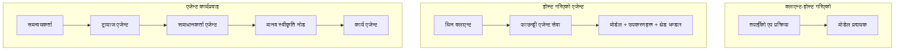
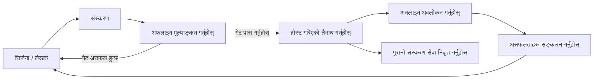
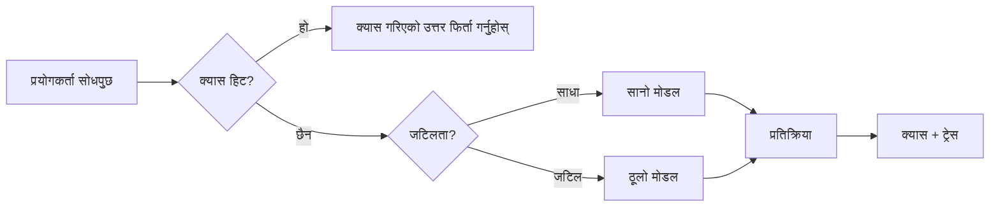
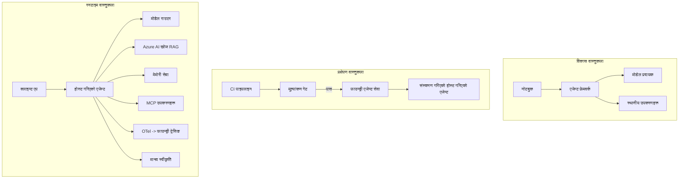

# Microsoft Foundry सँग स्केलेबल एजेन्टहरू डिप्लोय गर्दै


यस कोर्समा अहिलेसम्म तपाईंले एजेन्टहरू निर्माण गर्नुभएको छ जुन तपाईंको ल्यापटपमा, नोटबुक भित्र, `az login` र केही वातावरण चरहरूसँग चल्छ। त्यो सिक्नको लागि बिल्कुल सहि तरिका हो। हजारौं ग्राहकहरू ३ बजे बिहान भर पर्नुपर्ने एजेन्ट चलाउनका लागि त्यो सहि तरिका होइन।

यो पाठ "यो मेरो मेसिनमा काम गर्छ" र "यो उत्पादनमा भरपर्दो र सस्तोमा काम गर्छ" बीचको अन्तरको बारेमा छ। हामी त्यो अन्तरलाई **Microsoft Foundry** र **Microsoft Foundry Agent Service** प्रयोग गरेर बन्द गर्नेछौं, र हामी एक वास्तविक ग्राहक सहायता एजेन्ट निर्माण गरेर गर्नेछौं जससँग उपकरणहरू, पुनःप्राप्ति, स्मृति, मूल्यांकन, र अनुगमन हुन्छ।

## परिचय

यस पाठले समेट्नेछ:

- **प्रोटोटाइप एजेन्ट** र **डिप्लोय गरिएको एजेन्ट** बीचको फरक, र किन संक्रमण लगभग मोडेलको *चारै तर्फ* सम्बन्धित छ।
- एजेन्टहरूको लागि **डिप्लोयमेन्ट ढाँचाहरू**: क्लायन्ट-होस्टेड, सेवा-होस्टेड (होस्टेड एजेन्टहरू), र वर्कफ्लो-अर्केस्ट्रेटेड।
- Microsoft Foundry मा **एजेन्ट जीवनचक्र** — सिर्जना, संस्करण, डिप्लोय, मूल्यांकन, अवलोकन, रिटायर।
- **स्केलिङ रणनीतिहरू**: मोडेल रुटिङ, क्यासिङ, समकक्षता, र स्टेटलेस डिजाइन।
- OpenTelemetry र Foundry ट्रेसिङसँग **स्रोत अवलोकन**।
- मोडेल छनोट, रुटिङ, र मूल्यांकन गेटहरू मार्फत **लागत अनुकूलन**।
- **उद्यम विचारहरू**: शासन, मानवीय अनुमोदन, र MCP सर्भरहरू उत्पादनमा सुरक्षित रूपमा चलाउने।

## सिकाइ लक्ष्यहरू

यस पाठ पूरा गरेपछि, तपाईं जान्नु हुनेछ:

- दिइएको एजेन्ट कार्यभारका लागि सहि डिप्लोयमेन्ट ढाँचा कसरी चयन गर्ने।
- एजेन्टलाई Microsoft Foundry Agent Service मा डिप्लोय कसरी गर्ने ताकि यसले संस्करण, शासन, र अवलोकनयोग्य बन्न सकोस्।
- ट्रेसिङको लागि एजेन्टलाई कसरी उपकरण गर्ने र प्रत्येक रिलिज अघिको मूल्यांकन पाइपलाइन कसरी जडान गर्ने।
- मोडेल रुटिङ र क्यासिङ लागू गरेर कतिको विलम्ब र लागत नियन्त्रणमा राख्ने।
- उच्च जोखिम क्रियाकलाप लागत मानवीय अनुमोदन गेट थप्ने र उत्पादनमा सुरक्षित तरिकाले MCP सर्भर इंटिग्रेट गर्ने।

## पूर्वआवश्यकताहरू

यस पाठले मान्छ कि तपाईले पूर्वका पाठहरू पूरा गर्नुभएको छ र सक्षम हुनुहुन्छ:

- [Microsoft Agent Framework](../14-microsoft-agent-framework/README.md) प्रयोग गरेर एजेन्टहरू बनाउने (पाठ 14)।
- [प्रयोग उपकरण](../04-tool-use/README.md) (पाठ 4) र [Agentic RAG](../05-agentic-rag/README.md) (पाठ 5)।
- [एजेन्ट स्मृति](../13-agent-memory/README.md) (पाठ 13) र [Agentic प्रोटोकलहरू / MCP](../11-agentic-protocols/README.md) (पाठ 11)।
- [अवलोकन र मूल्यांकन](../10-ai-agents-production/README.md) (पाठ 10) — यो पाठ सोझै त्यसमा आधारित छ।

तपाईंले निम्न पनि आवश्यक पर्नेछ:

- कम्तीमा एउटा डिप्लोय गरिएको चैट मोडेल भएको **Azure सदस्यता** र **Microsoft Foundry परियोजना**।
- प्रमाणित गरिएको **Azure CLI** (`az login`)।
- Python 3.12+ र रिपोजिटरीमा रहेको प्याकेजहरू [`requirements.txt`](../../../requirements.txt)।

## प्रोटोटाइपबाट उत्पादनतर्फ: के साँच्चिकै बदलिन्छ

प्रोटोटाइप एजेन्ट र उत्पादन एजेन्ट एउटै कोर लूप साझा गर्छन् — तर्क गर्ने, उपकरण मार्फत कल गर्ने, जवाफ दिने। के बदलिन्छ भने त्यो लूप वरिपरि घेरा भएको सबै कुरा हो। मोडेल सम्भवतः उत्पादन एजेन्टको २०% हो; बाँकी ८०% सञ्चालनात्मक कंकाल हो।

| चिन्ता | प्रोटोटाइप | उत्पादन |
| --- | --- | --- |
| **होस्टिङ** | तपाईंको नोटबुकमा चल्छ | होस्ट गरिएको सेवाको रूपमा चल्छ, संस्करण गरिएको र रोलआउट गरिएको |
| **पहिचान** | तपाईंको `az login` टोकन | प्रबन्धित पहिचान स्कोप गरिएको RBAC संग |
| **राज्य** | इन-मेमोरी, पुनः सुरुमा हराउँछ | बाह्यीकृत (थ्रेड स्टोर, स्मृति सेवा) |
| **असफलता** | तपाईं ट्रेसब्याक हेर्नुहुन्छ | पुन: प्रयास, फलब्याक, डेड-लेटर, सर्तकता |
| **लागत** | "केही सेन्स हो" | अनुरोधप्रति ट्रयाक गरिएको, रुट गरिएको, क्यास गरिएको, बजेट गरिएको |
| **गुणस्तर** | तपाईंले आउटपुट हेर्नुहुन्छ | प्रत्येक रिलिज अघिको स्वतः मूल्यांकन गरिएको |
| **विश्वास** | हरेक कार्यको तपाईंले अनुमोदन गर्नुहुन्छ | नीतिसँग + जोखिमपूर्ण क्रियाकलापहरूमा मानवीय-इन-द-लूप |

यो तालिका ध्यानमा राख्नुहोस्। तलका प्रत्येक खण्ड यी पङ्तिहरूमध्ये एकसँग मेल खान्छ।

## एजेन्ट डिप्लोयमेन्ट ढाँचाहरू

तीनवटा ढाँचाहरू छन् जुन तपाईंले प्रायः संयोजनमा प्रयोग गर्नुहुनेछ।

### १. क्लायन्ट-होस्टेड एजेन्टहरू

एजेन्ट वस्तु *तपाईंको* एप्लिकेसन प्रक्रियाभित्र बाँच्छ। तपाईंको कोडले मोडेल प्रदायकलाई सिधा कल गर्दछ; तर्क लूप तपाईंको सेवामा चल्छ। यो नै हरेक अघिल्लो पाठले गरेको छ।

- **यसको प्रयोग गर्नुहोस् जब** तपाईंलाई लूपमा पूर्ण नियन्त्रण, कस्टम मिडलवेयर आवश्यक हो वा एजेन्टलाई पहिलेको ब्याकएन्डमा समावेश गर्दै हुनुहुन्छ।
- **ट्रेड-अफ**: स्केलिङ, अवस्था, र लचिलोपन आफैंको जिम्मा तपाईंले लिनुहुन्छ।

### २. होस्टेड एजेन्टहरू (Foundry Agent सेवा)

एजेन्ट Microsoft Foundry मा *स्रोतको रूपमा दर्ता गरिएको* हुन्छ। Foundryले तर्क लूप होस्ट गर्छ, थ्रेडहरू भण्डारण गर्छ, सामग्री सुरक्षा र RBAC लागू गर्छ, र Foundry पोर्टलमा एजेन्टलाई देखिन्छ। तपाईंको एप्लिकेसन एक पातलो क्लायन्ट बन्छ जुन थ्रेडहरू सिर्जना गर्छ र जवाफहरू पढ्छ।

- **यसको प्रयोग गर्नुहोस् जब** टिकाउपन, भित्री अवलोकनयोग्यता, शासन, र कम अपरेशनल सतह क्षेत्र चाहिन्छ।
- **ट्रेड-अफ**: प्रबन्धित रनटाइममा कम स्तरको नियन्त्रण।

### ३. एजेन्ट वर्कफ्लोज़

धेरै एजेन्टहरू (र उपकरणहरू)लाई स्पष्ट नियन्त्रण प्रवाह भएको ग्राफमा संयोजित गरिन्छ — अनुक्रमिक चरणहरू, शाखा, मानवीय अनुमोदन नोडहरू, र टिकाउ चेकपोइन्टहरू जुन रोक्न र फेरि सुरु गर्न सकिन्छ। यो Microsoft Agent Framework को **वर्कफ्लोज़** क्षमता हो जुन डिप्लोयमेन्ट स्केलमा लागू हुन्छ।

- **यसको प्रयोग गर्नुहोस् जब** एउटै कार्य केही विशेष एजेन्टहरू वा बीचमा अनुमोदन चरण चाहिन्छ।
- **ट्रेड-अफ**: धेरै चल्ने भागहरू; अर्गेस्ट्रेशन-स्तरको अवलोकनयोग्यता आवश्यक।



## Microsoft Foundry मा एजेन्ट जीवनचक्र

एजेन्ट डिप्लोय गर्नु एक पटकको `पुष` होइन। यो एक लूप हो, र यो सफ्टवेयर रिलिज साइकल जस्तै देखिन्छ किनकि यो नै हो।



प्रमुख विचार, [पाठ 10](../10-ai-agents-production/README.md) बाट लिइएको: **अफलाइन मूल्यांकन गेट हो, पछिको विचार होइन।** नयाँ एजेन्ट संस्करण तपाईंको मूल्यांकन थ्रेसहोल्ड पार नगरेसम्म पठाइँदैन। अनलाइन अवलोकनले वास्तविक विश्वका असफलताहरूलाई तपाईंको अफलाइन परीक्षण सेटमा फर्काउँछ। त्यो नै सम्पूर्ण लूप हो।

## स्केलिङ रणनीतिहरू

एजेन्ट स्केलिङ स्टेटलेस वेब API स्केलिङ भन्दा फरक हुन्छ, किनकि हरेक अनुरोधले धेरै महँगो मोडेल र उपकरण कल ट्रिगर गर्न सक्छ। चार प्रविधिहरूले अधिकांश लोड बोक्छ।

**स्टेटलेस अनुरोध ह्यान्डलिङ।** तपाईंको मेमोरीमा प्रत्येक प्रयोगकर्ताको अवस्था नबनाउनुहोस्। Foundry थ्रेड स्टोर वा स्मृति सेवामा संवाद थ्रेडहरू सुरक्षित गर्नुहोस् ताकि कुनै पनि उदाहरणले कोई पनि अनुरोध ह्यान्डल गर्न सकोस्। यसले तपाईंलाई तेर्सो रूपमा स्केल गर्न अनुमति दिन्छ — उदाहरणहरू थप्नुहोस्, स्टिकी सत्रहरू छैनन्।

**मोडेल रुटिङ।** हरेक अनुरोधलाई तपाईंको सबैभन्दा सक्षम (र सबैभन्दा महँगो) मोडेल चाहिदैन। सरल अनुरोधहरू — आशय वर्गीकरण, छोटो तथ्यात्मक उत्तरहरू — सानो, छिटो मोडेललाई रुट गर्नुहोस्, र ठूलो मोडेल जटिल तर्कका लागि राख्नुहोस्। Foundry को **मोडेल राउटर** तपाईंका लागि यो गर्न सक्छ, वा तपाईंले हल्का वर्गीकार्इर आफैं बनाउनुहोस्। तपाईंले ल्याबमा DIY संस्करण बनाउनु हुनेछ।

**जवाफ क्यासिङ।** धेरै समर्थन प्रश्नहरू लगभग एकै प्रकारका हुन्छन् ("मेरो पासवर्ड कसरी रिसेट गर्ने?")। सामान्य प्रश्नहरूको उत्तरहरू क्यास गर्नुहोस् र मोडेलमा ठेस पुर्‍याउनु नपर्ने गरी सेवा गर्नुहोस्। एक मामूली क्यास हिट दरले पनि लागत र विलम्बमा अर्थपूर्ण कटौती गर्छ।

**समकक्षता र ब्याकप्रेसर।** मोडेल प्रदायकहरूसँग दर सीमा हुन्छ। तपाईंको समकक्षता सीमित गर्नुहोस्, एक्स्पोनेन्सियल ब्याकअफ सहित पुन: प्रयासहरू प्रयोग गर्नुहोस्, र सौम्य रूपमा असफल हुनुहोस् (पंक्तिबद्ध "हामी यसमा छौं" जवाफ ५०० भन्दा राम्रो हुन्छ)।



## उत्पादनमा अवलोकनयोग्यता

तपाईं देख्न नसक्ने कुरालाई सञ्चालित गर्न सक्नुहुन्न। पाठ 10 मा वर्णन गरेजस्तै, Microsoft Agent Framework ले **OpenTelemetry** ट्रेसहरू स्वाभाविक रूपमा उत्सर्जन गर्छ — हरेक मोडेल कल, उपकरण आह्वान, र अर्गेस्ट्रेशन चरणले एक स्पान बन्छ। उत्पादनमा ती स्पानहरू Microsoft Foundry (वा कुनै पनि OTel-अनुकूल ब्याकएन्ड) मा निर्यात गर्नुहुन्छ ताकि तपाईंले:

- प्रत्येक ग्राहक गुनासोलाई हरेक मोडेल र उपकरण कलमा अन्त्य-देखि-अन्त सम्म ट्रेस गर्न सक्नुहोस्।
- समयसँगै अनुरोध प्रति p50/p95 विलम्ब र लागत अनुगमन गर्नुहोस्।
- तपाईंका प्रयोगकर्ताहरू (वा तपाईंको वित्त टोली) भन्दा पहिले त्रुटि-दर स्पाइकहरू र लागत असामान्यताहरुमा सतर्कता दिनुहोस्।

```python
from agent_framework.observability import get_tracer

tracer = get_tracer()

with tracer.start_as_current_span("support_request") as span:
    span.set_attribute("customer.tier", "enterprise")
    span.set_attribute("routed.model", "gpt-5-nano")
    # एजेण्टको कार्यान्वयन यो स्प्यान भित्र स्वचालित रूपमा ट्रेस गरिन्छ
```

`customer.tier` र `routed.model` जस्ता विशेषताहरू ट्रेसहरूको पर्खाललाई उत्तरयोग्य प्रश्नहरूमा परिवर्तन गर्छन् ("के उद्यम ग्राहकहरुलाई सानोतिनो मोडेलमा धेरै पटक रुट गरिन्छ?")।

## लागत अनुकूलन

उत्पादन एजेन्टहरूमा लागत टोकनहरूबाट प्रभुत्व राख्छ। प्रभाव अनुसार तीन उपायहरू:

१. **मोडेलको सहि आकार।** सानो मोडेल जुन तपाईंको मूल्यांकन गेट पार गर्छ प्रायः ठूलो मोडेलभन्दा सस्तो हुन्छ जुन पनि पार गर्छ। मूल्यांकन प्रयोग गरेर *सानो मोडेल पर्याप्त छ* भन्ने प्रमाणित गर्नुहोस्, सावधानीका लागि ठूला मोडेलमा स्विच नगर्नुहोस्।
२. **जटिलता अनुसार रुटिङ।** माथि देखाएझैं — ठूलो मोडेल मूल्य तिर्नुहोस् मात्र ती अनुरोधहरूको लागि जुन ठूलो मोडेल तर्क चाहिन्छ।
३. **आक्रमक क्यासिङ।** सबैभन्दा सस्तो मोडेल कल त्यो हो जुन तपाईंले कहिल्यै नगर्नु भयो।

मूल्यांकन गेटहरू र लागत नियन्त्रण दुई तर्फबाट हेर्ने एउटै अनुशासन हुन्: मूल्यांकनले तपाईंलाई *गुणस्तरको आधार* बताउँछ, र रुटिङ र क्यासिङले तपाईंलाई त्यो आधारको *लागत* सँग नजिक राख्छ।

## उद्यम डिप्लोयमेन्ट विचारहरू

**शासन।** होस्टेड एजेन्टहरूले Foundry को RBAC, सामग्री सुरक्षा, र अडिट लगिङ继承 गर्छन्। प्रत्येक एजेन्टलाई आवश्यक न्यूनतम विशेषता भएको प्रबन्धित पहिचान दिनुहोस् — ज्ञान आधारमा मात्र पढ्ने पहुँच, टिकटिङ API मा स्कोप गरिएको पहुँच, र अरू केही होइन।

**मानवीय-इन-द-लूप।** केही क्रियाकलापहरू पूर्ण रूपमा स्वचालित गर्नु असम्भव छ — फिर्ता जारी गर्नु, खाता मेटाउनु, कानुनी टोलीमा बढाउनु। Microsoft Agent Framework ले **अनुमोदन-आवश्यक** उपकरणहरू समर्थन गर्छ: एजेन्टले कार्रवाई प्रस्ताव गर्छ, निष्पादन रोकिन्छ, मान्छेले अनुमोदन वा अस्वीकृत गर्छ, र वर्कफ्लो पुनः सुरु हुन्छ। तपाईंले [पाठ 6](../06-building-trustworthy-agents/README.md) मा यस शैलिका प्रारम्भिक अवस्था देख्नुभयो; यहाँ तपाईंले यसलाई डिप्लोय गर्नुहुनेछ।

**उत्पादनमा MCP।** [MCP](../11-agentic-protocols/README.md) ले तपाईंको एजेन्टलाई मानक इन्टरफेसमार्फत बाह्य उपकरणहरू उपभोग गर्न अनुमति दिन्छ। उत्पादनमा, प्रत्येक MCP सर्भरलाई अविश्वसनीय सीमा मान्नुहोस्: सर्भर संस्करण पिन गर्नुहोस्, स्कोप गरिएको पहिचानसँग चलाउनुहोस्, यसको आउटपुट मान्यता गर्नुहोस्, र कहिल्यै गोप्य सामग्री यसमा दिनु हुँदैन। MCP सर्भर निर्भरता हो, र निर्भरताहरू अपडेट, अडिट, र दर-सीमित गरिन्छन्।



ती तीन चित्रहरू — विकास, डिप्लोयमेन्ट, रनटाइम — एउटै एजेन्टका जीवनका तीन चरणहरू हुन्। तलको ल्याबले तपाईंलाई यसले बनाउने क्रममा लैजान्छ।

## हात-हातमा ल्याब: उत्पादन-तयार ग्राहक सहायता एजेन्ट

खोल्नुहोस् [`code_samples/16-python-agent-framework.ipynb`](./code_samples/16-python-agent-framework.ipynb) र शिरदेखि पुच्छरसम्म कार्य गर्नुहोस्। तपाईंले प्रत्येक उत्पादन चिन्ता जडान गरिएको **Contoso ग्राहक सहायता एजेन्ट** सङ्गठन गर्नु हुनेछ:

१. **उपकरण कलिङ** — अर्डर स्थिति हेर्नुहोस् र समर्थन टिकटहरू खोल्नुहोस्।
२. **RAG** — नीतिगत प्रश्नहरू उत्तर दिनुहोस् ज्ञान आधारबाट (Azure AI Search, मेमोरीमा फालब्याकसहित ताकि नोटबुकले कुनै खोज स्रोत बिना चलोस्)।
३. **स्मृति** — कुराकानीका मोडमा ग्राहकलाई सम्झनुहोस्।
४. **मोडेल रुटिङ** — एक जटिलता वर्गीकार्ले प्रत्येक अनुरोधलाई सानो वा ठूलो मोडेलमा रुट गर्दछ।
५. **जवाफ क्यासिङ** — बारम्बार प्रश्नहरू क्यासबाट सेवा गरिन्छ।
६. **मानवीय अनुमोदन** — थ्रेसहोल्डभन्दा माथिका फिर्ताहरू मानवीय स्वीकृतिका लागि रोकिन्छ।
७. **मूल्यांकन पाइपलाइन** — सानो अफलाइन परीक्षण सेटले एजेन्ट स्कोर गर्छ र रिलिज गेटको रूपमा काम गर्छ।
८. **अवलोकनयोग्यता** — हरेक अनुरोधको वरिपरि OpenTelemetry ट्रेसिङ।

### व्यवस्थित कार्यप्रवाह

नोटबुक यसरी व्यवस्थित गरिएको छ कि प्रत्येक उत्पादन चिन्ता स्वतन्त्र, चलाउन योग्य खण्ड हो। यसको मुटु हो रुटिङ-प्लस-क्यासिङ अनुरोध ह्यान्डलर:

```python
async def handle_support_request(query: str, customer_id: str) -> str:
    # 1. सकेसम्म क्यासबाट सेवा दिनुहोस्।
    cached = response_cache.get(normalize(query))
    if cached:
        return cached

    # 2. लागत नियन्त्रण गर्न जटिलताले मार्गनिर्देशन गर्नुहोस्।
    model = "gpt-5-nano" if is_simple(query) else "gpt-5-mini"

    # 3. अवलोकनक्षमता को लागि एजेन्टलाई ट्रेस स्प्यान भित्र चलाउनुहोस्।
    with tracer.start_as_current_span("support_request") as span:
        span.set_attribute("routed.model", model)
        span.set_attribute("customer.id", customer_id)
        response = await support_agent.run(query, model=model)

    # 4. क्यास गर्नुहोस् र फर्काउनुहोस्।
    response_cache.set(normalize(query), response.text)
    return response.text
```

रिलिजको रक्षा गर्ने मूल्यांकन गेट यसरी देखिन्छ:

```python
async def evaluation_gate(agent, test_cases, threshold: float = 0.8) -> bool:
    passed = 0
    for case in test_cases:
        result = await agent.run(case["input"])
        if score_response(result.text, case["expected"]) >= 0.8:
            passed += 1
    pass_rate = passed / len(test_cases)
    print(f"Evaluation pass rate: {pass_rate:.0%} (gate: {threshold:.0%})")
    return pass_rate >= threshold  # गेट पास भए मात्र मात्र परिनियोजन गर्नुहोस्
```

हरेक लाइन पढ्नुहोस् — नोटबुकले प्रारम्भिक अवस्थालाई जानाजानी सानो राख्छ ताकि कुनै कुरा फ्रेमवर्क कल पछाडि लुकिएको नहोस्।

## डिप्लोय गरिएको एजेन्टलाई स्मोक टेस्टहरूसँग मान्यकरण गर्नुहोस्

माथिको मूल्यांकन गेटले तपाईंको एजेन्ट वस्तु विरुद्ध *अफलाइन* चल्छ। एक पटक एजेन्ट होस्टेड एजेन्टको रूपमा डिप्लोय भएपछि, तपाईंलाई थप एक, अझ सस्तो जाँच चाहिन्छ: **के डिप्लोय गरिएको अन्त बिन्दु साँच्चिकै उत्तर दिइरहेको छ?**

"सफलतापूर्वक" डिप्लोय गर्दा मात्र नियन्त्रण विमानले परिभाषा स्वीकार गरेको प्रमाणित हुन्छ — एजेन्टले जवाफ दिन्छ भन्ने होइन। छुटेको निर्भरता, खराब मोडेल रुटिङ, वा समयावधि समाप्त कनेक्शनले केही नदिनेलाई पनि हरियो डिप्लोयमेन्टमा राख्न सक्छ। **स्मोक टेस्ट**ले त्यो केही सेकेण्डमा, हरेक डिप्लोयमा, पूर्ण मूल्यांकनको लागत बिना समात्छ।

यो रिपोजिटरीले [AI स्मोक टेस्ट](https://github.com/marketplace/actions/ai-smoke-test) GitHub कार्यमा आधारित तयार-प्रयोग स्मोक-टेस्ट पाइपलाइन समेट्छ:

- **सूची** — [`tests/lesson-16-smoke-tests.json`](../../../tests/lesson-16-smoke-tests.json) मा Contoso समर्थन एजेन्टका लागि प्रोम्प्टहरू र दावीहरू समावेश छन् (स्थिर नीतिगत जवाबहरू, अर्डर खोज, विषयमा रहिरहनु, र बहु-मोड संवाद निरन्तरता)। अन्य पाठका एजेन्टहरूको सूची यससँगै राखिएको छ — हेर्नुहोस् [`tests/README.md`](../tests/README.md)।
- **वर्कफ्लो** — [`.github/workflows/smoke-test.yml`](../../../.github/workflows/smoke-test.yml) Azure OIDC सँग लगइन गर्छ र प्रत्येक प्रोम्प्टलाई एजेन्टको Responses अन्तबिन्दुमा POST गर्छ, कुनै दावी असफल भए जागिर असफल पार्दछ।

```yaml
- name: Smoke-test hosted agent
  uses: JFolberth/ai-smoketest@v1
  with:
    project_endpoint: ${{ inputs.project_endpoint }}
    agent_name: ContosoSupportAgent
    tests_file: tests/lesson-16-smoke-tests.json
```


एउटा एजेण्ट तैनाथ भएपछि, यसको Foundry प्रोजेक्ट अन्त बिन्दु र एजेण्ट नाम उपलब्ध गराउँदै **Actions** ट्याबबाट यसलाई चलाउनुहोस्। संघीय पहिचानले Foundry प्रोजेक्ट स्कोपमा **Azure AI User** भूमिका आवश्यक पर्छ। तहहरूलाई पिरामिडको रूपमा सोच्नुहोस्: धुवाँ परीक्षणहरू (पुग्न मिल्छ र प्रतिक्रिया दिन्छ?) प्रत्येक तैनातीमा चलाइन्छ, अफलाइन मूल्यांकन (परिबहनका लागि पर्याप्त छ?) पदोन्नती हुनु अघि चलाइन्छ, र अनलाइन मूल्यांकन (जङ्गलमा कस्तो गर्दैछ?) लगातार चलाइन्छ।

## ज्ञान जाँच

असाइनमेन्टमा जानु अघि आफ्नो बुझाइ परीक्षण गर्नुहोस्।

**१. उत्पादन एजेण्टको "मोडेल" कति भाग हो, र बाँकी के हो?**

<details>
<summary>उत्तर</summary>

मोडेल प्रणालीको अलि सानो हिस्सा हो — प्रायः लगभग २०% को रूपमा भनिन्छ। बाँकी अपरेशनल कंकाल हो: होस्टिङ र भर्सनिङ, पहिचान र RBAC, बाह्य स्थिति, असफलता व्यवस्थापन, लागत ट्र्याकिङ, मूल्यांकन, र मानव-मध्यस्थ नियन्त्रण। उत्पादनमा जाने मुख्य कुरा तर्कचक्रको चारै तर्फको सबै कुरा बनाउनु हो।
</details>

**२. तपाईं कहिल्यै क्लाइन्ट-होस्ट गरिएको एजेण्टको सट्टा Hosted Agent छनौट गर्नुहुन्छ?**

<details>
<summary>उत्तर</summary>

जब तपाईं स्थायी (रिजुम गर्न सक्ने थ्रेडहरूसहित) प्रबन्धित रनटाइम, अवलोकनयोग्यता, सामग्री सुरक्षा, र RBAC चाहनुहुन्छ, र reasoning loop को केही कम-स्तरीय नियन्त्रण साटासाट गरेर कम अपरेशनल सतह इलाकाको लागि तयार हुनुहुन्छ। क्लाइन्ट-होस्ट गरिएको जब उपयुक्त हुन्छ जब तपाईंलाई reasoning loop पूरा नियन्त्रण चाहिन्छ वा एजेण्टलाई पहिलेको ब्याकएन्डमा एम्बेड गर्नुपर्छ।
</details>

**३. किन एउटा स्केलेबल एजेण्टले आफ्नै प्रक्रिया सम्झनामा स्टेटलेस हुनुपर्छ?**

<details>
<summary>उत्तर</summary>

ताकि कुनै पनि उदाहरणले कुनै पनि अनुरोध सम्भाल्न सकोस्, जुनले स्टिकी सेसन बिना तिरछो स्केलिङ अनुमति दिन्छ। प्रयोगकर्ताको संवाद अवस्था थ्रेड स्टोर वा मेमोरी सेवामा बाह्यीकृत हुन्छ। यदि अवस्था प्रक्रिया सम्झनामा बस्दथ्यो भने, पुनःसुरु गर्दा त्यसलाई गुमाउने थियो र लोड स्वतन्त्र रूपमा वितरण गर्न सकिन्न।
</details>

**४. मोडल राउटिङले कुन समस्या समाधान गर्छ, र यसको मूल्यांकनसँग सम्बन्ध के हो?**

<details>
<summary>उत्तर</summary>

राउटिङले साना, सस्तो, छिटो मोडेललाई सरल अनुरोधहरू पठाउँछ र ठूलो मोडेललाई वास्तविक reasoning का लागि आरक्षित गर्छ, जसले ढिलाइ र लागत दुवैलाई नियन्त्रण गर्छ। यो मूल्यांकनसँग सम्बन्धित छ किनभने मूल्यांकनले प्रमाणित गर्छ कि सानो मोडेल केही अनुरोधहरूको लागि पर्याप्त छ — मूल्यांकन बिना राउटिङ भने अनुमान मात्र हो।
</details>

**५. "मूल्यांकन गेट" के हो र यो जीवनचक्रको स्थितिमा कहाँ हुन्छ?**

<details>
<summary>उत्तर</summary>

मूल्यांकन गेटले नयाँ एजेण्ट भर्सन विरुद्ध अफलाइन परीक्षण सेट चलाउंछ र पास दर थ्रेसहोल्ड पार नगरेसम्म परिचालन रोक्छ। यसले जीवनचक्रमा "भर्सन" र "तैनाती" को बीचमा बस्छ, गुणवत्ता रिलिजको पूर्व अवस्था बनाउँछ, र शिपिंग पछि जाँच्ने कुरा होइन।
</details>

**६. किन MCP सर्भरलाई उत्पादनमा अविश्वसनीय सीमाको रूपमा हेर्नुपर्छ?**

<details>
<summary>उत्तर</summary>

किनकि त्यो तपाईंको एजेण्टले कल गर्ने बाह्य निर्भरता हो। तपाईंले यसको भर्सन पिन गर्नु पर्छ, स्कोप गरिएको पहिचानसहित चलाउनु पर्छ, यसको उत्पादनहरूलाई मान्य गर्नु पर्छ, दर-सीमा लगाउनु पर्छ, र यसलाई गोप्य जानकारी कहिल्यै नदेखाउनु पर्छ — जुनसुकै तेस्रो-पक्ष निर्भरतामा लागु गरिने अनुशासन हो। यसको उत्पादनहरू तपाईंको एजेण्टको reasoning मा जान्छन्, त्यसैले बिना मान्य पारिएको विश्वास सुरक्षा जोखिम हो।
</details>

**७. उत्पादन एजेण्ट लागतमा सबैभन्दा ठूलो प्रभाव पार्ने एकल परिवर्तन प्रायः के हो, र किन?**

<details>
<summary>उत्तर</summary>

मोडेललाई सही आकार दिनु — तपाईंको मूल्यांकन गेट पार गर्ने सानो मोडेल प्रयोग गर्नु। लागत टोकन्सले प्रभुत्व गर्छ, र गुणस्तर मापन पूरा गर्ने सानो मोडेल प्रायः ठूलो मोडेलको भन्दा सस्तो हुन्छ। क्यासिङ र राउटिङले थप लागत घटाउँछन्, तर उपयुक्त आधार मोडेल छान्नु सबैभन्दा ठूलो पहिलो-क्रम प्रभाव हो।
</details>

**८. `customer.tier` र `routed.model` जस्ता स्पान गुणहरूले अवलोकनयोग्यतामा के भूमिका खेल्छन्?**

<details>
<summary>उत्तर</summary>

तिनीहरूले कच्चा ट्रेसहरूलाई जवाफ दिने व्यवसायिक प्रश्नहरूमा परिणत गर्छन्। गुणहरू बिना तपाईंलाई स्पानको पर्खाल हुनेछ; गुणहरूसँग तपाईं सोध्न सक्नुहुन्छ "के एन्त्रप्राइज ग्राहकहरूलाई धेरै पटक सानो मोडेलमा राउट गरिँदैछ?" वा "कुन मोडेल हाम्रो सबैभन्दा स्लो अनुरोधहरू सम्हाल्छ?" गुणहरूले तपाईंको अपरेशनलाई महत्त्वपूर्ण आयामहरू अनुसार टेलिमेट्री टुक्र्याउँछन्।
</details>

## असाइनमेन्ट

प्रायोगशालाबाट ग्राहक समर्थन एजेण्ट लिएर यसलाई विशेष परिदृश्यका लागि कडाइ गर्नुहोस्: **एक SaaS कम्पनीको सदस्यता बिलिङ समर्थन एजेण्ट।**

तपाईंको बुझाइले:

१. **उपकरणहरूलाई बिलिङ-सङ्ग सम्बन्धितमा परिवर्तन गर्नुहोस्:** `get_subscription_status`, `get_invoice`, र `issue_credit` (५० डलर भन्दा माथिको क्रेडिटहरूलाई मानवीय स्वीकृति आवश्यक पर्छ)।
२. **तीन RAG दस्तावेजहरू थप्नुहोस्** जसले कम्पनीको रिफण्ड नीति, बिलिङ चक्र, र रद्द गर्ने नीति समेट्छ।
३. **मूल्यांकन सेटलाई आठ केससम्म विस्तार गर्नुहोस्,** जसमा कम्तिमा दुईले मानवीय-स्वीकृति पथ ट्रिगर गर्नुपर्छ, र तपाईंको मूल्यांकन गेट सही पास वा फेल गर्छ पुष्टि गर्नुहोस्।
४. **एउटा लागत रिपोर्ट थप्नुहोस्:** एजेण्टमार्फत मिश्रित दश प्रश्न चलाएपछि, कति साना मोडेलमा गएका, कति ठूलो मोडेलमा गएका, र कति क्यासबाट सेवा गरियो प्रिन्ट गर्नुहोस्।

एक छोटो अनुच्छेद लेख्नुहोस् (मार्कडाउन कक्षमा) जुन मोडेल-राउटिङ नियम तपाईंले छनौट गर्नुभएको हो र तपाईं यसलाई वास्तविक ट्राफिकसँग कसरी मान्य गर्नुहुन्छ। कुनै एक मात्र सही उत्तर छैन — तपाईंलाई मूल्याङ्कन गरिनेछ कि उत्पादनका चिन्ताहरू सुसंगत रूपमा जोडिएका छन् कि छैन।

## सारांश

यस पाठमा तपाईंले एउटा एजेण्टलाई Micosoft Foundry मार्फत प्रोटोटाइपबाट उत्पादनमा सार्नुभयो:

- उत्पादनमा जाने कदम मुख्यतया मोडेलको चारैतिरको **अपरेशनल कंकाल** को बारेमा हुन्छ — होस्टिङ, पहिचान, अवस्था, असफलता व्यवस्थापन, लागत, गुणस्तर, र विश्वास।
- तपाईंले तीनवटा **तैनाती ढाँचाहरू** सिक्नुभयो — क्लाइन्ट-होस्ट गरिएको, Hosted Agents, र Agent Workflows — र कुन कहिले लागू हुन्छ।
- तपाईंले **एजेण्ट जीवनचक्र** को यात्रा गर्नुभयो, जहाँ अफलाइन **मूल्यांकन रिलीज गेटको रूपमा काम गर्छ** र अनलाइन अवलोकनयोग्यताले असफलता फेरि परीक्षण सेटमा फिर्ता दिन्छ।
- तपाईंले **स्केलिङ रणनीतिहरू** लागू गर्नुभयो — स्टेटलेस डिजाइन, मोडेल राउटिङ, क्यासिङ, र सिमित समसामयिकता — र तिनीहरूलाई **लागत optimisation** सँग जोड्नुभयो।
- तपाईंले **उद्यम नियन्त्रणहरू** जडान गर्नुभयो: RBAC, मानव-मध्यस्थ स्वीकृति, र उत्पादन-सुरक्षित MCP एकीकरण।
- तपाईंले एक **उत्पादन-तयार ग्राहक समर्थन एजेण्ट** निर्माण गर्नुभयो जसले यी सबै चिन्ताहरूलाई चलाउन योग्य कोडमा बाँध्छ।

अर्को पाठ विपरित यात्रा लिन्छ: एजेण्टहरूलाई बादलमा विस्तार गर्नुको सट्टा तपाईंले तिनीहरूलाई एकल विकासकर्ता मेसिनमा ल्याएर पूर्ण स्थानीय रूपमा चलाउनु हुनेछ।

## थप स्रोतहरू

- <a href="https://learn.microsoft.com/azure/ai-foundry/what-is-azure-ai-foundry" target="_blank">Microsoft Foundry प्रलेखन</a>
- <a href="https://learn.microsoft.com/azure/ai-foundry/agents/overview" target="_blank">Microsoft Foundry Agent सेवा अवलोकन</a>
- <a href="https://learn.microsoft.com/en-us/agent-framework/overview/?wt.mc_id=youtube_26688_organicsocial_reactor&pivots=programming-language-python" target="_blank">Microsoft Agent Framework</a>
- <a href="https://learn.microsoft.com/azure/ai-foundry/concepts/model-router" target="_blank">Microsoft Foundry मा Model Router</a>
- <a href="https://learn.microsoft.com/azure/search/search-what-is-azure-search" target="_blank">Azure AI Search</a>
- <a href="https://opentelemetry.io/" target="_blank">OpenTelemetry</a>
- <a href="https://github.com/marketplace/actions/ai-smoke-test" target="_blank">AI Smoke Test GitHub Action</a>
- <a href="https://modelcontextprotocol.io/" target="_blank">Model Context Protocol (MCP)</a>

## अघिल्लो पाठ

[कम्प्युटर प्रयोग एजेण्टहरू निर्माण गर्दै (CUA)](../15-browser-use/README.md)

## अर्को पाठ

[स्थानीय AI एजेण्टहरू सिर्जना गर्दै](../17-creating-local-ai-agents/README.md)

---

<!-- CO-OP TRANSLATOR DISCLAIMER START -->
**अस्वीकरण**:
यो दस्तावेज़ AI अनुवाद सेवा [Co-op Translator](https://github.com/Azure/co-op-translator) प्रयोग गरेर अनुवाद गरिएको हो। हामी सही हुन प्रयास गर्छौं, तर कृपया जानकार हुनुस् कि स्वचालित अनुवादमा त्रुटिहरू वा अशुद्धताहरू हुन सक्छन्। मूल दस्तावेज़ यसको मूल भाषामा आधिकारिक स्रोत मानिनुपर्छ। महत्वपूर्ण जानकारीका लागि व्यावसायिक मानव अनुवाद सिफारिस गरिन्छ। यस अनुवादको प्रयोगबाट उत्पन्न कुनै पनि गलत बुझाइ वा त्रुटिको लागि हामी जिम्मेवार छैनौं।
<!-- CO-OP TRANSLATOR DISCLAIMER END -->