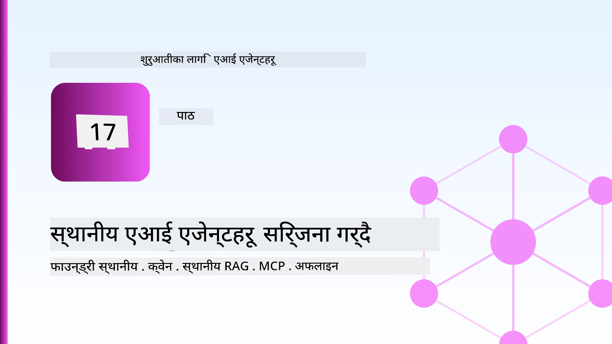
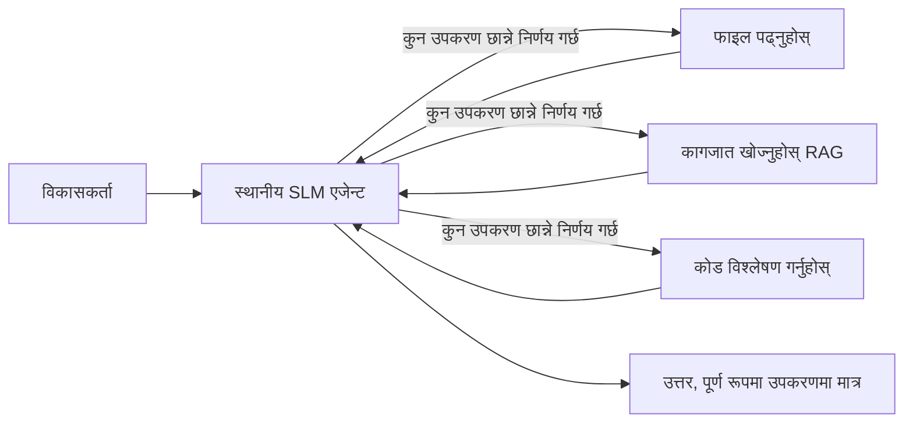
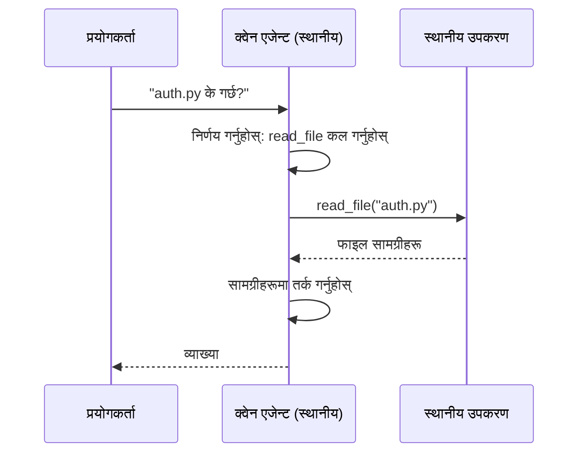
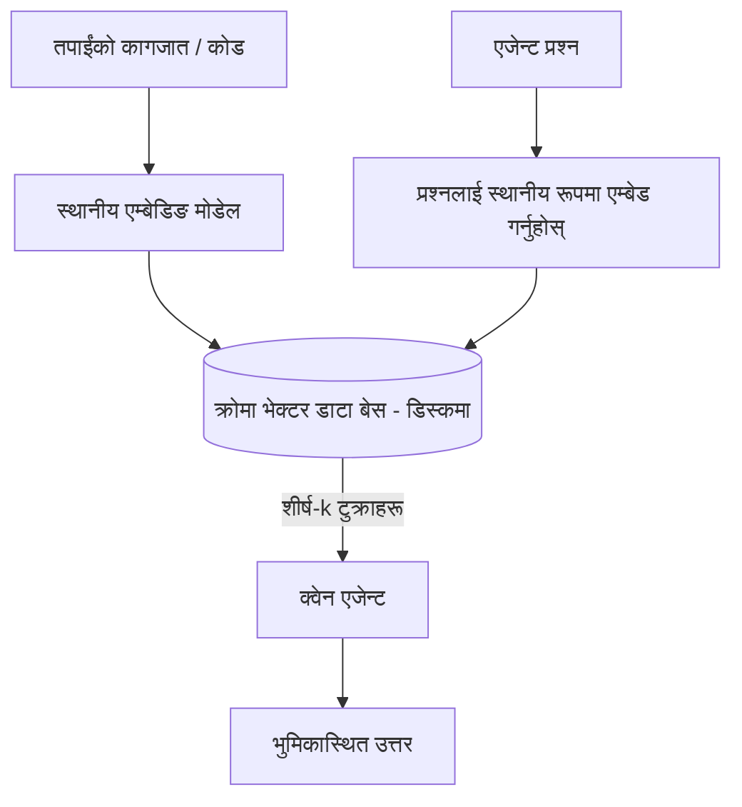
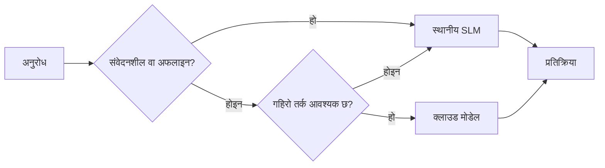

# Microsoft Foundry Local र Qwen प्रयोग गरी स्थानीय AI एजेन्टहरू सिर्जना गर्दै



अघिल्लो पाठले एजेन्टहरूलाई क्लाउडमा *माथि* बढायो। यो एकले तिनीहरूलाई एकल मेसिनमा *तल* ल्याउँछ। अन्त्यसम्म तपाईंसँग काम गर्ने इन्जिनियरिङ सहायक हुनेछ जुन तर्क गर्छ, उपकरणहरूलाई कल गर्छ, तपाईंका फाइलहरू पढ्छ, र तपाईंको कागजात खोज्छ — **एउटा पनि क्लाउड इन्फरेन्स कल बिना।**

किन तपाईंले त्यो चाहनुहुन्छ? वास्तविक इन्जिनियरिङ काममा लगातार आउने तीन कारणहरू हुन्:

- **गोपनीयता।** कोड र कागजातहरू कहिल्यै मेसिन छोड्दैनन्। कुनै प्रम्प्ट, कुनै टुक्रा, कुनै ग्राहक डाटा नेटवर्क सीमाना नाघ्दैन।
- **लागत।** स्थानीय इन्फरेन्समा प्रति-टोकन बिल छैन। तपाईं विद्युतीय मूल्यमा दिनभरि पुनरावृत्ति गर्न सक्नुहुन्छ।
- **अफलाइन।** विमानमा, सुरक्षित स्थलमा, वा आउटेजको समयमा पनि एजेन्ट काम गर्छ।

समस्या के छ भने तपाईं एक अग्रगामी क्लाउड मोडेलको सट्टा तपाईंको CPU, GPU, वा NPU मा चल्ने **सानो भाषा मोडेल (SLM)** को लागि व्यापार गर्दै हुनुहुन्छ। यो पाठ एजेन्टहरू निर्माण गर्ने बारे हो जुन त्यो सीमा भित्र *राम्रो* छ, सीमालाई नहुने झैं व्यवहार नगरी।

## परिचय

यो पाठले समेट्नेछ:

- **सानो भाषा मोडेलहरू (SLMs)** — के हुन्, कहाँ राम्रो छन्, र कहाँ राम्रा छैनन्।
- **Microsoft Foundry Local** — हार्डवेयरमा मोडेलहरू डाउनलोड र सेवा गर्ने रनटाइम, जसले **OpenAI-संगत API** मार्फत काम गर्छ।
- **Qwen function-calling मोडेलहरू** — उपकरण कलहरू विश्वसनीय रूपमा उत्पादन गर्ने SLMहरू, जसले स्थानीय *एजेन्टहरू* (सिर्फ स्थानीय च्याट होइन) सम्भव बनाउँछ।
- **स्थानीय उपकरणहरू, स्थानीय RAG, र स्थानीय MCP** — क्लाउड बिना एजेन्टलाई क्षमता दिने।
- **हाइब्रिड ढाँचाहरू** — कहिले कुरा स्थानीय राख्ने र कहिले क्लाउडको सहारा लिने भन्ने।

## सिकाइ लक्ष्यहरू

यो पाठ सकिएपछि, तपाईं जान्नुहुनेछ कसरी:

- SLMहरूको ट्रेड-अफहरू व्याख्या गर्ने र उपयुक्त स्थानीय एजेन्ट प्रयोग केसहरू छान्ने।
- Foundry Local मार्फत Qwen मोडेल स्थानीय रूपमा सेवा गर्ने र OpenAI-संगत अन्तबिन्दुसम्म जडान गर्ने।
- तपाईंको कार्यस्थलमा पूर्ण रूपमा चल्ने उपकरण-कल गर्ने एजेन्ट बनाउने।
- स्थानीय भेक्टर डाटाबेस (Chroma) प्रयोग गरी आफ्नै कागजातहरूमा स्थानीय RAG थप्ने।
- एजेन्टलाई स्थानीय MCP सर्भरसँग जडान गर्ने र हाइब्रिड स्थानीय/क्लाउड डिजाइनहरूमा तर्क गर्ने।

## पूर्वापेक्षाहरू

यो पाठले तपाईंले अघिल्लो पाठहरू सम्पन्न गरिसकेको रमा बुझ्ने आशा गर्दछ:

- [टूल प्रयोग](../04-tool-use/README.md) (पाठ ४) र [Agentic RAG](../05-agentic-rag/README.md) (पाठ ५)।
- [Agentic प्रोटोकलहरू / MCP](../11-agentic-protocols/README.md) (पाठ ११)।
- [Microsoft Agent Framework](../14-microsoft-agent-framework/README.md) (पाठ १४)।

तपाईंलाई यी पनि चाहिन्छ:

- विकासकर्ता कार्यस्थल। **८ GB RAM यथार्थ परिमाणको न्यूनतम हो**; १६ GB+ आरामदायक हुन्छ। GPU वा NPU सहयोगी हुन्छ तर आवश्यक छैन।
- **Microsoft Foundry Local** इन्स्टल गरिएको (तल सेटअप सेसन हेर्नुहोस्)।
- Python 3.12+ र रेष्टपोमा रहेका प्याकेजहरू [`requirements.txt`](../../../requirements.txt), साथै `foundry-local-sdk`, `openai`, र `chromadb` यस पाठको लागि।

## सानो भाषा मोडेलहरू: स्थानीय कामका लागि सहि उपकरण

एउटा अग्रगामी क्लाउड मोडेलसित सयौं अर्बौं प्यारामिटर र डाटासेन्टर हुन्छ। SLMसँग केही अर्ब प्यारामिटर हुन्छ र तपाईको ल्यापटपको RAM मा फिट हुनुपर्छ। त्यो भिन्नताले स्पष्ट अपेक्षाहरू तोक्छ।

**SLM राम्रो गर्छन्:**

- संरचित, सीमित कार्यहरू — वर्गीकरण, निकासी, परिचित कागजातको सारांश।
- **उपकरण कल** — कुन फंक्शन कल गर्ने र कुन अर्गुमेन्टसहित निर्णय गर्ने।
- तीव्र, सस्तो, निजी पुनरावृत्ति आफ्नै डेटा मा।

**SLM कमजोर हुन्छन्:**

- खुला, बहु-कदम तर्क विस्तृत सन्दर्भभरि।
- व्यापक विश्व ज्ञान (कम देखेका छन्, र बढी भुल्ने गर्छन्)।

यसैले स्थानीय एजेन्टहरूका लागि विजयी रणनीति हो: **SLM ले व्यवस्थापन गर्‍योस्, उपकरणहरूले भारी काम गरून्।** मोडेलले तपाईंको कोडबेसलाई *जान्न* आवश्यक छैन — यसले `read_file` र `search_docs` कल कहिले गर्ने थाहा पाउनुपर्छ। त्यो SLM का बलियो पक्षहरूसँग सीधै मेल खान्छ।



## Microsoft Foundry Local

**Microsoft Foundry Local** हल्का रनटाइम हो जुन तपाईंको मेसिनमै मोडेलहरू डाउनलोड, व्यवस्थापन, र सेवा गर्छ। हाम्रो लागि सबैभन्दा महत्वपूर्ण सुविधा यसको **OpenAI-संगत HTTP अन्तबिन्दु** हो — जसले अर्थ हुन्छ OpenAI SDK र Microsoft Agent Framework को OpenAI क्लाइन्ट यसलाई मात्र `base_url` परिवर्तन गरेर उपयोग गर्न सक्छन्। एजेन्ट निर्माण बारे तपाईले सिकेका सबै कुरा सिधै लागु हुन्छ; केवल अन्तबिन्दु क्लाउडबाट `localhost` तिर जान्छ।

Foundry Local ले तपाईंको हार्डवेयरका लागि मोडेलको सर्वोत्तम बिल्ड— CPU बिल्ड, CUDA/GPU बिल्ड, वा NPU बिल्ड—स्वचालित रूपमा छनौट गर्छ — यसले तपाईंलाई प्रति मेसिन अनुकूलन नगर्न दिन्छ।

### सेटअप

Foundry Local इन्स्टल गर्नुहोस् (आफ्नो OS को लागि [डकुमेन्टेशन](https://learn.microsoft.com/azure/ai-foundry/foundry-local/) हेर्नुहोस्), त्यसपछि यो काम गरेको पुष्टि गर्नुहोस्:

```bash
# स्थापना गर्नुहोस् (उदाहरण; तपाईंको प्लेटफर्मका लागि कागजातहरू पालना गर्नुहोस्)
winget install Microsoft.FoundryLocal      # विन्डोज
# brew install microsoft/foundrylocal/foundrylocal   # macOS

# Qwen मोडेल डाउनलोड गरी चलाउनुहोस्, त्यसपछि स्थानीय सेवा सुरु गर्नुहोस्
foundry model run qwen2.5-7b-instruct
foundry service status
```

सेवा चल्दा तपाईंकोसँग स्थानीय, OpenAI-संगत अन्तबिन्दु हुन्छ (सामान्यतया `http://localhost:PORT/v1`)। नोटबुकले `foundry-local-sdk` प्रयोग गरी अन्तबिन्दु स्वचालित रूपमा खोज्छ, त्यसैले तपाईंले पोर्ट हार्डकोड गर्न आवश्यक पर्दैन।

## Qwen फंक्शन कल: किन महत्त्वपूर्ण छ

एजेन्ट तब मात्र एजेन्ट हो जब त्यो उपकरणहरू कल गर्न सक्छ। धेरै SLM च्याट गर्न सक्छन् तर अविश्वसनीय, गलत उपकरण कलहरू उत्पादन गर्छन्। **Qwen** मोडेलहरू फंक्शन कलका लागि तालिम लिएका छन् र सँधै राम्ररी बनेका उपकरण-कल संरचनाहरू उत्सर्जन गर्छन् — जसले स्थानीय च्याट मोडेललाई स्थानीय *एजेन्ट* मा परिवर्तन गर्छ।

प्रवाह तपाईं पहिले नै चिनेको साधारण उपकरण-कल लूप हो, मात्र डिभाइसमा चलिरहेको:



## स्थानीय RAG

कागजात खोज स्थान हो जहाँ स्थानीय एजेन्टहरूले आफ्नो मूल्य देखाउँछन्। SLM ले तपाईंको फ्रेमवर्कको डकुमेन्ट सम्झने आशा गर्नुको सट्टा, तपाईं ती डकुमेन्टहरूलाई **स्थानीय भेक्टर डाटाबेस** मा एम्बेड गर्नुहुन्छ र एजेन्टले आवश्यक चंकहरू मागमा ल्याउन दिनुहुन्छ।

हामी **Chroma** प्रयोग गर्छौं, एक एम्बेडेड भेक्टर स्टोर जुन प्रक्रिया सँगै चल्छ र सर्भर सम्हाल्दैन। प्रक्रिया पूर्ण रूपमा स्थानीय छ: स्थानीय एम्बेडिङ मोडेल → स्थानीय भेक्टरहरू → स्थानीय पुन: प्राप्ति → स्थानीय SLM।



यो उस्तै Agentic RAG ढाँचा हो जुन पाठ 5 बाट हो — एक मात्र फरक हरेक कम्पोनेन्ट तपाईको मेसिनमै चल्छ।

## स्थानीय MCP सर्भरहरू

[MCP](../11-agentic-protocols/README.md) एक ट्रान्सपोर्ट हो, क्लाउड सेवा होइन। MCP सर्भर `stdio` मा स्थानीय प्रक्रियाको रूपमा चल्न सक्छ, र एजेन्टलाई मानक प्रोटोकलमार्फत उपकरणहरू उपलब्ध गराउँछ। यसले तपाईंलाई MCP सर्भरहरूको बढ्दो इकोसिस्टम — फाइल प्रणाली पहुँच, गिट अपरेसनहरू, डाटाबेस क्वेरीहरू — पूर्ण रूपमा अफलाइन प्रयोग गर्न दिन्छ।

सुरक्षा अवस्थिति क्लाउडसँग फरक छ, तर अनुपस्थित छैन: स्थानीय MCP सर्भर तपाईंको प्रयोगकर्ता अनुमति सहित चल्छ, त्यसैले यसको पहुँचलाई सीमित गर्नुहोस् (जस्तै प्रोजेक्ट डाइरेक्टरी, पुरै गृह फोल्डर होइन) र यसको आउटपुटलाई इनपुटका रूपमा मानजाँच गर्न आवश्यक छ।

## हाइब्रिड क्लाउड-र-स्थानीय ढाँचाहरू

स्थानीय-प्रथम को अर्थ स्थानीय मात्रै होइन। परिपक्व प्रणालीहरू संवेदनशीलता र कठिनता अनुसार निर्देशन गर्छन्:

| अवस्था | कहाँ चल्छ |
| --- | --- |
| संवेदनशील कोड / डाटा, वा अफलाइन | **स्थानीय SLM** |
| सरल, सीमित कार्य | **स्थानीय SLM** (सस्तो, छिटो) |
| गैर-संवेदनशील डाटा माथि कठिन बहु-कदम तर्क | **क्लाउड मोडेल** |
| सबै कुराहरू, आउटेजको समयमा | **स्थानीय SLM** (सुसंगत कमी) |

यसले पाठ १६ को **मोडेल राउटिङ** विचारलाई प्रतिबिम्बित गर्दछ — मात्र "मोडेल" मध्ये एक अब तपाईंको आफ्नै मेसिन हो। एक बलियो डिजाइन क्लाउड उपलब्ध नभएको बेला स्थानीयमा फर्किन्छ, जसले गर्दा एजेन्ट गुणस्तरमा गिरावट आउँछ तर पूर्णरूपमा असफल हुँदैन।



## प्रयोगात्मक प्रयोगशाला: एक स्थानीय इन्जिनियरिङ सहायक

खोल्नुहोस् [`code_samples/17-local-agent-foundry-local.ipynb`](./code_samples/17-local-agent-foundry-local.ipynb) र त्यसमा काम गर्नुहोस्। तपाईं एक **स्थानीय इन्जिनियरिङ सहायक** बनाउनेछ जसले पूर्ण रूपमा तपाईंको कार्यस्थलमा चल्छ र सक्छ:

1. **उपकरण कल गर्ने** — Foundry Local मार्फत Qwen फंक्शन कल गरेर।
2. **स्थानीय फाइल अपरेसन गर्ने** — प्रोजेक्ट डाइरेक्टरीमा फाइलहरू सूचीबद्ध गर्ने र पढ्ने।
3. **कोड विश्लेषण गर्ने** — स्रोत फाइलमा आधारभूत मेट्रिक्स रिपोर्ट गर्ने।
4. **डकुमेन्टेशन खोज्ने** — Chroma सँग डक्स फोल्डरमा स्थानीय RAG।
5. **MCP प्रयोग गर्ने** — स्थानीय MCP सर्भरसँग जडान गर्ने (कुनै छैन भने सुसंगत स्किपसहित)।

कुनै पनि समयमा क्लाउड इन्फरेन्स प्रयोग हुँदैन।

### कार्यविधि

सहायक Foundry Local सँग OpenAI-संगत अन्तबिन्दुको माध्यमबाट जडान हुन्छ, त्यसैले एजेन्ट कोड क्लाउड पाठहरूको लगभग उस्तै देखिन्छ — केवल क्लाइन्ट फरक हुन्छ:

```python
from foundry_local import FoundryLocalManager
from openai import OpenAI

# फाउन्ड्री लोकलले मोडेल पत्ता लगाउँछ/डाउनलोड गर्छ र हामीलाई लोकल इन्डप्वाइन्ट दिन्छ।
manager = FoundryLocalManager(\"qwen2.5-7b-instruct\")
client = OpenAI(base_url=manager.endpoint, api_key=manager.api_key)  # api_key एउटा स्थानीय प्लेसहोल्डर हो।
```

उपकरणहरू सामान्य Python कार्यहरू हुन्, प्रोजेक्ट डाइरेक्टरीमा सीमित:

```python
def read_file(path: str) -> str:
    \"\"\"Read a file, but only inside the sandboxed project directory.\"\"\"
    full = (PROJECT_ROOT / path).resolve()
    if PROJECT_ROOT not in full.parents and full != PROJECT_ROOT:
        return \"Access denied: path is outside the project directory.\"
    return full.read_text(encoding=\"utf-8\")
```

स्यान्डबक्स जाँचमा ध्यान दिनुहोस् — स्थानीयमा पनि, कुनै उपकरणले मनमानी मार्गहरू पढ्नु जोखिम हो। नोटबुकले प्रत्येक उपकरणलाई एकल प्रोजेक्ट रूटमा सीमित राख्छ।

## ज्ञान परीक्षण

असाइनमेन्टमा जानुअघि आफ्नो बुझाइ परीक्षण गर्नुहोस्।

**१. एजेन्टलाई स्थानीयमा चलाउनको लागि दुई ठोस कारणहरू दिनुहोस्।**

<details>
<summary>उत्तर</summary>

कुनै दुई: **गोपनीयता** (कोड र डाटा मेसिन छोड्दैन), **लागत** (प्रति टोकन इन्फरेन्स बिल छैन), र **अफलाइन क्षमता** (नेटवर्क बिना काम गर्छ - विमानमा, सुरक्षित स्थलमा, वा आउटेजको समयमा)। नियामक/अनुपालन प्रतिबन्धहरूले डाटा उपकरण बाहिर पठाउन रोक्दा गोपनीयता कारण सामान्य हुन्छ।
</details>

**२. स्थानीय एजेन्टमा SLM र यसको उपकरणहरू बीच सिफारिश गरिएको श्रम विभाजन के हो र किन?**

<details>
<summary>उत्तर</summary>

SLM लाई **व्यवस्थापन (orchestrate)** गर्न दिनुहोस् (कुन उपकरण कल गर्ने र कुन अर्गुमेन्टसहित निर्णय) र **उपकरणहरूलाई भारी काम गर्न** दिनुहोस् (फाइल पढ्ने, कागजातहरू खोज्ने, नतिजा गणना गर्ने)। SLM सीमित निर्णयहरूमा बलियो हुन्छ तर व्यापक ज्ञान र लामो बहु-कदम तर्कमा कमजोर, यसैले उपकरणहरूमा निर्भर हुनु बलियो पक्षमा हुन्छ।
</details>

**३. Foundry Local प्रयोग गर्दा क्लाउड एजेन्ट कोड पुन: उपयोग किन सम्भव हुन्छ?**

<details>
<summary>उत्तर</summary>

Foundry Local ले **OpenAI-संगत HTTP अन्तबिन्दु** प्रदान गर्छ। OpenAI SDK र Agent Framework को OpenAI क्लाइन्ट यसलाई मात्र `base_url` परिवर्तन गरेर (र स्थानीय प्लेसहोल्डर API कुञ्जी प्रयोग गरेर) काम गर्न सक्छ। एजेन्ट कोडको बाँकी सबै व्यवहार उस्तै रहन्छ।
</details>

**४. हामी किन विशेष गरी कुनै पनि SLM होइन, Qwen function-calling मोडेल मात्र प्रयोग गर्छौं?**

<details>
<summary>उत्तर</summary>

किनकि एजेन्टले विश्वसनीय, राम्ररी बनेका **उपकरण कलहरू** उत्पादन गर्नैपर्छ। धेरै SLM च्याट गर्न सक्छन् तर बिग्रिएका वा असंगत उपकरण-कल संरचनाहरू उतार्छन्। Qwen मोडेलहरू function-calling को लागि तालिम लिएका छन् र निरन्तर उपकरण कलहरू उत्पादन गर्छन्, जसले स्थानीय च्याट मोडेललाई कार्यशील स्थानीय एजेन्ट बनाउँछ।
</details>

**५. स्थानीय RAG पाइपलाइनमा कुन कम्पोनेन्टहरू मेसिनमा चल्दछन्?**

<details>
<summary>उत्तर</summary>

सबै: एम्बेडिङ मोडेल, भेक्टर डाटाबेस (Chroma, डिस्कमा), पुन: प्राप्ति चरण, र SLM। कागजातहरू स्थानीय रूपमा एम्बेड गरिन्छन्, स्थानीय रूपमा भण्डारण गरिन्छन्, स्थानीय रूपमा पुन: प्राप्त गरिन्छन्, र स्थानीय मोडेलद्वारा तर्क गरिन्छ — कुनै कम्पोनेन्टले क्लाउड छुनै पर्दैन।
</details>

**६. स्थानीय MCP सर्भर तपाईको मेसिनमा चल्छ। के यसले स्वचालित रूपमा सुरक्षित बनाउँछ? तपाईंले अझै कुन सावधानी लिनु पर्छ?**

<details>
<summary>उत्तर</summary>

होइन। स्थानीय MCP सर्भर तपाईको प्रयोगकर्ता अनुमतिसँग चल्छ, त्यसैले त्यो तपाईंले पहुँच गर्न सक्ने सबै कुरा टच गर्न सक्छ। यसलाई आवश्यक क्षेत्रसम्म सीमित गर्नुहोस् (जस्तै पुरै गृह फोल्डर होइन, एउटा प्रोजेक्ट डाइरेक्टरी) र यसको आउटपुटलाई एक इनपुटको रूपमा मानजाँच गर्न आवश्यक छ।
</details>

**७. स्थानिय मोडेल सहित एक सोच्न मिल्ने हाइब्रिड राउटिङ नियम वर्णन गर्नुहोस्।**

<details>
<summary>उत्तर</summary>

संवेदनशील या अफलाइन अनुरोधहरू स्थानीय SLM तर्फ रुट गर्नुहोस्; सरल सीमित कार्यलाई छिटो र सस्तोका लागि स्थानीय SLM तर्फ; गैर-संवेदनशील डाटामा कठिन बहु-कदम तर्कलाई क्लाउड मोडेल तर्फ; र क्लाउड अनुपलब्ध भएमा स्थानीय SLM मा फर्केर एजेन्ट गुणस्तरमा सभ्य गिरावट ल्याउने तर पूर्ण असफलता नगर्ने। यो पाठ १६ को मोडेल राउटिङ हो जसमा स्थानीय मेसिन एउटा मोडेल हो।
</details>

**८. यस पाठमा स्थानीय एजेन्ट चलाउनको लागि यथार्थपरक न्यूनतम RAM कति हो, र बढी RAM ले के थप्छ?**

<details>
<summary>उत्तर</summary>

करिब **८ GB** यथार्थपरक न्यूनतम हो; १६ GB+ आरामदायक हुन्छ। बढी RAM ले ठूलो, सक्षम मोडेलहरू चलाउन र अधिक सन्दर्भ सम्झन सक्षम बनाउँछ। GPU वा NPU ले इन्फरेन्स छिटो बनाउँछ तर आवश्यक छैन — Foundry Local ले कुनै एक्सेलेरेटर नभएको अवस्थामा CPU बिल्ड चयन गर्छ।
</details>

## असाइनमेन्ट

स्थानीय इन्जिनियरिङ सहायकलाई तपाईंको रोजाइको सानो प्रोजेक्टको लागि **स्थानीय कागजात समीक्षक** बनाएर विस्तार गर्नुहोस् (यदि मन लागे यस रिपोको पाठ फोल्डरहरू प्रयोग गर्न सक्नुहुन्छ)।

तपाईंको प्रस्तुतिले समावेश गर्नु पर्नेछ:

१. वास्तविक डक्स/कोड फोल्डरलाई Chroma मा अनुक्रमण गर्नु (कम्तिमा पाँच फाइलहरू)।
२. `find_todos` उपकरण थप्नुहोस् जसले प्रोजेक्टमा रहेका `TODO`/`FIXME` टिप्पणीहरू स्क्यान गरेर फाइल र लाइन नम्बरसहित फिर्ता दिन्छ — `read_file` जस्तो नै स्यान्डबक्स जाँच राख्दै।

3. **एजेन्टलाई तीन प्रश्नहरू सोध्नुहोस्** जसले यसलाई उपकरणहरू संयोजन गर्न बाध्य पार्छ: एउटा शुद्ध RAG प्रश्न, एउटा जसले विशेष फाइल पढ्न आवश्यक हुन्छ, र एउटा जसले TODOs पत्ता लगाउन आवश्यक हुन्छ।
4. **यसलाई मापन गर्नुहोस्**: तीनवटै प्रतिक्रियाको समय नाप्नुहोस् र तिनीहरूलाई markdown सेलमा नोट गर्नुहोस्। मूल्यांकन गर्नुहोस् कि तपाईंको लक्षित कार्यप्रवाहका लागि विलम्ब स्वीकार्य छ कि छैन।

त्यसपछि छोटो अनुच्छेद लेख्नुहोस् कि **यस समीक्षकका लागि तपाईं के क्लाउडमा सार्नुहुनेछ र के स्थानीय राख्नुहुनेछ**, र किन। तपाईंलाई स्थानीय कम्पोनेन्टहरू सही तरिकाले जोडिएका छन् कि छैनन् र तपाईंको हाइब्रिड तर्क सही छ कि छैन भन्ने आधारमा मूल्यांकन गरिन्छ — मोडल गुणस्तरमा होइन।

## सारांश

यस पाठमा तपाईंले यस्तो एजेन्ट निर्माण गर्नुभयो जुन पूर्ण रूपमा तपाईंको आफ्नै मेसिनमा चल्छ:

- **SLMs** ले गोपनीयता, लागत, र अफलाइन सञ्चालनका लागि फैलावटको साटो व्यापार गर्छन् — र जब तिनीहरूले **उपकरणहरू समन्वय गर्छन्** तब तिनीहरू चम्किन्छन्, आफैं सबै ज्ञान बोकेर होइनन्।
- **Foundry Local** ले मेसिनमा मोडलहरू चलाउँछ एक **OpenAI-समर्थित अन्तबिन्दु** पछाडि, त्यसैले तपाईंको क्लाउड एजेन्ट कोड एउटा मात्र लाइन परिवर्तनले सार्न सकिन्छ।
- **Qwen function-calling models** ले भरपर्दो स्थानीय उपकरण कल सम्भव बनाउँछ — र त्यसैले स्थानीय *एजेन्टहरू* पनि सम्भव बनाउँछ।
- **Local RAG** (Chroma) र **local MCP** ले एजेन्टलाई मेसिन छोड्न नदिई क्षमता दिन्छ।
- **Hybrid patterns** ले तपाईंलाई संवेदनशीलता र कठिनाइ अनुसार मार्गदर्शन गर्न दिन्छ, स्थानीयलाई एक सुरुचिपूर्ण ब्याकअपको रूपमा।

यसले तैनाती चक्र पूरा गर्छ: पाठ १६ ले एजेन्टहरूलाई Microsoft Foundry मा विस्तार गर्‍यो, र यस पाठले तिनीहरूलाई एकल कार्यस्थानमा सानो बनायो। अर्को पाठले तैनाथ एजेन्टहरूलाई सुरक्षित राख्ने विषयमा केन्द्रित हुन्छ।

## अतिरिक्त स्रोतहरू

- <a href="https://learn.microsoft.com/azure/ai-foundry/foundry-local/" target="_blank">Microsoft Foundry Local कागजातहरू</a>
- <a href="https://learn.microsoft.com/azure/ai-foundry/what-is-azure-ai-foundry" target="_blank">Microsoft Foundry कागजातहरू</a>
- <a href="https://learn.microsoft.com/en-us/agent-framework/overview/?wt.mc_id=youtube_26688_organicsocial_reactor&pivots=programming-language-python" target="_blank">Microsoft Agent Framework</a>
- <a href="https://qwen.readthedocs.io/en/latest/framework/function_call.html" target="_blank">Qwen function calling कागजातहरू</a>
- <a href="https://modelcontextprotocol.io/" target="_blank">Model Context Protocol (MCP)</a>
- <a href="https://docs.trychroma.com/" target="_blank">Chroma भेक्टर डाटाबेस</a>

## अघिल्लो पाठ

[Deploying Scalable Agents](../16-deploying-scalable-agents/README.md)

## अर्को पाठ

[Securing AI Agents](../18-securing-ai-agents/README.md)

---

<!-- CO-OP TRANSLATOR DISCLAIMER START -->
**अस्वीकरण**:
यो दस्तावेज़ AI अनुवाद सेवा [Co-op Translator](https://github.com/Azure/co-op-translator) प्रयोग गरेर अनुवाद गरिएको हो। हामी सही हुन प्रयास गर्छौं, तर कृपया जानकार हुनुस् कि स्वचालित अनुवादमा त्रुटिहरू वा अशुद्धताहरू हुन सक्छन्। मूल दस्तावेज़ यसको मूल भाषामा आधिकारिक स्रोत मानिनुपर्छ। महत्वपूर्ण जानकारीका लागि व्यावसायिक मानव अनुवाद सिफारिस गरिन्छ। यस अनुवादको प्रयोगबाट उत्पन्न कुनै पनि गलत बुझाइ वा त्रुटिको लागि हामी जिम्मेवार छैनौं।
<!-- CO-OP TRANSLATOR DISCLAIMER END -->