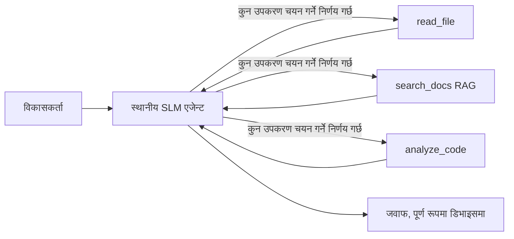
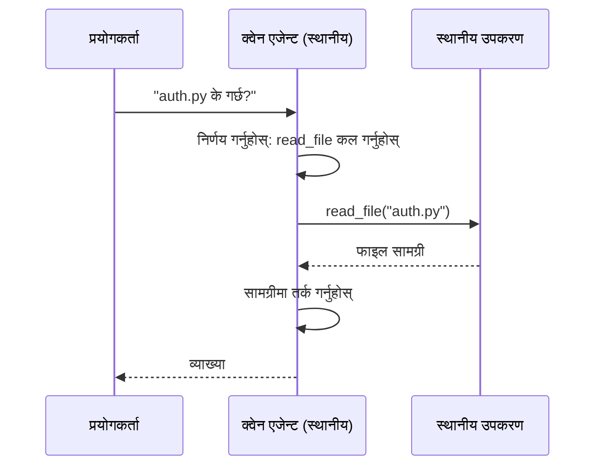
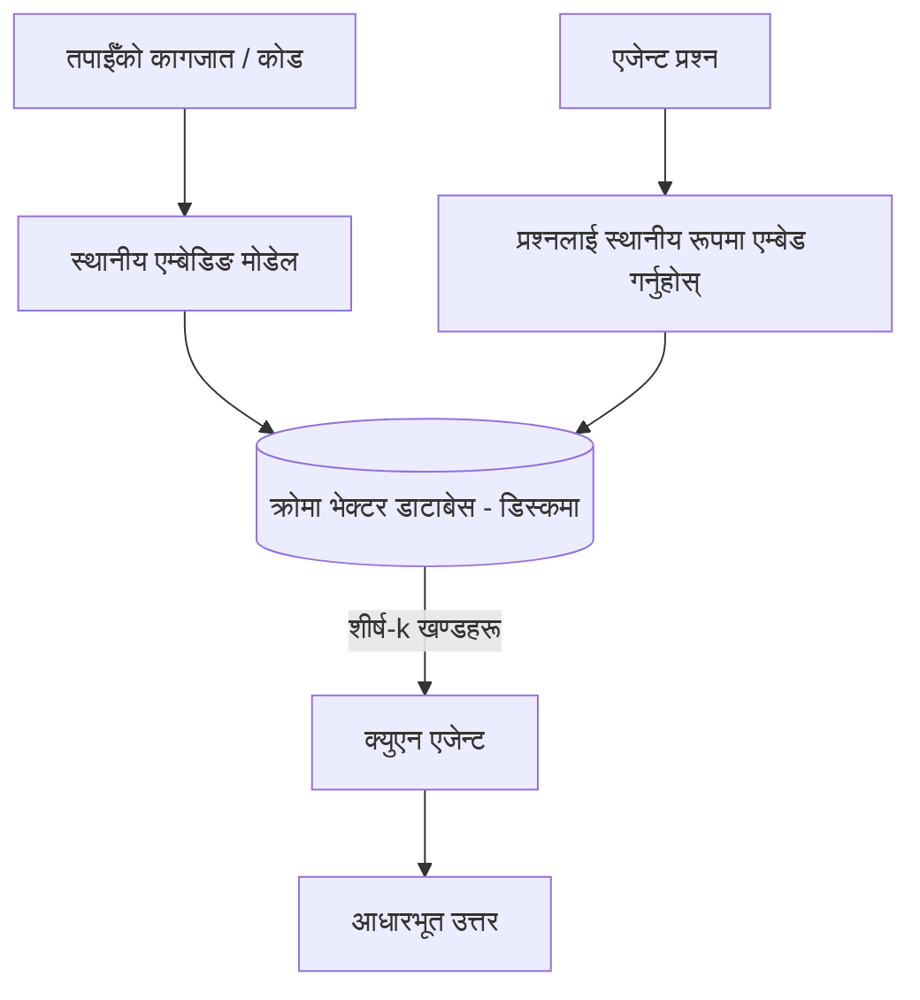
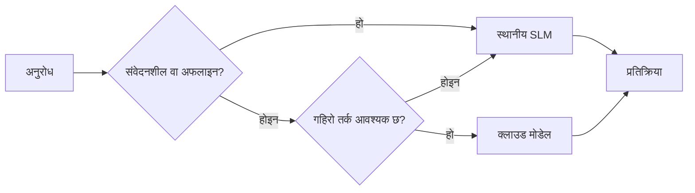

# Microsoft Foundry Local र Qwen प्रयोग गरी लोकल AI एजेन्ट कसरी बनाउने


अघिल्लो पाठले एजेन्टहरूलाई क्लाउडमा *ठूलो* बनायो। यो पाठले तिनीहरूलाई एकल मेसिनमा *सानो* बनाउँछ। अन्त्यमा तपाईं सँग यस्तो इन्जिनियरिङ सहायक हुनेछ जुन तर्क गर्छ, उपकरणहरू कल गर्छ, तपाईंका फाइलहरू पढ्दछ, र तपाईंको डकुमेन्टेसन खोज्दछ — **एक पनि क्लाउड इन्फेरेन्स कल बिना।**

तपाईलाई किन यो चाहियो होला? तीन कारणहरू जुन वास्तविक इन्जिनियरिङ काममा निरन्तर आउँछन्:

- **गोपनीयता।** कोड र डकुमेन्टहरू कहिल्यै मेसिन बाहिर जान्दैनन्। कुनै प्रॉम्प्ट, कुनै स्निपेट, कुनै ग्राहक डेटा नेटवर्क सीमा पार गर्दैन।
- **खर्च।** स्थानीय इन्फेरेन्समा प्रति-टोकन बिल हुँदैन। तपाईं बिजुलीको मूल्यमा सम्पूर्ण दिन पुनरावृत्ति गर्न सक्नुहुन्छ।
- **अफलाइन।** विमानमा, सुरक्षित स्थानमा, वा आउटेजको समयमा पनि एजेन्ट काम गर्दछ।

समस्या यो हो कि तपाईं फ्रन्टियर क्लाउड मोडेलको सट्टा **सानो भाषा मोडेल (SLM)** प्रयोग गर्दै हुनुहुन्छ जुन तपाईंको CPU, GPU, वा NPU मा चल्छ। यो पाठ त्यस्ता एजेन्टहरू बनाउने बारेमा हो जुन उक्त सिमिततामा *सही* हुन्छन् न कि सिमितता नभएको जस्तो अभिनय गर्दछन्।

## परिचय

यो पाठले समेट्ने कुरा:

- **सानो भाषा मोडेलहरू (SLMs)** — के हुन्, कहाँ राम्रो छन् र कहाँ होइनन्।
- **Microsoft Foundry Local** — एउटा रनटाइम जुन मोडेलहरू डिभाइसमा डाउनलोड र सेवा दिन्छ **OpenAI-संगत API** मार्फत।
- **Qwen फंक्शन-कलिङ मोडेलहरू** — SLMs जुन विश्वसनीय रूपमा उपकरण कलहरू उत्पादन गर्छन्, जसले स्थानीय *एजेन्टहरू* (सिर्फ स्थानीय च्याट होइन) सम्भव बनाउँछ।
- **स्थानीय उपकरणहरू, स्थानीय RAG, र स्थानीय MCP** — क्लाउड बिना एजेन्टलाई क्षमता प्रदान गर्ने।
- **हाइब्रिड ढाँचाहरू** — कहिले कुराहरू स्थानीय राख्ने र कहिले क्लाउडको पहुँच लिने।

## सिकाई लक्ष्यहरू

यो पाठपछि, तपाईं जान्नुहुनेछ कसरी:

- SLM को ट्रेड-अफहरू व्याख्या गर्ने र उपयुक्त स्थानीय एजेन्ट प्रयोग केसहरू छान्ने।
- Foundry Local मार्फत Qwen मोडेल स्थानीय रूपमा सेवा दिन र OpenAI-संगत अन्त्यबिन्दुमा जडान गर्ने।
- पूर्ण रूपमा तपाईंको वर्कस्टेशनमा चल्ने उपकरण-कल एजेन्ट बनाउने।
- स्थानीय भेक्टर डाटाबेस (Chroma) को प्रयोग गरेर आफ्नै कागजातमा स्थानीय RAG थप्ने।
- स्थानीय MCP सर्भरसँग एजेन्ट जडान गर्ने र हाइब्रिड स्थानीय/क्लाउड डिजाइनहरूमा तर्क गर्ने।

## पूर्वआवश्यकताहरू

यो पाठले पूर्व पाठहरू पूरा गरेको र तपाईंलाई सजिलो देखाउने छ:

- [उपकरण प्रयोग](../04-tool-use/README.md) (पाठ ४) र [Agentic RAG](../05-agentic-rag/README.md) (पाठ ५)।
- [Agentic Protocols / MCP](../11-agentic-protocols/README.md) (पाठ ११)।
- [Microsoft Agent Framework](../14-microsoft-agent-framework/README.md) (पाठ १४)।

तपाईंलाई यी पनि चाहिन्छ:

- एक विकासकर्ता वर्कस्टेशन। **८ GB RAM न्यूनतम यथार्थपरक छ**; १६ GB+ आरामदायक हुन्छ। GPU वा NPU मद्दत गर्छ तर आवश्यक छैन।
- **Microsoft Foundry Local** स्थापना गरिएको (तल सेटअप सेक्सन हेर्नुहोस्)।
- Python 3.12+ र रिपोजिटरीमा रहेका प्याकेजहरू [`requirements.txt`](../../../requirements.txt), साथै यस पाठका लागि `foundry-local-sdk`, `openai`, र `chromadb`।

## सानो भाषा मोडेलहरू: स्थानीय कामको लागि सहि उपकरण

फ्रन्टियर क्लाउड मोडेलसँग सयौं अरबौं प्यारामिटरहरू र डाटा सेन्टर हुन्छ। SLM सँग केही अरब प्यारामिटरहरू मात्र हुन्छ र तपाईंको ल्यापटपको RAM मा बस्नुपर्ने हुन्छ। त्यो फरकले स्पष्ट अपेक्षा सेट गर्छ।

**SLM हरूमा राम्रो हुन्छ:**

- संरचित, सीमित कार्यहरू — वर्गीकरण, निष्कर्षण, परिचित कागजातको सारांश।
- **उपकरण कल** — कुन फङ्क्शन कल गर्ने र कुन तर्कहरू प्रयोग गर्ने निर्णय।
- आफ्नै डाटामा छिटो, सस्तो, निजी पुनरावृत्ति।

**SLM हरू कमजोर हुन्छन्:**

- खुला अन्त, धेरै-कदम तर्क धेरै ठूलो प्रसंगमा।
- व्यापक विश्व ज्ञान (सम्भवत कम देखेका र बढी बिर्सने)।

त्यसैले स्थानीय एजेन्टको विजय रणनीति हो: **SLM लाई व्यवस्थापन गर्न दिनुहोस्, र भारी काम उपकरणहरूलाई दिनुहोस्।** मोडेललाई तपाईंको कोडबेस *जान्न* आवश्यक छैन — यसले कहिले `read_file` र `search_docs` कल गर्ने थाहा पाउनुपर्छ। त्यो SLM को बलमा सिधै मेल खान्छ।



## Microsoft Foundry Local

**Microsoft Foundry Local** एउटा हलुका रनटाइम हो जुन तपाईंको मेसिनमा मोडेलहरू डाउनलोड, व्यवस्थापन, र सेवा दिन्छ। यसको सबैभन्दा महत्त्वपूर्ण सुविधा हाम्रो लागि भनेको यो **OpenAI-संगत HTTP अन्त्यबिन्दु** प्रदान गर्छ — जसको अर्थ OpenAI SDK र Microsoft Agent Framework को OpenAI क्लाइंट यसमा काम गर्छ `base_url` मात्र परिवर्तन गरेर। एजेन्ट बनाउने सबै कुरा सिधै स्थानान्तरण हुन्छ; केवल अन्त्यबिन्दु क्लाउडबाट `localhost` मा सर्छ।

Foundry Local ले तपाईको हार्डवेयरको लागि मोडेलको सबैभन्दा राम्रो बिल्ड पनि स्वत: छान्छ — CPU बिल्ड, CUDA/GPU बिल्ड, वा NPU बिल्ड — जसले तपाईलाई प्रति मेसिन हातले अनुकूलन गर्नुपर्ने काम घटाउँछ।

### सेटअप

Foundry Local स्थापना गर्नुहोस् (तपाईंको OS को लागि [डकुमेन्टेसन](https://learn.microsoft.com/azure/ai-foundry/foundry-local/) हेर्नुहोस्), र काम गर्छ कि गर्छ भनेर प्रमाणित गर्नुहोस्:

```bash
# इन्स्टल गर्नुहोस् (उदाहरणका लागि; आफ्नो प्लेटफर्मको लागि दस्तावेजहरू अनुसरण गर्नुहोस्)
winget install Microsoft.FoundryLocal      # विन्डोज
# brew install microsoft/foundrylocal/foundrylocal   # म्याकओएस

# Qwen मोडेल डाउनलोड गरेर चलाउनुहोस्, त्यसपछि स्थानीय सेवा सुरु गर्नुहोस्
foundry model run qwen2.5-7b-instruct
foundry service status
```

सेवा चलिरहेको छ भने तपाईंलाई स्थानीय, OpenAI-संगत अन्त्यबिन्दु (सामान्यतया `http://localhost:PORT/v1`) प्राप्त हुन्छ। नोटबुकले `foundry-local-sdk` प्रयोग गरेर अन्त्यबिन्दु स्वतः पत्ता लगाउँछ, त्यसैले तपाईंले पोर्ट कडा कोड गर्नु पर्दैन।

## Qwen फंक्शन कल: किन यो महत्त्वपूर्ण छ

एजेन्ट तब मात्र एजेन्ट हो यदि यसले उपकरणहरू कल गर्न सक्छ। धेरै SLM हरू च्याट गर्न सक्छन् तर अविश्वसनीय, बिग्रिएका उपकरण कल उत्पादन गर्छन्। **Qwen** मोडेलहरू फंक्शन कलका लागि तालिम पाएका हुन् र लगातार राम्रो संरचित उपकरण-कल स्ट्रक्चरहरू निकाल्छन् — जुन कुराले स्थानीय च्याट मोडेललाई स्थानीय *एजेन्ट* मा परिणत गर्छ।

प्रवाह त तपाईले पहिले नै चिनेका मानक उपकरण-कल लूप हो, केवल डिभाइसमा चलिरहेको छ:



## स्थानीय RAG

डकुमेन्टेसन खोज नै त्यस्तो ठाउँ हो जहाँ स्थानीय एजेन्टहरू आफ्नो उपयोगिता देखाउँछन्। SLM ले तपाईंको फ्रेमवर्कको डकुमेन्टहरू सम्झिएको आशा गर्ने सट्टा, तपाईं ती कागजातहरूलाई **स्थानीय भेक्टर डाटाबेस** मा एम्बेड गर्नुहुन्छ र एजेन्टलाई माग अनुसार सम्बन्धित भागहरू पुन: प्राप्त गर्न दिनुहुन्छ।

हामी **Chroma** प्रयोग गर्छौं, जुन एम्बेड गरिएको भेक्टर स्टोर हो र कुनै सर्भर व्यवस्थापन गर्न पर्दैन। पाइपलाइन पूर्ण रूपमा स्थानीय हुन्छ: स्थानीय एम्बेडिङ मोडेल → स्थानीय भेक्टरहरू → स्थानीय पुन: प्राप्ति → स्थानीय SLM।



यो पाठ ५ बाटको Agentic RAG नमूना हो — फरक भनेको सबै कम्पोनेन्ट तपाईंको मेसिनमा चलिरहेको छ।

## स्थानीय MCP सर्भरहरू

[MCP](../11-agentic-protocols/README.md) एउटा ट्रान्सपोर्ट हो, क्लाउड सेवा होइन। MCP सर्भर`stdio` मा स्थानीय प्रक्रिया रूपमा चल्न सक्छ, एजेन्टलाई उपकरणहरू उपलब्ध गराउने सामान्य प्रोटोकल मार्फत। यसले तपाईंलाई विकासशील MCP सर्भरहरूको इकोसिस्टम पुन: प्रयोग गर्न दिन्छ — फाइलसिस्टम पहुँच, git अपरेसनहरू, डाटाबेस क्वेरीहरू — पूर्ण रूपमा अफलाइन।

सुरक्षा स्थिति क्लाउडसँग फरक छ, तर अनुपस्थित छैन: स्थानीय MCP सर्भर तपाईंको प्रयोगकर्ताको अनुमतिसँगै चल्छ, त्यसैले यसले के छोइरहेको छ नियन्त्रण गर्नुहोस् (जस्तै, एउटा प्रोजेक्ट डाइरेक्टरी, सम्पूर्ण होम फोल्डर होइन) र यसको आउटपुटलाई इन्स्पेक्शनका लागि इनपुटको रूपमा लिनुहोस्।

## हाइब्रिड क्लाउड-र-स्थानीय ढाँचाहरू

स्थानीय-प्रथम भनेर स्थानीय मात्र होइन। पुगेका प्रणालीहरूले संवेदनशीलता र कठिनाइ अनुसार मार्ग निर्धारण गर्छन्:

| स्थिति | कहाँ चल्छ |
| --- | --- |
| संवेदनशील कोड / डेटा, वा अफलाइन | **स्थानीय SLM** |
| सरल, सीमित कार्य | **स्थानीय SLM** (सस्तो, छिटो) |
| संवेदनशील नभएको डेटा माथि कठिन धेरै-कदम तर्क | **क्लाउड मोडेल** |
| सबै, आउटेजको समयमा | **स्थानीय SLM** (नरम गिरावट) |

यो पाठ १६ को **मोडेल राउटिङ** विचारसँग मेल खान्छ — तर "मोडेलहरूमध्ये" एक अब तपाईंको आफ्नै मेसिन हो। एक पुष्ट डिजाइन उपलब्ध नभएको क्लाउडको बेला स्थानीयमा फर्कन्छ, जसले गर्दा एजेन्ट सम्पूर्ण रूपमा असफल नहुने, गुणस्तरमा झर्ने गर्दछ।



## हैन्ड्स-ऑन प्रयोगशाला: स्थानीय इन्जिनियरिङ सहायक

[`code_samples/17-local-agent-foundry-local.ipynb`](./code_samples/17-local-agent-foundry-local.ipynb) खोल्नुहोस् र काम सुरू गर्नुहोस्। तपाईंले एउटा **स्थानीय इन्जिनियरिङ सहायक** बनाउनुहुनेछ जो पूर्ण रूपमा तपाईंको वर्कस्टेशनमा चल्छ र गर्न सक्दछ:

1. **उपकरणहरू कल गर्ने** — Foundry Local मार्फत Qwen फंक्शन कल।
2. **स्थानीय फाइल अपरेसनहरू गर्ने** — प्रोजेक्ट डाइरेक्टरीमा फाइलहरू सूचीबद्ध र पढ्ने।
3. **कोड विश्लेषण गर्ने** — स्रोत फाइलमा आधारभूत मेट्रिक्स रिपोर्ट गर्ने।
4. **डकुमेन्टेसन खोज्ने** — Chroma सँग कागजात फोल्डरमा स्थानीय RAG।
5. **MCP प्रयोग गर्ने** — स्थानीय MCP सर्भरमा जडान गर्ने (यदि कन्फिगर गरिएको छैन भने सौम्य रूपमा छोड्ने)।

कुनै पनि बिन्दुमा क्लाउड इन्फेरेन्स प्रयोग हुँदैन।

### मार्गदर्शन

सहायक Foundry Local मा OpenAI-संगत अन्त्यबिन्दु मार्फत जडान हुन्छ, त्यसैले एजेन्ट कोड क्लाउड पाठहरू जस्तै देखिन्छ — केवल क्लाइन्ट फरक छ:

```python
from foundry_local import FoundryLocalManager
from openai import OpenAI

# फाउन्ड्री लोकलले मोडल पत्ता लगाउँछ/डाउनलोड गर्दछ र हामीलाई स्थानीय एन्डपोइन्ट दिन्छ।
manager = FoundryLocalManager(\"qwen2.5-7b-instruct\")
client = OpenAI(base_url=manager.endpoint, api_key=manager.api_key)  # api_key एक स्थानीय प्लेसहोल्डर हो
```

उपकरणहरू साधारण Python फङ्क्शनहरू हुन् जुन प्रोजेक्ट डाइरेक्टरीमा सीमित छन्:

```python
def read_file(path: str) -> str:
    \"\"\"Read a file, but only inside the sandboxed project directory.\"\"\"
    full = (PROJECT_ROOT / path).resolve()
    if PROJECT_ROOT not in full.parents and full != PROJECT_ROOT:
        return \"Access denied: path is outside the project directory.\"
    return full.read_text(encoding=\"utf-8\")
```

स्यान्डबक्स जाँच नोट गर्नुहोस् — स्थानीय भए पनि, जुनसुकै बाटो पढ्ने उपकरण जोखिम हो। नोटबुकले हरेक उपकरणलाई एक प्रोजेक्ट रुटमा सीमित राख्छ।

## ज्ञान परीक्षण

असाइनमेन्टमा जानु अघि आफ्नो समझदारी परीक्षण गर्नुहोस्।

**१. एजेन्टलाई क्लाउड होइन स्थानीय रूपमा चलाउने दुई ठोस कारणहरू के हुन्?**

<details>
<summary>उत्तर</summary>

कुनै पनि दुई: **गोपनीयता** (कोड र डाटा मेसिन बाहिर जान्दैन), **खर्च** (प्रति-टोकन इन्फेरेन्स बिल हुँदैन), र **अफलाइन क्षमता** (नेटवर्क बिना काम गर्छ — विमानमा, सुरक्षित स्थानमा, वा आउटेजको बेला)। नियामक/अनुपालन प्रतिबन्धहरू जसले डाटा डिभाइस बाहिर पठाउन निषेध गरेको छ गोपनीयताको सामान्य कारण हो।
</details>

**२. स्थानीय एजेन्टमा SLM र यसको उपकरणहरू बीचको सिफारिस गरिएको कार्य विभाजन के हो र किन?**

<details>
<summary>उत्तर</summary>

SLM लाई **व्यवस्थापन** दिनुहोस् (कुन उपकरण कल गर्ने र कुन तर्कहरू प्रयोग गर्ने निर्णय गर्ने) र उपकरणहरूलाई **भारी काम गर्ने** दिने (फाइलहरू पढ्ने, डकुमेन्टहरु पुन: प्राप्त गर्ने, नतिजाहरू गणना गर्ने)। SLMहरू टूल चयनजस्ता सीमित निर्णयमा बलियो हुन्छन् तर व्यापक ज्ञान र लामो धेरै-कदम तर्कमा कमजोर, त्यसैले उपकरणहरूमा भरोसा गर्नु यसको बलमा हो।
</details>

**३. Foundry Local सँग क्लाउड एजेन्ट कोडलाई पुन: प्रयोग सम्भव बनाउन के छ?**

<details>
<summary>उत्तर</summary>

Foundry Local ले **OpenAI-संगत HTTP अन्त्यबिन्दु** प्रदान गर्छ। OpenAI SDK र Agent Framework को OpenAI क्लाइन्टले केवल `base_url` परिवर्तन गरेर (र स्थानीय प्लेसहोल्डर API कुञ्जी प्रयोग गरेर) यसमा काम गर्छन्। एजेन्ट कोडका बाँकी सबै कुरा उस्तै रहन्छ।
</details>

**४. हामी विशेषगरी Qwen फंक्शन-कलिङ मोडेल किन प्रयोग गर्छौं जुन कुनै पनि SLM भन्दा फरक हुन्छ?**

<details>
<summary>उत्तर</summary>

किनकि एजेन्टले विश्वसनीय, राम्रो संरचित **उपकरण कलहरू** उत्पन्न गर्नुपर्छ। धेरै SLM हरू च्याट गर्न सक्छन् तर बिग्रिएका या असंगत उपकरण-कल संरचना निकाल्छन्। Qwen मोडेलहरू फंक्शन कलका लागि तालिम पाएका हुन् र लगातार उपकरण कल दिन्छन्, जुन कुराले स्थानीय च्याट मोडेललाई काम गर्ने स्थानीय एजेन्ट बनाउँछ।
</details>

**५. स्थानीय RAG पाइपलाइनमा कुन कम्पोनेन्टहरू मेसिनमा चल्छन्?**

<details>
<summary>उत्तर</summary>

सबै: एम्बेडिङ मोडेल, भेक्टर डाटाबेस (Chroma, डिस्कमा), पुन: प्राप्ति चरण, र SLM। कागजातहरू स्थानीय रूपमा एम्बेड गरिन्छ, स्थानीय रूपमा भण्डारण गरिन्छ, स्थानीय रूपमा पुन: प्राप्त गरिन्छ, र स्थानीय मोडेलले तर्क गर्छ — कुनै कम्पोनेन्ट क्लाउडलाई छोदैन।
</details>

**६. स्थानीय MCP सर्भर तपाईंको मेसिनमा चल्छ। के त्यसले यसलाई स्वयंकृत रूपमा सुरक्षित बनाउँछ? तपाईंले के सुरक्षात्मक कदम लिनु पर्छ?**

<details>
<summary>उत्तर</summary>

होइन। स्थानीय MCP सर्भर तपाईंको प्रयोगकर्ताको अनुमतिसँग चल्छ, त्यसैले यो तपाईंले पहुँच गर्न सक्ने कुनै पनि कुरा छोइरहन सक्छ। यसलाई आवश्यक भएको ठाउँमा सीमित गर्नुहोस् (जस्तै एक प्रोजेक्ट डाइरेक्टरी, सम्पूर्ण होम फोल्डर होइन) र यसको आउटपुटलाई प्रमाणिकरण गर्न इनपुटको रूपमा व्यवहार गर्नुहोस्।
</details>

**७. स्थानीय मोडेल समावेश गर्ने उपयुक्त हाइब्रिड राउटिङ नियम वर्णन गर्नुहोस्।**

<details>
<summary>उत्तर</summary>

संवेदनशील वा अफलाइन अनुरोधहरू स्थानीय SLM तर्फ पठाउनुहोस्; सरल सीमित कामहरू छिटो र सस्तोका लागि स्थानीय SLM तर्फ; संवेदनशील नभएको डाटामा कठिन धेरै-कदम तर्क क्लाउड मोडेल तर्फ; र क्लाउड उपलब्ध नभए स्थानीय SLM तर्फ फर्केर एजेन्ट नराम्रो रूपमा ठप्प नपरोस्। यो मोडेल राउटिङ (पाठ १६) हो जहाँ स्थानीय मेसिन एक मोडेलको रूपमा छ।
</details>

**८. यस पाठमा स्थानीय एजेन्ट चलाउनको लागि यथार्थपरक न्यूनतम RAM कति हो, र बढी RAM ले के सुविधा दिन्छ?**

<details>
<summary>उत्तर</summary>

करिब **८ GB** यथार्थपरक न्यूनतम हो; १६ GB+ आरामदायक। बढी RAM ले तपाईलाई ठूलो, सक्षम मोडेलहरू चलाउन र स्मृतिमा बढी प्रसंग राख्न मद्दत गर्छ। GPU वा NPU ले इन्फेरेन्स छिटो गर्छ तर आवश्यक छैन — Foundry Local ले कुनै तिब्रकता नभए CPU बिल्ड चयन गर्छ।
</details>

## असाइनमेन्ट

स्थानीय इन्जिनियरिङ सहायकलाई बढाएर आफ्नो रोजाइको सानो प्रोजेक्टका लागि **स्थानीय डकुमेन्टेसन समीक्षक** बनाउनुहोस् (यदि चाहनु भए यस रिपोको पाठ फोल्डरहरू मध्ये एक प्रयोग गर्नुहोस्)।

तपाईंको पेशकशले समावेश गर्नुपर्छ:

1. **साँचो डकुमेन्ट / कोड फोल्डरलाई** Chroma मा अनुक्रमित गर्ने (कम्तीमा पाँच फाइलहरू)।
2. **`find_todos` उपकरण थप्ने** जुन प्रोजेक्टमा `TODO` / `FIXME` कमेन्टहरू स्क्यान गरी फाइल र लाइन नम्बर सहित फर्काउँछ — `read_file` जस्तै स्यान्डबक्स चेक कायम राख्दै।

3. **एजेन्टलाई तीन प्रश्नहरू सोध्नुहोस्** जसले यसलाई उपकरणहरू संयोजन गर्न बाध्य पार्छ: एउटा शुद्ध RAG प्रश्न, एउटा विशेष फाइल पढ्न आवश्यक पर्ने प्रश्न, र एउटा TODOs फेला पार्न आवश्यक पर्ने प्रश्न।
4. **मापन गर्नुहोस्**: तीनवटै प्रतिक्रियाहरूको समय लिनुहोस् र markdown सेलकामा उल्लेख गर्नुहोस्। तपाईंको इच्छित कार्यप्रवाहका लागि ढिलाइ स्वीकार्य छ कि छैन भनेर टिप्पणी गर्नुहोस्।

त्यसपछि छोटो अनुच्छेद लेख्नुहोस् कि **के तपाईंले क्लाउडमा के सार्ने र के स्थानीयमा राख्ने** समीक्षा कर्तालागि, र किन। तपाईंलाई स्थानीय कम्पोनेन्टहरू सही तरिकाले तार जोडिएको छन् कि छैन र तपाईंको हाइब्रिड तर्क सही छ कि छैन आधारमा मूल्यांकन गरिन्छ — मोडेल गुणस्तरमा होइन।

## सारांश

यस पाठमा तपाईंले यस्तो एजेन्ट बनाउनु भयो जुन पूर्ण रूपमा तपाईंको आफ्नै मेसिनमा चल्छ:

- **SLMs** गोपनीयता, लागत, र अफलाइन सञ्चालनका लागि व्यापकता साटासाट गर्छन् — र तब चम्किन्छन् जब तिनीहरूले सबै ज्ञान आफैं राख्नुभन्दा **उपकरणहरू व्यवस्थित** गर्छन्।
- **Foundry Local** मोडेलहरूलाई उपकरणमा **OpenAI-समरूप अन्त बिन्दु (endpoint)** पछाडि सेवा दिन्छ, त्यसैले तपाईंको क्लाउड एजेन्ट कोड एक लाइन परिवर्तनसँग सार्न सकिन्छ।
- **Qwen function-calling मोडेलहरू** भरपर्दो स्थानीय उपकरण कलिंग सम्भव बनाउँछन् — र त्यसैले स्थानीय *एजेन्टहरू* पनि।
- **स्थानीय RAG** (Chroma) र **स्थानीय MCP** एजेन्टलाई क्षमता दिन्छ बिना मेसिन छोड्नु।
- **हाइब्रिड ढाँचाहरू** तपाईंलाई संवेदनशीलता र जटिलतामार्फत मार्ग निर्देशन गर्न दिन्छ, स्थानीयलाई एक सहज फालब्याकको रूपमा।

यसले परिचालन चक्र पूरा गर्छ: पाठ १६ ले एजेन्टहरूलाई Microsoft Foundry मा स्केल गर्‍यो, र यस पाठले तिनीहरूलाई एकल कार्यस्थलसम्म स्केल गर्‍यो। अर्को पाठले परिचालित एजेन्टहरूलाई सुरक्षित राख्नको विषयमा जान्छ।

## थप स्रोतहरू

- <a href="https://learn.microsoft.com/azure/ai-foundry/foundry-local/" target="_blank">Microsoft Foundry Local कागजातहरु</a>
- <a href="https://learn.microsoft.com/azure/ai-foundry/what-is-azure-ai-foundry" target="_blank">Microsoft Foundry कागजातहरु</a>
- <a href="https://learn.microsoft.com/en-us/agent-framework/overview/?wt.mc_id=youtube_26688_organicsocial_reactor&pivots=programming-language-python" target="_blank">Microsoft Agent Framework</a>
- <a href="https://qwen.readthedocs.io/en/latest/framework/function_call.html" target="_blank">Qwen function calling कागजातहरु</a>
- <a href="https://modelcontextprotocol.io/" target="_blank">Model Context Protocol (MCP)</a>
- <a href="https://docs.trychroma.com/" target="_blank">Chroma भेक्टर डाटाबेस</a>

## अघिल्लो पाठ

[Scalable Agents परिचालन गर्दै](../16-deploying-scalable-agents/README.md)

## अर्को पाठ

[AI एजेन्टहरूलाई सुरक्षित बनाउँदै](../18-securing-ai-agents/README.md)

---

<!-- CO-OP TRANSLATOR DISCLAIMER START -->
**अस्वीकरण**:
यो दस्तावेज़ AI अनुवाद सेवा [Co-op Translator](https://github.com/Azure/co-op-translator) प्रयोग गरेर अनुवाद गरिएको हो। हामी सही हुन प्रयास गर्छौं, तर कृपया जानकार हुनुस् कि स्वचालित अनुवादमा त्रुटिहरू वा अशुद्धताहरू हुन सक्छन्। मूल दस्तावेज़ यसको मूल भाषामा आधिकारिक स्रोत मानिनुपर्छ। महत्वपूर्ण जानकारीका लागि व्यावसायिक मानव अनुवाद सिफारिस गरिन्छ। यस अनुवादको प्रयोगबाट उत्पन्न कुनै पनि गलत बुझाइ वा त्रुटिको लागि हामी जिम्मेवार छैनौं।
<!-- CO-OP TRANSLATOR DISCLAIMER END -->