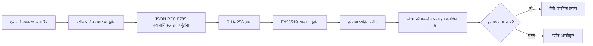
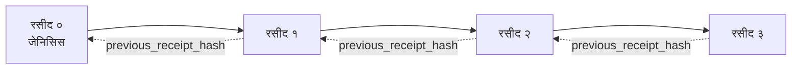

[पाठ भिडियो हेर्नुहोस्: क्रिप्टोग्राफिक रसिदहरूसँग AI एजेन्टहरूलाई सुरक्षित पार्नुहोस्](https://youtu.be/PLACEHOLDER_VIDEO_ID)

> _(Microsoft कन्टेन्ट टिमले मर्ज पछि पाठ भिडियो र थम्बनेल थप्नेछ, जुन पाठ १४ / १५ को ढाँचासँग मेल खानेछ।)_

# क्रिप्टोग्राफिक रसिदहरूसँग AI एजेन्टहरूलाई सुरक्षित पार्नुहोस्

## परिचय

यस पाठले समेट्नेछ:

- AI एजेन्टहरूको लागि अडिट ट्रेल किन महत्त्वपूर्ण छ, अनुपालन, डिबगिङ, र विश्वासका लागि।
- क्रिप्टोग्राफिक रसिद के हो र यो अनसाइन्ड लग लाइन भन्दा कसरी फरक छ।
- एउटा एजेन्टको उपकरण कलको लागि प्लेन Python मा कसरी साइन गरिएको रसिद उत्पादन गर्ने।
- रसिदलाई अफलाइन कसरी प्रमाणित गर्ने र छेडछाड पत्ता लगाउने।
- रसिदहरूलाई कसरी चेन गर्ने ताकि एउटा रसिद हटाउँदा वा फेरबदल गर्दा चेन बिग्रन्छ।
- रसिदहरूले के प्रमाणित गर्छन् र के स्पष्ट रूपमा प्रमाणित गर्दैनन्।

## सिकाइका लक्ष्यहरू

यस पाठ पूरा गरेपछि, तपाईं जान्नुहुनेछ कसरी:

- एजेन्ट कार्यहरूको क्रिप्टोग्राफिक उत्पत्तिलाई प्रेरित गर्ने असफलता मोडहरू पहिचान गर्ने।
- Ed25519-साइन गरिएको रसिद क्यानोनिकल JSON पेलोडमा उत्पादन गर्ने।
- आयोजकको सार्वजनिक कुञ्जी मात्र प्रयोग गरेर रसिद स्वतन्त्र रूपमा प्रमाणित गर्ने।
- परिवर्तनलाई पत्ता लगाउन रसिद परिमार्जन गरेर पुनः प्रमाणीकरण चलाउने।
- रसिदहरूको ह्याश-चेन गरिएको श्रृंखला निर्माण गर्ने र यसले किन महत्त्व राख्छ व्याख्या गर्ने।
- रसिदहरूले के प्रमाणित गर्दछन् (अट्रिब्युसन, अखण्डता, अर्डरिङ) र के गर्दैनन् (कार्यको सहि/गलतता, नीतिको ध्वनि परीक्षण) को सिमा चिन्हित गर्ने।

## समस्या: तपाईंको एजेन्टको अडिट ट्रेल

कल्पना गर्नुहोस् तपाईंले Contoso Travel को लागि AI एजेन्ट तैनाथ गर्नुभएको छ। एजेन्ट ग्राहकको अनुरोध पढ्छ, उडान API कल गर्छ विकल्पहरू खोज्न, र ग्राहकको तर्फबाट सिट बुक गर्छ। अघिल्लो चौमासिकमा, एजेन्टले ५०,००० बुकिङहरू प्रशोधन गर्यो।

आज एउटा अडिटकर्ता आउँछ। उनी सोध्छन्: "तपाईंको एजेन्टले के गर्यो देखाउनुहोस्।"

तपाईं आफ्नो लग फाइलहरू दिनुहुन्छ। अडिटकर्ता त्यसलाई हेरेर थप गाह्रो प्रश्न सोध्छ: "मलाई कसरी थाहा हुन्छ यी लगहरू सम्पादन भएका छैनन्?"

यो हो अडिट-ट्रेल समस्या। आजका धेरै एजेन्ट तैनाथीहरूले निर्भर गर्छन्:

- **एप्लिकेशन लगहरू**: एजेन्टले आफै लेखेको, फाइल सिस्टम पहुँच हुने जोसँगसंग पनि सम्पादन गर्न सकिने।
- **क्लाउड लगिङ सेवाहरू**: प्लेटफर्म स्तरमा छेडछाड-प्रमाणित तर केवल तब जब अडिटकर्ताले प्लेटफर्म अपरेटरमाथि विश्वास गर्छ।
- **डाटाबेस ट्रान्ज्याक्शन लगहरू**: डाटाबेस परिवर्तनका लागि उपयुक्त, तर मनमौजी उपकरण कलहरूको लागि होइन।

यीमध्ये कुनैले पनि अडिटकर्ताको प्रश्न उत्तर दिन सक्दैन बिना अडिटकर्ताले कसैमाथि विश्वास गर्नु पर्ने (तपाईं, तपाईंको क्लाउड प्रदायक, तपाईंको डाटाबेस विक्रेता)। आन्तरिक प्रयोगका लागि त्यो विश्वास स्वीकार्य हुन्छ। नियन्त्रित कार्यभारहरू (वित्त, स्वास्थ्य सेवा, EU AI एक्ट अन्तर्गत पर्ने कुनै पनि) का लागि त्यो हुँदैन।

क्रिप्टोग्राफिक रसिदहरूले यो समस्या समाधान गर्छन् किनकि प्रत्येक एजेन्ट क्रियालाई स्वतन्त्र रूपमा प्रमाणित गर्न सकिन्छ। अडिटकर्ताले तपाईंमाथि विश्वास गर्नु पर्दैन। उनीहरूलाई केवल तपाईंको सार्वजनिक कुञ्जी र रसिद चाहिन्छ।

## क्रिप्टोग्राफिक रसिद के हो?

रसिद एक JSON वस्तु हो जसले एजेन्टले के गर्यो दर्ता गर्छ, डिजिटल हस्ताक्षरसँग साइन गरिएको।


  
एक न्यूनतम रसिद यसप्रकार देखिन्छ:

```json
{
  "type": "agent.tool_call.v1",
  "agent_id": "contoso-travel-bot",
  "tool_name": "lookup_flights",
  "tool_args_hash": "sha256:a3f9c1...",
  "result_hash": "sha256:7b2e1d...",
  "policy_id": "contoso-travel-policy-v3",
  "timestamp": "2026-04-25T14:30:00Z",
  "sequence": 47,
  "previous_receipt_hash": "sha256:9d4e6a...",
  "signature": {
    "alg": "EdDSA",
    "sig": "c5af83...",
    "public_key": "8f3b2c..."
  }
}
```
  
तीन गुणहरू काम गरिरहेका छन्:

1. **हस्ताक्षर**। रसिद एजेन्टको गेटवेले Ed25519 निजी कुञ्जीसँग साइन गरेको हुन्छ। सम्बन्धित सार्वजनिक कुञ्जीसँग जोसुकैले असञ्जालमा हस्ताक्षर प्रमाणित गर्न सक्छ। कुनै पनि फिल्डमा छेडछाडले हस्ताक्षर अमान्य पार्छ।

2. **क्यानोनिकल एन्कोडिङ**। साइन गर्नुअघि रसिद JSON क्यानोनिकलाइजेसन स्किम (JCS, RFC 8785) प्रयोग गरी सिरियलाइज्ड हुन्छ। यसले सुनिश्चित गर्छ कि एउटै तर्कसंगत रसिद उत्पादन गर्ने दुईवटा कार्यान्वयनले ठ्याक्कै एउटै बाइट आउटपुट दिन्छन्। क्यानोनिकलाइजेसन नहुँदा फरक JSON सिरियलाइजरहरूले फरक हस्ताक्षर उत्पादन गर्थे।

3. **ह्याश चेनिङ**। `previous_receipt_hash` फिल्डले प्रत्येक रसिदलाई पहिलाको रसिदसँग लिंक गर्छ। कुनै रसिद हटाउँदा वा फेरबदल गर्दा त्यसपछि आएका सबै रसिदहरू बिग्रन्छन्। व्यक्तिगत हस्ताक्षरहरू छले पनि चेन स्तरमा छेडछाड देखिन्छ।

यी गुणहरू मिलेर तीन सुनिश्चितता दिन्छन्:

- **अट्रिब्युसन**: यस कुञ्जीले यो सामग्रीमा हस्ताक्षर गर्यो।
- **अखण्डता**: साइनदेखि सामग्री परिवर्तन भएको छैन।
- **अर्डरिङ**: यो रसिद त्यस रसिदपछि आएको हो।

## Python मा रसिद उत्पादन गर्ने

रसिद उत्पादन गर्न विशेष पुस्तकालय आवश्यक छैन। क्रिप्टोग्राफिक आधारभूत तत्परता उपलब्ध छन् र तर्क केही दर्जन पंक्तिहरूको Python कोडमा छ।

`code_samples/18-signed-receipts.ipynb` मा व्यावहारिक कसरतहरूले पूर्ण प्रक्रिया देखाउँछन्। संक्षेप संस्करण:

```python
import json
import hashlib
import base64
from nacl import signing
from jcs import canonicalize  # RFC 8785 क्यानोनिकल JSON

def b64url_nopad(data: bytes) -> str:
    return base64.urlsafe_b64encode(data).decode("ascii").rstrip("=")

def sha256_canonical(obj) -> str:
    """SHA-256 of a Python object's JCS-canonical JSON form."""
    return f"sha256:{hashlib.sha256(canonicalize(obj)).hexdigest()}"

# एक सायनिङ कुञ्जी उत्पादन गर्नुहोस् वा लोड गर्नुहोस् (उत्पादनमा, कुञ्जी भॉल्टमा भण्डारण गर्नुहोस्)
signing_key = signing.SigningKey.generate()
verify_key = signing_key.verify_key

# प्राप्ति पेलोड निर्माण गर्नुहोस् (अझै सिग्नेचर छैन)
tool_args = {"origin": "SYD", "destination": "LAX"}
tool_result = [{"flight": "QF11", "price": 1850, "stops": 0}]

payload = {
    "type": "agent.tool_call.v1",
    "agent_id": "contoso-travel-bot",
    "tool_name": "lookup_flights",
    "tool_args_hash": sha256_canonical(tool_args),
    "result_hash": sha256_canonical(tool_result),
    "policy_id": "contoso-travel-policy-v3",
    "timestamp": "2026-04-25T14:30:00Z",
    "sequence": 0,
    "previous_receipt_hash": None,
}

# क्यानोनिकलाइज, ह्यास, साइन गर्नुहोस्।
canonical_bytes = canonicalize(payload)
message_hash = hashlib.sha256(canonical_bytes).digest()
signature_bytes = signing_key.sign(message_hash).signature

# एक संरचित सिग्नेचर वस्तु संलग्न गर्नुहोस्।
receipt = {
    **payload,
    "signature": {
        "alg": "EdDSA",
        "sig": b64url_nopad(signature_bytes),
        "public_key": b64url_nopad(bytes(verify_key)),
    },
}
```
  
यो नै सम्पूर्ण साइनिङ पाइपलाइन हो। नोटबुकमा कसरतहरूले प्रत्येक चरणमा मार्गदर्शन गर्छन्।

## रसिद प्रमाणित गर्ने र छेडछाड पत्ता लगाउने

प्रमाणीकरण विपरित प्रक्रिया हो:

```python
import base64
import hashlib
from nacl import signing
from nacl.exceptions import BadSignatureError
from jcs import canonicalize

def b64url_decode(s: str) -> bytes:
    padding = "=" * ((4 - len(s) % 4) % 4)
    return base64.urlsafe_b64decode(s + padding)

def verify_receipt(receipt: dict) -> bool:
    # हस्ताक्षर एक संरचित वस्तु हो: {"alg", "sig", "public_key"}।
    sig_obj = receipt.get("signature")
    if not sig_obj or sig_obj.get("alg") != "EdDSA":
        return False

    # वास्तवमा हस्ताक्षर गरिएको पेलोड पुनर्निर्माण गर्नुहोस् (हस्ताक्षर बाहेक सबै)।
    payload = {k: v for k, v in receipt.items() if k != "signature"}

    canonical_bytes = canonicalize(payload)
    message_hash = hashlib.sha256(canonical_bytes).digest()

    try:
        verify_key = signing.VerifyKey(b64url_decode(sig_obj["public_key"]))
        verify_key.verify(message_hash, b64url_decode(sig_obj["sig"]))
        return True
    except BadSignatureError:
        return False
```
  
यो फङ्क्शनले रसिद लिन्छ र यदि हस्ताक्षर सही छ भने `True` फर्काउँछ, नत्र `False`। कुनै नेटवर्क कल, कुनै सेवा निर्भरता छैन, र कुनै तेस्रो पक्षमाथि विश्वास आवश्यक छैन।

छेडछाड पत्ता लगाउने क्रियामा हेर्न, नोटबुकले यी चरणहरू देखाउँछ:

1. मान्य रसिद उत्पादन गर्ने र प्रमाणित गर्ने सुनिश्चित गर्ने।
2. `tool_args_hash` फिल्डको एक बाइट परिमार्जन गर्ने।
3. पुनः प्रमाणिकरण चलाउने र असफल हुनु देख्ने।

यो व्यवहारिक प्रदर्शन हो कि रसिदहरू छेडछाड-प्रमाणित छन्: कुनै पनि सानो परिमार्जनले हस्ताक्षर बिगार्छ।

## बहु-चरण एजेन्टहरूका लागि रसिदहरू चेन गर्ने

एकल साइन गरिएको रसिदले एक कार्यको सुरक्षा गर्छ। रसिदहरूको चेनले श्रृंखलाको सुरक्षा गर्छ।


  
हरेक रसिद अगाडिको रसिदको ह्याश दिन्छ। यदि कसैले रसिद २ लाई चुपचाप हटाउन खोज्यो भने, उनीहरूले या त:

- रसिद ३ को `previous_receipt_hash` फिल्डलाई परिवर्तन गर्नुपर्नेछ (रसिद ३ को हस्ताक्षर भंग हुन्छ), वा
- परिवर्तन गरिएको रसिद ३ मा नयाँ हस्ताक्षर जाली बनाउनुपर्नेछ (एजेन्टको निजी कुञ्जी चाहिन्छ)।

यदि निजी कुञ्जी हार्डवेयर कुञ्जी भॉल्टमा छ र तपाईं प्रत्येक रसिदसँग सार्वजनिक कुञ्जी प्रकाशित गर्नुहुन्छ भने, यी दुबै आक्रमणहरू पत्ता नलागी सम्भव छैनन्।

नोटबुकले देखाउँछ:

1. तीन रसिदहरूको चेन बनाउने।
2. प्रत्येक रसिदको `previous_receipt_hash` ले पहिलाको रसिदको वास्तविक ह्याशसँग मेल खान्छ भनेर प्रमाणित गर्ने।
3. बीचको एउटा रसिद परिवर्तन गर्ने र चेन त्यहीँ फुटेको देखाउने।

यसो गर्दा एउटा बाह्य अडिटकर्ताले तपाईंमाथि भरोसा नगरी पनि अडिट ट्रेल प्रमाणित गर्न सक्छ।

## रसिदहरूले के प्रमाणित गर्छन् (र के गर्दैनन्)

यो यस पाठको सबैभन्दा महत्त्वपूर्ण खण्ड हो। रसिदहरू शक्तिशाली छन् तर तिनीहरूको शक्ति सीमित छ।

**रसिदहरूले तीन कुरा प्रमाणित गर्छन्:**

1. **अट्रिब्युसन**: एउटा विशिष्ट कुञ्जीले विशिष्ट पेलोड साइन गर्याे।
2. **अखण्डता**: साइनदेखि पेलोड परिवर्तन भएको छैन।
3. **अर्डरिङ**: यो रसिद त्यो रसिदपछि आएको छ ह्याश चेनमा।

**रसिदहरूले प्रमाणित गर्दैनन्:**

1. **सहि कार्य**: कि एजेन्टको कार्य सहि थियो। गलत उत्तरका लागि पनि रसिद सफा रूपमा साइन हुन सक्छ।
2. **नीति अनुपालन**: `policy_id` मा उल्लिखित नीतिलाई साँच्चै मूल्यांकन गरिएको थियो वा यो कार्यलाई अनुमति दिने थियो। रसिदले दावी प्रदर्शित गर्छ, लागू गरिएन।
3. **कुञ्जीभन्दा बाहिरको पहिचान**: रसिद भन्छ "यो कुञ्जीले यस सामग्रीमा हस्ताक्षर गर्याे।" यो भन्दैन "यो मानवले यो स्वीकृत गर्याे।" कुञ्जीलाई व्यक्ति वा संस्था सँग जोर्न अलग पहिचान संरचना चाहिन्छ।
4. **इनपुटको सत्यता**: एजेन्टले छेडिएको प्रॉम्प्ट पाएको खण्डमा रसिदले मात्र कार्य सही ढंगले दर्ता गर्छ। रसिद इनपुट प्रमाणीकरणको विकल्प होइन।

यो सिमा महत्त्वपूर्ण छ दुई कारणले:

- यसले बताउँछ कि रसिदहरू के का लागि उपयोगी छन्: एजेन्ट व्यवहारलाई अडिट योग्य र छेडछाड-प्रमाणित बनाउनु, यहाँसम्म कि संगठनको सीमाना पार गरेर।
- र के थप तहहरू आवश्यक छन्: इनपुट प्रमाणीकरण (पाठ ६), नीति लागू (थोरै तल समेटिएको), र पहिचान संरचना (यस पाठको दायराबाट बाहिर)।

साधारण गल्ती हो "हामीसँग रसिदहरू छन्" भनेको "हामी सुशासनवालाहरु हौं" भन्ने मान्नु। हुँदैन। रसिद आधार हो। सुशासन त्यो प्रणाली हो जुन तपाईं माथि बनाउनुहुन्छ।

## उत्पादन सन्दर्भहरू

यस पाठको Python कोड जानाजानी न्यूनतम छ ताकि तपाईं प्रत्येक पंक्ति पढेर के भइरहेको छ बुझ्न सक्नुहुन्छ। उत्पादनमा दुई विकल्पहरू हुन्:

1. **क्रिप्टोग्राफिक आधारभूतमा सिधै निर्माण गर्ने।** माथिका ५० पंक्तिहरू धेरै प्रयोगक लागि पर्याप्त छन्। PyNaCl (Ed25519) र `jcs` प्याकेज (क्यानोनिकल JSON) राम्रोसँग मर्मत र अडिट गरिएका पुस्तकालयहरू हुन्।

2. **उत्पादन रसिद पुस्तकालय प्रयोग गर्ने।** कयौं खुला स्रोत परियोजनाहरूले यो ढाँचाको अतिरिक्त सुविधा (कुञ्जी रोटेसन, ब्याच प्रमाणीकरण, JWK सेट वितरण, नीति ईन्जिनसँग एकीकरण) सहित कार्यान्वयन गर्छन्:
   - यस पाठमा प्रयोग गरिएको रसिद ढाँचा IETF इन्टरनेट-ड्राफ्ट (`draft-farley-acta-signed-receipts`) हो जुन अहिले मापदण्ड प्रक्रियामा छ।
   - Microsoft Agent Governance Toolkit ले Cedar आधारित नीति निर्णयहरूसँग रसिदहरू संयोजन गर्छ; त्यस रिपोजिटरीको ट्युटोरियल ३३ मा पूर्ण उदाहरण छ।
   - `protect-mcp` (npm) र `@veritasacta/verify` (npm) प्याकेजहरूले Node आधारित रसिद साइन र अफलाइन प्रमाणीकरण कार्यान्वयन गर्छन्, कोही पनि MCP सर्भरलाई छेडछाड-प्रमाणित अडिट ट्रेलका लागि झुम्क्याउन उपयुक्त।

आफ्नो JWT पुस्तकालय लेख्ने वा विश्वसनीय एक प्रयोग गर्ने निर्णयसँग मिल्दोजुल्दो निर्णय हो: दुवै ठीक छन्; पुस्तकालयले समय बचाउँछ र अडिट सतह घटाउँछ; शून्यबाट लेख्नेले प्रत्येक आधारभूत बुझ्न बाध्यता ल्याउँछ। यो पाठ शून्यबाट सिकाउँछ ताकि दुबै बाटो तयार गर्न सकियोस्।

## ज्ञान जाँच

व्यावहारिक अभ्यास अघि तपाईको बुझाइ टेस्ट गर्नुहोस्।

**१. रसिद एजेन्टको निजी Ed25519 कुञ्जीसँग साइन गरिएको छ। अडिटकर्तासँग केवल सार्वजनिक कुञ्जी छ। के अडिटकर्ताले रसिद अफलाइन प्रमाणित गर्न सक्छ?**

<details>
<summary>उत्तर</summary>

हो। Ed25519 प्रमाणीकरणको लागि केवल सार्वजनिक कुञ्जी र साइन गरिएको बाइटहरू चाहिन्छ। कुनै नेटवर्क कल, सेवा निर्भरता छैन। यो गुणले रसिदहरूलाई एयर-ग्याप गरिएको, बहु-संगठन, वा न्यून-विश्वास अडिट सेटिङमा उपयोगी बनाउँछ।
</details>

**२. आक्रमणकारीले रसिदको `policy_id` फिल्ड परिमार्जन गरी दाबी गरे कि यो कम कडा नीतिले शासन गरिएको थियो। हस्ताक्षर मूल पेलोडमा थियो। प्रमाणीकरणमा के हुन्छ?**

<details>
<summary>उत्तर</summary>

प्रमाणीकरण असफल हुन्छ। हस्ताक्षर मूल पेलोडका क्यानोनिकल बाइटहरूमा आधारित थियो; कुनै फिल्ड परिवर्तनले क्यानोनिकल बाइट परिवर्तन गरी SHA-256 ह्याश परिवर्तन गर्छ, जसले हस्ताक्षर अमान्य बनाउँछ। आक्रमणकारीसँग नयाँ सही हस्ताक्षर बनाउन निजी कुञ्जी छैन।
</details>

**३. रसिदमा कच्चा आर्गुमेन्ट र नतिजाको सट्टा `tool_args_hash` र `result_hash` किन समावेश छन्?**

<details>
<summary>उत्तर</summary>

दुई कारणले। पहिलो, रसिदलाई संग्रह वा ट्रान्समिट गर्दा कच्चा सामग्री (PII, व्यापार जानकारी) चुहावट हुन सक्ने अवस्था हुन्छ। ह्याश गर्दा रसिद सानो र सामग्री गोप्य रहन्छ; अडिटकर्ताले ह्याश मिलिरहेको छ कि छैन वैकल्पिक रूपमा भण्डारित प्रतिलिपिसँग प्रमाणित गर्छ। दोस्रो, ह्याशको निश्चित साइज हुन्छ; पेलोड साइज जति ठूलो भए पनि रसिद साइज सिमित रहन्छ।
</details>

**४. `previous_receipt_hash` फिल्डले रसिदलाई पूर्ववर्ती रसिदसँग लिंक गर्छ। यदि आक्रमणकारीले चेनको बीचको एउटा रसिद चुपचाप हटायो भने के अमान्य हुन्छ?**

<details>
<summary>उत्तर</summary>

हटाइएको रसिद पछिका सबै रसिदहरू। तिनीहरूको `previous_receipt_hash` वास्तविक चेनसँग मेल खान्न (किनभने तिनीहरूले रेफरेन्स गरेको रसिद अवस्थित छैन वा चेन अब फरक पूर्ववर्तीलाई संकेत गर्छ)। हटावट लुकाउन, आक्रमणकारीले प्रत्येक पछि आउने रसिद पुन: साइन गर्नुपर्ने हुन्छ, जसका लागि निजी कुञ्जी चाहिन्छ।
</details>

**५. रसिद सफा प्रमाणित भयो। के यसले एजेन्टको कार्य सहि, ध्वनि, वा नीति अनुरूप भएको प्रमाणित गर्छ?**

<details>
<summary>उत्तर</summary>

हैन। मान्य रसिदले तीन कुरा प्रमाणित गर्छ: अट्रिब्युसन (कुञ्जीले सामग्रीमा हस्ताक्षर गर्याे), अखण्डता (सामग्री परिवर्तन नभए), र क्रम (यो रसिद त्यो रसिदपछि आएको)। यसले प्रमाणित गर्दैन कि कार्य सहि थियो, `policy_id` मा नामित नीतिलाई साँच्चै मापन गरियो, वा एजेन्टले सबै नियम पालना गर्‍यो। रसिदहरूले एजेन्ट व्यवहार अडिट योग्य बनाउँछन्, सही नत्र। यो पाठको सबैभन्दा महत्त्वपूर्ण सिमा हो।
</details>

## अभ्यास

`code_samples/18-signed-receipts.ipynb` खोल्नुहोस् र सबै चार सेक्सनहरू पूरा गर्नुहोस्:

1. **सेक्सन १**: आफ्नो पहिलो रसिद साइन गरेर प्रमाणित गर्नुहोस्।
2. **सेक्सन २**: रसिदमा छेडछाड गर्नुहोस् र प्रमाणीकरण असफल हुनु अवलोकन गर्नुहोस्।
3. **सेक्सन ३**: तीन रसिदहरूको चेन बनाउनुहोस् र चेनको अखण्डता प्रमाणित गर्नुहोस्।
4. **सेक्सन ४**: Microsoft Agent Framework सँग बनाइएको एजेन्टमा ढाँचा लागू गर्नुहोस्: उपकरण कललाई रसिद-साइनिंगमा र्याप गरेर त्यसपछि रसिदलाई स्वतन्त्र प्रमाणित गर्नुहोस्।

**विस्तृत चुनौती १:** रसिद स्किमामा आफ्नो रोजाइको अतिरिक्त फिल्ड (जस्तै, ट्रेसिङका लागि अनुरोध ID) थप्नुहोस्, क्यानोनिकल साइनिङ तर्क अद्यावधिक गर्नुहोस् र रसिद प्रमाणिकरणमा अडराउन्ड सुनिश्चित गर्नुहोस्। त्यसपछि साइन पश्चात् फिल्ड परिमार्जन गरी प्रमाणीकरण विफल हुनु पुष्टी गर्नुहोस्। यसले तपाईंलाई बुझ्न बाध्य बनाउनेछ कि क्यानोनिकल एन्कोडिङका प्रत्येक बाइटले हस्ताक्षरमा कसरी योगदान गर्छ।
**स्ट्रेच चुनौती २:** आफ्ना दुई भौचरहरूलाई सँगै SHA-256 ह्यास गर्नुहोस् (तिनीहरूको क्यानोनिकल बाइटहरू एउटा निश्चित क्रममा सँगै ल्याउनुहोस्) र प्राप्त प्रकारको तेस्रो भौचरमा यो ह्यासलाई नयाँ फिल्डको रूपमा राख्नुहोस् त्यसलाई साइन गर्नु अघि। प्रमाणित गर्नुहोस् कि सबै तीन भौचरहरू अझै पनि राउन्ड-ट्रिप हुन्छन्। तपाईंले अहिले एक-चरण समावेशन प्रमाण निर्माण गर्नुभयो: जसले तेस्रो भौचर समात्छ, उसले पहिलो दुई त्यसले साइन गरेको समयमा अस्तित्वमा थिए भनेर प्रमाणित गर्न सक्छ, तिनीहरूको वस्तुहरू खुलासा नगरीकनै। यो त्यो ढाँचा हो जुन ठूलो संख्यामा चयनात्मक-प्रकाशन भौचरहरूले प्रयोग गर्छन् (Merkle प्रतिबद्धताहरू, RFC 6962)।

## निष्कर्ष

क्रिप्टोग्राफिक भौचरहरूले AI एजेन्टहरूलाई यस्तो अडिट ट्रेल दिन्छन् जुन:

- **स्वतन्त्र रूपमा प्रमाणीकरणयोग्य छ**: सार्वजनिक कुञ्जी भएका कुनै पनि पक्षले प्रमाणीकरण गर्न सक्छ, कुनै सेवा निर्भरता बिना।
- **छेडछाड-प्रत्यक्ष छ**: कुनै पनि परिवर्तनले हस्ताक्षरलाई अमान्य बनाउँछ।
- **बहन योग्य छ**: भौचर सानो JSON फाइल हो; यसलाई संग्रहित, प्रसारण, र जहाँसुकै प्रमाणीकरण गर्न सकिन्छ।
- **मानकहरूसँग मेल खाने**: Ed25519 (RFC 8032), JCS (RFC 8785), र SHA-256, सबै व्यापक रूपमा प्रयोग हुने प्रिमिटिभहरूमा निर्माण गरिएको।

यी इनपुट प्रमाणीकरण, नीति कार्यान्वयन, वा पहिचान पूर्वाधारको विकल्प होइनन्। यी त ती तहहरूको लागि आधार हुन्। जब तपाईं रेगुलेटेड वर्कलोडहरू, बहु-संस्था कार्यप्रवाहहरू, वा कुनै त्यस्तो सेटिङमा एजेन्टहरू डिप्लोय गर्दै हुनुहुन्छ जहाँ भविष्यका अडिटरहरूले तपाईंलाई विश्वास गर्ने अपेक्षा हुँदैन, तब अडिट ट्रेललाई ईमानदार बनाउन भौचर प्रयोग गर्नुहोस्।

सबभन्दा महत्वपूर्ण कुरा: भौचरले प्रमाणित गर्छ कि कसले के भने, कहिले। यसले प्रमाणित गर्दैन कि के भनिएको सत्य वा सहि थियो। यो फरकलाई कडाइका साथ सम्हाल्नुपर्छ। यो एउटा ईमानदार स्रोत प्रणाली र भ्रामक प्रणालीको बीचमा फरक हो।

## उत्पादन जाँच सूची

जब तपाईं यो पाठ सिकेर भौचर-साइन गरिएको एजेन्टहरूलाई वास्तविक वातावरणमा डिप्लोय गर्न तयार हुनुहुन्छ:

- [ ] **साइनिङ कुञ्जी विकासकर्ता ल्यापटपबाट हटाउनुहोस्।** Azure Key Vault, AWS KMS, वा हार्डवेयर सुरक्षा मोड्युल प्रयोग गर्नुहोस्। तपाईंका भौचरहरू साइन गर्ने निजी कुञ्जी कहिल्यै स्रोत नियन्त्रमा वा एप्लिकेसन मेसिनहरूमा सादा पाठमा हुनु हुँदैन।
- [ ] **प्रमाणीकरण सार्वजनिक कुञ्जी प्रकाशित गर्नुहोस्।** अडिटरहरूले अफलाइन प्रमाणीकरण गर्न आवश्यक पर्दछ। मानक ढाँचा JWK सेट हो जुन प्रख्यात URL मा हुन्छ (RFC 7517), जस्तै `https://your-org.example.com/.well-known/agent-keys.json`।
- [ ] **चेनलाई बाह्य रूपमा एंङ्कर गर्नुहोस्।** कहिलेकाहीं नवीनतम चेन हेड ह्यासलाई ट्रान्सपरेन्सी लगमा लेख्नुहोस् (Sigstore Rekor, RFC 3161 टाइमस्ट्याम्प प्राधिकरण, वा दोस्रो आन्तरिक प्रणाली) ताकि बाह्य पक्षले "यो चेन यो समयमा अस्तित्वमा थियो" भनेर पुष्टि गर्न सकोस्।
- [ ] **भौचरहरूलाई अपरिवर्तनीय रूपमा भण्डारण गर्नुहोस्।** अप्पेन्ड-ओनली ब्लोब भण्डारण (Azure Storage immutability नीति सहित, AWS S3 Object Lock) ले एक आन्तरिक व्यक्तिले भण्डारण तहमा इतिहास पुनर्लेखन गर्न नदिन्छ।
- [ ] **रिटेन्सन निर्णय गर्नुहोस्।** धेरै अनुपालन नियमहरूले बहु-वर्ष रिटेन्सन आवश्यक पर्छ। भौचर वृद्धिको योजना बनाउनुस् (प्रत्येक भौचर लगभग ५०० बाइट हुन्छ; दैनिक १० हजार कल गर्ने एजेन्टले वार्षिक लगभग १.८ जीबी उत्पादन गर्छ)।
- [ ] **भौचरहरूले के कभर गर्दैनन् भनेर कागजात तयार गर्नुहोस्।** भौचरहरूले स्रोत प्रमाण, अखण्डता, र आदेश सुनिश्चित गर्छन्। तपाईंको रनबुकमा स्पष्ट रूपमा लेख्नुहोस् कि अतिरिक्त नियन्त्रणहरू (इनपुट प्रमाणीकरण, नीति प्रवर्तन, दर सीमितीकरण, पहिचान पूर्वाधार) भौचरहरूको साथमा तपाईंको शासन स्थितिमा कसरी राखिन्छ।

### AI एजेन्टहरूको सुरक्षा सम्बन्धी थप प्रश्न छन्?

[Microsoft Foundry Discord](https://aka.ms/ai-agents/discord) मा सामेल हुनुहोस् जहाँ तपाईं अरू सिक्नेहरूसँग भेट्न, अफिस आवर्समा जान, र आफ्ना AI एजेन्ट प्रश्नहरूको उत्तर प्राप्त गर्न सक्नुहुन्छ।

## यो पाठभन्दा पर

यो पाठले एकल-भौचर साइनिङ र ह्यास-चेन गरिएको अनुक्रमहरूको कभर गर्दछ। त्यहि प्रिमिटिभहरूले तपाईंको शासन स्थिति परिपक्व हुँदै जाँदा तपाईंले भेट्न सक्ने केही थप उन्नत ढाँचाहरूमा पनि मिल्दोजुल्दो हुन्छन्:

- **चयनात्मक प्रकाशन।** जब भौचरका फिल्डहरू स्वतन्त्र रूपमा प्रतिबद्ध हुन्छन् (RFC 6962 शैलीको Merkle रूख), तपाईं विशेष फिल्डहरूलाई विशेष अडिटरहरूलाई देखाउन सक्नुहुन्छ र बाँकी unchanged रहेको प्रमाण दिन सक्नुहुन्छ बिना तिनीहरूको खुलासा। उपयोगी हुन्छ जब त्यहि भौचरले दुवै व्यापक अडिट (पूर्णताको चाहना गर्ने) र डेटा-मिनिमाइजेशन नियमहरू जस्तै GDPR (अडिटरले सकेसम्म कम देखोस्) लाई सन्तुष्ट पार्नुपर्छ।
- **भौचर रद्दीकरण।** यदि साइनिङ कुञ्जी खतरा भयो भने, तपाईंलाई त्यो कुञ्जीले साइन गरेका सबै भौचरहरूलाई कुनै विशेष समयदेखि अविश्वसनीय भनेर चिन्ह लगाउने तरिका चाहिन्छ। मानक ढाँचाहरू: छोटो अवधिको साइनिङ कुञ्जीहरू र प्रकाशित रद्दीकरण सूची, वा रद्दीकरण प्रविष्टिहरू सहित ट्रान्सपरेन्सी लग।
- **द्विपक्षीय / विभाजित-हस्ताक्षर भौचरहरू।** केही कार्यान्वयनहरूले साइन गरिएको पेलोडलाई पूर्व-कार्यान्वयन (`authorization_*`) र पश्चात-कार्यान्वयन (`result_*`) भागहरूमा विभाजन गर्छन्, जसमा स्वतन्त्र हस्ताक्षरहरू हुन्छन्, उपयोगी हुन्छ जब प्राधिकरण निर्णय र देखिएको नतिजा फरक व्यक्ति वा फरक समयमा उत्पादित हुन्छ। यो पाठमा सिकाइएको भौचर ढाँचामाथि थप रूपमा सँगै काम गर्छ।
- **पेलोड संयोजन।** भौचरले `result_hash` भित्र राखिएको जुनसुकै बाइट्स सिल गर्दछ। वास्तविक संसारको पेलोड प्रायः एकल उपकरण कल नतिजाभन्दा धनी हुन्छ: निर्णय पूर्व सोचाइ (मोडेल भविष्यवाणी, विचार गरिएका विकल्पहरू, प्रमाण र यसको पूर्णता, जोखिम स्थिति, जवाफदेहिता श्रृंखला, गेट नतिजा) सबै पेलोड भित्र रहन सक्छन्, एकल भौचरद्वारा सिल। यसले भौचर ढाँचालाई न्यूनतम राख्दा पनि पेलोड योजनाहरू डोमेन अनुसार विकास गर्न अनुमति दिन्छ।
- **क्रस-इम्प्लिमेन्टेशन अनुपालन।** त्यहि भौचर ढाँचाका विभिन्न स्वतन्त्र कार्यान्वयनहरू (Python, TypeScript, Rust, Go) साझा परीक्षण वेक्टरहरूमा पारस्परिक प्रमाणीकरण गर्छन्। यदि तपाईंले आफ्नो कार्यान्वयन बनाउनु भयो भने, प्रकाशित वेक्टरसँग प्रमाणित गर्नुले तार संगतता पुष्टि गर्छ।
- **पोस्ट-क्वान्टम स्थानान्तरण।** Ed25519 आज व्यापक रूपमा प्रयोग हुँदैछ तर क्वान्टम-प्रतिरोधी छैन। भौचर ढाँचा एल्गोरिदम-लचीला छ: `signature.alg` फिल्डले `ML-DSA-65` (NIST पोस्ट-क्वान्टम हस्ताक्षर मानक) बोकेको हुन सक्छ जब स्थानान्तरण आवश्यक पर्छ। यस्तो संक्रमण अवधिको योजना बनाउनुस् जहाँ भौचरहरू दुबै हस्ताक्षर गरिएका हुन्छन्।

## अतिरिक्त स्रोतहरू

- <a href="https://datatracker.ietf.org/doc/draft-farley-acta-signed-receipts/" target="_blank">IETF Internet-Draft: Signed Decision Receipts for Machine-to-Machine Access Control</a>
- <a href="https://learn.microsoft.com/azure/ai-studio/responsible-use-of-ai-overview" target="_blank">Responsible AI overview (Azure AI)</a>
- <a href="https://datatracker.ietf.org/doc/html/rfc8032" target="_blank">RFC 8032: Edwards-Curve Digital Signature Algorithm (EdDSA)</a>
- <a href="https://datatracker.ietf.org/doc/html/rfc8785" target="_blank">RFC 8785: JSON Canonicalization Scheme (JCS)</a>
- <a href="https://datatracker.ietf.org/doc/html/rfc6962" target="_blank">RFC 6962: Certificate Transparency</a> (Merkle-tree निर्माण चयनात्मक-प्रकाशन भौचरहरूले प्रयोग गर्छन्)
- <a href="https://github.com/microsoft/agent-governance-toolkit/blob/main/docs/tutorials/33-offline-verifiable-receipts.md" target="_blank">Microsoft Agent Governance Toolkit, Tutorial 33: Offline-Verifiable Decision Receipts</a>
- <a href="https://github.com/ScopeBlind/agent-governance-testvectors" target="_blank">यस पाठमा प्रयोग गरिएको भौचर ढाँचाको क्रस-इम्प्लिमेन्टेशन अनुपालन परीक्षण वेक्टरहरू</a> (Apache-2.0)
- <a href="https://pynacl.readthedocs.io/" target="_blank">PyNaCl कागजात</a> (Python मा Ed25519)

## अघिल्लो पाठ

[Building Computer Use Agents (CUA)](../15-browser-use/README.md)

## अर्को पाठ

_(पाठ्यक्रम व्यवस्थापकहरूले तय गर्ने)_

---

<!-- CO-OP TRANSLATOR DISCLAIMER START -->
**अस्वीकरण**:
यो दस्तावेज़ AI अनुवाद सेवा [Co-op Translator](https://github.com/Azure/co-op-translator) प्रयोग गरेर अनुवाद गरिएको हो। हामी सही हुन प्रयास गर्छौं, तर कृपया जानकार हुनुस् कि स्वचालित अनुवादमा त्रुटिहरू वा अशुद्धताहरू हुन सक्छन्। मूल दस्तावेज़ यसको मूल भाषामा आधिकारिक स्रोत मानिनुपर्छ। महत्वपूर्ण जानकारीका लागि व्यावसायिक मानव अनुवाद सिफारिस गरिन्छ। यस अनुवादको प्रयोगबाट उत्पन्न कुनै पनि गलत बुझाइ वा त्रुटिको लागि हामी जिम्मेवार छैनौं।
<!-- CO-OP TRANSLATOR DISCLAIMER END -->