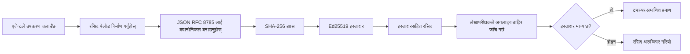
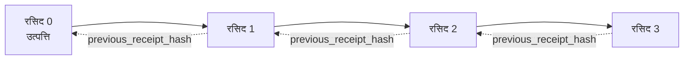

[पाठ भिडियो हेर्नुहोस्: क्रिप्टोग्राफिक रसिदहरूसँग AI एजेन्टहरू सुरक्षित बनाउने](https://youtu.be/PLACEHOLDER_VIDEO_ID)

> _(पाठ भिडियो र थम्बनेल मर्ज पछि माइक्रोसफ्ट सामग्री टोलीले थप्नेछ, पाठ १४ / १५ ढाँचासँग मेल खाने।)_

# क्रिप्टोग्राफिक रसिदहरूसँग AI एजेन्टहरू सुरक्षित बनाउने

## परिचय

यस पाठले समेट्नेछ:

- अनुपालन, डिबगिङ, र विश्वासका लागि AI एजेन्टहरूको अडिट ट्रेल किन महत्त्वपूर्ण छ।
- क्रिप्टोग्राफिक रसिद के हो र यो अनसाइन गरिएको लग लाइनबाट कसरी फरक छ।
- प्लेन Python मा एजेन्टको टुल कलको लागि कसरी साइन गरिएको रसिद उत्पादन गर्ने।
- कसरी रसिदलाई अफलाइन प्रमाणीकरण गर्ने र छेउफिरेको पत्ता लगाउने।
- कसरी रसिदहरू चेन गर्ने ताकि एउटा रसिद हटाउँदा वा पुन:क्रमबद्ध गर्दा चेन टुट्छ।
- रसिदहरूले के प्रमाणित गर्छ र के स्पष्ट रूपमा प्रमाणित गर्दैन।

## सिकाइ लक्षहरू

यस पाठ पूरा गरेपछि, तपाईं जान्नुहुनेछ:

- एजेन्ट क्रियाकलापहरूको प्राविधिक उत्पत्ति (cryptographic provenance) चाहिने असफलता मोडहरू पहिचान गर्ने।
- एक कैनोनिकल JSON प्यालोडमा Ed25519 साइन गरिएको रसिद कसरी उत्पादन गर्ने।
- साइनरको सार्वजनिक कुञ्जी मात्र प्रयोग गरेर रसिद स्वतन्त्र रूपमा कसरी प्रमाणीकरण गर्ने।
- संशोधन छानबिन गर्न रसिदमा परिवर्तन गरेर प्रमाणीकरण फेरि चलाएर कसरी पत्ता लगाउने।
- रसिदहरूको ह्यास-चेन गरिएको अनुक्रम कसरी बनाउने र यस चेन किन महत्त्वपूर्ण छ भन्ने बुझ्ने।
- रसिदहरूले प्रमाणित गर्ने (अट्रिब्युसन, अखण्डता, क्रम) र प्रमाणित नगर्ने (कार्रवाहीको सहीपन, नीतिको ध्वनिता) बिचको सीमा मान्यता गर्ने।

## समस्या: तपाईंको एजेन्टको अडिट ट्रेल

कल्पना गर्नुहोस् तपाईंले Contoso Travel का लागि AI एजेन्ट डिप्लोय गर्नुभएको छ। एजेन्टले ग्राहकको अनुरोध पढ्छ, फ्लाइट API कल गर्छ विकल्पहरू हेर्न, र ग्राहकको तर्फबाट सिट बुक गर्छ। पछिल्लो त्रैमासिकमा, एजेन्टले ५०,००० बुकिङहरू प्रक्रिया गर्यो।

आज एक अडिटर आउँछ। उनी एउटा साधारण प्रश्न सोध्छन्: "तपाईंको एजेन्टले के गर्यो देखाउनुहोस्।"

तपाईं आफ्नो लग फाइलहरू दिनुहुन्छ। अडिटरले ती हेर्छन् र गाह्रो प्रश्न सोध्छन्: "मैले कसरी जान्न सक्छु यी लग सम्पादन नगरिएका हुन्?"

यो अडिट ट्रेल समस्या हो। आज अधिकांश एजेन्ट डिप्लोयमेन्टले भर पर्छन्:

- **एप्लिकेशन लगहरू**: एजेन्ट आफैंले लेखेको, जो कोहीलाई फाइल सिस्टम पहुँच भएकाले सम्पादन गर्न मिल्छ।
- **क्लाउड लग सेवा**: प्लेटफर्म स्तरमा छेउफिर देखिने तर अडिटरले प्लेटफर्म अपरेटरलाई मात्र भरोसा गरेमा मात्रै।
- **डेटाबेस ट्रान्जेक्शन लगहरू**: डेटाबेस परिवर्तनहरूका लागि उपयुक्त तर मनमानी टुल कलहरूको लागि होइन।

यीमध्ये कुनै पनि अडिटरको प्रश्नलाई उत्तर दिन सक्दैनन् बिना अडिटरले कसैमा भरोसा गर्नुपर्ने (तपाईंमा, तपाईंको क्लाउड प्रदायकमा, तपाईंको डेटाबेस विक्रेता मा)। आन्तरिक प्रयोगका लागि त्यो भरोसा प्रायः स्वीकार्य हुन्छ। नियमन गरिएका कार्यभारहरू (वित्त, स्वास्थ्य सेवा, EU AI एक्ट अन्तर्गत) को लागि होइन।

क्रिप्टोग्राफिक रसिदहरूले यसो गर्दछन् - प्रत्येक एजेन्ट क्रिया स्वतन्त्र प्रमाणीकरणयोग्य हुन्छ। अडिटरले तपाईंमाथि भरोसा गर्न आवश्यक छैन। तिनीहरूलाई केवल तपाईंको सार्वजनिक कुञ्जी र रसिद चाहिन्छ।

## क्रिप्टोग्राफिक रसिद के हो?

रसिद एउटा JSON वस्तु हो जुन एजेन्टले के गर्यो भनेर रेकर्ड गर्दछ, डिजिटल हस्ताक्षर सहित।


  
एक न्यूनतम रसिद यसरी देखिन्छ:  

```json
{
  "type": "agent.tool_call.v1",
  "agent_id": "contoso-travel-bot",
  "tool_name": "lookup_flights",
  "tool_args_hash": "sha256:a3f9c1...",
  "result_hash": "sha256:7b2e1d...",
  "policy_id": "contoso-travel-policy-v3",
  "timestamp": "2026-04-25T14:30:00Z",
  "sequence": 47,
  "previous_receipt_hash": "sha256:9d4e6a...",
  "signature": {
    "alg": "EdDSA",
    "sig": "c5af83...",
    "public_key": "8f3b2c..."
  }
}
```
  
तीन गुणहरू काम गरिरहेका छन्:

1. **हस्ताक्षर**। रसिद एजेन्टको गेटवेले Ed25519 निजी कुञ्जीको प्रयोगले हस्ताक्षर गरेको हुन्छ। सम्बन्धित सार्वजनिक कुञ्जी भएकोले जो कोहीले पनि आफ़लाइन हस्ताक्षर प्रमाणीकरण गर्न सक्छ। कुनै पनि फिल्डमा छेउफिरेकोले हस्ताक्षर अवैध हुन्छ।

2. **क्यानोनिकल एनकोडिङ**। हस्ताक्षर गर्नु अघि, रसिद JSON क्यानोनिकलाइजेशन स्किम (JCS, RFC ८७८५) प्रयोग गरेर सिरियलाइज हुन्छ। यसले दुई फरक इम्प्लिमेन्टेसनहरूले एउटै तार्किक रसिदका लागि बिट्स समान बनाउन सुनिश्चित गर्दछ। क्यानोनिकलाइजेशन बिना, फरक JSON सिरियलाइजर्सले एउटै सामग्रीका लागि फरक हस्ताक्षर उत्पादन गर्थे।

3. **ह्यास चेनिङ**। `previous_receipt_hash` फिल्डले प्रत्येक रसिदलाई अघिल्लो रसिदसँग लिंक गर्छ। रसिद हटाए वा पुन:क्रमबद्ध गरेमा त्यसपछि आएका सबै रसिद टुट्छन्। हस्ताक्षर छली गरे पनि चेन स्तरमा छेउफिरे देखिन्छ।

यी गुणहरू मिलेर तीन ग्यारेन्टी दिन्छन्:

- **अट्रिब्युसन**: यस कुञ्जीले यो सामग्रीमा हस्ताक्षर गरेको।
- **अखण्डता**: सामग्री हस्ताक्षर गरेदेखि परिवर्तन भएको छैन।
- **क्रमबद्धता**: यो रसिद चेनमा त्यो रसिदपछि आएको हो।

## Python मा रसिद उत्पादन गर्ने

रसिद उत्पादन गर्न विशेष पुस्तकालय आवश्यक छैन। क्रिप्टोग्राफिक प्रिमिटिभहरू धेरै उपलब्ध छन् र लॉजिक केही दर्जन पंक्तिमा Python मा लेख्न सकिन्छ।

`code_samples/18-signed-receipts.ipynb` मा हात-उठाएर गर्ने अभ्यासहरूले पूर्ण प्रवाह देखाउँछन्। संक्षेपमा:

```python
import json
import hashlib
import base64
from nacl import signing
from jcs import canonicalize  # RFC 8785 क्यानोनिकल JSON

def b64url_nopad(data: bytes) -> str:
    return base64.urlsafe_b64encode(data).decode("ascii").rstrip("=")

def sha256_canonical(obj) -> str:
    """SHA-256 of a Python object's JCS-canonical JSON form."""
    return f"sha256:{hashlib.sha256(canonicalize(obj)).hexdigest()}"

# एक साइनिङ कुञ्जी उत्पन्न वा लोड गर्नुहोस् (उत्पादनमा, कुञ्जी खजानामा राख्नुहोस्)
signing_key = signing.SigningKey.generate()
verify_key = signing_key.verify_key

# रसिद प्यालोड तयार गर्नुहोस् (अझै सिग्नेचर छैन)
tool_args = {"origin": "SYD", "destination": "LAX"}
tool_result = [{"flight": "QF11", "price": 1850, "stops": 0}]

payload = {
    "type": "agent.tool_call.v1",
    "agent_id": "contoso-travel-bot",
    "tool_name": "lookup_flights",
    "tool_args_hash": sha256_canonical(tool_args),
    "result_hash": sha256_canonical(tool_result),
    "policy_id": "contoso-travel-policy-v3",
    "timestamp": "2026-04-25T14:30:00Z",
    "sequence": 0,
    "previous_receipt_hash": None,
}

# क्यानोनिकलाइज गर्नुहोस्, हैश गर्नुहोस्, साइन गर्नुहोस्।
canonical_bytes = canonicalize(payload)
message_hash = hashlib.sha256(canonical_bytes).digest()
signature_bytes = signing_key.sign(message_hash).signature

# संरचित सिग्नेचर वस्तु संलग्न गर्नुहोस्।
receipt = {
    **payload,
    "signature": {
        "alg": "EdDSA",
        "sig": b64url_nopad(signature_bytes),
        "public_key": b64url_nopad(bytes(verify_key)),
    },
}
```
  
यो सम्पूर्ण साइनिङ पाइपलाइन हो। नोटबुकमा प्रत्येक चरण विस्तारमा छ।

## रसिद प्रमाणीकरण र छेउफिरेको पत्ता लगाउने

प्रमाणीकरण उल्टो प्रक्रिया हो:

```python
import base64
import hashlib
from nacl import signing
from nacl.exceptions import BadSignatureError
from jcs import canonicalize

def b64url_decode(s: str) -> bytes:
    padding = "=" * ((4 - len(s) % 4) % 4)
    return base64.urlsafe_b64decode(s + padding)

def verify_receipt(receipt: dict) -> bool:
    # हस्ताक्षर एक संरचित वस्तु हो: {"alg", "sig", "public_key"}.
    sig_obj = receipt.get("signature")
    if not sig_obj or sig_obj.get("alg") != "EdDSA":
        return False

    # वास्तवमा हस्ताक्षर गरिएको प्यालोड पुनर्निर्माण गर्नुहोस् (हस्ताक्षर बाहेक सबै कुरा).
    payload = {k: v for k, v in receipt.items() if k != "signature"}

    canonical_bytes = canonicalize(payload)
    message_hash = hashlib.sha256(canonical_bytes).digest()

    try:
        verify_key = signing.VerifyKey(b64url_decode(sig_obj["public_key"]))
        verify_key.verify(message_hash, b64url_decode(sig_obj["sig"]))
        return True
    except BadSignatureError:
        return False
```
  
यो फङ्सनले रसिद लिएर `True` फर्काउँछ यदि हस्ताक्षर मान्य छ भने, अन्यथा `False`। कुनै नेटवर्क कल छैन, कुनै सेवा आश्रितता छैन, कुनै तेस्रो पक्षमा भरोसा आवश्यक छैन।

छेउफिरे पत्ता लगाउने लागि नोटबुकले देखाउँछ:

1. मान्य रसिद उत्पादन र प्रमाणीकरण पुष्टि।
2. `tool_args_hash` फिल्डमा एउटा बाइट परिवर्तन।
3. प्रमाणीकरण फेरि चलाएर असफल देखाउने।

यसले व्यावहारिक रूपमा देखाउँछ कि रसिदहरू छेउफिरे सबूत हुन्छन्: कुनै सानो परिवर्तनले पनि हस्ताक्षर तोड्छ।

## बहु-चरण एजेन्टहरूको लागि रसिद चेनिङ

एउटा साइन गरिएको रसिदले एक क्रिया सुरक्षा गर्दछ। रसिदहरूको चेनले अनुक्रम सुरक्षा गर्दछ।


  
प्रत्येक रसिदले अघिल्लो रसिदको ह्यास रेकर्ड गर्छ। दोस्रो रसिदलाई हर फुस्रो रूपमा हटाउन हमलावरले यीमध्ये एक गर्नुपर्नेछ:

- रसिद ३ को `previous_receipt_hash` फिल्ड परिवर्तन गर्ने (रसिद ३ को हस्ताक्षर तोडिन्छ), वा
- परिवर्तन गरिएको रसिद ३ मा नयाँ हस्ताक्षर बनाउने (एजेन्टको निजी कुञ्जी चाहिन्छ)।

यदि निजी कुञ्जी हार्डवेयर कुञ्जी भल्टमा छ र तपाईंले प्रत्येक रसिदसँग सार्वजनिक कुञ्जी प्रकाशित गर्नुहुन्छ भने यी कुनै पनि हमलावर पत्ता नलाग्न नसक्ने छन्।

नोटबुकले देखाउँछ:

1. तीन रसिदको चेन बनाउने।
2. प्रत्येक रसिदको `previous_receipt_hash` अघिल्लो रसिदको वास्तविक ह्याससँग मेल खाने पुष्टि गर्ने।
3. मध्ये एउटा रसिदमा छेउफिरे गर्ने र चेन क्लिकन कसरी तत्तिएन त्यो देखाउने।

यसरी तपाईंले बाह्य अडिटरले विश्वास नगरिकन प्रमाणीकरण गर्न सक्ने अडिट ट्रेल उत्पादन गर्नुहुन्छ।

## रसिदहरूले के प्रमाणित गर्छन् (र के गर्दैनन्)

यो यस पाठको सबैभन्दा महत्त्वपूर्ण भाग हो। रसिदहरू शक्तिशाली छन् तर तिनीहरूको शक्ति सीमित छ।

**रसिदहरूले तीन कुरा प्रमाणित गर्छन्:**

1. **अट्रिब्युसन**: एउटा विशिष्ट कुञ्जीले विशिष्ट प्यालोडमा हस्ताक्षर गर्यो।
2. **अखण्डता**: प्यालोड हस्ताक्षरदेखि परिवर्तन भएको छैन।
3. **क्रमबद्धता**: यो रसिद चेनमा त्यो रसिदपछि आएको छ।

**रसिदहरूले प्रमाणित गर्दैनन्:**

1. **सहीपन**: एजेन्टको क्रिया सहि थियो भन्ने। गलत जवाफको लागि पनि रसिद उस्तै रूपमा साइन गर्न सकिन्छ।
2. **नीति अनुपालन**: `policy_id` मा देखाइएको नीति साँच्चिकै मूल्यांकन भयो वा यो क्रियालाई अनुमति दिन्थ्यो कि छैन। रसिदले दावी गरिएको कुरा मात्र रेकर्ड गर्छ, जुन लागू भएको होइन।
3. **कुञ्जी बाहेक पहिचान**: रसिदले भन्छ "यो कुञ्जीले यो सामग्रीलाई हस्ताक्षर गर्‍यो।" यो भन्दैन "यो मानिसले अनुमति दियो।" कुञ्जीलाई व्यक्ति वा संस्थासँग जोड्न छुट्टै पहिचान पूर्वाधार चाहिन्छ।
4. **इनपुटहरूको सत्यता**: यदि एजेन्टलाई छेउफिरेको प्रॉम्प्ट प्राप्त भयो र त्यसमा क्रिया गर्‍यो भने रसिद कार्यलाई ठ्याक्कै रेकर्ड गर्छ। रसिदहरू इनपुट प्रमाणीकरणको विकल्प होइनन्, त्यो भन्दा तलको तह हुन्।

यो सीमा दुई कारणले महत्त्वपूर्ण छ:

- यसले तपाईंलाई बताउँछ रसिदहरू केको लागि उपयोगी छन्: एजेन्ट व्यवहार अडिटयोग्य र छेउफिरे सबूत बनाउन, संस्थागत सीमाना पार गरेर पनि।
- तपाईंलाई भविष्यका लागि के थप तह आवश्यक छ भनेर देखाउँछ: इनपुट प्रमाणीकरण (पाठ ६), नीति लागू (संक्षेपमा तल), र पहिचान पूर्वाधार (यस पाठमा बाहिर)।

सामान्य गल्ती हो बुझ्नु कि "हामीसँग रसिदहरू छन्" भनेको "हामी नियन्त्रित छौं"। होइन। रसिदहरू आधार हुन्। शासन (Governance) तपाईंले त्यसमा बनाउनु भएको प्रणाली हो।

## उत्पादन सन्दर्भहरू

यस पाठको Python कोड जानकार तीसरी साइड पुस्तकालय नचलाइ सबै लाइनहरू पढ्न र बुझेका हेतुले अति न्यूनतम छ। उत्पादनमा तपाईंसँग दुई विकल्प छन्:

1. **क्रिप्टोग्राफिक प्रिमिटिभहरूमा सिधै बनाउने।** माथि देखाएको ५० पंक्ति धेरै उपयोगी केसहरूका लागि पुग्छ। PyNaCl (Ed25519) र `jcs` प्याकेज (क्यानोनिकल JSON) राम्रोसँग मर्मत गरिएको र अडिट गरिएको पुस्तकालयहरू हुन्।

2. **उत्पादन रसिद पुस्तकालय प्रयोग गर्ने।** धेरै खुला स्रोत परियोजनाले त्यहि ढाँचामा थप सुविधा (कुञ्जी रोटेसन, ब्याच प्रमाणीकरण, JWK सेट वितरण, नीति इन्जिनसँग एकीकरण) कार्यान्वयन गरेका छन्:
   - यस पाठमा प्रयोग गरिएको रसिद ढाँचा IETF इन्टरनेट-ड्राफ्ट (`draft-farley-acta-signed-receipts`) मा छ र मानक प्रक्रिया अन्तर्गत छ।
   - माइक्रोसफ्ट एजेन्ट गभर्नन्स टुलकिटले Cedar आधारित नीति निर्णयहरूसँग रसिद संयोजन गर्दछ; त्यो रिपोजिटरीको ट्यूटोरियल ३३ मा पूर्ण उदाहरण हेर्नुहोस्।
   - `protect-mcp` (npm) र `@veritasacta/verify` (npm) प्याकेजहरूले रसिद हस्ताक्षर र अफलाइन प्रमाणीकरणको Node-आधारित कार्यान्वयन गर्छन्, कुनै पनि MCP सर्भरलाई छेउफिरे प्रमाणित अडिट ट्रेलमा र्‍याप गर्ने उद्देश्यले।
   - **[nobulex](https://github.com/arian-gogani/nobulex)** Python SDK (`pip install nobulex`) ले Python मा Ed25519 + JCS साइनिङ ढाँचा LangChain र CrewAI एकीकरणसहित उपलब्ध गराउँछ, प्रकाशित क्रस भ्यालिडेसन टेस्ट भेक्टर र OWASP PR #2210 मार्फत योगदान गरिएको अनुपालन नक्शासहित।

आफ्नै JWT पुस्तकालय लेख्ने र जाँचिएको प्रयोग गर्ने बीच निर्णय जस्तै, आफ्नै रसिद पुस्तकालय बनाउने वा प्रयोग गर्ने निर्णय पनि यस्तै हो: दुवै उपयुक्त; पुस्तकालयले समय बचत गर्छ र अडिट सतह घटाउँछ; तर खरोंचबाटले प्रत्येक प्रिमिटिभ बुझ्न बाध्य पार्छ। यो पाठले खरोंचबाट सिकाउने छ ताकि तपाईं दुबै बाटोका लागि आधार राख्न सक्नुहोस्।

## ज्ञान जाँच

व्यावहारिक अभ्यासमा जानुअघि आफूलाई परिक्षण गर्नुहोस्।

**१. रसिद एजेन्टको निजी Ed25519 कुञ्जीले साइन गरिएको छ। अडिटरलाई केवल सार्वजनिक कुञ्जी छ। के अडिटर रसिद अफलाइन प्रमाणीकरण गर्न सक्छ?**

<details>
<summary>उत्तर</summary>

हो। Ed25519 प्रमाणीकरणलाई केवल सार्वजनिक कुञ्जी र हस्ताक्षर गरिएको बाइटहरू चाहिन्छ। कुनै नेटवर्क कल छैन, कुनै सेवा आश्रय छैन। यो गुणले रसिदहरू एयर-ग्याप्ड, बहु-संस्थागत, वा न्यून विश्वास अडिट वातावरणमा उपयोगी बनाउँछ।
</details>

**२. एउटा हमलावरले रसिदको `policy_id` फिल्डलाई परिवर्तन गरेर बढी सहमतीय नीति दाबी गर्छ। हस्ताक्षर मूल प्यालोडमाथि छ। प्रमाणीकरण गर्दा के हुन्छ?**

<details>
<summary>उत्तर</summary>

प्रमाणीकरण असफल हुन्छ। हस्ताक्षर मूल प्यालोडको क्यानोनिकल बाइटहरूमा आधारित छ; कुनै फिल्ड परिवर्तनले क्यानोनिकल बाइटहरू परिवर्तन गर्दछ, SHA-256 ह्यास बदलिन्छ, जसले हस्ताक्षरलाई अमान्य बनाउँछ। हमलावरलाई नयाँ मान्य हस्ताक्षर बनाउन निजी कुञ्जी चाहिन्छ जुन उससँग छैन।
</details>

**३. रसिदमा `tool_args_hash` र `result_hash` राखिन्छ किन कच्चा तर्क र परिणाम होइन?**

<details>
<summary>उत्तर</summary>

दुई कारण। पहिलो, रसिदलाई आर्काइव वा प्रसारण गर्दा कच्चा सामग्री (PII, व्यवसाय डाटा) लिक हुन सक्ने वातावरणमा ह्यासले रसिद सानो र सामग्री गोप्य राख्छ; अडिटरले ह्यासलाई वास्तविक सामग्रीको अलग स्टोर गरिएको प्रतिलिपिसँग मिलाउनु पर्छ। दोस्रो, ह्यासहरूको स्थिर आकार हुन्छ; ह्यास सहितको रसिद आकार सिमित हुन्छ इनपुट र आउटपुट कति ठूलो भए पनि।
</details>

**४. `previous_receipt_hash` फिल्डले प्रत्येक रसिदलाई उसको अघिल्लो रसिदसँग जोड्छ। यदि हमलावरले चेनको बीचबाट एउटा रसिद निस्कन चुपचाप हटाउँछ भने के अमान्य हुन्छ?**

<details>
<summary>उत्तर</summary>

हटाइएको रसिदपछि आएका सबै रसिद। तिनीहरूको `previous_receipt_hash` फिल्डहरू चेनसँग मेल नखाने हुन्छन् (किनभने त्यसले उल्लेख गरेको रसिद छैन, वा चेनले अहिले भिन्न पूर्ववर्तीलाई संकेत गर्छ)। हटाउने लुकाउन हमलावरले सबै पछिल्ला रसिद पुनःहस्ताक्षर गर्नुपर्छ, जसलाई निजी कुञ्जी चाहिन्छ।
</details>

**५. रसिद सफा प्रमाणीकरण हुन्छ भने के त्यो एजेन्टको क्रिया सही, ध्वनि, वा नीतिमार्फत अनुपालक थियो प्रमाणित गर्छ?**

<details>
<summary>उत्तर</summary>

होइन। मान्य रसिदले तीन कुराको प्रमाणित गर्छ: अट्रिब्युसन (यो कुञ्जीले सामग्रीमा हस्ताक्षर गर्यो), अखण्डता (सामग्री परिवर्तन भएको छैन), र क्रमबद्धता (यसले त्यो रसिदपछि आएको हो)। यसले क्रियाको सहीपन, `policy_id` मा नामिएको नीतिको मूल्यांकन, वा एजेन्टले सबै नियम पालना गरेको प्रमाणित गर्दैन। रसिदहरूले एजेन्ट व्यवहार अडिटयोग्य बनाउँछन्, जरूरी छैन सहि बनाउने। यो पाठको सबैभन्दा महत्त्वपूर्ण सीमा हो।
</details>

## अभ्यास अभ्यास

`code_samples/18-signed-receipts.ipynb` खोली सबै चार खण्डहरू पूरा गर्नुहोस्:

1. **खण्ड १**: आफ्नो पहिलो रसिद साइन गर्नुहोस् र प्रमाणीकरण गर्नुहोस्।
2. **खण्ड २**: रसिदमा छेउफिरे गर्नुहोस् र प्रमाणीकरण असफल देख्नुहोस्।
3. **खण्ड ३**: तीन रसिदको चेन बनाउनुहोस् र चेन अखण्डता प्रमाणीकरण गर्नुहोस्।
4. **खण्ड ४**: माइक्रोसफ्ट एजेन्ट फ्रेमवर्कमा बनेको एजेन्टमा ढाँचा लागू गर्नुहोस्: टुल कललाई रसिद-साइनिङ गरी व्र्याप गर्नुहोस्, त्यसपछि रसिदलाई स्वतन्त्र रूपमा प्रमाणीकरण गर्नुहोस्।
**Stretch challenge 1:** आफैँले रोजेको थप फिल्डसहित रसीद स्कीमा विस्तार गर्नुहोस् (उदाहरणका लागि, ट्रेसिङका लागि अनुरोध आईडी), क्यानोनिकल साइनिङ लॉजिकलाई यसमा समावेश गर्ने गरी अपडेट गर्नुहोस्, र पुष्टि गर्नुहोस् कि रसीद अझै पनि प्रमाणीकरणमार्फत राउन्ड-ट्रिप गर्छ। त्यसपछि साइनिङपछि फिल्डलाई परिवर्तन गर्नुहोस् र पुष्टि गर्नुहोस् कि प्रमाणीकरण असफल हुन्छ। यसले तपाईंलाई बुझ्न बाध्य पार्छ कि क्यानोनिकल इन्कोडिङका प्रत्येक बाइटले हस्ताक्षरमा कसरी योगदान पुर्‍याउछ।

**Stretch challenge 2:** तपाईंका दुई रसीदहरूलाई SHA-256 ह्यास गरेर सँगै जोड्नुहोस् (उनीहरूको क्यानोनिकल बाइटहरू निश्चित क्रममा जोड्नुहोस्) र परिणामस्वरूप प्राप्त डाइजेस्टलाई तेस्रो रसीदमा नयाँ फिल्डको रूपमा साइन गर्ने अघि एम्बेड गर्नुहोस्। सबै तीन रसीदहरू अझै पनि राउन्ड-ट्रिप हुने पुष्टि गर्नुहोस्। तपाईंले भर्खर एक-चरण समावेशन प्रमाण बनाएका हुनुहुन्छ: तेस्रो रसीदधारीले प्रमाणित गर्न सक्छ कि पहिलो दुईहरू साइन भएको समयमा अस्तित्वमा थिए, तिनीहरूको सामग्रीहरू देखाउन आवश्यक नपरी। यो नै पैटर्न हो जुन चयनात्मक-प्रकटीकरण रसीदहरूले ठूला स्तरमा प्रयोग गर्छन् (Merkle commitments, RFC 6962)।

## निष्कर्ष

क्रिप्टोग्राफिक रसीदहरूले AI एजेन्टहरूलाई निम्न विशेषताहरु भएको अडिट ट्रेल दिन्छ:

- **स्वतन्त्र रूपमा प्रमाणीकरण गर्न मिल्ने**: कुनै पनि पक्षसँग सार्वजनिक कुञ्जी भएमा प्रमाणीकरण गर्न सक्छ, कुनै सेवा निर्भरता छैन।
- **चोरी-छलसफलता स्पष्ट गर्ने**: कुनै पनि संशोधनले हस्ताक्षर अमान्य बनाउँछ।
- **पोर्टेबल**: रसीद सानो JSON फाइल हो; यसलाई संग्रह गर्न, प्रसारित गर्न र कुनै पनि ठाउँमा प्रमाणीकरण गर्न सकिन्छ।
- **मानकसँग मेल खाने**: Ed25519 (RFC 8032), JCS (RFC 8785), र SHA-256 मा आधारित, ती सबै व्यापक रूपमा प्रयोग हुने प्रिमिटिभहरू हुन्।

यी इनपुट प्रमाणीकरण, नीति पालन, वा पहिचान पूर्वाधारको विकल्प होइनन्। यी तहहरूको आधारशिला हुन्। जब तपाईं नियन्त्रित कार्यभार, बहु-संगठन कार्यप्रवाह वा कुनै पनि यस्तो सेटिङमा एजेन्टहरू तैनाथ गर्दै हुनुहुन्छ जहाँ भविष्यका अडिटरहरूले तपाईंलाई विश्वास गर्न सक्ने अपेक्षा गर्न सकिंदैन, रसीदहरूले तपाईंलाई अडिट ट्रेललाई ईमानदार बनाउन सहयोग पुर्‍याउँछन्।

सबैभन्दा महत्त्वपूर्ण कुरा: रसीदहरूले प्रमाणित गर्छन् कि कसले के भने, कहिले। तिनीहरूले प्रमाणित गर्दैनन् कि भनिएको कुरा सत्य वा सही थियो। त्यो भेदलाई कडाइका साथ समात्नुहोस्। यो एक ईमानदार प्राविणता प्रणाली र भ्रामक प्रणाली बीचको भिन्नता हो।

## उत्पादन सूची

जब तपाईं यो पाठ्यक्रमबाट ग्राजुएट भएर वास्तविक वातावरणमा रसीद-हस्ताक्षर गरिएका एजेन्टहरू तैनाथ गर्न तयार हुनुहुन्छ:

- [ ] **डिभेलपर ल्यापटपबाट साइनिङ कुञ्जी स्थानान्तरण गर्नुहोस्।** Azure Key Vault, AWS KMS, वा हार्डवेयर सुरक्षा मोड्युल प्रयोग गर्नुहोस्। तपाईंका रसीदहरू साइन गर्ने निजी कुञ्जी कहिल्यै स्रोत नियन्त्रण वा एप्लिकेशन मेसिनहरूमा प्लेनटेक्स्टमा बस्नु हुँदैन।
- [ ] **प्रमाणीकरण सार्वजनिक कुञ्जी प्रकाशित गर्नुहोस्।** अडिटरहरूले अफलाइन प्रमाणीकरण गर्न आवश्यक पर्छ। मानक ढाँचा JWK सेट हो जुन प्रसिद्ध URL मा राखिन्छ (RFC 7517), जस्तै `https://your-org.example.com/.well-known/agent-keys.json`।
- [ ] **श्रृंखला बाहिरी रूपमा एंकर गर्नुहोस्।** समय समयमा नवीनतम श्रृंखला हेड ह्यासलाई ट्रान्सपरेन्सी लगमा लेख्नुहोस् (Sigstore Rekor, RFC 3161 टाइमस्ट्याम्प प्राधिकरण, वा दोस्रो आन्तरिक प्रणाली) ताकि बाहिरी पक्षले "यो श्रृंखला त्यस समयमा अवस्थित थियो" पुष्टि गर्न सकून्।
- [ ] **रसीदहरू अक्षित रूपमा भण्डारण गर्नुहोस्।** केवल थप्ने ब्लब भण्डारण (Azure Storage with immutability policies, AWS S3 Object Lock) भण्डारण तहमा इतिहास पुनःलेखन गर्न रोक्छ।
- [ ] **धारणाको निर्णय गर्नुहोस्।** धेरै अनुपालन नियमहरूले बहुवर्षीय धारणाको आवश्यकता राख्छन्। रसीद वृद्धिको योजना बनाउनुहोस् (हरेक रसीद लगभग ५०० बाइट; दैनिक १० हजार कल गर्ने एजेन्टले वार्षिक लगभग १.८ GB उत्पादन गर्छ)।
- [ ] **रसीदहरूले के कवर गर्दैनन् स्पष्ट गर्नुहोस्।** रसीदले स्वामित्व, अखण्डता, र क्रम पुष्टि गर्छ। तपाईंको रनबुकले स्पष्ट रूपमा देखाउनु पर्छ कि के अतिरिक्त नियन्त्रणहरू (इनपुट प्रमाणीकरण, नीति पालन, दर सीमांकन, पहिचान पूर्वाधार) तपाईंको शासनको अवस्थामा रसीदसंगै छन्।

### AI एजेन्टहरूलाई सुरक्षित राख्न थप प्रश्नहरू छन्?

[Microsoft Foundry Discord](https://aka.ms/ai-agents/discord) मा सामेल हुनुहोस् अन्य सिक्नेलाई भेट्न, अफिस आवरमा भाग लिन, र तपाईंका AI एजेन्ट प्रश्नहरूको जवाफ पाउन।

## यो पाठ्यक्रम भन्दा पर

यो पाठ्यक्रम एकल-रसीद साइनिङ र ह्यास-श्रृंखलाबद्ध सिक्वेन्स कभर गर्दछ। ती उपादानहरू तपाईंको शासन अवस्था परिपक्व हुँदा तलका धेरै उन्नत ढाँचाहरूमा संयोजन गरिन्छ:

- **चयनात्मक प्रकटीकरण।** जब रसीदका फिल्डहरू स्वतन्त्र रूपमा प्रतिबद्ध गरिन्छ (RFC 6962-शैली Merkle ट्री), तपाईं विशिष्ट फिल्डहरूलाई विशिष्ट अडिटरहरूलाई देखाउन सक्नुहुन्छ र बाँकीहरू अपरिवर्तित छन् प्रमाणित गर्न सक्नुहुन्छ बिना तिनीहरूलाई खुलासा नगरी। उपयोगी जब एउटै रसीदले समानान्तरमा समग्र अडिट (जो पूर्णता चाहन्छ) र डाटा-न्यूनतमकरण नियमहरू जस्तै GDPR (जसले कमभन्दा कम देखाउन चाहन्छ) सन्तुष्ट पार्नुपर्छ।
- **रसीद रद्दीकरण।** यदि साइनिङ कुञ्जी कमजोर भएमा, तपाईंलाई त्यो कुञ्जीले साइन गरेका सबै रसीदलाई एक निश्चित समयदेखि अविश्वसनीय मार्क गर्ने तरिका चाहिन्छ। मानक प्याटर्न: छोटो अवधिको साइनिङ कुञ्जी र प्रकाशित रद्दीकरण सूची, वा रद्दीकरण प्रविष्टिहरू सहितको ट्रान्सपरेन्सी लग।
- **द्विपक्षीय / विभाजित हस्ताक्षर रसीदहरू।** केही कार्यान्वयनहरूले साइन गरिएको पेलोडलाई पूर्व-कार्यान्वयन (`authorization_*`) र पश्चात-कार्यान्वयन (`result_*`) आधामा विभाजन गर्दछन्, स्वतन्त्र हस्ताक्षरहरूसहित, उपयोगी जब अनुमति निर्णय र अवलोकित परिणाम फरक अभिनेता वा फरक समयमा तयार हुन्छ। यसले यस पाठमा सिकाइएको रसीद ढाँचामा थप रूपमा काम गर्दछ।
- **पेलोड संयोजन।** एउटा रसीदले `result_hash` भित्र तपाईंले राखेका जुनसुकै बाइटहरूलाई सिल गर्छ। वास्तविक संसारका पेलोडहरू प्रायः एकल उपकरण कल परिणामभन्दा धनी हुन्छन्: पूर्व-निर्णय तर्क (मोडेल पूर्वानुमान, विचार गरिएका विकल्पहरू, प्रमाण र यसको पूर्णता, जोखिम स्थिति, जिम्मेवारी श्रृंखला, गेट परिणाम) सबै पेलोड भित्र बस्न सक्छन्, एउटै रसीदले सिल गरेको। यसले रसीद ढाँचालाई न्यूनतम राख्छ जब कि पेलोड स्कीमाहरू डोमेन-प्रति-डोमेन विकास गर्न अनुमति दिन्छ।
- **क्रस-इम्प्लिमेन्टेसन अनुरूपता।** एउटै रसीद ढाँचाको धेरै स्वतन्त्र कार्यान्वयनहरू (Python, TypeScript, Rust, Go) साझा परीक्षण भेक्टरहरू विरुद्ध क्रस-प्रमाणीकरण गर्दछन्। तपाईंले आफ्नो कार्यान्वयन निर्माण गर्दा, प्रकाशित भेक्टरहरूसँग प्रमाणीकरणले तार तार अनुकूलता पुष्टि गर्दछ।
- **पोस्ट-क्वान्टम माइग्रेशन।** Ed25519 आज व्यापक रूपमा प्रयोग हुन्छ तर क्वान्टम-प्रतिरोधी छैन। रसीद ढाँचाले एल्गोरिथ्म-चतुराई प्रदर्शित गर्छ: `signature.alg` फिल्डले आवश्यकता पर्दा `ML-DSA-65` (NIST पोस्ट-क्वान्टम हस्ताक्षर मानक) राख्न सक्छ। कृपया संक्रमण अवधिको योजना गर्नुहोस् जहाँ रसीदहरू दुबै हस्ताक्षर गरिएका हुन्छन्।

## थप स्रोतहरू

- <a href="https://datatracker.ietf.org/doc/draft-farley-acta-signed-receipts/" target="_blank">IETF इन्टरनेट-ड्राफ्ट: मेशिन-टु-मेशिन पहुँच नियन्त्रणका लागि साइन गरिएको निर्णय रसीदहरू</a>
- <a href="https://learn.microsoft.com/azure/ai-studio/responsible-use-of-ai-overview" target="_blank">जिम्मेवार AI अवलोकन (Azure AI)</a>
- <a href="https://datatracker.ietf.org/doc/html/rfc8032" target="_blank">RFC 8032: एडवर्ड्स-वाढ़ डिजिटल हस्ताक्षर एल्गोरिदम (EdDSA)</a>
- <a href="https://datatracker.ietf.org/doc/html/rfc8785" target="_blank">RFC 8785: JSON क्यानोनिकलाइजेशन स्कीम (JCS)</a>
- <a href="https://datatracker.ietf.org/doc/html/rfc6962" target="_blank">RFC 6962: प्रमाणपत्र पारदर्शिता</a> (Merkle-ट्री संरचना जुन चयनात्मक-प्रकटीकरण रसीदहरूले प्रयोग गर्छन्)
- <a href="https://github.com/microsoft/agent-governance-toolkit/blob/main/docs/tutorials/33-offline-verifiable-receipts.md" target="_blank">Microsoft एजेन्ट गभर्नेंस टूलकिट, ट्युटोरियल ३३: अफलाइन प्रमाणीकरणयोग्य निर्णय रसीदहरू</a>
- <a href="https://github.com/ScopeBlind/agent-governance-testvectors" target="_blank">क्रस-इम्प्लिमेन्टेसन अनुरूपता परीक्षण भेक्टरहरू</a> यस पाठ्यक्रममा प्रयोग भएको रसीद ढाँचाका लागि (Apache-2.0)
- <a href="https://pynacl.readthedocs.io/" target="_blank">PyNaCl दस्तावेजीकरण</a> (Python मा Ed25519)

## अघिल्लो पाठ

[कम्प्युटर प्रयोग एजेन्टहरू निर्माण (CUA)](../15-browser-use/README.md)

## अर्को पाठ

_(शिक्षाक्रम व्यवस्थापकहरूले निर्धारण गर्ने)_

---

<!-- CO-OP TRANSLATOR DISCLAIMER START -->
**अस्वीकरण**:
यो दस्तावेज़ AI अनुवाद सेवा [Co-op Translator](https://github.com/Azure/co-op-translator) प्रयोग गरेर अनुवाद गरिएको हो। हामी सही हुन प्रयास गर्छौं, तर कृपया जानकार हुनुस् कि स्वचालित अनुवादमा त्रुटिहरू वा अशुद्धताहरू हुन सक्छन्। मूल दस्तावेज़ यसको मूल भाषामा आधिकारिक स्रोत मानिनुपर्छ। महत्वपूर्ण जानकारीका लागि व्यावसायिक मानव अनुवाद सिफारिस गरिन्छ। यस अनुवादको प्रयोगबाट उत्पन्न कुनै पनि गलत बुझाइ वा त्रुटिको लागि हामी जिम्मेवार छैनौं।
<!-- CO-OP TRANSLATOR DISCLAIMER END -->