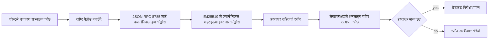
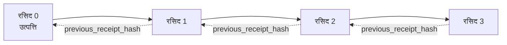

[पाठ भिडियो हेर्नुहोस्: क्रिप्टोग्राफिक रसिदहरूसँग AI एजेन्टहरू सुरक्षित गर्ने](https://youtu.be/PLACEHOLDER_VIDEO_ID)

> _(Microsoft सामग्री टोलीले विलय पछि पाठ भिडियो र थम्बनेल थप्नेछन्, पाठ १४ / १५ को ढाँचासँग मेल खाने गरी।)_

# क्रिप्टोग्राफिक रसिदहरूसँग AI एजेन्टहरू सुरक्षित गर्ने

## परिचय

यो पाठले समेट्नेछ:

- AI एजेन्टहरूका लागि अडिट ट्रेल किन अनुपालन, डिबगिङ, र विश्वासका लागि महत्वपूर्ण छन्।
- क्रिप्टोग्राफिक रसिद के हो र यो अनसाइन गरिएको लग लाइनबाट कसरी फरक छ।
- साधारण Python मा एजेन्टको उपकरण कलको लागि कसरी एउटा हस्ताक्षर गरिएको रसिद उत्पादन गर्ने।
- कसरी रसिदलाई अफलाइनमा प्रमाणित गर्ने र छेउछाउ भएको पत्ता लगाउने।
- कसरी रसिदहरूलाई जडान गर्ने ताकि एउटा हटाए वा पुनःक्रमण गर्दा श्रृंखला भंग होस्।
- रसिदहरूले के प्रमाणित गर्छन् र के स्पष्ट रूपमा प्रमाणित गर्दैनन्।

## सिक्ने लक्ष्यहरू

यो पाठ पूरा गरेपछि, तपाईं जान्न सक्षम हुनुहुनेछ:

- एजेन्ट क्रियाकलापहरूको लागि क्रिप्टोग्राफिक उत्पत्ति प्रेरित गर्ने असफलता मोडहरू पहिचान गर्ने।
- एक क्यानोनिकल JSON पेलोडमा Ed25519-हस्ताक्षरित रसिद उत्पादन गर्ने।
- हस्ताक्षरकर्ता सार्वजनिक कुञ्जी मात्र प्रयोग गरी रसिदलाई स्वतन्त्र रूपले प्रमाणित गर्ने।
- संशोधन गरिएको रसिदमा पुनः प्रमाणन गरेर छेउछाउ पत्ता लगाउने।
- रसिदहरूको एक ह्यास-श्रृंखला निर्माण गर्ने र श्रृंखलाको महत्व व्याख्या गर्ने।
- रसिदहरूले प्रमाणित गर्ने र प्रमाणित नगर्ने कुराबीचको सिमाना चिन्न सक्ने (अट्रिब्युसन, अखंडता, अर्डरिङ्ग)।

## समस्या: तपाईंको एजेन्टको अडिट ट्रेल

कल्पना गर्नुहोस् कि तपाईंले Contoso Travel का लागि एउटा AI एजेन्ट तैनाथ गर्नुभएको छ। एजेन्टले ग्राहकका अनुरोधहरू पढ्छ, उडानहरूको API कल गरी विकल्पहरू खोज्छ, र ग्राहकको तर्फबाट सिट बुक गर्छ। गत त्रैमासिकमा, एजेन्टले ५०,००० बुकिङहरू प्रशोधन गर्यो।

आज एक अडिटर आउँछन्। उनीहरूले एउटा सरल प्रश्न सोध्छन्: "तपाईंको एजेन्टले के गर्यो भनेर देखाउनुहोस्।"

तपाईं आफ्नो लग फाइलहरू दिनुहुन्छ। त्यसपछि अडिटरले गाह्रो प्रश्न सोध्छन्: "म कसरी जान्न सक्छु यी लगहरू सम्पादन नभएका हुन्?"

यही हो अडिट-ट्रेल समस्या। आजका धेरै एजेन्ट तैनाथीहरूमा भर पर्नेहरू हुन्:

- **एप्लिकेसन लग्स**: एजेन्ट आफैंले लेखेको, फाइल-फोल्डर पहुँच भएको कुनैले सम्पादन गर्न सक्ने।
- **क्लाउड लगिङ सेवाहरू**: प्लेटफर्म स्तरमा छेउछाउ देखिने तर केवल यदि अडिटरले प्लेटफर्म अपरेटरलाई विश्वास गर्छ भने।
- **डेटाबेस लेनदेन लगहरू**: डेटाबेस परिवर्तनहरूका लागि उपयुक्त तर कुनै पनि उपकरण कलका लागि होइन।

तीमध्ये कुनैले पनि अडिटरको प्रश्नको जवाफ दिन सक्दैन जबसम्म अडिटरले कसैलाई विश्वास गर्नु पर्दैन (तपाईं, तपाईंको क्लाउड प्रदायक, तपाईंको डेटाबेस विक्रेता)। आन्तरिक प्रयोगका लागि त्यो विश्वास प्रायः स्वीकार्य हुन्छ। नियमनकारी कार्यभार (वित्त, स्वास्थ्य सेवा, EU AI Act अन्तर्गत) को लागि त्यो होइन।

क्रिप्टोग्राफिक रसिदहरूले यसलाई समाधान गर्छन् जसले प्रत्येक एजेन्ट क्रियाकलापलाई स्वतन्त्र रूपमा प्रमाणित गर्न सकिने बनाउँछ। अडिटरले तपाईंलाई विश्वास गर्न पर्दैन। उनीहरूलाई मात्र तपाईंको सार्वजनिक कुञ्जी र रसिद स्वयं चाहिन्छ।

## क्रिप्टोग्राफिक रसिद के हो?

रसिद एक JSON वस्तु हो जसले एजेन्टले के गर्‍यो भनेर रेकर्ड गर्छ, डिजिटल हस्ताक्षर सहित।


```mermaid
flowchart LR
    A[एजेन्टले उपकरण सञ्चालन गर्दछ] --> B[रसीद पेलोड बनाउँदै]
    B --> C[JSON RFC 8785 लाई क्यानोनिकलाइज गर्नुहोस्]
    C --> E[Ed25519 ले क्यानोनिकल बाइटहरूमा हस्ताक्षर गर्नुहोस्]
    E --> F[हस्ताक्षर सहितको रसीद]
    F --> G[लेखापरीक्षकले अनलाइन बाहिर सत्यापन गर्दछ]
    G --> H{हस्ताक्षर मान्य छ?}
    H -- yes --> I[छेडछाड-विरोधी प्रमाण]
    H -- no --> J[रसीद अस्वीकार गरियो]
```

एउटा न्यूनतम रसिद यस प्रकार छ:

```json
{
  "type": "agent.tool_call.v1",
  "agent_id": "contoso-travel-bot",
  "tool_name": "lookup_flights",
  "tool_args_hash": "sha256:a3f9c1...",
  "result_hash": "sha256:7b2e1d...",
  "policy_id": "contoso-travel-policy-v3",
  "timestamp": "2026-04-25T14:30:00Z",
  "sequence": 47,
  "previous_receipt_hash": "sha256:9d4e6a...",
  "signature": {
    "alg": "EdDSA",
    "sig": "c5af83...",
    "public_key": "8f3b2c..."
  }
}
```

तीन गुणहरू काम गर्दैछन्:

1. **हस्ताक्षर**। रसिद एजेन्टको गेटवेमार्फत Ed25519 निजी कुञ्जी प्रयोग गरी हस्ताक्षर गरिएको छ। सम्बन्धित सार्वजनिक कुञ्जी भएकोले कुनै पनि व्यक्ति अफलाइनमा हस्ताक्षर प्रमाणित गर्न सक्छ। कुनै पनि फिल्डमा छेउछाउले हस्ताक्षर अमान्य बनाउँछ।

2. **क्यानोनिकल इन्कोडिङ**। हस्ताक्षर गर्नु अघि, रसिद JSON Canonicalization Scheme (JCS, RFC 8785) प्रयोग गरी सिरियलाइज गरिन्छ। यसले सुनिश्चित गर्छ कि एउटै तार्किक रसिद दुईवटा कार्यान्वयनले बाइट-उस्तै उत्पादन गर्छ। क्यानोनिकलाइजेशन विना, फरक JSON सिरीयलाइजर्सले एउटै सामग्रीका लागि फरक हस्ताक्षर उत्पादन गर्ने थिए।

3. **ह्यास चेनिङ**। `previous_receipt_hash` फिल्डले हरेक रसिदलाई अघिल्लो रसिदसँग जडान गर्छ। एउटा रसिद हटाउनु वा पुन:क्रमण गर्नु भनेको त्यसपछि आएका प्रत्येक रसिद भंग हुनु हो। छेउछाउ श्रृंखला स्तरमा समेत देख्छ, भले व्यक्तिगत हस्ताक्षरहरू छलेसकिएको भए पनि।

यी गुणहरूले तीन ग्यारेन्टीहरू प्रदान गर्छन्:

- **अट्रिब्युसन**: यो कुञ्जीले यो सामग्रीलाई हस्ताक्षर गरेको छ।
- **अखंडता**: सामग्री हस्ताक्षर पछि परिवर्तन भएको छैन।
- **क्रमबद्धता**: यो रसिद त्यो रसिद पछि श्रृंखलामा आएको हो।

## Python मा रसिद उत्पादन गर्ने

रसिद उत्पादन गर्न कुनै विशेष लाइब्रेरी आवश्यक छैन। क्रिप्टोग्राफिक प्रिमिटिभहरू व्यापक रूपमा उपलब्ध छन् र तर्क केवल केही दर्जन Python कोडको पंक्ति हो।

`code_samples/18-signed-receipts.ipynb` मा व्यावहारिक अभ्यासले पूर्ण प्रवाह देखाउँछ। संक्षेप संस्करण:

```python
import json
import hashlib
import base64
from nacl import signing
from jcs import canonicalize  # RFC 8785 क्यानोनिकल JSON

def b64url_nopad(data: bytes) -> str:
    return base64.urlsafe_b64encode(data).decode("ascii").rstrip("=")

def sha256_canonical(obj) -> str:
    """SHA-256 of a Python object's JCS-canonical JSON form."""
    return f"sha256:{hashlib.sha256(canonicalize(obj)).hexdigest()}"

# साइनिङ कुञ्जी सिर्जना गर्नुहोस् वा लोड गर्नुहोस् (उत्पादनमा, कुञ्जी भल्टमा स्टोर गर्नुहोस्)
signing_key = signing.SigningKey.generate()
verify_key = signing_key.verify_key

# रसीद पेलोड निर्माण गर्नुहोस् (अझै हस्ताक्षर छैन)
tool_args = {"origin": "SYD", "destination": "LAX"}
tool_result = [{"flight": "QF11", "price": 1850, "stops": 0}]

payload = {
    "type": "agent.tool_call.v1",
    "agent_id": "contoso-travel-bot",
    "tool_name": "lookup_flights",
    "tool_args_hash": sha256_canonical(tool_args),
    "result_hash": sha256_canonical(tool_result),
    "policy_id": "contoso-travel-policy-v3",
    "timestamp": "2026-04-25T14:30:00Z",
    "sequence": 0,
    "previous_receipt_hash": None,
}

# JCS बाइटहरू सिधै क्यानोनिकलाइज र हस्ताक्षर गर्नुहोस्। PureEdDSA भित्रिक रूपमा ह्यास गर्दछ।
canonical_bytes = canonicalize(payload)
signature_bytes = signing_key.sign(canonical_bytes).signature

# संरचित हस्ताक्षर वस्तु संलग्न गर्नुहोस्।
receipt = {
    **payload,
    "signature": {
        "alg": "EdDSA",
        "sig": b64url_nopad(signature_bytes),
        "public_key": b64url_nopad(bytes(verify_key)),
    },
}
```

त्यो सम्पूर्ण हस्ताक्षर पाइपलाइन हो। नोटबुकका अभ्यासहरूले हरेक कदम देखाउँछन्।

## रसिद प्रमाणित गर्ने र छेउछाउ पत्ता लगाउने

प्रमाणन यसको प्रतिलोम प्रक्रिया हो:

```python
import base64
import hashlib
from nacl import signing
from nacl.exceptions import BadSignatureError
from jcs import canonicalize

def b64url_decode(s: str) -> bytes:
    padding = "=" * ((4 - len(s) % 4) % 4)
    return base64.urlsafe_b64decode(s + padding)

def verify_receipt(receipt: dict) -> bool:
    # हस्ताक्षर एक संरचित वस्तु हो: {"alg", "sig", "public_key"}।
    sig_obj = receipt.get("signature")
    if not sig_obj or sig_obj.get("alg") != "EdDSA":
        return False

    # वास्तवमै हस्ताक्षर गरिएको payload पुनर्निर्माण गर्नुहोस् (हस्ताक्षर बाहेक सबै)।
    payload = {k: v for k, v in receipt.items() if k != "signature"}

    canonical_bytes = canonicalize(payload)

    try:
        verify_key = signing.VerifyKey(b64url_decode(sig_obj["public_key"]))
        verify_key.verify(canonical_bytes, b64url_decode(sig_obj["sig"]))
        return True
    except BadSignatureError:
        return False
```

यो फङ्सनले रसिद लिन्छ र यदि हस्ताक्षर मान्य छ भने `True`, नभए `False` फर्काउँछ। कुनै नेटवर्क कल, सेवा निर्भरता छैन, कुनै तेस्रो पक्षमा विश्वास आवश्यक छैन।

छेउछाउ पत्ता लगाउन नोटबुकले चरणहरू देखाउँछ:

1. मान्य रसिद उत्पादन गर्ने र त्यसको प्रमाणित हुने पुष्टि गर्ने।
2. `tool_args_hash` फिल्डको एउटा बाइट संशोधन गर्ने।
3. पुनः प्रमाणन गर्ने र असफल देख्ने।

यो व्यावहारिक प्रदर्शन हो कि रसिदहरू छेउछाउ देखाउने हुन्छन्: कुनै पनि परिवर्तन, जतिसुकै सानो, हस्ताक्षर भंग हुन्छ।

## बहु-क्रम एजेन्टका लागि रसिदहरू जडान गर्ने

एउटा हस्ताक्षर गरिएको रसिदले एउटा क्रियापालन सुरक्षित गर्छ। रसिदहरूको श्रृंखलाले अनुक्रम सुरक्षित गर्छ।


```mermaid
flowchart LR
    R0[रसिद 0<br/>उत्पत्ति] --> R1[रसिद 1]
    R1 --> R2[रसिद 2]
    R2 --> R3[रसिद 3]
    R1 -. previous_receipt_hash .-> R0
    R2 -. previous_receipt_hash .-> R1
    R3 -. previous_receipt_hash .-> R2
```

प्रत्येक रसिदले पहिलेको रसिदको ह्यास रेकर्ड गर्छ। रसिद २लाई चुपचाप हटाउन, आक्रमणकारीले:

- रसिद ३ को `previous_receipt_hash` फिल्ड संशोधन गर्ने (रसिद ३ को हस्ताक्षर भंग हुन्छ), वा
- संशोधित रसिद ३ मा नयाँ हस्ताक्षर बनाउने (एजेन्टको निजी कुञ्जी आवश्यक हुन्छ)।

यदि निजी कुञ्जी हार्डवेयर कुञ्जी भल्टमा छ र तपाईंले प्रत्येक रसिदसँग सार्वजनिक कुञ्जी प्रकाशित गर्नुहुन्छ भने, यी हरेक आक्रमण पहिचानविनै सम्भव छैन।

नोटबुकले देखाउँछ:

1. तीन रसिदहरूको श्रृंखला बनाउने।
2. प्रत्येक रसिदको `previous_receipt_hash` ले पहिलेको रसिदको वास्तविक ह्याससँग मेल खान्छ भनी प्रमाणित गर्ने।
3. मध्य भागमा एउटा रसिदसँग छेउछाउ गर्ने र श्रृंखला सोही स्थानमा फुट्ने देखाउने।

यसरी तपाईंले यस्तो अडिट ट्रेल उत्पादन गर्नुहुन्छ जुन बाह्य अडिटरले तपाईंमा विश्वास नगरी प्रमाणित गर्न सक्छ।

## रसिदहरूले के प्रमाणित गर्छन् (र के गर्दैनन्)

यो पाठको सबैभन्दा महत्वपूर्ण भाग हो। रसिदहरू शक्तिशाली छन् तर तिनीहरूको शक्ति सीमित छ।

**रसिदहरूले तीन कुरा प्रमाणित गर्छन्:**

1. **अट्रिब्युसन**: एउटा विशेष कुञ्जीले एउटा विशेष पेलोड हस्ताक्षर गरेको।
2. **अखंडता**: पेलोड हस्ताक्षर पछि परिवर्तन भएको छैन।
3. **क्रमबद्धता**: यो रसिद त्यो रसिद पछि ह्यास श्रृंखलामा आएको।

**रसिदहरूले प्रमाणित गर्दैनन्:**

1. **सहीपन**: एजेन्टको क्रियाकलाप सही थियो कि होइन। त्यही रसिद गलत जवाफका लागि पनि सफा रूपमा हस्ताक्षर गर्न सकिन्छ।
2. **नीति अनुपालन**: `policy_id` मा उल्लिखित नीतिलाई साँच्चिकै मूल्याङ्कन गरिएको हो कि होइन वा जाँच्दा यो क्रियाकलाप अनुमति दिने थियो कि होइन। रसिदले दाबी गरेको कुरा रेकर्ड गर्छ, लागू गरिएको होइन।
3. **कुञ्जीभन्दा बाहिरको पहिचान**: रसिद भन्छ "यो कुञ्जीले यो सामग्रीमा हस्ताक्षर गर्यो।" भन्छ तर "यो मान्छेले अनुमोदन गर्यो" भन्दैन। कुञ्जीलाई व्यक्ति वा संगठनसँग जोड्न अलग पहिचान संरचना (डिरेक्टरी, सार्वजनिक कुञ्जी रजिष्ट्रि, आदि) आवश्यक हुन्छ।
4. **प्रवेशहरूको सत्यता**: यदि एजेन्टले नियन्त्रित प्रॉम्प्ट पाउँछ र त्यसमा आधारित क्रिया गर्छ भने, रसिदले यो क्रियाकलापलाई विश्वासयोग्य तरिकाले रेकर्ड गर्छ। रसिदहरू इनपुट प्रमाणीकरणको पछि हुन्छन्, त्यसको विकल्प होइनन्।

यो सिमाना दुई कारणले महत्त्वपूर्ण छ:

- यसले बताउँछ रसिदहरू केका लागि उपयोगी छन्: एजेन्ट व्यवहारलाई अडिट र छेउछाउ देखिने बनाउने, संगठन सीमाहरू पार गरेर पनि।
- यसले बताउँछ के थप तहहरू आवश्यक छन्: इनपुट प्रमाणीकरण (पाठ ६), नीति कार्यान्वयन (थोरै तल समेटिएको), र पहिचान संरचना (यस पाठको दायरा बाहिर)।

सामान्य गल्ती हो सोचना कि "हामीसँग रसिदहरू छन्" भनेको "हामी शासित छौं"। त्यो होइन। रसिदहरू आधार हो। शासन प्रणाली त्यो निर्माण गर्ने प्रणाली हो।

## मान्छेले ठ्याक्कै क्रियाकलाप अनुमोदन गरेको प्रमाणित गर्ने

माथिको वस्तु ३ आफ्नै खण्डको योग्य छ: क्रियाकलाप रसिद भन्छ "यो कुञ्जीले यो सामग्री हस्ताक्षर गर्यो", कहिल्यै "मान्छेले यो अनुमोदन गर्यो" भन्दैन। उच्च जोखिमका क्रियाकलापहरू (फिर्ता, मेटाउने, वायर ट्रान्सफर) का लागि, शासन ढाँचाहरू ती अनुपस्थित वक्तव्य आवश्यक पार्न थाल्छन्, र यो त्यही प्रिमिटिभहरूबाट उत्पादन गर्न सकिन्छ जुन तपाईंले यस पाठमा पहिले नै सिक्नुभएको छ।

पछिल्लो नोटबुक `code_samples/human-authorization-receipts.ipynb` ले अर्को रसिद प्रकार थप्छ, `human.approval.v1`, उही लिफाफा ढाँचामा जस्तो पाठका रसिदहरू (टाइप गरिएको पेलोड, Ed25519 द्वारा क्यानोनिकल JCS बाइटहरूमा हस्ताक्षर गरिएको, हस्ताक्षर वस्तु हस्ताक्षर बाहिर)। नामित अनुमोदकले **पूर्ण क्यानोनिकल क्रियाकलाप र यसको डाइजेस्ट** कार्यान्वयन अघि हस्ताक्षर गर्छ; एजेन्टको क्रियाकलाप रसिदले **उही क्रियाकलाप डाइजेस्ट** र एक `parent_approval_ref`, अनुमोदनको `receipt_hash` समावेश गर्छ, त्यो लिफाफामा तपाईंले माथि बनाएको श्रृंखलाको `previous_receipt_hash` को जस्तै। एक `verify_chain` ले दुवै वस्तुहरूलाई **अलग पिन गरिएको कुञ्जी रजिष्ट्रिहरू** (अनुमोदक कुञ्जीहरू विरुद्ध एजेन्ट कुञ्जीहरू) अन्तर्गत जाँच्छ, त्यसैले कोड पथ साझा हुन्छ तर अधिकारहरू कहिल्यै हुँदैनन्।

यसले सर्तको रूपमा किन भनिन्छ: *मान्छेले यो ठ्याक्कै क्रियाकलाप अनुमोदन गर्यो, र एजेन्टले ठ्याक्कै त्यो अनुमोदित क्रियाकलाप कार्यान्वयन गर्यो।* नोटबुकका अस्वीकृत गर्ने जाँचहरूले यो गुणलाई दाबीभन्दा वास्तविक बनाउँछन्:

- क्लासिक सेट: छेउछाउ, भ्रमित डिप्टी, पुन: प्ले, दुबै पक्षमा जाली कुञ्जीहरू, गलत इनपुट;
- **पुरानो सत्ता**: अझै मान्य हस्ताक्षर, अस्वीकृत किनभने नीति संस्करण सरेको, अनुमोदक कुञ्जी पिन गरिएको रजिष्ट्रिबाट हटाइएको, वा अनुमोदन अवधि समाप्त भएको;
- **डाइजेस्ट प्रतिस्थापन**: वैध रूपमा हस्ताक्षर गरिएको क्रियाकलाप रसिद जुन एक *वास्तविक* अनुमोदनलाई संकेत गर्छ जसले *भिन्न* क्यानोनिकल क्रियाकलाप बाँध्छ।

हरेक असफलता अलग कारणले अस्वीकृति जनाउँछ, त्यसैले अडिटरले पढ्दा थाहा पाउँछ कि सत्ता पुरानो भयो वा कार्यान्वयन गरिएको क्रियाकलाप परिवर्तन भयो। नोटबुकले सिकाउने नियम: हस्ताक्षरित अनुमोदन आफैले सत्ता होइन। सत्ता तब मात्र हुन्छ जब दुवै रसिदहरू कार्यान्वयन समयमा उही क्यानोनिकल क्रियाकलापमा बाँधिएका हुन्छन्। मानवीय-स्वीकृति रसिद यो पाठद्वारा परिभाषित शैक्षिक संरचना हो, `draft-farley-acta-signed-receipts` द्वारा परिभाषित रसिद प्रकार होइन।

## उत्पादन सन्दर्भहरू

यस पाठको Python कोड जान्न सजिलो बनाउन जानबुझेर न्यूनतम गरिएको छ। उत्पादनमा तपाईं सँग दुई विकल्पहरू छन्:

1. **क्रिप्टोग्राफिक प्रिमिटिभहरूमा सिधै निर्माण गर्ने।** माथि देखिएका ५० पङ्क्तिहरू धेरै प्रयोगका लागि पर्याप्त छन्। PyNaCl (Ed25519) र `jcs` प्याकेज (क्यानोनिकल JSON) राम्ररी मर्मत र अडिट गरिएका लाइब्रेरीहरू हुन्।

2. **उत्पादन रसिद लाइब्रेरी प्रयोग गर्ने।** केही ओपन-सोर्स परियोजनाहरू उही ढाँचामा थप सुविधाहरू (कुञ्जी रोटेसन, ब्याच प्रमाणिकरण, JWK सेट वितरण, नीति इन्जिनसँग एकीकरण) लागू गर्छन्:
   - हस्ताक्षर पाइपलाइनले स्वतन्त्र IETF इन्टरनेट-ड्राफ्टमा JCS र हस्ताक्षर-स्कोप कन्भेन्सनहरू प्रयोग गर्छ ([`draft-farley-acta-signed-receipts`](https://datatracker.ietf.org/doc/draft-farley-acta-signed-receipts/), संस्करण ०२)। यस पाठका सपाट शैक्षिक रसिदहरू ड्राफ्टका `{payload, signature}` लिफाफाबाट फरक छन् र कुनै मान्य कार्यान्वयनको रूपमा प्रस्तुत गरिएको छैन। ड्राफ्टले साझा अनुपालन प्याकेज सार्वजनिक गर्छ ([agent-governance-testvectors](https://github.com/ScopeBlind/agent-governance-testvectors)) यसको तार प्रारूप लक्षित कार्यान्वयनहरूको लागि।
   - Microsoft Agent Governance Toolkit ले रसिदहरूलाई Cedar-आधारित नीति निर्णयहरूसँग संयोजन गर्दछ; त्यो रिपोजिटरीमा ट्युटोरियल ३३ हेर्नुहोस् अन्तदेखि अन्तसम्मको उदाहरणका लागि।
   - `protect-mcp` (npm) र `@veritasacta/verify` (npm) प्याकेजहरूले Node-आधारित रसिद हस्ताक्षर र अफलाइन प्रमाणन कार्यान्वयन दिन्छन्, जसको उद्देश्य कुनै पनि MCP सर्भरलाई छेउछाउ देखिने अडिट ट्रेल सहित रोकेको क्रियाकलापले कार्य जारी राख्न अनुमति दिने अनुमोदन रसिद (डेस्कटप फ्लोमा WebAuthn समर्थित) सहितको प्रवाहमा प्याकेज गर्नु हो, त्यो माथिको मानवीय-अनुमोदन नोटबुकसँग उस्तै अनुमोदन-रसिद ढाँचा हो।
   - **[nobulex](https://github.com/arian-gogani/nobulex)** Python SDK (`pip install nobulex`) ले Python मा त्यसै Ed25519 + JCS हस्ताक्षर ढाँचालाई LangChain र CrewAI एकीकरणहरूसँग दिन्छ, प्रकाशित अन्तर-परीक्षण भेक्टरहरू र OWASP PR #2210 मार्फत अनुगमन म्यापिङ पनि समावेश गरेर।

आफ्नै बनाउन र लाइब्रेरी प्रयोग गर्ने निर्णयले JWT लाइब्रेरी लेख्ने वा जाँचिएका एक प्रयोग गर्ने निर्णय झैं छ: दुवै उचित छन्; लाइब्रेरीले समय बचाउँछ र अडिट सतह कम गर्छ; शून्यबाट सुरु गर्दा हरेक प्रिमिटिभ बुझ्न बाध्य पार्छ। यो पाठले शून्यबाट सिकाउने बाटो सिकाउँछ ताकि तपाईं दुवै विकल्पको आधार राख्न सक्नुहुनेछ।

## ज्ञान जाँच

व्यायाम गर्ने अघि आफ्नो बुझाइ परीक्षण गर्नुहोस्।

**१. रसिद एजेन्टको निजी Ed25519 कुञ्जी प्रयोग गरी हस्ताक्षर गरिएको छ। अडिटरलाई केवल सार्वजनिक कुञ्जी छ। के अडिटरले रसिद अफलाइन प्रमाणित गर्न सक्छ?**

<details>
<summary>उत्तर</summary>

हो। Ed25519 प्रमाणिकरणलाई केवल सार्वजनिक कुञ्जी र हस्ताक्षरित बाइट चाहिन्छ। कुनै नेटवर्क कल, सेवा निर्भरताको आवश्यक्ता छैन। यो गुणले रसिदलाई एयर-ग्याप्ड, बहु-संगठन, वा कम विश्वास भएका अडिट सेटिङहरूमा उपयोगी बनाउँछ।
</details>

**२. एक आक्रमणकारीले रसिदको `policy_id` फिल्ड परिवर्तन गरेर दाबी गर्छ कि यो बढी अनुमति दिने नीतिद्वारा शासित थियो। हस्ताक्षर मूल पेलोडमा थियो। प्रमाणनमा के हुन्छ?**

<details>
<summary>उत्तर</summary>


प्रमाणीकरण असफल भयो। हस्ताक्षर मूल पेलोडको कनोनिकल बाइटहरूमा गणना गरिएको थियो; कुनै पनि क्षेत्र परिवर्तन गर्दा ती बाइटहरू परिवर्तन हुन्छन्, जसले हस्ताक्षर अमान्य बनाउँछ। आक्रमणकारीलाई नयाँ मान्य हस्ताक्षर उत्पादन गर्न निजी कुञ्जी आवश्यक पर्दछ, जुन उनीहरूसँग छैन।
</details>

**3. किन रसिदले कच्चा आर्गुमेन्टहरू र परिणामको सट्टा `tool_args_hash` र `result_hash` समावेश गर्छ?**

<details>
<summary>उत्तर</summary>

दुई कारणहरू छन्। पहिलो, रसिदलाई यस्तो वातावरणमा संग्रह गर्न वा प्रसारण गर्न आवश्यक पर्न सक्छ जहाँ कच्चा सामग्री (PII, व्यापार डेटा) चुहावट हुनु समस्या हो। ह्यासिङले रसिदलाई सानो राख्छ र सामग्रीलाई गोप्य राख्दछ; अडिटर ह्यास मिल्छ कि भनी अलग्गै सङ्ग्रह गरिएको वास्तविक सामग्रीसँग प्रमाणित गर्छ। दोस्रो, ह्यासहरूको निश्चित आकार हुन्छ; ह्यासयुक्त रसिदको आकार इनपुट र आउटपुटहरू जति ठूलो भए पनि सिमित रहन्छ।
</details>

**4. `previous_receipt_hash` फिल्डले हरेक रसिदलाई यसको पूर्ववर्ती सँग जोड्छ। यदि आक्रमणकारीले साखाको बीचबाट एक रसिद मौन रूपमा मेट्छ भने के अमान्य हुन्छ?**

<details>
<summary>उत्तर</summary>

मेटिएको रसिद पछिका हरेक रसिद। तिनीहरूको `previous_receipt_hash` फिल्डहरूले वास्तविक साखासँग मेल खाँदैन (किनभने जस रसिदलाई उनीहरूले सन्दर्भ गरेका थिए त्यो अब छैन, वा साखाले अब फरक पूर्ववर्तीमा संकेत गर्छ)। मेटाइ लुकाउन, आक्रमणकर्ताले पछि आएका हरेक रसिद पुन: हस्ताक्षर गर्नुपर्नेछ, जसका लागि निजी कुञ्जी आवश्यक हुन्छ।
</details>

**5. एउटा रसिद स्पष्ट रूपमा प्रमाणीकरण हुन्छ। के यसले एजेन्टको क्रिया सही, ठोस, वा नीतिसँग मेल खाने प्रमाणित गर्छ?**

<details>
<summary>उत्तर</summary>

होइन। एउटा मान्य रसिदले तीन कुरा प्रमाणित गर्छ: जिम्मेवारी (यो कुञ्जीले यो सामग्रीमा हस्ताक्षर गरेको छ), अखण्डता (सामग्री परिवर्तन भएको छैन), र अनुक्रमण (यो रसिद त्यो रसिद पछिको हो)। यसले क्रिया सही थियो भन्ने, `policy_id` मा नामित नीति साँच्चिकै मूल्याङ्कन गरिएको भन्ने, वा एजेन्टले हरेक नियम पालना गरेको भन्ने प्रमाणित गर्दैन। रसिदहरूले एजेन्ट व्यवहार अडिट गर्न योग्य बनाउँछन्, तर अनिवार्य रूपमा सही भने होइन। यो पाठको सबैभन्दा महत्वपूर्ण सीमा हो।
</details>

## अभ्यास अभ्यास

`code_samples/18-signed-receipts.ipynb` खोल्नुहोस् र सबै चार भागहरू पूरा गर्नुहोस्:

1. **भाग 1**: तपाईंको पहिलो रसिदमा हस्ताक्षर गर्नुहोस् र प्रमाणीकरण गर्नुहोस्।
2. **भाग 2**: रसिदसँग छेडछाड गर्नुहोस् र प्रमाणीकरण असफल हुने अवलोकन गर्नुहोस्।
3. **भाग 3**: तीन रसिदको साख बनाउनुहोस् र साख अखण्डताको प्रमाणीकरण गर्नुहोस्।
4. **भाग 4**: यो ढाँचा Microsoft Agent Framework सँग बनेको एजेन्टमा लागू गर्नुहोस्: अभिलेख-हस्ताक्षरमा टुल कललाई र्याप गर्नुहोस्, त्यसपछि रसिदलाई स्वतन्त्र रूपमा प्रमाणीकरण गर्नुहोस्।

**विस्तार चुनौती 1:** रसिद स्किमामा तपाईंले रोजेको अतिरिक्त फिल्ड थप्नुहोस् (उदाहरणका लागि, ट्रेसिङका लागि अनुरोध आईडी), त्यसलाई समावेश गर्ने कनोनिकल हस्ताक्षर तर्क अपडेट गर्नुहोस्, र रसिद अझै प्रमाणीकरणबाट पार हुन्छ भनी सुनिश्चित गर्नुहोस्। त्यसपछि हस्ताक्षर पछि फिल्डलाई परिवर्तन गर्नुहोस् र प्रमाणीकरण असफल हुने पुष्ट्याउनुहोस्। यसले तपाईलाई कनोनिकल इन्कोडिङका प्रत्येक बाइटले हस्ताक्षरमा कसरी योगदान पुर्‍याउँछ बुझ्न बाध्य पार्दछ।

**विस्तार चुनौती 2:** दुई रसिदहरूको SHA-256 ह्यास एकसाथ गर्नुहोस् (कनोनिकल बाइटहरू निश्चित अनुक्रममा जोड्नुहोस्) र तेस्रो रसिदमा नयाँ फिल्डको रूपमा परिणामी डाइजेस्ट राख्नुहोस्, त्यसपछि हस्ताक्षर गर्नुहोस्। सबै तीन रसिदहरू अझै प्रमाणीकरण पार हुन्छन् भनी प्रमाणित गर्नुहोस्। तपाईंले हालै मात्र एउटा स्टेप समावेशन प्रमाण तयार गर्नुभएको छ: जसले तेस्रो रसिद समातेको छ त्यो प्रमाणित गर्न सक्छ कि पहिलो दुई रसिदहरू हस्ताक्षरको समयमा अस्तित्वमा थिए, तिनीहरूको सामग्री प्रकासित नगरी। यो त्यहि ढाँचा हो जुन चयनात्मक-प्रकटीकरण रसिदहरूले ठूलो स्केलमा प्रयोग गर्छन् (Merkle प्रतिबद्धताहरू, RFC 6962)।

## निष्कर्ष

क्रिप्टोग्राफिक रसिदहरूले AI एजेन्टहरूलाई यस्तो अडिट ट्रेल दिन्छन् जुन:

- **स्वतन्त्र रूपमा प्रमाणीकरणयोग्य**: सार्वजनिक कुञ्जीसहित कुनै पनि पक्षले प्रमाणीकरण गर्न सक्छ, सेवा निर्भरता छैन।
- **छेडछाड-प्रमाणित**: कुनै पनि संशोधनले हस्ताक्षर अमान्य बनाउँछ।
- **पोर्टेबल**: रसिद एउटा सानो JSON फाइल हो; यसलाई संग्रह, प्रसारण, र जतै प्रमाणीकरण गर्न सकिन्छ।
- **मानक-समर्थित**: Ed25519 (RFC 8032), JCS (RFC 8785), र SHA-256 मा आधारित, सबै व्यापक रूपमा प्रयोग हुने प्रिमिटिभहरू।

यी इनपुट प्रमाणीकरण, नीति कार्यान्वयन, वा पहिचान पूर्वाधारको विकल्प होइनन्। यी ती तहहरूको आधार हुन्। जब तपाईं नियन्त्रित कार्यभारहरू, बहु-संस्था कार्यप्रवाहहरू, वा भविष्यका अडिटरसँग भरोसा गर्न नसकिने कुनै पनि सेटिङमा एजेन्टहरू परिनियोजन गर्दै हुनुहुन्छ, रसिदहरूले अडिट ट्रेललाई इमानदार बनाउन मद्दत गर्छन्।

सबैभन्दा महत्वपूर्ण कुरा: रसिदहरूले प्रमाणित गर्छन् कि कोले के भन्यो, कहिले भन्यो। तिनीहरूले प्रमाणित गर्दैनन् कि भनिएको कुरा सत्य वा सही थियो। त्यो भेदलाई कडाइले समात्नुहोस्। यो इमानदार उत्पत्ति प्रणाली र भ्रमपूर्ण प्रणाली बीचको फरक हो।

## उत्पादन सूची

यो पाठबाट वास्तविक वातावरणमा रसिद-हस्ताक्षर एजेन्टहरू परिनियोजन गर्ने तयारी हुँदा:

- [ ] **हस्ताक्षर कुञ्जी विकासकर्ता ल्यापटपबाट हटाउनुहोस्।** Azure Key Vault, AWS KMS, वा हार्डवेयर सुरक्षा मोड्युल प्रयोग गर्नुहोस्। तपाईंको रसिदमा हस्ताक्षर गर्ने निजी कुञ्जी कहिल्यै सोर्स नियन्त्रणमा वा एप्लिकेशन मेसिनहरूमा सादा पाठमा बस्न हुँदैन।
- [ ] **प्रमाणीकरण सार्वजनिक कुञ्जी प्रकाशन गर्नुहोस्।** अडिटरहरूले अफलाइन प्रमाणीकरण गर्न यसलाई आवश्यक पर्छ। मानक ढाँचा JWK सेटकै रूपमा प्रख्यात URL मा हुन्छ (RFC 7517), जस्तै `https://your-org.example.com/.well-known/agent-keys.json`।
- [ ] **साखलाई बाह्य रूपमा एंकर गर्नुहोस्।** नियमित रूपमा सबैभन्दा नयाँ साखको हेड ह्यास ट्रान्सपरेंसी लगमा लेख्नुहोस् (Sigstore Rekor, RFC 3161 टाइमस्ट्याम्प प्राधिकरण, वा दोस्रो आन्तरिक प्रणाली) ताकि बाह्य पक्षले "यो साख यो समयमा अवस्थित थियो" पुष्टि गर्न सकून्।
- [ ] **रसिदहरू अपरिवर्तनीय रूपमा संग्रह गर्नुहोस्।** Append-only ब्लब स्टोरेज (Azure Storage with immutability policies, AWS S3 Object Lock) ले इनसाइडरलाई स्टोरेज तहमा इतिहास पुनर्लेखन गर्न रोक्छ।
- [ ] **धारण निर्णय गर्नुहोस्।** धेरै अनुपालन व्यवस्थाहरूले बहुवर्षिय धारण माग गर्छन्। रसिद वृद्धि योजनाबद्ध गर्नुहोस् (हरेक रसिद लगभग ५०० बाइट; दैनिक १० हजार कल गर्ने एजेन्टले वार्षिक लगभग १.८GB उत्पादन गर्दछ)।
- [ ] **रसिदले के समेट्दैन स्पष्ट पार्नुहोस्।** रसिदहरू जिम्मेवारी, अखण्डता, र अनुक्रमण प्रमाणित गर्छन्। तपाईंको रनबुकले स्पष्टरूपमा सूचीकृत गर्नुपर्छ कि थप नियन्त्रणहरू (इनपुट प्रमाणीकरण, नीति कार्यान्वयन, दर सीमाङ्कन, पहिचान पूर्वाधार) रसिदसँगै शासन स्थितिमा हुन्छन्।

### AI एजेन्टहरूको सुरक्षा सम्बन्धी थप प्रश्नहरू छन्?

[Microsoft Foundry Discord](https://aka.ms/ai-agents/discord) मा सामेल हुनुहोस् जहाँ अन्य सिक्नेहरूसँग भेटघाट गर्न, कार्यालय समयहरूमा सहभागी हुन, र AI एजेन्ट सम्बन्धी प्रश्नहरूको जवाफ पाउन सकिन्छ।

## यो पाठको बाहिर

यो पाठ एकल-रसिद हस्ताक्षर र ह्यास-साख कङ्क्षेपन समावेश गर्छ। ती प्रिमिटिभहरूले तपाईंको शासन स्थितिमा परिपक्क हुँदै जाँदा तपाईंले भेट्न सक्ने थप उन्नत ढाँचाहरू समेत निर्माण गर्छन्:

- **चयनात्मक प्रकटीकरण।** जब रसिदका फिल्डहरू स्वतंत्र रूपले प्रतिबद्ध हुन्छन् (RFC 6962 शैली Merkle रूख), तपाईं विशिष्ट फिल्डहरूलाई विशिष्ट अडिटरहरूलाई देखाउन र बाँकी अछूता छन् भनेर प्रमाणित गर्न सक्नुहुन्छ। उपयोगी जब त्यहि रसिद पूर्ण अडिट (जो पूर्णता चाहन्छ) र GDPR जस्ता डेटा-न्यूनतमता नियमहरू (जो अडिटरलाई आवश्यकभन्दा कम देखाउन चाहन्छ) दुवै पूरा गर्नुपर्दछ।
- **रसिद बर्खास्तगी।** यदि हस्ताक्षर कुञ्जी कमप्रोमाइज्ड भयो भने, तपाईंले त्यो कुञ्जीद्वारा हस्ताक्षर गरिएका सबै रसिदहरूलाई कुनै निश्चित समयमा पछि अविश्वसनीय रुपले चिन्ह लगाउने तरिका चाहिन्छ। मानक ढाँचाहरू: छोटो अवधिको हस्ताक्षर कुञ्जीहरू र प्रकाशित बर्खास्त सूची, वा ट्रान्सपरेंसी लगमा बर्खास्त प्रविष्टिहरू।
- **द्विपक्षीय / विभाजित-हस्ताक्षर रसिदहरू।** केही कार्यान्वयनहरूले पूर्व-कार्य (`authorization_*`) र पश्चात-कार्य (`result_*`) आधाहरू स्वतन्त्र हस्ताक्षरहरूसहित विभाजन गर्छन्, यो उपयोगी हुन्छ जब अनुमति निर्णय र अवलोकन परिणाम फरक अभिनेता वा फरक समयमा उत्पादन गरिन्छ। यो यस पाठमा सिकाइएको रसिद ढाँचाको माथि थपिने हुन्छ।
- **पेलोड संरचना।** रसिदले तपाईंले `result_hash` मा राखेका जुनसुकै बाइटहरू सील गर्छ। वास्तविक विश्व पेलोडहरू प्रायः एकल टुल कल परिणाम भन्दा धनी हुन्छन्: पूर्व-निर्णय तर्क (मोडेल पूर्वानुमान, विचार गरिएका विकल्पहरू, प्रमाण र यसको पूर्णता, जोखिम अवस्था, जवाफदेहिता श्रृंखला, गेट नतिजा) सबै पेलोडभित्र बस्न सक्छन्, जसलाई एकल रसिदले सील गर्छ। यसले रसिद ढाँचालाई न्यूनतम राखेर पेलोड स्किमाहरूलाई क्षेत्र-द्वारा-क्षेत्र विकास गर्न अनुमति दिन्छ।
- **पार-कार्यान्वयन अनुरूपता।** एउटै रसिद ढाँचाका धेरै स्वतन्त्र कार्यान्वयनहरू (Python, TypeScript, Rust, Go) साझा परीक्षण भेक्टरहरू विरुद्ध क्रस-प्रमाणित गर्छन्। यदि तपाईंले आफ्नै कार्यान्वयन बनाउनु भयो भने, प्रकाशित भेक्टरहरू विरुद्ध प्रमाणित गर्दा तार संगतता पक्का हुन्छ।
- **पोस्ट-क्वाण्टम माइग्रेशन।** Ed25519 आज व्यापक रूपमा प्रयोग हुन्छ तर क्वाण्टम-प्रतिरोधी छैन। रसिद ढाँचा एल्गोरिदम-लचकदार हुन्छ: `signature.alg` फिल्डले `ML-DSA-65` (NIST पोस्ट-क्वाण्टम हस्ताक्षर मानक) लिन सक्छ जब माइग्रेट गर्न आवश्यक हुन्छ। रसिदहरू दुई-हस्ताक्षर हुने संक्रमण अवधिका लागि योजना बनाउनुहोस्।

## थप स्रोतहरू

- <a href="https://datatracker.ietf.org/doc/draft-farley-acta-signed-receipts/" target="_blank">IETF इन्टरनेट-ड्राफ्ट: मेसिन-टु-मेसिन पहुँच नियन्त्रणका लागि हस्ताक्षर गरिएको निर्णय रसिदहरू</a>
- <a href="https://learn.microsoft.com/azure/ai-studio/responsible-use-of-ai-overview" target="_blank">जिम्मेवार AI अवलोकन (Azure AI)</a>
- <a href="https://datatracker.ietf.org/doc/html/rfc8032" target="_blank">RFC 8032: एड्वार्ड्स-कर브 डिजिटल हस्ताक्षर अल्गोरिदम (EdDSA)</a>
- <a href="https://datatracker.ietf.org/doc/html/rfc8785" target="_blank">RFC 8785: JSON कनोनिकलाइजेशन स्कीम (JCS)</a>
- <a href="https://datatracker.ietf.org/doc/html/rfc6962" target="_blank">RFC 6962: प्रमाणपत्र पारदर्शिता</a> (Merkle रूख निर्माण चयनात्मक-प्रकटीकरण रसिदहरूले प्रयोग गर्छन्)
- <a href="https://github.com/microsoft/agent-governance-toolkit/blob/main/docs/tutorials/33-offline-verifiable-receipts.md" target="_blank">Microsoft एजेन्ट गभर्नन्स टुलकिट, ट्युटोरियल 33: अफलाइन-प्रमाणीकरणयोग्य निर्णय रसिदहरू</a>
- <a href="https://github.com/ScopeBlind/agent-governance-testvectors" target="_blank">यस पाठमा प्रयोग गरिएको रसिद ढाँचाका लागि पार-कार्यान्वयन अनुरूपता परीक्षण भेक्टरहरू (Apache-2.0)</a>
- <a href="https://pynacl.readthedocs.io/" target="_blank">PyNaCl डकुमेन्टेशन</a> (Python मा Ed25519)

## अघिल्लो पाठ

[स्थानीय AI एजेन्टहरू सिर्जना गर्दै](../17-creating-local-ai-agents/README.md)

---

<!-- CO-OP TRANSLATOR DISCLAIMER START -->
**अस्वीकरण**:
यो दस्तावेज़ AI अनुवाद सेवा [Co-op Translator](https://github.com/Azure/co-op-translator) प्रयोग गरेर अनुवाद गरिएको हो। हामी सही हुन प्रयास गर्छौं, तर कृपया जानकार हुनुस् कि स्वचालित अनुवादमा त्रुटिहरू वा अशुद्धताहरू हुन सक्छन्। मूल दस्तावेज़ यसको मूल भाषामा आधिकारिक स्रोत मानिनुपर्छ। महत्वपूर्ण जानकारीका लागि व्यावसायिक मानव अनुवाद सिफारिस गरिन्छ। यस अनुवादको प्रयोगबाट उत्पन्न कुनै पनि गलत बुझाइ वा त्रुटिको लागि हामी जिम्मेवार छैनौं।
<!-- CO-OP TRANSLATOR DISCLAIMER END -->