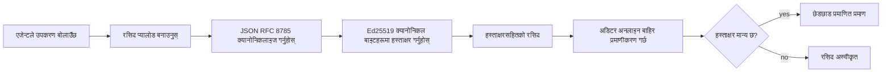
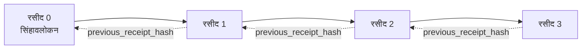

[पाठ भिडियो हेर्नुहोस्: क्रिप्टोग्राफिक रसिदहरूसँग एआई एजेन्टहरूलाई सुरक्षित बनाउने](https://youtu.be/PLACEHOLDER_VIDEO_ID)

> _(पाठ भिडियो र थम्बनेल माइक्रोसफ्ट सामग्री टोलीले मर्ज पछि थप्नेछ, पाठ १४ / १५ को ढाँचासँग मेल खाने।)_

# क्रिप्टोग्राफिक रसिदहरूसँग एआई एजेन्टहरूलाई सुरक्षित बनाउने

## परिचय

यो पाठले समेट्नेछ:

- किन एआई एजेन्टहरूको लागि अडिट ट्रेलहरू अनुपालन, डिबगिंग, र विश्वासका लागि महत्वपूर्ण हुन्छन्।
- क्रिप्टोग्राफिक रसिद के हो र यो बिना हस्ताक्षर गरिएको लग लाइनबाट कसरी फरक छ।
- एक एजेन्टको उपकरण कलको लागि सामान्य पायथनमा कसरी हस्ताक्षर गरिएको रसिद उत्पादन गर्ने।
- कसरी रसिदलाई अफलाइन प्रमाणित गर्ने र छेउछाउ हुने परिवर्तन पत्ता लगाउने।
- कसरी रसिदहरूलाई चेन गर्ने ताकि एउटा रसिद हटाउने वा पुनःक्रमबद्ध गर्नेले चेन तोड्छ।
- रसिदहरूले के प्रमाणित गर्छन् र के स्पष्ट रूपमा प्रमाणित गर्दैनन्।

## सिकाइ लक्ष्यहरू

यो पाठ पूरा गरेपछि, तपाईं जान्नु हुनेछ कि:

- ती असफलता मोडहरू पहिचान गर्ने जुन एजेन्ट कार्यहरूका लागि क्रिप्टोग्राफिक उत्पत्ति प्रेरित गर्छ।
- एक Ed25519-हस्ताक्षरित रसिद कसरी क्यानोनिकल JSON पेलोडमा उत्पादन गर्ने।
- रसिदलाई स्वतन्त्र रूपमा प्रमाणीकरण गर्ने तरिका, केवल हस्ताक्षरकर्ता को सार्वजनिक कुञ्जीसँग।
- परिवर्तनलाई पत्ता लगाउनासाठी संशोधित रसिदमा पुनः प्रमाणीकरण गर्ने।
- रसिदहरूको ह्यास-चेन गरिएको अनुक्रम निर्माण गर्ने र किन यो चेन महत्वपूर्ण छ भन्ने व्याख्या गर्ने।
- रसिदहरूले के प्रमाणित गर्छन् (अट्रिब्युसन, अखण्डता, क्रमबद्धता) र के प्रमाणित गर्दैनन् (कार्यको सहि हुनु, नीतिको ध्वनि हुनु) बीचको सीमा चिन्हारी गर्ने।

## समस्या: तपाईंको एजेन्टको अडिट ट्रेल

कल्पना गर्नुहोस् तपाईंले Contoso Travel को लागि एआई एजेन्ट तैनाथ गर्नुभएको छ। एजेन्टले ग्राहकका अनुरोधहरू पढ्छ, उडानहरूको विकल्पहरू खोज्न flights API कल गर्छ, र ग्राहकको तर्फबाट सीटहरू बुक गर्छ। पछिल्लो त्रैमासिकमा, एजेन्टले ५०,००० बुकिङ्हरू प्रशोधन गर्यो।

आज एक अडिटर आउँछ। उनी एक सरल प्रश्न गर्छन्: "तपाईंको एजेन्टले के गर्यो देखाउनुहोस्।"

तपाईंले आफ्नो लग फाइलहरू दिनुहुन्छ। अडिटरले ती हेर्छ र गम्भीर प्रश्न सोध्छ: "मलाई कसरी थाहा हुन्छ यी लगहरू परिमार्जित गरिएका छैनन्?"

यो नै अडिट-ट्रेल समस्या हो। आजको अधिकांश एजेन्ट तैनाथीहरूले भर पर्छन्:

- **एप्लिकेसन लगहरू**: एजेन्टले स्वयं लेखेका, फाइल-प्रणाली पहुँच भएका मानिसहरूले सम्पादन गर्न सक्ने।
- **क्लाउड लगिङ सेवा**: प्लेटफर्म स्तरमा छेउछाउ अवलोकन गर्न सकिने तर मात्र यदि अडिटरले प्लेटफर्म अपरेटरमा विश्वास गर्दछ भने।
- **डाटाबेस ट्रान्जेक्शन लगहरू**: डाटाबेस परिवर्तनका लागि उपयुक्त तर मनमुटावको लागि होइन।

यी मध्ये कुनै पनि अडिटरको प्रश्नको जवाफ दिन सक्दैन बिना अडिटरलाई कसैमाथि विश्वास गर्नु पर्ने (तपाईं, तपाईंको क्लाउड प्रदायक, तपाईंको डाटाबेस विक्रेता)। आन्तरिक प्रयोगका लागि त्यो विश्वास स्वीकार्य हुन्छ। नियमन गरिएको कार्यभारहरू (वित्त, स्वास्थ्य सेवा, EU AI ऐन अन्तर्गत कुनै पनि) का लागि त्यो हुँदैन।

क्रिप्टोग्राफिक रसिदहरूले हरेक एजेन्ट कार्यलाई स्वतन्त्र रूपमा प्रमाणीकरणयोग्य बनाएर यो समस्यालाई समाधान गर्छन्। अडिटरलाई तपाईंमा विश्वास गर्नु आवश्यक छैन। उनीहरुलाई केवल तपाईंको सार्वजनिक कुञ्जी र रसिद चाहिन्छ।

## क्रिप्टोग्राफिक रसिद के हो?

रसिद भनेको एक JSON वस्तु हो जसले एजेन्टले के गर्यो रेकर्ड गर्दछ, डिजिटल हस्ताक्षर सहित।


```mermaid
flowchart LR
    A[एजेन्टले उपकरण बोलाउँछ] --> B[रसिद प्यालोड बनाउनुस्]
    B --> C[JSON RFC 8785 क्यानोनिकलाइज गर्नुहोस्]
    C --> E[Ed25519 क्यानोनिकल बाइटहरूमा हस्ताक्षर गर्नुहोस्]
    E --> F[हस्ताक्षरसहितको रसिद]
    F --> G[अडिटर अनलाइन बाहिर प्रमाणीकरण गर्छ]
    G --> H{हस्ताक्षर मान्य छ?}
    H -- yes --> I[छेडछाड प्रमाणित प्रमाण]
    H -- no --> J[रसिद अस्वीकृत]
```

एक न्यूनतम रसिद यसरी देखिन्छ:

```json
{
  "type": "agent.tool_call.v1",
  "agent_id": "contoso-travel-bot",
  "tool_name": "lookup_flights",
  "tool_args_hash": "sha256:a3f9c1...",
  "result_hash": "sha256:7b2e1d...",
  "policy_id": "contoso-travel-policy-v3",
  "timestamp": "2026-04-25T14:30:00Z",
  "sequence": 47,
  "previous_receipt_hash": "sha256:9d4e6a...",
  "signature": {
    "alg": "EdDSA",
    "sig": "c5af83...",
    "public_key": "8f3b2c..."
  }
}
```

तीन विशेषताहरू ले काम गर्छन्:

१. **हस्ताक्षर**। रसिद एजेन्टको गेटवेले Ed25519 निजी कुञ्जी प्रयोग गरेर हस्ताक्षर गरेको हुन्छ। सम्बन्धित सार्वजनिक कुञ्जी भएको कुनै पनि व्यक्ति सिग्नेचरलाई अफलाइन प्रमाणित गर्न सक्छ। कुनै पनि फिल्डमा छेउछाउ हुन्छ भने सिग्नेचर अमान्य हुन्छ।

२. **क्यानोनिकल इन्कोडिङ**। हस्ताक्षर गर्नु भन्दा पहिले रसिद JSON क्यानोनिकलाइजेसन स्किम (JCS, RFC 8785) प्रयोग गरेर सिरियलाइज गरिन्छ। यसले सुनिश्चित गर्छ कि दुईवटा कार्यान्वयनहरूले एउटै तार्किक रसिदको लागि पूर्ण बाइट मिल्दोजुल्दो आउटपुट उत्पादन गर्छन्। क्यानोनिकलाइजेसन बिना, विभिन्न JSON सिरियलाइजर्सले एउटै सामग्रीका लागि फरक सिग्नेचरहरू उत्पादन गर्ने थिए।

३. **ह्यास चेनिङ**। `previous_receipt_hash` फिल्डले प्रत्येक रसिदलाई आफ्नो अघिल्लो रसिदसँग जोड्छ। एउटा रसिद हटाउनु वा पुन:क्रमबद्ध गर्नु भनेको त्यसपछि आउने हरेक रसिदलाई तोड्नु हो। छेउछाउ श्रृंखला तहमा देखिन्छ, व्यक्तिगत सिग्नेचरहरू बायपास भए पनि।

यी गुणहरूले तीन ग्यारेन्टीहरू प्रदान गर्छन्:

- **अट्रिब्युसन**: यस कुञ्जीले यो सामग्रीलाई हस्ताक्षर गर्यो।
- **अखण्डता**: सामग्री हस्ताक्षरपछि परिवर्तन भएको छैन।
- **क्रमबद्धता**: यो रसिद त्यो रसिदको चेनमा पछि आयो।

## पायथनमा रसिद उत्पादन गर्ने

रसिद उत्पादन गर्न तपाईलाई विशेष पुस्तकालय आवश्यक छैन। क्रिप्टोग्राफिक प्रिमेटिभहरू व्यापक रूपमा उपलब्ध छन् र यो तर्क पायथनका थुप्रै लकीरहरू मात्र हो।

`code_samples/18-signed-receipts.ipynb` मा प्रयोगात्मक व्यायामहरूले पूर्ण प्रक्रियालाई चरणबद्ध रूपमा देखाउँछ। सारांश संस्करण:

```python
import json
import hashlib
import base64
from nacl import signing
from jcs import canonicalize  # RFC 8785 क्यानोनिकल JSON

def b64url_nopad(data: bytes) -> str:
    return base64.urlsafe_b64encode(data).decode("ascii").rstrip("=")

def sha256_canonical(obj) -> str:
    """SHA-256 of a Python object's JCS-canonical JSON form."""
    return f"sha256:{hashlib.sha256(canonicalize(obj)).hexdigest()}"

# साइनिङ कुञ्जी उत्पादन गर्नुहोस् वा लोड गर्नुहोस् (उत्पादनमा, कुञ्जी भल्टमा भण्डारण गर्नुहोस्)
signing_key = signing.SigningKey.generate()
verify_key = signing_key.verify_key

# रसीद पेलोड निर्माण गर्नुहोस् (अझै हस्ताक्षर छैन)
tool_args = {"origin": "SYD", "destination": "LAX"}
tool_result = [{"flight": "QF11", "price": 1850, "stops": 0}]

payload = {
    "type": "agent.tool_call.v1",
    "agent_id": "contoso-travel-bot",
    "tool_name": "lookup_flights",
    "tool_args_hash": sha256_canonical(tool_args),
    "result_hash": sha256_canonical(tool_result),
    "policy_id": "contoso-travel-policy-v3",
    "timestamp": "2026-04-25T14:30:00Z",
    "sequence": 0,
    "previous_receipt_hash": None,
}

# जेसिएस बाइटहरूलाई सिधै क्यानोनिकलाइज र साइन गर्नुहोस्। PureEdDSA ले भित्री रूपमा ह्यास गर्छ।
canonical_bytes = canonicalize(payload)
signature_bytes = signing_key.sign(canonical_bytes).signature

# संरचित हस्ताक्षर वस्तु जोड्नुहोस्।
receipt = {
    **payload,
    "signature": {
        "alg": "EdDSA",
        "sig": b64url_nopad(signature_bytes),
        "public_key": b64url_nopad(bytes(verify_key)),
    },
}
```

त्यो पुरै हस्ताक्षर पाइपलाइन हो। नोटबुकको अभ्यासहरूले प्रत्येक चरणलाई विस्तारमा देखाउँछन्।

## रसिद प्रमाणीकरण र छेउछाउ पत्ता लगाउने

प्रमाणीकरण उल्टो प्रक्रिया हो:

```python
import base64
import hashlib
from nacl import signing
from nacl.exceptions import BadSignatureError
from jcs import canonicalize

def b64url_decode(s: str) -> bytes:
    padding = "=" * ((4 - len(s) % 4) % 4)
    return base64.urlsafe_b64decode(s + padding)

def verify_receipt(receipt: dict) -> bool:
    # हस्ताक्षर एक संरचित वस्तु हो: {"alg", "sig", "public_key"}।
    sig_obj = receipt.get("signature")
    if not sig_obj or sig_obj.get("alg") != "EdDSA":
        return False

    # वास्तवमै हस्ताक्षर गरिएको पेलोड पुनर्निर्माण गर्नुहोस् (हस्ताक्षर बाहेक सबै)।
    payload = {k: v for k, v in receipt.items() if k != "signature"}

    canonical_bytes = canonicalize(payload)

    try:
        verify_key = signing.VerifyKey(b64url_decode(sig_obj["public_key"]))
        verify_key.verify(canonical_bytes, b64url_decode(sig_obj["sig"]))
        return True
    except BadSignatureError:
        return False
```

यो फङ्सनले रसिद लिन्छ र सिग्नेचर मान्य भएमा `True` फिर्ता गर्छ, नभए `False`। कुनै नेटवर्क कल, कुनै सेवा निर्भरता, कुनै तेस्रो पक्षप्रति विश्वास आवश्यक छैन।

छेउछाउ पत्ता लगाउने कार्य देखाउनका लागि, नोटबुकले तलको चरणहरू देखाउँछ:

१. वैध रसिद उत्पादन गर्ने र प्रमाणीकरण फुटाउँछ भनी पुष्टि गर्ने।
२. `tool_args_hash` फिल्डको एक बाइट परिवर्तन गर्ने।
३. प्रमाणीकरण पुनः चलाउने र असफल देख्ने।

यसले प्रायोगिक रूपमा देखाउँछ कि रसिदहरू छेउछाउ प्रमाणित छन्: कुनै पनि सानो परिवर्तनले सिग्नेचर भाँच्दछ।

## बहु-चरण एजेन्टहरूका लागि रसिदहरू चेन गर्ने

एकल हस्ताक्षरित रसिदले एउटा कार्यलाई सुरक्षित बनाउँछ। रसिदहरूको चेनले अनुक्रमलाई सुरक्षित बनाउँछ।


```mermaid
flowchart LR
    R0[रसीद 0<br/>सिंहावलोकन] --> R1[रसीद 1]
    R1 --> R2[रसीद 2]
    R2 --> R3[रसीद 3]
    R1 -. previous_receipt_hash .-> R0
    R2 -. previous_receipt_hash .-> R1
    R3 -. previous_receipt_hash .-> R2
```

प्रत्येक रसिदले अघिल्लो रसिदको ह्यास रेकर्ड गर्छ। रिसिद २ लाई नदेखिने तरिकाले हटाउन आक्रमणकारीले:

- रसिद ३ को `previous_receipt_hash` फिल्डलाई परिवर्तन गर्नुपर्नेछ (रसिद ३ को सिग्नेचर टुट्छ), वा
- संशोधित रसिद ३ मा नयाँ सिग्नेचर जाली गर्नुपर्नेछ (एजेन्टको निजी कुञ्जी आवश्यक हुन्छ)।

यदि निजी कुञ्जी हार्डवेयर कुञ्जी भल्टमा छ र तपाईं हरेक रसिदसँग सार्वजनिक कुञ्जी प्रकाशित गर्नुहुन्छ भने, कुनै आक्रमण नगरीकन खुलासा हुनु गाह्रो हुन्छ।

नोटबुकको प्रयोग:

१. तीन रसिदको चेन बनाउने।
२. प्रत्येक रसिदको `previous_receipt_hash` वास्तविक अघिल्लो रसिदको ह्याससँग मेल खान्छ भनी प्रमाणित गर्ने।
३. मध्यमा एउटा रसिद छेउछाउ परिवर्तन गर्ने र चेन त्यहि बिन्दुमा भाँचिएको देख्ने।

यसरी तपाईंले यस्तो अडिट ट्रेल बनाउनुहुन्छ जुन बाह्य अडिटरले तपाईंलाई विश्वास नगरी प्रमाणित गर्न सक्छ।

## रसिदहरूले के प्रमाणित गर्छन् (र के गर्दैनन्)

यो पाठको सबैभन्दा महत्वपूर्ण भाग हो। रसिदहरू शक्तिशाली हुन्छन् तर तिनको शक्ति सीमित छ।

**रसिदहरूले तीन कुराहरू प्रमाणित गर्छन्:**

१. **अट्रिब्युसन**: एउटा विशिष्ट कुञ्जीले विशिष्ट पेलोड हस्ताक्षर गरेको।
२. **अखण्डता**: पेलोड हस्ताक्षर पछि परिवर्तन भएको छैन।
३. **क्रमबद्धता**: यो रसिद त्यो रसिदको ह्यास चेनमा पछि आयो।

**रसिदहरूले प्रमाणित गर्दैनन्:**

१. **सहीता**: एजेन्टको कार्य सहि काम थियो। गलत जवाफको लागि समेत रसिद हस्ताक्षर गर्न सकिन्छ।
२. **नीति अनुपालन**: `policy_id` मा उल्लिखित नीतिको वास्तविक मूल्यांकन भयो वा परीक्षण गर्दा अनुमति दिन्थ्यो। रसिदले के दाबी गर्छ भनेर मात्र रेकर्ड गर्दछ, के लागू भयो भनेर होइन।
३. **कुञ्जीभन्दा बाहिर पहिचान**: रसिदले भन्छ "यो कुञ्जीले यो सामग्रीलाई हस्ताक्षर गर्यो।" भन्छ "यो मान्छेले स्वीकृत गर्यो" भने हुँदैन। कुञ्जीलाई व्यक्ति वा संस्थासँग जोडेको पहिचान पूर्वाधार आवश्यक हुन्छ (डाइरेक्टरी, सार्वजनिक कुञ्जी रजिष्ट्रि आदि)।
४. **प्रविष्टिहरूको सत्यता**: यदि एजेन्टले मनमुटाव गरिएको प्रॉम्प्ट पाउँछ र त्यसमा कार्य गर्दछ, रसिदले त्यो कार्य विश्वासयोग्य तरिकाले रेकर्ड गर्छ। रसिदहरू इनपुट मान्यताको तलको तहमा छन्, विकल्प होइनन्।

यो सीमा दुई कारणले महत्वपूर्ण छ:

- यसले तपाईंलाई बताउँछ रसिदहरू केका लागि उपयोगी छन्: एजेन्ट व्यवहारलाई अडिट योग्य र छेउछाउ प्रमाणित बनाउने, यहाँ सम्म कि संस्थागत सीमाहरूमा पनि।
- यसले तपाईंलाई बताउँछ के थप तहहरू आवश्यक छन्: इनपुट मान्यता (पाठ ६), नीति कार्यान्वयन (थप व्याख्या तल), र पहिचान पूर्वाधार (यो पाठको परिधिभन्दा बाहिर)।

सामान्य गल्ती हो "हामीसँग रसिदहरू छन्" भन्ने कुरा "हामी शासन गरिरहेका छौं" भन्ने सोच्नु। हुँदैन। रसिदहरू आधार हुन्। शासन भनेको तपाईंले त्यसमा बनाउने प्रणाली हो।

## मान्छेले ठीक कार्य स्वीकृत गरेको प्रमाणित गर्ने

माथिको बुँदा ३ यसको आफ्नै खण्ड लायक छ: कार्य रसिदले भन्छ "यो कुञ्जीले यो सामग्रीलाई हस्ताक्षर गर्यो," कहिल्यै "मान्छेले स्वीकृत गर्यो" भन्दैन। उच्च जोखिमका कार्यहरूको लागि (रिफन्ड, मेटाउने, वायर ट्रान्सफर), शासन फ्रेमवर्कहरू बिस्तारै त्यो अत्यावश्यक कथन要求 गर्दछन्, र यो एउटै प्रिमेटिभहरूबाट उत्पादन गर्न सकिन्छ जुन तपाईंले यस पाठमा पहिले नै निर्माण गर्नुभयो।

पछिको नोटबुक `code_samples/human-authorization-receipts.ipynb` ले दोस्रो रसिद प्रकार थप्छ, `human.approval.v1`, पाठका रसिदहरूसँग उस्तै लिफाफा आकारमा (टाइप गरिएको पेलोड जुन Ed25519 द्वारा क्यानोनिकल JCS बाइटमा हस्ताक्षर गरिएको छ, `signature` वस्तु हस्ताक्षर गरिएको बाइटबाहिर)। नामित अनुमोदकले कार्यको पूर्ण क्यानोनिकल रूप र त्यसको ह्यासमा हस्ताक्षर गर्छ पूर्वनिर्धारित रूपमा; एजेन्टको कार्य रसिदले एउटै कार्य ह्यास र एक `parent_approval_ref` (स्वीकृतिको रसिद ह्यास), माथिको चेनमा `previous_receipt_hash` जस्तै सम्मेलन मानेको हुन्छ। एउटा `verify_chain` दुई वस्तुहरूलाई अलग-अलग कुञ्जी रजिष्ट्रिहरू (अनुमोदक कुञ्जीहरू बनाम एजेन्ट कुञ्जीहरू) अन्तर्गत चलाउँछ, त्यसैले कोड मार्ग साझा हुन्छ तर अधिकारहरू कहिल्यै साझा हुँदैनन्।

यो गुण हो जुन सावधानीपूर्वक भनिन्छ: *मान्छेले यो ठीक कार्य स्वीकृत गरे, र एजेन्टले ठीक त्यो स्वीकृत कार्य कार्यान्वयन गर्‍यो।* नोटबुकका अस्वीकृति जाँचहरूले यो गुणलाई दाबी बाट वास्तविक बनाउँछन्:

- क्लासिक सेट: छेउछाउ, भ्रमित डिप्टी, पुन:प्रेषण, दुवै पक्षमा जाली कुञ्जीहरू, खराब फारम गरिएको इनपुट;
- **अप्रचलित अधिकार**: सिग्नेचर हाल पनि प्रमाणीकरण हुन्छ, तर अस्वीकार गरिन्छ किनकि policy संस्करण सर्छ, अनुमोदक कुञ्जी रजिष्ट्रिबाट हटाइएको छ, वा स्वीकृति समाप्त भइसकेको छ;
- **डाइजेस्ट प्रतिस्थापन**: वैध रूपमा हस्ताक्षर गरिएको कार्य रसिद एक *वास्तविक* स्वीकृतिमा सङ्केत गर्दछ जुन भिन्न क्यानोनिकल कार्यसँग बाँधिएको छ।

प्रत्येक असफलता फरक कारणले अस्वीकृत हुन्छ, त्यसैले अडिटरले पढ्दा थाहा पाउँछ कि अधिकार अप्रचलित भयो वा कार्य परिवर्तन भयो। नोटबुकले सिकाउने नियम हो: हस्ताक्षर गरिएको स्वीकृति आफैंमा अधिकार होइन। अधिकार हुन्छ यदि दुई रसिदहरू अझै कार्यान्वयन समयमा एउटै क्यानोनिकल कार्यसँग बाँधिएका छन् भने मात्र। मान्छे-स्वीकृति रसिद शिक्षात्मक संरचना हो जुन यस पाठले परिभाषित गरेको हो, `draft-farley-acta-signed-receipts` द्वारा परिभाषित रसिद प्रकार होइन।

## उत्पादन सन्दर्भहरू

यस पाठको पायथन कोड जानाजानी न्यूनतम राखिएको छ ताकि तपाईं प्रत्येक लाइन पढ्न र ठीक के भइरहेको छ बुझ्न सक्नुहोस्। उत्पादनमा, तपाईंका दुई विकल्पहरू छन्:

१. **क्रिप्टोग्राफिक प्रिमेटिभहरूमा सिधै निर्माण गर्नुहोस्।** माथि उल्लेखित ५० लाइनहरू धेरै प्रयोगका लागि पर्याप्त छन्। PyNaCl (Ed25519) र `jcs` प्याकेज (क्यानोनिकल JSON) राम्रोसँग मेन्टेन्ड र अडिट गरिएको पुस्तकालयहरू हुन्।

२. **उत्पादन रसिद पुस्तकालय प्रयोग गर्नुहोस्।** विभिन्न खुला स्रोत परियोजनाहरूले थप सुविधासहित समान ढाँचा लागू गर्छन् (कुञ्जी रोटेशन, ब्याच प्रमाणीकरण, JWK सेट वितरण, नीति इञ्जिनसँग एकीकरण):
   - हस्ताक्षर पाइपलाइनले JCS र सिग्नेचर-स्कोप परम्पराहरू स्वतन्त्र IETF इण्टरनेट-ड्राफ्ट ([`draft-farley-acta-signed-receipts`](https://datatracker.ietf.org/doc/draft-farley-acta-signed-receipts/), संशोधन ०२) मा उपयोग गर्दछ। यस पाठको सरल शैक्षिक रसिद ड्राफ्टको `{payload, signature}` लिफाफाबाट फरक छ र संयोजक कार्यान्वयनको रूपमा प्रस्तुत गरिएको छैन। ड्राफ्टले यसको वायर ढाँचाका लागि कार्यान्वयनलाई साझा अनुरूपता सेट ([agent-governance-testvectors](https://github.com/ScopeBlind/agent-governance-testvectors)) प्रकाशित गर्दछ।
   - माइक्रोसफ्ट एजेन्ट गभर्नेन्स टूलकिटले रसिदहरूलाई सेडर-आधारित नीति निर्णयहरूसँग संयोजन गर्छ; त्यस रिपोजिटरीमा ट्युटोरियल ३३ मा अन्त-देखि-अन्त उदाहरण हेर्नुहोस्।
   - `protect-mcp` (npm) र `@veritasacta/verify` (npm) प्याकेजहरूले रसिद हस्ताक्षर र अफलाइन प्रमाणीकरणको नोड-आधारित कार्यान्वयन उपलब्ध गराउँछन्, जुन कुनै पनि MCP सर्भरलाई छेउछाउ प्रमाणित अडिट ट्रेलले आवरण गर्न डिजाइन गरिएको हो, रोकिएको कार्यमा अनुमोदन रसिद उत्पन्न गर्ने समावेश गरेर (डेस्कटप प्रवाहमा WebAuthn-समर्थित), मान्छे-स्वीकृति नोटबुकमा देखाइएको स्वीकृति-रसिद ढाँचासँगै।
   - **[nobulex](https://github.com/arian-gogani/nobulex)** पायथन SDK (`pip install nobulex`) ले यस्तै Ed25519 + JCS हस्ताक्षर ढाँचा पायथनमा LangChain र CrewAI एकीकरणसहित उपलब्ध गराउँछ, प्रकाशित क्रस-प्रमाणीकरण परीक्षण भेक्टरहरू र अनुपालन म्यापिङ OWSAP PR #2210 मार्फत योगदान गरिएको।

आफैं बनाउने र पुस्तकालय प्रयोग गर्ने निर्णय JWT पुस्तकालय लेख्न र परीक्षण गरिएका पुस्तकालय प्रयोग गर्ने निर्णयसँग मेल खान्छ: दुबै उचित छन्; पुस्तकालयले समय बचत गर्छ र अडिट क्षेत्र कम गर्छ; आफैंबाट लेख्दा प्रत्येक प्रिमेटिभ बुझ्न आवश्यक हुन्छ। यो पाठले आफैंबाट लेख्ने बाटो सिकाउँछ ताकि तपाईंले दुबै विकल्पमा आधार पाउन सक्नुहोस्।

## ज्ञान परीक्षण

अभ्यास गर्ने अघि आफ्नो बुझाइ परिक्षण गर्नुहोस्।

**१. रसिद एजेन्टको निजी Ed25519 कुञ्जीसँग हस्ताक्षर गरिएको छ। अडिटरले केवल सार्वजनिक कुञ्जी छ। के अडिटर रसिदलाई अफलाइन प्रमाणित गर्न सक्छ?**

<details>
<summary>उत्तर</summary>

हो। Ed25519 प्रमाणीकरणका लागि केवल सार्वजनिक कुञ्जी र हस्ताक्षरित बाइटहरू आवश्यक छन्। कुनै नेटवर्क कल, सेवा आश्रितता छैन। यो गुणले रसिदहरूलाई एयर-ग्याप गरिएको, बहु-संगठन, वा कम-विश्वास अडिट सेटिङहरूमा उपयोगी बनाउँछ।
</details>

**२. आक्रमणकारीले रसिदको `policy_id` फिल्ड संशोधन गरी दाबी गर्छ कि यो बढी अनुमति दिने नीति अन्तर्गत थियो। सिग्नेचर मूल पेलोडमा थियो। प्रमाणीकरण गर्दा के हुन्छ?**

<details>
<summary>उत्तर</summary>


प्रमाणिकरण असफल भयो। हस्ताक्षर मूल पेलोडको कानोनिकल बाइटहरूमा गणना गरिएको थियो; कुनै पनि क्षेत्र संशोधन गर्दा ती बाइटहरू परिवर्तन हुन्छन्, जसले हस्ताक्षरलाई अमान्य बनाउँछ। आक्रमणकारीलाई ताजा वैध हस्ताक्षर उत्पादन गर्न निजी कुञ्जी आवश्यक हुन्छ, जुन उनीहरूसँग छैन।
</details>

**३. रसिदमा कच्चा तर्क र नतिजा भन्दा `tool_args_hash` र `result_hash` समावेश किन गरिएको छ?**

<details>
<summary>उत्तर</summary>

दुई कारणहरू। पहिलो, रसिदलाई यस्तो वातावरणमा संग्रह गर्न वा सार्नुपर्ने हुन सक्छ जहाँ कच्चा सामग्री (PII, व्यवसाय डेटा) चुहावट समस्या हो। ह्यासिङले रसिद सानो र सामग्री निजी राख्छ; अडिटरले ह्यासलाई अलग संग्रह गरिएका वास्तविक सामग्रीसँग मेल खान्छ भनेर प्रमाणित गर्छ। दोस्रो, ह्यासहरूको स्थिर आकार हुन्छ; ह्यासहरू सहितको रसिदको आकार इनपुट र आउटपुट कति ठूलो भए पनि सिमित हुन्छ।
</details>

**४. `previous_receipt_hash` क्षेत्रले प्रत्येक रसिदलाई यसको पूर्ववर्ती संग जोड्दछ। यदि आक्रमणकारीले शृंखलाको बीचबाट एक रसिद निस्कर्षण बिना मेटायो भने, के अमान्य हुन्छ?**

<details>
<summary>उत्तर</summary>

मेटाइएको रसिदपछि आएका सबै रसिदहरू। तिनीहरूको `previous_receipt_hash` क्षेत्रहरू वास्तविक शृंखलासँग मेल खाँदैनन् (किनकि तिनीहरूले सन्दर्भ गरेको रसिद अब छैन, वा अब शृंखलाले फरक पूर्ववर्तीलाई सोध्छ)। मेटाउने कुरा लुकाउन आक्रमणकारीले प्रत्येक पछि आउने रसिद फेरी हस्ताक्षर गर्नुपर्छ, जसका लागि निजी कुञ्जी आवश्यक हुन्छ।
</details>

**५. एक रसिद सफा प्रमाणित हुन्छ। के यसले एजेन्टको क्रिया सही, साउन्ड, वा नीतिसँग अनुकूल छ भन्ने प्रमाणित गर्छ?**

<details>
<summary>उत्तर</summary>

होइन। एक वैध रसिदले तीन कुरा प्रमाणित गर्छ: अभिलेख (यो कुञ्जीले यो सामग्रीमा हस्ताक्षर गरेको), अखण्डता (सामग्री परिवर्तन भएको छैन), र क्रमबद्धता (यो रसिद त्यो रसिद पछि आएको)। यसले प्रमाणित गर्दैन कि क्रिया सही थियो, `policy_id` नामको नीति साँच्चै मूल्यांकन भयो, वा एजेन्टले सबै नियम पालना गर्‍यो। रसिदहरूले एजेन्ट व्यवहारलाई अडिटयोग्य बनाउँछन्, आवश्यक होइन कि सही। यो पाठको सबैभन्दा महत्वपूर्ण सिमा हो।
</details>

## अभ्यास अभ्यास

`code_samples/18-signed-receipts.ipynb` खोल्नुहोस् र सबै चार खण्ड पूरा गर्नुहोस्:

१. **भाग १**: आफ्नो पहिलो रसिदमा हस्ताक्षर गर्नुहोस् र प्रमाणित गर्नुहोस्।
२. **भाग २**: रसिदमा छेड़छाड़ गर्नुहोस् र प्रमाणिकरण विफल हुनObserve गर्नुहोस्।
३. **भाग ३**: तीन रसिदको शृंखला बनाउनुहोस् र शृंखलाको अखण्डता प्रमाणित गर्नुहोस्।
४. **भाग ४**: Microsoft Agent Framework द्वारा निर्मित एजेन्टमा यो ढाँचा लागू गर्नुहोस्: उपकरण कललाई रसिद-हस्ताक्षरमा र्याप गर्नुहोस्, त्यसपछि स्वतन्त्र रूपमा रसिद प्रमाणित गर्नुहोस्।

**विस्तार चुनौती १:** आफ्नो रोजाइको अतिरिक्त फिल्ड सहित रसिद स्कीमा विस्तार गर्नुहोस् (जस्तै, ट्रेसिंगको लागि अनुरोध ID), कानोनिकल हस्ताक्षर तर्कमा यसलाई समावेश गर्नुहोस्, र रसिद अझै पनि प्रमाणिकरणबाट गुज्रिन्छ भनी पुष्टि गर्नुहोस्। त्यसपछि हस्ताक्षरपछि फिल्ड परिमार्जन गर्नुहोस् र प्रमाणिकरण विफल हुन्छ भनी पुष्टि गर्नुहोस्। यसले तपाईंलाई बुझ्न बाध्य बनाउँछ कि कानोनिकल कडानको प्रत्येक बाइटले हस्ताक्षरमा कसरी योगदान गर्छ।

**विस्तार चुनौती २:** आफ्नो दुई रसिदहरूलाई SHA-256 ह्यास गर्नुहोस् (तिनीहरूको कानोनिकल बाइटहरू निर्धारणसहित एकसाथ जोड्नुहोस्) र परिणामस्वरूप प्राप्त डाइजेस्ट तेस्रो रसिदमा नयाँ फिल्डको रूपमा समावेश गर्नुहोस् र त्यसपछि हस्ताक्षर गर्नुहोस्। पुष्टि गर्नुहोस् कि सबै तीन रसिदहरू अझै प्रमाणित हुन्छन्। तपाईंले एक चरणको समावेश प्रमाण बनाउनु भएको छ: तेस्रो रसिद राख्नेले पहिलो दुई रसिदहरू त्यतिबेला अस्तित्वमा थिए भनी प्रमाणित गर्न सक्छ, तिनीहरूको सामग्री प्रकाशमा ल्याउनुपर्ने बिना। यो त्यही ढाँचा हो जुन चयनात्मक-प्रकटीकरण रसिदहरूले ठूलो मात्रामा प्रयोग गर्छन् (Merkle प्रतिबद्धता, RFC 6962)।

## निष्कर्ष

क्रिप्टोग्राफिक रसिदहरूले AI एजेन्टहरूलाई यस्तो अडिट ट्रेल दिन्छ:

- **स्वायत्त प्रमाणित गर्न योग्य**: सार्वजनिक कुञ्जीसहित कुनै पनि पक्षले प्रमाणित गर्न सक्छ, कुनै सेवा निर्भरता हुँदैन।
- **छेड़छाड़-सूचक**: कुनै पनि परिमार्जनले हस्ताक्षर अमान्य बनाउँछ।
- **पोर्टेबल**: रसिद सानो JSON फाइल हो; यसलाई संग्रह गर्न, सार्न, र कहीं पनि प्रमाणित गर्न सकिन्छ।
- **मानक-संगत**: Ed25519 (RFC 8032), JCS (RFC 8785), र SHA-256 मा आधारित, सबै व्यापक रूपमा प्रयोगमा रहेको।

यी इनपुट प्रमाणीकरण, नीति कार्यान्वयन, वा पहिचान पूर्वाधारको विकल्प होइनन्। यी त परतहरूका लागि आधार हुन्। जब तपाईं नियमनयुक्त कार्यभार, बहु-संगठन कार्यप्रवाहहरू, वा भविष्यको अडिटरले तपाईंलाई विश्वास नगर्न सक्ने कुनै पनि सेटिङमा एजेन्ट तैनाथ गर्दै हुनुहुन्छ, रसिदहरूले तपाईंको अडिट ट्रेललाई इमानदार बनाउँछ।

सबैभन्दा महत्वपूर्ण कुरा: रसिदले कसले के भने र कहिले भने भन्ने प्रमाणित गर्छ। यसले भनेको सत्य वा सही भएको प्रमाणित गर्दैन। त्यो भेदलाई कडा रूपमा राख्नुहोस्। यो इमानदार मूल प्रणाली र भ्रमित पार्ने प्रणालीबीचको भिन्नता हो।

## उत्पादन चेकलिस्ट

जब तपाईं यस पाठबाट स्नातक भएर वास्तविक वातावरणमा रसिद-हस्ताक्षर एजेन्टहरू तैनाथ गर्न तयार हुनुहुन्छ:

- [ ] **हस्ताक्षर कुञ्जी विकासकर्ता ल्यापटपबाट हटाउनुहोस्।** Azure Key Vault, AWS KMS, वा हार्डवेयर सुरक्षा मोड्युल प्रयोग गर्नुहोस्। तपाईंकै रसिद हस्ताक्षर गर्ने निजी कुञ्जी स्रोत नियन्त्रणमा वा एप्लिकेशन मेसिनहरूमा सादै नबस्नुपर्छ।
- [ ] **प्रमाणीकरण सार्वजनिक कुञ्जी प्रकाशित गर्नुहोस्।** अडिटरहरूले अफलाइन प्रमाणित गर्न आवश्यक पर्छ। मानक ढाँचा राम्रो संग चिनिएको URL मा एउटा JWK Set हो (RFC 7517), जस्तै `https://your-org.example.com/.well-known/agent-keys.json`।
- [ ] **शृंखलालाई बाह्य रूपमा एन्कर गर्नुहोस्।** आवधिक रूपमा सबैभन्दा नयाँ शृंखला शीर्षह्याशलाई पारदर्शिता लग (Sigstore Rekor, RFC 3161 टाइमस्ट्याम्प अथोरिटी, वा दोस्रो आन्तरिक प्रणाली) मा लेख्नुहोस् ताकि बाह्य पक्षले "यो शृंखला उक्त समयमा अस्तित्वमा थियो" प्रमाणित गर्न सकोस्।
- [ ] **रसिदलाई अपरिवर्तनीय रूपमा भण्डारण गर्नुहोस्।** मात्र थप्न मिल्ने ब्लब भण्डारण (Azure Storage संग अपरिवर्तनीयता नीतिहरू, AWS S3 Object Lock) ले स्टोरेज तहमा इनसाइडरले इतिहास फेरबदल गर्न नदिन्छ।
- [ ] **रिटेन्शन निर्णय गर्नुहोस्।** धेरै अनुपालन व्यवस्थाहरूले बहुवर्षीय रिटेन्शन आवश्यक पार्छन्। रसिदको वृद्धिको योजना बनाउनुहोस् (प्रत्येक रसिद करिब ५०० बाइट; एक एजेन्टले १० हजार कलहरू दैनिक गर्ने हो भने वार्षिक १.८ जीबी उत्पादन हुन्छ)।
- [ ] **रसिदले के कवर गर्दैन भन्ने दस्तावेज गर्नुहोस्।** रसिदले अभिलेखता, अखण्डता, र क्रमबद्धता प्रमाणित गर्छ। तपाईंको रनबुकले स्पष्ट रूपमा सूचीबद्ध गर्नुपर्छ कि के थप नियन्त्रण (इनपुट प्रमाणीकरण, नीति कार्यान्वयन, दर सीमितीकरण, पहिचान पूर्वाधार) रसिदहरूसँग शासन अवस्थामासँगसँगै बस्छन्।

### AI एजेन्टहरू सुरक्षा सम्बन्धी थप प्रश्नहरू छन्?

[Microsoft Foundry Discord](https://aka.ms/ai-agents/discord) मा सामेल हुनुहोस् अन्य सिक्नेहरूसँग भेट गर्न, अफिस आवरहरूमा सहभागिता गर्न, र आफ्नो AI एजेन्ट सम्बन्धी प्रश्नहरूको उत्तर पाउन।

## यस पाठ भन्दा पर

यो पाठले एकल रसिद हस्ताक्षर र ह्यास-शृंखलाबद्ध अनुक्रमहरू समेट्छ। ती नै मूलहरू विस्तार भएर तपाईको शासन अवस्था परिपक्व हुँदा तपाईंले सामना गर्न सक्ने धेरै उन्नत ढाँचाहरूमा मिल्नेछन्:

- **चयनात्मक प्रकटीकरण।** जब रसिदका क्षेत्रहरू स्वतन्त्र रूपमा प्रतिबद्ध हुन्छन् (RFC 6962 शैलीको मर्कल रूख), तपाईं विशिष्ट क्षेत्रहरू निश्चित अडिटरहरूलाई देखाउन सक्नुहुन्छ र बाँकीहरू अपरिवर्तित छ भन्ने प्रमाणित गर्न सक्नुहुन्छ बिना तिनीहरूलाई देखाउने। उपयोगी छ जब एउटै रसिदले दुवै व्यापक अडिट (जसले पूर्णता चाहन्छ) र GDPR जस्ता डाटा-न्यूनतम नियमहरू (जसले अडिटरलाई आवश्यकभन्दा कम देखाउन चाहन्छ) सन्तुष्ट पार्नुपर्छ।
- **रसिद रद्ध।** यदि हस्ताक्षर कुञ्जी चुहियो भने, तपाईंलाई त्यो कुञ्जीद्वारा हस्ताक्षरित सबै रसिदहरूलाई एक निश्चित समयदेखि अविश्वसनीय भनेर चिन्ह लगाउने तरिका आवश्यक छ। मानक ढाँचाहरू: छोटो अवधि भएका हस्ताक्षर कुञ्जीहरू र प्रकाशित रद्ध सूची, वा पारदर्शिता लगसँग रद्ध प्रविष्टिहरू।
- **द्विपक्षीय / विभाजित-हस्ताक्षर रसिदहरू।** केही कार्यान्वयनहरूले हस्ताक्षर गरिएको पेलोडलाई पूर्व-क्रीत (`authorization_*`) र पश्चात्-क्रीत (`result_*`) अर्धहरूमा विभाजन गर्छन् स्वतन्त्र हस्ताक्षरसहित, जब अनुमति निर्णय र अवलोकित नतिजा फरक पात्रद्वारा वा फरक समयमा उत्पादन हुन्छन्। यो पाठले सिकाएको रसिद ढाँचामा थप रूपमा जोडिनेछ।
- **पेलोड संरचना।** रसिदले तपाईं `result_hash` मा राख्ने जुनसुकै बाइटहरू सँगै बन्द गर्दछ। वास्तविक पेलोडहरू प्रायः एक एकल उपकरण कल नतिजाभन्दा धनी हुन्छन्: पूर्व-निर्णय कारण (मोडेल पूर्वानुमान, विचार गरिएका विकल्पहरू, प्रमाण र यसको पूर्णता, जोखिम स्थिती, जवाफदेही चेन, गेट नतिजा) सबै पेलोड भित्र बस्न सक्छ, एकल रसिदले बन्द गर्दछ। यसले रसिद ढाँचालाई न्यूनतम राख्छ र डोमेन-अनुसार पेलोड स्कीमाहरू विकास गर्न दिन्छ।
- **क्रस-इम्प्लिमेन्टेशन अनुरूपता।** एउटै रसिद ढाँचाका धेरै स्वतन्त्र कार्यान्वयनहरू (Python, TypeScript, Rust, Go) साझा परीक्षण भेक्टरहरूसँग पार-प्रमाणीकरण गर्दछन्। तपाईंले आफ्नै कार्यान्वयन बनाउनु भयो भने, प्रकाशित भेक्टरहरूसँग प्रमाणित गर्दा तारको अनुकूलता पुष्टि हुन्छ।
- **पश्चात्-क्वान्टम माइग्रेसन।** Ed25519 आज व्यापक रूपमा प्रयोग हुन्छ तर क्वान्टम-प्रतिरोधी होइन। रसिद ढाँचा एल्गोरिदम-संवेदनशील छ: `signature.alg` क्षेत्रले `ML-DSA-65` (NIST पश्चात्-क्वान्टम हस्ताक्षर मानक) समात्न सक्छ जब माइग्रेसन आवश्यक हुन्छ। रसिदहरू दोहोरो हस्ताक्षर गरिएका संक्रमण अवधि योजना गर्नुहोस्।

## अतिरिक्त स्रोतहरू

- <a href="https://datatracker.ietf.org/doc/draft-farley-acta-signed-receipts/" target="_blank">IETF Internet-Draft: Signed Decision Receipts for Machine-to-Machine Access Control</a>
- <a href="https://learn.microsoft.com/azure/ai-studio/responsible-use-of-ai-overview" target="_blank">Responsible AI overview (Azure AI)</a>
- <a href="https://datatracker.ietf.org/doc/html/rfc8032" target="_blank">RFC 8032: Edwards-Curve Digital Signature Algorithm (EdDSA)</a>
- <a href="https://datatracker.ietf.org/doc/html/rfc8785" target="_blank">RFC 8785: JSON Canonicalization Scheme (JCS)</a>
- <a href="https://datatracker.ietf.org/doc/html/rfc6962" target="_blank">RFC 6962: Certificate Transparency</a> (Merkle-tree construction used by selective-disclosure receipts)
- <a href="https://github.com/microsoft/agent-governance-toolkit/blob/main/docs/tutorials/33-offline-verifiable-receipts.md" target="_blank">Microsoft Agent Governance Toolkit, Tutorial 33: Offline-Verifiable Decision Receipts</a>
- <a href="https://github.com/ScopeBlind/agent-governance-testvectors" target="_blank">Cross-implementation conformance test vectors</a> for the receipt format used in this lesson (Apache-2.0)
- <a href="https://pynacl.readthedocs.io/" target="_blank">PyNaCl documentation</a> (Ed25519 in Python)

## अघिल्लो पाठ

[स्थानीय AI एजेन्टहरू सिर्जना गर्दै](../17-creating-local-ai-agents/README.md)

---

<!-- CO-OP TRANSLATOR DISCLAIMER START -->
**अस्वीकरण**:
यो दस्तावेज़ AI अनुवाद सेवा [Co-op Translator](https://github.com/Azure/co-op-translator) प्रयोग गरेर अनुवाद गरिएको हो। हामी सही हुन प्रयास गर्छौं, तर कृपया जानकार हुनुस् कि स्वचालित अनुवादमा त्रुटिहरू वा अशुद्धताहरू हुन सक्छन्। मूल दस्तावेज़ यसको मूल भाषामा आधिकारिक स्रोत मानिनुपर्छ। महत्वपूर्ण जानकारीका लागि व्यावसायिक मानव अनुवाद सिफारिस गरिन्छ। यस अनुवादको प्रयोगबाट उत्पन्न कुनै पनि गलत बुझाइ वा त्रुटिको लागि हामी जिम्मेवार छैनौं।
<!-- CO-OP TRANSLATOR DISCLAIMER END -->