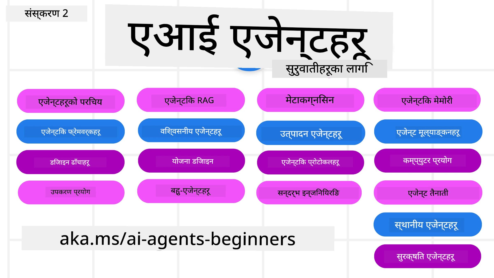

# AI एजेन्टहरूका लागि सुरुवातीहरू - एक कोर्स



## AI एजेन्टहरू निर्माण आरम्भ गर्न आवश्यक सबै कुरा सिकाउने कोर्स

[](https://github.com/microsoft/ai-agents-for-beginners/blob/master/LICENSE?WT.mc_id=academic-105485-koreyst)
[](https://GitHub.com/microsoft/ai-agents-for-beginners/graphs/contributors/?WT.mc_id=academic-105485-koreyst)
[](https://GitHub.com/microsoft/ai-agents-for-beginners/issues/?WT.mc_id=academic-105485-koreyst)
[](https://GitHub.com/microsoft/ai-agents-for-beginners/pulls/?WT.mc_id=academic-105485-koreyst)
[](http://makeapullrequest.com?WT.mc_id=academic-105485-koreyst)

### 🌐 बहुभाषी समर्थन

#### GitHub Action (स्वचालित र सधैं अद्यावधिक) द्वारा समर्थित

<!-- CO-OP TRANSLATOR LANGUAGES TABLE START -->
[अरबी](../ar/README.md) | [बंगाली](../bn/README.md) | [बल्गेरियन](../bg/README.md) | [बर्मेली (म्यानमार)](../my/README.md) | [चिनी (सरलीकृत)](../zh-CN/README.md) | [चिनी (परम्परागत, हङकङ)](../zh-HK/README.md) | [चिनी (परम्परागत, मकाउ)](../zh-MO/README.md) | [चिनी (परम्परागत, ताइवान)](../zh-TW/README.md) | [क्रोएशियन](../hr/README.md) | [चेक](../cs/README.md) | [ड्यानिश](../da/README.md) | [डल्च](../nl/README.md) | [एस्टोनियन](../et/README.md) | [फिनिश](../fi/README.md) | [फ्रेन्च](../fr/README.md) | [जर्मन](../de/README.md) | [ग्रीक](../el/README.md) | [हिब्रू](../he/README.md) | [हिन्दी](../hi/README.md) | [हंगेरीयन](../hu/README.md) | [इन्डोनेसियन](../id/README.md) | [इटालियन](../it/README.md) | [जापानी](../ja/README.md) | [कन्नडा](../kn/README.md) | [कोरियाली](../ko/README.md) | [लिथुआनियन](../lt/README.md) | [मलय](../ms/README.md) | [मलयालम](../ml/README.md) | [मराठी](../mr/README.md) | [नेपाली](./README.md) | [नाइजीरियाली पिजिन](../pcm/README.md) | [नर्वेजियन](../no/README.md) | [फारसी (पर्शियन)](../fa/README.md) | [पोलिश](../pl/README.md) | [पोर्चुगिज (ब्राजील)](../pt-BR/README.md) | [पोर्चुगिज (पोर्चुगल)](../pt-PT/README.md) | [पञ्जाबी (गुरुमुखी)](../pa/README.md) | [रोमानियन](../ro/README.md) | [रूसी](../ru/README.md) | [सर्बियन (सिरिलिक)](../sr/README.md) | [स्लोभाक](../sk/README.md) | [स्लोभेनियन](../sl/README.md) | [स्पेनी](../es/README.md) | [स्वाहिली](../sw/README.md) | [स्विडिस](../sv/README.md) | [टागालोग (फिलिपिनो)](../tl/README.md) | [तमिल](../ta/README.md) | [तेलुगु](../te/README.md) | [थाई](../th/README.md) | [टर्किश](../tr/README.md) | [यूक्रेनी](../uk/README.md) | [उर्दू](../ur/README.md) | [भियतनामी](../vi/README.md)

> **स्थानीय रूपमा क्लोन गर्नु मन छ?**
>
> यो रिपोजिटोरीमा ५०+ भाषा अनुवादहरू समावेश छन् जसले डाउनलोड साइज उल्लेखनीय रूपमा बढाउँछ। अनुवादबिना क्लोन गर्न स्पर्स चेकेको प्रयोग गर्नुहोस्:
>
> **Bash / macOS / Linux:**
> ```bash
> git clone --filter=blob:none --sparse https://github.com/microsoft/ai-agents-for-beginners.git
> cd ai-agents-for-beginners
> git sparse-checkout set --no-cone '/*' '!translations' '!translated_images'
> ```
>
> **CMD (Windows):**
> ```cmd
> git clone --filter=blob:none --sparse https://github.com/microsoft/ai-agents-for-beginners.git
> cd ai-agents-for-beginners
> git sparse-checkout set --no-cone "/*" "!translations" "!translated_images"
> ```
>
> यसले तपाईलाई छिटो डाउनलोडका साथ कोर्स पूरा गर्न आवश्यक सबै कुरा दिन्छ।
<!-- CO-OP TRANSLATOR LANGUAGES TABLE END -->

**अतिरिक्त अनुवाद भाषाहरू समर्थन गराउन चाहनुहुन्छ भने यहाँ सूचीबद्ध छन् [यहाँ](https://github.com/Azure/co-op-translator/blob/main/getting_started/supported-languages.md)**

[](https://GitHub.com/microsoft/ai-agents-for-beginners/watchers/?WT.mc_id=academic-105485-koreyst)
[](https://GitHub.com/microsoft/ai-agents-for-beginners/network/?WT.mc_id=academic-105485-koreyst)
[](https://GitHub.com/microsoft/ai-agents-for-beginners/stargazers/?WT.mc_id=academic-105485-koreyst)

[](https://discord.gg/nTYy5BXMWG)


## 🌱 सुरु गर्ने तरिका

यस कोर्सले AI एजेन्टहरू निर्माण गर्ने आधारभूत कुराहरू समेट्छ। प्रत्येक पाठले आफ्नो विषय समेट्छ, त्यसैले जतिबेला मन लागेको त्यतिबाट सुरु गर्न सक्नुहुन्छ!

यस कोर्सको लागि बहुभाषी समर्थन छ। हाम्रो [उपलब्ध भाषाहरू यहाँ](../..) जानुहोस्।

यदि यो तपाईको पहिलो पटक सृजनात्मक AI मोडेलसँग काम गर्ने हो भने, हाम्रो [सृजनात्मक AI लागि सुरुवातीहरू](https://aka.ms/genai-beginners) कोर्स हेर्नुहोस्, जसमा GenAI सँग निर्माण गर्ने २१ पाठहरू समावेश छन्।

यो रिपो [स्टार (🌟) दिनुहोस्](https://docs.github.com/en/get-started/exploring-projects-on-github/saving-repositories-with-stars?WT.mc_id=academic-105485-koreyst) र [फोर्क गर्नुहोस्](https://github.com/microsoft/ai-agents-for-beginners/fork) र कोड चलाउनुहोस्।

### अन्य सिक्नेहरूलाई भेट्नुहोस्, आफ्नो प्रश्नहरूको उत्तर पाउनुहोस्

यदि तपाई अड्किनुभयो वा AI एजेन्टहरू निर्माण बारे कुनै प्रश्न छ भने, हाम्रो समर्पित Discord च्यानलमा [Microsoft Foundry Discord](https://aka.ms/ai-agents/discord) मा सामेल हुनुहोस्।

### के चाहिन्छ

यस कोर्सका प्रत्येक पाठमा कोड उदाहरणहरू छन्, जसलाई code_samples फोल्डरमा फेला पार्न सकिन्छ। तपाई [आफ्नो प्रतिलिपि बनाउन यो रिपो फोर्क गर्न सक्नुहुन्छ](https://github.com/microsoft/ai-agents-for-beginners/fork)।

यस अभ्यासमा कोड उदाहरणहरूले Microsoft Agent Framework सँग Azure AI Foundry Agent Service V2 प्रयोग गर्छन्:

- [Microsoft Foundry](https://aka.ms/ai-agents-beginners/ai-foundry) - Azure खाता आवश्यक

यस कोर्सले Microsoft बाट तलका AI Agent फ्रेमवर्क र सेवा प्रयोग गर्छ:

- [Microsoft Agent Framework (MAF)](https://aka.ms/ai-agents-beginners/agent-framewrok)
- [Azure AI Foundry Agent Service V2](https://aka.ms/ai-agents-beginners/ai-agent-service)


यस कोर्सको लागि कोड चलाउने थप जानकारीको लागि [कोर्स सेटअप](./00-course-setup/README.md) हेर्नुहोस्।

## 🙏 सहयोग गर्न चाहनुहुन्छ?

तपाईंसँग सुझावहरू छन् वा हिज्जे वा कोड त्रुटिहरू भेट्टाउनु भएको छ? [समस्या उठाउनुहोस्](https://github.com/microsoft/ai-agents-for-beginners/issues?WT.mc_id=academic-105485-koreyst) वा [पुल अनुरोध सिर्जना गर्नुहोस्](https://github.com/microsoft/ai-agents-for-beginners/pulls?WT.mc_id=academic-105485-koreyst)


## 📂 प्रत्येक पाठमा समावेश छ

- README मा लेखिएको पाठ र छोटो भिडियो
- Microsoft Agent Framework सँग Azure AI Foundry प्रयोग गरी Python कोड नमूनाहरू
- सिकाइलाई निरन्तरता दिन अतिरिक्त स्रोतहरूका लिङ्कहरू


## 🗃️ पाठहरू

| **पाठ**                                   | **पाठ र कोड**                                    | **भिडियो**                                                  | **अतिरिक्त सिकाइ**                                                                     |
|------------------------------------------|-------------------------------------------------|-------------------------------------------------------------|----------------------------------------------------------------------------------------|
| AI एजेन्ट र तिनका प्रयोग केसहरूको परिचय  | [लिङ्क](./01-intro-to-ai-agents/README.md)       | [भिडियो](https://youtu.be/3zgm60bXmQk?si=z8QygFvYQv-9WtO1)   | [लिङ्क](https://aka.ms/ai-agents-beginners/collection?WT.mc_id=academic-105485-koreyst) |
| AI एजेन्टिक फ्रेमवर्कहरूको अन्वेषण        | [लिङ्क](./02-explore-agentic-frameworks/README.md) | [भिडियो](https://youtu.be/ODwF-EZo_O8?si=Vawth4hzVaHv-u0H)   | [लिङ्क](https://aka.ms/ai-agents-beginners/collection?WT.mc_id=academic-105485-koreyst) |
| AI एजेन्टिक डिजाइन नमूनाहरू बुझ्ने       | [लिङ्क](./03-agentic-design-patterns/README.md)  | [भिडियो](https://youtu.be/m9lM8qqoOEA?si=BIzHwzstTPL8o9GF)   | [लिङ्क](https://aka.ms/ai-agents-beginners/collection?WT.mc_id=academic-105485-koreyst) |
| उपकरण प्रयोग डिजाइन नमूना                | [लिङ्क](./04-tool-use/README.md)                 | [भिडियो](https://youtu.be/vieRiPRx-gI?si=2z6O2Xu2cu_Jz46N)   | [लिङ्क](https://aka.ms/ai-agents-beginners/collection?WT.mc_id=academic-105485-koreyst) |
| एजेन्टिक RAG                            | [लिङ्क](./05-agentic-rag/README.md)               | [भिडियो](https://youtu.be/WcjAARvdL7I?si=gKPWsQpKiIlDH9A3)   | [लिङ्क](https://aka.ms/ai-agents-beginners/collection?WT.mc_id=academic-105485-koreyst) |
| विश्वासयोग्य AI एजेन्टहरू निर्माण        | [लिङ्क](./06-building-trustworthy-agents/README.md) | [भिडियो](https://youtu.be/iZKkMEGBCUQ?si=jZjpiMnGFOE9L8OK )  | [लिङ्क](https://aka.ms/ai-agents-beginners/collection?WT.mc_id=academic-105485-koreyst) |
| योजना बनाउने डिजाइन नमूना               | [लिङ्क](./07-planning-design/README.md)          | [भिडियो](https://youtu.be/kPfJ2BrBCMY?si=6SC_iv_E5-mzucnC)   | [लिङ्क](https://aka.ms/ai-agents-beginners/collection?WT.mc_id=academic-105485-koreyst) |
| बहु-एजेन्ट डिजाइन नमूना                 | [लिङ्क](./08-multi-agent/README.md)               | [भिडियो](https://youtu.be/V6HpE9hZEx0?si=rMgDhEu7wXo2uo6g)   | [लिङ्क](https://aka.ms/ai-agents-beginners/collection?WT.mc_id=academic-105485-koreyst) |
| मेटकाognिशन डिजाइन नमूना                | [लिङ्क](./09-metacognition/README.md)             | [भिडियो](https://youtu.be/His9R6gw6Ec?si=8gck6vvdSNCt6OcF)   | [लिङ्क](https://aka.ms/ai-agents-beginners/collection?WT.mc_id=academic-105485-koreyst) |
| उत्पादनमा एआई एजेन्ट्स                      | [Link](./10-ai-agents-production/README.md)        | [Video](https://youtu.be/l4TP6IyJxmQ?si=31dnhexRo6yLRJDl)  | [Link](https://aka.ms/ai-agents-beginners/collection?WT.mc_id=academic-105485-koreyst) |
| एजेन्टिक प्रोटोकलहरू प्रयोग गर्दै (MCP, A2A र NLWeb) | [Link](./11-agentic-protocols/README.md)           | [Video](https://youtu.be/X-Dh9R3Opn8)                                 | [Link](https://aka.ms/ai-agents-beginners/collection?WT.mc_id=academic-105485-koreyst) |
| एआई एजेन्टहरूका लागि सन्दर्भ इन्जिनियरिंग            | [Link](./12-context-engineering/README.md)         | [Video](https://youtu.be/F5zqRV7gEag)                                 | [Link](https://aka.ms/ai-agents-beginners/collection?WT.mc_id=academic-105485-koreyst) |
| एजेन्टिक मेमोरी व्यवस्थापन                      | [Link](./13-agent-memory/README.md)     |      [Video](https://youtu.be/QrYbHesIxpw?si=vZkVwKrQ4ieCcIPx)                                                      |                                                                                        |
| माइक्रोसफ्ट एजेन्ट फ्रेमवर्क अन्वेषण                         | [Link](./14-microsoft-agent-framework/README.md)                            |                                                            |                                                                                        |
| कम्प्युटर युज एजेन्ट्स (CUA) निर्माण           | चाँडै आउने                             |                                                            |                                                                                        |
| स्केलेबल एजेन्ट्स तैनाथीकरण                    | चाँडै आउने                             |                                                            |                                                                                        |
| स्थानीय एआई एजेन्टहरू सिर्जना                       | चाँडै आउने                               |                                                            |                                                                                        |
| एआई एजेन्टहरू सुरक्षित बनाउँदै                           | चाँडै आउने                               |                                                            |                                                                                        |

## 🎒 अन्य कोर्सहरू

हाम्रो टिमले अन्य कोर्सहरू पनि उत्पादन गर्दछ! हेर्नुहोस्:

<!-- CO-OP TRANSLATOR OTHER COURSES START -->
### LangChain
[](https://aka.ms/langchain4j-for-beginners)
[](https://aka.ms/langchainjs-for-beginners?WT.mc_id=m365-94501-dwahlin)
[](https://github.com/microsoft/langchain-for-beginners?WT.mc_id=m365-94501-dwahlin)
---

### Azure / Edge / MCP / Agents
[](https://github.com/microsoft/AZD-for-beginners?WT.mc_id=academic-105485-koreyst)
[](https://github.com/microsoft/edgeai-for-beginners?WT.mc_id=academic-105485-koreyst)
[](https://github.com/microsoft/mcp-for-beginners?WT.mc_id=academic-105485-koreyst)
[](https://github.com/microsoft/ai-agents-for-beginners?WT.mc_id=academic-105485-koreyst)

---
 
### जनरेटिभ एआई सिरिज
[](https://github.com/microsoft/generative-ai-for-beginners?WT.mc_id=academic-105485-koreyst)
[-9333EA?style=for-the-badge&labelColor=E5E7EB&color=9333EA)](https://github.com/microsoft/Generative-AI-for-beginners-dotnet?WT.mc_id=academic-105485-koreyst)
[-C084FC?style=for-the-badge&labelColor=E5E7EB&color=C084FC)](https://github.com/microsoft/generative-ai-for-beginners-java?WT.mc_id=academic-105485-koreyst)
[-E879F9?style=for-the-badge&labelColor=E5E7EB&color=E879F9)](https://github.com/microsoft/generative-ai-with-javascript?WT.mc_id=academic-105485-koreyst)

---
 
### कोर सिकाइ
[](https://aka.ms/ml-beginners?WT.mc_id=academic-105485-koreyst)
[](https://aka.ms/datascience-beginners?WT.mc_id=academic-105485-koreyst)
[](https://aka.ms/ai-beginners?WT.mc_id=academic-105485-koreyst)
[](https://github.com/microsoft/Security-101?WT.mc_id=academic-96948-sayoung)
[](https://aka.ms/webdev-beginners?WT.mc_id=academic-105485-koreyst)
[](https://aka.ms/iot-beginners?WT.mc_id=academic-105485-koreyst)
[](https://github.com/microsoft/xr-development-for-beginners?WT.mc_id=academic-105485-koreyst)

---
 
### को-पायलट सिरिज
[](https://aka.ms/GitHubCopilotAI?WT.mc_id=academic-105485-koreyst)
[](https://github.com/microsoft/mastering-github-copilot-for-dotnet-csharp-developers?WT.mc_id=academic-105485-koreyst)
[](https://github.com/microsoft/CopilotAdventures?WT.mc_id=academic-105485-koreyst)
<!-- CO-OP TRANSLATOR OTHER COURSES END -->

## 🌟 समुदायलाई धन्यवाद

महत्वपूर्ण कोड नमूनाहरू प्रदान गरेकोमा [Shivam Goyal](https://www.linkedin.com/in/shivam2003/) लाई धन्यवाद।

## योगदान

यो परियोजनाले योगदान र सुझावहरू स्वागत गर्दछ। अधिकांश योगदानहरूले तपाईंलाई एक
Contributor License Agreement (CLA) मा सहमति जनाउन आवश्यक पर्छ जुन तपाईंले आफ्ना योगदानको प्रयोग गर्ने अधिकार
हामीलाई दिनुहुन्छ भन्ने पुष्टि गर्दछ। विवरणका लागि <https://cla.opensource.microsoft.com> मा जानुहोस्।

जब तपाईं एउटा पुल अनुरोध (pull request) पेश गर्नुहुन्छ, एक CLA बोटले स्वचालित रूपमा निर्धारण गर्नेछ कि तपाईंले CLA उपलब्ध गराउन आवश्यक छ वा छैन
र अनुरोधलाई उपयुक्त रूपमा सजाउनेछ (जस्तै, स्थिति जाँच, टिप्पणी)। बोटले दिएको निर्देशनहरू
पालना गर्नुहोस्। तपाईंले यो केवल एकपटक हाम्रा सबै रिपोजमा गरिनु पर्नेछ।

यो परियोजनाले [Microsoft Open Source Code of Conduct](https://opensource.microsoft.com/codeofconduct/) अपनाएको छ।
थप जानकारीका लागि [Code of Conduct FAQ](https://opensource.microsoft.com/codeofconduct/faq/) हेर्नुहोस् वा 
कुनै थप प्रश्न वा टिप्पणीका लागि [opencode@microsoft.com](mailto:opencode@microsoft.com) मा सम्पर्क गर्नुहोस्।

## ट्रेडमार्कहरू

यो परियोजनामा परियोजनाहरू, उत्पादनहरू वा सेवाहरूका ट्रेडमार्क वा लोगोहरू समावेश हुन सक्छ। माइक्रोसफ्टका
ट्रेडमार्क वा लोगोहरूको अधिकृत प्रयोगले
[Microsoft's Trademark & Brand Guidelines](https://www.microsoft.com/legal/intellectualproperty/trademarks/usage/general) को पालना गर्न आवश्यक छ।
यस परियोजनाको संसोधित संस्करणहरूमा माइक्रोसफ्ट ट्रेडमार्क वा लोगोहरूको प्रयोगले भ्रम नपार्नु वा माइक्रोसफ्टको प्रायोजन जनाउनु हुँदैन।
तेस्रो पक्षका ट्रेडमार्क वा लोगोहरूको कुनै पनि प्रयोग तिनीहरूको नीतिहरूको अधीनमा हुन्छ।

## सहयोग पाउने तरिका

यदि तपाईं अलमलमा पर्नुभयो वा एआई एपहरू बनाउने बारे कुनै प्रश्न छ भने, सामेल हुनुहोस्:

[](https://aka.ms/foundry/discord)

यदि तपाईंले उत्पादन प्रतिक्रिया वा निर्माण गर्दा त्रुटिहरू देख्नु भयो भने भ्रमण गर्नुहोस्:

[](https://aka.ms/foundry/forum)

---

<!-- CO-OP TRANSLATOR DISCLAIMER START -->
**अस्वीकरण**:
यो दस्तावेज AI अनुवाद सेवा [Co-op Translator](https://github.com/Azure/co-op-translator) को प्रयोग गरी अनुवाद गरिएको हो। हामी सही अनुवादका लागि प्रयासरत छौं भने पनि, कृपया ध्यान दिनुहोस् कि स्वचालित अनुवादमा त्रुटि वा अशुद्धता हुन सक्छ। मूल दस्तावेज यसको आफ्नै भाषामा आधिकारिक स्रोत मानिनु पर्छ। महत्वपूर्ण जानकारीका लागि पेशेवर मानव अनुवाद सिफारिस गरिन्छ। यस अनुवादको प्रयोगबाट देखा पर्ने कुनै पनि गलतफहमी वा गलत व्याख्याको मामलामा हामी जिम्मेवार छैनौं।
<!-- CO-OP TRANSLATOR DISCLAIMER END -->