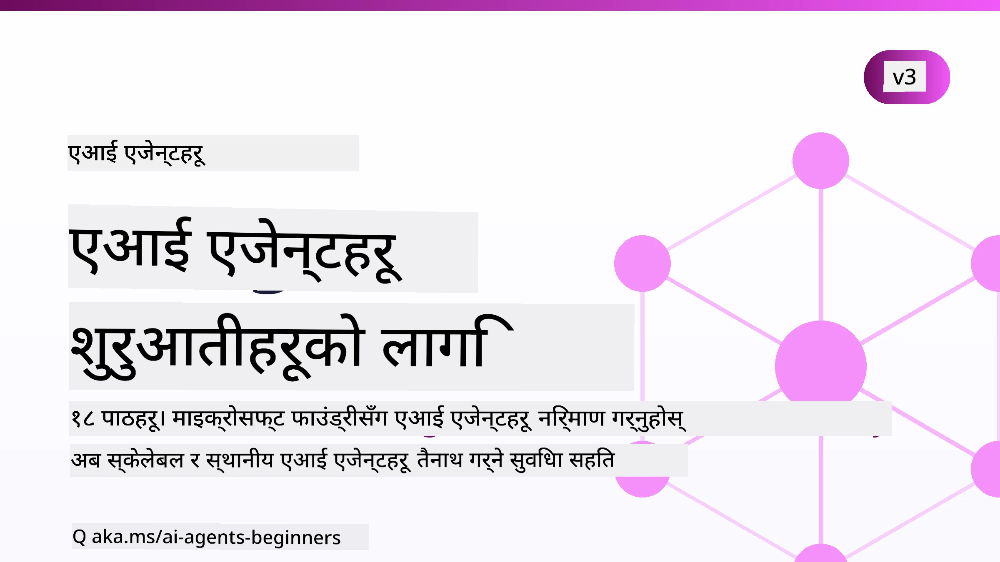

# सुरु गर्नेहरूको लागि AI एजेन्टहरू - एउटा पाठ्यक्रम



## AI एजेन्टहरू निर्माण गर्न सुरु गर्न आवश्यक सबै कुरा सिकाउने पाठ्यक्रम

[](https://github.com/microsoft/ai-agents-for-beginners/blob/master/LICENSE?WT.mc_id=academic-105485-koreyst)
[](https://GitHub.com/microsoft/ai-agents-for-beginners/graphs/contributors/?WT.mc_id=academic-105485-koreyst)
[](https://GitHub.com/microsoft/ai-agents-for-beginners/issues/?WT.mc_id=academic-105485-koreyst)
[](https://GitHub.com/microsoft/ai-agents-for-beginners/pulls/?WT.mc_id=academic-105485-koreyst)
[](http://makeapullrequest.com?WT.mc_id=academic-105485-koreyst)

### 🌐 बहुभाषी समर्थन

#### GitHub Action मार्फत समर्थन गरिएको (स्वचालित र सधैं अद्यावधिक)

<!-- CO-OP TRANSLATOR LANGUAGES TABLE START -->
[अरबी](../ar/README.md) | [बंगाली](../bn/README.md) | [बल्गेरियाली](../bg/README.md) | [बर्मेली (म्यानमार)](../my/README.md) | [चिनियाँ (सरलीकृत)](../zh-CN/README.md) | [चिनियाँ (परम्परागत, हङकङ)](../zh-HK/README.md) | [चिनियाँ (परम्परागत, मकाउ)](../zh-MO/README.md) | [चिनियाँ (परम्परागत, ताइवान)](../zh-TW/README.md) | [क्रोएशियन](../hr/README.md) | [चेक](../cs/README.md) | [डेनिश](../da/README.md) | [डच](../nl/README.md) | [एस्टोनियन](../et/README.md) | [फिनिश](../fi/README.md) | [फ्रेन्च](../fr/README.md) | [जर्मन](../de/README.md) | [गिरिक](../el/README.md) | [हिव्रू](../he/README.md) | [हिन्दी](../hi/README.md) | [हङ्गेरियन](../hu/README.md) | [इन्डोनेसियन](../id/README.md) | [इटालियन](../it/README.md) | [जापानी](../ja/README.md) | [कन्नड](../kn/README.md) | [ख्मेर](../km/README.md) | [कोरियन](../ko/README.md) | [लिथुनियन](../lt/README.md) | [मलाया](../ms/README.md) | [मलयालम](../ml/README.md) | [मराठी](../mr/README.md) | [नेपाली](./README.md) | [नाइजेरियन पिड्जिन](../pcm/README.md) | [नर्वेजियन](../no/README.md) | [फारसी (पर्शियन)](../fa/README.md) | [पोलिश](../pl/README.md) | [पोर्तुगाली (ब्राजिल)](../pt-BR/README.md) | [पोर्तुगाली (पोर्तुगाल)](../pt-PT/README.md) | [पञ्जाबी (गुरुमुखी)](../pa/README.md) | [रोमानियन](../ro/README.md) | [रूसी](../ru/README.md) | [सर्बियन (सिरिलिक)](../sr/README.md) | [स्लोभाक](../sk/README.md) | [स्लोभेनियन](../sl/README.md) | [स्पेनी](../es/README.md) | [स्वाहिली](../sw/README.md) | [स्वीडिश](../sv/README.md) | [टागालोग (फिलिपिनो)](../tl/README.md) | [तमिल](../ta/README.md) | [तेलुगु](../te/README.md) | [थाई](../th/README.md) | [टर्किश](../tr/README.md) | [यूक्रेनी](../uk/README.md) | [उर्दू](../ur/README.md) | [भियतनामी](../vi/README.md)

> **स्थानीय रूपमा क्लोन गर्न रुचाउनु हुन्छ?**
>
> यो रिपोजिटरीमा ५०+ भाषा अनुवादहरू समावेश गरिएको छ जुन डाउनलोड साइजलाई धेरै वृद्धि गर्दछ। अनुवादहरू बिना क्लोन गर्न, sparse checkout प्रयोग गर्नुहोस्:
>
> **Bash / macOS / Linux:**
> ```bash
> git clone --filter=blob:none --sparse https://github.com/microsoft/ai-agents-for-beginners.git
> cd ai-agents-for-beginners
> git sparse-checkout set --no-cone '/*' '!translations' '!translated_images'
> ```
>
> **CMD (Windows):**
> ```cmd
> git clone --filter=blob:none --sparse https://github.com/microsoft/ai-agents-for-beginners.git
> cd ai-agents-for-beginners
> git sparse-checkout set --no-cone "/*" "!translations" "!translated_images"
> ```
>
> यसले तपाईंलाई पाठ्यक्रम पूरा गर्न आवश्यक सबै कुरा धेरै छिटो डाउनलोडको साथ प्रदान गर्दछ।
<!-- CO-OP TRANSLATOR LANGUAGES TABLE END -->

**यदि तपाईं थप अनुवाद भाषाहरू समर्थन गर्न चाहनुहुन्छ भने, तिनीहरू यहाँ सूचीबद्ध छन् [यहाँ](https://github.com/Azure/co-op-translator/blob/main/getting_started/supported-languages.md)।**

[](https://GitHub.com/microsoft/ai-agents-for-beginners/watchers/?WT.mc_id=academic-105485-koreyst)
[](https://GitHub.com/microsoft/ai-agents-for-beginners/network/?WT.mc_id=academic-105485-koreyst)
[](https://GitHub.com/microsoft/ai-agents-for-beginners/stargazers/?WT.mc_id=academic-105485-koreyst)

[](https://discord.com/invite/ATgtXmAS5D)


## 🌱 शुरुवात गर्ने

यस पाठ्यक्रममा AI एजेन्टहरू निर्माणको आधारभूत कुराहरू समेटिएका शिक्षाहरू छन्। प्रत्येक पाठ्यले आफ्नै विषय समेट्छ त्यसैले जुनसुकै स्थानबाट सुरु गर्नुहोस्!

यस पाठ्यक्रमको लागि बहुभाषी समर्थन छ। हाम्रो [उपलब्ध भाषाहरू यहाँ हेर्नुहोस्](#-multi-language-support)। 

यदि तपाईं पहिलो पटक Generative AI मोडेलहरुसँग निर्माण गर्दै हुनुहुन्छ भने, हाम्रो [सुरु गर्नेहरूको लागि जनरेटिभ AI](https://aka.ms/genai-beginners) पाठ्यक्रम पनि हेर्नुहोस्, जसमा GenAI सँग निर्माण गर्ने २१ पाठ्यहरू समावेश छन्।

[यो रिपोमा स्टार (🌟) दिन नबिर्सनुहोस्](https://docs.github.com/en/get-started/exploring-projects-on-github/saving-repositories-with-stars?WT.mc_id=academic-105485-koreyst) र [यो रिपो फोर्क गर्नुहोस्](https://github.com/microsoft/ai-agents-for-beginners/fork) कोड चलाउन।

### अन्य सिक्नेहरूसँग भेट्नुहोस्, तपाईंका प्रश्नहरूको जवाफ पाउनुहोस्

यदि तपाईं अड्कनु भयो वा AI एजेन्टहरू निर्माण गर्न सम्बन्धित कुनै प्रश्नहरू छन् भने, हाम्रो समर्पित Discord च्यानलमा सहभागी हुनुहोस् [Microsoft Foundry Discord](https://aka.ms/ai-agents/discord) मा।

### तपाईंलाई के चाहिन्छ 

यस पाठ्यक्रमका प्रत्येक पाठ्यले कोड उदाहरणहरू समावेश गर्छन्, जुन code_samples फोल्डरमा भेट्न सकिन्छ। तपाईं [यो रिपो फोर्क गर्न सक्नुहुन्छ](https://github.com/microsoft/ai-agents-for-beginners/fork) आफ्नो कपी बनाउन।  

यी अभ्यासहरूमा कोड उदाहरणहरूले Microsoft Agent Framework सँग Microsoft Foundry Agent Service V2 को प्रयोग गर्छन्:

- [Microsoft Foundry](https://aka.ms/ai-agents-beginners/ai-foundry) - Azure खाता आवश्यक

यस पाठ्यक्रमले Microsoft का निम्न AI एजेन्ट फ्रेमवर्कहरू र सेवाहरू प्रयोग गर्छ:

- [Microsoft Agent Framework (MAF)](https://learn.microsoft.com/agent-framework/overview/)
- [Microsoft Foundry Agent Service V2](https://aka.ms/ai-agents-beginners/ai-agent-service)

केही कोड उदाहरणहरूले वैकल्पिक OpenAI- अनुकूल प्रदायकहरूलाई पनि समर्थन गर्छन् जस्तै [MiniMax](https://platform.minimaxi.com/), जसले ठूलो सन्दर्भ मोडेलहरू (दोस्रो २०४K टोकनसम्म) प्रदान गर्छ। विन्यास विवरणहरूका लागि [पाठ्यक्रम सेटअप](./00-course-setup/README.md) हेर्नुहोस्।

यस पाठ्यक्रमको लागि कोड चलाउने थप जानकारीका लागि, [पाठ्यक्रम सेटअप](./00-course-setup/README.md) मा जानुहोस्।

## 🙏 सहयोग गर्न चाहनुहुन्छ?

तपाईंलाई कुनै सुझाव छ वा स्पेलिङ वा कोड त्रुटिहरू फेला पर्याे? [समस्या उठाउनुहोस्](https://github.com/microsoft/ai-agents-for-beginners/issues?WT.mc_id=academic-105485-koreyst) वा [पुल रिक्वेस्ट बनाएर योगदान गर्नुहोस्](https://github.com/microsoft/ai-agents-for-beginners/pulls?WT.mc_id=academic-105485-koreyst)


## 📂 प्रत्येक पाठ्यले समावेश गर्छ

- लेखिएको पाठ्य जसले README मा हुन्छ र छोटो भिडियो
- Python कोड उदाहरणहरू जुन Microsoft Agent Framework सँग Microsoft Foundry प्रयोग गर्छ
- सिकाइ जारी राख्न थप स्रोतहरूका लिंकहरू


## 🗃️ पाठ्यहरू

| **पाठ्यक्रम**                                   | **पाठ्य र कोड**                                    | **भिडियो**                                                  | **थप सिकाइ**                                                                     |
|----------------------------------------------|----------------------------------------------------|------------------------------------------------------------|----------------------------------------------------------------------------------------|
| AI एजेन्टहरू र एजेन्ट प्रयोग केस परिचय       | [लिंक](./01-intro-to-ai-agents/README.md)          | [भिडियो](https://youtu.be/3zgm60bXmQk?si=z8QygFvYQv-9WtO1)  | [लिंक](https://aka.ms/ai-agents-beginners/collection?WT.mc_id=academic-105485-koreyst) |
| AI एजेन्टिक फ्रेमवर्कहरूको अन्वेषण              | [लिंक](./02-explore-agentic-frameworks/README.md)  | [भिडियो](https://youtu.be/ODwF-EZo_O8?si=Vawth4hzVaHv-u0H)  | [लिंक](https://aka.ms/ai-agents-beginners/collection?WT.mc_id=academic-105485-koreyst) |
| AI एजेन्टिक डिजाइन ढाँचाहरूको बुझाइ             | [लिंक](./03-agentic-design-patterns/README.md)     | [भिडियो](https://youtu.be/m9lM8qqoOEA?si=BIzHwzstTPL8o9GF)  | [लिंक](https://aka.ms/ai-agents-beginners/collection?WT.mc_id=academic-105485-koreyst) |
| उपकरण प्रयोग डिजाइन ढाँचा                      | [लिंक](./04-tool-use/README.md)                    | [भिडियो](https://youtu.be/vieRiPRx-gI?si=2z6O2Xu2cu_Jz46N)  | [लिंक](https://aka.ms/ai-agents-for-beginners/collection?WT.mc_id=academic-105485-koreyst) |
| एजेन्टिक RAG                                  | [लिंक](./05-agentic-rag/README.md)                 | [भिडियो](https://youtu.be/WcjAARvdL7I?si=gKPWsQpKiIlDH9A3)  | [लिंक](https://aka.ms/ai-agents-beginners/collection?WT.mc_id=academic-105485-koreyst) |
| भरपर्दो AI एजेन्टहरू निर्माण                  | [लिंक](./06-building-trustworthy-agents/README.md) | [भिडियो](https://youtu.be/iZKkMEGBCUQ?si=jZjpiMnGFOE9L8OK ) | [लिंक](https://aka.ms/ai-agents-beginners/collection?WT.mc_id=academic-105485-koreyst) |
| योजना डिजाइन ढाँचा                            | [लिंक](./07-planning-design/README.md)             | [भिडियो](https://youtu.be/kPfJ2BrBCMY?si=6SC_iv_E5-mzucnC)  | [लिंक](https://aka.ms/ai-agents-beginners/collection?WT.mc_id=academic-105485-koreyst) |
| बहु-एजेन्ट डिजाइन ढाँचा                       | [लिंक](./08-multi-agent/README.md)                 | [भिडियो](https://youtu.be/V6HpE9hZEx0?si=rMgDhEu7wXo2uo6g)  | [लिंक](https://aka.ms/ai-agents-beginners/collection?WT.mc_id=academic-105485-koreyst) |

| मेटाकग्निशन डिजाईन प्याटर्न                 | [Link](./09-metacognition/README.md)               | [Video](https://youtu.be/His9R6gw6Ec?si=8gck6vvdSNCt6OcF)  | [Link](https://aka.ms/ai-agents-beginners/collection?WT.mc_id=academic-105485-koreyst) |
| उत्पादनमा AI एजेन्टहरू                      | [Link](./10-ai-agents-production/README.md)        | [Video](https://youtu.be/l4TP6IyJxmQ?si=31dnhexRo6yLRJDl)  | [Link](https://aka.ms/ai-agents-beginners/collection?WT.mc_id=academic-105485-koreyst) |
| एजेन्टिक प्रोटोकलहरू प्रयोग गर्दै (MCP, A2A र NLWeb) | [Link](./11-agentic-protocols/README.md)           | [Video](https://youtu.be/X-Dh9R3Opn8)                                 | [Link](https://aka.ms/ai-agents-beginners/collection?WT.mc_id=academic-105485-koreyst) |
| AI एजेन्टहरूको लागि सन्दर्भ ईन्जिनियरिङ      | [Link](./12-context-engineering/README.md)         | [Video](https://youtu.be/F5zqRV7gEag)                                 | [Link](https://aka.ms/ai-agents-beginners/collection?WT.mc_id=academic-105485-koreyst) |
| एजेन्टिक मेमोरी व्यवस्थापन                  | [Link](./13-agent-memory/README.md)     |      [Video](https://youtu.be/QrYbHesIxpw?si=vZkVwKrQ4ieCcIPx)                                                      |                                                                                        |
| माइक्रोसफ्ट एजेन्ट फ्रेमवर्क अन्वेषण गर्दै                      | [Link](./14-microsoft-agent-framework/README.md)                            |                                                            |                                                                                        |
| कम्प्युटर प्रयोग एजेन्टहरू निर्माण गर्दै (CUA)           | [Link](./15-browser-use/README.md)     |                                                            | [Link](https://docs.browser-use.com/examples/templates/playwright-integration)         |
| स्केलेबल एजेन्टहरू तैनाथ गर्दै                    | [Link](./16-deploying-scalable-agents/README.md) |                                                    | [Link](https://learn.microsoft.com/azure/ai-foundry/agents/overview)                   |
| स्थानीय AI एजेन्टहरू सिर्जना गर्दै                     | [Link](./17-creating-local-ai-agents/README.md)  |                                                    | [Link](https://learn.microsoft.com/azure/ai-foundry/foundry-local/)                    |
| AI एजेन्टहरूलाई सुरक्षित पार्दै                           | [Link](./18-securing-ai-agents/README.md)  |                                                            | [Link](https://aka.ms/ai-agents-beginners/collection?WT.mc_id=academic-105485-koreyst) |

## 🎒 अन्य कोर्षहरू

हाम्रो टोलीले अन्य कोर्षहरू पनि उत्पादन गर्छ! जाँच गर्नुहोस्:

<!-- CO-OP TRANSLATOR OTHER COURSES START -->
### ल्याङचेन
[](https://aka.ms/langchain4j-for-beginners)
[](https://aka.ms/langchainjs-for-beginners?WT.mc_id=m365-94501-dwahlin)
[](https://github.com/microsoft/langchain-for-beginners?WT.mc_id=m365-94501-dwahlin)
---

### Azure / Edge / MCP / एजेन्टहरू
[](https://github.com/microsoft/AZD-for-beginners?WT.mc_id=academic-105485-koreyst)
[](https://github.com/microsoft/edgeai-for-beginners?WT.mc_id=academic-105485-koreyst)
[](https://github.com/microsoft/mcp-for-beginners?WT.mc_id=academic-105485-koreyst)
[](https://github.com/microsoft/ai-agents-for-beginners?WT.mc_id=academic-105485-koreyst)

---
 
### जेनेरेटिभ AI श्रृंखला
[](https://github.com/microsoft/generative-ai-for-beginners?WT.mc_id=academic-105485-koreyst)
[-9333EA?style=for-the-badge&labelColor=E5E7EB&color=9333EA)](https://github.com/microsoft/Generative-AI-for-beginners-dotnet?WT.mc_id=academic-105485-koreyst)

[-C084FC?style=for-the-badge&labelColor=E5E7EB&color=C084FC)](https://github.com/microsoft/generative-ai-for-beginners-java?WT.mc_id=academic-105485-koreyst)
[-E879F9?style=for-the-badge&labelColor=E5E7EB&color=E879F9)](https://github.com/microsoft/generative-ai-with-javascript?WT.mc_id=academic-105485-koreyst)

---
 
### मूल सिकाइ
[](https://aka.ms/ml-beginners?WT.mc_id=academic-105485-koreyst)
[](https://aka.ms/datascience-beginners?WT.mc_id=academic-105485-koreyst)
[](https://aka.ms/ai-beginners?WT.mc_id=academic-105485-koreyst)
[](https://github.com/microsoft/Security-101?WT.mc_id=academic-96948-sayoung)
[](https://aka.ms/webdev-beginners?WT.mc_id=academic-105485-koreyst)
[](https://aka.ms/iot-beginners?WT.mc_id=academic-105485-koreyst)
[](https://github.com/microsoft/xr-development-for-beginners?WT.mc_id=academic-105485-koreyst)

---
 

### कोपिलट सिरिज
[](https://aka.ms/GitHubCopilotAI?WT.mc_id=academic-105485-koreyst)
[](https://github.com/microsoft/mastering-github-copilot-for-dotnet-csharp-developers?WT.mc_id=academic-105485-koreyst)
[](https://github.com/microsoft/CopilotAdventures?WT.mc_id=academic-105485-koreyst)
<!-- CO-OP TRANSLATOR OTHER COURSES END -->

## 🌟 समुदायलाई धन्यवाद

[शिवम् गोयल](https://www.linkedin.com/in/shivam2003/) लाई एजेन्टिक RAG देखाउने महत्वपूर्ण कोड नमूनाहरू योगदान गरेकोमा धन्यवाद। 

## योगदान

यो परियोजनाले योगदान र सुझावहरूलाई स्वागत गर्दछ। अधिकांश योगदानहरूका लागि तपाईंले
योगदान अधिकार(Contributor License Agreement - CLA) स्वीकार गर्नुपर्ने हुन्छ जसले तपाईंलाई
आफ्नो योगदान प्रयोग गर्ने अधिकार दिन्छ। बिस्तारको लागि, <https://cla.opensource.microsoft.com> मा जानुहोस्।

जब तपाईं पुल रिक्वेस्ट पठाउनुहुन्छ, एउटा CLA बोटले स्वतः निर्धारण गर्नेछ कि तपाईंले CLA उपलब्ध गराउन आवश्यक छ वा छैन
र PR लाई उपयुक्त रूपमा चिन्हित गर्नेछ (जस्तै, स्थिति जाँच, टिप्पणी)। बोटले दिएको निर्देशहरू पालना गर्नुहोस्।
तपाईंलाई हाम्रो CLA प्रयोग गर्ने सबै रिपोजमा केवल एक पटक यो प्रक्रिया गर्नुपर्नेछ।

यस परियोजनाले [Microsoft Open Source Code of Conduct](https://opensource.microsoft.com/codeofconduct/) अपनाएको छ।
थप जानकारीको लागि [Code of Conduct FAQ](https://opensource.microsoft.com/codeofconduct/faq/) हेर्नुहोस् वा
कुनै प्रश्न वा टिप्पणीका लागि [opencode@microsoft.com](mailto:opencode@microsoft.com) मा सम्पर्क गर्नुहोस्।

## ट्रेडमार्कहरू

यस परियोजनाले परियोजनाहरू, उत्पादनहरू वा सेवाहरूका लागि ट्रेडमार्क वा लोगोहरु समावेश गर्न सक्छ। माइक्रोसफ्टका
ट्रेडमार्क वा लोगोहरूको अधिकारिक प्रयोगका लागि
[Microsoft's Trademark & Brand Guidelines](https://www.microsoft.com/legal/intellectualproperty/trademarks/usage/general) अनुसरण गर्न आवश्यक छ।
यस परियोजनाको संशोधित संस्करणहरूमा माइक्रोसफ्ट ट्रेडमार्क वा लोगोहरूको प्रयोगले भ्रम पैदा गर्नु हुँदैन वा माइक्रोसफ्ट प्रायोजन भएको संकेत गर्नु हुँदैन।
तेस्रो पक्षका ट्रेडमार्क वा लोगोहरूको कुनै पनि प्रयोग ती पक्षहरूको नीतिमा आधारित हुन्छ।

## मद्दत पाउने तरिका


यदि तपाईं अड्कनु भयो वा AI एपहरू निर्माण गर्दा कुनै प्रश्न छ भने, सहभागी हुनुहोस्:

[](https://aka.ms/foundry/discord)

यदि तपाईंलाई उत्पादन प्रतिक्रिया वा निर्माण गर्दा त्रुटिहरू छन् भने यहाँ जानुहोस्:


[](https://aka.ms/foundry/forum)

---

<!-- CO-OP TRANSLATOR DISCLAIMER START -->
**अस्वीकरण**:
यो दस्तावेज़ AI अनुवाद सेवा [Co-op Translator](https://github.com/Azure/co-op-translator) प्रयोग गरेर अनुवाद गरिएको हो। हामी सही हुन प्रयास गर्छौं, तर कृपया जानकार हुनुस् कि स्वचालित अनुवादमा त्रुटिहरू वा अशुद्धताहरू हुन सक्छन्। मूल दस्तावेज़ यसको मूल भाषामा आधिकारिक स्रोत मानिनुपर्छ। महत्वपूर्ण जानकारीका लागि व्यावसायिक मानव अनुवाद सिफारिस गरिन्छ। यस अनुवादको प्रयोगबाट उत्पन्न कुनै पनि गलत बुझाइ वा त्रुटिको लागि हामी जिम्मेवार छैनौं।
<!-- CO-OP TRANSLATOR DISCLAIMER END -->