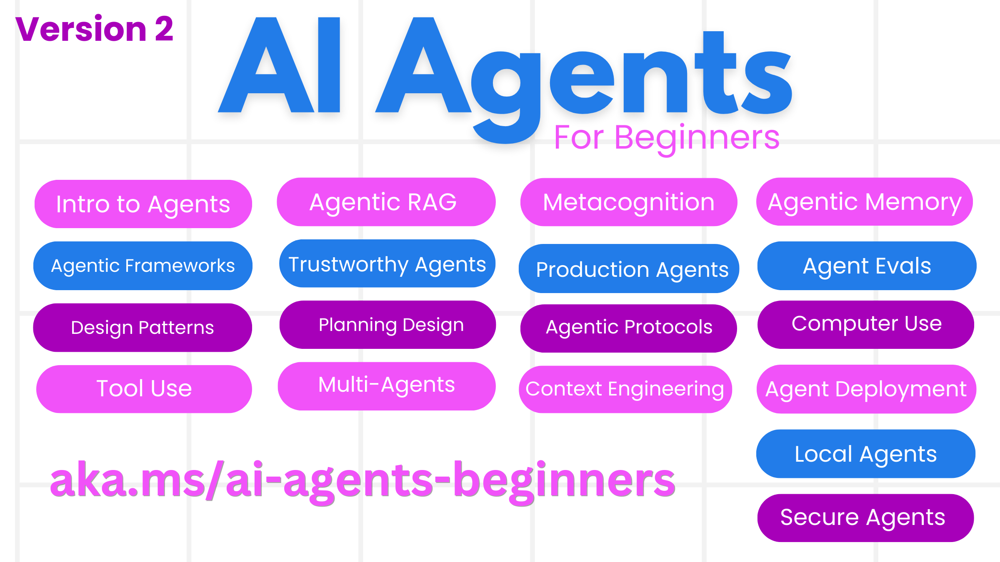

<!--
CO_OP_TRANSLATOR_METADATA:
{
  "original_hash": "f3b7d49f960b1ab3619bd228a048d7aa",
  "translation_date": "2025-12-19T08:36:57+00:00",
  "source_file": "README.md",
  "language_code": "ne"
}
-->
# AI एजेन्टहरू सुरु गर्नेहरूका लागि - एक कोर्स

## AI एजेन्टहरू निर्माण गर्न सुरु गर्न आवश्यक सबै कुरा सिकाउने कोर्स

### 🌐 बहुभाषिक समर्थन

#### GitHub Action मार्फत समर्थित (स्वचालित र सधैं अद्यावधिक)

<!-- CO-OP TRANSLATOR LANGUAGES TABLE START -->
[Arabic](../ar/README.md) | [Bengali](../bn/README.md) | [Bulgarian](../bg/README.md) | [Burmese (Myanmar)](../my/README.md) | [Chinese (Simplified)](../zh/README.md) | [Chinese (Traditional, Hong Kong)](../hk/README.md) | [Chinese (Traditional, Macau)](../mo/README.md) | [Chinese (Traditional, Taiwan)](../tw/README.md) | [Croatian](../hr/README.md) | [Czech](../cs/README.md) | [Danish](../da/README.md) | [Dutch](../nl/README.md) | [Estonian](../et/README.md) | [Finnish](../fi/README.md) | [French](../fr/README.md) | [German](../de/README.md) | [Greek](../el/README.md) | [Hebrew](../he/README.md) | [Hindi](../hi/README.md) | [Hungarian](../hu/README.md) | [Indonesian](../id/README.md) | [Italian](../it/README.md) | [Japanese](../ja/README.md) | [Kannada](../kn/README.md) | [Korean](../ko/README.md) | [Lithuanian](../lt/README.md) | [Malay](../ms/README.md) | [Malayalam](../ml/README.md) | [Marathi](../mr/README.md) | [Nepali](./README.md) | [Nigerian Pidgin](../pcm/README.md) | [Norwegian](../no/README.md) | [Persian (Farsi)](../fa/README.md) | [Polish](../pl/README.md) | [Portuguese (Brazil)](../br/README.md) | [Portuguese (Portugal)](../pt/README.md) | [Punjabi (Gurmukhi)](../pa/README.md) | [Romanian](../ro/README.md) | [Russian](../ru/README.md) | [Serbian (Cyrillic)](../sr/README.md) | [Slovak](../sk/README.md) | [Slovenian](../sl/README.md) | [Spanish](../es/README.md) | [Swahili](../sw/README.md) | [Swedish](../sv/README.md) | [Tagalog (Filipino)](../tl/README.md) | [Tamil](../ta/README.md) | [Telugu](../te/README.md) | [Thai](../th/README.md) | [Turkish](../tr/README.md) | [Ukrainian](../uk/README.md) | [Urdu](../ur/README.md) | [Vietnamese](../vi/README.md)
<!-- CO-OP TRANSLATOR LANGUAGES TABLE END -->

**यदि तपाईं थप अनुवाद भाषाहरू समर्थन गर्न चाहनुहुन्छ भने, ती यहाँ सूचीबद्ध छन् [यहाँ](https://github.com/Azure/co-op-translator/blob/main/getting_started/supported-languages.md)**

## 🌱 सुरु गर्ने तरिका

यस कोर्समा AI एजेन्टहरू निर्माण गर्ने आधारभूत कुराहरू समेटिएका पाठहरू छन्। प्रत्येक पाठले आफ्नो विषय समेट्छ, त्यसैले जहाँ मन लाग्छ त्यहाँबाट सुरु गर्नुहोस्!

यस कोर्सका लागि बहुभाषिक समर्थन उपलब्ध छ। हाम्रो [यहाँ उपलब्ध भाषाहरू](../..) मा जानुहोस्।

यदि तपाईं पहिलो पटक सृजनात्मक AI मोडेलहरूसँग निर्माण गर्दै हुनुहुन्छ भने, हाम्रो [सृजनात्मक AI सुरु गर्नेहरूका लागि](https://aka.ms/genai-beginners) कोर्स हेर्नुहोस्, जसमा GenAI सँग निर्माण गर्ने २१ पाठहरू समावेश छन्।

यो रिपो [स्टार (🌟) गर्न नबिर्सनुहोस्](https://docs.github.com/en/get-started/exploring-projects-on-github/saving-repositories-with-stars?WT.mc_id=academic-105485-koreyst) र [फोर्क गर्न](https://github.com/microsoft/ai-agents-for-beginners/fork) कोड चलाउन।

### अन्य सिक्नेहरूलाई भेट्नुहोस्, तपाईंका प्रश्नहरूको उत्तर पाउनुहोस्

यदि तपाईं अड्किनुभयो वा AI एजेन्टहरू निर्माण गर्ने बारे कुनै प्रश्न छ भने, हाम्रो समर्पित Discord च्यानलमा सामेल हुनुहोस् [Microsoft Foundry Discord](https://aka.ms/ai-agents/discord) मा।

### तपाईंलाई के चाहिन्छ

यस कोर्सका प्रत्येक पाठमा कोड उदाहरणहरू समावेश छन्, जुन code_samples फोल्डरमा फेला पार्न सकिन्छ। तपाईं आफ्नो प्रतिलिपि बनाउन [यो रिपो फोर्क गर्न सक्नुहुन्छ](https://github.com/microsoft/ai-agents-for-beginners/fork)।

यी अभ्यासहरूमा कोड उदाहरणहरूले Azure AI Foundry र GitHub मोडेल क्याटलगहरू प्रयोग गर्छन् भाषा मोडेलहरूसँग अन्तरक्रिया गर्न:

- [Github Models](https://aka.ms/ai-agents-beginners/github-models) - निःशुल्क / सीमित
- [Azure AI Foundry](https://aka.ms/ai-agents-beginners/ai-foundry) - Azure खाता आवश्यक

यस कोर्सले Microsoft का निम्न AI एजेन्ट फ्रेमवर्क र सेवाहरू पनि प्रयोग गर्छ:

- [Microsoft Agent Framework (MAF) - नयाँ!](https://aka.ms/ai-agents-beginners/agent-framewrok)
- [Azure AI Agent Service](https://aka.ms/ai-agents-beginners/ai-agent-service)
- [Semantic Kernel](https://aka.ms/ai-agents-beginners/semantic-kernel)
- [AutoGen](https://aka.ms/ai-agents/autogen)

यस कोर्सको कोड चलाउने बारे थप जानकारीका लागि, [कोर्स सेटअप](./00-course-setup/README.md) मा जानुहोस्।

## 🙏 सहयोग गर्न चाहनुहुन्छ?

के तपाईं सल्लाह दिन चाहनुहुन्छ वा वर्तनी वा कोड त्रुटिहरू फेला पार्नुभयो? [समस्या उठाउनुहोस्](https://github.com/microsoft/ai-agents-for-beginners/issues?WT.mc_id=academic-105485-koreyst) वा [पुल रिक्वेस्ट सिर्जना गर्नुहोस्](https://github.com/microsoft/ai-agents-for-beginners/pulls?WT.mc_id=academic-105485-koreyst)

## 📂 प्रत्येक पाठमा समावेश छ

- README मा लेखिएको पाठ र छोटो भिडियो
- Azure AI Foundry र Github Models (निःशुल्क) समर्थन गर्ने Python कोड नमूनाहरू
- तपाईंको सिकाइ जारी राख्न अतिरिक्त स्रोतहरूका लिंकहरू

## 🗃️ पाठहरू

| **पाठ**                                     | **पाठ्यक्रम र कोड**                                | **भिडियो**                                                | **अतिरिक्त सिकाइ**                                                                       |
|----------------------------------------------|----------------------------------------------------|------------------------------------------------------------|----------------------------------------------------------------------------------------|
| AI एजेन्टहरू र एजेन्ट प्रयोग केसहरूको परिचय | [लिंक](./01-intro-to-ai-agents/README.md)          | [भिडियो](https://youtu.be/3zgm60bXmQk?si=z8QygFvYQv-9WtO1)  | [लिंक](https://aka.ms/ai-agents-beginners/collection?WT.mc_id=academic-105485-koreyst) |
| AI एजेन्टिक फ्रेमवर्कहरूको अन्वेषण           | [लिंक](./02-explore-agentic-frameworks/README.md)  | [भिडियो](https://youtu.be/ODwF-EZo_O8?si=Vawth4hzVaHv-u0H)  | [लिंक](https://aka.ms/ai-agents-beginners/collection?WT.mc_id=academic-105485-koreyst) |
| AI एजेन्टिक डिजाइन ढाँचाहरू बुझ्ने           | [लिंक](./03-agentic-design-patterns/README.md)     | [भिडियो](https://youtu.be/m9lM8qqoOEA?si=BIzHwzstTPL8o9GF)  | [लिंक](https://aka.ms/ai-agents-beginners/collection?WT.mc_id=academic-105485-koreyst) |
| उपकरण प्रयोग डिजाइन ढाँचा                    | [लिंक](./04-tool-use/README.md)                    | [भिडियो](https://youtu.be/vieRiPRx-gI?si=2z6O2Xu2cu_Jz46N)  | [लिंक](https://aka.ms/ai-agents-beginners/collection?WT.mc_id=academic-105485-koreyst) |
| एजेन्टिक RAG                                | [लिंक](./05-agentic-rag/README.md)                 | [भिडियो](https://youtu.be/WcjAARvdL7I?si=gKPWsQpKiIlDH9A3)  | [लिंक](https://aka.ms/ai-agents-beginners/collection?WT.mc_id=academic-105485-koreyst) |
| विश्वसनीय AI एजेन्टहरू निर्माण               | [लिंक](./06-building-trustworthy-agents/README.md) | [भिडियो](https://youtu.be/iZKkMEGBCUQ?si=jZjpiMnGFOE9L8OK ) | [लिंक](https://aka.ms/ai-agents-beginners/collection?WT.mc_id=academic-105485-koreyst) |
| योजना डिजाइन ढाँचा                           | [लिंक](./07-planning-design/README.md)             | [भिडियो](https://youtu.be/kPfJ2BrBCMY?si=6SC_iv_E5-mzucnC)  | [लिंक](https://aka.ms/ai-agents-beginners/collection?WT.mc_id=academic-105485-koreyst) |
| बहु-एजेन्ट डिजाइन ढाँचा                      | [लिंक](./08-multi-agent/README.md)                 | [भिडियो](https://youtu.be/V6HpE9hZEx0?si=rMgDhEu7wXo2uo6g)  | [लिंक](https://aka.ms/ai-agents-beginners/collection?WT.mc_id=academic-105485-koreyst) |
| मेटाकग्निसन डिजाइन ढाँचा                     | [लिंक](./09-metacognition/README.md)               | [भिडियो](https://youtu.be/His9R6gw6Ec?si=8gck6vvdSNCt6OcF)  | [लिंक](https://aka.ms/ai-agents-beginners/collection?WT.mc_id=academic-105485-koreyst) |
| उत्पादनमा AI एजेन्टहरू                      | [Link](./10-ai-agents-production/README.md)        | [Video](https://youtu.be/l4TP6IyJxmQ?si=31dnhexRo6yLRJDl)  | [Link](https://aka.ms/ai-agents-beginners/collection?WT.mc_id=academic-105485-koreyst) |
| एजेन्टिक प्रोटोकलहरू प्रयोग गर्दै (MCP, A2A र NLWeb) | [Link](./11-agentic-protocols/README.md)           | [Video](https://youtu.be/X-Dh9R3Opn8)                                 | [Link](https://aka.ms/ai-agents-beginners/collection?WT.mc_id=academic-105485-koreyst) |
| AI एजेन्टहरूको लागि सन्दर्भ इन्जिनियरिङ            | [Link](./12-context-engineering/README.md)         | [Video](https://youtu.be/F5zqRV7gEag)                                 | [Link](https://aka.ms/ai-agents-beginners/collection?WT.mc_id=academic-105485-koreyst) |
| एजेन्टिक मेमोरी व्यवस्थापन                      | [Link](./13-agent-memory/README.md)     |      [Video](https://youtu.be/QrYbHesIxpw?si=vZkVwKrQ4ieCcIPx)                                                      |                                                                                        |
| माइक्रोसफ्ट एजेन्ट फ्रेमवर्क अन्वेषण                         | [Link](./14-microsoft-agent-framework/README.md)                            |                                                            |                                                                                        |
| कम्प्युटर प्रयोग एजेन्टहरू (CUA) निर्माण           | चाँडै आउँदै                            |                                                            |                                                                                        |
| स्केलेबल एजेन्टहरू तैनाथीकरण                    | चाँडै आउँदै                            |                                                            |                                                                                        |
| स्थानीय AI एजेन्टहरू सिर्जना                     | चाँडै आउँदै                               |                                                            |                                                                                        |
| AI एजेन्टहरू सुरक्षित बनाउने                           | चाँडै आउँदै                               |                                                            |                                                                                        |

## 🎒 अन्य पाठ्यक्रमहरू

हाम्रो टोलीले अन्य पाठ्यक्रमहरू उत्पादन गर्दछ! जाँच गर्नुहोस्:

<!-- CO-OP TRANSLATOR OTHER COURSES START -->
### LangChain

---

### Azure / Edge / MCP / Agents

---
 
### जनरेटिभ AI श्रृंखला

[-9333EA?style=for-the-badge&labelColor=E5E7EB&color=9333EA)](https://github.com/microsoft/Generative-AI-for-beginners-dotnet?WT.mc_id=academic-105485-koreyst)
[-C084FC?style=for-the-badge&labelColor=E5E7EB&color=C084FC)](https://github.com/microsoft/generative-ai-for-beginners-java?WT.mc_id=academic-105485-koreyst)
[-E879F9?style=for-the-badge&labelColor=E5E7EB&color=E879F9)](https://github.com/microsoft/generative-ai-with-javascript?WT.mc_id=academic-105485-koreyst)

---
 
### कोर सिकाइ

---
 
### कोपाइलट श्रृंखला

<!-- CO-OP TRANSLATOR OTHER COURSES END -->

## 🌟 समुदायलाई धन्यवाद

महत्त्वपूर्ण कोड नमूनाहरू देखाउँदै एजेन्टिक RAG मा योगदान पुर्‍याउनुभएको [Shivam Goyal](https://www.linkedin.com/in/shivam2003/) लाई धन्यवाद। 

## योगदान

यो परियोजनाले योगदान र सुझावहरूलाई स्वागत गर्दछ। अधिकांश योगदानहरूका लागि तपाईंले एक
Contributor License Agreement (CLA) मा सहमति जनाउनु आवश्यक छ जसले तपाईंलाई अधिकार दिन्छ, र वास्तवमा दिनुहुन्छ,
हामीलाई तपाईंको योगदान प्रयोग गर्ने अधिकार। विवरणहरूको लागि, <https://cla.opensource.microsoft.com> मा जानुहोस्।

जब तपाईं पुल अनुरोध पेश गर्नुहुन्छ, CLA बोटले स्वचालित रूपमा निर्धारण गर्नेछ कि तपाईंले CLA प्रदान गर्न आवश्यक छ वा छैन
र PR लाई उपयुक्त रूपमा सजाउनेछ (जस्तै, स्थिति जाँच, टिप्पणी)। बोटले दिएको निर्देशनहरू पालना गर्नुहोस्।
तपाईंले हाम्रो CLA प्रयोग गर्ने सबै रिपोजहरूमा यो केवल एक पटक गर्नु पर्नेछ।

यो परियोजनाले [Microsoft Open Source Code of Conduct](https://opensource.microsoft.com/codeofconduct/) अपनाएको छ।
थप जानकारीको लागि [Code of Conduct FAQ](https://opensource.microsoft.com/codeofconduct/faq/) हेर्नुहोस् वा
[opencode@microsoft.com](mailto:opencode@microsoft.com) मा कुनै थप प्रश्न वा टिप्पणीहरू पठाउनुहोस्।

## ट्रेडमार्कहरू

यो परियोजनामा परियोजना, उत्पादन, वा सेवाहरूका लागि ट्रेडमार्क वा लोगोहरू हुन सक्छन्। माइक्रोसफ्टका
ट्रेडमार्क वा लोगोहरूको अधिकृत प्रयोग [Microsoft's Trademark & Brand Guidelines](https://www.microsoft.com/legal/intellectualproperty/trademarks/usage/general) अनुसार हुनुपर्छ।
यस परियोजनाका संशोधित संस्करणहरूमा माइक्रोसफ्ट ट्रेडमार्क वा लोगोहरूको प्रयोगले भ्रम सिर्जना गर्नु हुँदैन वा माइक्रोसफ्टको प्रायोजन संकेत गर्नु हुँदैन।
तेस्रो पक्षका ट्रेडमार्क वा लोगोहरूको कुनै पनि प्रयोग तिनीहरूको नीतिहरूमा निर्भर हुन्छ।

## सहयोग प्राप्त गर्ने तरिका

यदि तपाईं अड्किनुभयो वा AI अनुप्रयोगहरू निर्माण गर्दा कुनै प्रश्न छ भने, सामेल हुनुहोस्:

यदि तपाईंलाई उत्पादन प्रतिक्रिया वा निर्माण गर्दा त्रुटिहरू छन् भने भ्रमण गर्नुहोस्:

---

<!-- CO-OP TRANSLATOR DISCLAIMER START -->
**अस्वीकरण**:
यो दस्तावेज AI अनुवाद सेवा [Co-op Translator](https://github.com/Azure/co-op-translator) प्रयोग गरी अनुवाद गरिएको हो। हामी शुद्धताका लागि प्रयासरत छौं, तर कृपया ध्यान दिनुहोस् कि स्वचालित अनुवादमा त्रुटि वा अशुद्धता हुन सक्छ। मूल दस्तावेज यसको मूल भाषामा आधिकारिक स्रोत मानिनु पर्छ। महत्वपूर्ण जानकारीका लागि व्यावसायिक मानव अनुवाद सिफारिस गरिन्छ। यस अनुवादको प्रयोगबाट उत्पन्न कुनै पनि गलतफहमी वा गलत व्याख्याका लागि हामी जिम्मेवार छैनौं।
<!-- CO-OP TRANSLATOR DISCLAIMER END -->