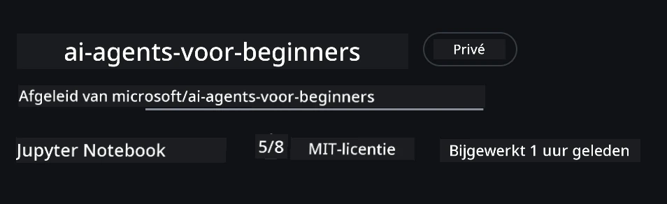

# Cursusopzet

## Inleiding

Deze les behandelt hoe je de codevoorbeelden van deze cursus kunt uitvoeren.

## Sluit je aan bij andere cursisten en krijg hulp

Voordat je je repo kloont, sluit je aan bij het [AI Agents For Beginners Discord-kanaal](https://aka.ms/ai-agents/discord) om hulp te krijgen bij de setup, vragen over de cursus te stellen of om in contact te komen met andere cursisten.

## Deze repo klonen of forken

Om te beginnen, kloon of fork het GitHub-repository. Dit maakt je eigen versie van het cursusmateriaal zodat je de code kunt uitvoeren, testen en aanpassen!

Dit kan worden gedaan door op de link te klikken om <a href="https://github.com/microsoft/ai-agents-for-beginners/fork" target="_blank">fork de repo</a>

Je zou nu je eigen geforkte versie van deze cursus moeten hebben op de volgende link:



### Shallow Clone (aanbevolen voor workshop / Codespaces)

  >De volledige repository kan groot zijn (~3 GB) wanneer je de volledige geschiedenis en alle bestanden downloadt. Als je alleen de workshop bijwoont of maar een paar lesmappen nodig hebt, voorkomt een shallow clone (of een sparse clone) het grootste deel van die download door de geschiedenis in te korten en/of blobs over te slaan.

#### Snelle shallow clone — minimale geschiedenis, alle bestanden

Vervang `<your-username>` in de onderstaande commando's door je fork-URL (of de upstream-URL als je dat liever hebt).

Om alleen de meest recente commitgeschiedenis te klonen (kleine download):

```bash|powershell
git clone --depth 1 https://github.com/<your-username>/ai-agents-for-beginners.git
```

Om een specifieke branch te klonen:

```bash|powershell
git clone --depth 1 --branch <branch-name> https://github.com/<your-username>/ai-agents-for-beginners.git
```

#### Gedeeltelijke (sparse) clone — minimale blobs + alleen geselecteerde mappen

Dit gebruikt partial clone en sparse-checkout (vereist Git 2.25+ en aanbevolen moderne Git met partial clone-ondersteuning):

```bash|powershell
git clone --depth 1 --filter=blob:none --sparse https://github.com/<your-username>/ai-agents-for-beginners.git
```

Ga naar de repo-map:

```bash|powershell
cd ai-agents-for-beginners
```

Geef vervolgens aan welke mappen je wilt (voorbeeld hieronder toont twee mappen):

```bash|powershell
git sparse-checkout set 00-course-setup 01-intro-to-ai-agents
```

Na het klonen en verifiëren van de bestanden, als je alleen bestanden nodig hebt en ruimte wilt vrijmaken (geen git-geschiedenis), verwijder dan de repository-metadata (💀onherroepelijk — je verliest alle Git-functionaliteit: geen commits, pulls, pushes of toegang tot geschiedenis).

```bash
# zsh/bash
rm -rf .git
```

```powershell
# PowerShell
Remove-Item -Recurse -Force .git
```

#### GitHub Codespaces gebruiken (aanbevolen om grote lokale downloads te vermijden)

- Maak een nieuwe Codespace voor deze repo via de [GitHub UI](https://github.com/codespaces).  

- In de terminal van de nieuw gemaakte codespace, voer een van de shallow/sparse clone-commando's hierboven uit om alleen de lesmappen die je nodig hebt in de Codespace-werkruimte te halen.
- Optioneel: na het klonen binnen Codespaces, verwijder .git om extra ruimte terug te winnen (zie verwijderingscommando's hierboven).
- Opmerking: Als je de repo liever direct in Codespaces opent (zonder een extra clone), houd er dan rekening mee dat Codespaces de devcontainer-omgeving zal opbouwen en mogelijk meer zal voorzien dan je nodig hebt. Het klonen van een shallow-kopie binnen een frisse Codespace geeft je meer controle over schijfruimte.

#### Tips

- Vervang altijd de clone-URL door je fork als je wilt bewerken/committen.
- Als je later meer geschiedenis of bestanden nodig hebt, kun je ze ophalen of sparse-checkout aanpassen om extra mappen op te nemen.

## De code uitvoeren

Deze cursus biedt een serie Jupyter Notebooks die je kunt uitvoeren om praktijkervaring op te doen met het bouwen van AI-agents.

De codevoorbeelden gebruiken **Microsoft Agent Framework (MAF)** met de `AzureAIProjectAgentProvider`, die verbinding maakt met **Azure AI Agent Service V2** (de Responses API) via **Microsoft Foundry**.

Alle Python-notebooks zijn gelabeld `*-python-agent-framework.ipynb`.

## Vereisten

- Python 3.12+
  - **OPMERKING**: Als je Python3.12 niet geïnstalleerd hebt, zorg er dan voor dat je het installeert. Maak daarna je venv aan met python3.12 om te verzekeren dat de juiste versies uit het requirements.txt-bestand worden geïnstalleerd.
  
    >Voorbeeld

    Maak een Python venv-map aan:

    ```bash|powershell
    python -m venv venv
    ```

    Activeer vervolgens de venv-omgeving voor:

    ```bash
    # zsh/bash
    source venv/bin/activate
    ```
  
    ```dos
    # Command Prompt for Windows
    venv\Scripts\activate
    ```

- .NET 10+: Voor de voorbeeldcodes die .NET gebruiken, zorg ervoor dat je de [.NET 10 SDK](https://dotnet.microsoft.com/download/dotnet/10.0) of later installeert. Controleer daarna je geïnstalleerde .NET SDK-versie:

    ```bash|powershell
    dotnet --list-sdks
    ```

- **Azure CLI** — Vereist voor authenticatie. Installeer vanaf [aka.ms/installazurecli](https://aka.ms/installazurecli).
- **Azure Subscription** — Voor toegang tot Microsoft Foundry en Azure AI Agent Service.
- **Microsoft Foundry-project** — Een project met een gedeployd model (bijv. `gpt-4o`). Zie [Stap 1](../../../00-course-setup) hieronder.

We hebben een `requirements.txt`-bestand opgenomen in de root van deze repository met alle benodigde Python-pakketten om de codevoorbeelden uit te voeren.

Je kunt ze installeren door het volgende commando uit te voeren in je terminal in de root van de repository:

```bash|powershell
pip install -r requirements.txt
```

We raden aan een Python-virtuele omgeving te creëren om conflicten en problemen te voorkomen.

## VSCode instellen

Zorg ervoor dat je de juiste versie van Python in VSCode gebruikt.


## Microsoft Foundry en Azure AI Agent Service instellen

### Stap 1: Maak een Microsoft Foundry-project

Je hebt een Azure AI Foundry **hub** en **project** met een gedeployed model nodig om de notebooks uit te voeren.

1. Ga naar [ai.azure.com](https://ai.azure.com) en meld je aan met je Azure-account.
2. Maak een **hub** (of gebruik een bestaande). Zie: [Hub resources overview](https://learn.microsoft.com/azure/ai-foundry/concepts/ai-resources).
3. Maak binnen de hub een **project**.
4. Deploy een model (bijv. `gpt-4o`) via **Models + Endpoints** → **Deploy model**.

### Stap 2: Haal je projectendpoint en de naam van de modelimplementatie op

Vanaf je project in de Microsoft Foundry-portal:

- **Projectendpoint** — Ga naar de **Overzicht**-pagina en kopieer de endpoint-URL.


- **Naam van de modelimplementatie** — Ga naar **Models + Endpoints**, selecteer je gedeployde model en noteer de **Deployment name** (bijv. `gpt-4o`).

### Stap 3: Meld je aan bij Azure met `az login`

Alle notebooks gebruiken **`AzureCliCredential`** voor authenticatie — geen API-sleutels om te beheren. Dit vereist dat je aangemeld bent via de Azure CLI.

1. **Installeer de Azure CLI** als je dat nog niet hebt gedaan: [aka.ms/installazurecli](https://aka.ms/installazurecli)

2. **Meld je aan** door het volgende uit te voeren:

    ```bash|powershell
    az login
    ```

    Of als je in een remote/Codespace-omgeving bent zonder browser:

    ```bash|powershell
    az login --use-device-code
    ```

3. **Selecteer je subscription** als daarom wordt gevraagd — kies degene met je Foundry-project.

4. **Verifieer** dat je bent aangemeld:

    ```bash|powershell
    az account show
    ```

> **Waarom `az login`?** De notebooks authenticeren met `AzureCliCredential` van het `azure-identity`-pakket. Dit betekent dat je Azure CLI-sessie de referenties levert — geen API-sleutels of secrets in je `.env`-bestand. Dit is een [security best practice](https://learn.microsoft.com/azure/developer/ai/keyless-connections).

### Stap 4: Maak je `.env`-bestand aan

Kopieer het voorbeeldbestand:

```bash
# zsh/bash
cp .env.example .env
```

```powershell
# PowerShell
Copy-Item .env.example .env
```

Open `.env` en vul deze twee waarden in:

```env
AZURE_AI_PROJECT_ENDPOINT=https://<your-project>.services.ai.azure.com/api/projects/<your-project-id>
AZURE_AI_MODEL_DEPLOYMENT_NAME=gpt-4o
```

| Variabele | Waar te vinden |
|----------|-----------------|
| `AZURE_AI_PROJECT_ENDPOINT` | Foundry-portal → je project → **Overzicht**-pagina |
| `AZURE_AI_MODEL_DEPLOYMENT_NAME` | Foundry-portal → **Models + Endpoints** → de naam van je gedeployde model |

Dat is het voor de meeste lessen! De notebooks authenticeren automatisch via je `az login`-sessie.

### Stap 5: Installeer Python-afhankelijkheden

```bash|powershell
pip install -r requirements.txt
```

We raden aan dit binnen de eerder aangemaakte virtuele omgeving uit te voeren.

## Aanvullende setup voor les 5 (Agentic RAG)

Les 5 gebruikt **Azure AI Search** voor retrieval-augmented generation. Als je van plan bent die les uit te voeren, voeg dan deze variabelen toe aan je `.env`-bestand:

| Variabele | Waar te vinden |
|----------|-----------------|
| `AZURE_SEARCH_SERVICE_ENDPOINT` | Azure-portal → je **Azure AI Search** resource → **Overview** → URL |
| `AZURE_SEARCH_API_KEY` | Azure-portal → je **Azure AI Search** resource → **Settings** → **Keys** → primary admin key |

## Aanvullende setup voor les 6 en les 8 (GitHub Models)

Sommige notebooks in les 6 en 8 gebruiken **GitHub Models** in plaats van Azure AI Foundry. Als je van plan bent die voorbeelden uit te voeren, voeg dan deze variabelen toe aan je `.env`-bestand:

| Variabele | Waar te vinden |
|----------|-----------------|
| `GITHUB_TOKEN` | GitHub → **Settings** → **Developer settings** → **Personal access tokens** |
| `GITHUB_ENDPOINT` | Gebruik `https://models.inference.ai.azure.com` (standaardwaarde) |
| `GITHUB_MODEL_ID` | Modelnaam om te gebruiken (bijv. `gpt-4o-mini`) |

## Aanvullende setup voor les 8 (Bing Grounding Workflow)

De conditionele workflow-notebook in les 8 gebruikt **Bing grounding** via Azure AI Foundry. Als je van plan bent dat voorbeeld uit te voeren, voeg dan deze variabele toe aan je `.env`-bestand:

| Variabele | Waar te vinden |
|----------|-----------------|
| `BING_CONNECTION_ID` | Azure AI Foundry-portal → je project → **Management** → **Connected resources** → je Bing-verbinding → kopieer de connection ID |

## Probleemoplossing

### SSL-certificaatverificatiefouten op macOS

Als je macOS gebruikt en een fout tegenkomt zoals:

```plaintext
ssl.SSLCertVerificationError: [SSL: CERTIFICATE_VERIFY_FAILED] certificate verify failed: self-signed certificate in certificate chain
```

Dit is een bekend probleem met Python op macOS waarbij de systeem-SSL-certificaten niet automatisch vertrouwd worden. Probeer de volgende oplossingen in volgorde:

**Optie 1: Voer het Install Certificates-script van Python uit (aanbevolen)**

```bash
# Vervang 3.XX door uw geïnstalleerde Python-versie (bijv. 3.12 of 3.13):
/Applications/Python\ 3.XX/Install\ Certificates.command
```

**Optie 2: Gebruik `connection_verify=False` in je notebook (alleen voor GitHub Models-notebooks)**

In de les 6-notebook (`06-building-trustworthy-agents/code_samples/06-system-message-framework.ipynb`) is een uitgecommentarieerde workaround al opgenomen. Haal de commentaar weg bij `connection_verify=False` wanneer je de client aanmaakt:

```python
client = ChatCompletionsClient(
    endpoint=endpoint,
    credential=AzureKeyCredential(token),
    connection_verify=False,  # Schakel SSL-verificatie uit als u certificaatfouten tegenkomt
)
```

> **⚠️ Waarschuwing:** Het uitschakelen van SSL-verificatie (`connection_verify=False`) vermindert de beveiliging door certificate-validatie over te slaan. Gebruik dit alleen als tijdelijke workaround in ontwikkelomgevingen, nooit in productie.

**Optie 3: Installeer en gebruik `truststore`**

```bash
pip install truststore
```

Voeg daarna het volgende toe bovenaan je notebook of script voordat je netwerkverzoeken maakt:

```python
import truststore
truststore.inject_into_ssl()
```

## Vastgelopen?

Als je problemen hebt met het uitvoeren van deze setup, ga naar onze <a href="https://discord.gg/kzRShWzttr" target="_blank">Azure AI Community Discord</a> of <a href="https://github.com/microsoft/ai-agents-for-beginners/issues?WT.mc_id=academic-105485-koreyst" target="_blank">maak een issue aan</a>.

## Volgende les

Je bent nu klaar om de code voor deze cursus uit te voeren. Veel plezier met het verder verkennen van de wereld van AI-agents! 

[Introductie tot AI-agents en gebruiksscenario's](../01-intro-to-ai-agents/README.md)

---

<!-- CO-OP TRANSLATOR DISCLAIMER START -->
**Disclaimer**:
Dit document is vertaald met behulp van de AI-vertalingsdienst [Co-op Translator](https://github.com/Azure/co-op-translator). Hoewel wij ons inspannen voor nauwkeurigheid, dient u er rekening mee te houden dat geautomatiseerde vertalingen fouten of onnauwkeurigheden kunnen bevatten. Het originele document in de oorspronkelijke taal geldt als de gezaghebbende bron. Voor cruciale informatie raden wij een professionele menselijke vertaling aan. Wij zijn niet aansprakelijk voor eventuele misverstanden of verkeerde interpretaties die voortvloeien uit het gebruik van deze vertaling.
<!-- CO-OP TRANSLATOR DISCLAIMER END -->