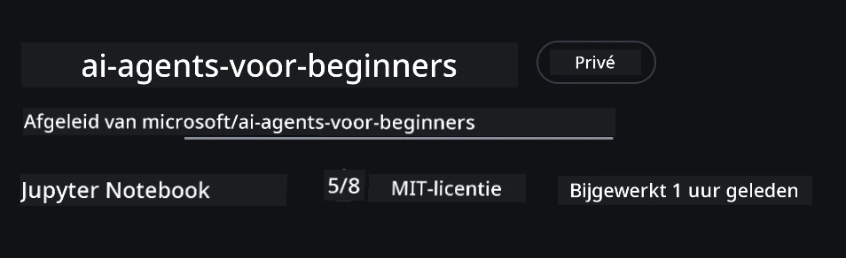
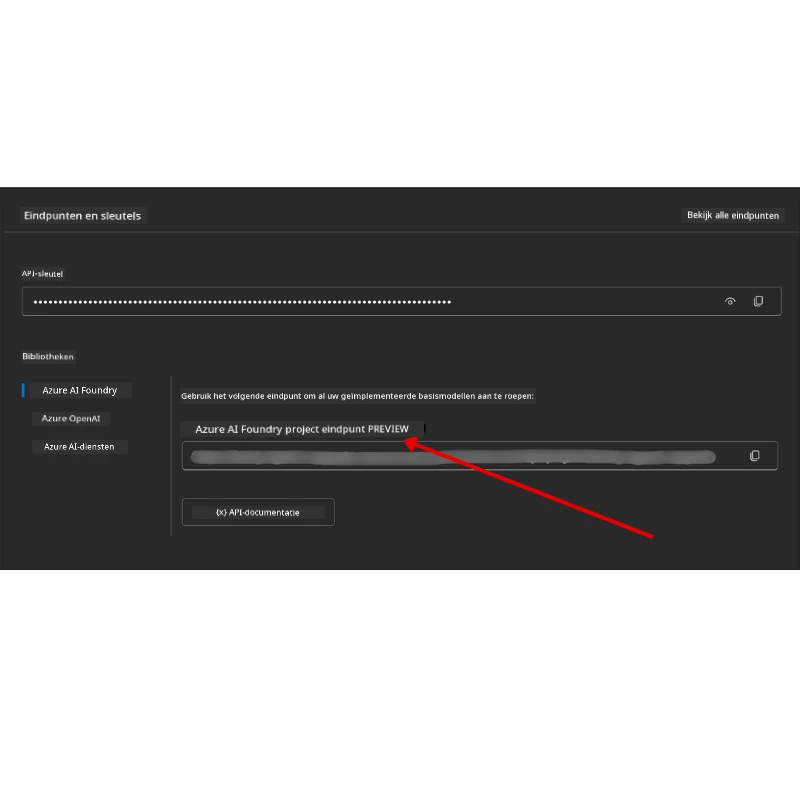

# Cursusinstallatie

## Inleiding

Deze les behandelt hoe je de codesamples van deze cursus kunt uitvoeren.

## Sluit je aan bij andere cursisten en krijg hulp

Voordat je begint met het klonen van je repo, sluit je aan bij het [AI Agents For Beginners Discord-kanaal](https://aka.ms/ai-agents/discord) om hulp te krijgen bij de setup, vragen over de cursus te stellen of om in contact te komen met andere cursisten.

## Clone of Fork deze repo

Om te beginnen, clone of fork je de GitHub repository. Dit maakt je een eigen versie van het cursusmateriaal zodat je de code kunt uitvoeren, testen en aanpassen!

Dit kan door te klikken op de link naar <a href="https://github.com/microsoft/ai-agents-for-beginners/fork" target="_blank">fork de repo</a>

Je zou nu je eigen geforkte versie van deze cursus moeten hebben op de volgende link:



### Shallow Clone (aanbevolen voor workshop / Codespaces)

  >De volledige repository kan groot zijn (~3 GB) wanneer je de volledige geschiedenis en alle bestanden downloadt. Als je alleen de workshop bijwoont of slechts een paar lesmappen nodig hebt, downloadt een shallow clone (of een sparse clone) veel minder.

#### Snelle shallow clone — minimale geschiedenis, alle bestanden

Vervang `<your-username>` in de onderstaande opdrachten met je fork-URL (of de upstream URL als je dat liever hebt).

Om alleen de meest recente commitgeschiedenis te klonen (kleine download):

```bash
git clone --depth 1 https://github.com/<your-username>/ai-agents-for-beginners.git
```

Om een specifieke branch te klonen:

```bash
git clone --depth 1 --branch <branch-name> https://github.com/<your-username>/ai-agents-for-beginners.git
```

#### Gedeeltelijke (sparse) clone — minimale blobs + alleen geselecteerde mappen

Dit gebruikt partial clone en sparse-checkout (vereist Git 2.25+ en wordt aanbevolen met moderne Git met partial clone ondersteuning):

```bash
git clone --depth 1 --filter=blob:none --sparse https://github.com/<your-username>/ai-agents-for-beginners.git
```

Ga naar de repo-map:

```bash
cd ai-agents-for-beginners
```

Geef dan aan welke mappen je wilt (voorbeeld hieronder toont twee mappen):

```bash
git sparse-checkout set 00-course-setup 01-intro-to-ai-agents
```

Na het klonen en verifiëren van de bestanden, als je alleen bestanden nodig hebt en ruimte wilt vrijmaken (geen git-geschiedenis), verwijder dan de repository metadata (💀onherroepelijk — je verliest alle Git-functionaliteit):

```bash
# zsh/bash
rm -rf .git
```

```powershell
# PowerShell
Remove-Item -Recurse -Force .git
```

#### Gebruik GitHub Codespaces (aanbevolen om lokale grote downloads te vermijden)

- Maak een nieuwe Codespace voor deze repo via de [GitHub UI](https://github.com/codespaces).  

- Voer in de terminal van de nieuw aangemaakte codespace een van de bovenstaande shallow/sparse clone commando's uit om alleen de lesmappen die je nodig hebt in de Codespace workspace te halen.
- Optioneel: verwijder na het klonen binnen Codespaces de .git map om extra ruimte vrij te maken (zie verwijdercommando's hierboven).
- Opmerking: als je de repo liever direct opent in Codespaces (zonder een extra clone), houd er dan rekening mee dat Codespaces de devcontainer-omgeving zal construeren en mogelijk meer provisioneert dan je nodig hebt.

#### Tips

- Vervang altijd de clone-URL door je fork als je wilt bewerken/commiteren.
- Als je later meer geschiedenis of bestanden nodig hebt, kun je ze ophalen of sparse-checkout aanpassen om extra mappen te includeren.

## De Code Uitvoeren

Deze cursus biedt een reeks Jupyter Notebooks waarmee je praktisch ervaring kunt opdoen met het bouwen van AI Agents.

De codesamples gebruiken **Microsoft Agent Framework (MAF)** met de `FoundryChatClient`, die verbinding maakt met **Microsoft Foundry Agent Service V2** (de Responses API) via **Microsoft Foundry**.

Alle Python-notebooks zijn gelabeld als `*-python-agent-framework.ipynb`.

## Vereisten

- Python 3.12+
  - **OPMERKING**: Als je Python3.12 niet geïnstalleerd hebt, zorg dan dat je het installeert. Maak daarna je venv aan met python3.12 om zeker te zijn dat de correcte versies van het requirements.txt bestand worden geïnstalleerd.
  
    >Voorbeeld

    Maak Python venv directory aan:

    ```bash
    python -m venv venv
    ```

    Activeer dan de venv-omgeving voor:

    ```bash
    # zsh/bash
    source venv/bin/activate
    ```
  
    ```dos
    # Command Prompt for Windows
    venv\Scripts\activate
    ```

- .NET 10+: Voor de voorbeeldcodes die .NET gebruiken, zorg dat je [.NET 10 SDK](https://dotnet.microsoft.com/download/dotnet/10.0) of later installeert. Controleer dan de geïnstalleerde .NET SDK-versie:

    ```bash
    dotnet --list-sdks
    ```

- **Azure CLI** — Vereist voor authenticatie. Installeer van [aka.ms/installazurecli](https://aka.ms/installazurecli).
- **Azure Subscriptie** — Voor toegang tot Microsoft Foundry en Microsoft Foundry Agent Service.
- **Microsoft Foundry Project** — Een project met een gedeponeerd model (bijvoorbeeld `gpt-5-mini`). Zie [Stap 1](#stap-1-maak-een-microsoft-foundry-project-aan) hieronder.

We hebben een `requirements.txt` bestand toegevoegd in de root van deze repository die alle vereiste Python-pakketten bevat om de codesamples uit te voeren.

Je kunt deze installeren door het volgende commando uit te voeren in je terminal in de root van de repository:

```bash
pip install -r requirements.txt
```

We raden aan om een Python virtuele omgeving te maken om conflicten en problemen te voorkomen.

## VSCode Configureren

Zorg ervoor dat je de juiste versie van Python in VSCode gebruikt.


## Microsoft Foundry en Microsoft Foundry Agent Service Instellen

### Stap 1: Maak een Microsoft Foundry Project aan

Je hebt een Microsoft Foundry **hub** en **project** met een gedeponeerd model nodig om de notebooks uit te voeren.

1. Ga naar [ai.azure.com](https://ai.azure.com) en log in met je Azure-account.
2. Maak een **hub** aan (of gebruik een bestaande). Zie: [Hub resources overview](https://learn.microsoft.com/azure/ai-foundry/concepts/ai-resources).
3. Maak binnen de hub een **project** aan.
4. Deploy een model (bijv. `gpt-5-mini`) via **Models + Endpoints** → **Deploy model**.

### Stap 2: Haal jouw Project Endpoint en Model Deployment Naam op

Vanuit je project in het Microsoft Foundry-portaal:

- **Project Endpoint** — Ga naar de **Overview** pagina en kopieer de endpoint-URL.



- **Model Deployment Naam** — Ga naar **Models + Endpoints**, selecteer jouw gedeponeerde model, en noteer de **Deployment name** (bijv. `gpt-5-mini`).

### Stap 3: Meld je aan bij Azure met `az login`

De meeste notebooks authenticeren via jouw **Azure CLI aanmelding** — met `AzureCliCredential` of `DefaultAzureCredential` (beiden halen je `az login` sessie op) uit het `azure-identity` pakket — dus ze vereisen geen API-sleutels. Een aantal lessen en optionele integraties gebruiken API-sleutels; controleer per les de vereisten op eventuele extra omgevingsvariabelen. Dit vereist dat je bent ingelogd via de Azure CLI.

1. **Installeer de Azure CLI** als je dat nog niet hebt gedaan: [aka.ms/installazurecli](https://aka.ms/installazurecli)

2. **Log in** door het volgende uit te voeren:

    ```bash
    az login
    ```

    Of als je in een remote/Codespace omgeving bent zonder browser:

    ```bash
    az login --use-device-code
    ```

3. **Selecteer je abonnement** als hierom wordt gevraagd — kies het abonnement dat je Foundry-project bevat.

4. **Verifieer** dat je bent ingelogd:

    ```bash
    az account show
    ```

> **Waarom `az login`?** De notebooks authenticeren met `AzureCliCredential` (of `DefaultAzureCredential`, wat ook je Azure CLI aanmelding ophaalt) uit het `azure-identity` pakket. Dit betekent dat je Azure CLI sessie de credentials levert — geen API-sleutels of geheimen in je `.env` bestand. Dit is een [beveiligingsbest practice](https://learn.microsoft.com/azure/developer/ai/keyless-connections).

### Stap 4: Maak je `.env` bestand aan

Kopieer het voorbeeldbestand:

```bash
# zsh/bash
cp .env.example .env
```

```powershell
# PowerShell
Copy-Item .env.example .env
```

Open `.env` en vul deze twee waarden in:

```env
AZURE_AI_PROJECT_ENDPOINT=https://<your-project>.services.ai.azure.com/api/projects/<your-project-id>
AZURE_AI_MODEL_DEPLOYMENT_NAME=gpt-5-mini
```

| Variabele | Waar te vinden |
|----------|-----------------|
| `AZURE_AI_PROJECT_ENDPOINT` | Foundry portal → jouw project → **Overview** pagina |
| `AZURE_AI_MODEL_DEPLOYMENT_NAME` | Foundry portal → **Models + Endpoints** → de naam van jouw gedeponeerde model |

Dat is het voor de meeste lessen! De notebooks authenticeren automatisch via jouw `az login` sessie.

### Stap 5: Installeer Python-afhankelijkheden

```bash
pip install -r requirements.txt
```

We raden aan dit uit te voeren binnen de eerder aangemaakte virtuele omgeving.

## Optionele Setup: Azure AI Search (Lessen 5 en 16)

De Lessen 5 (Agentic RAG) en 16 notebooks werken direct met een **in-memory kennisdatabase** — er zijn geen extra Azure-resources nodig. Als je ze wilt ondersteunen met een echte **Azure AI Search** index, houd er rekening mee dat de **Les 16 notebook momenteel gebruikmaakt van sleutel-gebaseerde authenticatie**: deze schakelt van in-memory search naar Azure AI Search alleen als **beide** `AZURE_SEARCH_SERVICE_ENDPOINT` **en** `AZURE_SEARCH_API_KEY` zijn ingesteld, en anders blijft het op in-memory search — om het dus te draaien tegen een echte index moet je ook de beheerderssleutel instellen. Sleutel-loze authenticatie met Microsoft Entra ID (RBAC) is de aanbevolen aanpak voor je eigen productcode, in lijn met de `az login` flow die overal in deze cursus wordt gebruikt.

De onderstaande RBAC stappen gelden voor de setup-guide samples en je eigen code. Ze schakelen de sleutel-loze authenticatie in Les 16 notebook niet in; Les 16 vereist nog steeds zowel de endpoint als de beheerderssleutel om Azure AI Search te gebruiken.

1. **Schakel role-based access in** op je zoekservice:

    ```bash
    az search service update --name <service-name> --resource-group <resource-group> --auth-options aadOrApiKey
    ```

2. **Ken jezelf de vereiste rollen toe** (maken/laden indexes en query):

    ```bash
    az role assignment create --assignee <your-user-or-principal-id> --role "Search Service Contributor" --scope $(az search service show -g <resource-group> -n <service-name> --query id -o tsv)
    az role assignment create --assignee <your-user-or-principal-id> --role "Search Index Data Contributor" --scope $(az search service show -g <resource-group> -n <service-name> --query id -o tsv)
    ```

3. **Voeg de endpoint toe** aan je `.env` bestand:

| Variabele | Waar te vinden |
|----------|-----------------|
| `AZURE_SEARCH_SERVICE_ENDPOINT` | Azure portal → jouw **Azure AI Search** resource → **Overview** → URL |
| `AZURE_SEARCH_API_KEY` | Vereist (met de endpoint) om Azure AI Search in Les 16 notebook te activeer, die sleutel-gebaseerde auth gebruikt. Azure portal → **Settings** → **Keys** → primaire beheerderssleutel |

> **Waarom sleutel-loos?** Beheerderssleutels geven volledige schrijfrechten op jouw zoekservice en kunnen lekken via `.env` bestanden. Met RBAC wordt in plaats daarvan jouw `az login` identiteit gebruikt — hetzelfde sleutel-loze Entra ID patroon dat de cursusnotebooks gebruiken (via `AzureCliCredential` / `DefaultAzureCredential`). Zie [Connect to Azure AI Search using roles](https://learn.microsoft.com/azure/search/search-security-rbac).

Zie de [Azure AI Search setup guide](./AzureSearch.md) voor volledige index-creatievoorbeelden in Python en .NET.

## Extra Setup voor Lessen die Direct Azure OpenAI Aanspreken (Lessen 6 en 8)

Sommige notebooks in lessen 6 en 8 roepen **Azure OpenAI** direct aan (met gebruik van de **Responses API**) in plaats van via een Microsoft Foundry project te gaan. Deze samples gebruikten eerder GitHub Models, wat verouderd is en de Responses API niet ondersteunt. Voeg deze variabelen toe aan je `.env` bestand:

| Variabele | Waar te vinden |
|----------|-----------------|
| `AZURE_OPENAI_ENDPOINT` | Azure portal → jouw **Azure OpenAI** resource → **Keys and Endpoint** → Endpoint (bv. `https://<your-resource>.openai.azure.com`) |
| `AZURE_OPENAI_DEPLOYMENT` | De naam van je gedeponeerde model (bv. `gpt-5-mini`) die de Responses API ondersteunt |
| `AZURE_OPENAI_API_KEY` | Optioneel — alleen als je sleutel-gebaseerde auth gebruikt i.p.v. `az login` / Entra ID |

> De Responses API gebruikt de stabiele `/openai/v1/` endpoint, dus er is geen `api-version` nodig. Log in met `az login` om sleutel-loze Entra ID authenticatie te gebruiken.

## Alternatieve Provider: MiniMax (OpenAI-Compatibel)

[MiniMax](https://platform.minimaxi.com/) biedt grootschalige contextmodellen (tot 204K tokens) via een OpenAI-compatibele API. Omdat de Microsoft Agent Framework's `OpenAIChatClient` werkt met elke OpenAI-compatibele endpoint, kun je MiniMax gebruiken als drop-in alternatief voor lessen die `OpenAIChatClient` gebruiken.

Voeg deze variabelen toe aan je `.env` bestand:

| Variabele | Waar te vinden |
|----------|-----------------|
| `MINIMAX_API_KEY` | [MiniMax Platform](https://platform.minimaxi.com/) → API-sleutels |
| `MINIMAX_BASE_URL` | Gebruik `https://api.minimax.io/v1` (standaardwaarde) |
| `MINIMAX_MODEL_ID` | Modelnaam om te gebruiken (bv. `MiniMax-M3`) |

**Voorbeeldmodellen**: `MiniMax-M3` (aanbevolen), `MiniMax-M2.7`, `MiniMax-M2.7-highspeed` (snellere reacties). Modelnamen en beschikbaarheid kunnen in de loop van de tijd veranderen, en toegang tot een model kan van je account afhangen.

De codesamples die `OpenAIChatClient` gebruiken (zoals Lesson 14 hotelreserveringsworkflow) detecteren en gebruiken automatisch je MiniMax-configuratie wanneer `MINIMAX_API_KEY` is ingesteld.


## Alternatieve Provider: Foundry Local (Voer Modellen Uit op het Apparaat)

[Foundry Local](https://foundrylocal.ai) is een lichte runtime die taalmodellen **helemaal op je eigen machine** downloadt, beheert en serveert via een OpenAI-compatibele API — geen cloud nodig.

Omdat de Microsoft Agent Framework's `OpenAIChatClient` werkt met elk OpenAI-compatibel eindpunt, is Foundry Local een directe lokale vervanging voor Azure OpenAI.

**1. Installeer Foundry Local**

```bash
# Windows
winget install Microsoft.FoundryLocal

# macOS
brew install foundrylocal
```

**2. Download en voer een model uit** (dit start ook de lokale service):

```bash
foundry model list          # zie beschikbare modellen
foundry model run phi-4-mini
```

**3. Installeer de Python SDK** die wordt gebruikt om het lokale eindpunt te ontdekken:

```bash
pip install foundry-local-sdk
```

**4. Richt het Microsoft Agent Framework op je lokale model:**

```python
from foundry_local import FoundryLocalManager
from agent_framework.openai import OpenAIChatClient

# Downloadt (indien nodig) en serveert het model lokaal, en ontdekt vervolgens de endpoint/poort.
manager = FoundryLocalManager("phi-4-mini")

chat_client = OpenAIChatClient(
    base_url=manager.endpoint,      # bijvoorbeeld http://localhost:<port>/v1
    api_key=manager.api_key,        # altijd "niet-vereist" voor Foundry Local
    model_id=manager.get_model_info("phi-4-mini").id,
)

agent = chat_client.as_agent(
    name="LocalAgent",
    instructions="You are a helpful assistant running fully on-device.",
)
```

> **Opmerking:** Foundry Local biedt een OpenAI-compatibel **Chat Completions** eindpunt aan. Gebruik dit voor lokale ontwikkeling en offline scenario's. Voor de volledige **Responses API** functieset (staatvolle gesprekken, enz.), gebruik Azure OpenAI of een Microsoft Foundry-project.

## Extra Setup voor Les 8 (Bing Grondslagsworkflow)

Het conditionele workflow-notebook in les 8 gebruikt **Bing grounding** via Microsoft Foundry. Als je dat voorbeeld wilt uitvoeren, voeg dan deze variabele toe aan je `.env` bestand:

| Variabele | Waar te vinden |
|----------|---------------|
| `BING_CONNECTION_ID` | Microsoft Foundry portal → je project → **Management** → **Connected resources** → je Bing-verbinding → kopieer de verbindings-ID |

## Problemen Oplossen

### SSL Certificaatverificatiefouten op macOS

Als je macOS gebruikt en een fout krijgt zoals:

```plaintext
ssl.SSLCertVerificationError: [SSL: CERTIFICATE_VERIFY_FAILED] certificate verify failed: self-signed certificate in certificate chain
```

Dit is een bekend probleem met Python op macOS waarbij de systeem-SSL-certificaten niet automatisch worden vertrouwd. Probeer de volgende oplossingen in volgorde:

**Optie 1: Voer het Install Certificates-script van Python uit (aanbevolen)**

```bash
# Vervang 3.XX door uw geïnstalleerde Python-versie (bijv. 3.12 of 3.13):
/Applications/Python\ 3.XX/Install\ Certificates.command
```

**Optie 2: Gebruik `connection_verify=False` in je notebook (alleen voor GitHub Models notebooks)**

In het Lesson 6-notebook (`06-building-trustworthy-agents/code_samples/06-system-message-framework.ipynb`) is een uitgecommentarieerde workaround al opgenomen. Haal `connection_verify=False` uit de commentaar wanneer je certificaatfouten krijgt:

```python
client = ChatCompletionsClient(
    endpoint=endpoint,
    credential=AzureKeyCredential(token),
    connection_verify=False,  # Schakel SSL-verificatie uit als u certificaatfouten tegenkomt
)
```

> **⚠️ Waarschuwing:** Het uitschakelen van SSL-verificatie (`connection_verify=False`) vermindert de beveiliging doordat certificaatvalidatie wordt overgeslagen. Gebruik dit alleen als tijdelijke oplossing in ontwikkelomgevingen. Gebruik dit nooit in productie.

**Optie 3: Installeer en gebruik `truststore`**

```bash
pip install truststore
```

Voeg dan het volgende toe bovenaan je notebook of script voordat je netwerkcalls maakt:

```python
import truststore
truststore.inject_into_ssl()
```

## Vastgelopen?

Als je problemen hebt met deze setup, kom dan naar onze <a href="https://discord.gg/kzRShWzttr" target="_blank">Azure AI Community Discord</a> of <a href="https://github.com/microsoft/ai-agents-for-beginners/issues?WT.mc_id=academic-105485-koreyst" target="_blank">maak een issue aan</a>.

## Volgende Les

Je bent nu klaar om de code voor deze cursus uit te voeren. Veel plezier met het leren over de wereld van AI Agents! 

[Introductie tot AI Agents en Use Cases voor Agents](../01-intro-to-ai-agents/README.md)

---

<!-- CO-OP TRANSLATOR DISCLAIMER START -->
**Disclaimer**:
Dit document is vertaald met behulp van de AI vertaaldienst [Co-op Translator](https://github.com/Azure/co-op-translator). Hoewel we streven naar nauwkeurigheid, dient u er rekening mee te houden dat geautomatiseerde vertalingen fouten of onnauwkeurigheden kunnen bevatten. Het originele document in de oorspronkelijke taal moet worden beschouwd als de gezaghebbende bron. Voor kritieke informatie wordt professionele menselijke vertaling aanbevolen. Wij zijn niet aansprakelijk voor eventuele misverstanden of verkeerde interpretaties die voortvloeien uit het gebruik van deze vertaling.
<!-- CO-OP TRANSLATOR DISCLAIMER END -->