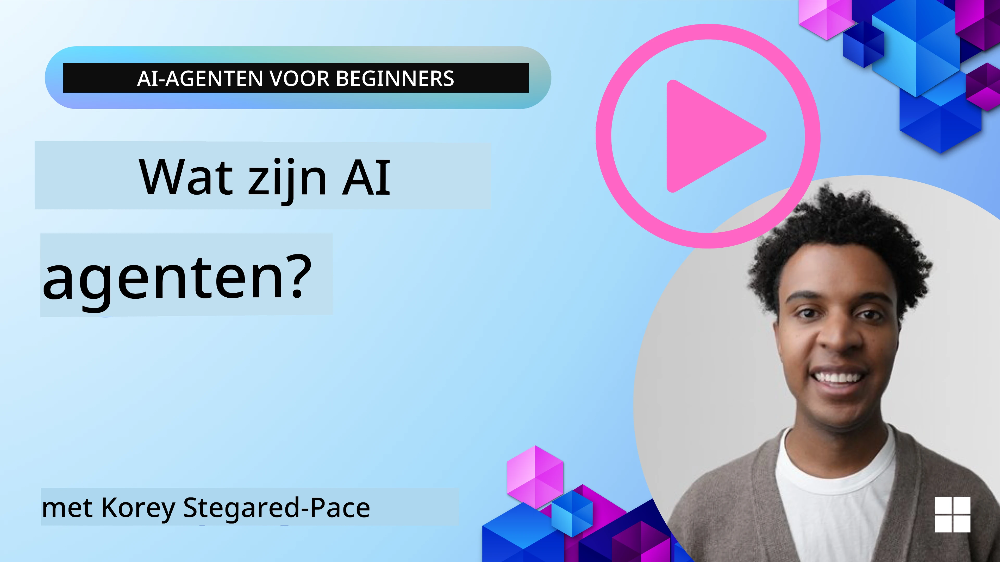
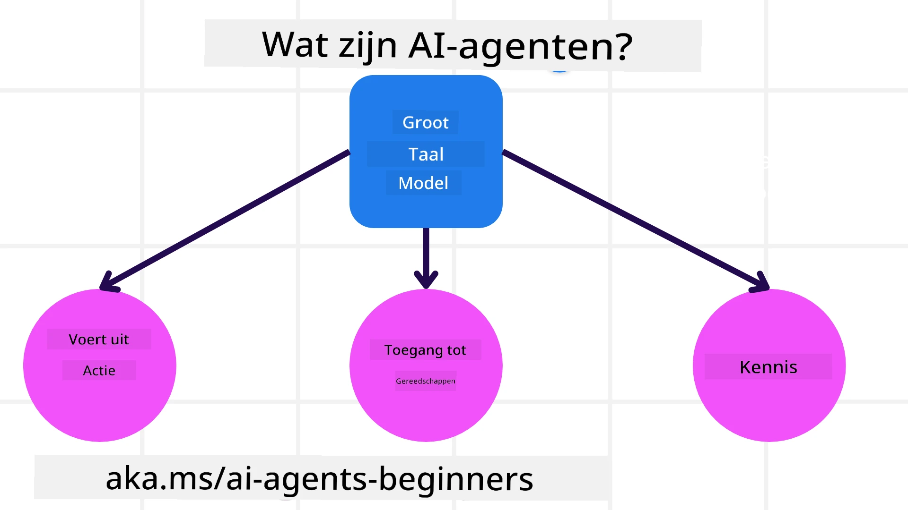
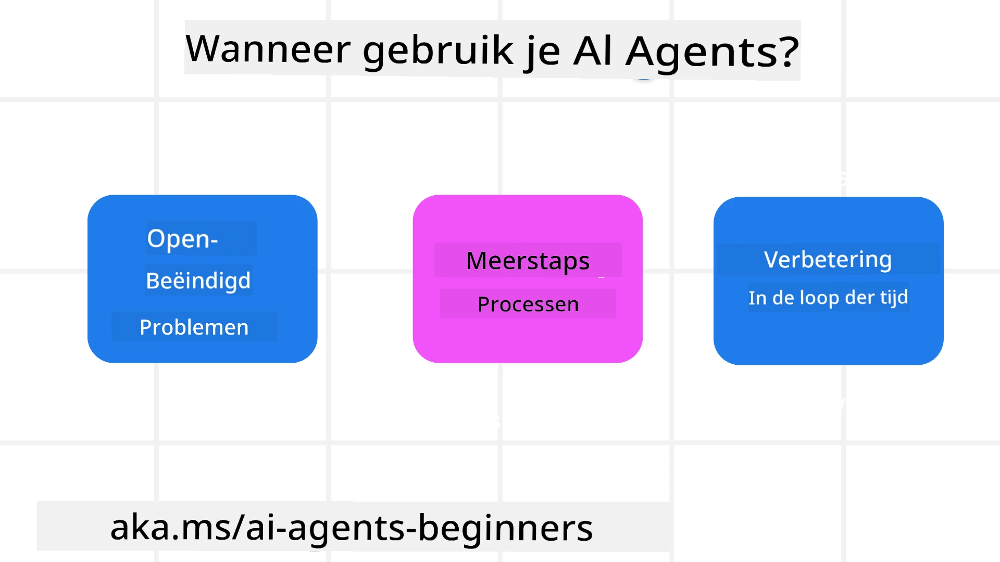

> _(Klik op de afbeelding hierboven om de video van deze les te bekijken)_

# Introductie tot AI-agents en toepassingsgevallen

Welkom bij de cursus "AI Agents for Beginners"! Deze cursus biedt basiskennis en toegepaste voorbeelden voor het bouwen van AI-agents.

Sluit je aan bij de <a href="https://discord.gg/kzRShWzttr" target="_blank">Azure AI Discord-community</a> om andere cursisten en AI Agent Builders te ontmoeten en alle vragen over deze cursus te stellen.

Om met deze cursus te beginnen, starten we met een beter begrip van wat AI-agents zijn en hoe we ze kunnen gebruiken in de applicaties en workflows die we bouwen.

## Inleiding

Deze les behandelt:

- Wat zijn AI-agents en wat zijn de verschillende typen agents?
- Welke use cases zijn het meest geschikt voor AI-agents en hoe kunnen ze ons helpen?
- Wat zijn enkele van de basisbouwstenen bij het ontwerpen van agentische oplossingen?

## Leerdoelen
Na het voltooien van deze les zou je in staat moeten zijn om:

- Begrijpen wat AI-agentconcepten zijn en hoe ze verschillen van andere AI-oplossingen.
- AI-agents zo efficiënt mogelijk toepassen.
- Agentische oplossingen productief ontwerpen voor zowel gebruikers als klanten.

## Definiëren van AI-agents en typen AI-agents

### Wat zijn AI-agents?

AI-agents zijn **systemen** die **Grote taalmodellen(LLMs)** in staat stellen om **acties uit te voeren** door hun mogelijkheden uit te breiden door LLMs **toegang te geven tot tools** en **kennis**.

Laten we deze definitie in kleinere onderdelen opsplitsen:

- **Systeem** - Het is belangrijk om agents niet alleen als één component te zien, maar als een systeem van veel componenten. Op basisniveau zijn de componenten van een AI-agent:
  - **Omgeving** - De gedefinieerde ruimte waarin de AI-agent opereert. Bijvoorbeeld, als we een reisboekings-AI-agent hadden, zou de omgeving het reisboekingssysteem kunnen zijn dat de AI-agent gebruikt om taken te voltooien.
  - **Sensoren** - Omgevingen bevatten informatie en geven feedback. AI-agents gebruiken sensoren om deze informatie over de huidige staat van de omgeving te verzamelen en te interpreteren. In het voorbeeld van de reisboekingsagent kan het reisboekingssysteem informatie verschaffen zoals hotelbeschikbaarheid of vluchtprijzen.
  - **Actuatoren** - Zodra de AI-agent de huidige staat van de omgeving ontvangt, bepaalt de agent voor de huidige taak welke actie uitgevoerd moet worden om de omgeving te veranderen. Voor de reisboekingsagent kan dat bijvoorbeeld het boeken van een beschikbare kamer voor de gebruiker zijn.

**Grote taalmodellen** - Het concept van agents bestond voordat LLMs werden ontwikkeld. Het voordeel van het bouwen van AI-agents met LLMs is hun vermogen om menselijke taal en data te interpreteren. Dit vermogen stelt LLMs in staat om omgevingsinformatie te interpreteren en een plan te definiëren om de omgeving te veranderen.

**Acties uitvoeren** - Buiten AI-agent systemen zijn LLMs beperkt tot situaties waarin de actie het genereren van content of informatie op basis van een gebruikersprompt is. Binnen AI-agent systemen kunnen LLMs taken uitvoeren door de aanvraag van de gebruiker te interpreteren en tools te gebruiken die beschikbaar zijn in hun omgeving.

**Toegang tot tools** - Welke tools de LLM kan gebruiken wordt bepaald door 1) de omgeving waarin hij opereert en 2) de ontwikkelaar van de AI-agent. Voor ons reisagentvoorbeeld worden de tools van de agent beperkt door de bewerkingen die beschikbaar zijn in het boekingssysteem, en/of kan de ontwikkelaar de toegang van de agent tot tools beperken tot vluchten.

**Geheugen+Kennis** - Geheugen kan kortetermijn zijn in de context van het gesprek tussen de gebruiker en de agent. Langetermijn, buiten de informatie die door de omgeving wordt verstrekt, kunnen AI-agents ook kennis ophalen uit andere systemen, services, tools en zelfs andere agents. In het voorbeeld van de reisagent kan deze kennis de informatie over de reisvoorkeuren van de gebruiker zijn die is opgeslagen in een klantenbestand.

### De verschillende typen agents

Nu we een algemene definitie van AI-agents hebben, laten we enkele specifieke agenttypen bekijken en hoe ze toegepast zouden worden op een reisboekings-AI-agent.

| **Agenttype**                | **Beschrijving**                                                                                                                       | **Voorbeeld**                                                                                                                                                                                                                   |
| ----------------------------- | ------------------------------------------------------------------------------------------------------------------------------------- | ----------------------------------------------------------------------------------------------------------------------------------------------------------------------------------------------------------------------------- |
| **Eenvoudige reflexagenten**      | Voeren directe acties uit op basis van vooraf gedefinieerde regels.                                                                                  | De reisagent interpreteert de context van de e-mail en stuurt reisklachten door naar de klantenservice.                                                                                                                          |
| **Modelgebaseerde reflexagenten** | Voeren acties uit op basis van een model van de wereld en wijzigingen in dat model.                                                              | De reisagent geeft prioriteit aan routes met significante prijswijzigingen op basis van toegang tot historische prijsgegevens.                                                                                                             |
| **Doelgerichte agenten**         | Maken plannen om specifieke doelen te bereiken door het doel te interpreteren en acties te bepalen om het te bereiken.                                  | De reisagent boekt een reis door de benodigde reisarrangementen te bepalen (auto, openbaar vervoer, vluchten) van de huidige locatie naar de bestemming.                                                                                |
| **Nutgebaseerde agenten**      | Houden rekening met voorkeuren en wegen afwegingen numeriek om te bepalen hoe doelen te bereiken.                                               | De reisagent maximaliseert nut door gemak versus kosten af te wegen bij het boeken van reizen.                                                                                                                                          |
| **Leeragenten**           | Verbeteren in de loop van de tijd door te reageren op feedback en acties dienovereenkomstig aan te passen.                                                        | De reisagent verbetert door gebruik te maken van klantfeedback uit enquêtes na de reis om aanpassingen te doen voor toekomstige boekingen.                                                                                                               |
| **Hiërarchische agenten**       | Bestaan uit meerdere agents in een gelaagd systeem, waarbij agents op hoger niveau taken opdelen in subtaken voor lagere agents om te voltooien. | De reisagent annuleert een reis door de taak op te delen in subtaken (bijvoorbeeld het annuleren van specifieke boekingen) en lagere agents deze te laten uitvoeren, en terugrapporteren aan de agent op hoger niveau.                                     |
| **Multi-Agent Systems (MAS)** | Agents voltooien taken onafhankelijk, ofwel coöperatief of competitief.                                                           | Coöperatief: Meerdere agents boeken specifieke reisdiensten zoals hotels, vluchten en entertainment. Competitief: Meerdere agents beheren en concurreren over een gedeelde hotelboekingskalender om klanten in het hotel te plaatsen. |

## Wanneer AI-agents gebruiken

In het vorige gedeelte gebruikten we de use-case van de reisagent om uit te leggen hoe de verschillende typen agents kunnen worden gebruikt in verschillende scenario's van reisboeking. We zullen deze toepassing door de hele cursus blijven gebruiken.

Laten we kijken naar de typen use cases waarvoor AI-agents het beste worden gebruikt:

- **Open-eindproblemen** - het toestaan dat het LLM de benodigde stappen bepaalt om een taak te voltooien omdat dit niet altijd hardcoded in een workflow kan worden.
- **Meerstapsprocessen** - taken die een niveau van complexiteit vereisen waarbij de AI-agent tools of informatie over meerdere beurten moet gebruiken in plaats van éénmalige ophalen.  
- **Verbetering in de loop van de tijd** - taken waarbij de agent in de loop van de tijd kan verbeteren door feedback te ontvangen van ofwel zijn omgeving of gebruikers om betere bruikbaarheid te bieden.

We behandelen meer overwegingen bij het gebruik van AI-agents in de les Building Trustworthy AI Agents.

## Basis van agentische oplossingen

### Agentontwikkeling

De eerste stap bij het ontwerpen van een AI-agent systeem is het definiëren van de tools, acties en gedragingen. In deze cursus richten we ons op het gebruik van de **Azure AI Agent Service** om onze agents te definiëren. Het biedt functies zoals:

- Selectie van open modellen zoals OpenAI, Mistral en Llama
- Gebruik van gelicentieerde gegevens via aanbieders zoals Tripadvisor
- Gebruik van gestandaardiseerde OpenAPI 3.0-tools

### Agentische patronen

Communicatie met LLMs gebeurt via prompts. Gezien de semi-autonome aard van AI-agents is het niet altijd mogelijk of vereist om handmatig de LLM opnieuw te prompten na een verandering in de omgeving. We gebruiken **agentische patronen** die ons in staat stellen om de LLM over meerdere stappen op een meer schaalbare manier te prompten.

Deze cursus is verdeeld in enkele van de momenteel populaire agentische patronen.

### Agentische frameworks

Agentische frameworks stellen ontwikkelaars in staat om agentische patronen via code te implementeren. Deze frameworks bieden sjablonen, plugins en tools voor betere samenwerking tussen agents. Deze voordelen bieden mogelijkheden voor betere observeerbaarheid en foutopsporing van AI-agent systemen.

In deze cursus verkennen we het Microsoft Agent Framework (MAF) voor het bouwen van productieklare AI-agents.

## Voorbeeldcode

- Python: [Agent-framework](./code_samples/01-python-agent-framework.ipynb)
- .NET: [Agent-framework](./code_samples/01-dotnet-agent-framework.md)

## Nog vragen over AI-agents?

Sluit je aan bij de [Microsoft Foundry Discord](https://aka.ms/ai-agents/discord) om andere cursisten te ontmoeten, deel te nemen aan inlooptijden en je vragen over AI-agents beantwoord te krijgen.

## Vorige les

[Cursusopzet](../00-course-setup/README.md)

## Volgende les

[Verkenning van agentische frameworks](../02-explore-agentic-frameworks/README.md)

---

<!-- CO-OP TRANSLATOR DISCLAIMER START -->
**Disclaimer**:
Dit document is vertaald met behulp van de AI-vertalingsdienst [Co-op Translator](https://github.com/Azure/co-op-translator). Hoewel we naar nauwkeurigheid streven, dient u er rekening mee te houden dat geautomatiseerde vertalingen fouten of onnauwkeurigheden kunnen bevatten. Het originele document in de oorspronkelijke taal moet als de gezaghebbende bron worden beschouwd. Voor kritieke informatie wordt een professionele menselijke vertaling aanbevolen. Wij zijn niet aansprakelijk voor misverstanden of verkeerde interpretaties die voortvloeien uit het gebruik van deze vertaling.
<!-- CO-OP TRANSLATOR DISCLAIMER END -->