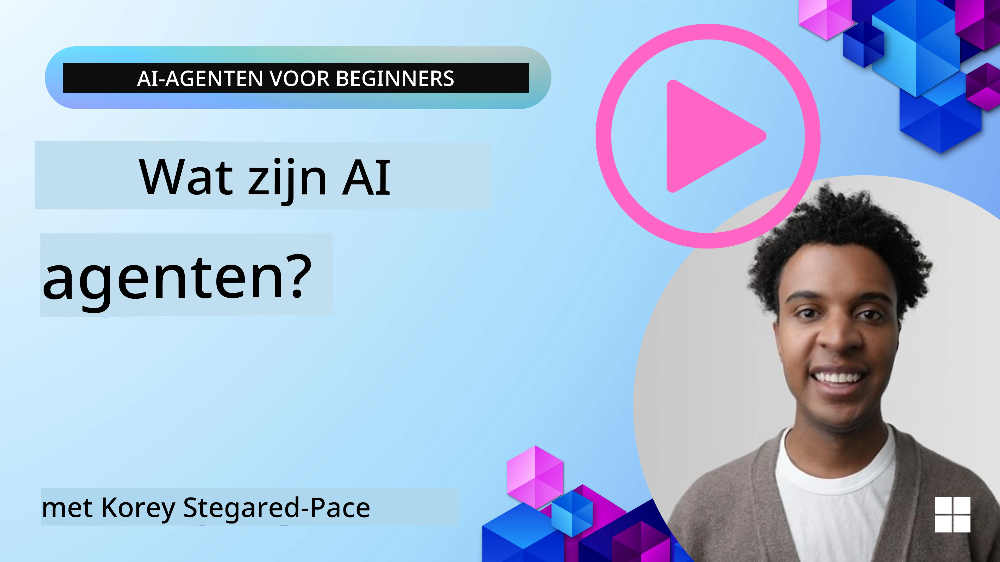
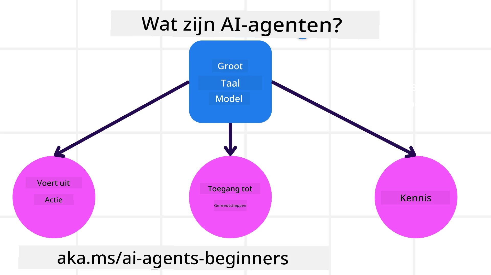
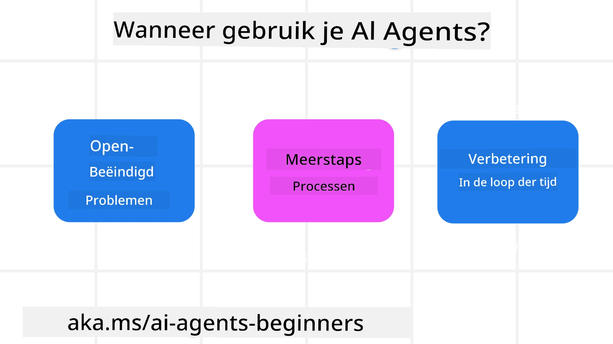

> _(Klik op de afbeelding hierboven om de video voor deze les te bekijken)_

# Introductie tot AI Agenten en Gebruikssituaties van Agenten

Welkom bij de cursus **AI Agenten voor Beginners**! Deze cursus geeft je de basiskennis — en echte werkende code — om AI Agenten vanaf het begin te bouwen.

Kom hallo zeggen in de <a href="https://discord.gg/kzRShWzttr" target="_blank">Azure AI Discord Community</a> — het is vol met leerlingen en AI-bouwers die graag vragen beantwoorden.

Voordat we beginnen met bouwen, laten we eerst zeker weten dat we begrijpen wat een AI Agent *is* en wanneer het zinvol is er één te gebruiken.

---

## Introductie

Deze les behandelt:

- Wat AI Agenten zijn, en de verschillende soorten die bestaan
- Welke soorten taken het beste geschikt zijn voor AI Agenten
- De kernbouwstenen die je gebruikt bij het ontwerpen van een Agent-oplossing

## Leerdoelen

Aan het eind van deze les moet je in staat zijn om:

- Uit te leggen wat een AI Agent is en hoe het verschilt van een gewone AI-oplossing
- Te weten wanneer je moet kiezen voor een AI Agent (en wanneer niet)
- Een basisontwerp van een Agentische oplossing uit te schetsen voor een probleem uit de echte wereld

---

## Definiëren van AI Agenten en Soorten AI Agenten

### Wat zijn AI Agenten?

Hier is een eenvoudige manier om erover na te denken:

> **AI Agenten zijn systemen die Grote Taalmodellen (LLM’s) daadwerkelijk *dingen laten doen* — door ze tools en kennis te geven om op de wereld te handelen, niet alleen te reageren op prompts.**

Laten we dat even afpellen:

- **Systeem** — Een AI Agent is niet zomaar één ding. Het is een verzameling onderdelen die samenwerken. In de kern heeft elke agent drie onderdelen:
  - **Omgeving** — De ruimte waarin de agent werkt. Voor een reisboeking-agent zou dit het boekingsplatform zelf zijn.
  - **Sensoren** — Hoe de agent de huidige staat van zijn omgeving leest. Onze reisagent kan hotelbeschikbaarheid of vluchtprijzen controleren.
  - **Actuatoren** — Hoe de agent actie onderneemt. De reisagent kan een kamer boeken, een bevestiging sturen of een reservering annuleren.

- **Grote Taalmodellen** — Agenten bestonden al vóór LLMs, maar LLMs maken moderne agenten zo krachtig. Ze kunnen natuurlijke taal begrijpen, redeneren over context, en een vage gebruikersaanvraag omzetten in een concreet actieplan.

- **Acties Uitvoeren** — Zonder een agent-systeem genereert een LLM alleen tekst. Binnen een agent-systeem kan de LLM daadwerkelijk *stappen uitvoeren* — een database doorzoeken, een API aanroepen, een bericht sturen.

- **Toegang tot Tools** — Welke tools de agent kan gebruiken hangt af van (1) de omgeving waarin hij draait en (2) wat de ontwikkelaar eraan heeft gekoppeld. Een reisagent kan vluchten zoeken maar niet klantgegevens wijzigen — het gaat erom wat jij aansluit.

- **Geheugen + Kennis** — Agenten kunnen kortetermijngeheugen hebben (de huidige conversatie) en langetermijngeheugen (een klantenbestand, eerdere interacties). De reisagent kan "onthouden" dat je de voorkeur geeft aan ramen bij het vliegtuig.

---

### De Verschillende Soorten AI Agenten

Niet alle agenten zijn op dezelfde manier gebouwd. Hier is een overzicht van de belangrijkste types, met een reisboeking-agent als voorbeeld:

| **Agent Type** | **Wat Het Doet** | **Reisagent Voorbeeld** |
|---|---|---|
| **Eenvoudige Reflexagenten** | Volgen hard-coded regels — geen geheugen, geen planning. | Ziet een klachtenmail → stuurt deze door naar de klantenservice. Dat is het. |
| **Modelgebaseerde Reflexagenten** | Houdt een intern model van de wereld bij en werkt dat bij als dingen veranderen. | Houdt historische vluchtprijzen bij en markeert routes die ineens duur zijn. |
| **Doelgerichte Agenten** | Heeft een doel voor ogen en bedenkt stap voor stap hoe dat te bereiken. | Boekt een volledige reis (vluchten, auto, hotel) vanaf je huidige locatie om je naar je bestemming te brengen. |
| **Nutgebaseerde Agenten** | Vindt niet alleen *een* oplossing — vindt de *beste* door afwegingen te maken. | Weegt kosten versus gemak af om de reis te vinden die het beste aansluit bij jouw voorkeuren. |
| **Leeragenten** | Wordt beter in de loop van de tijd door te leren van feedback. | Past toekomstige boekingsaanbevelingen aan op basis van enquêteresultaten na de reis. |
| **Hiërarchische Agenten** | Een hoog-niveau agent verdeelt werk in subtaken en delegeert aan lagere agents. | Een "reis annuleren" verzoek wordt opgesplitst in: vlucht annuleren, hotel annuleren, autohuur annuleren — elk afgehandeld door een sub-agent. |
| **Multi-Agent Systemen (MAS)** | Meerdere onafhankelijke agenten die samenwerken (of concurreren). | Samenwerkend: aparte agenten voor hotels, vluchten en entertainment. Concurrerend: meerdere agenten strijden om hotelkamers voor de beste prijs te vullen. |

---

## Wanneer AI Agenten te Gebruiken

Alleen omdat je *een* AI Agent kunt gebruiken, betekent niet dat je dat altijd *moet* doen. Hier zijn situaties waarin agenten echt uitblinken:

- **Open-eind Probleemoplossingen** — Wanneer de stappen om een probleem op te lossen niet vooraf geprogrammeerd kunnen worden. Je hebt de LLM nodig om het pad dynamisch te bepalen.
- **Meerstapsprocessen** — Taken die gereedschappen over meerdere beurten heen vereisen, niet slechts een enkele opzoeking of generatie.
- **Verbetering Over Tijd** — Als je wilt dat het systeem slimmer wordt op basis van gebruikersfeedback of omgevingssignalen.

We gaan dieper in op wanneer (en wanneer *niet*) AI Agenten te gebruiken in de les **Betrouwbare AI Agenten Bouwen** later in de cursus.

---

## Basisprincipes van Agentische Oplossingen

### Agentontwikkeling

Het eerste dat je doet bij het bouwen van een agent is definiëren *wat hij kan doen* — zijn tools, acties en gedrag.

In deze cursus gebruiken we de **Microsoft Foundry Agent Service** als ons hoofdplatform. Het ondersteunt:

- Modellen van aanbieders zoals OpenAI, Mistral en Meta (Llama)
- Gelicentieerde data van aanbieders zoals Tripadvisor
- Gestandaardiseerde OpenAPI 3.0 tooldefinities

### Agentische Patronen

Je communiceert met LLMs via prompts. Bij agenten kun je niet altijd elke prompt handmatig maken — de agent moet acties over meerdere stappen kunnen ondernemen. Daar komen **Agentische Patronen** om de hoek kijken. Het zijn herbruikbare strategieën voor het aansturen en coördineren van LLMs op een schaalbare, betrouwbare manier.

Deze cursus is opgebouwd rond de meest voorkomende en nuttige agentische patronen.

### Agentische Frameworks

Agentische Frameworks geven ontwikkelaars kant-en-klare sjablonen, tools en infrastructuur om agenten te bouwen. Ze maken het gemakkelijker om:

- Tools en functionaliteiten aan te sluiten
- Te zien wat de agent doet (en te debuggen als er iets misgaat)
- Samen te werken over meerdere agenten heen

In deze cursus richten we ons op het **Microsoft Agent Framework (MAF)** voor het bouwen van productieklare agenten.

---

## Code Voorbeelden

Klaar om het in actie te zien? Hier zijn de codevoorbeelden voor deze les:

- 🐍 Python: [Agent Framework](./code_samples/01-python-agent-framework.ipynb)
- 🔷 .NET: [Agent Framework](./code_samples/01-dotnet-agent-framework.md)

---

## Vragen?

Word lid van de [Microsoft Foundry Discord](https://discord.com/invite/ATgtXmAS5D) om in contact te komen met andere leerlingen, deel te nemen aan spreekuren, en vragen over AI Agenten beantwoord te krijgen door de community.

---

## Vorige Les

[Cursus Setup](../00-course-setup/README.md)

## Volgende Les

[Agentische Frameworks Verkennen](../02-explore-agentic-frameworks/README.md)

---

<!-- CO-OP TRANSLATOR DISCLAIMER START -->
**Disclaimer**:
Dit document is vertaald met behulp van de AI vertaaldienst [Co-op Translator](https://github.com/Azure/co-op-translator). Hoewel we streven naar nauwkeurigheid, dient u er rekening mee te houden dat geautomatiseerde vertalingen fouten of onnauwkeurigheden kunnen bevatten. Het originele document in de oorspronkelijke taal moet worden beschouwd als de gezaghebbende bron. Voor kritieke informatie wordt professionele menselijke vertaling aanbevolen. Wij zijn niet aansprakelijk voor eventuele misverstanden of verkeerde interpretaties die voortvloeien uit het gebruik van deze vertaling.
<!-- CO-OP TRANSLATOR DISCLAIMER END -->