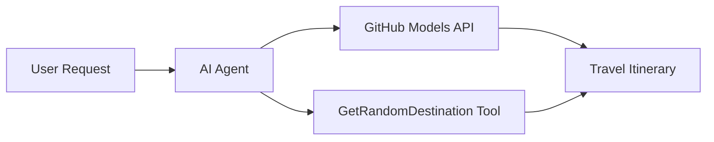

<!--
CO_OP_TRANSLATOR_METADATA:
{
  "original_hash": "23afd9be7b6ba5b69a44c3b6a78e07f6",
  "translation_date": "2025-11-06T10:05:06+00:00",
  "source_file": "01-intro-to-ai-agents/code_samples/01-dotnet-agent-framework.md",
  "language_code": "nl"
}
-->
# 🌍 AI Reisagent met Microsoft Agent Framework (.NET)

## 📋 Scenario-overzicht

Dit notebook laat zien hoe je een intelligente reisplanner kunt bouwen met het Microsoft Agent Framework voor .NET. De agent kan automatisch gepersonaliseerde dagtriproutes genereren voor willekeurige bestemmingen wereldwijd.

**Belangrijkste mogelijkheden:**
- 🎲 **Willekeurige bestemmingsselectie**: Gebruikt een aangepaste tool om vakantiebestemmingen te kiezen
- 🗺️ **Intelligente reisplanning**: Maakt gedetailleerde dag-tot-dag routes
- 🔄 **Realtime streaming**: Ondersteunt zowel directe als gestreamde reacties
- 🛠️ **Integratie van aangepaste tools**: Laat zien hoe je de mogelijkheden van de agent kunt uitbreiden

## 🔧 Technische architectuur

### Kerntechnologieën
- **Microsoft Agent Framework**: Nieuwste .NET-implementatie voor AI-agentontwikkeling
- **GitHub Models-integratie**: Maakt gebruik van de AI-model inferentiedienst van GitHub
- **OpenAI API-compatibiliteit**: Benut OpenAI-clientbibliotheken met aangepaste eindpunten
- **Veilige configuratie**: Beheer van API-sleutels op basis van omgeving

### Belangrijke componenten
1. **AIAgent**: De belangrijkste agent-orkestrator die de gespreksstroom beheert
2. **Aangepaste tools**: `GetRandomDestination()`-functie beschikbaar voor de agent
3. **Chat Client**: Gespreksinterface ondersteund door GitHub Models
4. **Streamingondersteuning**: Mogelijkheden voor realtime responsgeneratie

### Integratiepatroon


## 🚀 Aan de slag

**Vereisten:**
- .NET 10.0 of hoger
- GitHub Models API-toegangstoken
- Omgevingsvariabelen geconfigureerd in `.env`-bestand

**Vereiste omgevingsvariabelen:**
```env
GITHUB_TOKEN=your_github_token
GITHUB_ENDPOINT=https://models.inference.ai.azure.com
GITHUB_MODEL_ID=gpt-4o-mini
```

Voer de onderstaande codevoorbeeld in volgorde uit om de reisagent in actie te zien!

---

## .NET Single File App: AI Reisagent Voorbeeld

Zie `01-dotnet-agent-framework.cs` voor het volledige uitvoerbare codevoorbeeld.

```bash
dotnet run 01-dotnet-agent-framework.cs
```

### Voorbeeldcode

```csharp
static string GetRandomDestination()
{
    var destinations = new List<string>
    {
        "Paris, France",
        "Tokyo, Japan",
        "New York City, USA",
        "Sydney, Australia",
        "Rome, Italy",
        "Barcelona, Spain",
        "Cape Town, South Africa",
        "Rio de Janeiro, Brazil",
        "Bangkok, Thailand",
        "Vancouver, Canada"
    };
    var random = new Random();
    int index = random.Next(destinations.Count);
    return destinations[index];
}

// Extract configuration from environment variables
var github_endpoint = Environment.GetEnvironmentVariable("GITHUB_ENDPOINT") ?? throw new InvalidOperationException("GITHUB_ENDPOINT is not set.");
var github_model_id = Environment.GetEnvironmentVariable("GITHUB_MODEL_ID") ?? "gpt-4o-mini";
var github_token = Environment.GetEnvironmentVariable("GITHUB_TOKEN") ?? throw new InvalidOperationException("GITHUB_TOKEN is not set.");

// Configure OpenAI Client Options
var openAIOptions = new OpenAIClientOptions()
{
    Endpoint = new Uri(github_endpoint)
};

// Initialize OpenAI Client with GitHub Models Configuration
var openAIClient = new OpenAIClient(new ApiKeyCredential(github_token), openAIOptions);

// Create AI Agent with Travel Planning Capabilities
AIAgent agent = openAIClient
    .GetChatClient(github_model_id)
    .CreateAIAgent(
        instructions: "You are a helpful AI Agent that can help plan vacations for customers at random destinations",
        tools: [AIFunctionFactory.Create(GetRandomDestination)]
    );

// Execute Agent: Plan a Day Trip (Non-Streaming)
Console.WriteLine(await agent.RunAsync("Plan me a day trip"));

// Execute Agent: Plan a Day Trip (Streaming Response)
await foreach (var update in agent.RunStreamingAsync("Plan me a day trip"))
{
    Console.Write(update);
}
```

---

**Disclaimer**:  
Dit document is vertaald met behulp van de AI-vertalingsservice [Co-op Translator](https://github.com/Azure/co-op-translator). Hoewel we streven naar nauwkeurigheid, dient u zich ervan bewust te zijn dat geautomatiseerde vertalingen fouten of onnauwkeurigheden kunnen bevatten. Het originele document in de oorspronkelijke taal moet worden beschouwd als de gezaghebbende bron. Voor kritieke informatie wordt professionele menselijke vertaling aanbevolen. Wij zijn niet aansprakelijk voor eventuele misverstanden of verkeerde interpretaties die voortvloeien uit het gebruik van deze vertaling.