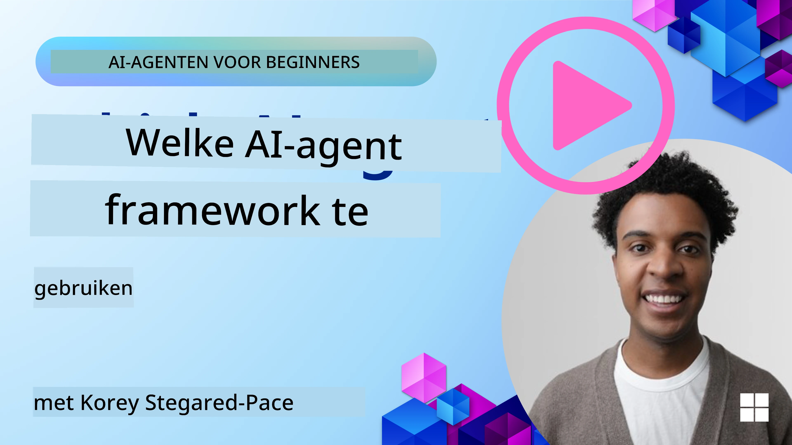

[](https://youtu.be/ODwF-EZo_O8?si=1xoy_B9RNQfrYdF7)

> _(Klik op de afbeelding hierboven om de video van deze les te bekijken)_

# Verken AI-agentkaders

AI-agentkaders zijn softwareplatforms die zijn ontworpen om het maken, implementeren en beheren van AI-agenten te vereenvoudigen. Deze kaders bieden ontwikkelaars kant-en-klare componenten, abstracties en hulpmiddelen die de ontwikkeling van complexe AI-systemen stroomlijnen.

Deze kaders helpen ontwikkelaars zich te concentreren op de unieke aspecten van hun toepassingen door gestandaardiseerde benaderingen te bieden voor veelvoorkomende uitdagingen in de ontwikkeling van AI-agenten. Ze verbeteren schaalbaarheid, toegankelijkheid en efficiëntie bij het bouwen van AI-systemen.

## Inleiding 

Deze les behandelt:

- Wat zijn AI-agentkaders en wat stellen ze ontwikkelaars in staat te bereiken?
- Hoe kunnen teams deze gebruiken om snel prototypes te maken, itereren en de mogelijkheden van hun agent te verbeteren?
- Wat zijn de verschillen tussen de frameworks en tools gemaakt door Microsoft (<a href="https://aka.ms/ai-agents-beginners/ai-agent-service" target="_blank">Azure AI Agent Service</a> en de <a href="https://learn.microsoft.com/azure/ai-services/openai/how-to/responses" target="_blank">Microsoft Agent Framework</a>)?
- Kan ik mijn bestaande Azure-ecosysteemtools rechtstreeks integreren, of heb ik zelfstandige oplossingen nodig?
- Wat is Azure AI Agents service en hoe helpt dit mij?

## Leerdoelen

De doelstellingen van deze les zijn om je te helpen begrijpen:

- De rol van AI-agentkaders in AI-ontwikkeling.
- Hoe je AI-agentkaders kunt benutten om intelligente agenten te bouwen.
- Belangrijke mogelijkheden die worden mogelijk gemaakt door AI-agentkaders.
- De verschillen tussen het Microsoft Agent Framework en Azure AI Agent Service.

## Wat zijn AI-agentkaders en wat stellen ze ontwikkelaars in staat te doen?

Traditionele AI-kaders kunnen je helpen AI in je apps te integreren en deze apps op de volgende manieren beter te maken:

- **Personalisatie**: AI kan gebruikersgedrag en voorkeuren analyseren om gepersonaliseerde aanbevelingen, inhoud en ervaringen te bieden.
Voorbeeld: Streamingdiensten zoals Netflix gebruiken AI om films en series voor te stellen op basis van kijkgeschiedenis, waardoor de betrokkenheid en tevredenheid van gebruikers toenemen.
- **Automatisering en efficiëntie**: AI kan repetitieve taken automatiseren, workflows stroomlijnen en de operationele efficiëntie verbeteren.
Voorbeeld: Klantenservice-apps gebruiken AI-gestuurde chatbots om veelvoorkomende vragen af te handelen, waardoor reactietijden afnemen en menselijke agenten vrijgemaakt worden voor complexere problemen.
- **Verbeterde gebruikerservaring**: AI kan de algehele gebruikerservaring verbeteren door intelligente functies te bieden, zoals spraakherkenning, natuurlijke taalverwerking en voorspellende tekst.
Voorbeeld: Virtuele assistenten zoals Siri en Google Assistant gebruiken AI om spraakopdrachten te begrijpen en erop te reageren, waardoor het voor gebruikers eenvoudiger wordt om met hun apparaten te communiceren.

### Dat klinkt allemaal geweldig, maar waarom hebben we het AI Agent Framework nodig?

AI-agentkaders vertegenwoordigen meer dan alleen AI-kaders. Ze zijn ontworpen om het creëren van intelligente agenten mogelijk te maken die kunnen interacteren met gebruikers, andere agenten en de omgeving om specifieke doelen te bereiken. Deze agenten kunnen autonoom gedrag vertonen, beslissingen nemen en zich aanpassen aan veranderende omstandigheden. Laten we enkele belangrijke mogelijkheden bekijken die AI-agentkaders mogelijk maken:

- **Samenwerking en coördinatie tussen agenten**: Maakt het mogelijk meerdere AI-agenten te creëren die samen kunnen werken, communiceren en coördineren om complexe taken op te lossen.
- **Taakautomatisering en -beheer**: Biedt mechanismen voor het automatiseren van meerstapsworkflows, taakdelegatie en dynamisch taakbeheer tussen agenten.
- **Contextueel begrip en aanpassing**: Uitrust agenten met het vermogen context te begrijpen, zich aan veranderende omgevingen aan te passen en beslissingen te nemen op basis van realtime informatie.

Samengevat stellen agenten je in staat meer te doen, automatisering naar een hoger niveau te tillen en meer intelligente systemen te creëren die zich kunnen aanpassen en leren van hun omgeving.

## Hoe kun je snel prototypen, itereren en de mogelijkheden van de agent verbeteren?

Dit is een snel veranderend landschap, maar er zijn enkele gemeenschappelijke elementen bij de meeste AI-agentkaders die je kunnen helpen snel te prototypen en te itereren, namelijk modulecomponenten, samenwerkingshulpmiddelen en realtime leren. Laten we deze nader bekijken:

- **Gebruik modulaire componenten**: AI-SDK's bieden kant-en-klare componenten zoals AI- en geheugenconnectors, functieaanroepen via natuurlijke taal of code-plugins, prompttemplates en meer.
- **Benut samenwerkingshulpmiddelen**: Ontwerp agenten met specifieke rollen en taken, waardoor ze samenwerkingsworkflows kunnen testen en verfijnen.
- **Leer in realtime**: Implementeer feedbackloops waarbij agenten leren van interacties en hun gedrag dynamisch aanpassen.

### Gebruik modulaire componenten

SDK's zoals het Microsoft Agent Framework bieden kant-en-klare componenten zoals AI-connectors, tooldefinities en agentbeheer.

**Hoe teams dit kunnen gebruiken**: Teams kunnen deze componenten snel samenstellen om een functioneel prototype te maken zonder vanaf nul te hoeven beginnen, wat snelle experimentatie en iteratie mogelijk maakt.

**Hoe het in de praktijk werkt**: Je kunt een kant-en-klare parser gebruiken om informatie uit gebruikersinvoer te halen, een geheugenmodule om gegevens op te slaan en op te halen, en een promptgenerator om met gebruikers te communiceren, allemaal zonder deze componenten zelf te hoeven bouwen.

**Voorbeeldcode**. Laten we een voorbeeld bekijken van hoe je het Microsoft Agent Framework kunt gebruiken met `AzureAIProjectAgentProvider` zodat het model kan reageren op gebruikersinvoer met tool-aanroepen:

``` python
# Microsoft Agent Framework Python Voorbeeld

import asyncio
import os
from typing import Annotated

from agent_framework.azure import AzureAIProjectAgentProvider
from azure.identity import AzureCliCredential


# Definieer een voorbeeldfunctie voor een tool om reizen te boeken
def book_flight(date: str, location: str) -> str:
    """Book travel given location and date."""
    return f"Travel was booked to {location} on {date}"


async def main():
    provider = AzureAIProjectAgentProvider(credential=AzureCliCredential())
    agent = await provider.create_agent(
        name="travel_agent",
        instructions="Help the user book travel. Use the book_flight tool when ready.",
        tools=[book_flight],
    )

    response = await agent.run("I'd like to go to New York on January 1, 2025")
    print(response)
    # Voorbeelduitvoer: Uw vlucht naar New York op 1 januari 2025 is succesvol geboekt. Goede reis! ✈️🗽


if __name__ == "__main__":
    asyncio.run(main())
```

Wat je uit dit voorbeeld kunt opmaken, is hoe je een kant-en-klare parser kunt benutten om sleutelgegevens uit gebruikersinvoer te halen, zoals de vertrekplaats, bestemming en datum van een vluchtreserveringsverzoek. Deze modulaire aanpak stelt je in staat je te concentreren op de logica op hoog niveau.

### Benut samenwerkingshulpmiddelen

Frameworks zoals het Microsoft Agent Framework vergemakkelijken het creëren van meerdere agenten die samen kunnen werken.

**Hoe teams dit kunnen gebruiken**: Teams kunnen agenten ontwerpen met specifieke rollen en taken, waardoor ze samenwerkingsworkflows kunnen testen en verfijnen en de algehele systeemefficiëntie kunnen verbeteren.

**Hoe het in de praktijk werkt**: Je kunt een team van agenten maken waarbij elke agent een gespecialiseerde functie heeft, zoals het ophalen van gegevens, analyse of besluitvorming. Deze agenten kunnen communiceren en informatie delen om een gemeenschappelijk doel te bereiken, zoals het beantwoorden van een gebruikersvraag of het voltooien van een taak.

**Voorbeeldcode (Microsoft Agent Framework)**:

```python
# Meerdere agenten creëren die samenwerken met het Microsoft Agent Framework

import os
from agent_framework.azure import AzureAIProjectAgentProvider
from azure.identity import AzureCliCredential

provider = AzureAIProjectAgentProvider(credential=AzureCliCredential())

# Gegevensophaalagent
agent_retrieve = await provider.create_agent(
    name="dataretrieval",
    instructions="Retrieve relevant data using available tools.",
    tools=[retrieve_tool],
)

# Gegevensanalyseagent
agent_analyze = await provider.create_agent(
    name="dataanalysis",
    instructions="Analyze the retrieved data and provide insights.",
    tools=[analyze_tool],
)

# Agenten achtereenvolgens uitvoeren voor een taak
retrieval_result = await agent_retrieve.run("Retrieve sales data for Q4")
analysis_result = await agent_analyze.run(f"Analyze this data: {retrieval_result}")
print(analysis_result)
```

In de vorige code zie je hoe je een taak kunt creëren waarbij meerdere agenten samenwerken om gegevens te analyseren. Elke agent voert een specifieke functie uit en de taak wordt uitgevoerd door de agenten te coördineren om het gewenste resultaat te behalen. Door speciale agenten met gespecialiseerde rollen te creëren, kun je de taakefficiëntie en -prestatie verbeteren.

### Leer in realtime

Geavanceerde frameworks bieden mogelijkheden voor realtime contextbegrip en aanpassing.

**Hoe teams dit kunnen gebruiken**: Teams kunnen feedbackloops implementeren waarbij agenten leren van interacties en hun gedrag dynamisch aanpassen, wat leidt tot voortdurende verbetering en verfijning van mogelijkheden.

**Hoe het in de praktijk werkt**: Agenten kunnen gebruikersfeedback, omgevingsgegevens en taakresultaten analyseren om hun kennisbasis bij te werken, besluitvormingsalgoritmen aan te passen en hun prestaties in de loop van de tijd te verbeteren. Dit iteratieve leerproces stelt agenten in staat zich aan te passen aan veranderende omstandigheden en gebruikersvoorkeuren, wat de algehele systeemeffectiviteit vergroot.

## Wat zijn de verschillen tussen het Microsoft Agent Framework en Azure AI Agent Service?

Er zijn veel manieren om deze benaderingen te vergelijken, maar laten we enkele belangrijke verschillen bekijken in termen van ontwerp, mogelijkheden en doelgebruik:

## Microsoft Agent Framework (MAF)

Het Microsoft Agent Framework biedt een gestroomlijnde SDK voor het bouwen van AI-agenten met `AzureAIProjectAgentProvider`. Het stelt ontwikkelaars in staat agenten te maken die gebruikmaken van Azure OpenAI-modellen met ingebouwde tool-aanroepen, conversatiebeheer en enterprise-grade beveiliging via Azure-identiteit.

**Gebruiksscenario's**: Het bouwen van productieklare AI-agenten met toolgebruik, meerstapsworkflows en enterprise-integraties.

Hier zijn enkele belangrijke kernconcepten van het Microsoft Agent Framework:

- **Agents**. Een agent wordt gemaakt via `AzureAIProjectAgentProvider` en geconfigureerd met een naam, instructies en tools. De agent kan:
  - **Gebruikersberichten verwerken** en antwoorden genereren met behulp van Azure OpenAI-modellen.
  - **Tools aanroepen** op basis van de context van het gesprek.
  - **De conversatiestatus behouden** over meerdere interacties.

  Hier is een codefragment dat laat zien hoe je een agent maakt:

    ```python
    import os
    from agent_framework.azure import AzureAIProjectAgentProvider
    from azure.identity import AzureCliCredential

    provider = AzureAIProjectAgentProvider(credential=AzureCliCredential())
    agent = await provider.create_agent(
        name="my_agent",
        instructions="You are a helpful assistant.",
    )

    response = await agent.run("Hello, World!")
    print(response)
    ```

- **Tools**. Het framework ondersteunt het definiëren van tools als Python-functies die de agent automatisch kan aanroepen. Tools worden geregistreerd bij het aanmaken van de agent:

    ```python
    def get_weather(location: str) -> str:
        """Get the current weather for a location."""
        return f"The weather in {location} is sunny, 72\u00b0F."

    agent = await provider.create_agent(
        name="weather_agent",
        instructions="Help users check the weather.",
        tools=[get_weather],
    )
    ```

- **Coördinatie tussen meerdere agenten**. Je kunt meerdere agenten creëren met verschillende specialisaties en hun werk coördineren:

    ```python
    planner = await provider.create_agent(
        name="planner",
        instructions="Break down complex tasks into steps.",
    )

    executor = await provider.create_agent(
        name="executor",
        instructions="Execute the planned steps using available tools.",
        tools=[execute_tool],
    )

    plan = await planner.run("Plan a trip to Paris")
    result = await executor.run(f"Execute this plan: {plan}")
    ```

- **Integratie met Azure Identity**. Het framework gebruikt `AzureCliCredential` (of `DefaultAzureCredential`) voor veilige, keyless authenticatie, waardoor je niet rechtstreeks API-sleutels hoeft te beheren.

## Azure AI Agent Service

Azure AI Agent Service is een recentere toevoeging, geïntroduceerd op Microsoft Ignite 2024. Het maakt de ontwikkeling en implementatie van AI-agenten met flexibelere modellen mogelijk, zoals het direct aanroepen van open-source LLM's zoals Llama 3, Mistral en Cohere.

Azure AI Agent Service biedt sterkere enterprise-beveiligingsmechanismen en methoden voor gegevensopslag, waardoor het geschikt is voor enterprise-toepassingen. 

Het werkt direct samen met het Microsoft Agent Framework voor het bouwen en implementeren van agenten.

Deze service bevindt zich momenteel in Public Preview en ondersteunt Python en C# voor het bouwen van agenten.

Met de Azure AI Agent Service Python SDK kunnen we een agent creëren met een door de gebruiker gedefinieerde tool:

```python
import asyncio
from azure.identity import DefaultAzureCredential
from azure.ai.projects import AIProjectClient

# Definieer toolfuncties
def get_specials() -> str:
    """Provides a list of specials from the menu."""
    return """
    Special Soup: Clam Chowder
    Special Salad: Cobb Salad
    Special Drink: Chai Tea
    """

def get_item_price(menu_item: str) -> str:
    """Provides the price of the requested menu item."""
    return "$9.99"


async def main() -> None:
    credential = DefaultAzureCredential()
    project_client = AIProjectClient.from_connection_string(
        credential=credential,
        conn_str="your-connection-string",
    )

    agent = project_client.agents.create_agent(
        model="gpt-4o-mini",
        name="Host",
        instructions="Answer questions about the menu.",
        tools=[get_specials, get_item_price],
    )

    thread = project_client.agents.create_thread()

    user_inputs = [
        "Hello",
        "What is the special soup?",
        "How much does that cost?",
        "Thank you",
    ]

    for user_input in user_inputs:
        print(f"# User: '{user_input}'")
        message = project_client.agents.create_message(
            thread_id=thread.id,
            role="user",
            content=user_input,
        )
        run = project_client.agents.create_and_process_run(
            thread_id=thread.id, agent_id=agent.id
        )
        messages = project_client.agents.list_messages(thread_id=thread.id)
        print(f"# Agent: {messages.data[0].content[0].text.value}")


if __name__ == "__main__":
    asyncio.run(main())
```

### Kernconcepten

Azure AI Agent Service heeft de volgende kernconcepten:

- **Agent**. Azure AI Agent Service integreert met Microsoft Foundry. Binnen AI Foundry fungeert een AI Agent als een "slimme" microservice die kan worden gebruikt om vragen te beantwoorden (RAG), acties uit te voeren of volledige workflows te automatiseren. Dit bereikt het door de kracht van generatieve AI-modellen te combineren met tools die het mogelijk maken toegang te krijgen tot en interactie te hebben met reële gegevensbronnen. Hier is een voorbeeld van een agent:

    ```python
    agent = project_client.agents.create_agent(
        model="gpt-4o-mini",
        name="my-agent",
        instructions="You are helpful agent",
        tools=code_interpreter.definitions,
        tool_resources=code_interpreter.resources,
    )
    ```

    In dit voorbeeld wordt een agent gemaakt met het model `gpt-4o-mini`, een naam `my-agent`, en instructies `You are helpful agent`. De agent is uitgerust met tools en bronnen om code-interpretatietaken uit te voeren.

- **Thread and messages**. De thread is een ander belangrijk concept. Het vertegenwoordigt een conversatie of interactie tussen een agent en een gebruiker. Threads kunnen worden gebruikt om de voortgang van een conversatie bij te houden, contextinformatie op te slaan en de status van de interactie te beheren. Hier is een voorbeeld van een thread:

    ```python
    thread = project_client.agents.create_thread()
    message = project_client.agents.create_message(
        thread_id=thread.id,
        role="user",
        content="Could you please create a bar chart for the operating profit using the following data and provide the file to me? Company A: $1.2 million, Company B: $2.5 million, Company C: $3.0 million, Company D: $1.8 million",
    )
    
    # Ask the agent to perform work on the thread
    run = project_client.agents.create_and_process_run(thread_id=thread.id, agent_id=agent.id)
    
    # Fetch and log all messages to see the agent's response
    messages = project_client.agents.list_messages(thread_id=thread.id)
    print(f"Messages: {messages}")
    ```

    In de vorige code wordt een thread aangemaakt. Daarna wordt er een bericht naar de thread gestuurd. Door `create_and_process_run` aan te roepen, wordt de agent gevraagd werk op de thread uit te voeren. Ten slotte worden de berichten opgehaald en gelogd om de reactie van de agent te zien. De berichten geven de voortgang van de conversatie tussen de gebruiker en de agent weer. Het is ook belangrijk te begrijpen dat de berichten van verschillende typen kunnen zijn, zoals tekst, afbeelding of bestand; dat wil zeggen dat het werk van de agent bijvoorbeeld heeft geresulteerd in een afbeelding of een tekstuele reactie. Als ontwikkelaar kun je deze informatie vervolgens gebruiken om de reactie verder te verwerken of aan de gebruiker te presenteren.

- **Integreert met het Microsoft Agent Framework**. Azure AI Agent Service werkt naadloos samen met het Microsoft Agent Framework, wat betekent dat je agenten kunt bouwen met `AzureAIProjectAgentProvider` en ze kunt implementeren via de Agent Service voor productieomgevingen.

**Gebruiksscenario's**: Azure AI Agent Service is ontworpen voor enterprise-toepassingen die veilige, schaalbare en flexibele implementatie van AI-agenten vereisen.

## Wat is het verschil tussen deze benaderingen?
 
Het lijkt inderdaad alsof er overlap is, maar er zijn enkele belangrijke verschillen in termen van ontwerp, mogelijkheden en doelgebruik:
 
- **Microsoft Agent Framework (MAF)**: Is een productieklare SDK voor het bouwen van AI-agenten. Het biedt een gestroomlijnde API voor het creëren van agenten met tool-aanroepen, conversatiebeheer en integratie met Azure Identity.
- **Azure AI Agent Service**: Is een platform- en implementatiedienst in Azure Foundry voor agenten. Het biedt ingebouwde connectiviteit met services zoals Azure OpenAI, Azure AI Search, Bing Search en code-executie.
 
Weet je nog steeds niet welke je moet kiezen?

### Gebruiksscenario's
 
Laten we kijken of we je kunnen helpen door enkele veelvoorkomende gebruikssituaties door te nemen:
 
> Q: I'm building production AI agent applications and want to get started quickly
>
>A: The Microsoft Agent Framework is a great choice. It provides a simple, Pythonic API via `AzureAIProjectAgentProvider` that lets you define agents with tools and instructions in just a few lines of code.
>
>Q: I need enterprise-grade deployment with Azure integrations like Search and code execution
>
> A: Azure AI Agent Service is the best fit. It's a platform service that provides built-in capabilities for multiple models, Azure AI Search, Bing Search and Azure Functions. It makes it easy to build your agents in the Foundry Portal and deploy them at scale.
> 
> Q: I'm still confused, just give me one option
>
> A: Start with the Microsoft Agent Framework to build your agents, and then use Azure AI Agent Service when you need to deploy and scale them in production. This approach lets you iterate quickly on your agent logic while having a clear path to enterprise deployment.
 
Laten we de belangrijkste verschillen samenvatten in een tabel:

| Framework | Focus | Core Concepts | Use Cases |
| --- | --- | --- | --- |
| Microsoft Agent Framework | Gestroomlijnde agent-SDK met tool-aanroepen | Agents, Tools, Azure Identity | Het bouwen van AI-agenten, toolgebruik, meerstapsworkflows |
| Azure AI Agent Service | Flexibele modellen, enterprise-beveiliging, codegeneratie, tool-aanroepen | Modulariteit, samenwerking, procesorchestratie | Veilige, schaalbare en flexibele implementatie van AI-agenten |

## Kan ik mijn bestaande Azure-ecosysteemtools rechtstreeks integreren, of heb ik zelfstandige oplossingen nodig?
Het antwoord is ja: je kunt je bestaande Azure-ecosysteemtools rechtstreeks integreren met Azure AI Agent Service, vooral omdat het is gebouwd om naadloos samen te werken met andere Azure-services. Je kunt bijvoorbeeld Bing, Azure AI Search en Azure Functions integreren. Er is ook een diepe integratie met Microsoft Foundry.

Het Microsoft Agent Framework integreert ook met Azure-services via `AzureAIProjectAgentProvider` en Azure identity, waardoor je Azure-services rechtstreeks vanuit je agenttools kunt aanroepen.

## Voorbeeldcodes

- Python: [Agent Framework](./code_samples/02-python-agent-framework.ipynb)
- .NET: [Agent Framework](./code_samples/02-dotnet-agent-framework.md)

## Heb je nog meer vragen over AI Agent Frameworks?

Sluit je aan bij de [Microsoft Foundry Discord](https://aka.ms/ai-agents/discord) om andere leerlingen te ontmoeten, spreekuren bij te wonen en antwoorden op je vragen over AI Agents te krijgen.

## Referenties

- <a href="https://techcommunity.microsoft.com/blog/azure-ai-services-blog/introducing-azure-ai-agent-service/4298357" target="_blank">Azure Agent Service</a>
- <a href="https://learn.microsoft.com/azure/ai-services/openai/how-to/responses" target="_blank">Microsoft Agent Framework - Azure OpenAI Responses</a>
- <a href="https://learn.microsoft.com/azure/ai-services/agents/overview" target="_blank">Azure AI Agent service</a>

## Vorige les

[Introductie tot AI-agents en gebruiksscenario's](../01-intro-to-ai-agents/README.md)

## Volgende les

[Inzicht in agentische ontwerppatronen](../03-agentic-design-patterns/README.md)

---

<!-- CO-OP TRANSLATOR DISCLAIMER START -->
Disclaimer:
Dit document is vertaald met behulp van de AI-vertalingsdienst [Co-op Translator](https://github.com/Azure/co-op-translator). Hoewel we naar nauwkeurigheid streven, dient u er rekening mee te houden dat geautomatiseerde vertalingen fouten of onnauwkeurigheden kunnen bevatten. Het oorspronkelijke document in de oorspronkelijke taal moet als de gezaghebbende bron worden beschouwd. Voor kritieke informatie wordt professionele menselijke vertaling aanbevolen. Wij zijn niet aansprakelijk voor eventuele misverstanden of verkeerde interpretaties die voortvloeien uit het gebruik van deze vertaling.
<!-- CO-OP TRANSLATOR DISCLAIMER END -->