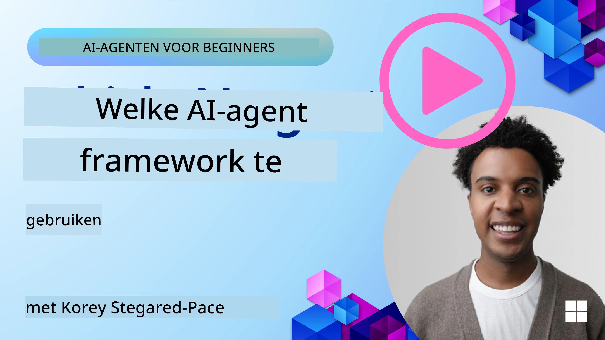

[](https://youtu.be/ODwF-EZo_O8?si=1xoy_B9RNQfrYdF7)

> _(Klik op de bovenstaande afbeelding om de video van deze les te bekijken)_

# AI Agent Frameworks verkennen

AI agent frameworks zijn softwareplatformen die zijn ontworpen om het creëren, implementeren en beheren van AI-agenten te vereenvoudigen. Deze frameworks bieden ontwikkelaars kant-en-klare componenten, abstracties en tools die de ontwikkeling van complexe AI-systemen stroomlijnen.

Deze frameworks helpen ontwikkelaars zich te concentreren op de unieke aspecten van hun applicaties door gestandaardiseerde benaderingen te bieden voor veelvoorkomende uitdagingen in AI-agentontwikkeling. Ze verbeteren schaalbaarheid, toegankelijkheid en efficiëntie bij het bouwen van AI-systemen.

## Introductie

Deze les behandelt:

- Wat zijn AI Agent Frameworks en wat kunnen ontwikkelaars ermee bereiken?
- Hoe kunnen teams deze gebruiken om snel te prototypen, itereren en de mogelijkheden van hun agent verbeteren?
- Wat zijn de verschillen tussen de frameworks en tools die Microsoft heeft gemaakt (<a href="https://aka.ms/ai-agents-beginners/ai-agent-service" target="_blank">Microsoft Foundry Agent Service</a> en het <a href="https://learn.microsoft.com/azure/ai-services/openai/how-to/responses" target="_blank">Microsoft Agent Framework</a>)?
- Kan ik mijn bestaande Azure-ecosysteemtools direct integreren, of heb ik zelfstandige oplossingen nodig?
- Wat is Microsoft Foundry Agent Service en hoe helpt dit mij?

## Leerdoelen

De doelen van deze les zijn om je te helpen begrijpen:

- De rol van AI Agent Frameworks in AI-ontwikkeling.
- Hoe AI Agent Frameworks kunnen worden ingezet om intelligente agenten te bouwen.
- Belangrijke mogelijkheden die worden mogelijk gemaakt door AI Agent Frameworks.
- De verschillen tussen het Microsoft Agent Framework en Microsoft Foundry Agent Service.

## Wat zijn AI Agent Frameworks en wat stellen ze ontwikkelaars in staat te doen?

Traditionele AI Frameworks kunnen je helpen AI in je apps te integreren en die apps op de volgende manieren beter te maken:

- **Personalisatie**: AI kan gebruikersgedrag en voorkeuren analyseren om gepersonaliseerde aanbevelingen, content en ervaringen te bieden.
Voorbeeld: Streamingdiensten zoals Netflix gebruiken AI om films en shows voor te stellen op basis van kijkgeschiedenis, wat de gebruikersbetrokkenheid en tevredenheid verhoogt.
- **Automatisering en Efficiëntie**: AI kan repetitieve taken automatiseren, workflows stroomlijnen en de operationele efficiëntie verbeteren.
Voorbeeld: Klantenservice-apps gebruiken AI-gestuurde chatbots om veelvoorkomende vragen af te handelen, waardoor reactietijden verminderen en menselijke medewerkers vrijgemaakt worden voor complexere zaken.
- **Verbeterde Gebruikerservaring**: AI kan de algehele gebruikerservaring verbeteren door intelligente functies te bieden zoals spraakherkenning, natuurlijke taalverwerking en voorspellende tekst.
Voorbeeld: Virtuele assistenten zoals Siri en Google Assistant gebruiken AI om spraakopdrachten te begrijpen en erop te reageren, waardoor het eenvoudiger wordt voor gebruikers om met hun apparaten te communiceren.

### Dat klinkt allemaal geweldig, toch? Waarom hebben we dan het AI Agent Framework nodig?

AI Agent frameworks zijn meer dan alleen AI-frameworks. Ze zijn ontworpen om het creëren van intelligente agenten mogelijk te maken die kunnen interacteren met gebruikers, andere agenten en de omgeving om specifieke doelen te bereiken. Deze agenten kunnen autonoom gedrag vertonen, beslissingen nemen en zich aanpassen aan veranderende omstandigheden. Laten we enkele belangrijke mogelijkheden bekijken die AI Agent Frameworks mogelijk maken:

- **Agent samenwerking en coördinatie**: Het mogelijk maken van het creëren van meerdere AI-agenten die samen kunnen werken, communiceren en coördineren om complexe taken op te lossen.
- **Taken automatisering en beheer**: Het bieden van mechanismen voor het automatiseren van meerstapsworkflows, taakdelegatie en dynamisch taakbeheer tussen agenten.
- **Contextueel begrip en aanpassing**: Agenten uitrusten met het vermogen om context te begrijpen, zich aan te passen aan veranderende omgevingen en beslissingen te nemen gebaseerd op realtime informatie.

Samengevat: agenten stellen je in staat meer te doen, automatisering naar een hoger niveau te tillen en intelligentere systemen te creëren die zich kunnen aanpassen en leren van hun omgeving.

## Hoe snel prototypen, itereren en de mogelijkheden van de agent verbeteren?

Dit is een snel bewegend landschap, maar er zijn enkele gemeenschappelijke elementen in de meeste AI Agent Frameworks die je kunnen helpen snel te prototypen en itereren, namelijk modulecomponenten, collaboratieve tools en realtime leren. Laten we hier dieper op ingaan:

- **Gebruik modulaire componenten**: AI SDK's bieden kant-en-klare componenten zoals AI- en geheugenconnectors, functie-aanroepen via natuurlijke taal of codeplugins, promptsjablonen en meer.
- **Maak gebruik van collaboratieve tools**: Ontwerp agenten met specifieke rollen en taken, zodat ze collaboratieve workflows kunnen testen en verfijnen.
- **Leer in realtime**: Implementeer feedbackloops waarbij agenten leren van interacties en hun gedrag dynamisch aanpassen.

### Gebruik modulaire componenten

SDK's zoals het Microsoft Agent Framework bieden kant-en-klare componenten zoals AI-connectors, tool-definities en agentbeheer.

**Hoe teams dit kunnen gebruiken**: Teams kunnen deze componenten snel samenstellen om een functioneel prototype te maken zonder vanaf nul te beginnen, wat snelle experimentatie en iteratie mogelijk maakt.

**Hoe het in de praktijk werkt**: Je kunt een vooraf gebouwde parser gebruiken om informatie uit gebruikersinvoer te halen, een geheugenmodule om data op te slaan en op te halen, en een promptsgenerator om met gebruikers te communiceren, allemaal zonder deze componenten zelf te hoeven bouwen.

**Voorbeeldcode**. Laten we een voorbeeld bekijken van hoe je het Microsoft Agent Framework met `FoundryChatClient` kunt gebruiken om het model te laten reageren op gebruikersinvoer met toolaanroepen:

``` python
# Microsoft Agent Framework Python Voorbeeld

import asyncio
import os

from agent_framework import tool
from agent_framework.foundry import FoundryChatClient
from azure.identity import AzureCliCredential


# Definieer een voorbeeld hulpprogrammafunctie om reizen te boeken
@tool(approval_mode="never_require")
def book_flight(date: str, location: str) -> str:
    """Book travel given location and date."""
    return f"Travel was booked to {location} on {date}"


async def main():
    provider = FoundryChatClient(
        project_endpoint=os.environ["AZURE_AI_PROJECT_ENDPOINT"],
        model=os.environ["AZURE_AI_MODEL_DEPLOYMENT_NAME"],
        credential=AzureCliCredential(),
    )
    agent = provider.as_agent(
        name="travel_agent",
        instructions="Help the user book travel. Use the book_flight tool when ready.",
        tools=[book_flight],
    )

    response = await agent.run("I'd like to go to New York on January 1, 2025")
    print(response)
    # Voorbeelduitvoer: Uw vlucht naar New York op 1 januari 2025 is succesvol geboekt. Goede reis! ✈️🗽


if __name__ == "__main__":
    asyncio.run(main())
```

Wat je uit dit voorbeeld kunt zien, is hoe je een kant-en-klare parser kunt gebruiken om sleutelgegevens uit gebruikersinvoer te halen, zoals de oorsprong, bestemming en datum van een vluchtboeking. Deze modulaire aanpak stelt je in staat je te concentreren op de logica op hoog niveau.

### Maak gebruik van collaboratieve tools

Frameworks zoals het Microsoft Agent Framework maken het mogelijk meerdere agenten te creëren die met elkaar kunnen samenwerken.

**Hoe teams dit kunnen gebruiken**: Teams kunnen agenten ontwerpen met specifieke rollen en taken, zodat ze samenwerkingsworkflows kunnen testen en verfijnen en zo de efficiëntie van het systeem verbeteren.

**Hoe het in de praktijk werkt**: Je kunt een team agenten maken waarbij elke agent een gespecialiseerde functie heeft, zoals gegevens ophalen, analyse of besluitvorming. Deze agenten kunnen communiceren en informatie delen om een gemeenschappelijk doel te bereiken, zoals het beantwoorden van een gebruikersvraag of het voltooien van een taak.

**Voorbeeldcode (Microsoft Agent Framework)**:

```python
# Meerdere agenten creëren die samenwerken met behulp van het Microsoft Agent Framework

import os
from agent_framework.foundry import FoundryChatClient
from azure.identity import AzureCliCredential

provider = FoundryChatClient(
    project_endpoint=os.environ["AZURE_AI_PROJECT_ENDPOINT"],
    model=os.environ["AZURE_AI_MODEL_DEPLOYMENT_NAME"],
    credential=AzureCliCredential(),
)

# Gegevensophaalagent
agent_retrieve = provider.as_agent(
    name="dataretrieval",
    instructions="Retrieve relevant data using available tools.",
    tools=[retrieve_tool],
)

# Gegevensanalyse-agent
agent_analyze = provider.as_agent(
    name="dataanalysis",
    instructions="Analyze the retrieved data and provide insights.",
    tools=[analyze_tool],
)

# Agenten achtereenvolgens laten draaien voor een taak
retrieval_result = await agent_retrieve.run("Retrieve sales data for Q4")
analysis_result = await agent_analyze.run(f"Analyze this data: {retrieval_result}")
print(analysis_result)
```

Wat je in de vorige code ziet, is hoe je een taak kunt maken die meerdere agenten samen laat werken om data te analyseren. Elke agent voert een specifieke functie uit en de taak wordt uitgevoerd door de agenten te coördineren om het gewenste resultaat te bereiken. Door dedicated agenten met gespecialiseerde rollen te creëren, kun je de taak efficiëntie en prestaties verbeteren.

### Leer in realtime

Geavanceerde frameworks bieden mogelijkheden voor realtime contextbegrip en aanpassing.

**Hoe teams dit kunnen gebruiken**: Teams kunnen feedbackloops implementeren waarbij agenten leren van interacties en hun gedrag dynamisch aanpassen, wat leidt tot continue verbetering en verfijning van hun capaciteiten.

**Hoe het in de praktijk werkt**: Agenten kunnen gebruikersfeedback, omgevingsgegevens en taakresultaten analyseren om hun kennisbasis bij te werken, besluitvormingsalgoritmen aan te passen en hun prestaties in de loop van de tijd te verbeteren. Dit iteratieve leerproces stelt agenten in staat zich aan te passen aan veranderende omstandigheden en gebruikersvoorkeuren, wat de algehele systeemeffectiviteit verhoogt.

## Wat zijn de verschillen tussen het Microsoft Agent Framework en Microsoft Foundry Agent Service?

Er zijn vele manieren om deze benaderingen te vergelijken, maar laten we enkele belangrijke verschillen bekijken qua ontwerp, mogelijkheden en beoogde gebruiksscenario's:

## Microsoft Agent Framework (MAF)

Het Microsoft Agent Framework biedt een gestroomlijnde SDK voor het bouwen van AI-agenten met `FoundryChatClient`. Hiermee kunnen ontwikkelaars agenten creëren die Azure OpenAI-modellen gebruiken met ingebouwde toolaanroepen, gespreksbeheer en beveiliging op ondernemingsniveau via Azure-identiteit.

**Gebruiksscenario's**: Productieklaar bouwen van AI-agenten met toolgebruik, meerstapsworkflows en integratie met ondernemingssystemen.

Hier zijn enkele belangrijke kernconcepten van het Microsoft Agent Framework:

- **Agenten**. Een agent wordt gecreëerd via `FoundryChatClient` en geconfigureerd met een naam, instructies en tools. De agent kan:
  - **Gebruikersberichten verwerken** en reacties genereren met Azure OpenAI-modellen.
  - **Tools automatisch aanroepen** op basis van de context van het gesprek.
  - **Gespreksstatus onderhouden** over meerdere interacties heen.

  Hier is een codefragment dat laat zien hoe je een agent maakt:

    ```python
    import os
    from agent_framework.foundry import FoundryChatClient
    from azure.identity import AzureCliCredential

    provider = FoundryChatClient(
        project_endpoint=os.environ["AZURE_AI_PROJECT_ENDPOINT"],
        model=os.environ["AZURE_AI_MODEL_DEPLOYMENT_NAME"],
        credential=AzureCliCredential(),
    )
    agent = provider.as_agent(
        name="my_agent",
        instructions="You are a helpful assistant.",
    )

    response = await agent.run("Hello, World!")
    print(response)
    ```

- **Tools**. Het framework ondersteunt het definiëren van tools als Python-functies die de agent automatisch kan aanroepen. Tools worden geregistreerd bij het maken van de agent:

    ```python
    def get_weather(location: str) -> str:
        """Get the current weather for a location."""
        return f"The weather in {location} is sunny, 72\u00b0F."

    agent = provider.as_agent(
        name="weather_agent",
        instructions="Help users check the weather.",
        tools=[get_weather],
    )
    ```

- **Mult-agent coördinatie**. Je kunt meerdere agenten aanmaken met verschillende specialisaties en hun werk coördineren:

    ```python
    planner = provider.as_agent(
        name="planner",
        instructions="Break down complex tasks into steps.",
    )

    executor = provider.as_agent(
        name="executor",
        instructions="Execute the planned steps using available tools.",
        tools=[execute_tool],
    )

    plan = await planner.run("Plan a trip to Paris")
    result = await executor.run(f"Execute this plan: {plan}")
    ```

- **Azure identiteit integratie**. Het framework gebruikt `AzureCliCredential` (of `DefaultAzureCredential`) voor veilige, sleutelvrije authenticatie, waardoor het beheren van API-sleutels overbodig wordt.

## Microsoft Foundry Agent Service

Microsoft Foundry Agent Service is een recentere toevoeging, geïntroduceerd op Microsoft Ignite 2024. Het maakt de ontwikkeling en implementatie van AI-agenten mogelijk met flexibelere modellen, zoals directe aanroepen van open-source LLM's zoals Llama 3, Mistral en Cohere.

Microsoft Foundry Agent Service biedt sterkere beveiligingsmechanismen voor ondernemingen en methoden voor gegevensopslag, waardoor het geschikt is voor enterprise-toepassingen.

Het werkt out-of-the-box samen met het Microsoft Agent Framework voor het bouwen en implementeren van agenten.

Deze service is momenteel in Public Preview en ondersteunt Python en C# voor het bouwen van agenten.

Met de Microsoft Foundry Agent Service Python SDK kunnen we een agent maken met een door de gebruiker gedefinieerde tool:

```python
import asyncio
from azure.identity import DefaultAzureCredential
from azure.ai.projects import AIProjectClient

# Definieer hulpmiddel functies
def get_specials() -> str:
    """Provides a list of specials from the menu."""
    return """
    Special Soup: Clam Chowder
    Special Salad: Cobb Salad
    Special Drink: Chai Tea
    """

def get_item_price(menu_item: str) -> str:
    """Provides the price of the requested menu item."""
    return "$9.99"


async def main() -> None:
    credential = DefaultAzureCredential()
    project_client = AIProjectClient.from_connection_string(
        credential=credential,
        conn_str="your-connection-string",
    )

    agent = project_client.agents.create_agent(
        model="gpt-4o-mini",
        name="Host",
        instructions="Answer questions about the menu.",
        tools=[get_specials, get_item_price],
    )

    thread = project_client.agents.create_thread()

    user_inputs = [
        "Hello",
        "What is the special soup?",
        "How much does that cost?",
        "Thank you",
    ]

    for user_input in user_inputs:
        print(f"# User: '{user_input}'")
        message = project_client.agents.create_message(
            thread_id=thread.id,
            role="user",
            content=user_input,
        )
        run = project_client.agents.create_and_process_run(
            thread_id=thread.id, agent_id=agent.id
        )
        messages = project_client.agents.list_messages(thread_id=thread.id)
        print(f"# Agent: {messages.data[0].content[0].text.value}")


if __name__ == "__main__":
    asyncio.run(main())
```

### Kernconcepten

Microsoft Foundry Agent Service heeft de volgende kernconcepten:

- **Agent**. Microsoft Foundry Agent Service integreert met Microsoft Foundry. Binnen Microsoft Foundry fungeert een AI Agent als een "slimme" microservice die gebruikt kan worden om vragen te beantwoorden (RAG), acties uit te voeren of workflows volledig te automatiseren. Dit bereikt het door de kracht van generatieve AI-modellen te combineren met tools die toegang en interactie met data in de echte wereld mogelijk maken. Hier is een voorbeeld van een agent:

    ```python
    agent = project_client.agents.create_agent(
        model="gpt-4o-mini",
        name="my-agent",
        instructions="You are helpful agent",
        tools=code_interpreter.definitions,
        tool_resources=code_interpreter.resources,
    )
    ```

    In dit voorbeeld wordt een agent gemaakt met het model `gpt-4o-mini`, de naam `my-agent` en de instructie `You are helpful agent`. De agent is uitgerust met tools en bronnen om code-interpretatietaken uit te voeren.

- **Thread en berichten**. De thread is een ander belangrijk concept. Het vertegenwoordigt een gesprek of interactie tussen een agent en een gebruiker. Threads kunnen worden gebruikt om de voortgang van een gesprek te volgen, contextinformatie op te slaan en de staat van de interactie te beheren. Hier is een voorbeeld van een thread:

    ```python
    thread = project_client.agents.create_thread()
    message = project_client.agents.create_message(
        thread_id=thread.id,
        role="user",
        content="Could you please create a bar chart for the operating profit using the following data and provide the file to me? Company A: $1.2 million, Company B: $2.5 million, Company C: $3.0 million, Company D: $1.8 million",
    )
    
    # Vraag de agent om werk op de thread uit te voeren
    run = project_client.agents.create_and_process_run(thread_id=thread.id, agent_id=agent.id)
    
    # Haal alle berichten op en registreer ze om de reactie van de agent te zien
    messages = project_client.agents.list_messages(thread_id=thread.id)
    print(f"Messages: {messages}")
    ```

    In de vorige code wordt een thread aangemaakt. Daarna wordt een bericht naar de thread gestuurd. Door `create_and_process_run` aan te roepen, wordt de agent gevraagd werk te doen binnen de thread. Ten slotte worden de berichten opgehaald en gelogd om de reactie van de agent te zien. De berichten geven de voortgang van het gesprek tussen gebruiker en agent weer. Het is ook belangrijk te begrijpen dat de berichten verschillende types kunnen hebben zoals tekst, afbeelding of bestand; dit zijn resultaten van het werk van de agent, bijvoorbeeld een afbeelding of een tekstantwoord. Als ontwikkelaar kun je deze informatie vervolgens gebruiken om de respons verder te verwerken of aan de gebruiker te presenteren.

- **Integratie met Microsoft Agent Framework**. Microsoft Foundry Agent Service werkt naadloos samen met het Microsoft Agent Framework, wat betekent dat je agenten kunt bouwen met `FoundryChatClient` en deze via de Agent Service kunt inzetten voor productiescenario's.

**Gebruiksscenario's**: Microsoft Foundry Agent Service is ontworpen voor enterprise-toepassingen die beveiligde, schaalbare en flexibele AI-agentimplementatie vereisen.

## Wat is het verschil tussen deze benaderingen?
 
Het lijkt misschien alsof er overlap is, maar er zijn enkele belangrijke verschillen qua ontwerp, mogelijkheden en beoogde gebruiksscenario's:
 
- **Microsoft Agent Framework (MAF)**: Is een productieklaar SDK voor het bouwen van AI-agenten. Het biedt een gestroomlijnde API voor het creëren van agenten met toolaanroepen, gespreksbeheer en integratie van Azure-identiteit.
- **Microsoft Foundry Agent Service**: Is een platform- en implementatieservice binnen Microsoft Foundry voor agenten. Het biedt ingebouwde connectiviteit met diensten zoals Azure OpenAI, Azure AI Search, Bing Search en code-uitvoering.
 
Weet je nog niet welke je moet kiezen?

### Gebruiksscenario's
 
Laten we kijken of we je kunnen helpen door enkele veelvoorkomende gebruiksscenario's te bekijken:
 
> V: Ik bouw productietoepassingen voor AI-agenten en wil snel aan de slag
>

>A: Het Microsoft Agent Framework is een uitstekende keuze. Het biedt een eenvoudige, Python-achtige API via `FoundryChatClient` waarmee je agenten met tools en instructies kunt definiëren in slechts enkele regels code.

>V: Ik heb implementatie op ondernemingsniveau nodig met Azure-integraties zoals Search en code-uitvoering
>
> A: Microsoft Foundry Agent Service is dan de beste optie. Het is een platformservice die ingebouwde mogelijkheden biedt voor meerdere modellen, Azure AI Search, Bing Search en Azure Functions. Het maakt het eenvoudig je agenten te bouwen in de Foundry Portal en ze op schaal te implementeren.
 
> V: Ik ben nog steeds in de war, geef me maar één optie
>
> A: Begin met het Microsoft Agent Framework om je agenten te bouwen, en gebruik Microsoft Foundry Agent Service wanneer je ze in productie moet implementeren en opschalen. Deze aanpak maakt snelle iteratie op je agentlogica mogelijk met een duidelijke route naar enterprise-implementatie.
 
Laten we de belangrijkste verschillen samenvatten in een tabel:

| Framework | Focus | Kernconcepten | Gebruiksscenario's |
| --- | --- | --- | --- |
| Microsoft Agent Framework | Gestroomlijnde agent SDK met toolaanroepen | Agenten, Tools, Azure-identiteit | Bouwen van AI-agenten, gebruik van tools, meerstapsworkflows |
| Microsoft Foundry Agent Service | Flexibele modellen, enterprise beveiliging, codegeneratie, toolaanroepen | Modulariteit, samenwerking, procesorkestratie | Beveiligde, schaalbare en flexibele AI-agentimplementatie |

## Kan ik mijn bestaande Azure-ecosysteemtools direct integreren, of heb ik zelfstandige oplossingen nodig?


Het antwoord is ja, je kunt je bestaande Azure-ecosysteemtools rechtstreeks integreren met Microsoft Foundry Agent Service, vooral omdat het is ontworpen om naadloos samen te werken met andere Azure-diensten. Je kunt bijvoorbeeld Bing, Azure AI Search en Azure Functions integreren. Er is ook een diepe integratie met Microsoft Foundry.

Het Microsoft Agent Framework integreert ook met Azure-diensten via `FoundryChatClient` en Azure-identiteit, waardoor je Azure-diensten rechtstreeks vanuit je agenttools kunt aanroepen.

## Voorbeeldcodes

- Python: [Agent Framework (Microsoft Foundry)](./code_samples/02-python-agent-framework.ipynb)
- Python: [Agent Framework (Azure OpenAI Responses API)](./code_samples/02-python-agent-framework-azure-openai.ipynb)
- .NET: [Agent Framework](./code_samples/02-dotnet-agent-framework.md)

## Meer vragen over AI Agent Frameworks?

Word lid van de [Microsoft Foundry Discord](https://discord.com/invite/ATgtXmAS5D) om andere leerlingen te ontmoeten, deel te nemen aan spreekuren en antwoord te krijgen op je vragen over AI Agents.

## Referenties

- <a href="https://techcommunity.microsoft.com/blog/azure-ai-services-blog/introducing-azure-ai-agent-service/4298357" target="_blank">Azure Agent Service</a>
- <a href="https://learn.microsoft.com/azure/ai-services/openai/how-to/responses" target="_blank">Microsoft Agent Framework - Azure OpenAI Responses</a>
- <a href="https://learn.microsoft.com/azure/ai-services/agents/overview" target="_blank">Microsoft Foundry Agent Service</a>

## Vorige les

[Introductie tot AI Agents en Agent Use Cases](../01-intro-to-ai-agents/README.md)

## Volgende les

[Begrijpen van Agentic Design Patterns](../03-agentic-design-patterns/README.md)

---

<!-- CO-OP TRANSLATOR DISCLAIMER START -->
**Disclaimer**:
Dit document is vertaald met behulp van de AI vertaaldienst [Co-op Translator](https://github.com/Azure/co-op-translator). Hoewel we streven naar nauwkeurigheid, dient u er rekening mee te houden dat geautomatiseerde vertalingen fouten of onnauwkeurigheden kunnen bevatten. Het originele document in de oorspronkelijke taal moet worden beschouwd als de gezaghebbende bron. Voor kritieke informatie wordt professionele menselijke vertaling aanbevolen. Wij zijn niet aansprakelijk voor eventuele misverstanden of verkeerde interpretaties die voortvloeien uit het gebruik van deze vertaling.
<!-- CO-OP TRANSLATOR DISCLAIMER END -->