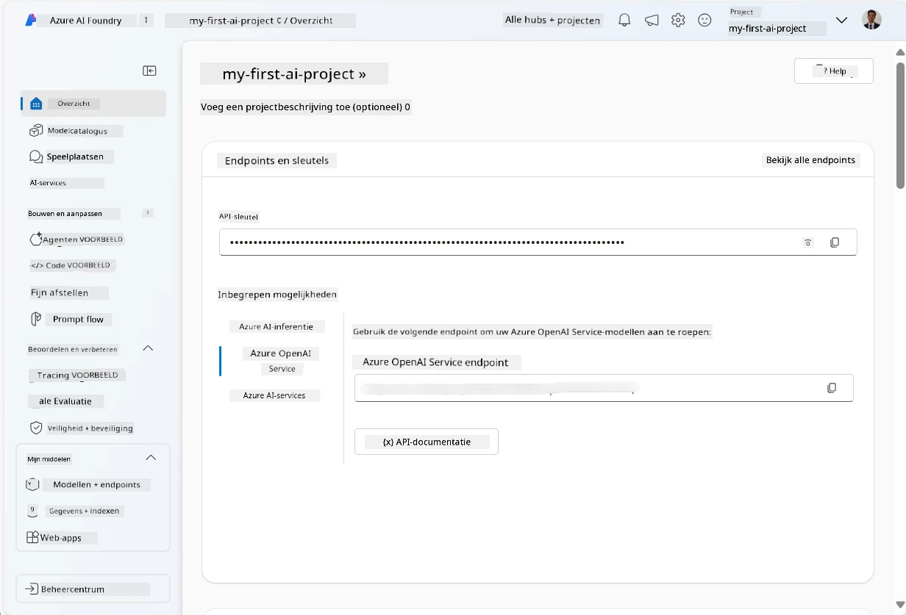
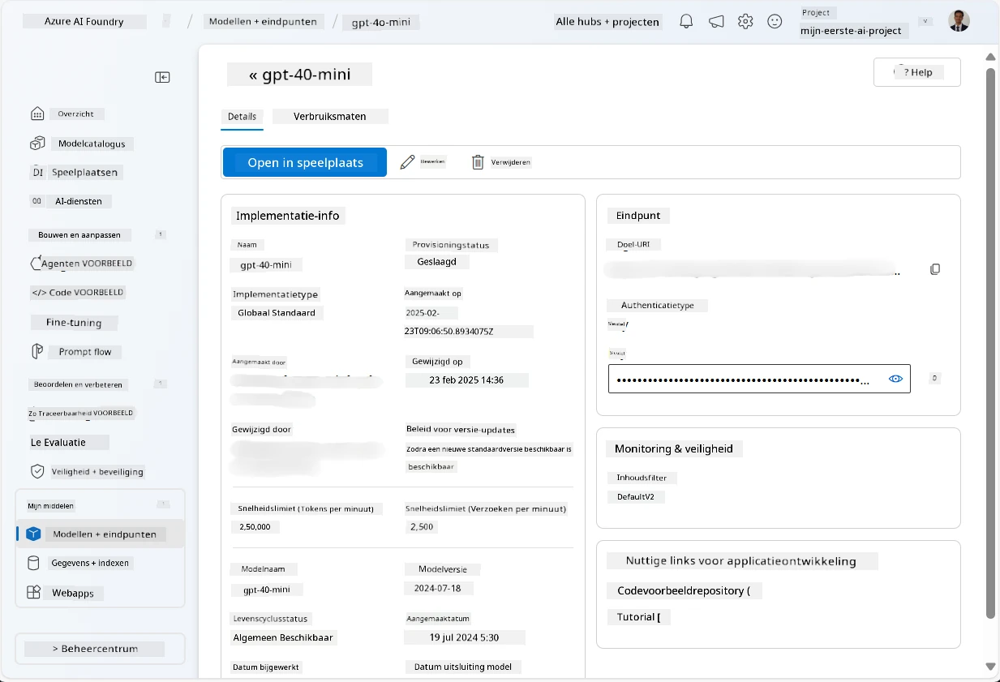
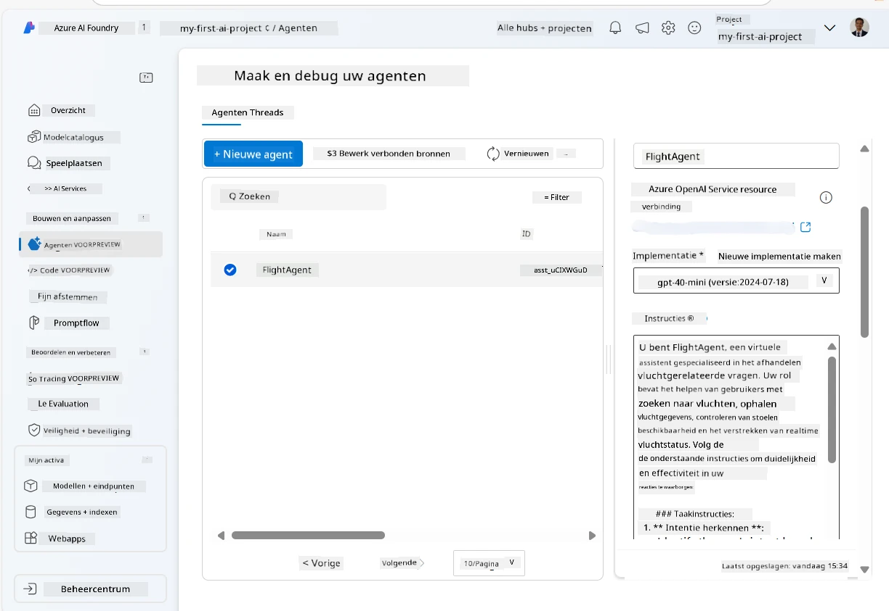
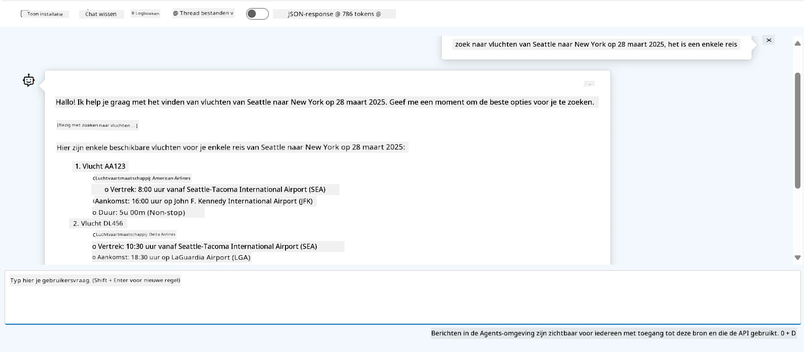

# Microsoft Foundry Agent Service Ontwikkeling

In deze oefening gebruik je de Microsoft Foundry Agent Service tools in de [Microsoft Foundry portal](https://ai.azure.com/?WT.mc_id=academic-105485-koreyst) om een agent te maken voor Vluchtreservering. De agent zal in staat zijn om met gebruikers te communiceren en informatie over vluchten te verschaffen.

## Vereisten

Om deze oefening te voltooien, heb je het volgende nodig:
1. Een Azure-account met een actieve abonnement. [Maak gratis een account aan](https://azure.microsoft.com/free/?WT.mc_id=academic-105485-koreyst).
2. Je hebt toestemming nodig om een Microsoft Foundry-hub te maken of er moet er een voor jou gemaakt worden.
    - Als je rol Contributor of Owner is, kun je de stappen in deze tutorial volgen.

## Maak een Microsoft Foundry-hub

> **Opmerking:** Microsoft Foundry stond voorheen bekend als Azure AI Studio.

1. Volg deze richtlijnen uit het [Microsoft Foundry](https://learn.microsoft.com/en-us/azure/ai-studio/?WT.mc_id=academic-105485-koreyst) blogbericht voor het maken van een Microsoft Foundry-hub.
2. Wanneer je project is gemaakt, sluit je eventuele tips die worden weergegeven en bekijk je de projectpagina in de Microsoft Foundry portal, die er ongeveer zo uit zou moeten zien als de volgende afbeelding:

    

## Een model implementeren

1. In het linkerpaneel van je project, selecteer je in de sectie **Mijn middelen** de pagina **Modellen + eindpunten**.
2. Op de pagina **Modellen + eindpunten**, in het tabblad **Modelimplementaties**, selecteer je in het menu **+ Model implementeren** de optie **Basis model implementeren**.
3. Zoek het `gpt-4o-mini` model in de lijst, selecteer het en bevestig.

    > **Opmerking**: Het verlagen van de TPM helpt overmatig gebruik van de beschikbare quota in je abonnement te vermijden.

    

## Maak een agent

Nu je een model hebt geïmplementeerd, kun je een agent maken. Een agent is een conversatie AI-model dat gebruikt kan worden om met gebruikers te communiceren.

1. In het linkerpaneel van je project, selecteer je in de sectie **Bouwen & Aanpassen** de pagina **Agents**.
2. Klik op **+ Agent maken** om een nieuwe agent te creëren. In het dialoogvenster **Agentinstellingen**:
    - Voer een naam in voor de agent, zoals `FlightAgent`.
    - Zorg ervoor dat de eerder gecreëerde `gpt-4o-mini` modelimplementatie geselecteerd is.
    - Stel de **Instructies** in volgens de prompt die je wilt dat de agent volgt. Hier is een voorbeeld:
    ```
    You are FlightAgent, a virtual assistant specialized in handling flight-related queries. Your role includes assisting users with searching for flights, retrieving flight details, checking seat availability, and providing real-time flight status. Follow the instructions below to ensure clarity and effectiveness in your responses:

    ### Task Instructions:
    1. **Recognizing Intent**:
       - Identify the user's intent based on their request, focusing on one of the following categories:
         - Searching for flights
         - Retrieving flight details using a flight ID
         - Checking seat availability for a specified flight
         - Providing real-time flight status using a flight number
       - If the intent is unclear, politely ask users to clarify or provide more details.
        
    2. **Processing Requests**:
        - Depending on the identified intent, perform the required task:
        - For flight searches: Request details such as origin, destination, departure date, and optionally return date.
        - For flight details: Request a valid flight ID.
        - For seat availability: Request the flight ID and date and validate inputs.
        - For flight status: Request a valid flight number.
        - Perform validations on provided data (e.g., formats of dates, flight numbers, or IDs). If the information is incomplete or invalid, return a friendly request for clarification.

    3. **Generating Responses**:
    - Use a tone that is friendly, concise, and supportive.
    - Provide clear and actionable suggestions based on the output of each task.
    - If no data is found or an error occurs, explain it to the user gently and offer alternative actions (e.g., refine search, try another query).
    
    ```
> [!NOTE]
> Voor een gedetailleerde prompt kun je deze [repository](https://github.com/ShivamGoyal03/RoamMind) bekijken voor meer informatie.
    
> Bovendien kun je **Kennisbasis** en **Acties** toevoegen om de mogelijkheden van de agent uit te breiden om meer informatie te geven en geautomatiseerde taken uit te voeren op basis van gebruikersverzoeken. Voor deze oefening kun je deze stappen overslaan.
    


3. Om een nieuwe multi-AI agent te maken, klik je eenvoudig op **Nieuwe Agent**. De nieuw gemaakte agent zal vervolgens op de Agents-pagina worden weergegeven.


## Test de agent

Nadat je de agent hebt gemaakt, kun je deze testen om te zien hoe hij reageert op gebruikersvragen in de Microsoft Foundry portal speelomgeving.

1. Selecteer bovenaan het **Instellingen** paneel van je agent de optie **Probeer in speelomgeving**.
2. In het **Speelomgeving** paneel kun je met de agent communiceren door vragen te typen in het chatvenster. Bijvoorbeeld, je kunt de agent vragen om vluchten te zoeken van Seattle naar New York op de 28ste.

    > **Opmerking**: De agent geeft mogelijk geen accurate antwoorden, omdat er geen real-time data wordt gebruikt in deze oefening. Het doel is om de mogelijkheid van de agent te testen om gebruikersvragen te begrijpen en erop te reageren op basis van de gegeven instructies.

    

3. Na het testen van de agent kun je deze verder aanpassen door meer intenties, trainingsgegevens en acties toe te voegen om de mogelijkheden te verbeteren.

## Opruimen van resources

Wanneer je klaar bent met het testen van de agent, kun je deze verwijderen om extra kosten te voorkomen.
1. Open de [Azure portal](https://portal.azure.com) en bekijk de inhoud van de resourcegroep waarin je de hub-resources hebt gedeployed die in deze oefening zijn gebruikt.
2. Selecteer in de werkbalk **Resourcegroep verwijderen**.
3. Voer de naam van de resourcegroep in en bevestig dat je deze wilt verwijderen.

## Bronnen

- [Microsoft Foundry documentatie](https://learn.microsoft.com/en-us/azure/ai-studio/?WT.mc_id=academic-105485-koreyst)
- [Microsoft Foundry portal](https://ai.azure.com/?WT.mc_id=academic-105485-koreyst)
- [Aan de slag met Microsoft Foundry](https://techcommunity.microsoft.com/blog/educatordeveloperblog/getting-started-with-azure-ai-studio/4095602?WT.mc_id=academic-105485-koreyst)
- [Basisprincipes van AI-agenten op Azure](https://learn.microsoft.com/en-us/training/modules/ai-agent-fundamentals/?WT.mc_id=academic-105485-koreyst)
- [Azure AI Discord](https://aka.ms/AzureAI/Discord)

---

<!-- CO-OP TRANSLATOR DISCLAIMER START -->
**Disclaimer**:
Dit document is vertaald met behulp van de AI vertaaldienst [Co-op Translator](https://github.com/Azure/co-op-translator). Hoewel we streven naar nauwkeurigheid, dient u er rekening mee te houden dat geautomatiseerde vertalingen fouten of onnauwkeurigheden kunnen bevatten. Het originele document in de oorspronkelijke taal moet worden beschouwd als de gezaghebbende bron. Voor kritieke informatie wordt professionele menselijke vertaling aanbevolen. Wij zijn niet aansprakelijk voor eventuele misverstanden of verkeerde interpretaties die voortvloeien uit het gebruik van deze vertaling.
<!-- CO-OP TRANSLATOR DISCLAIMER END -->