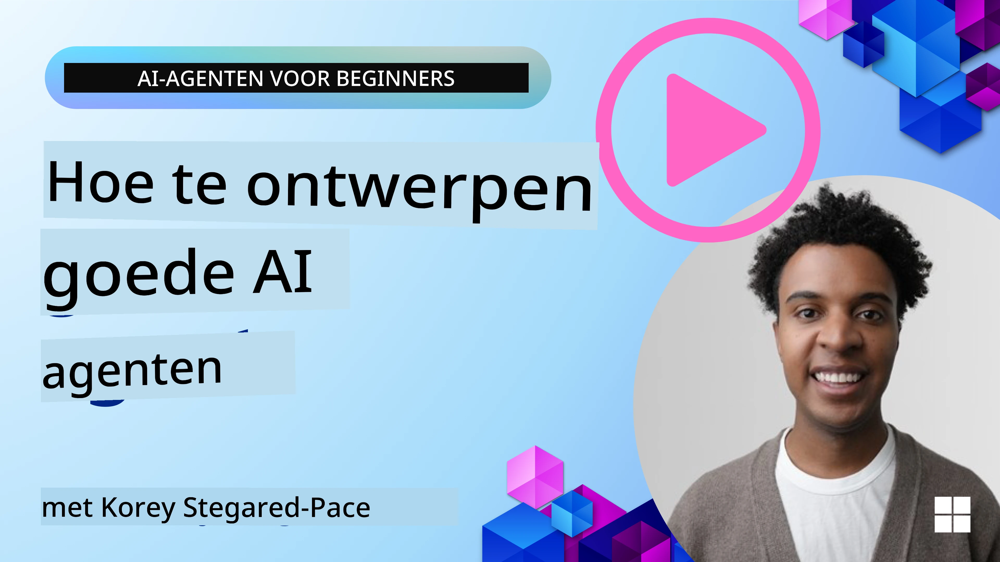
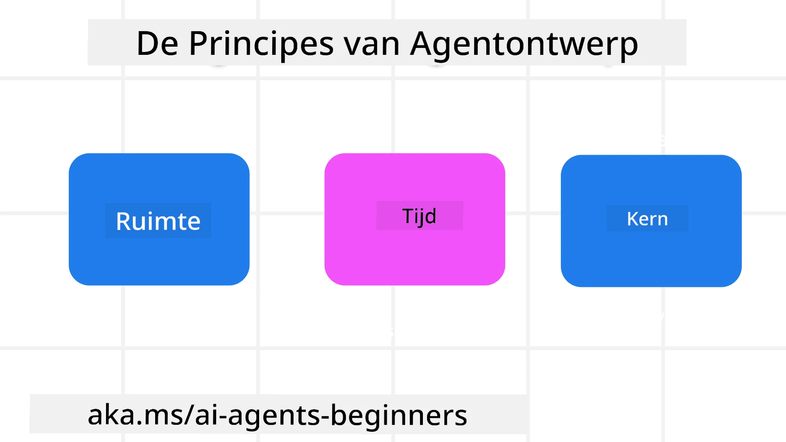

> _(Klik op de afbeelding hierboven om de video van deze les te bekijken)_
# AI Agentic Ontwerpprincipes

## Inleiding

Er zijn veel manieren om na te denken over het bouwen van AI Agentic Systemen. Aangezien ambiguïteit een kenmerk is en geen fout in Generative AI-ontwerp, is het soms moeilijk voor engineers om te bepalen waar ze moeten beginnen. We hebben een set mensgerichte UX Ontwerpprincipes ontwikkeld waarmee ontwikkelaars klantgerichte agentische systemen kunnen bouwen om aan hun bedrijfsbehoeften te voldoen. Deze ontwerpprincipes zijn geen voorschrijvende architectuur, maar eerder een startpunt voor teams die agent ervaringen definiëren en ontwikkelen.

In het algemeen zouden agenten moeten:

- Menselijke capaciteiten uitbreiden en opschalen (brainstormen, probleemoplossing, automatisering, enz.)
- Leemtes in kennis invullen (mijn bijspijkeren in kennisdomeinen, vertaling, enz.)
- Samenwerking faciliteren en ondersteunen op de manieren waarop wij als individuen liever met anderen samenwerken
- Ons betere versies van onszelf maken (bijv. levenscoach/taakmeester, ons helpen emotionele regulatie en mindfulness vaardigheden te leren, veerkracht opbouwen, enz.)

## Deze Les Behandelt

- Wat de Agentic Ontwerpprincipes zijn
- Wat enkele richtlijnen zijn om te volgen bij het implementeren van deze ontwerpprincipes
- Wat enkele voorbeelden zijn van het gebruik van de ontwerpprincipes

## Leerdoelen

Na het voltooien van deze les zul je in staat zijn om:

1. Uit te leggen wat de Agentic Ontwerpprincipes zijn
2. Uit te leggen wat de richtlijnen zijn voor het gebruik van de Agentic Ontwerpprincipes
3. Te begrijpen hoe je een agent bouwt met behulp van de Agentic Ontwerpprincipes

## De Agentic Ontwerpprincipes

### Agent (Ruimte)

Dit is de omgeving waarin de agent opereert. Deze principes informeren hoe we agenten ontwerpen voor interactie in fysieke en digitale werelden.

- **Verbinden, niet samenvoegen** – help mensen verbinden met andere mensen, gebeurtenissen en toepasbare kennis om samenwerking en verbinding mogelijk te maken.
- Agenten helpen gebeurtenissen, kennis en mensen met elkaar te verbinden.
- Agenten brengen mensen dichter bij elkaar. Ze zijn niet ontworpen om mensen te vervangen of te kleineren.
- **Gemakkelijk toegankelijk maar af en toe onzichtbaar** – agent opereert grotendeels op de achtergrond en duwt ons alleen wanneer het relevant en gepast is.
  - Agent is gemakkelijk vindbaar en toegankelijk voor geautoriseerde gebruikers op elk apparaat of platform.
  - Agent ondersteunt multimodale inputs en outputs (geluid, spraak, tekst, enz.).
  - Agent kan naadloos schakelen tussen voorgrond en achtergrond; tussen proactief en reactief, afhankelijk van de waarneming van gebruikersbehoeften.
  - Agent kan in onzichtbare vorm opereren, maar het achtergrondproces en de samenwerking met andere agenten zijn transparant voor en controleerbaar door de gebruiker.

### Agent (Tijd)

Dit is hoe de agent opereert in de tijd. Deze principes informeren hoe we agenten ontwerpen die interacteren met het verleden, heden en toekomst.

- **Verleden**: Reflecteren op geschiedenis die zowel toestand als context omvat.
  - Agent levert relevantere resultaten op basis van analyse van rijkere historische data buiten alleen het event, mensen of toestanden.
  - Agent maakt verbindingen vanaf gebeurtenissen uit het verleden en reflecteert actief op geheugen om met huidige situaties om te gaan.
- **Nu**: Sturen meer dan alleen informeren.
  - Agent belichaamt een uitgebreide benadering van interactie met mensen. Wanneer een gebeurtenis plaatsvindt, gaat de Agent verder dan statische notificaties of andere statische formaliteiten. Agent kan processen vereenvoudigen of dynamisch cues genereren om de aandacht van de gebruiker op het juiste moment te richten.
  - Agent levert informatie op basis van contextuele omgeving, sociale en culturele veranderingen en afgestemd op gebruikersintentie.
  - Agent-interactie kan geleidelijk zijn, evoluerend/groeiend in complexiteit om gebruikers op de lange termijn te versterken.
- **Toekomst**: Aanpassen en evolueren.
  - Agent past zich aan verschillende apparaten, platforms en modaliteiten aan.
  - Agent past zich aan gebruikersgedrag, toegankelijkheidsbehoeften aan en is vrij aanpasbaar.
  - Agent wordt gevormd door en evolueert via continue gebruikersinteractie.

### Agent (Kern)

Dit zijn de kernelementen in het ontwerp van een agent.

- **Omarm onzekerheid maar bouw vertrouwen op**.
  - Een bepaald niveau van agent onzekerheid wordt verwacht. Onzekerheid is een sleutelelement van agentontwerp.
  - Vertrouwen en transparantie zijn fundamentele lagen van agentontwerp.
  - Mensen hebben de controle over wanneer de agent aan/uit staat en de status van de agent is altijd duidelijk zichtbaar.

## De Richtlijnen om deze Principes te Implementeren

Wanneer je de vorige ontwerpprincipes gebruikt, volg dan de volgende richtlijnen:

1. **Transparantie**: Informeer de gebruiker dat AI betrokken is, hoe het functioneert (inclusief eerdere acties), en hoe feedback kan worden gegeven en het systeem aangepast kan worden.
2. **Controle**: Maak het mogelijk voor de gebruiker om aan te passen, voorkeuren te specificeren en te personaliseren, en controle te hebben over het systeem en zijn attributen (inclusief de mogelijkheid om te vergeten).
3. **Consistentie**: Streef naar consistente, multimodale ervaringen over apparaten en eindpunten. Gebruik waar mogelijk bekende UI/UX-elementen (bijv. microfoon-icoon voor spraakinteractie) en verminder de cognitieve belasting van de klant zoveel mogelijk (bijv. streef naar beknopte antwoorden, visuele hulpmiddelen en ‘Lees meer’-inhoud).

## Hoe Ontwerp je een Reisagent met deze Principes en Richtlijnen

Stel je voor dat je een Reisagent ontwerpt, zo zou je kunnen nadenken over het gebruik van de Ontwerpprincipes en Richtlijnen:

1. **Transparantie** – Laat de gebruiker weten dat de Reisagent een AI-aangedreven agent is. Geef enkele basisinstructies over hoe te beginnen (bijv. een “Hallo” bericht, voorbeeld prompts). Documenteer dit duidelijk op de productpagina. Toon de lijst van prompts die een gebruiker in het verleden heeft gevraagd. Maak duidelijk hoe feedback gegeven kan worden (duimpje omhoog en omlaag, knop Feedback Verzenden, enz.). Geef duidelijk aan of de agent gebruiks- of onderwerpbeperkingen heeft.
2. **Controle** – Zorg dat het duidelijk is hoe de gebruiker de agent kan aanpassen nadat deze is gemaakt, met zaken als het Systeemprompt. Maak het mogelijk dat de gebruiker kan kiezen hoe uitgebreid de agent is, zijn schrijfstijl en eventuele waarschuwingen over onderwerpen waar de agent niet over mag praten. Laat de gebruiker alle bijbehorende bestanden of data, prompts en eerdere gesprekken bekijken en verwijderen.
3. **Consistentie** – Zorg dat de iconen voor deel prompt, een bestand of foto toevoegen en iemand of iets taggen standaard en herkenbaar zijn. Gebruik het paperclip-icoon om het uploaden/delen van bestanden met de agent aan te geven, en een afbeelding-icoon om grafische uploads aan te duiden.

## Voorbeeldcodes

- Python: [Agent Framework](./code_samples/03-python-agent-framework.ipynb)
- .NET: [Agent Framework](./code_samples/03-dotnet-agent-framework.md)

## Nog Meer Vragen over AI Agentic Ontwerppatronen?

Doe mee aan de [Microsoft Foundry Discord](https://discord.com/invite/ATgtXmAS5D) om andere leerlingen te ontmoeten, deel te nemen aan kantooruren en je vragen over AI Agenten beantwoord te krijgen.

## Aanvullende Bronnen

- <a href="https://openai.com" target="_blank">Praktijken voor het Besturen van Agentic AI Systemen | OpenAI</a>
- <a href="https://microsoft.com" target="_blank">The HAX Toolkit Project - Microsoft Research</a>
- <a href="https://responsibleaitoolbox.ai" target="_blank">Responsible AI Toolbox</a>

## Vorige Les

[Exploring Agentic Frameworks](../02-explore-agentic-frameworks/README.md)

## Volgende Les

[Tool Use Design Pattern](../04-tool-use/README.md)

---

<!-- CO-OP TRANSLATOR DISCLAIMER START -->
**Disclaimer**:
Dit document is vertaald met behulp van de AI vertaaldienst [Co-op Translator](https://github.com/Azure/co-op-translator). Hoewel we streven naar nauwkeurigheid, dient u er rekening mee te houden dat geautomatiseerde vertalingen fouten of onnauwkeurigheden kunnen bevatten. Het originele document in de oorspronkelijke taal moet worden beschouwd als de gezaghebbende bron. Voor kritieke informatie wordt professionele menselijke vertaling aanbevolen. Wij zijn niet aansprakelijk voor eventuele misverstanden of verkeerde interpretaties die voortvloeien uit het gebruik van deze vertaling.
<!-- CO-OP TRANSLATOR DISCLAIMER END -->