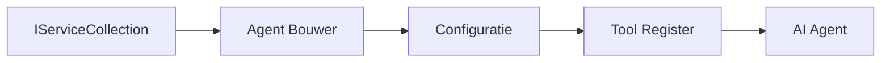

# 🎨 Agentic Ontwerppatronen met Azure OpenAI (Responses API) (.NET)

## 📋 Leerdoelen

Dit voorbeeld demonstreert ontwerpprincipes van bedrijfsniveau voor het bouwen van intelligente agenten met behulp van het Microsoft Agent Framework in .NET met Azure OpenAI (Responses API) integratie. Je leert professionele patronen en architecturale benaderingen die agenten productie-klaar, onderhoudbaar en schaalbaar maken.

### Ontwerppatronen voor ondernemingen

- 🏭 **Factory Pattern**: Gestandaardiseerde agentcreatie met dependency injection
- 🔧 **Builder Pattern**: Vlotte agentconfiguratie en -opzet
- 🧵 **Thread-Safe Patronen**: Gelijktijdige gesprekbeheer
- 📋 **Repository Pattern**: Georganiseerd beheer van tools en capaciteiten

## 🎯 .NET-specifieke architecturale voordelen

### Enterprise-functionaliteiten

- **Sterke Typing**: Validatie tijdens compilatie en IntelliSense-ondersteuning
- **Dependency Injection**: Ingebouwde DI-containerintegratie
- **Configuratiebeheer**: IConfiguration- en Options-patronen
- **Async/Await**: Eersteklas asynchrone programmeerondersteuning

### Productierijpe patronen

- **Logging-integratie**: ILogger en gestructureerde logging-ondersteuning
- **Health Checks**: Ingebouwde monitoring en diagnostiek
- **Configuratievalidatie**: Sterke typing met data-annotaties
- **Foutafhandeling**: Gestructureerd exceptionbeheer

## 🔧 Technische architectuur

### Kerncomponenten van .NET

- **Microsoft.Extensions.AI**: Geünificeerde AI-service-abstraheringen
- **Microsoft.Agents.AI**: Orkestratiekader voor enterprise-agenten
- **Azure OpenAI (Responses API)**: Hoogwaardige API-clientpatronen
- **Configuratiesysteem**: appsettings.json en omgevingsintegratie

### Implementatie van ontwerppatronen



## 🏗️ Gedemonstreerde enterprise-patronen

### 1. **Creational Patterns**

- **Agent Factory**: Gecentraliseerde agentcreatie met consistente configuratie
- **Builder Pattern**: Vlotte API voor complexe agentconfiguratie
- **Singleton Pattern**: Gedeelde bronnen en configuratiebeheer
- **Dependency Injection**: Losse koppeling en testbaarheid

### 2. **Gedragsmatige Patronen**

- **Strategy Pattern**: Verwisselbare strategieën voor tooluitvoering
- **Command Pattern**: Ingekapserde agentoperaties met ongedaan maken/opnieuw doen
- **Observer Pattern**: Gebeurtenisgestuurd beheer van agentlevenscyclus
- **Template Method**: Gestandaardiseerde workflows voor agentuitvoering

### 3. **Structurele Patronen**

- **Adapter Pattern**: Integratielaag voor Azure OpenAI (Responses API)
- **Decorator Pattern**: Capaciteitsverbetering van agenten
- **Facade Pattern**: Vereenvoudigde interfaces voor agentinteractie
- **Proxy Pattern**: Lazy loading en caching voor prestaties

## 📚 .NET Ontwerprichtlijnen

### SOLID Principes

- **Single Responsibility**: Elk onderdeel heeft één duidelijk doel
- **Open/Closed**: Uitbreidbaar zonder aanpassing
- **Liskov Substitution**: Interface-gebaseerde toolimplementaties
- **Interface Segregation**: Gerichte, samenhangende interfaces
- **Dependency Inversion**: Afhankelijk van abstracties, niet van concreties

### Clean Architecture

- **Domeinlaag**: Kern-abstraheringen voor agenten en tools
- **Applicatielaag**: Orkestratie van agenten en workflows
- **Infrastructuurlaag**: Integratie van Azure OpenAI (Responses API) en externe diensten
- **Presentatielaag**: Gebruikersinteractie en responsopmaak

## 🔒 Enterprise-overwegingen

### Beveiliging

- **Credential Management**: Veilige verwerking van API-sleutels met IConfiguration
- **Inputvalidatie**: Sterke typing en validatie via data-annotaties
- **Outputsanering**: Veilige verwerking en filtering van reacties
- **Auditlogging**: Uitgebreide tracking van operaties

### Prestaties

- **Async Patronen**: Niet-blockerende I/O-bewerkingen
- **Connection Pooling**: Efficiënt beheer van HTTP-clients
- **Caching**: Reactiecaching voor verbeterde prestaties
- **Resourcebeheer**: Correcte disposal- en opschoonpatronen

### Schaalbaarheid

- **Thread Safety**: Ondersteuning voor gelijktijdige agentuitvoering
- **Resource Pooling**: Efficiënt gebruik van middelen
- **Load Management**: Rate limiting en backpressure-afhandeling
- **Monitoring**: Prestatiemaatstaven en health checks

## 🚀 Productie-implementatie

- **Configuratiebeheer**: Omgevingsspecifieke instellingen
- **Loggingstrategie**: Gestructureerde logging met correlatie-ID's
- **Foutafhandeling**: Globale exceptieafhandeling met juiste herstelmechanismen
- **Monitoring**: Application Insights en prestatiecounters
- **Testing**: Unit tests, integratietests en load testing-patronen

Klaar om intelligente agenten van enterprise-niveau te bouwen met .NET? Laten we iets robuusts architectureren! 🏢✨

## 🚀 Aan de slag

### Vereisten

- [.NET 10 SDK](https://dotnet.microsoft.com/download/dotnet/10.0) of hoger
- Een [Azure-abonnement](https://azure.microsoft.com/free/) met een Azure OpenAI-resource en een modelimplementatie
- De [Azure CLI](https://learn.microsoft.com/cli/azure/install-azure-cli) — meld je aan met `az login`

### Vereiste omgevingsvariabelen

```bash
# zsh/bash
export AZURE_OPENAI_ENDPOINT=https://<your-resource>.openai.azure.com
export AZURE_OPENAI_DEPLOYMENT=gpt-4o-mini
# Log daarna in zodat AzureCliCredential een token kan krijgen
az login
```

```powershell
# PowerShell
$env:AZURE_OPENAI_ENDPOINT = "https://<your-resource>.openai.azure.com"
$env:AZURE_OPENAI_DEPLOYMENT = "gpt-4o-mini"
# Log dan in zodat AzureCliCredential een token kan krijgen
az login
```

### Voorbeeldcode

Om het codevoorbeeld uit te voeren,

```bash
# zsh/bash
chmod +x ./03-dotnet-agent-framework.cs
./03-dotnet-agent-framework.cs
```

Of met de dotnet CLI:

```bash
dotnet run ./03-dotnet-agent-framework.cs
```

Zie [`03-dotnet-agent-framework.cs`](../../../../03-agentic-design-patterns/code_samples/03-dotnet-agent-framework.cs) voor de volledige code.

```csharp
#!/usr/bin/dotnet run

#:package Microsoft.Extensions.AI@10.*
#:package Microsoft.Agents.AI.OpenAI@1.*-*
#:package Azure.AI.OpenAI@2.1.0
#:package Azure.Identity@1.13.1

using System.ComponentModel;

using Microsoft.Agents.AI;
using Microsoft.Extensions.AI;

using Azure.AI.OpenAI;
using Azure.Identity;

// Tool Function: Random Destination Generator
// This static method will be available to the agent as a callable tool
// The [Description] attribute helps the AI understand when to use this function
// This demonstrates how to create custom tools for AI agents
[Description("Provides a random vacation destination.")]
static string GetRandomDestination()
{
    // List of popular vacation destinations around the world
    // The agent will randomly select from these options
    var destinations = new List<string>
    {
        "Paris, France",
        "Tokyo, Japan",
        "New York City, USA",
        "Sydney, Australia",
        "Rome, Italy",
        "Barcelona, Spain",
        "Cape Town, South Africa",
        "Rio de Janeiro, Brazil",
        "Bangkok, Thailand",
        "Vancouver, Canada"
    };

    // Generate random index and return selected destination
    // Uses System.Random for simple random selection
    var random = new Random();
    int index = random.Next(destinations.Count);
    return destinations[index];
}

// Azure OpenAI with the Responses API (stable v1 endpoint). Sign in with `az login`.
var azureEndpoint = Environment.GetEnvironmentVariable("AZURE_OPENAI_ENDPOINT")
    ?? throw new InvalidOperationException("AZURE_OPENAI_ENDPOINT is not set.");
var deployment = Environment.GetEnvironmentVariable("AZURE_OPENAI_DEPLOYMENT") ?? "gpt-4o-mini";

var azureClient = new AzureOpenAIClient(new Uri(azureEndpoint), new AzureCliCredential());

// Define Agent Identity and Comprehensive Instructions
// Agent name for identification and logging purposes
var AGENT_NAME = "TravelAgent";

// Detailed instructions that define the agent's personality, capabilities, and behavior
// This system prompt shapes how the agent responds and interacts with users
var AGENT_INSTRUCTIONS = """
You are a helpful AI Agent that can help plan vacations for customers.

Important: When users specify a destination, always plan for that location. Only suggest random destinations when the user hasn't specified a preference.

When the conversation begins, introduce yourself with this message:
"Hello! I'm your TravelAgent assistant. I can help plan vacations and suggest interesting destinations for you. Here are some things you can ask me:
1. Plan a day trip to a specific location
2. Suggest a random vacation destination
3. Find destinations with specific features (beaches, mountains, historical sites, etc.)
4. Plan an alternative trip if you don't like my first suggestion

What kind of trip would you like me to help you plan today?"

Always prioritize user preferences. If they mention a specific destination like "Bali" or "Paris," focus your planning on that location rather than suggesting alternatives.
""";

// Create AI Agent with Advanced Travel Planning Capabilities
// Get the Responses client for the deployment and create the AI agent
// Configure agent with name, detailed instructions, and available tools
// This demonstrates the .NET agent creation pattern with full configuration
AIAgent agent = azureClient
    .GetOpenAIResponseClient(deployment)
    .CreateAIAgent(
        name: AGENT_NAME,
        instructions: AGENT_INSTRUCTIONS,
        tools: [AIFunctionFactory.Create(GetRandomDestination)]
    );

// Create New Conversation Thread for Context Management
// Initialize a new conversation thread to maintain context across multiple interactions
// Threads enable the agent to remember previous exchanges and maintain conversational state
// This is essential for multi-turn conversations and contextual understanding
AgentThread thread = agent.GetNewThread();

// Execute Agent: First Travel Planning Request
// Run the agent with an initial request that will likely trigger the random destination tool
// The agent will analyze the request, use the GetRandomDestination tool, and create an itinerary
// Using the thread parameter maintains conversation context for subsequent interactions
await foreach (var update in agent.RunStreamingAsync("Plan me a day trip", thread))
{
    await Task.Delay(10);
    Console.Write(update);
}

Console.WriteLine();

// Execute Agent: Follow-up Request with Context Awareness
// Demonstrate contextual conversation by referencing the previous response
// The agent remembers the previous destination suggestion and will provide an alternative
// This showcases the power of conversation threads and contextual understanding in .NET agents
await foreach (var update in agent.RunStreamingAsync("I don't like that destination. Plan me another vacation.", thread))
{
    await Task.Delay(10);
    Console.Write(update);
}
```

---

<!-- CO-OP TRANSLATOR DISCLAIMER START -->
**Disclaimer**:
Dit document is vertaald met behulp van de AI vertaaldienst [Co-op Translator](https://github.com/Azure/co-op-translator). Hoewel we streven naar nauwkeurigheid, dient u er rekening mee te houden dat geautomatiseerde vertalingen fouten of onnauwkeurigheden kunnen bevatten. Het originele document in de oorspronkelijke taal moet worden beschouwd als de gezaghebbende bron. Voor kritieke informatie wordt professionele menselijke vertaling aanbevolen. Wij zijn niet aansprakelijk voor eventuele misverstanden of verkeerde interpretaties die voortvloeien uit het gebruik van deze vertaling.
<!-- CO-OP TRANSLATOR DISCLAIMER END -->