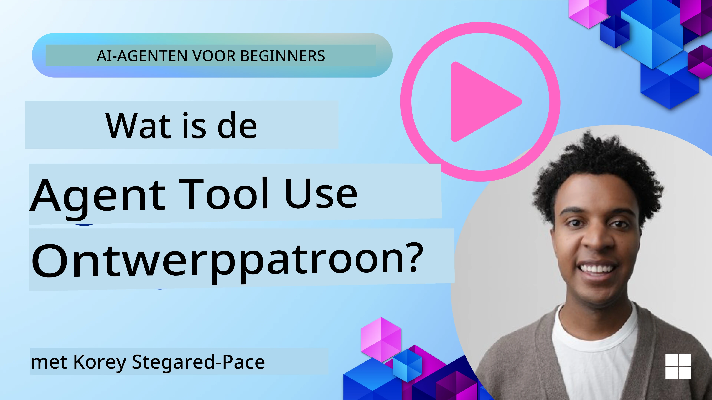
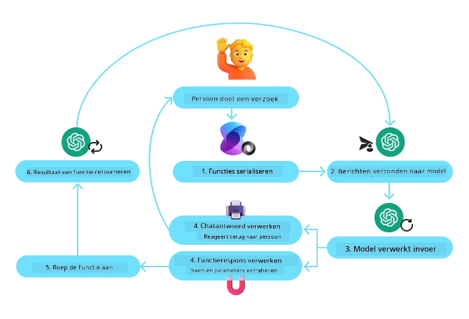
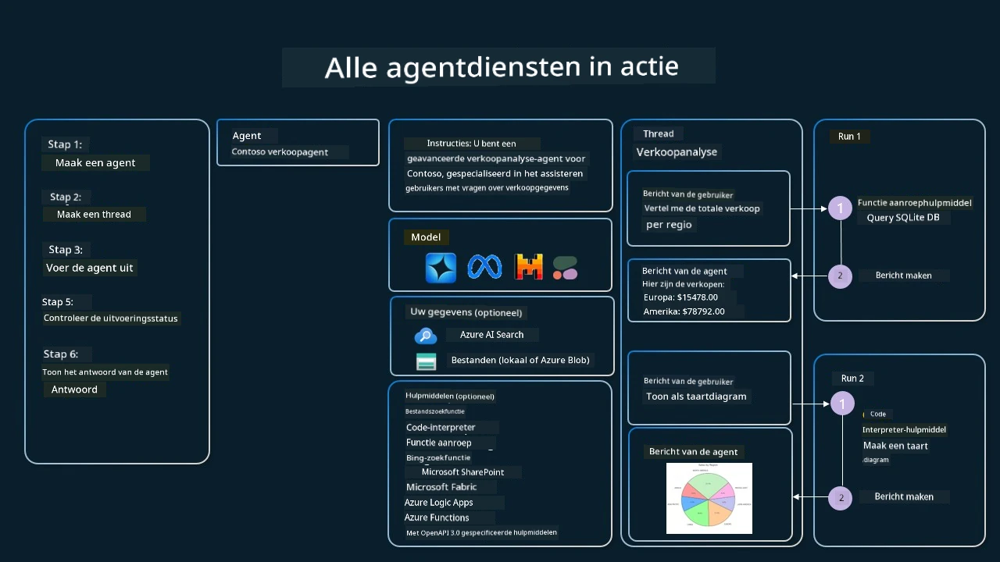

[](https://youtu.be/vieRiPRx-gI?si=cEZ8ApnT6Sus9rhn)

> _(Klik op bovenstaande afbeelding om de video van deze les te bekijken)_

# Tool Use Design Pattern

Tools zijn interessant omdat ze AI-agenten een breder scala aan mogelijkheden bieden. In plaats van dat de agent een beperkte set acties kan uitvoeren, kan de agent door het toevoegen van een tool nu een breed scala aan acties uitvoeren. In dit hoofdstuk bekijken we het Tool Use Design Pattern, dat beschrijft hoe AI-agenten specifieke tools kunnen gebruiken om hun doelen te bereiken.

## Introductie

In deze les willen we de volgende vragen beantwoorden:

- Wat is het tool use design pattern?
- Op welke gebruiksgevallen kan het worden toegepast?
- Wat zijn de elementen/bouwstenen die nodig zijn om het design pattern te implementeren?
- Wat zijn de speciale aandachtspunten voor het gebruik van het Tool Use Design Pattern bij het bouwen van betrouwbare AI-agenten?

## Leerdoelen

Na het voltooien van deze les kun je:

- Het Tool Use Design Pattern definiëren en het doel ervan uitleggen.
- Gebruikssituaties identificeren waarin het Tool Use Design Pattern toepasbaar is.
- De belangrijkste elementen begrijpen die nodig zijn om het design pattern te implementeren.
- Aandachtspunten herkennen voor het waarborgen van betrouwbaarheid van AI-agenten die dit design pattern gebruiken.

## Wat is het Tool Use Design Pattern?

Het **Tool Use Design Pattern** richt zich op het geven van de mogelijkheid aan LLM's om met externe tools te interacteren om specifieke doelen te bereiken. Tools zijn code die door een agent kunnen worden uitgevoerd om acties uit te voeren. Een tool kan een eenvoudige functie zijn zoals een rekenmachine, of een API-aanroep naar een dienst van derden zoals het opzoeken van aandelenkoersen of een weersvoorspelling. In de context van AI-agenten zijn tools ontworpen om door agenten te worden uitgevoerd als reactie op **door het model gegenereerde functieaanroepen**.

## Op welke gebruiksgevallen kan het worden toegepast?

AI-agenten kunnen tools benutten om complexe taken te voltooien, informatie op te halen of beslissingen te nemen. Het tool use design pattern wordt vaak gebruikt in scenario's die dynamische interactie vereisen met externe systemen, zoals databases, webservices of code-interpreters. Deze mogelijkheid is bruikbaar voor verschillende use cases, waaronder:

- **Dynamische Informatieverzameling:** Agenten kunnen externe API's of databases raadplegen om actuele gegevens op te halen (bijv. een SQLite-database raadplegen voor data-analyse, aandelenkoersen of weerinformatie ophalen).
- **Code-uitvoering en -interpretatie:** Agenten kunnen code of scripts uitvoeren om wiskundige problemen op te lossen, rapporten te genereren of simulaties uit te voeren.
- **Workflowautomatisering:** Herhalende of meerstaps workflows automatiseren door tools te integreren zoals taakplanners, e-maildiensten of datapijplijnen.
- **Klantenondersteuning:** Agenten kunnen communiceren met CRM-systemen, ticketsystemen of kennisbanken om gebruikersvragen op te lossen.
- **Contentgeneratie en -bewerking:** Agenten kunnen tools gebruiken zoals grammaticacontroleurs, tekstsamenvatters of contentveiligheidsevaluators om te assisteren bij contentcreatie.

## Wat zijn de elementen/bouwstenen die nodig zijn om het tool use design pattern te implementeren?

Deze bouwstenen stellen de AI-agent in staat een breed scala aan taken uit te voeren. Laten we de belangrijkste elementen bekijken die nodig zijn voor het implementeren van het Tool Use Design Pattern:

- **Functie-/Toolschema's**: Gedetailleerde definities van beschikbare tools, inclusief functienaam, doel, vereiste parameters en verwachte outputs. Deze schema's stellen de LLM in staat te begrijpen welke tools beschikbaar zijn en hoe geldige verzoeken worden geconstrueerd.

- **Logica voor Functie-uitvoering**: Bepaalt hoe en wanneer tools worden aangeroepen op basis van de intentie van de gebruiker en de context van het gesprek. Dit kan planner-modules, routeringsmechanismen of conditionele flows bevatten die het gebruik van tools dynamisch bepalen.

- **Berichtafhandelingssysteem**: Componenten die de conversatiestroom beheren tussen gebruikersinvoer, LLM-reacties, toolaanroepen en output van tools.

- **Toolintegratiekader**: Infrastructuur die de agent verbindt met verschillende tools, of het nu eenvoudige functies of complexe externe diensten zijn.

- **Foutafhandeling en Validatie**: Mechanismen om mislukkingen bij tooluitvoering af te handelen, parameters te valideren en onverwachte antwoorden te beheren.

- **Statusbeheer**: Houdt de context van het gesprek, eerdere toolinteracties en persistente gegevens bij om consistentie te garanderen bij gesprekken over meerdere beurten.

Vervolgens bekijken we Functie-/Toolaanroepen in meer detail.

### Functie-/Toolaanroepen

Functieaanroepen zijn de primaire manier waarop we Large Language Models (LLM's) in staat stellen om met tools te interacteren. Je zult vaak zien dat 'Functie' en 'Tool' door elkaar worden gebruikt omdat 'functies' (herbruikbare codeblokken) de 'tools' zijn die agenten gebruiken om taken uit te voeren. Om de code van een functie aan te roepen, moet een LLM het verzoek van de gebruiker vergelijken met de functiebeschrijving. Hiervoor wordt een schema met alle beschikbare functiebeschrijvingen naar de LLM gestuurd. De LLM selecteert vervolgens de meest geschikte functie voor de taak en retourneert de naam en argumenten. De geselecteerde functie wordt uitgevoerd, het resultaat wordt teruggestuurd naar de LLM, die deze informatie gebruikt om te reageren op het verzoek van de gebruiker.

Voor ontwikkelaars die functieaanroepen voor agenten willen implementeren, heb je nodig:

1. Een LLM-model dat functieaanroepen ondersteunt
2. Een schema met functiebeschrijvingen
3. De code voor elke beschreven functie

Laten we het voorbeeld van het opvragen van de huidige tijd in een stad gebruiken ter illustratie:

1. **Initialiseer een LLM dat functieaanroepen ondersteunt:**

    Niet alle modellen ondersteunen functieaanroepen, dus het is belangrijk te controleren of de door jou gebruikte LLM dat doet.     <a href="https://learn.microsoft.com/azure/ai-services/openai/how-to/function-calling" target="_blank">Azure OpenAI</a> ondersteunt functieaanroepen. We kunnen beginnen met het initialiseren van de Azure OpenAI-client.

    ```python
    # Initialiseer de Azure OpenAI-client
    client = AzureOpenAI(
        azure_endpoint = os.getenv("AZURE_AI_PROJECT_ENDPOINT"), 
        api_key=os.getenv("AZURE_OPENAI_API_KEY"),  
        api_version="2024-05-01-preview"
    )
    ```

1. **Maak een Functieschema aan**:

    Vervolgens definiëren we een JSON-schema dat de functienaam, een beschrijving van wat de functie doet, en de namen en beschrijvingen van de functieparameters bevat.
    Dit schema geven we door aan de eerder gemaakte client, samen met het gebruikersverzoek om de tijd in San Francisco op te zoeken. Belangrijk is dat wat wordt geretourneerd een **tool call** is, **niet** het definitieve antwoord op de vraag. Zoals eerder genoemd retourneert de LLM de naam van de functie die hij voor de taak heeft geselecteerd, en de argumenten die eraan worden doorgegeven.

    ```python
    # Functiebeschrijving voor het model om te lezen
    tools = [
        {
            "type": "function",
            "function": {
                "name": "get_current_time",
                "description": "Get the current time in a given location",
                "parameters": {
                    "type": "object",
                    "properties": {
                        "location": {
                            "type": "string",
                            "description": "The city name, e.g. San Francisco",
                        },
                    },
                    "required": ["location"],
                },
            }
        }
    ]
    ```
   
    ```python
  
    # Eerste gebruikersbericht
    messages = [{"role": "user", "content": "What's the current time in San Francisco"}] 
  
    # Eerste API-aanroep: Vraag het model om de functie te gebruiken
      response = client.chat.completions.create(
          model=deployment_name,
          messages=messages,
          tools=tools,
          tool_choice="auto",
      )
  
      # Verwerk de reactie van het model
      response_message = response.choices[0].message
      messages.append(response_message)
  
      print("Model's response:")  

      print(response_message)
  
    ```

    ```bash
    Model's response:
    ChatCompletionMessage(content=None, role='assistant', function_call=None, tool_calls=[ChatCompletionMessageToolCall(id='call_pOsKdUlqvdyttYB67MOj434b', function=Function(arguments='{"location":"San Francisco"}', name='get_current_time'), type='function')])
    ```
  
1. **De functiecodedie nodig is om de taak uit te voeren:**

    Nu de LLM heeft gekozen welke functie moet worden uitgevoerd, moet de code die de taak uitvoert worden geïmplementeerd en uitgevoerd.
    We kunnen de code om de huidige tijd op te halen in Python implementeren. Ook moeten we de code schrijven om de naam en argumenten uit het response_message te extraheren om het uiteindelijke resultaat te krijgen.

    ```python
      def get_current_time(location):
        """Get the current time for a given location"""
        print(f"get_current_time called with location: {location}")  
        location_lower = location.lower()
        
        for key, timezone in TIMEZONE_DATA.items():
            if key in location_lower:
                print(f"Timezone found for {key}")  
                current_time = datetime.now(ZoneInfo(timezone)).strftime("%I:%M %p")
                return json.dumps({
                    "location": location,
                    "current_time": current_time
                })
      
        print(f"No timezone data found for {location_lower}")  
        return json.dumps({"location": location, "current_time": "unknown"})
    ```

     ```python
     # Afhandelen van functieverzoeken
      if response_message.tool_calls:
          for tool_call in response_message.tool_calls:
              if tool_call.function.name == "get_current_time":
     
                  function_args = json.loads(tool_call.function.arguments)
     
                  time_response = get_current_time(
                      location=function_args.get("location")
                  )
     
                  messages.append({
                      "tool_call_id": tool_call.id,
                      "role": "tool",
                      "name": "get_current_time",
                      "content": time_response,
                  })
      else:
          print("No tool calls were made by the model.")  
  
      # Tweede API-aanroep: Krijg de definitieve respons van het model
      final_response = client.chat.completions.create(
          model=deployment_name,
          messages=messages,
      )
  
      return final_response.choices[0].message.content
     ```

     ```bash
      get_current_time called with location: San Francisco
      Timezone found for san francisco
      The current time in San Francisco is 09:24 AM.
     ```

Functieaanroepen vormen de kern van de meeste, zo niet alle, tool use design patronen voor agents, maar het zelf implementeren kan soms uitdagend zijn.
Zoals we geleerd hebben in [Les 2](../../../02-explore-agentic-frameworks) bieden agentic frameworks kant-en-klare bouwstenen om toolgebruik te implementeren.
 
## Voorbeelden van toolgebruik met Agentic Frameworks

Hier zijn enkele voorbeelden van hoe je het Tool Use Design Pattern kunt implementeren met verschillende agentic frameworks:

### Microsoft Agent Framework

<a href="https://learn.microsoft.com/azure/ai-services/agents/overview" target="_blank">Microsoft Agent Framework</a> is een open-source AI-framework om AI-agenten te bouwen. Het vereenvoudigt het gebruik van functieaanroepen door je toe te staan tools te definiëren als Python-functies met de `@tool` decorator. Het framework verzorgt de communicatie tussen het model en je code. Daarnaast biedt het toegang tot kant-en-klare tools zoals Bestandszoeker en Code Interpreter via de `AzureAIProjectAgentProvider`.

Het volgende diagram illustreert het proces van functieaanroepen met het Microsoft Agent Framework:



In het Microsoft Agent Framework worden tools gedefinieerd als gedecoreerde functies. We kunnen de eerder bekeken `get_current_time` functie omzetten in een tool met de `@tool` decorator. Het framework serialiseert automatisch de functie en parameters, en maakt het schema dat naar de LLM wordt gestuurd.

```python
from agent_framework import tool
from agent_framework.azure import AzureAIProjectAgentProvider
from azure.identity import AzureCliCredential

@tool
def get_current_time(location: str) -> str:
    """Get the current time for a given location"""
    ...

# Maak de cliënt aan
provider = AzureAIProjectAgentProvider(credential=AzureCliCredential())

# Maak een agent aan en voer uit met het hulpmiddel
agent = await provider.create_agent(name="TimeAgent", instructions="Use available tools to answer questions.", tools=get_current_time)
response = await agent.run("What time is it?")
```
  
### Azure AI Agent Service

<a href="https://learn.microsoft.com/azure/ai-services/agents/overview" target="_blank">Azure AI Agent Service</a> is een nieuwere agentic framework die ontworpen is om ontwikkelaars te helpen veilig hoogwaardige, uitbreidbare AI-agenten te bouwen, implementeren en schalen zonder dat ze de onderliggende rekencapaciteit en opslag hoeven te beheren. Het is met name nuttig voor enterprise toepassingen omdat het een volledig beheerde dienst is met beveiliging op enterprise-niveau.

Vergeleken met het direct ontwikkelen met de LLM API biedt Azure AI Agent Service enkele voordelen, waaronder:

- Automatisch toolgebruik – geen noodzaak om toolaanroepen te parseren, tools aan te roepen en respons te verwerken; dit alles gebeurt nu serverside
- Veilig beheerde data – in plaats van je eigen gesprekstatus te beheren, kun je vertrouwen op threads om alle benodigde informatie op te slaan
- Kant-en-klare tools – tools die je kunt gebruiken om te communiceren met je databronnen, zoals Bing, Azure AI Search en Azure Functions.

De tools die beschikbaar zijn in Azure AI Agent Service kunnen worden verdeeld in twee categorieën:

1. Knowledge Tools:
    - <a href="https://learn.microsoft.com/azure/ai-services/agents/how-to/tools/bing-grounding?tabs=python&pivots=overview" target="_blank">Integratie met Bing Search</a>
    - <a href="https://learn.microsoft.com/azure/ai-services/agents/how-to/tools/file-search?tabs=python&pivots=overview" target="_blank">Bestandszoeker</a>
    - <a href="https://learn.microsoft.com/azure/ai-services/agents/how-to/tools/azure-ai-search?tabs=azurecli%2Cpython&pivots=overview-azure-ai-search" target="_blank">Azure AI Search</a>

2. Action Tools:
    - <a href="https://learn.microsoft.com/azure/ai-services/agents/how-to/tools/function-calling?tabs=python&pivots=overview" target="_blank">Functieaanroepen</a>
    - <a href="https://learn.microsoft.com/azure/ai-services/agents/how-to/tools/code-interpreter?tabs=python&pivots=overview" target="_blank">Code Interpreter</a>
    - <a href="https://learn.microsoft.com/azure/ai-services/agents/how-to/tools/openapi-spec?tabs=python&pivots=overview" target="_blank">OpenAPI-gedefinieerde tools</a>
    - <a href="https://learn.microsoft.com/azure/ai-services/agents/how-to/tools/azure-functions?pivots=overview" target="_blank">Azure Functions</a>

De Agent Service stelt ons in staat deze tools samen te gebruiken als een `toolset`. Ook gebruikt het `threads` die de geschiedenis van berichten van een specifiek gesprek bijhouden.

Stel je bent een salesagent bij een bedrijf genaamd Contoso. Je wilt een conversatieagent ontwikkelen die vragen over je salesdata kan beantwoorden.

De volgende afbeelding illustreert hoe je Azure AI Agent Service kunt gebruiken om je salesdata te analyseren:



Om één van deze tools met de service te gebruiken, kunnen we een client aanmaken en een tool of toolset definiëren. Om dit praktisch te implementeren, kunnen we de volgende Python-code gebruiken. De LLM zal kunnen kijken naar de toolset en beslissen of hij de door de gebruiker gemaakte functie `fetch_sales_data_using_sqlite_query` of de kant-en-klare Code Interpreter gebruikt, afhankelijk van de gebruikersvraag.

```python 
import os
from azure.ai.projects import AIProjectClient
from azure.identity import DefaultAzureCredential
from fetch_sales_data_functions import fetch_sales_data_using_sqlite_query # fetch_sales_data_using_sqlite_query functie die te vinden is in een fetch_sales_data_functions.py bestand.
from azure.ai.projects.models import ToolSet, FunctionTool, CodeInterpreterTool

project_client = AIProjectClient.from_connection_string(
    credential=DefaultAzureCredential(),
    conn_str=os.environ["PROJECT_CONNECTION_STRING"],
)

# Initialiseer toolset
toolset = ToolSet()

# Initialiseer functie-aanroep agent met de fetch_sales_data_using_sqlite_query functie en voeg deze toe aan de toolset
fetch_data_function = FunctionTool(fetch_sales_data_using_sqlite_query)
toolset.add(fetch_data_function)

# Initialiseer Code Interpreter tool en voeg deze toe aan de toolset.
code_interpreter = code_interpreter = CodeInterpreterTool()
toolset.add(code_interpreter)

agent = project_client.agents.create_agent(
    model="gpt-4o-mini", name="my-agent", instructions="You are helpful agent", 
    toolset=toolset
)
```

## Wat zijn de speciale aandachtspunten bij het gebruik van het Tool Use Design Pattern om betrouwbare AI-agenten te bouwen?

Een veelvoorkomende zorg bij door LLM’s dynamisch gegenereerde SQL is veiligheid, in het bijzonder het risico van SQL-injectie of kwaadaardige handelingen, zoals het verwijderen of manipuleren van de database. Hoewel deze zorgen terecht zijn, kunnen ze effectief worden beperkt door de toegangsrechten tot de database goed te configureren. Voor de meeste databases betekent dit dat de database wordt ingesteld als alleen-lezen. Voor databaseservices zoals PostgreSQL of Azure SQL moet de app een alleen-lezen (SELECT) rol toegewezen krijgen.

Het draaien van de app in een beveiligde omgeving verhoogt de bescherming verder. In enterprisescenario’s worden data meestal geëxtraheerd en getransformeerd uit operatiesystemen naar een alleen-lezen database of datawarehouse met een gebruiksvriendelijk schema. Deze aanpak zorgt ervoor dat de data veilig is, geoptimaliseerd voor performantie en toegankelijkheid, en dat de app beperkte, alleen-lezen toegang heeft.

## Voorbeeldcodes

- Python: [Agent Framework](./code_samples/04-python-agent-framework.ipynb)
- .NET: [Agent Framework](./code_samples/04-dotnet-agent-framework.md)

## Meer vragen over het Tool Use Design Pattern?

Word lid van de [Microsoft Foundry Discord](https://aka.ms/ai-agents/discord) om andere learners te ontmoeten, office hours bij te wonen en je vragen over AI-agenten beantwoord te krijgen.

## Aanvullende bronnen

- <a href="https://microsoft.github.io/build-your-first-agent-with-azure-ai-agent-service-workshop/" target="_blank">Azure AI Agents Service Workshop</a>
- <a href="https://github.com/Azure-Samples/contoso-creative-writer/tree/main/docs/workshop" target="_blank">Contoso Creative Writer Multi-Agent Workshop</a>
- <a href="https://learn.microsoft.com/azure/ai-services/agents/overview" target="_blank">Microsoft Agent Framework Overzicht</a>

## Vorige les

[Begrip van Agentic Design Patterns](../03-agentic-design-patterns/README.md)

## Volgende les
[Agentic RAG](../05-agentic-rag/README.md)

---

<!-- CO-OP TRANSLATOR DISCLAIMER START -->
**Disclaimer**:  
Dit document is vertaald met behulp van de AI-vertalingsservice [Co-op Translator](https://github.com/Azure/co-op-translator). Hoewel we streven naar nauwkeurigheid, dient u er rekening mee te houden dat geautomatiseerde vertalingen fouten of onjuistheden kunnen bevatten. Het originele document in de oorspronkelijke taal moet als de gezaghebbende bron worden beschouwd. Voor kritieke informatie wordt professionele menselijke vertaling aanbevolen. Wij zijn niet aansprakelijk voor misverstanden of verkeerde interpretaties die voortvloeien uit het gebruik van deze vertaling.
<!-- CO-OP TRANSLATOR DISCLAIMER END -->