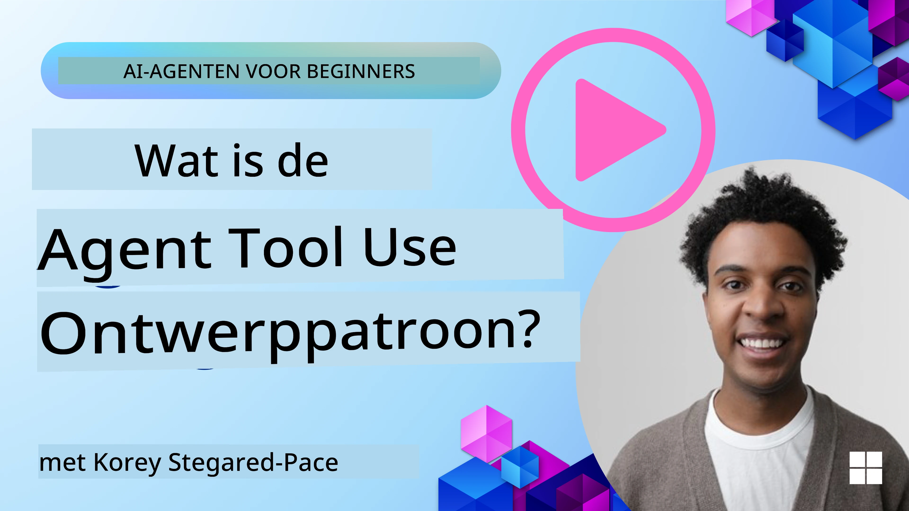
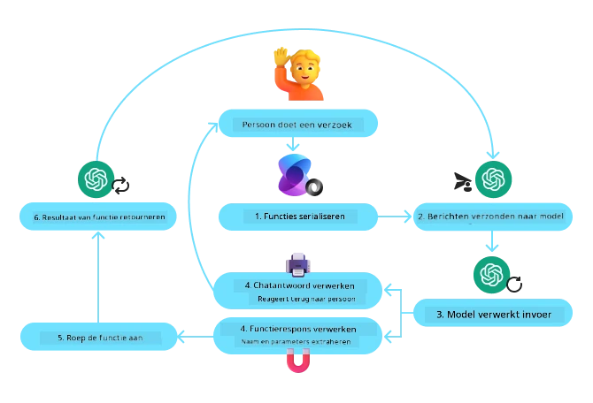
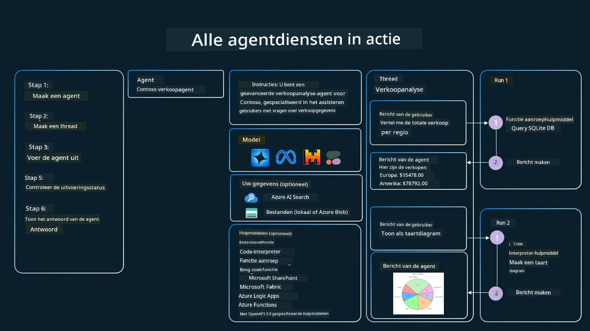

[](https://youtu.be/vieRiPRx-gI?si=cEZ8ApnT6Sus9rhn)

> _(Klik op de afbeelding hierboven om de video van deze les te bekijken)_

# Tool Use Design Pattern

Tools zijn interessant omdat ze AI-agenten in staat stellen een bredere reeks mogelijkheden te hebben. In plaats van dat de agent een beperkte set acties kan uitvoeren, kan de agent door het toevoegen van een tool nu een breed scala aan acties uitvoeren. In dit hoofdstuk bekijken we het Tool Use Design Pattern, dat beschrijft hoe AI-agenten specifieke tools kunnen gebruiken om hun doelen te bereiken.

## Introductie

In deze les proberen we de volgende vragen te beantwoorden:

- Wat is het tool use design pattern?
- Voor welke use-cases kan het toegepast worden?
- Wat zijn de elementen/bouwstenen die nodig zijn om het design pattern te implementeren?
- Wat zijn de speciale overwegingen bij het gebruik van het Tool Use Design Pattern om betrouwbare AI-agenten te bouwen?

## Leerdoelen

Na het voltooien van deze les zul je in staat zijn om:

- Het Tool Use Design Pattern en het doel ervan te definiëren.
- Use-cases te herkennen waar het Tool Use Design Pattern toepasbaar is.
- De belangrijkste bouwstenen te begrijpen die nodig zijn om het design pattern te implementeren.
- Overwegingen te herkennen voor het waarborgen van betrouwbaarheid in AI-agenten die dit design pattern gebruiken.

## Wat is het Tool Use Design Pattern?

Het **Tool Use Design Pattern** richt zich op het geven van LLM's de mogelijkheid om te interacteren met externe tools om specifieke doelen te bereiken. Tools zijn code die door een agent kan worden uitgevoerd om acties uit te voeren. Een tool kan een eenvoudige functie zijn zoals een rekenmachine, of een API-oproep naar een externe dienst zoals het opzoeken van aandelenkoersen of het weerbericht. In de context van AI-agenten zijn tools zo ontworpen dat ze door agenten kunnen worden uitgevoerd als reactie op **door het model gegenereerde functieaanroepen**.

## Voor welke use-cases kan het toegepast worden?

AI-agenten kunnen tools gebruiken om complexe taken uit te voeren, informatie op te halen of beslissingen te nemen. Het tool use design pattern wordt vaak gebruikt in scenario’s die dynamische interactie met externe systemen vereisen, zoals databases, webservices of code-interpreters. Deze mogelijkheid is nuttig voor een aantal verschillende use-cases, waaronder:

- **Dynamische informatiewinning:** Agenten kunnen externe API's of databases raadplegen om up-to-date gegevens op te halen (bijv. het raadplegen van een SQLite database voor data-analyse, ophalen van aandelenkoersen of weersinformatie).
- **Code-executie en interpretatie:** Agenten kunnen code of scripts uitvoeren om wiskundige problemen op te lossen, rapporten te genereren of simulaties uit te voeren.
- **Workflow-automatisering:** Automatiseren van repetitieve of meervoudige stappen workflows door tools te integreren zoals takenplanners, e-mailservices of datastromen.
- **Klantenservice:** Agenten kunnen interacteren met CRM-systemen, ticketplatformen of kennisbanken om gebruikersvragen op te lossen.
- **Contentcreatie en redactie:** Agenten kunnen tools inzetten zoals grammatica-checkers, tekstsamenvatters of inhoudsveiligheids-evaluators ter ondersteuning bij contentcreatie.

## Wat zijn de elementen/bouwstenen die nodig zijn om het tool use design pattern te implementeren?

Deze bouwstenen maken het mogelijk voor de AI-agent om een breed scala aan taken uit te voeren. Laten we kijken naar de belangrijkste elementen die nodig zijn om het Tool Use Design Pattern te implementeren:

- **Functie/Tool Schemas**: Gedetailleerde definities van beschikbare tools, inclusief functienaam, doel, vereiste parameters en verwachte output. Deze schemas stellen de LLM in staat te begrijpen welke tools beschikbaar zijn en hoe geldige oproepen geconstrueerd kunnen worden.

- **Logica voor het uitvoeren van functies:** Bepaalt hoe en wanneer tools worden aangeroepen op basis van de intentie van de gebruiker en de context van het gesprek. Dit kan planner-modules, routeringsmechanismen of conditionele flows omvatten die het toolgebruik dynamisch bepalen.

- **Berichtverwerkingssysteem:** Componenten die de conversatiestroom beheren tussen gebruikersinvoer, LLM-reacties, tool-aanroepen en tool-uitvoeren.

- **Tool integratiekader:** Infrastructuur die de agent verbindt met verschillende tools, of het nu eenvoudige functies of complexe externe services zijn.

- **Foutafhandeling & validatie:** Mechanismen om fouten in tooluitvoering te beheren, parameters te valideren en om te gaan met onverwachte reacties.

- **Statusbeheer:** Houdt de gesprekcontext, eerdere toolinteracties en persistente data bij om consistentie te waarborgen over meerdere gespreksrondes.

Laten we vervolgens Function/Tool Calling wat gedetailleerder bekijken.
 
### Function/Tool Calling

Functie-aanroepen zijn de primaire manier waarop we Large Language Models (LLM's) in staat stellen te interageren met tools. Je zult vaak 'Function' en 'Tool' door elkaar zien gebruikt omdat 'functies' (herbruikbare codeblokken) de 'tools' zijn die agenten gebruiken om taken uit te voeren. Om de code van een functie aan te roepen, moet een LLM het gebruikersverzoek vergelijken met de beschrijving van de functies. Hiervoor wordt een schema met de beschrijvingen van alle beschikbare functies naar de LLM gestuurd. De LLM selecteert vervolgens de meest geschikte functie voor de taak en retourneert de naam en argumenten daarvan. De geselecteerde functie wordt aangeroepen, het antwoord wordt teruggestuurd naar de LLM, die de informatie gebruikt om op het gebruikersverzoek te reageren.

Voor ontwikkelaars die functie-aanroepen voor agenten willen implementeren, is het nodig om:

1. Een LLM-model dat functie-aanroepen ondersteunt
2. Een schema met functiebeschrijvingen
3. De code voor elke beschreven functie

Laten we het voorbeeld gebruiken van het opvragen van de huidige tijd in een stad om het te illustreren:

1. **Initialiseer een LLM dat functie-aanroepen ondersteunt:**

    Niet alle modellen ondersteunen functie-aanroepen, dus het is belangrijk te controleren of jouw LLM dit wel doet.     <a href="https://learn.microsoft.com/azure/ai-services/openai/how-to/function-calling" target="_blank">Azure OpenAI</a> ondersteunt functie-aanroepen. We kunnen beginnen met het initialiseren van de OpenAI-client tegen de Azure OpenAI **Responses API** (de stabiele `/openai/v1/`-endpoint — geen `api_version` nodig). 

    ```python
    # Initialiseer de OpenAI-client voor Azure OpenAI (Responses API, v1-eindpunt)
    client = OpenAI(
        base_url=f"{os.environ['AZURE_OPENAI_ENDPOINT'].rstrip('/')}/openai/v1/",
        api_key=os.environ["AZURE_OPENAI_API_KEY"],
    )
    deployment_name = os.environ["AZURE_OPENAI_DEPLOYMENT"]
    ```

1. **Maak een Functie-schema:**

    Vervolgens definiëren we een JSON-schema dat de functienaam, een beschrijving van wat de functie doet, en de namen en beschrijvingen van de functieparameters bevat.
    We geven dit schema door aan de eerder gecreëerde client, samen met het gebruikersverzoek om de tijd in San Francisco op te vragen. Wat belangrijk is om te weten, is dat een **tool call** wordt geretourneerd, **niet** het uiteindelijke antwoord op de vraag. Zoals eerder vermeld, retourneert de LLM de naam van de door haar gekozen functie en de argumenten die worden doorgegeven.

    ```python
    # Functiebeschrijving voor het model om te lezen (Responses API vlak gereedschapsformaat)
    tools = [
        {
            "type": "function",
            "name": "get_current_time",
            "description": "Get the current time in a given location",
            "parameters": {
                "type": "object",
                "properties": {
                    "location": {
                        "type": "string",
                        "description": "The city name, e.g. San Francisco",
                    },
                },
                "required": ["location"],
            },
        }
    ]
    ```
   
    ```python
  
    # Initiële gebruikersboodschap
    messages = [{"role": "user", "content": "What's the current time in San Francisco"}]

    # Eerste API-aanroep: Vraag het model om de functie te gebruiken
    response = client.responses.create(
        model=deployment_name,
        input=messages,
        tools=tools,
        tool_choice="auto",
        store=False,
    )

    # De Responses API retourneert tool-aanroepen als function_call-items in response.output.
    # Voeg ze toe aan het gesprek zodat het model volledige context heeft bij de volgende beurt.
    messages += response.output

    print("Model's response:")
    print(response.output)
  
    ```

    ```bash
    Model's response:
    [ResponseFunctionToolCall(arguments='{"location":"San Francisco"}', call_id='call_pOsKdUlqvdyttYB67MOj434b', name='get_current_time', type='function_call')]
    ```
  
1. **De benodigde functiecode om de taak uit te voeren:**

    Nu de LLM heeft gekozen welke functie uitgevoerd moet worden, moet de code die de taak uitvoert geïmplementeerd en uitgevoerd worden.
    We kunnen de code om de huidige tijd op te halen in Python implementeren. We moeten ook code schrijven om naam en argumenten uit de response_message te extraheren om het eindresultaat te verkrijgen.

    ```python
      def get_current_time(location):
        """Get the current time for a given location"""
        print(f"get_current_time called with location: {location}")  
        location_lower = location.lower()
        
        for key, timezone in TIMEZONE_DATA.items():
            if key in location_lower:
                print(f"Timezone found for {key}")  
                current_time = datetime.now(ZoneInfo(timezone)).strftime("%I:%M %p")
                return json.dumps({
                    "location": location,
                    "current_time": current_time
                })
      
        print(f"No timezone data found for {location_lower}")  
        return json.dumps({"location": location, "current_time": "unknown"})
    ```

     ```python
    # Behandel functie-aanroepen
    tool_calls = [item for item in response.output if item.type == "function_call"]
    if tool_calls:
        for tool_call in tool_calls:
            if tool_call.name == "get_current_time":

                function_args = json.loads(tool_call.arguments)

                time_response = get_current_time(
                    location=function_args.get("location")
                )

                # Geef het gereedschapresultaat terug als een function_call_output-item
                messages.append({
                    "type": "function_call_output",
                    "call_id": tool_call.call_id,
                    "output": time_response,
                })
    else:
        print("No tool calls were made by the model.")

    # Tweede API-aanroep: Krijg de definitieve reactie van het model
    final_response = client.responses.create(
        model=deployment_name,
        input=messages,
        tools=tools,
        store=False,
    )

    return final_response.output_text
     ```

     ```bash
      get_current_time called with location: San Francisco
      Timezone found for san francisco
      The current time in San Francisco is 09:24 AM.
     ```

Function Calling ligt ten grondslag aan het merendeel, zo niet alle agent-tool gebruik design, maar het zelf implementeren kan soms uitdagend zijn.
Zoals we leerden in [Les 2](../../../02-explore-agentic-frameworks) bieden agentic frameworks vooraf gebouwde bouwstenen om tool use te implementeren.
 
## Tool Use Voorbeelden met Agentic Frameworks

Hier zijn enkele voorbeelden van hoe je het Tool Use Design Pattern kunt implementeren met verschillende agentic frameworks:

### Microsoft Agent Framework

<a href="https://learn.microsoft.com/azure/ai-services/agents/overview" target="_blank">Microsoft Agent Framework</a> is een open-source AI-framework voor het bouwen van AI-agenten. Het vereenvoudigt het proces van functieaanroepen door tools te definiëren als Python-functies met de `@tool` decorator. Het framework verzorgt de communicatie heen en weer tussen het model en jouw code. Het biedt ook toegang tot vooraf gebouwde tools zoals File Search en Code Interpreter via `FoundryChatClient`.

Het volgende diagram illustreert het proces van functie-aanroepen met het Microsoft Agent Framework:



In het Microsoft Agent Framework worden tools gedefinieerd als gedecoreerde functies. We kunnen de eerder geziene `get_current_time` functie converteren naar een tool door de `@tool`-decorator te gebruiken. Het framework serializeert automatisch de functie en parameters, waardoor het schema wordt gemaakt om naar de LLM te sturen.

```python
import os
from agent_framework import tool
from agent_framework.foundry import FoundryChatClient
from azure.identity import AzureCliCredential

@tool(approval_mode="never_require")
def get_current_time(location: str) -> str:
    """Get the current time for a given location"""
    ...

# Maak de client aan
provider = FoundryChatClient(
    project_endpoint=os.environ["AZURE_AI_PROJECT_ENDPOINT"],
    model=os.environ["AZURE_AI_MODEL_DEPLOYMENT_NAME"],
    credential=AzureCliCredential(),
)

# Maak een agent aan en voer deze uit met het hulpmiddel
agent = provider.as_agent(name="TimeAgent", instructions="Use available tools to answer questions.", tools=get_current_time)
response = await agent.run("What time is it?")
```
  
### Microsoft Foundry Agent Service

<a href="https://learn.microsoft.com/azure/ai-services/agents/overview" target="_blank">Microsoft Foundry Agent Service</a> is een nieuwer agentic framework dat is ontworpen om ontwikkelaars in staat te stellen veilig hoogwaardige, uitbreidbare AI-agenten te bouwen, te implementeren en op te schalen zonder de onderliggende compute- en opslagresources te beheren. Het is bijzonder nuttig voor enterprise-toepassingen aangezien het een volledig beheerde dienst is met beveiliging op ondernemingsniveau.

Vergeleken met ontwikkeling via de LLM API direct, biedt Microsoft Foundry Agent Service enkele voordelen, waaronder:

- Automatische tool-aanroepen – geen noodzaak om zelf een tool call te parsen, de tool aan te roepen en de respons af te handelen; dit gebeurt nu aan de serverzijde
- Veilig beheerde data – in plaats van eigen gespreksstatus te beheren, kun je vertrouwen op threads om alle benodigde informatie op te slaan
- Direct beschikbare tools – Tools die je kunt gebruiken om met je gegevensbronnen te interacteren, zoals Bing, Azure AI Search en Azure Functions.

De tools die beschikbaar zijn in Microsoft Foundry Agent Service kunnen worden onderverdeeld in twee categorieën:

1. Kennis-Tools:
    - <a href="https://learn.microsoft.com/azure/ai-services/agents/how-to/tools/bing-grounding?tabs=python&pivots=overview" target="_blank">Grounding met Bing Search</a>
    - <a href="https://learn.microsoft.com/azure/ai-services/agents/how-to/tools/file-search?tabs=python&pivots=overview" target="_blank">Bestand zoeken</a>
    - <a href="https://learn.microsoft.com/azure/ai-services/agents/how-to/tools/azure-ai-search?tabs=azurecli%2Cpython&pivots=overview-azure-ai-search" target="_blank">Azure AI Search</a>

2. Actie-Tools:
    - <a href="https://learn.microsoft.com/azure/ai-services/agents/how-to/tools/function-calling?tabs=python&pivots=overview" target="_blank">Functie-aanroepen</a>
    - <a href="https://learn.microsoft.com/azure/ai-services/agents/how-to/tools/code-interpreter?tabs=python&pivots=overview" target="_blank">Code Interpreter</a>
    - <a href="https://learn.microsoft.com/azure/ai-services/agents/how-to/tools/openapi-spec?tabs=python&pivots=overview" target="_blank">OpenAPI gedefinieerde tools</a>
    - <a href="https://learn.microsoft.com/azure/ai-services/agents/how-to/tools/azure-functions?pivots=overview" target="_blank">Azure Functions</a>

De Agent Service stelt ons in staat deze tools gezamenlijk te gebruiken als een `toolset`. Tevens maakt het gebruik van `threads` die de geschiedenis van berichten uit een bepaald gesprek bijhouden.

Stel je voor dat je een salesagent bent bij een bedrijf genaamd Contoso. Je wilt een conversatie-agent ontwikkelen die vragen over jouw verkoopdata kan beantwoorden.

De volgende afbeelding illustreert hoe je met Microsoft Foundry Agent Service jouw verkoopdata zou kunnen analyseren:



Om deze tools met de service te gebruiken kunnen we een client creëren en een tool of toolset definiëren. Om dit praktisch te implementeren kunnen we de volgende Python-code gebruiken. De LLM kan dan de toolset beoordelen en beslissen of de door een gebruiker gemaakte functie `fetch_sales_data_using_sqlite_query` of de vooraf gebouwde Code Interpreter wordt gebruikt, afhankelijk van het gebruikersverzoek.

```python 
import os
from azure.ai.projects import AIProjectClient
from azure.identity import DefaultAzureCredential
from fetch_sales_data_functions import fetch_sales_data_using_sqlite_query # fetch_sales_data_using_sqlite_query functie die te vinden is in een fetch_sales_data_functions.py bestand.
from azure.ai.projects.models import ToolSet, FunctionTool, CodeInterpreterTool

project_client = AIProjectClient.from_connection_string(
    credential=DefaultAzureCredential(),
    conn_str=os.environ["PROJECT_CONNECTION_STRING"],
)

# Initialiseer gereedschapsset
toolset = ToolSet()

# Initialiseer functie aanroepagent met de fetch_sales_data_using_sqlite_query functie en voeg deze toe aan de gereedschapsset
fetch_data_function = FunctionTool(fetch_sales_data_using_sqlite_query)
toolset.add(fetch_data_function)

# Initialiseer Code Interpreter gereedschap en voeg het toe aan de gereedschapsset.
code_interpreter = CodeInterpreterTool()toolset.add(code_interpreter)

agent = project_client.agents.create_agent(
    model="gpt-4o-mini", name="my-agent", instructions="You are helpful agent", 
    toolset=toolset
)
```

## Wat zijn de speciale overwegingen bij het gebruik van het Tool Use Design Pattern om betrouwbare AI-agenten te bouwen?

Een veelvoorkomende zorg bij door LLM's dynamisch gegenereerde SQL is veiligheid, met name het risico op SQL-injectie of kwaadaardige acties, zoals het verwijderen of manipuleren van de database. Hoewel deze zorgen terecht zijn, kunnen ze effectief worden beperkt door de toegangsmachtigingen van de database correct te configureren. Voor de meeste databases betekent dit het configureren van de database als alleen-lezen. Voor databaseservices zoals PostgreSQL of Azure SQL moet de app een read-only (SELECT) rol krijgen toegewezen.

Het uitvoeren van de app in een veilige omgeving verhoogt de bescherming verder. In enterprise-scenario's worden gegevens doorgaans geëxtraheerd en getransformeerd uit operationele systemen naar een read-only database of datawarehouse met een gebruikersvriendelijk schema. Deze aanpak zorgt ervoor dat de data veilig is, geoptimaliseerd is voor prestaties en toegankelijkheid, en dat de app beperkte, alleen-lezen toegang heeft.

## Voorbeeldcodes

- Python: [Agent Framework](./code_samples/04-python-agent-framework.ipynb)
- .NET: [Agent Framework](./code_samples/04-dotnet-agent-framework.md)

## Meer Vragen over het Tool Use Design Pattern?

Doe mee met de [Microsoft Foundry Discord](https://discord.com/invite/ATgtXmAS5D) om andere leerlingen te ontmoeten, deel te nemen aan office hours en je vragen over AI-agenten beantwoord te krijgen.

## Aanvullende bronnen

- <a href="https://microsoft.github.io/build-your-first-agent-with-azure-ai-agent-service-workshop/" target="_blank">Azure AI Agents Service Workshop</a>
- <a href="https://github.com/Azure-Samples/contoso-creative-writer/tree/main/docs/workshop" target="_blank">Contoso Creative Writer Multi-Agent Workshop</a>
- <a href="https://learn.microsoft.com/azure/ai-services/agents/overview" target="_blank">Microsoft Agent Framework Overzicht</a>


## Vorige Les

[Begrip van Agentic Design Patterns](../03-agentic-design-patterns/README.md)

## Volgende Les

[Agentic RAG](../05-agentic-rag/README.md)

---

<!-- CO-OP TRANSLATOR DISCLAIMER START -->
**Disclaimer**:
Dit document is vertaald met behulp van de AI vertaaldienst [Co-op Translator](https://github.com/Azure/co-op-translator). Hoewel we streven naar nauwkeurigheid, dient u er rekening mee te houden dat geautomatiseerde vertalingen fouten of onnauwkeurigheden kunnen bevatten. Het originele document in de oorspronkelijke taal moet worden beschouwd als de gezaghebbende bron. Voor kritieke informatie wordt professionele menselijke vertaling aanbevolen. Wij zijn niet aansprakelijk voor eventuele misverstanden of verkeerde interpretaties die voortvloeien uit het gebruik van deze vertaling.
<!-- CO-OP TRANSLATOR DISCLAIMER END -->