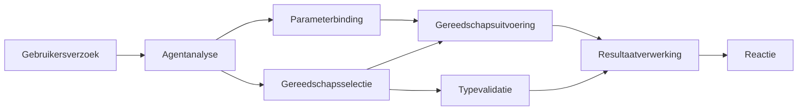

# 🛠️ Geavanceerd gebruik van tools met Azure OpenAI (Responses API) (.NET)

## 📋 Leerdoelen

Dit notitieboek demonstreert bedrijfsniveau-integratiepatronen voor tools met het Microsoft Agent Framework in .NET met Azure OpenAI (Responses API). Je leert geavanceerde agenten bouwen met meerdere gespecialiseerde tools, waarbij je gebruikmaakt van de sterke typisering van C# en de enterprise-functies van .NET.

### Geavanceerde toolmogelijkheden die je beheerst

- 🔧 **Multi-Tool Architectuur**: Agenten bouwen met meerdere gespecialiseerde mogelijkheden
- 🎯 **Type-veilige tooluitvoering**: Gebruik maken van compile-time validatie in C#
- 📊 **Enterprise-toolpatronen**: Productieklaar ontwerp en foutafhandeling van tools
- 🔗 **Toolcompositie**: Tools combineren voor complexe zakelijke workflows

## 🎯 Voordelen van .NET-toolarchitectuur

### Enterprise-toolkenmerken

- **Compile-time validatie**: Sterke typisering garandeert correctheid van toolparameters
- **Dependency Injection**: Integratie met IoC-container voor toolbeheer
- **Async/Await-patronen**: Niet-blokkerende tooluitvoering met correct beheer van bronnen
- **Gestructureerde logging**: Ingebouwde loggingintegratie voor monitoring van tooluitvoering

### Productieklaar patronen

- **Exceptieafhandeling**: Uitgebreid foutbeheer met getypte uitzonderingen
- **Bronbeheer**: Correcte disposal-patronen en geheugenbeheer
- **Prestatiemonitoring**: Ingebouwde metrics en prestatiecounters
- **Configuratiebeheer**: Type-veilige configuratie met validatie

## 🔧 Technische architectuur

### Kerncomponenten van .NET-tools

- **Microsoft.Extensions.AI**: Geünificeerde tool-abstraction laag
- **Microsoft.Agents.AI**: Enterprise-niveau toolorchestratie
- **Azure OpenAI (Responses API)**: Hoge-performance API-client met connection pooling

### Tooluitvoerpipeline



## 🛠️ Toolcategorieën & patronen

### 1. **Dataverwerkingstools**

- **Inputvalidatie**: Sterke typisering met data-annotaties
- **Transformatieoperaties**: Type-veilige dataconversie en formattering
- **Businesslogica**: Domeinspecifieke berekeningen en analysetools
- **Outputformatteren**: Gestructureerde antwoordgeneratie

### 2. **Integratietools**

- **API-connectoren**: RESTful service-integratie met HttpClient
- **Database-tools**: Entity Framework-integratie voor data toegang
- **Bestandoperaties**: Veilige bestandssysteemoperaties met validatie
- **Externe services**: Patronen voor integratie van externe diensten

### 3. **Utility-tools**

- **Tekstverwerking**: Stringmanipulatie en formatteringshulpmiddelen
- **Datum-/tijdoperaties**: Cultuurbewuste datum-/tijdberekeningen
- **Wiskundige tools**: Precisieberekeningen en statistische operaties
- **Validatietools**: Validering van zakelijke regels en gegevensverificatie

Klaar om bedrijfsniveau-agenten te bouwen met krachtige, type-veilige toolmogelijkheden in .NET? Laten we enkele professionele oplossingen ontwerpen! 🏢⚡

## 🚀 Aan de slag

### Vereisten

- [.NET 10 SDK](https://dotnet.microsoft.com/download/dotnet/10.0) of hoger
- Een [Azure-abonnement](https://azure.microsoft.com/free/) met een Azure OpenAI-resource en een model-implementatie
- De [Azure CLI](https://learn.microsoft.com/cli/azure/install-azure-cli) — inloggen met `az login`

### Vereiste omgevingsvariabelen

```bash
# zsh/bash
export AZURE_OPENAI_ENDPOINT=https://<your-resource>.openai.azure.com
export AZURE_OPENAI_DEPLOYMENT=gpt-4o-mini
# Meld je dan aan zodat AzureCliCredential een token kan verkrijgen
az login
```

```powershell
# PowerShell
$env:AZURE_OPENAI_ENDPOINT = "https://<your-resource>.openai.azure.com"
$env:AZURE_OPENAI_DEPLOYMENT = "gpt-4o-mini"
# Meld u vervolgens aan zodat AzureCliCredential een token kan verkrijgen
az login
```

### Voorbeeldcode

Om het codevoorbeeld uit te voeren,

```bash
# zsh/bash
chmod +x ./04-dotnet-agent-framework.cs
./04-dotnet-agent-framework.cs
```

Of met de dotnet CLI:

```bash
dotnet run ./04-dotnet-agent-framework.cs
```

Zie [`04-dotnet-agent-framework.cs`](../../../../04-tool-use/code_samples/04-dotnet-agent-framework.cs) voor de volledige code.

```csharp
#!/usr/bin/dotnet run

#:package Microsoft.Extensions.AI@10.*
#:package Microsoft.Agents.AI.OpenAI@1.*-*
#:package Azure.AI.OpenAI@2.1.0
#:package Azure.Identity@1.13.1

using System.ComponentModel;

using Microsoft.Agents.AI;
using Microsoft.Extensions.AI;

using Azure.AI.OpenAI;
using Azure.Identity;

// Tool Function: Random Destination Generator
// This static method will be available to the agent as a callable tool
// The [Description] attribute helps the AI understand when to use this function
// This demonstrates how to create custom tools for AI agents
[Description("Provides a random vacation destination.")]
static string GetRandomDestination()
{
    // List of popular vacation destinations around the world
    // The agent will randomly select from these options
    var destinations = new List<string>
    {
        "Paris, France",
        "Tokyo, Japan",
        "New York City, USA",
        "Sydney, Australia",
        "Rome, Italy",
        "Barcelona, Spain",
        "Cape Town, South Africa",
        "Rio de Janeiro, Brazil",
        "Bangkok, Thailand",
        "Vancouver, Canada"
    };

    // Generate random index and return selected destination
    // Uses System.Random for simple random selection
    var random = new Random();
    int index = random.Next(destinations.Count);
    return destinations[index];
}

// Azure OpenAI with the Responses API (stable v1 endpoint). Sign in with `az login`.
var azureEndpoint = Environment.GetEnvironmentVariable("AZURE_OPENAI_ENDPOINT")
    ?? throw new InvalidOperationException("AZURE_OPENAI_ENDPOINT is not set.");
var deployment = Environment.GetEnvironmentVariable("AZURE_OPENAI_DEPLOYMENT") ?? "gpt-4o-mini";

var azureClient = new AzureOpenAIClient(new Uri(azureEndpoint), new AzureCliCredential());

// Define Agent Identity and Comprehensive Instructions
// Agent name for identification and logging purposes
var AGENT_NAME = "TravelAgent";

// Detailed instructions that define the agent's personality, capabilities, and behavior
// This system prompt shapes how the agent responds and interacts with users
var AGENT_INSTRUCTIONS = """
You are a helpful AI Agent that can help plan vacations for customers.

Important: When users specify a destination, always plan for that location. Only suggest random destinations when the user hasn't specified a preference.

When the conversation begins, introduce yourself with this message:
"Hello! I'm your TravelAgent assistant. I can help plan vacations and suggest interesting destinations for you. Here are some things you can ask me:
1. Plan a day trip to a specific location
2. Suggest a random vacation destination
3. Find destinations with specific features (beaches, mountains, historical sites, etc.)
4. Plan an alternative trip if you don't like my first suggestion

What kind of trip would you like me to help you plan today?"

Always prioritize user preferences. If they mention a specific destination like "Bali" or "Paris," focus your planning on that location rather than suggesting alternatives.
""";

// Create AI Agent with Advanced Travel Planning Capabilities
// Get the Responses client for the deployment and create the AI agent
// Configure agent with name, detailed instructions, and available tools
// This demonstrates the .NET agent creation pattern with full configuration
AIAgent agent = azureClient
    .GetOpenAIResponseClient(deployment)
    .CreateAIAgent(
        name: AGENT_NAME,
        instructions: AGENT_INSTRUCTIONS,
        tools: [AIFunctionFactory.Create(GetRandomDestination)]
    );

// Create New Conversation Thread for Context Management
// Initialize a new conversation thread to maintain context across multiple interactions
// Threads enable the agent to remember previous exchanges and maintain conversational state
// This is essential for multi-turn conversations and contextual understanding
AgentThread thread = agent.GetNewThread();

// Execute Agent: First Travel Planning Request
// Run the agent with an initial request that will likely trigger the random destination tool
// The agent will analyze the request, use the GetRandomDestination tool, and create an itinerary
// Using the thread parameter maintains conversation context for subsequent interactions
await foreach (var update in agent.RunStreamingAsync("Plan me a day trip", thread))
{
    await Task.Delay(10);
    Console.Write(update);
}

Console.WriteLine();

// Execute Agent: Follow-up Request with Context Awareness
// Demonstrate contextual conversation by referencing the previous response
// The agent remembers the previous destination suggestion and will provide an alternative
// This showcases the power of conversation threads and contextual understanding in .NET agents
await foreach (var update in agent.RunStreamingAsync("I don't like that destination. Plan me another vacation.", thread))
{
    await Task.Delay(10);
    Console.Write(update);
}
```

---

<!-- CO-OP TRANSLATOR DISCLAIMER START -->
**Disclaimer**:
Dit document is vertaald met behulp van de AI vertaaldienst [Co-op Translator](https://github.com/Azure/co-op-translator). Hoewel we streven naar nauwkeurigheid, dient u er rekening mee te houden dat geautomatiseerde vertalingen fouten of onnauwkeurigheden kunnen bevatten. Het originele document in de oorspronkelijke taal moet worden beschouwd als de gezaghebbende bron. Voor kritieke informatie wordt professionele menselijke vertaling aanbevolen. Wij zijn niet aansprakelijk voor eventuele misverstanden of verkeerde interpretaties die voortvloeien uit het gebruik van deze vertaling.
<!-- CO-OP TRANSLATOR DISCLAIMER END -->