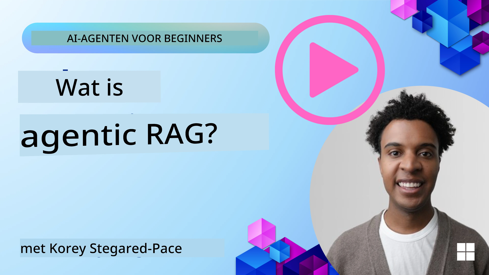
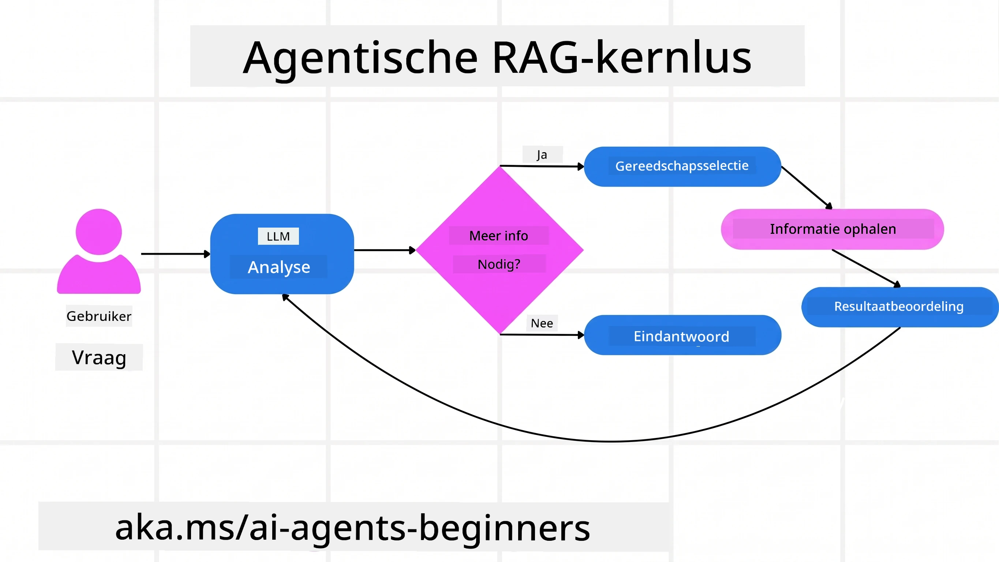
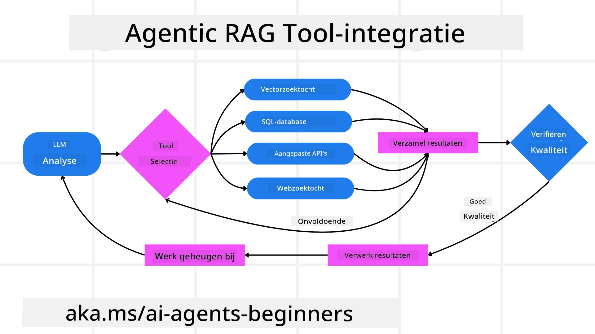
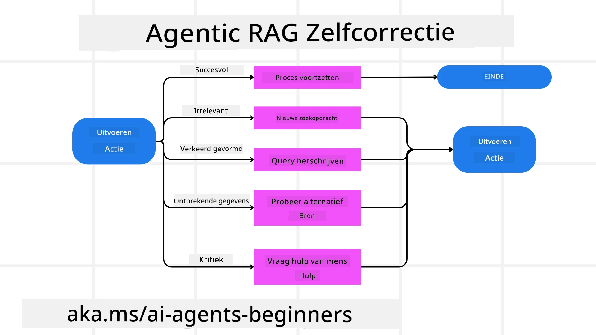
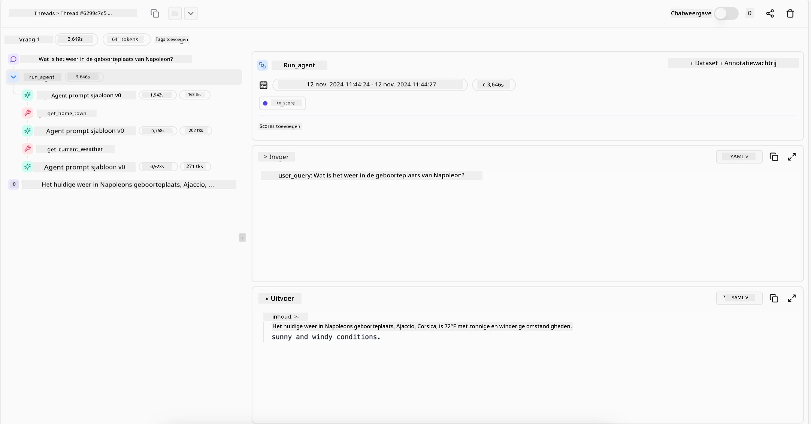

> _(Klik op de afbeelding hierboven om de video van deze les te bekijken)_

# Agentic RAG

Deze les geeft een uitgebreid overzicht van Agentic Retrieval-Augmented Generation (Agentic RAG), een opkomend AI-paradigma waarbij grote taalmodellen (LLM's) autonoom hun volgende stappen plannen terwijl ze informatie uit externe bronnen halen. In tegenstelling tot statische retrieval-then-read patronen omvat Agentic RAG iteratieve oproepen naar de LLM, afgewisseld met tool- of functieoproepen en gestructureerde outputs. Het systeem evalueert de resultaten, verfijnt zoekopdrachten, roept indien nodig extra tools op en zet deze cyclus voort totdat een bevredigende oplossing is bereikt.

## Introductie

Deze les behandelt

- **Begrijp Agentic RAG:** Leer over het opkomende paradigma in AI waarbij grote taalmodellen (LLM's) autonoom hun volgende stappen plannen terwijl ze informatie uit externe databronnen halen.
- **Begrijp Iteratieve Maker-Checker Stijl:** Begrijp de lus van iteratieve oproepen naar de LLM, afgewisseld met tool- of functieoproepen en gestructureerde outputs, ontworpen om juistheid te verbeteren en foutieve zoekopdrachten te verwerken.
- **Verken Praktische Toepassingen:** Identificeer scenario's waar Agentic RAG uitblinkt, zoals correctheid-voorop omgevingen, complexe database-interacties en uitgebreide workflows.

## Leerdoelen

Na het voltooien van deze les weet je hoe je/begrijp je:

- **Agentic RAG Begrijpen:** Leer over het opkomende paradigma in AI waarbij grote taalmodellen (LLM's) autonoom hun volgende stappen plannen terwijl ze informatie uit externe databronnen halen.
- **Iteratieve Maker-Checker Stijl:** Begrijp het concept van een lus van iteratieve oproepen naar de LLM, afgewisseld met tool- of functieoproepen en gestructureerde outputs, ontworpen om juistheid te verbeteren en foutieve zoekopdrachten te verwerken.
- **Het Redeneringsproces Bezitten:** Begrijp het vermogen van het systeem om zijn redeneringsproces te bezitten, beslissingen te nemen over hoe problemen aan te pakken zonder te vertrouwen op vooraf gedefinieerde paden.
- **Workflow:** Begrijp hoe een agentisch model zelfstandig besluit markttrendrapporten op te halen, concurrentiegegevens te identificeren, interne verkoopstatistieken te correleren, bevindingen te synthetiseren en de strategie te evalueren.
- **Iteratieve Lussen, Tool-integratie en Geheugen:** Leer over het vertrouwen van het systeem op een gelopen interactiepatroon, waarbij staat en geheugen over stappen worden behouden om repetitieve lussen te vermijden en geïnformeerde beslissingen te nemen.
- **Omgaan met Faalmodi en Zelfcorrectie:** Verken de robuuste zelfcorrectiemechanismen van het systeem, inclusief itereren en opnieuw opvragen, gebruik van diagnostische tools en terugvallen op menselijke toezicht.
- **Beperkingen van Agency:** Begrijp de beperkingen van Agentic RAG, met de nadruk op domeinspecifieke autonomie, afhankelijkheid van infrastructuur en respect voor bewaardoelen.
- **Praktische Use Cases en Waarde:** Identificeer scenario's waar Agentic RAG uitblinkt, zoals correctheid-voorop omgevingen, complexe database-interacties en uitgebreide workflows.
- **Bestuur, Transparantie en Vertrouwen:** Leer over het belang van bestuur en transparantie, inclusief uitlegbaar redeneren, biascontrole en menselijk toezicht.

## Wat is Agentic RAG?

Agentic Retrieval-Augmented Generation (Agentic RAG) is een opkomend AI-paradigma waarbij grote taalmodellen (LLM's) autonoom hun volgende stappen plannen terwijl ze informatie halen uit externe bronnen. In tegenstelling tot statische retrieval-then-read patronen omvat Agentic RAG iteratieve oproepen naar de LLM, afgewisseld met tool- of functieoproepen en gestructureerde outputs. Het systeem evalueert resultaten, verfijnt zoekopdrachten, roept extra tools op indien nodig en zet deze cyclus voort totdat een bevredigende oplossing is bereikt. Deze iteratieve “maker-checker” stijl verbetert juistheid, verwerkt foutieve zoekopdrachten en verzekert kwalitatief hoogstaande resultaten.

Het systeem bezit actief zijn redeneringsproces, herschrijft mislukte zoekopdrachten, kiest verschillende retrieval-methoden en integreert meerdere tools—zoals vectorzoekopdrachten in Azure AI Search, SQL-databases of aangepaste API's—voordat het zijn antwoord finaliseert. Het onderscheidende kenmerk van een agentisch systeem is het vermogen om zijn redeneringsproces te bezitten. Traditionele RAG-implementaties vertrouwen op vooraf gedefinieerde paden, maar een agentisch systeem bepaalt autonoom de volgorde van stappen op basis van de kwaliteit van de gevonden informatie.

## Definitie van Agentic Retrieval-Augmented Generation (Agentic RAG)

Agentic Retrieval-Augmented Generation (Agentic RAG) is een opkomend paradigma in AI-ontwikkeling waarbij LLM's niet alleen informatie halen uit externe databronnen, maar ook autonoom hun volgende stappen plannen. In tegenstelling tot statische retrieval-then-read patronen of zorgvuldig gescripte promptreeksen, omvat Agentic RAG een lus van iteratieve oproepen naar de LLM, afgewisseld met tool- of functieoproepen en gestructureerde outputs. Bij elke stap evalueert het systeem de verkregen resultaten, beslist of het zijn zoekopdrachten moet verfijnen, roept extra tools op indien nodig en gaat deze cyclus door totdat het een bevredigende oplossing bereikt.

Deze iteratieve “maker-checker” werkwijze is ontworpen om juistheid te verbeteren, foutieve zoekopdrachten naar gestructureerde databases (bijv. NL2SQL) te verwerken en gebalanceerde, kwalitatief hoogwaardige resultaten te garanderen. In plaats van volledig te vertrouwen op zorgvuldig ontworpen promptketens, bezit het systeem actief zijn redeneringsproces. Het kan zoekopdrachten die mislukken herschrijven, verschillende retrieval-methoden kiezen en meerdere tools integreren—zoals vectorzoekopdrachten in Azure AI Search, SQL-databases of aangepaste API's—voordat het zijn antwoord finaliseert. Dit elimineert de noodzaak voor te complexe orkestratiekaders. In plaats daarvan kan een relatief eenvoudige lus van “LLM-oproep → toolgebruik → LLM-oproep → …” geavanceerde en goed onderbouwde outputs opleveren.

## Het Redeneringsproces Bezitten

Het onderscheidende kenmerk dat een systeem “agentisch” maakt, is het vermogen om zijn redeneringsproces te bezitten. Traditionele RAG-implementaties zijn vaak afhankelijk van dat mensen een pad voor het model vooraf definiëren: een chain-of-thought die aangeeft wat en wanneer opgehaald moet worden.
Maar als een systeem echt agentisch is, bepaalt het intern hoe het het probleem aanpakt. Het voert niet alleen een script uit; het bepaalt autonoom de volgorde van stappen op basis van de kwaliteit van de gevonden informatie.
Bijvoorbeeld, als het wordt gevraagd een productlanceringsstrategie te creëren, vertrouwt het niet alleen op een prompt die de volledige onderzoeks- en besluitvormingsworkflow beschrijft. In plaats daarvan besluit het agentische model zelfstandig om:

1. Huidige markttrendrapporten op te halen met Bing Web Grounding
2. Relevante concurrentiegegevens te identificeren met Azure AI Search.
3. Historische interne verkoopstatistieken te correleren met Azure SQL Database.
4. De bevindingen samen te voegen tot een samenhangende strategie, gecoördineerd via Azure OpenAI Service.
5. De strategie te evalueren op hiaten of inconsistenties, waarna indien nodig een nieuwe ronde van retrieval volgt.
Al deze stappen—zoekopdrachten verfijnen, bronnen kiezen, itereren totdat het “tevreden” is met het antwoord—worden door het model beslist, niet vooraf gescript door een mens.

## Iteratieve Lussen, Tool-integratie en Geheugen

Een agentisch systeem vertrouwt op een lus-gebaseerd interactiepatroon:

- **Eerste Oproep:** Het doel van de gebruiker (oftewel gebruikersprompt) wordt aan de LLM gepresenteerd.
- **Tooloproep:** Als het model ontbrekende informatie of onduidelijke instructies opmerkt, kiest het een tool of retrieval-methode—zoals een vector database query (bijv. Azure AI Search Hybrid search over private data) of een gestructureerde SQL-oproep—om meer context te verzamelen.
- **Beoordeling & Verfijning:** Nadat de teruggegeven data is bekeken, beslist het model of de informatie voldoende is. Zo niet, dan verfijnt het de zoekopdracht, probeert een andere tool of past zijn aanpak aan.
- **Herhaling Tottevredenheid:** Deze cyclus gaat door totdat het model bepaalt dat het genoeg duidelijkheid en bewijs heeft om een definitief, goed doordacht antwoord te geven.
- **Geheugen & Status:** Omdat het systeem staat en geheugen over stappen behoudt, kan het eerdere pogingen en hun resultaten herinneren, repetitieve lussen vermijden en beter geïnformeerde beslissingen nemen tijdens het proces.

Na verloop van tijd creëert dit een gevoel van geleidelijke verdieping, waardoor het model complexe, meerstaps taken kan navigeren zonder dat een mens constant hoeft in te grijpen of de prompt aan te passen.

## Omgaan met Faalmodi en Zelfcorrectie

De autonomie van Agentic RAG omvat ook robuuste zelfcorrectiemechanismen. Wanneer het systeem op een doodlopende weg komt—zoals het ophalen van irrelevante documenten of foutieve zoekopdrachten—kan het:

- **Itereren en Opnieuw Opvragen:** In plaats van lage-waarde antwoorden terug te geven, probeert het model nieuwe zoekstrategieën, herschrijft database-queries of bekijkt alternatieve datasets.
- **Gebruik van Diagnostische Tools:** Het systeem kan extra functies inschakelen die helpen om zijn redeneringsstappen te debuggen of de juistheid van opgehaalde data te bevestigen. Tools zoals Azure AI Tracing zijn belangrijk voor robuuste observatie en monitoring.
- **Terugvallen op Menselijk Toezicht:** Voor scenario's met hoge impact of herhaald falen kan het model onzekerheid signaleren en om menselijke begeleiding vragen. Zodra de mens corrigerende feedback geeft, kan het model die les meenemen voor toekomstige acties.

Deze iteratieve en dynamische aanpak stelt het model in staat continu te verbeteren, waardoor het niet slechts een eenmalig systeem is, maar een dat leert van fouten binnen een gegeven sessie.

## Grenzen van Agency

Ondanks zijn autonomie binnen een taak, is Agentic RAG niet vergelijkbaar met Artificial General Intelligence. Zijn “agentische” capaciteiten zijn beperkt tot de tools, databronnen en beleidsregels die door menselijke ontwikkelaars worden geleverd. Het kan zijn eigen tools niet uitvinden of buiten de gedefinieerde domeingrenzen treden. Het blinkt juist uit in het dynamisch orkestreren van de beschikbare middelen.
Belangrijke verschillen met meer geavanceerde AI-vormen zijn:

1. **Domeinspecifieke Autonomie:** Agentic RAG-systemen richten zich op het bereiken van door de gebruiker gedefinieerde doelen binnen een bekend domein, waarbij strategieën zoals zoekopdrachten herschrijven of toolselectie worden ingezet om resultaten te verbeteren.
2. **Afhankelijk van Infrastructuur:** De capaciteiten van het systeem hangen af van de tools en data die ontwikkelaars integreren. Het kan deze grenzen niet overschrijden zonder menselijke tussenkomst.
3. **Respect voor Bewaardoelen:** Ethische richtlijnen, compliance regels en zakelijke beleidslijnen blijven zeer belangrijk. De vrijheid van de agent wordt altijd beperkt door veiligheidsmaatregelen en toezichtmechanismen (hopelijk?).

## Praktische Use Cases en Waarde

Agentic RAG blinkt uit in scenario's die iteratieve verfijning en precisie vereisen:

1. **Correctheid-Eerst Omgevingen:** Bij compliance controles, regelgevende analyse of juridisch onderzoek kan het agentische model feiten herhaaldelijk verifiëren, meerdere bronnen raadplegen en zoekopdrachten herschrijven totdat het een grondig gecontroleerd antwoord geeft.
2. **Complexe Database-Interactie:** Bij gestructureerde data waar zoekopdrachten vaak kunnen falen of moeten worden aangepast, kan het systeem zelfstandig zijn zoekopdrachten verfijnen met Azure SQL of Microsoft Fabric OneLake, zodat het eindresultaat aansluit bij de intentie van de gebruiker.
3. **Uitgebreide Workflows:** Langdurige sessies kunnen evolueren naarmate nieuwe informatie beschikbaar komt. Agentic RAG kan continu nieuwe data integreren en strategieën aanpassen naarmate het meer over het probleemgebied leert.

## Bestuur, Transparantie en Vertrouwen

Naarmate deze systemen autonomer worden in hun redenering, worden bestuur en transparantie cruciaal:

- **Uitlegbaar Redeneren:** Het model kan een audit trail bieden van de zoekopdrachten die het deed, de geraadpleegde bronnen en de redeneringsstappen die het nam om tot zijn conclusie te komen. Tools zoals Azure AI Content Safety en Azure AI Tracing / GenAIOps helpen transparantie te behouden en risico’s te mitigeren.
- **Biascontrole en Gebalanceerde Retrieval:** Ontwikkelaars kunnen retrievalstrategieën afstemmen om te zorgen dat gebalanceerde, representatieve databronnen worden beschouwd, en outputs regelmatig beoordelen om bias of scheve patronen te detecteren met behulp van aangepaste modellen voor geavanceerde datawetenschapsorganisaties via Azure Machine Learning.
- **Menselijk Toezicht en Compliance:** Voor gevoelige taken blijft menselijke review essentieel. Agentic RAG vervangt menselijke beoordeling in beslissingen met hoge impact niet—het versterkt die juist door grondiger gecontroleerde opties te leveren.

Het hebben van tools die een duidelijke actieregistratie bieden is essentieel. Zonder deze kan het debuggen van een mehrstapsproces erg moeilijk zijn. Zie het volgende voorbeeld van Literal AI (het bedrijf achter Chainlit) voor een Agent run:

## Conclusie

Agentic RAG vertegenwoordigt een natuurlijke evolutie in hoe AI-systemen complexe, data-intensieve taken aanpakken. Door het adopteren van een gelaste interactiepatroon, autonoom selecteren van tools en verfijnen van zoekopdrachten tot een kwalitatief hoogstand resultaat is bereikt, gaat het systeem verder dan statisch prompts volgen naar een meer adaptieve, contextbewuste beslisser. Hoewel het nog steeds begrensd is door menselijk gedefinieerde infrastructuren en ethische richtlijnen, maken deze agentische capaciteiten rijkere, dynamischere en uiteindelijk nuttigere AI-interacties mogelijk voor zowel ondernemingen als eindgebruikers.

### Nog meer vragen over Agentic RAG?

Sluit je aan bij de [Microsoft Foundry Discord](https://discord.com/invite/ATgtXmAS5D) om andere leerlingen te ontmoeten, kantooruren bij te wonen en je AI Agents vragen beantwoord te krijgen.

## Aanvullende Bronnen

- <a href="https://learn.microsoft.com/training/modules/use-own-data-azure-openai" target="_blank">Implementeer Retrieval Augmented Generation (RAG) met Azure OpenAI Service: Leer hoe je eigen data te gebruiken met de Azure OpenAI Service. Deze Microsoft Learn module biedt een uitgebreide gids over het implementeren van RAG</a>
- <a href="https://learn.microsoft.com/azure/ai-studio/concepts/evaluation-approach-gen-ai" target="_blank">Evaluatie van generatieve AI-toepassingen met Microsoft Foundry: Dit artikel behandelt de evaluatie en vergelijking van modellen op publiek beschikbare datasets, inclusief Agentic AI-toepassingen en RAG-architecturen</a>
- <a href="https://weaviate.io/blog/what-is-agentic-rag" target="_blank">Wat is Agentic RAG | Weaviate</a>
- <a href="https://ragaboutit.com/agentic-rag-a-complete-guide-to-agent-based-retrieval-augmented-generation/" target="_blank">Agentic RAG: Een Complete Gids voor Agent-Based Retrieval Augmented Generation – Nieuws van generation RAG</a>

- <a href="https://huggingface.co/learn/cookbook/agent_rag" target="_blank">Agentic RAG: versnel je RAG met queryherschrijving en zelf-query! Hugging Face Open-Source AI Cookbook</a>
- <a href="https://youtu.be/aQ4yQXeB1Ss?si=2HUqBzHoeB5tR04U" target="_blank">Agentische lagen toevoegen aan RAG</a>
- <a href="https://www.youtube.com/watch?v=zeAyuLc_f3Q&t=244s" target="_blank">De toekomst van kennisassistenten: Jerry Liu</a>
- <a href="https://www.youtube.com/watch?v=AOSjiXP1jmQ" target="_blank">Hoe bouw je agentische RAG-systemen</a>
- <a href="https://ignite.microsoft.com/sessions/BRK102?source=sessions" target="_blank">Gebruik van Microsoft Foundry Agent Service om je AI-agenten op te schalen</a>

### Academische Papers

- <a href="https://arxiv.org/abs/2303.17651" target="_blank">2303.17651 Self-Refine: Iteratieve verfijning met zelf-feedback</a>
- <a href="https://arxiv.org/abs/2303.11366" target="_blank">2303.11366 Reflexion: Taalagenten met verbale versterkende leerprocessen</a>
- <a href="https://arxiv.org/abs/2305.11738" target="_blank">2305.11738 CRITIC: Grote taalmodellen kunnen zichzelf corrigeren met tool-geïntegreerde kritiek</a>
- <a href="https://arxiv.org/abs/2501.09136" target="_blank">2501.09136 Agentic Retrieval-Augmented Generation: Een overzicht van Agentic RAG</a>

## Vorige Les

[Ontwerppatroon voor gereedschapsgebruik](../04-tool-use/README.md)

## Volgende Les

[Betrouwbare AI-agenten bouwen](../06-building-trustworthy-agents/README.md)

---

<!-- CO-OP TRANSLATOR DISCLAIMER START -->
**Disclaimer**:
Dit document is vertaald met behulp van de AI vertaaldienst [Co-op Translator](https://github.com/Azure/co-op-translator). Hoewel we streven naar nauwkeurigheid, dient u er rekening mee te houden dat geautomatiseerde vertalingen fouten of onnauwkeurigheden kunnen bevatten. Het originele document in de oorspronkelijke taal moet worden beschouwd als de gezaghebbende bron. Voor kritieke informatie wordt professionele menselijke vertaling aanbevolen. Wij zijn niet aansprakelijk voor eventuele misverstanden of verkeerde interpretaties die voortvloeien uit het gebruik van deze vertaling.
<!-- CO-OP TRANSLATOR DISCLAIMER END -->