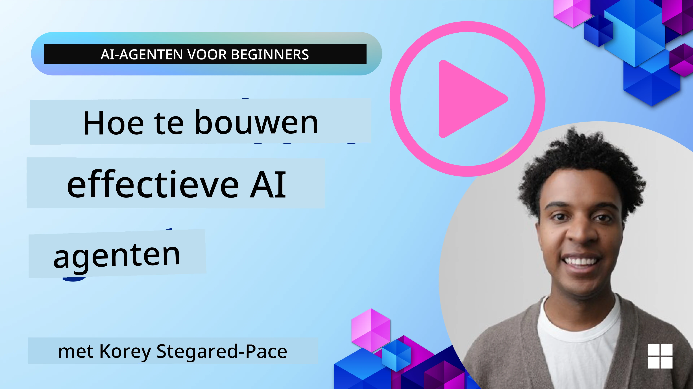
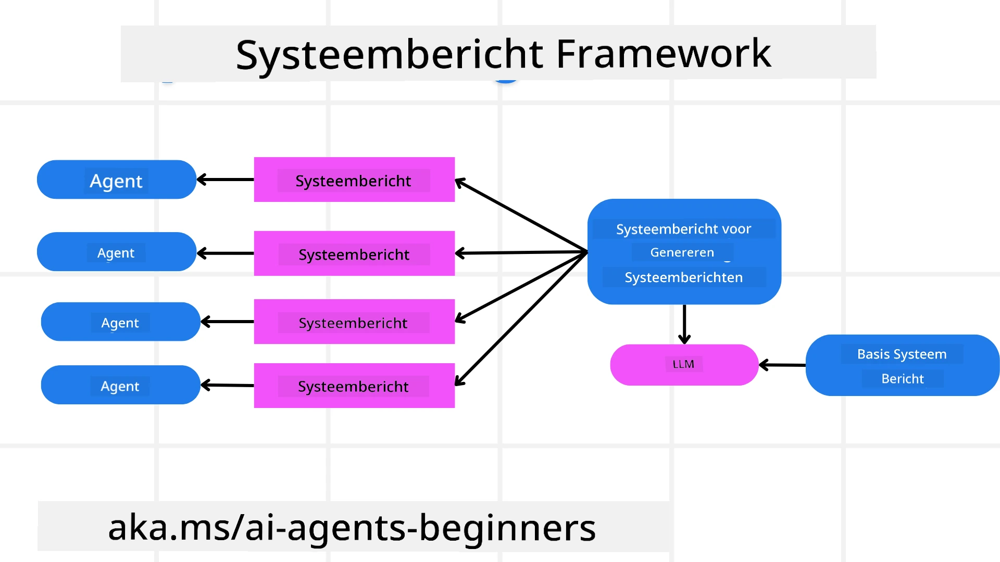
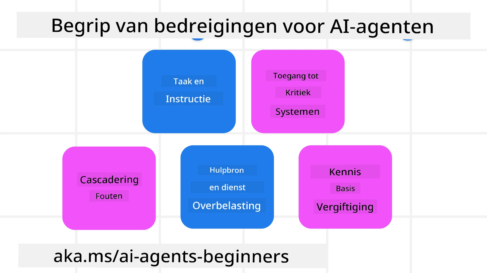
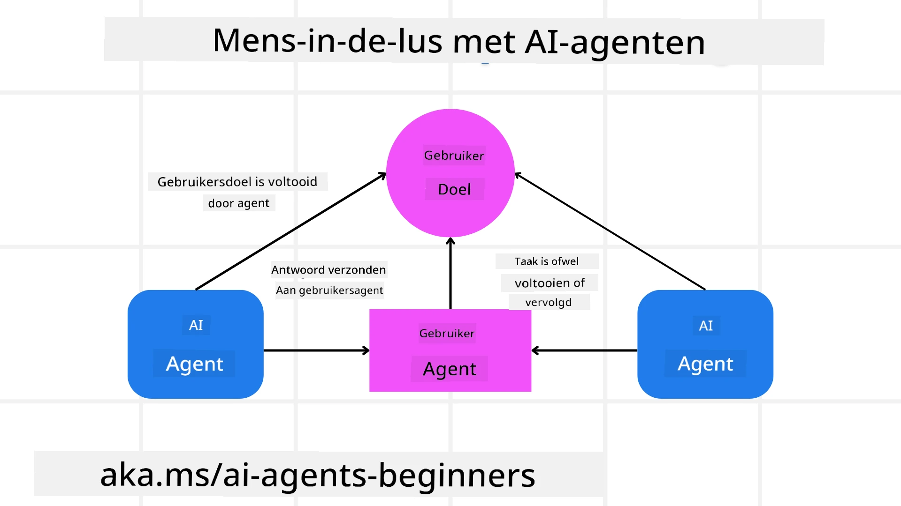

[](https://youtu.be/iZKkMEGBCUQ?si=Q-kEbcyHUMPoHp8L)

> _(Klik op de afbeelding hierboven om de video van deze les te bekijken)_

# Betrouwbare AI-agenten bouwen

## Introductie

Deze les behandelt:

- Hoe veilige en effectieve AI-agenten te bouwen en te implementeren
- Belangrijke beveiligingsoverwegingen bij het ontwikkelen van AI-agenten
- Hoe privacy van gegevens en gebruikers te waarborgen bij het ontwikkelen van AI-agenten

## Leerdoelen

Na het voltooien van deze les weet je hoe je:

- Risico’s kunt identificeren en beperken bij het maken van AI-agenten
- Beveiligingsmaatregelen kunt implementeren om ervoor te zorgen dat gegevens en toegang goed worden beheerd
- AI-agenten kunt creëren die gegevensprivacy handhaven en een kwaliteitsvolle gebruikerservaring bieden

## Veiligheid

Laten we eerst kijken naar het bouwen van veilige agentische toepassingen. Veiligheid betekent dat de AI-agent presteert zoals ontworpen. Als bouwers van agentische toepassingen hebben we methoden en tools om de veiligheid te maximaliseren:

### Het bouwen van een systeembericht-framework

Als je ooit een AI-toepassing hebt gebouwd met behulp van grote taalmodellen (LLM's), ken je het belang van het ontwerpen van een robuuste systeemopdracht of systeembericht. Deze prompts stellen de meta-regels, instructies en richtlijnen vast voor hoe het LLM met de gebruiker en gegevens zal omgaan.

Voor AI-agenten is de systeemopdracht nog belangrijker omdat de AI-agenten zeer specifieke instructies nodig zullen hebben om de taken uit te voeren die we voor hen hebben ontworpen.

Om schaalbare systeemopdrachten te creëren, kunnen we een systeembericht-framework gebruiken om een of meer agenten in onze toepassing te bouwen:



#### Stap 1: Maak een meta-systeembericht

De meta-prompt zal door een LLM worden gebruikt om de systeemopdrachten voor de agenten die we maken te genereren. We ontwerpen het als een sjabloon zodat we efficiënt meerdere agenten kunnen aanmaken indien nodig.

Hier is een voorbeeld van een meta-systeembericht dat we aan de LLM zouden geven:

```plaintext
You are an expert at creating AI agent assistants. 
You will be provided a company name, role, responsibilities and other
information that you will use to provide a system prompt for.
To create the system prompt, be descriptive as possible and provide a structure that a system using an LLM can better understand the role and responsibilities of the AI assistant. 
```

#### Stap 2: Maak een basis-prompt

De volgende stap is het maken van een basis-prompt om de AI-agent te beschrijven. Je zou de rol van de agent, de taken die de agent zal uitvoeren en eventuele andere verantwoordelijkheden van de agent moeten opnemen.

Hier is een voorbeeld:

```plaintext
You are a travel agent for Contoso Travel that is great at booking flights for customers. To help customers you can perform the following tasks: lookup available flights, book flights, ask for preferences in seating and times for flights, cancel any previously booked flights and alert customers on any delays or cancellations of flights.  
```

#### Stap 3: Lever het basale systeembericht aan de LLM

Nu kunnen we dit systeembericht optimaliseren door het meta-systeembericht te geven als het systeembericht samen met ons basale systeembericht.

Dit zal een systeembericht opleveren dat beter is ontworpen om onze AI-agenten te begeleiden:

```markdown
**Company Name:** Contoso Travel  
**Role:** Travel Agent Assistant

**Objective:**  
You are an AI-powered travel agent assistant for Contoso Travel, specializing in booking flights and providing exceptional customer service. Your main goal is to assist customers in finding, booking, and managing their flights, all while ensuring that their preferences and needs are met efficiently.

**Key Responsibilities:**

1. **Flight Lookup:**
    
    - Assist customers in searching for available flights based on their specified destination, dates, and any other relevant preferences.
    - Provide a list of options, including flight times, airlines, layovers, and pricing.
2. **Flight Booking:**
    
    - Facilitate the booking of flights for customers, ensuring that all details are correctly entered into the system.
    - Confirm bookings and provide customers with their itinerary, including confirmation numbers and any other pertinent information.
3. **Customer Preference Inquiry:**
    
    - Actively ask customers for their preferences regarding seating (e.g., aisle, window, extra legroom) and preferred times for flights (e.g., morning, afternoon, evening).
    - Record these preferences for future reference and tailor suggestions accordingly.
4. **Flight Cancellation:**
    
    - Assist customers in canceling previously booked flights if needed, following company policies and procedures.
    - Notify customers of any necessary refunds or additional steps that may be required for cancellations.
5. **Flight Monitoring:**
    
    - Monitor the status of booked flights and alert customers in real-time about any delays, cancellations, or changes to their flight schedule.
    - Provide updates through preferred communication channels (e.g., email, SMS) as needed.

**Tone and Style:**

- Maintain a friendly, professional, and approachable demeanor in all interactions with customers.
- Ensure that all communication is clear, informative, and tailored to the customer's specific needs and inquiries.

**User Interaction Instructions:**

- Respond to customer queries promptly and accurately.
- Use a conversational style while ensuring professionalism.
- Prioritize customer satisfaction by being attentive, empathetic, and proactive in all assistance provided.

**Additional Notes:**

- Stay updated on any changes to airline policies, travel restrictions, and other relevant information that could impact flight bookings and customer experience.
- Use clear and concise language to explain options and processes, avoiding jargon where possible for better customer understanding.

This AI assistant is designed to streamline the flight booking process for customers of Contoso Travel, ensuring that all their travel needs are met efficiently and effectively.

```

#### Stap 4: Itereren en verbeteren

De waarde van dit systeembericht-framework is dat je makkelijker schaalbare systeemberichten kunt maken voor meerdere agenten, en je systeemberichten in de loop van de tijd kunt verbeteren. Het is zeldzaam dat je een systeembericht hebt dat de eerste keer werkt voor je volledige use case. Het vermogen om kleine aanpassingen en verbeteringen aan te brengen door het basis-systeembericht te wijzigen en het door het systeem te laten lopen, stelt je in staat resultaten te vergelijken en te evalueren.

## Dreigingen begrijpen

Om betrouwbare AI-agenten te bouwen, is het belangrijk om de risico’s en dreigingen voor je AI-agent te begrijpen en te beperken. Laten we enkele van de verschillende dreigingen voor AI-agenten bekijken en hoe je hier beter op kunt plannen en voorbereiden.



### Taak en instructie

**Beschrijving:** Aanvallers proberen de instructies of doelen van de AI-agent te veranderen via prompting of het manipuleren van invoer.

**Beperking:** Voer validatiecontroles en invoerfilters uit om potentieel gevaarlijke prompts te detecteren voordat ze door de AI-agent worden verwerkt. Aangezien deze aanvallen meestal frequente interactie met de agent vereisen, is het beperken van het aantal beurten in een gesprek een andere manier om dit soort aanvallen te voorkomen.

### Toegang tot kritieke systemen

**Beschrijving:** Als een AI-agent toegang heeft tot systemen en diensten die gevoelige gegevens opslaan, kunnen aanvallers de communicatie tussen de agent en deze diensten compromitteren. Dit kunnen directe aanvallen zijn of indirecte pogingen om informatie over deze systemen te verkrijgen via de agent.

**Beperking:** AI-agenten moeten toegang hebben tot systemen alleen op basis van noodzaak om dit soort aanvallen te voorkomen. De communicatie tussen de agent en het systeem moet ook veilig zijn. Het implementeren van authenticatie en toegangscontrole is een andere manier om deze informatie te beschermen.

### Overbelasting van bronnen en diensten

**Beschrijving:** AI-agenten kunnen verschillende tools en diensten gebruiken om taken uit te voeren. Aanvallers kunnen deze mogelijkheid misbruiken om deze diensten te overbelasten door een groot aantal verzoeken via de AI-agent te sturen, wat kan leiden tot systeemstoringen of hoge kosten.

**Beperking:** Voer beleidsmaatregelen in om het aantal verzoeken dat een AI-agent kan doen aan een dienst te beperken. Het beperken van het aantal gespreksbeurten en verzoeken aan je AI-agent is een andere manier om dit soort aanvallen te voorkomen.

### Vergiftiging van kennisbasis

**Beschrijving:** Dit soort aanval richt zich niet direct op de AI-agent, maar op de kennisbasis en andere diensten die de AI-agent zal gebruiken. Dit kan bestaan uit het corrumperen van de data of informatie die de AI-agent zal gebruiken om een taak uit te voeren, wat kan leiden tot bevooroordeelde of ongewenste reacties naar de gebruiker.

**Beperking:** Voer regelmatige verificatie uit van de data die de AI-agent in zijn workflows zal gebruiken. Zorg dat de toegang tot deze data veilig is en alleen door vertrouwde personen kan worden gewijzigd om dit soort aanvallen te voorkomen.

### Cascaderende fouten

**Beschrijving:** AI-agenten gebruiken diverse tools en diensten om taken uit te voeren. Fouten veroorzaakt door aanvallers kunnen leiden tot storingen in andere systemen waarmee de AI-agent is verbonden, waardoor de aanval zich verspreidt en lastiger te troubleshooten is.

**Beperking:** Een methode om dit te voorkomen is de AI-agent te laten opereren in een beperkte omgeving, zoals het uitvoeren van taken in een Docker-container, om directe systeemaanvallen te voorkomen. Het creëren van fallback-mechanismen en herhalingslogica wanneer bepaalde systemen foutmeldingen geven, is een andere manier om grotere systeemstoringen te voorkomen.

## Mens-in-de-lus

Een andere effectieve manier om betrouwbare AI-agentensystemen te bouwen is door gebruik te maken van een mens-in-de-lus. Dit creëert een flow waarbij gebruikers feedback kunnen geven aan de agenten tijdens de uitvoering. Gebruikers fungeren als agenten in een multi-agent systeem en kunnen goedkeuring geven of het lopende proces beëindigen.



Hier is een codefragment met de Microsoft Agent Framework om te laten zien hoe dit concept wordt geïmplementeerd:

```python
import os
from agent_framework.azure import AzureAIProjectAgentProvider
from azure.identity import AzureCliCredential

# Maak de aanbieder aan met menselijke tussenkomst voor goedkeuring
provider = AzureAIProjectAgentProvider(
    credential=AzureCliCredential(),
)

# Maak de agent aan met een menselijke goedkeuringsstap
response = provider.create_response(
    input="Write a 4-line poem about the ocean.",
    instructions="You are a helpful assistant. Ask for user approval before finalizing.",
)

# De gebruiker kan de reactie beoordelen en goedkeuren
print(response.output_text)
user_input = input("Do you approve? (APPROVE/REJECT): ")
if user_input == "APPROVE":
    print("Response approved.")
else:
    print("Response rejected. Revising...")
```

## Conclusie

Het bouwen van betrouwbare AI-agenten vereist zorgvuldig ontwerp, robuuste beveiligingsmaatregelen en continue iteratie. Door gestructureerde meta-promptingsystemen te implementeren, potentiële dreigingen te begrijpen en mitigatiestrategieën toe te passen, kunnen ontwikkelaars AI-agenten creëren die zowel veilig als effectief zijn. Daarnaast zorgt het integreren van een mens-in-de-lus-benadering ervoor dat AI-agenten in lijn blijven met de behoeften van gebruikers en risico’s worden geminimaliseerd. Naarmate AI zich blijft ontwikkelen, zal het handhaven van een proactieve houding ten aanzien van beveiliging, privacy en ethische overwegingen essentieel zijn om vertrouwen en betrouwbaarheid in AI-gestuurde systemen te bevorderen.

### Meer vragen over het bouwen van betrouwbare AI-agenten?

Word lid van de [Microsoft Foundry Discord](https://aka.ms/ai-agents/discord) om andere leerlingen te ontmoeten, deel te nemen aan kantooruren en je vragen over AI-agenten te stellen.

## Aanvullende bronnen

- <a href="https://learn.microsoft.com/azure/ai-studio/responsible-use-of-ai-overview" target="_blank">Overzicht Verantwoorde AI</a>
- <a href="https://learn.microsoft.com/azure/ai-studio/concepts/evaluation-approach-gen-ai" target="_blank">Evaluatie van generatieve AI-modellen en AI-toepassingen</a>
- <a href="https://learn.microsoft.com/azure/ai-services/openai/concepts/system-message?context=%2Fazure%2Fai-studio%2Fcontext%2Fcontext&tabs=top-techniques" target="_blank">Veilige systeemberichten</a>
- <a href="https://blogs.microsoft.com/wp-content/uploads/prod/sites/5/2022/06/Microsoft-RAI-Impact-Assessment-Template.pdf?culture=en-us&country=us" target="_blank">Risicobeoordelingssjabloon</a>

## Vorige les

[Agentic RAG](../05-agentic-rag/README.md)

## Volgende les

[Planning Design Pattern](../07-planning-design/README.md)

---

<!-- CO-OP TRANSLATOR DISCLAIMER START -->
**Disclaimer**:  
Dit document is vertaald met behulp van de AI-vertalingsdienst [Co-op Translator](https://github.com/Azure/co-op-translator). Hoewel wij streven naar nauwkeurigheid, kan automatische vertaling fouten of onnauwkeurigheden bevatten. Het originele document in de oorspronkelijke taal dient als de gezaghebbende bron te worden beschouwd. Voor cruciale informatie wordt professionele menselijke vertaling aanbevolen. Wij zijn niet aansprakelijk voor eventuele misverstanden of verkeerde interpretaties voortvloeiend uit het gebruik van deze vertaling.
<!-- CO-OP TRANSLATOR DISCLAIMER END -->