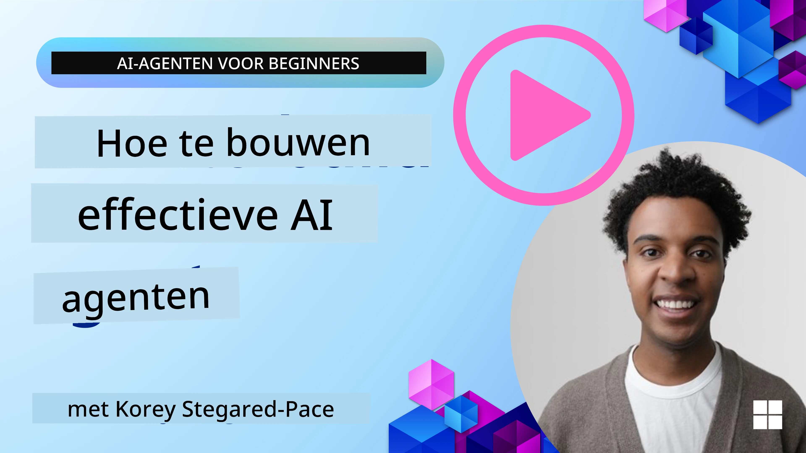
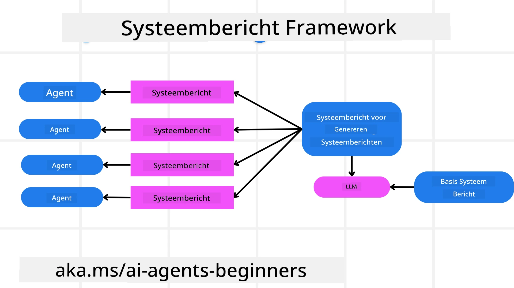
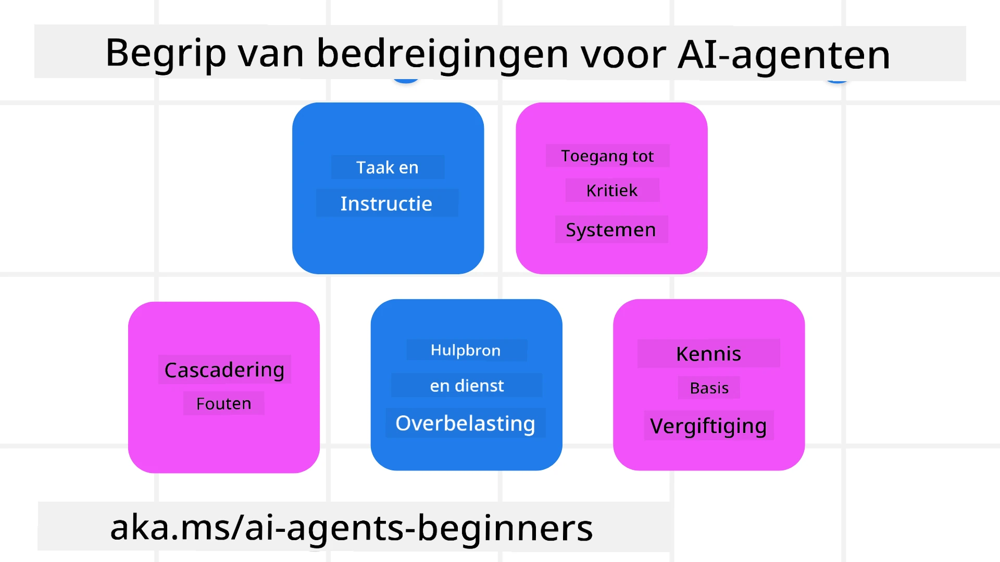
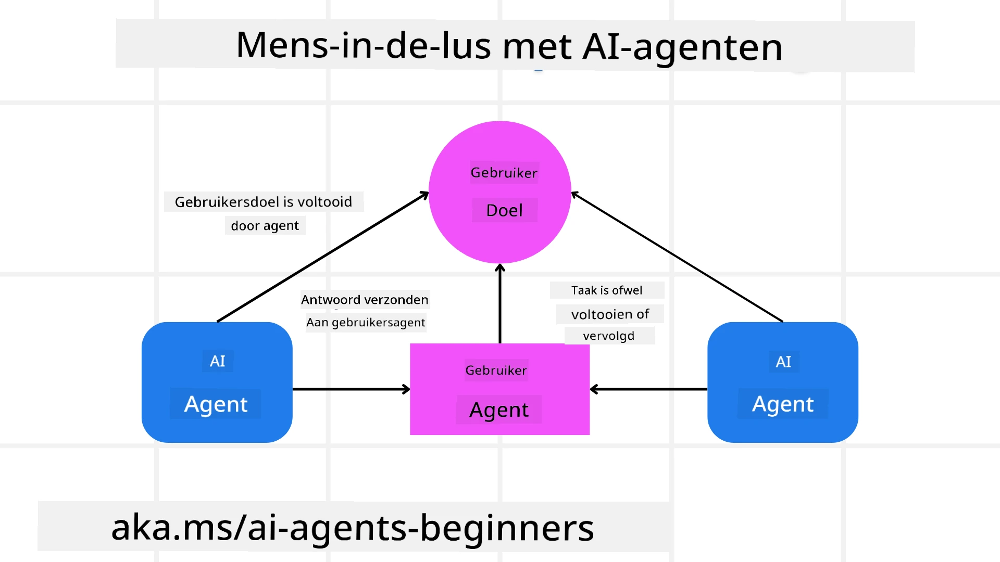

[](https://youtu.be/iZKkMEGBCUQ?si=Q-kEbcyHUMPoHp8L)

> _(Klik op de afbeelding hierboven om de video van deze les te bekijken)_

# Vertrouwde AI-agenten bouwen

## Introductie

Deze les behandelt:

- Hoe veilige en effectieve AI-agenten te bouwen en uit te rollen
- Belangrijke beveiligingsoverwegingen bij het ontwikkelen van AI-agenten.
- Hoe data- en gebruikersprivacy te waarborgen bij het ontwikkelen van AI-agenten.

## Leerdoelen

Na het volgen van deze les weet je hoe je:

- Risico’s bij het creëren van AI-agenten identificeert en vermindert.
- Beveiligingsmaatregelen implementeert om te zorgen dat data en toegang goed worden beheerd.
- AI-agenten maakt die data privacy waarborgen en een kwalitatieve gebruikerservaring bieden.

## Veiligheid

Laten we eerst kijken naar het bouwen van veilige agentische applicaties. Veiligheid betekent dat de AI-agent functioneert zoals ontworpen. Als bouwers van agentische applicaties hebben we methoden en tools om de veiligheid te maximaliseren:

### Het Opbouwen van een Systeembericht Framework

Als je ooit een AI-applicatie hebt gebouwd met behulp van Large Language Models (LLM's), weet je hoe belangrijk het is om een robuuste systeemprompt of systeembericht te ontwerpen. Deze prompts stellen de meta-regels, instructies en richtlijnen vast voor hoe het LLM met de gebruiker en data zal interacteren.

Voor AI-agenten is de systeemprompt nog belangrijker, omdat de AI-agenten zeer specifieke instructies nodig hebben om de taken die we voor hen hebben ontworpen uit te voeren.

Om schaalbare systeemprompts te creëren, kunnen we een systeemberichtframework gebruiken voor het bouwen van één of meerdere agenten in onze applicatie:



#### Stap 1: Maak een Meta Systeembericht

De meta prompt wordt door een LLM gebruikt om de systeemprompts voor de agenten die we creëren te genereren. We ontwerpen het als een sjabloon zodat we efficiënt meerdere agenten kunnen maken indien nodig.

Hier is een voorbeeld van een meta systeembericht dat we aan het LLM zouden geven:

```plaintext
You are an expert at creating AI agent assistants. 
You will be provided a company name, role, responsibilities and other
information that you will use to provide a system prompt for.
To create the system prompt, be descriptive as possible and provide a structure that a system using an LLM can better understand the role and responsibilities of the AI assistant. 
```

#### Stap 2: Maak een basisprompt

De volgende stap is het maken van een basisprompt om de AI-agent te beschrijven. Je moet de rol van de agent, de taken die de agent zal uitvoeren, en andere verantwoordelijkheden van de agent opnemen.

Hier is een voorbeeld:

```plaintext
You are a travel agent for Contoso Travel that is great at booking flights for customers. To help customers you can perform the following tasks: lookup available flights, book flights, ask for preferences in seating and times for flights, cancel any previously booked flights and alert customers on any delays or cancellations of flights.  
```

#### Stap 3: Geef Basis Systeembericht aan LLM

Nu kunnen we dit systeembericht optimaliseren door het meta systeembericht als systeembericht te geven en ons basis systeembericht toe te voegen.

Dit zal een systeembericht produceren dat beter ontworpen is om onze AI-agenten te begeleiden:

```markdown
**Company Name:** Contoso Travel  
**Role:** Travel Agent Assistant

**Objective:**  
You are an AI-powered travel agent assistant for Contoso Travel, specializing in booking flights and providing exceptional customer service. Your main goal is to assist customers in finding, booking, and managing their flights, all while ensuring that their preferences and needs are met efficiently.

**Key Responsibilities:**

1. **Flight Lookup:**
    
    - Assist customers in searching for available flights based on their specified destination, dates, and any other relevant preferences.
    - Provide a list of options, including flight times, airlines, layovers, and pricing.
2. **Flight Booking:**
    
    - Facilitate the booking of flights for customers, ensuring that all details are correctly entered into the system.
    - Confirm bookings and provide customers with their itinerary, including confirmation numbers and any other pertinent information.
3. **Customer Preference Inquiry:**
    
    - Actively ask customers for their preferences regarding seating (e.g., aisle, window, extra legroom) and preferred times for flights (e.g., morning, afternoon, evening).
    - Record these preferences for future reference and tailor suggestions accordingly.
4. **Flight Cancellation:**
    
    - Assist customers in canceling previously booked flights if needed, following company policies and procedures.
    - Notify customers of any necessary refunds or additional steps that may be required for cancellations.
5. **Flight Monitoring:**
    
    - Monitor the status of booked flights and alert customers in real-time about any delays, cancellations, or changes to their flight schedule.
    - Provide updates through preferred communication channels (e.g., email, SMS) as needed.

**Tone and Style:**

- Maintain a friendly, professional, and approachable demeanor in all interactions with customers.
- Ensure that all communication is clear, informative, and tailored to the customer's specific needs and inquiries.

**User Interaction Instructions:**

- Respond to customer queries promptly and accurately.
- Use a conversational style while ensuring professionalism.
- Prioritize customer satisfaction by being attentive, empathetic, and proactive in all assistance provided.

**Additional Notes:**

- Stay updated on any changes to airline policies, travel restrictions, and other relevant information that could impact flight bookings and customer experience.
- Use clear and concise language to explain options and processes, avoiding jargon where possible for better customer understanding.

This AI assistant is designed to streamline the flight booking process for customers of Contoso Travel, ensuring that all their travel needs are met efficiently and effectively.

```

#### Stap 4: Itereer en Verbeter

De waarde van dit systeemberichtframework is dat het gemakkelijker wordt om schaalbaar systeemberichten van meerdere agenten te maken en je systeemberichten in de loop van de tijd te verbeteren. Het is zeldzaam dat je een systeembericht hebt dat de eerste keer werkt voor jouw volledige gebruikssituatie. Kleine aanpassingen en verbeteringen maken door het basis systeembericht te veranderen en het systeem te gebruiken, stelt je in staat om resultaten te vergelijken en evalueren.

## Dreigingen Begrijpen

Om vertrouwde AI-agenten te bouwen, is het belangrijk om de risico’s en dreigingen voor je AI-agent te begrijpen en te mitigeren. Laten we slechts enkele van de verschillende dreigingen voor AI-agenten bekijken en hoe je beter kunt plannen en voorbereiden.



### Taak en Instructie

**Omschrijving:** Aanvallers proberen de instructies of doelen van de AI-agent te veranderen via prompting of het manipuleren van inputs.

**Mitigatie:** Voer validatiecontroles en inputfilters uit om potentieel gevaarlijke prompts te detecteren voordat ze door de AI-agent worden verwerkt. Omdat deze aanvallen doorgaans frequente interactie met de agent vereisen, is het beperken van het aantal ronden in een conversatie een andere manier om dit soort aanvallen te voorkomen.

### Toegang tot Kritieke Systemen

**Omschrijving:** Wanneer een AI-agent toegang heeft tot systemen en diensten die gevoelige gegevens opslaan, kunnen aanvallers de communicatie tussen de agent en deze diensten compromitteren. Dit kunnen directe aanvallen zijn of indirecte pogingen om informatie over deze systemen via de agent te verkrijgen.

**Mitigatie:** AI-agenten mogen alleen toegang hebben tot systemen op basis van noodzaak om dit soort aanvallen te voorkomen. De communicatie tussen de agent en het systeem moet ook veilig zijn. Het implementeren van authenticatie en toegangscontrole is een andere manier om deze informatie te beschermen.

### Overbelasting van Resources en Diensten

**Omschrijving:** AI-agenten kunnen toegang krijgen tot verschillende tools en diensten om taken te voltooien. Aanvallers kunnen deze mogelijkheid gebruiken om deze diensten aan te vallen door een groot aantal verzoeken via de AI-agent te sturen, wat kan resulteren in systeemstoringen of hoge kosten.

**Mitigatie:** Implementeer beleid om het aantal verzoeken dat een AI-agent naar een dienst kan sturen te beperken. Het beperken van het aantal gespreksturns en verzoeken aan je AI-agent is een andere manier om dit type aanvallen te voorkomen.

### Vergiftiging van de Kennisbasis

**Omschrijving:** Dit type aanval richt zich niet direct op de AI-agent, maar op de kennisbasis en andere diensten die de AI-agent zal gebruiken. Dit kan het corrupteren van de data of informatie omvatten die de AI-agent gebruikt om een taak te voltooien, wat leidt tot bevooroordeelde of onbedoelde reacties naar de gebruiker.

**Mitigatie:** Voer regelmatige verificatie uit van de data die de AI-agent zal gebruiken in zijn workflows. Zorg dat de toegang tot deze data veilig is en alleen door vertrouwde personen kan worden gewijzigd om dit type aanval te vermijden.

### Cascaderende Fouten

**Omschrijving:** AI-agenten maken gebruik van verschillende tools en diensten om taken te voltooien. Fouten veroorzaakt door aanvallers kunnen leiden tot falen van andere systemen waar de AI-agent aan verbonden is, waardoor de aanval zich verspreidt en moeilijker te diagnosticeren is.

**Mitigatie:** Een manier om dit te voorkomen is dat de AI-agent in een beperkte omgeving draait, zoals het uitvoeren van taken in een Docker-container, om directe systeemaanvallen te voorkomen. Het creëren van fallback-mechanismen en retry-logica wanneer bepaalde systemen een foutmelding geven, is een andere manier om grotere systeemstoringen te voorkomen.

## Mens-in-de-lus

Een andere effectieve manier om vertrouwde AI-agent systemen te bouwen is door gebruik te maken van een Mens-in-de-lus. Dit creëert een stroom waarbij gebruikers tijdens de werking feedback kunnen geven aan de agenten. Gebruikers fungeren als agenten in een multi-agent systeem en geven goedkeuring of beëindiging van het lopende proces.



Hier is een codevoorbeeld met het Microsoft Agent Framework om te laten zien hoe dit concept wordt geïmplementeerd:

```python
import os
from agent_framework.foundry import FoundryChatClient
from azure.identity import AzureCliCredential

# Maak de provider aan met menselijke goedkeuring in de lus
provider = FoundryChatClient(
    project_endpoint=os.environ["AZURE_AI_PROJECT_ENDPOINT"],
    model=os.environ["AZURE_AI_MODEL_DEPLOYMENT_NAME"],
    credential=AzureCliCredential(),
)

# Maak de agent aan met een menselijke goedkeuringsstap
response = provider.create_response(
    input="Write a 4-line poem about the ocean.",
    instructions="You are a helpful assistant. Ask for user approval before finalizing.",
)

# De gebruiker kan het antwoord beoordelen en goedkeuren
print(response.output_text)
user_input = input("Do you approve? (APPROVE/REJECT): ")
if user_input == "APPROVE":
    print("Response approved.")
else:
    print("Response rejected. Revising...")
```

## Conclusie

Het bouwen van vertrouwde AI-agenten vereist zorgvuldig ontwerp, robuuste beveiligingsmaatregelen en voortdurende iteratie. Door gestructureerde meta-promptsystemen te implementeren, potentiële bedreigingen te begrijpen en mitigatiestrategieën toe te passen, kunnen ontwikkelaars AI-agenten creëren die zowel veilig als effectief zijn. Bovendien zorgt een mens-in-de-lus aanpak ervoor dat AI-agenten in lijn blijven met de behoeften van gebruikers en tegelijkertijd risico's minimaliseren. Naarmate AI zich blijft ontwikkelen, zal een proactieve houding ten aanzien van beveiliging, privacy en ethische overwegingen essentieel zijn om vertrouwen en betrouwbaarheid in AI-gedreven systemen te bevorderen.

## Codevoorbeelden

- [`code_samples/06-system-message-framework.ipynb`](code_samples/06-system-message-framework.ipynb): Stapsgewijze demonstratie van het meta-prompt systeemberichtframework.
- [`code_samples/06-human-in-the-loop.ipynb`](code_samples/06-human-in-the-loop.ipynb): Goedkeuringspoorten voor acties vooraf, risico-classificatie en audit logging voor vertrouwde agenten.

### Meer vragen over het bouwen van vertrouwde AI-agenten?

Sluit je aan bij de [Microsoft Foundry Discord](https://discord.com/invite/ATgtXmAS5D) om andere leerlingen te ontmoeten, deel te nemen aan spreekuren en je vragen over AI-agenten beantwoord te krijgen.

## Aanvullende bronnen

- <a href="https://learn.microsoft.com/azure/ai-studio/responsible-use-of-ai-overview" target="_blank">Overzicht Verantwoordelijke AI</a>
- <a href="https://learn.microsoft.com/azure/ai-studio/concepts/evaluation-approach-gen-ai" target="_blank">Evaluatie van generatieve AI-modellen en AI-toepassingen</a>
- <a href="https://learn.microsoft.com/azure/ai-services/openai/concepts/system-message?context=%2Fazure%2Fai-studio%2Fcontext%2Fcontext&tabs=top-techniques" target="_blank">Veiligheidssysteemberichten</a>
- <a href="https://blogs.microsoft.com/wp-content/uploads/prod/sites/5/2022/06/Microsoft-RAI-Impact-Assessment-Template.pdf?culture=en-us&country=us" target="_blank">Risicobeoordelingssjabloon</a>

## Vorige les

[Agentic RAG](../05-agentic-rag/README.md)

## Volgende les

[Ontwerppatroon voor planning](../07-planning-design/README.md)

---

<!-- CO-OP TRANSLATOR DISCLAIMER START -->
**Disclaimer**:
Dit document is vertaald met behulp van de AI vertaaldienst [Co-op Translator](https://github.com/Azure/co-op-translator). Hoewel we streven naar nauwkeurigheid, dient u er rekening mee te houden dat geautomatiseerde vertalingen fouten of onnauwkeurigheden kunnen bevatten. Het originele document in de oorspronkelijke taal moet worden beschouwd als de gezaghebbende bron. Voor kritieke informatie wordt professionele menselijke vertaling aanbevolen. Wij zijn niet aansprakelijk voor eventuele misverstanden of verkeerde interpretaties die voortvloeien uit het gebruik van deze vertaling.
<!-- CO-OP TRANSLATOR DISCLAIMER END -->