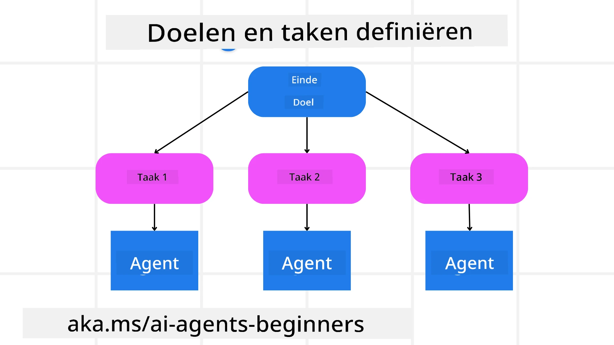

[](https://youtu.be/kPfJ2BrBCMY?si=9pYpPXp0sSbK91Dr)

> _(Klik op de afbeelding hierboven om de video van deze les te bekijken)_

# Planningontwerp

## Inleiding

Deze les behandelt

* Het definiëren van een duidelijk overkoepelend doel en het opdelen van een complexe taak in beheersbare taken.
* Het benutten van gestructureerde output voor betrouwbaardere en machineleesbare reacties.
* Het toepassen van een gebeurtenisgestuurde benadering om dynamische taken en onverwachte invoer af te handelen.

## Leerdoelen

Na het voltooien van deze les begrijp je:

* Hoe je een overkoepelend doel voor een AI-agent identificeert en stelt, zodat deze duidelijk weet wat bereikt moet worden.
* Hoe je een complexe taak opdeelt in beheersbare subtaken en deze in een logische volgorde organiseert.
* Hoe je agenten voorziet van de juiste tools (bijv. zoektools of data-analytische tools), wanneer en hoe ze worden gebruikt en hoe je onverwachte situaties afhandelt.
* Hoe je de uitkomsten van subtaken evalueert, prestaties meet en acties herhaalt om het uiteindelijke resultaat te verbeteren.

## Het overkoepelend doel definiëren en een taak opsplitsen



De meeste taken in de echte wereld zijn te complex om in één stap aan te pakken. Een AI-agent heeft een beknopt doel nodig om zijn planning en acties te sturen. Neem bijvoorbeeld het doel:

    "Genereer een reisroute van 3 dagen."

Hoewel dit eenvoudig te formuleren is, moet het nog verfijnd worden. Hoe duidelijker het doel, hoe beter de agent (en eventuele menselijke medewerkers) zich kunnen richten op het bereiken van het juiste resultaat, zoals het maken van een uitgebreide reisroute met vluchtopties, hotelaanbevelingen en activiteitensuggesties.

### Taken opsplitsen

Grote of complexe taken worden beheersbaarder als ze worden opgesplitst in kleinere, doelgerichte subtaken.
Voor het voorbeeld van de reisroute kun je het doel opdelen in:

* Vlucht boeken
* Hotel reserveren
* Autoverhuur
* Personalisatie

Elke subtaak kan vervolgens worden aangepakt door speciale agenten of processen. De ene agent is mogelijk gespecialiseerd in het zoeken naar de beste vluchtdeals, een andere richt zich op hotelreserveringen, enzovoort. Een coördinerende of "downstream" agent kan deze resultaten vervolgens samenvoegen tot één samenhangende route voor de eindgebruiker.

Deze modulaire aanpak maakt ook incrementele verbeteringen mogelijk. Je kunt bijvoorbeeld gespecialiseerde agenten toevoegen voor Voedselaanbevelingen of Lokale Activiteitensuggesties en de route in de loop van de tijd verfijnen.

### Gestructureerde output

Grote taalmodellen (LLM's) kunnen gestructureerde output genereren (bijv. JSON) die eenvoudiger te parsen en verwerken is door downstream agenten of diensten. Dit is vooral nuttig in een multi-agent context, waarbij we deze taken kunnen uitvoeren nadat de planning is ontvangen.

Het volgende Python-fragment toont een eenvoudige planneragent die een doel opsplitst in subtaken en een gestructureerd plan genereert:

```python
from pydantic import BaseModel
from enum import Enum
from typing import List, Optional, Union
import json
import os
from typing import Optional
from pprint import pprint
from agent_framework.azure import AzureAIProjectAgentProvider
from azure.identity import AzureCliCredential

class AgentEnum(str, Enum):
    FlightBooking = "flight_booking"
    HotelBooking = "hotel_booking"
    CarRental = "car_rental"
    ActivitiesBooking = "activities_booking"
    DestinationInfo = "destination_info"
    DefaultAgent = "default_agent"
    GroupChatManager = "group_chat_manager"

# Reis SubTaak Model
class TravelSubTask(BaseModel):
    task_details: str
    assigned_agent: AgentEnum  # we willen de taak toewijzen aan de agent

class TravelPlan(BaseModel):
    main_task: str
    subtasks: List[TravelSubTask]
    is_greeting: bool

provider = AzureAIProjectAgentProvider(credential=AzureCliCredential())

# Definieer het gebruikersbericht
system_prompt = """You are a planner agent.
    Your job is to decide which agents to run based on the user's request.
    Provide your response in JSON format with the following structure:
{'main_task': 'Plan a family trip from Singapore to Melbourne.',
 'subtasks': [{'assigned_agent': 'flight_booking',
               'task_details': 'Book round-trip flights from Singapore to '
                               'Melbourne.'}
    Below are the available agents specialised in different tasks:
    - FlightBooking: For booking flights and providing flight information
    - HotelBooking: For booking hotels and providing hotel information
    - CarRental: For booking cars and providing car rental information
    - ActivitiesBooking: For booking activities and providing activity information
    - DestinationInfo: For providing information about destinations
    - DefaultAgent: For handling general requests"""

user_message = "Create a travel plan for a family of 2 kids from Singapore to Melbourne"

response = client.create_response(input=user_message, instructions=system_prompt)

response_content = response.output_text
pprint(json.loads(response_content))
```

### Planneragent met Orkestratie van Multi-Agenten

In dit voorbeeld ontvangt een Semantic Router Agent een gebruikersverzoek (bijv. "Ik heb een hotelplan nodig voor mijn reis.").

De planner:

* Ontvangt het Hotelplan: De planner neemt het bericht van de gebruiker en genereert, op basis van een systeemprompt (inclusief beschikbare agentdetails), een gestructureerd reisplan.
* Geeft agenten en hun tools weer: Het agentenregister bevat een lijst van agenten (bijv. voor vlucht, hotel, autoverhuur en activiteiten) met de functies of tools die ze bieden.
* Stuurt het plan naar de respectieve agenten: Afhankelijk van het aantal subtaken stuurt de planner het bericht direct naar een speciale agent (voor enkelvoudige taken) of coördineert via een groepschatmanager voor samenwerking tussen meerdere agenten.
* Vat het resultaat samen: Tot slot vat de planner het gegenereerde plan samen ter verduidelijking.
De volgende Python-code illustreert deze stappen:

```python

from pydantic import BaseModel

from enum import Enum
from typing import List, Optional, Union

class AgentEnum(str, Enum):
    FlightBooking = "flight_booking"
    HotelBooking = "hotel_booking"
    CarRental = "car_rental"
    ActivitiesBooking = "activities_booking"
    DestinationInfo = "destination_info"
    DefaultAgent = "default_agent"
    GroupChatManager = "group_chat_manager"

# Reistaak Model

class TravelSubTask(BaseModel):
    task_details: str
    assigned_agent: AgentEnum # we willen de taak aan de agent toewijzen

class TravelPlan(BaseModel):
    main_task: str
    subtasks: List[TravelSubTask]
    is_greeting: bool
import json
import os
from typing import Optional

from agent_framework.azure import AzureAIProjectAgentProvider
from azure.identity import AzureCliCredential

# Maak de client aan

provider = AzureAIProjectAgentProvider(credential=AzureCliCredential())

from pprint import pprint

# Definieer het gebruikersbericht

system_prompt = """You are a planner agent.
    Your job is to decide which agents to run based on the user's request.
    Below are the available agents specialized in different tasks:
    - FlightBooking: For booking flights and providing flight information
    - HotelBooking: For booking hotels and providing hotel information
    - CarRental: For booking cars and providing car rental information
    - ActivitiesBooking: For booking activities and providing activity information
    - DestinationInfo: For providing information about destinations
    - DefaultAgent: For handling general requests"""

user_message = "Create a travel plan for a family of 2 kids from Singapore to Melbourne"

response = client.create_response(input=user_message, instructions=system_prompt)

response_content = response.output_text

# Print de reactiewaarde nadat deze als JSON is geladen

pprint(json.loads(response_content))
```

Hieronder volgt de output van de vorige code, die je vervolgens kunt gebruiken om naar `assigned_agent` te routeren en het reisplan samen te vatten voor de eindgebruiker.

```json
{
    "is_greeting": "False",
    "main_task": "Plan a family trip from Singapore to Melbourne.",
    "subtasks": [
        {
            "assigned_agent": "flight_booking",
            "task_details": "Book round-trip flights from Singapore to Melbourne."
        },
        {
            "assigned_agent": "hotel_booking",
            "task_details": "Find family-friendly hotels in Melbourne."
        },
        {
            "assigned_agent": "car_rental",
            "task_details": "Arrange a car rental suitable for a family of four in Melbourne."
        },
        {
            "assigned_agent": "activities_booking",
            "task_details": "List family-friendly activities in Melbourne."
        },
        {
            "assigned_agent": "destination_info",
            "task_details": "Provide information about Melbourne as a travel destination."
        }
    ]
}
```

Een voorbeeldnotebook met bovenstaande code is beschikbaar [hier](07-python-agent-framework.ipynb).

### Iteratieve planning

Sommige taken vereisen overleg of herplanning, waarbij de uitkomst van een subtaak de volgende beïnvloedt. Bijvoorbeeld, als de agent tijdens het boeken van vluchten een onverwacht dataformaat ontdekt, moet hij mogelijk zijn strategie aanpassen voordat hij aan hotelboekingen begint.

Daarnaast kan gebruikersfeedback (bijv. een persoon die besluit een eerdere vlucht te willen) een gedeeltelijke herplanning veroorzaken. Deze dynamische, iteratieve aanpak zorgt ervoor dat de uiteindelijke oplossing aansluit bij realistische beperkingen en veranderende gebruikersvoorkeuren.

bijv. voorbeeldcode

```python
from agent_framework.azure import AzureAIProjectAgentProvider
from azure.identity import AzureCliCredential
#.. hetzelfde als de vorige code en geef de gebruikersgeschiedenis, huidig plan door

system_prompt = """You are a planner agent to optimize the
    Your job is to decide which agents to run based on the user's request.
    Below are the available agents specialized in different tasks:
    - FlightBooking: For booking flights and providing flight information
    - HotelBooking: For booking hotels and providing hotel information
    - CarRental: For booking cars and providing car rental information
    - ActivitiesBooking: For booking activities and providing activity information
    - DestinationInfo: For providing information about destinations
    - DefaultAgent: For handling general requests"""

user_message = "Create a travel plan for a family of 2 kids from Singapore to Melbourne"

response = client.create_response(
    input=user_message,
    instructions=system_prompt,
    context=f"Previous travel plan - {TravelPlan}",
)
# .. herplan en stuur de taken naar de respectievelijke agenten
```

Voor meer uitgebreide planning kun je de Magnetic One <a href="https://www.microsoft.com/research/articles/magentic-one-a-generalist-multi-agent-system-for-solving-complex-tasks" target="_blank">Blogpost</a> bekijken, voor het oplossen van complexe taken.

## Samenvatting

In dit artikel hebben we gekeken naar een voorbeeld hoe we een planner kunnen maken die dynamisch beschikbare agenten selecteert. De output van de planner splitst de taken op en wijst agenten toe zodat ze uitgevoerd kunnen worden. Er wordt verondersteld dat de agenten toegang hebben tot de functies/tools die nodig zijn om de taak uit te voeren. Naast de agenten kun je ook andere patronen opnemen zoals reflectie, samenvattingen en round robin chat om verder aan te passen.

## Aanvullende bronnen

Magentic One - Een generalistische multi-agent systeem voor het oplossen van complexe taken en heeft indrukwekkende resultaten behaald op meerdere uitdagende agent benchmarks. Referentie: <a href="https://www.microsoft.com/research/articles/magentic-one-a-generalist-multi-agent-system-for-solving-complex-tasks" target="_blank">Magentic One</a>. In deze implementatie maakt de orkestrator taak-specifieke plannen en delegeert deze taken aan beschikbare agenten. Naast planning gebruikt de orkestrator ook een trackingmechanisme om de voortgang van een taak te monitoren en plant opnieuw waar nodig.

### Meer vragen over het Planning Design Pattern?

Word lid van de [Microsoft Foundry Discord](https://aka.ms/ai-agents/discord) om andere leerlingen te ontmoeten, kantooruren bij te wonen en je AI Agenten-vragen beantwoord te krijgen.

## Vorige les

[Betrouwbare AI-agenten bouwen](../06-building-trustworthy-agents/README.md)

## Volgende les

[Multi-Agent Design Pattern](../08-multi-agent/README.md)

---

<!-- CO-OP TRANSLATOR DISCLAIMER START -->
**Disclaimer**:  
Dit document is vertaald met behulp van de AI-vertalingsdienst [Co-op Translator](https://github.com/Azure/co-op-translator). Hoewel we streven naar nauwkeurigheid, dient u er rekening mee te houden dat geautomatiseerde vertalingen fouten of onnauwkeurigheden kunnen bevatten. Het originele document in de oorspronkelijke taal wordt als de gezaghebbende bron beschouwd. Voor belangrijke informatie wordt professionele menselijke vertaling aanbevolen. Wij zijn niet aansprakelijk voor eventuele misverstanden of verkeerde interpretaties die voortvloeien uit het gebruik van deze vertaling.
<!-- CO-OP TRANSLATOR DISCLAIMER END -->