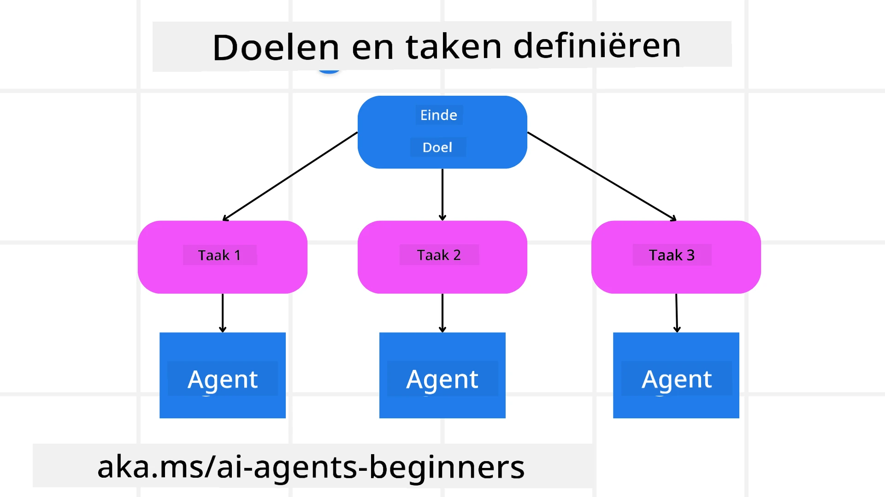

[](https://youtu.be/kPfJ2BrBCMY?si=9pYpPXp0sSbK91Dr)

> _(Klik op de afbeelding hierboven om de video van deze les te bekijken)_

# Planning Design

## Introductie

Deze les behandelt

* Het definiëren van een duidelijk overkoepelend doel en het opdelen van een complexe taak in beheersbare taken.
* Gebruik maken van gestructureerde output voor betrouwbaardere en machine-leesbare reacties.
* Het toepassen van een event-gedreven aanpak om dynamische taken en onverwachte inputs te verwerken.

## Leerdoelen

Na het voltooien van deze les begrijp je:

* Hoe je een overkoepelend doel kunt identificeren en vaststellen voor een AI-agent, zodat deze precies weet wat bereikt moet worden.
* Hoe je een complexe taak kunt ontleden in beheersbare subtaken en deze in een logische volgorde kunt organiseren.
* Hoe je agenten uitrust met de juiste tools (bijv. zoektools of data-analysetools), bepaalt wanneer en hoe deze gebruikt worden, en omgaat met onverwachte situaties.
* Hoe je de resultaten van subtaken evalueert, prestaties meet en acties herhaalt om de uiteindelijke output te verbeteren.

## Het definiëren van het overkoepelende doel en het opdelen van een taak



De meeste taken in de echte wereld zijn te complex om in één keer aan te pakken. Een AI-agent heeft een beknopt doel nodig om zijn planning en acties te sturen. Bijvoorbeeld, neem het doel:

    "Genereer een 3-daagse reisroute."

Hoewel het eenvoudig is om dit te stellen, moet het nog verder worden verfijnd. Hoe duidelijker het doel, hoe beter de agent (en eventuele menselijke samenwerkingspartners) zich kunnen richten op het bereiken van het juiste resultaat, zoals het maken van een uitgebreide reisroute met vluchtopties, hotelaanbevelingen en activiteitensuggesties.

### Taakopdeling

Grote of ingewikkelde taken worden beheersbaarder wanneer ze worden opgedeeld in kleinere, doelgerichte subtaken.
Voor het voorbeeld van een reisroute kun je het doel opdelen in:

* Vluchtboeking
* Hotelboeking
* Autohuur
* Personalisatie

Elke subtaak kan dan worden aangepakt door toegewijde agenten of processen. De ene agent kan gespecialiseerd zijn in het zoeken naar de beste vliegticketaanbiedingen, een andere richt zich op hotelboekingen, enzovoort. Een coördinerende of "downstream" agent kan deze resultaten vervolgens samenvoegen tot één samenhangende route voor de eindgebruiker.

Deze modulaire aanpak maakt ook incrementele verbeteringen mogelijk. Zo kun je gespecialiseerde agenten toevoegen voor Voedselaanbevelingen of Lokale Activiteitensuggesties en de reisroute in de loop van de tijd verfijnen.

### Gestructureerde output

Grote taalmodellen (LLM’s) kunnen gestructureerde output genereren (bijv. JSON) die gemakkelijker door downstream-agenten of -diensten te parseren en verwerken is. Dit is vooral nuttig in een multi-agent-context, waar we deze taken kunnen uitvoeren nadat de planneroutput is ontvangen.

De volgende Python-code laat zien hoe een eenvoudige planneragent een doel ontleedt in subtaken en een gestructureerd plan maakt:

```python
from pydantic import BaseModel
from enum import Enum
from typing import List, Optional, Union
import json
import os
from typing import Optional
from pprint import pprint
from agent_framework.foundry import FoundryChatClient
from azure.identity import AzureCliCredential

class AgentEnum(str, Enum):
    FlightBooking = "flight_booking"
    HotelBooking = "hotel_booking"
    CarRental = "car_rental"
    ActivitiesBooking = "activities_booking"
    DestinationInfo = "destination_info"
    DefaultAgent = "default_agent"
    GroupChatManager = "group_chat_manager"

# Reis SubTaak Model
class TravelSubTask(BaseModel):
    task_details: str
    assigned_agent: AgentEnum  # we willen de taak aan de agent toewijzen

class TravelPlan(BaseModel):
    main_task: str
    subtasks: List[TravelSubTask]
    is_greeting: bool

provider = FoundryChatClient(
    project_endpoint=os.environ["AZURE_AI_PROJECT_ENDPOINT"],
    model=os.environ["AZURE_AI_MODEL_DEPLOYMENT_NAME"],
    credential=AzureCliCredential(),
)

# Definieer het gebruikersbericht
system_prompt = """You are a planner agent.
    Your job is to decide which agents to run based on the user's request.
    Provide your response in JSON format with the following structure:
{'main_task': 'Plan a family trip from Singapore to Melbourne.',
 'subtasks': [{'assigned_agent': 'flight_booking',
               'task_details': 'Book round-trip flights from Singapore to '
                               'Melbourne.'}
    Below are the available agents specialised in different tasks:
    - FlightBooking: For booking flights and providing flight information
    - HotelBooking: For booking hotels and providing hotel information
    - CarRental: For booking cars and providing car rental information
    - ActivitiesBooking: For booking activities and providing activity information
    - DestinationInfo: For providing information about destinations
    - DefaultAgent: For handling general requests"""

user_message = "Create a travel plan for a family of 2 kids from Singapore to Melbourne"

response = client.create_response(input=user_message, instructions=system_prompt)

response_content = response.output_text
pprint(json.loads(response_content))
```

### Planning Agent met Multi-Agent Orkestratie

In dit voorbeeld ontvangt een Semantic Router Agent een gebruikersverzoek (bijv. "Ik heb een hotelplan nodig voor mijn reis.").

De planner doet vervolgens:

* Ontvangt het Hotelplan: De planner neemt het bericht van de gebruiker en genereert op basis van een systeem-prompt (inclusief beschikbare agentdetails) een gestructureerd reisplan.
* Lijst van agenten en hun tools: Het agentenregister bevat een lijst van agenten (bijv. voor vlucht, hotel, autohuur en activiteiten) met de functies of tools die zij aanbieden.
* Stuurt het plan naar de respectievelijke agenten: Afhankelijk van het aantal subtaken stuurt de planner het bericht direct naar een toegewijde agent (voor enkelvoudige taken) of coördineert via een groepschatmanager voor multi-agent samenwerking.
* Vat de uitkomst samen: Tot slot vat de planner het gegenereerde plan samen voor duidelijkheid.
De volgende Python-code illustreert deze stappen:

```python

from pydantic import BaseModel

from enum import Enum
from typing import List, Optional, Union

class AgentEnum(str, Enum):
    FlightBooking = "flight_booking"
    HotelBooking = "hotel_booking"
    CarRental = "car_rental"
    ActivitiesBooking = "activities_booking"
    DestinationInfo = "destination_info"
    DefaultAgent = "default_agent"
    GroupChatManager = "group_chat_manager"

# Reis SubTaak Model

class TravelSubTask(BaseModel):
    task_details: str
    assigned_agent: AgentEnum # we willen de taak aan de agent toewijzen

class TravelPlan(BaseModel):
    main_task: str
    subtasks: List[TravelSubTask]
    is_greeting: bool
import json
import os
from typing import Optional

from agent_framework.foundry import FoundryChatClient
from azure.identity import AzureCliCredential

# Maak de client aan

provider = FoundryChatClient(
    project_endpoint=os.environ["AZURE_AI_PROJECT_ENDPOINT"],
    model=os.environ["AZURE_AI_MODEL_DEPLOYMENT_NAME"],
    credential=AzureCliCredential(),
)

from pprint import pprint

# Definieer het gebruikersbericht

system_prompt = """You are a planner agent.
    Your job is to decide which agents to run based on the user's request.
    Below are the available agents specialized in different tasks:
    - FlightBooking: For booking flights and providing flight information
    - HotelBooking: For booking hotels and providing hotel information
    - CarRental: For booking cars and providing car rental information
    - ActivitiesBooking: For booking activities and providing activity information
    - DestinationInfo: For providing information about destinations
    - DefaultAgent: For handling general requests"""

user_message = "Create a travel plan for a family of 2 kids from Singapore to Melbourne"

response = client.create_response(input=user_message, instructions=system_prompt)

response_content = response.output_text

# Print de responsinhoud nadat deze als JSON is geladen

pprint(json.loads(response_content))
```

Wat volgt is de output van de vorige code en je kunt deze gestructureerde output dan gebruiken om door te sturen naar `assigned_agent` en het reisplan aan de eindgebruiker te presenteren.

```json
{
    "is_greeting": "False",
    "main_task": "Plan a family trip from Singapore to Melbourne.",
    "subtasks": [
        {
            "assigned_agent": "flight_booking",
            "task_details": "Book round-trip flights from Singapore to Melbourne."
        },
        {
            "assigned_agent": "hotel_booking",
            "task_details": "Find family-friendly hotels in Melbourne."
        },
        {
            "assigned_agent": "car_rental",
            "task_details": "Arrange a car rental suitable for a family of four in Melbourne."
        },
        {
            "assigned_agent": "activities_booking",
            "task_details": "List family-friendly activities in Melbourne."
        },
        {
            "assigned_agent": "destination_info",
            "task_details": "Provide information about Melbourne as a travel destination."
        }
    ]
}
```

Een voorbeeldnotebook met de vorige codesample is beschikbaar [hier](./code_samples/07-python-agent-framework.ipynb).

### Iteratief plannen

Sommige taken vereisen een heen-en-weer of her-plannen, waarbij de uitkomst van een subtaak de volgende beïnvloedt. Bijvoorbeeld, als de agent een onverwacht dataformaat ontdekt tijdens het boeken van vluchten, moet hij mogelijk zijn strategie aanpassen voordat hij doorgaat met hotelboekingen.

Daarnaast kan gebruikersfeedback (bijv. een mens die liever een eerdere vlucht wil) een gedeeltelijke herplanning triggeren. Deze dynamische, iteratieve aanpak zorgt ervoor dat de uiteindelijke oplossing aansluit bij de echte wereldbeperkingen en veranderende wensen van de gebruiker.

bijv. voorbeeldcode

```python
import os
from agent_framework.foundry import FoundryChatClient
from azure.identity import AzureCliCredential
#.. hetzelfde als de vorige code en geef de gebruikersgeschiedenis en het huidige plan door

system_prompt = """You are a planner agent to optimize the
    Your job is to decide which agents to run based on the user's request.
    Below are the available agents specialized in different tasks:
    - FlightBooking: For booking flights and providing flight information
    - HotelBooking: For booking hotels and providing hotel information
    - CarRental: For booking cars and providing car rental information
    - ActivitiesBooking: For booking activities and providing activity information
    - DestinationInfo: For providing information about destinations
    - DefaultAgent: For handling general requests"""

user_message = "Create a travel plan for a family of 2 kids from Singapore to Melbourne"

response = client.create_response(
    input=user_message,
    instructions=system_prompt,
    context=f"Previous travel plan - {TravelPlan}",
)
# .. herplan en stuur de taken naar de respectievelijke agenten
```

Voor uitgebreidere planning kun je Magnetic One bekijken <a href="https://www.microsoft.com/research/articles/magentic-one-a-generalist-multi-agent-system-for-solving-complex-tasks" target="_blank">Blogpost</a> voor het oplossen van complexe taken.

## Samenvatting

In dit artikel hebben we een voorbeeld bekeken van hoe we een planner kunnen creëren die dynamisch de beschikbare agenten selecteert zoals gedefinieerd. De output van de planner decomposeert de taken en wijst de agenten toe zodat ze uitgevoerd kunnen worden. Het wordt ervan uitgegaan dat de agenten toegang hebben tot de functies/tools die nodig zijn om de taak uit te voeren. Naast de agenten kun je ook andere patronen opnemen zoals reflectie, samenvattingshulpmiddelen en round robin chat om verder te personaliseren.

## Aanvullende bronnen

Magentic One - Een generalistische multi-agent systeem voor het oplossen van complexe taken en heeft indrukwekkende resultaten behaald op meerdere uitdagende agent benchmarks. Referentie: <a href="https://www.microsoft.com/research/articles/magentic-one-a-generalist-multi-agent-system-for-solving-complex-tasks" target="_blank">Magentic One</a>. In deze implementatie maakt de orkestrator taak-specifieke plannen en delegeert deze taken aan de beschikbare agenten. Naast planning gebruikt de orkestrator ook een tracking mechanisme om de voortgang van de taak te monitoren en zo nodig opnieuw te plannen.

### Meer vragen over het Planning Design Pattern?

Sluit je aan bij de [Microsoft Foundry Discord](https://discord.com/invite/ATgtXmAS5D) om andere leerlingen te ontmoeten, kantooruren bij te wonen en je vragen over AI Agents beantwoord te krijgen.

## Vorige les

[Betrouwbare AI Agents bouwen](../06-building-trustworthy-agents/README.md)

## Volgende les

[Multi-Agent Design Pattern](../08-multi-agent/README.md)

---

<!-- CO-OP TRANSLATOR DISCLAIMER START -->
**Disclaimer**:
Dit document is vertaald met behulp van de AI vertaaldienst [Co-op Translator](https://github.com/Azure/co-op-translator). Hoewel we streven naar nauwkeurigheid, dient u er rekening mee te houden dat geautomatiseerde vertalingen fouten of onnauwkeurigheden kunnen bevatten. Het originele document in de oorspronkelijke taal moet worden beschouwd als de gezaghebbende bron. Voor kritieke informatie wordt professionele menselijke vertaling aanbevolen. Wij zijn niet aansprakelijk voor eventuele misverstanden of verkeerde interpretaties die voortvloeien uit het gebruik van deze vertaling.
<!-- CO-OP TRANSLATOR DISCLAIMER END -->