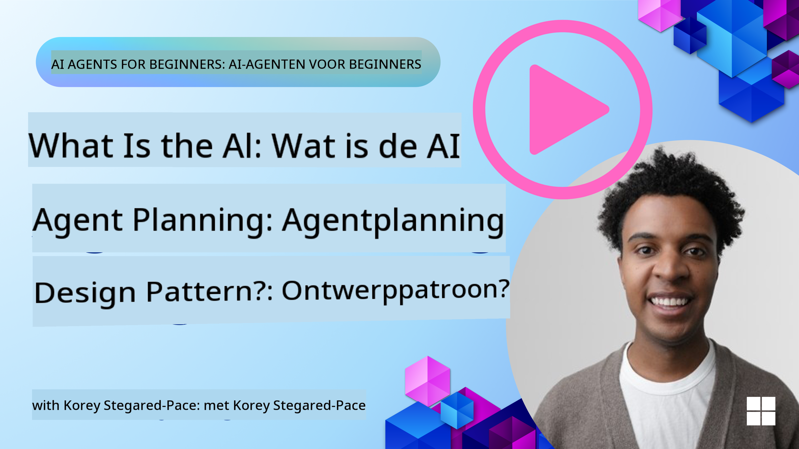
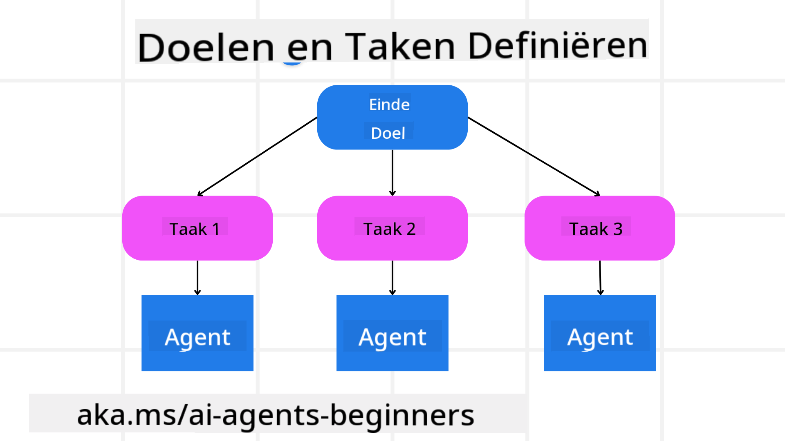

<!--
CO_OP_TRANSLATOR_METADATA:
{
  "original_hash": "43069833a0412210ad5c3cc93d9c2146",
  "translation_date": "2025-09-18T15:12:15+00:00",
  "source_file": "07-planning-design/README.md",
  "language_code": "nl"
}
-->
[](https://youtu.be/kPfJ2BrBCMY?si=9pYpPXp0sSbK91Dr)

> _(Klik op de afbeelding hierboven om de video van deze les te bekijken)_

# Plannen en Ontwerpen

## Introductie

Deze les behandelt:

* Het definiëren van een duidelijk algemeen doel en het opdelen van een complexe taak in beheersbare taken.
* Het benutten van gestructureerde output voor betrouwbaardere en machine-leesbare antwoorden.
* Het toepassen van een event-driven aanpak om dynamische taken en onverwachte invoer te verwerken.

## Leerdoelen

Na het voltooien van deze les heb je inzicht in:

* Het identificeren en stellen van een algemeen doel voor een AI-agent, zodat deze duidelijk weet wat er moet worden bereikt.
* Het opdelen van een complexe taak in beheersbare subtaken en deze organiseren in een logische volgorde.
* Het uitrusten van agents met de juiste tools (bijv. zoektools of data-analysetools), beslissen wanneer en hoe ze worden gebruikt, en omgaan met onverwachte situaties die zich voordoen.
* Het evalueren van de resultaten van subtaken, prestaties meten en acties herhalen om de uiteindelijke output te verbeteren.

## Het Definiëren van het Algemeen Doel en Het Opdelen van een Taak



De meeste taken in de echte wereld zijn te complex om in één stap aan te pakken. Een AI-agent heeft een beknopt doel nodig om zijn planning en acties te sturen. Bijvoorbeeld, overweeg het doel:

    "Genereer een reisroute voor 3 dagen."

Hoewel het eenvoudig te formuleren is, heeft het nog steeds verfijning nodig. Hoe duidelijker het doel, hoe beter de agent (en eventuele menselijke medewerkers) zich kunnen richten op het behalen van het juiste resultaat, zoals het creëren van een uitgebreide reisroute met vluchtopties, hotelaanbevelingen en activiteitensuggesties.

### Taakopdeling

Grote of ingewikkelde taken worden beheersbaarder wanneer ze worden opgesplitst in kleinere, doelgerichte subtaken.
Voor het voorbeeld van de reisroute kun je het doel opdelen in:

* Vlucht boeken
* Hotel boeken
* Auto huren
* Personalisatie

Elke subtaak kan vervolgens worden aangepakt door toegewijde agents of processen. Eén agent kan zich specialiseren in het zoeken naar de beste vluchtdeals, een andere richt zich op hotelboekingen, enzovoort. Een coördinerende of “downstream” agent kan deze resultaten vervolgens samenvoegen tot één samenhangende reisroute voor de eindgebruiker.

Deze modulaire aanpak maakt ook stapsgewijze verbeteringen mogelijk. Bijvoorbeeld, je kunt gespecialiseerde agents toevoegen voor voedselaanbevelingen of lokale activiteitensuggesties en de reisroute in de loop van de tijd verfijnen.

### Gestructureerde output

Grote Taalmodellen (LLMs) kunnen gestructureerde output genereren (bijv. JSON) die gemakkelijker te verwerken is door downstream agents of services. Dit is vooral nuttig in een multi-agent context, waar we deze taken kunnen uitvoeren nadat de planning-output is ontvangen. Zie hiervoor een snelle samenvatting.

De volgende Python-code laat zien hoe een eenvoudige planning-agent een doel opsplitst in subtaken en een gestructureerd plan genereert:

```python
from pydantic import BaseModel
from enum import Enum
from typing import List, Optional, Union
import json
import os
from typing import Optional
from pprint import pprint
from autogen_core.models import UserMessage, SystemMessage, AssistantMessage
from autogen_ext.models.azure import AzureAIChatCompletionClient
from azure.core.credentials import AzureKeyCredential

class AgentEnum(str, Enum):
    FlightBooking = "flight_booking"
    HotelBooking = "hotel_booking"
    CarRental = "car_rental"
    ActivitiesBooking = "activities_booking"
    DestinationInfo = "destination_info"
    DefaultAgent = "default_agent"
    GroupChatManager = "group_chat_manager"

# Travel SubTask Model
class TravelSubTask(BaseModel):
    task_details: str
    assigned_agent: AgentEnum  # we want to assign the task to the agent

class TravelPlan(BaseModel):
    main_task: str
    subtasks: List[TravelSubTask]
    is_greeting: bool

client = AzureAIChatCompletionClient(
    model="gpt-4o-mini",
    endpoint="https://models.inference.ai.azure.com",
    # To authenticate with the model you will need to generate a personal access token (PAT) in your GitHub settings.
    # Create your PAT token by following instructions here: https://docs.github.com/en/authentication/keeping-your-account-and-data-secure/managing-your-personal-access-tokens
    credential=AzureKeyCredential(os.environ["GITHUB_TOKEN"]),
    model_info={
        "json_output": False,
        "function_calling": True,
        "vision": True,
        "family": "unknown",
    },
)

# Define the user message
messages = [
    SystemMessage(content="""You are an planner agent.
    Your job is to decide which agents to run based on the user's request.
                      Provide your response in JSON format with the following structure:
{'main_task': 'Plan a family trip from Singapore to Melbourne.',
 'subtasks': [{'assigned_agent': 'flight_booking',
               'task_details': 'Book round-trip flights from Singapore to '
                               'Melbourne.'}
    Below are the available agents specialised in different tasks:
    - FlightBooking: For booking flights and providing flight information
    - HotelBooking: For booking hotels and providing hotel information
    - CarRental: For booking cars and providing car rental information
    - ActivitiesBooking: For booking activities and providing activity information
    - DestinationInfo: For providing information about destinations
    - DefaultAgent: For handling general requests""", source="system"),
    UserMessage(
        content="Create a travel plan for a family of 2 kids from Singapore to Melboune", source="user"),
]

response = await client.create(messages=messages, extra_create_args={"response_format": 'json_object'})

response_content: Optional[str] = response.content if isinstance(
    response.content, str) else None
if response_content is None:
    raise ValueError("Response content is not a valid JSON string" )

pprint(json.loads(response_content))

# # Ensure the response content is a valid JSON string before loading it
# response_content: Optional[str] = response.content if isinstance(
#     response.content, str) else None
# if response_content is None:
#     raise ValueError("Response content is not a valid JSON string")

# # Print the response content after loading it as JSON
# pprint(json.loads(response_content))

# Validate the response content with the MathReasoning model
# TravelPlan.model_validate(json.loads(response_content))
```

### Planning Agent met Multi-Agent Orchestratie

In dit voorbeeld ontvangt een Semantic Router Agent een gebruikersverzoek (bijv. "Ik heb een hotelplan nodig voor mijn reis.").

De planner:

* Ontvangt het Hotelplan: De planner neemt het bericht van de gebruiker en genereert, op basis van een systeemprompt (inclusief details over beschikbare agents), een gestructureerd reisplan.
* Lijst Agents en Hun Tools: Het agentregister bevat een lijst van agents (bijv. voor vluchten, hotels, autoverhuur en activiteiten) samen met de functies of tools die ze aanbieden.
* Routeert het Plan naar de Respectieve Agents: Afhankelijk van het aantal subtaken stuurt de planner het bericht rechtstreeks naar een toegewijde agent (voor enkelvoudige taken) of coördineert via een groepschatmanager voor samenwerking tussen meerdere agents.
* Vat het Resultaat Samen: Tot slot vat de planner het gegenereerde plan samen voor duidelijkheid.
De volgende Python-code illustreert deze stappen:

```python

from pydantic import BaseModel

from enum import Enum
from typing import List, Optional, Union

class AgentEnum(str, Enum):
    FlightBooking = "flight_booking"
    HotelBooking = "hotel_booking"
    CarRental = "car_rental"
    ActivitiesBooking = "activities_booking"
    DestinationInfo = "destination_info"
    DefaultAgent = "default_agent"
    GroupChatManager = "group_chat_manager"

# Travel SubTask Model

class TravelSubTask(BaseModel):
    task_details: str
    assigned_agent: AgentEnum # we want to assign the task to the agent

class TravelPlan(BaseModel):
    main_task: str
    subtasks: List[TravelSubTask]
    is_greeting: bool
import json
import os
from typing import Optional

from autogen_core.models import UserMessage, SystemMessage, AssistantMessage
from autogen_ext.models.openai import AzureOpenAIChatCompletionClient

# Create the client with type-checked environment variables

client = AzureOpenAIChatCompletionClient(
    azure_deployment=os.getenv("AZURE_OPENAI_DEPLOYMENT_NAME"),
    model=os.getenv("AZURE_OPENAI_DEPLOYMENT_NAME"),
    api_version=os.getenv("AZURE_OPENAI_API_VERSION"),
    azure_endpoint=os.getenv("AZURE_OPENAI_ENDPOINT"),
    api_key=os.getenv("AZURE_OPENAI_API_KEY"),
)

from pprint import pprint

# Define the user message

messages = [
    SystemMessage(content="""You are an planner agent.
    Your job is to decide which agents to run based on the user's request.
    Below are the available agents specialized in different tasks:
    - FlightBooking: For booking flights and providing flight information
    - HotelBooking: For booking hotels and providing hotel information
    - CarRental: For booking cars and providing car rental information
    - ActivitiesBooking: For booking activities and providing activity information
    - DestinationInfo: For providing information about destinations
    - DefaultAgent: For handling general requests""", source="system"),
    UserMessage(content="Create a travel plan for a family of 2 kids from Singapore to Melbourne", source="user"),
]

response = await client.create(messages=messages, extra_create_args={"response_format": TravelPlan})

# Ensure the response content is a valid JSON string before loading it

response_content: Optional[str] = response.content if isinstance(response.content, str) else None
if response_content is None:
    raise ValueError("Response content is not a valid JSON string")

# Print the response content after loading it as JSON

pprint(json.loads(response_content))
```

Wat volgt is de output van de vorige code en je kunt deze gestructureerde output vervolgens gebruiken om te routeren naar `assigned_agent` en de reisroute samen te vatten voor de eindgebruiker.

```json
{
    "is_greeting": "False",
    "main_task": "Plan a family trip from Singapore to Melbourne.",
    "subtasks": [
        {
            "assigned_agent": "flight_booking",
            "task_details": "Book round-trip flights from Singapore to Melbourne."
        },
        {
            "assigned_agent": "hotel_booking",
            "task_details": "Find family-friendly hotels in Melbourne."
        },
        {
            "assigned_agent": "car_rental",
            "task_details": "Arrange a car rental suitable for a family of four in Melbourne."
        },
        {
            "assigned_agent": "activities_booking",
            "task_details": "List family-friendly activities in Melbourne."
        },
        {
            "assigned_agent": "destination_info",
            "task_details": "Provide information about Melbourne as a travel destination."
        }
    ]
}
```

Een voorbeeldnotebook met de vorige code is beschikbaar [hier](07-autogen.ipynb).

### Iteratief Plannen

Sommige taken vereisen een heen-en-weer of herplanning, waarbij het resultaat van een subtaak invloed heeft op de volgende. Bijvoorbeeld, als de agent een onverwacht dataformaat ontdekt tijdens het boeken van vluchten, moet deze mogelijk zijn strategie aanpassen voordat hij verder gaat met hotelboekingen.

Daarnaast kan gebruikersfeedback (bijv. een mens die besluit dat ze een eerdere vlucht willen) een gedeeltelijke herplanning triggeren. Deze dynamische, iteratieve aanpak zorgt ervoor dat de uiteindelijke oplossing aansluit bij realistische beperkingen en veranderende gebruikersvoorkeuren.

Bijvoorbeeld voorbeeldcode:

```python
from autogen_core.models import UserMessage, SystemMessage, AssistantMessage
#.. same as previous code and pass on the user history, current plan
messages = [
    SystemMessage(content="""You are a planner agent to optimize the
    Your job is to decide which agents to run based on the user's request.
    Below are the available agents specialized in different tasks:
    - FlightBooking: For booking flights and providing flight information
    - HotelBooking: For booking hotels and providing hotel information
    - CarRental: For booking cars and providing car rental information
    - ActivitiesBooking: For booking activities and providing activity information
    - DestinationInfo: For providing information about destinations
    - DefaultAgent: For handling general requests""", source="system"),
    UserMessage(content="Create a travel plan for a family of 2 kids from Singapore to Melbourne", source="user"),
    AssistantMessage(content=f"Previous travel plan - {TravelPlan}", source="assistant")
]
# .. re-plan and send the tasks to respective agents
```

Voor meer uitgebreide planning, bekijk Magnetic One voor het oplossen van complexe taken.

## Samenvatting

In dit artikel hebben we gekeken naar een voorbeeld van hoe we een planner kunnen maken die dynamisch de beschikbare agents selecteert die zijn gedefinieerd. De output van de Planner splitst de taken op en wijst de agents toe zodat ze kunnen worden uitgevoerd. Er wordt aangenomen dat de agents toegang hebben tot de functies/tools die nodig zijn om de taak uit te voeren. Naast de agents kun je andere patronen zoals reflectie, samenvatting en round robin chat toevoegen om verder aan te passen.

## Aanvullende Bronnen

AutoGen Magnetic One - Een generalistisch multi-agent systeem voor het oplossen van complexe taken en heeft indrukwekkende resultaten behaald op meerdere uitdagende benchmarks voor agents. Referentie:

In deze implementatie creëert de orkestrator een taak-specifiek plan en delegeert deze taken aan de beschikbare agents. Naast planning gebruikt de orkestrator ook een trackingmechanisme om de voortgang van de taak te monitoren en indien nodig opnieuw te plannen.

### Heb je Meer Vragen over het Planning Design Pattern?

Word lid van de [Azure AI Foundry Discord](https://aka.ms/ai-agents/discord) om andere leerlingen te ontmoeten, spreekuren bij te wonen en je vragen over AI Agents beantwoord te krijgen.

## Vorige Les

[Vertrouwen Opbouwen in AI Agents](../06-building-trustworthy-agents/README.md)

## Volgende Les

[Multi-Agent Design Pattern](../08-multi-agent/README.md)

---

**Disclaimer**:  
Dit document is vertaald met behulp van de AI-vertalingsservice [Co-op Translator](https://github.com/Azure/co-op-translator). Hoewel we ons best doen voor nauwkeurigheid, dient u zich ervan bewust te zijn dat geautomatiseerde vertalingen fouten of onnauwkeurigheden kunnen bevatten. Het originele document in zijn oorspronkelijke taal moet worden beschouwd als de gezaghebbende bron. Voor cruciale informatie wordt professionele menselijke vertaling aanbevolen. Wij zijn niet aansprakelijk voor misverstanden of verkeerde interpretaties die voortvloeien uit het gebruik van deze vertaling.