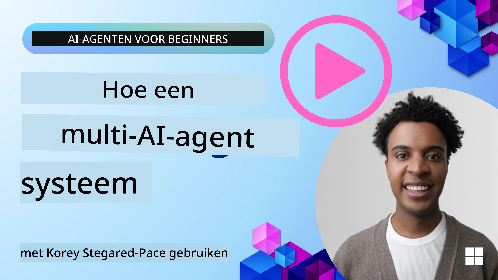
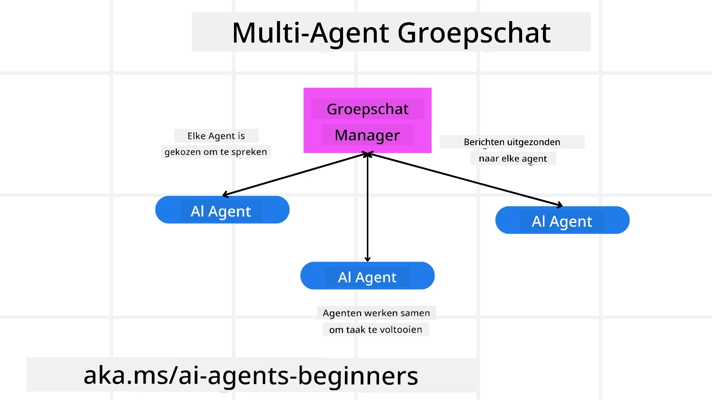
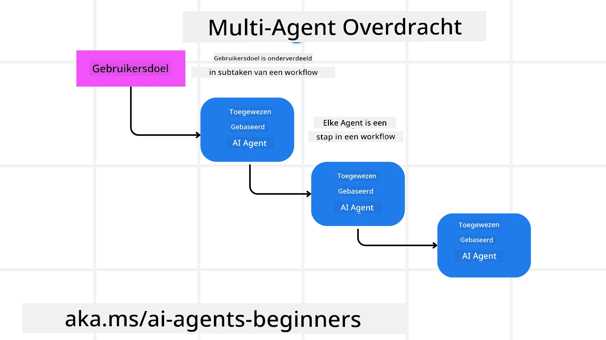
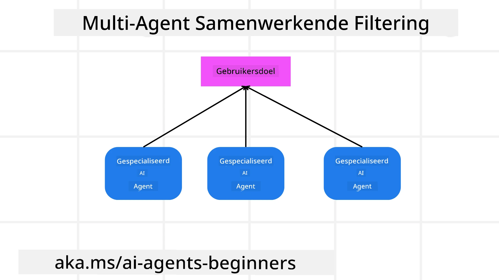

> _(Klik op de afbeelding hierboven om de video van deze les te bekijken)_

# Multi-agent ontwerppatronen

Zodra je begint te werken aan een project dat meerdere agenten omvat, moet je het multi-agent ontwerppatroon overwegen. Het kan echter niet meteen duidelijk zijn wanneer je moet overschakelen naar multi-agenten en wat de voordelen zijn.

## Introductie

In deze les proberen we de volgende vragen te beantwoorden:

- Wat zijn de scenario's waarbij multi-agenten van toepassing zijn?
- Wat zijn de voordelen van het gebruik van multi-agenten ten opzichte van slechts één enkele agent die meerdere taken uitvoert?
- Wat zijn de bouwstenen voor het implementeren van het multi-agent ontwerppatroon?
- Hoe krijg je inzicht in hoe de meerdere agenten met elkaar omgaan?

## Leerdoelen

Na deze les zou je in staat moeten zijn om:

- Scenario's te identificeren waarbij multi-agenten van toepassing zijn
- De voordelen te herkennen van het gebruik van multi-agenten boven een enkele agent.
- De bouwstenen te begrijpen voor het implementeren van het multi-agent ontwerppatroon.

Wat is het grotere geheel?

*Multi-agenten zijn een ontwerppatroon dat meerdere agenten in staat stelt samen te werken om een gemeenschappelijk doel te bereiken*.

Dit patroon wordt veel gebruikt in verschillende vakgebieden, waaronder robotica, autonome systemen en gedistribueerde computing.

## Scenario's waar multi-agenten van toepassing zijn

Dus welke scenario's zijn een goed gebruiksvoorbeeld voor het gebruik van multi-agenten? Het antwoord is dat er veel scenario's zijn waarbij het inzetten van meerdere agenten voordelig is, vooral in de volgende gevallen:

- **Grote werklast**: Grote werklasten kunnen worden opgesplitst in kleinere taken en toegewezen aan verschillende agenten, waardoor parallelle verwerking en snellere voltooiing mogelijk worden. Een voorbeeld hiervan is bij een grote gegevensverwerkingstaak.
- **Complexe taken**: Complexe taken, net als grote werklasten, kunnen worden opgesplitst in kleinere subtaken en toegewezen aan verschillende agenten, elke gespecialiseerd in een specifiek aspect van de taak. Een goed voorbeeld hiervan is bij autonome voertuigen waar verschillende agenten het navigeren, obstakeldetectie en communicatie met andere voertuigen beheren.
- **Diverse expertise**: Verschillende agenten kunnen diverse expertise bezitten, waardoor ze verschillende aspecten van een taak effectiever kunnen afhandelen dan een enkele agent. Een goed voorbeeld hiervan is in de gezondheidszorg waar agenten diagnoses, behandelplannen en patiëntbewaking kunnen beheren.

## Voordelen van het gebruik van multi-agenten boven een enkele agent

Een enkel agentsysteem kan goed werken voor eenvoudige taken, maar voor complexere taken kan het gebruik van meerdere agenten verschillende voordelen bieden:

- **Specialisatie**: Elke agent kan gespecialiseerd zijn voor een specifieke taak. Het ontbreken van specialisatie in een enkele agent betekent dat je een agent hebt die alles kan doen, maar in de war kan raken over wat te doen bij een complexe taak. Het kan bijvoorbeeld eindigen met het uitvoeren van een taak waarvoor het niet het best geschikt is.
- **Schaalbaarheid**: Het is makkelijker om systemen te schalen door meer agenten toe te voegen in plaats van een enkele agent te overladen.
- **Fouttolerantie**: Als een agent uitvalt, kunnen anderen blijven functioneren, wat zorgt voor systeembetrouwbaarheid.

Laten we een voorbeeld nemen, laten we een reis voor een gebruiker boeken. Een enkel agentsysteem zou alle aspecten van het boekingsproces van de reis moeten afhandelen, van het vinden van vluchten tot het boeken van hotels en huurauto's. Om dit met een enkele agent te doen, zou de agent tools nodig hebben om al deze taken te beheren. Dit kan leiden tot een complex en monolithisch systeem dat moeilijk te onderhouden en te schalen is. Een multi-agent systeem daarentegen kan verschillende agenten hebben die gespecialiseerd zijn in het vinden van vluchten, het boeken van hotels en huurauto's. Dit zou het systeem modularer, gemakkelijker te onderhouden en schaalbaar maken.

Vergelijk dit met een reisbureau gerund als een familiezaak versus een reisbureau gerund als een franchise. De familiezaak zou één agent hebben die alle aspecten van het boekingsproces afhandelt, terwijl de franchise verschillende agenten zou hebben die verschillende aspecten van het boekingsproces beheren.

## Bouwstenen voor het implementeren van het multi-agent ontwerppatroon

Voordat je het multi-agent ontwerppatroon kunt implementeren, moet je de bouwstenen begrijpen die het patroon vormen.

Laten we dit concreter maken door opnieuw te kijken naar het voorbeeld van het boeken van een reis voor een gebruiker. In dit geval zouden de bouwstenen het volgende omvatten:

- **Agentcommunicatie**: Agenten voor het vinden van vluchten, boeken van hotels en huurauto's moeten communiceren en informatie delen over de voorkeuren en beperkingen van de gebruiker. Je moet beslissen over de protocollen en methoden voor deze communicatie. Wat dit concreet betekent, is dat de agent voor het vinden van vluchten moet communiceren met de agent voor het boeken van hotels om ervoor te zorgen dat het hotel wordt geboekt voor dezelfde data als de vlucht. Dat betekent dat de agenten informatie moeten delen over de reisdata van de gebruiker, wat betekent dat je moet beslissen *welke agenten informatie delen en hoe ze die informatie delen*.
- **Coördinatiemechanismen**: Agenten moeten hun acties coördineren om ervoor te zorgen dat de voorkeuren en beperkingen van de gebruiker worden nageleefd. Een gebruikersvoorkeur kan zijn dat ze een hotel dicht bij de luchthaven willen, terwijl een beperking kan zijn dat huurauto's alleen op de luchthaven beschikbaar zijn. Dit betekent dat de agent voor het boeken van hotels moet coördineren met de agent voor het boeken van huurauto's om te verzekeren dat de voorkeuren en beperkingen worden nageleefd. Dit betekent dat je moet bepalen *hoe de agenten hun acties coördineren*.
- **Agentarchitectuur**: Agenten moeten de interne structuur hebben om beslissingen te nemen en te leren van hun interacties met de gebruiker. Dit betekent dat de agent voor het vinden van vluchten de interne structuur moet hebben om beslissingen te nemen over welke vluchten aan de gebruiker worden aanbevolen. Dit betekent dat je moet beslissen *hoe de agenten beslissingen nemen en leren van hun interacties met de gebruiker*. Voorbeelden van hoe een agent leert en verbetert kunnen zijn dat de agent voor het vinden van vluchten een machine learning-model kan gebruiken om vluchten aan te bevelen op basis van eerdere voorkeuren van de gebruiker.
- **Inzicht in multi-agent interacties**: Je moet inzicht hebben in hoe de meerdere agenten met elkaar omgaan. Dit betekent dat je hulpmiddelen en technieken nodig hebt voor het volgen van agentactiviteiten en interacties. Dit kan in de vorm zijn van loggen en monitoren, visualisatietools en prestatie-indicatoren.
- **Multi-agent patronen**: Er zijn verschillende patronen voor het implementeren van multi-agent systemen, zoals gecentraliseerde, gedecentraliseerde en hybride architecturen. Je moet kiezen welk patroon het beste past bij jouw gebruikssituatie.
- **Mens in de lus**: In de meeste gevallen is er een mens in de lus en moet je de agenten instrueren wanneer ze om menselijke tussenkomst moeten vragen. Dit kan bijvoorbeeld zijn wanneer een gebruiker vraagt om een specifiek hotel of vlucht die de agenten niet hebben aanbevolen, of om bevestiging voordat een vlucht of hotel wordt geboekt.

## Inzicht in multi-agent interacties

Het is belangrijk dat je inzicht hebt in hoe de meerdere agenten met elkaar omgaan. Dit inzicht is essentieel voor het debuggen, optimaliseren en waarborgen van de effectiviteit van het gehele systeem. Om dit te bereiken, heb je hulpmiddelen en technieken nodig voor het volgen van agentactiviteiten en interacties. Dit kan in de vorm zijn van log- en monitoringshulpmiddelen, visualisatietools en prestatie-indicatoren.

Bijvoorbeeld, in het geval van het boeken van een reis voor een gebruiker, zou je een dashboard kunnen hebben dat de status van elke agent toont, de voorkeuren en beperkingen van de gebruiker, en de interacties tussen agenten. Dit dashboard kan de reisdata van de gebruiker tonen, de door de vluchtagent aanbevolen vluchten, de door de hotelagent aanbevolen hotels en de door de huurauto-agent aanbevolen huurauto's. Dit geeft een duidelijk beeld van hoe de agenten met elkaar omgaan en of de voorkeuren en beperkingen van de gebruiker worden nageleefd.

Laten we elk van deze aspecten wat meer in detail bekijken.

- **Log- en monitoringshulpmiddelen**: Je wilt dat voor elke actie die een agent onderneemt gelogd wordt. Een logboekvermelding kan informatie opslaan over de agent die de actie uitvoerde, de uitgevoerde actie, het tijdstip van de actie en het resultaat ervan. Deze informatie kan vervolgens worden gebruikt voor debuggen, optimaliseren en meer.

- **Visualisatietools**: Visualisatietools kunnen je helpen de interacties tussen agenten intuïtiever te zien. Bijvoorbeeld, je kunt een grafiek hebben die de informatiestroom tussen agenten toont. Dit kan helpen knelpunten, inefficiënties en andere problemen in het systeem te identificeren.

- **Prestatie-indicatoren**: Prestatie-indicatoren kunnen helpen de effectiviteit van het multi-agent systeem te volgen. Bijvoorbeeld, je kunt de tijd volgen die nodig is om een taak te voltooien, het aantal taken voltooid per tijdseenheid, en de nauwkeurigheid van de aanbevelingen die door de agenten worden gedaan. Deze informatie kan helpen verbeterpunten te identificeren en het systeem te optimaliseren.

## Multi-agent patronen

Laten we wat concrete patronen bekijken die we kunnen gebruiken om multi-agent apps te creëren. Hier zijn enkele interessante patronen die het overwegen waard zijn:

### Groepschat

Dit patroon is nuttig wanneer je een groepschatapplicatie wilt creëren waarin meerdere agenten met elkaar kunnen communiceren. Typische gebruikssituaties voor dit patroon zijn teamcollaboratie, klantenondersteuning en sociale netwerken.

In dit patroon vertegenwoordigt elke agent een gebruiker in de groepschat, en worden berichten uitgewisseld tussen agenten via een berichtprotocol. De agenten kunnen berichten naar de groepschat sturen, berichten ontvangen uit de groepschat en reageren op berichten van andere agenten.

Dit patroon kan worden geïmplementeerd met een gecentraliseerde architectuur waarbij alle berichten via een centrale server lopen, of met een gedecentraliseerde architectuur waarbij berichten direct worden uitgewisseld.

### Overdracht

Dit patroon is nuttig wanneer je een applicatie wilt creëren waarbij meerdere agenten taken aan elkaar kunnen overdragen.

Typische gebruikssituaties voor dit patroon zijn klantenondersteuning, taakbeheer en workflowautomatisering.

In dit patroon vertegenwoordigt elke agent een taak of stap in een workflow, en kunnen agenten taken aan andere agenten overdragen op basis van vooraf bepaalde regels.

### Collaborative filtering

Dit patroon is nuttig wanneer je een applicatie wilt creëren waarbij meerdere agenten samenwerken om aanbevelingen aan gebruikers te doen.

De reden waarom je meerdere agenten wilt laten samenwerken is dat elke agent een andere expertise kan hebben en op verschillende manieren kan bijdragen aan het aanbevelingsproces.

Laten we een voorbeeld nemen waarbij een gebruiker een aanbeveling wil over de beste aandelen om te kopen op de aandelenmarkt.

- **Industrie-expert**: Een agent kan expert zijn in een specifieke industrie.
- **Technische analyse**: Een andere agent kan expert zijn in technische analyse.
- **Fundamentele analyse**: En weer een andere agent kan expert zijn in fundamentele analyse. Door samen te werken kunnen deze agenten een meer omvattende aanbeveling aan de gebruiker geven.

## Scenario: Refund proces

Overweeg een scenario waarbij een klant probeert een terugbetaling te krijgen voor een product; er kunnen best wat agenten betrokken zijn in dit proces, maar laten we het opdelen in agenten specifiek voor dit proces en algemene agenten die voor andere processen kunnen worden gebruikt.

**Agenten specifiek voor het refund proces**:

Hieronder volgen enkele agenten die betrokken kunnen zijn bij het refund proces:

- **Klant-agent**: Deze agent vertegenwoordigt de klant en is verantwoordelijk voor het starten van het terugbetalingsproces.
- **Verkoper-agent**: Deze agent vertegenwoordigt de verkoper en is verantwoordelijk voor het verwerken van de terugbetaling.
- **Betaal-agent**: Deze agent vertegenwoordigt het betalingsproces en is verantwoordelijk voor het terugbetalen van de betaling aan de klant.
- **Oplossings-agent**: Deze agent vertegenwoordigt het oplossingsproces en is verantwoordelijk voor het oplossen van eventuele problemen die ontstaan tijdens het terugbetalingsproces.
- **Compliance-agent**: Deze agent vertegenwoordigt het nalevingsproces en is verantwoordelijk voor het waarborgen dat het terugbetalingsproces voldoet aan regels en beleid.

**Algemene agenten**:

Deze agenten kunnen door andere delen van jouw bedrijf worden gebruikt.

- **Verzend-agent**: Deze agent vertegenwoordigt het verzendproces en is verantwoordelijk voor het terugsturen van het product naar de verkoper. Deze agent kan worden gebruikt voor zowel het terugbetalingsproces als voor algemene verzending van een product via bijvoorbeeld een aankoop.
- **Feedback-agent**: Deze agent vertegenwoordigt het feedbackproces en is verantwoordelijk voor het verzamelen van feedback van de klant. Feedback kan op elk moment worden verzameld, niet alleen tijdens het refund proces.
- **Escalatie-agent**: Deze agent vertegenwoordigt het escalatieproces en is verantwoordelijk voor het escaleren van problemen naar een hoger ondersteuningsniveau. Je kunt dit type agent gebruiken voor elk proces waarbij een probleem geëscaleerd moet worden.
- **Notificatie-agent**: Deze agent vertegenwoordigt het notificatieproces en is verantwoordelijk voor het verzenden van meldingen aan de klant in verschillende stadia van het terugbetalingsproces.
- **Analytics-agent**: Deze agent vertegenwoordigt het analyseproces en is verantwoordelijk voor het analyseren van gegevens gerelateerd aan het terugbetalingsproces.
- **Audit-agent**: Deze agent vertegenwoordigt het auditproces en is verantwoordelijk voor het auditen van het terugbetalingsproces om ervoor te zorgen dat het correct wordt uitgevoerd.
- **Rapportage-agent**: Deze agent vertegenwoordigt het rapportageproces en is verantwoordelijk voor het genereren van rapporten over het terugbetalingsproces.
- **Kennis-agent**: Deze agent vertegenwoordigt het kennisproces en is verantwoordelijk voor het onderhouden van een kennisdatabase met informatie gerelateerd aan het terugbetalingsproces. Deze agent zou zowel kennis kunnen hebben over terugbetalingen als andere delen van jouw bedrijf.
- **Beveiligings-agent**: Deze agent vertegenwoordigt het beveiligingsproces en is verantwoordelijk voor het waarborgen van de beveiliging van het terugbetalingsproces.
- **Kwaliteits-agent**: Deze agent vertegenwoordigt het kwaliteitsproces en is verantwoordelijk voor het waarborgen van de kwaliteit van het terugbetalingsproces.

Er zijn behoorlijk wat agenten hierboven opgesomd, zowel specifiek voor het terugbetalingsproces als ook voor de algemene agenten die in andere delen van jouw bedrijf kunnen worden gebruikt. Hopelijk geeft dit je een idee hoe je kunt beslissen welke agenten je gebruikt in je multi-agent systeem.

## Opdracht

Ontwerp een multi-agent systeem voor een klantenondersteuningsproces. Identificeer de betrokken agenten, hun rollen en verantwoordelijkheden, en hoe ze met elkaar interacteren. Overweeg zowel agenten die specifiek zijn voor het klantenondersteuningsproces als algemene agenten die in andere delen van jouw bedrijf gebruikt kunnen worden.
> Denk er eerst even over na voordat je de volgende oplossing leest, je hebt mogelijk meer agenten nodig dan je denkt.

> TIP: Denk na over de verschillende fasen van het klantenondersteuningsproces en overweeg ook agenten die nodig zijn voor elk systeem.

## Oplossing

[Oplossing](./solution/solution.md)

## Kenniscontroles

Vraag: Wanneer moet je overwegen om multi-agenten te gebruiken?

- [ ] A1: Wanneer je een kleine werklast en een eenvoudige taak hebt.
- [ ] A2: Wanneer je een grote werklast hebt.
- [ ] A3: Wanneer je een eenvoudige taak hebt.

[Oplossing quiz](./solution/solution-quiz.md)

## Samenvatting

In deze les hebben we gekeken naar het multi-agent ontwerp patroon, inclusief de scenario's waarin multi-agenten toepasbaar zijn, de voordelen van het gebruik van multi-agenten vergeleken met een enkele agent, de bouwstenen voor het implementeren van het multi-agent ontwerp patroon, en hoe je inzicht kunt krijgen in hoe de meerdere agenten met elkaar omgaan.

### Meer vragen over het Multi-Agent Ontwerp Patroon?

Word lid van de [Microsoft Foundry Discord](https://aka.ms/ai-agents/discord) om andere leerlingen te ontmoeten, deel te nemen aan kantooruren en jouw vragen over AI Agents beantwoord te krijgen.

## Aanvullende bronnen

- <a href="https://learn.microsoft.com/azure/ai-services/agents/overview" target="_blank">Microsoft Agent Framework documentatie</a>
- <a href="https://www.analyticsvidhya.com/blog/2024/10/agentic-design-patterns/" target="_blank">Agentische ontwerp patronen</a>

## Vorige Les

[Planning Ontwerp](../07-planning-design/README.md)

## Volgende Les

[Metacognitie in AI Agents](../09-metacognition/README.md)

---

<!-- CO-OP TRANSLATOR DISCLAIMER START -->
**Disclaimer**:
Dit document is vertaald met behulp van de AI-vertalingsdienst [Co-op Translator](https://github.com/Azure/co-op-translator). Hoewel we streven naar nauwkeurigheid, dient u er rekening mee te houden dat automatische vertalingen fouten of onnauwkeurigheden kunnen bevatten. Het originele document in de oorspronkelijke taal moet als de gezaghebbende bron worden beschouwd. Voor belangrijke informatie wordt professionele menselijke vertaling aanbevolen. Wij zijn niet aansprakelijk voor misverstanden of verkeerde interpretaties die voortvloeien uit het gebruik van deze vertaling.
<!-- CO-OP TRANSLATOR DISCLAIMER END -->