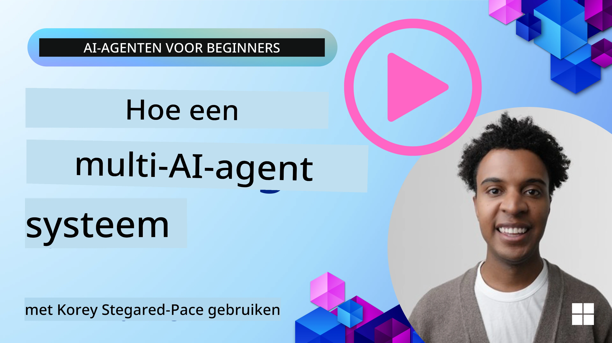
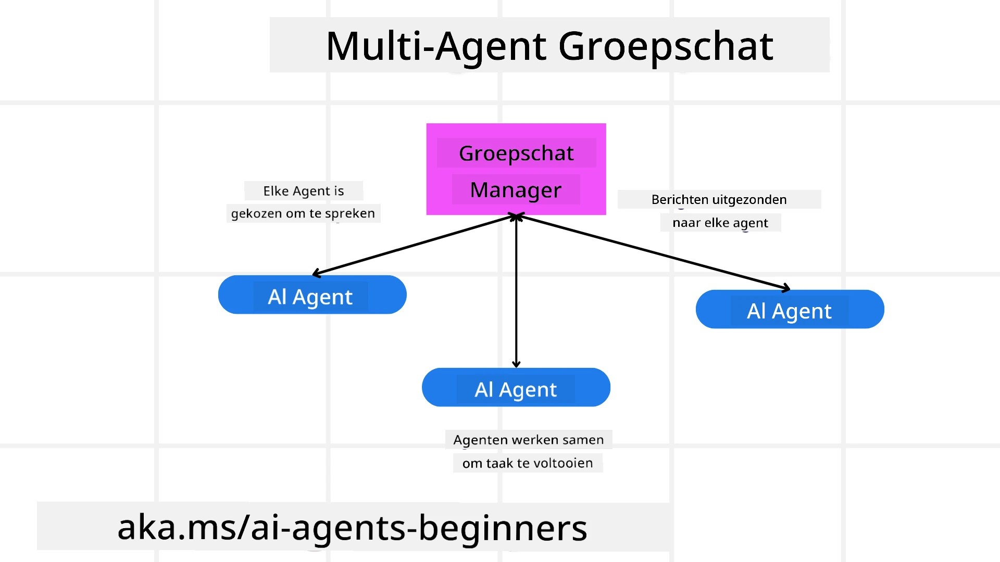
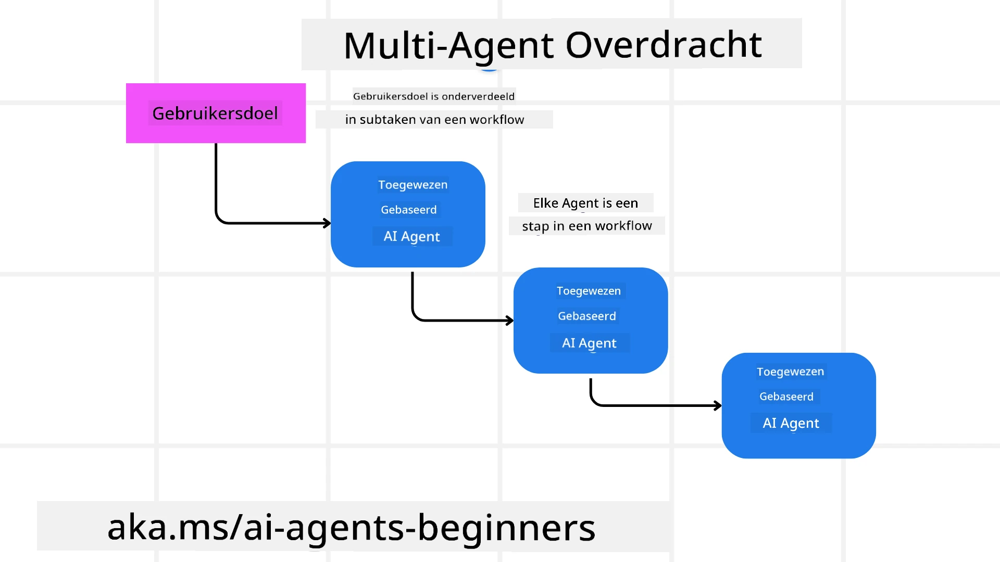
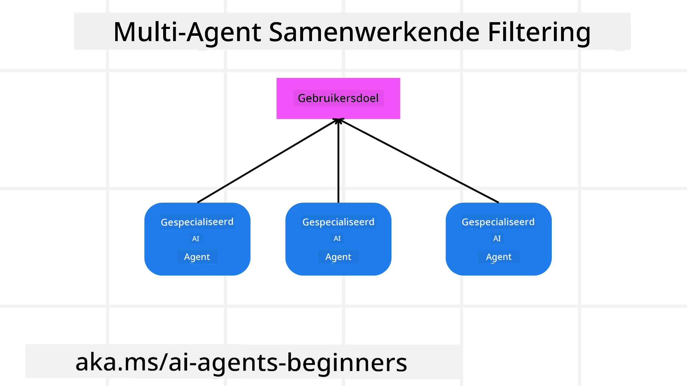

> _(Klik op de bovenstaande afbeelding om de video van deze les te bekijken)_

# Multi-agent ontwerp patronen

Zodra je begint te werken aan een project waarbij meerdere agenten betrokken zijn, moet je rekening houden met het multi-agent ontwerp patroon. Het is echter misschien niet direct duidelijk wanneer je moet overschakelen naar meerdere agenten en wat de voordelen zijn.

## Introductie

In deze les proberen we de volgende vragen te beantwoorden:

- Wat zijn de scenario's waarbij multi-agenten toepasbaar zijn?
- Wat zijn de voordelen van het gebruik van multi-agenten ten opzichte van slechts één enkele agent die meerdere taken uitvoert?
- Wat zijn de bouwstenen voor het implementeren van het multi-agent ontwerp patroon?
- Hoe krijgen we zicht op hoe de meerdere agenten met elkaar interageren?

## Leerdoelen

Na deze les zou je in staat moeten zijn om:

- Scenario's te identificeren waarbij multi-agenten toepasbaar zijn
- De voordelen van het gebruik van multi-agenten ten opzichte van een enkele agent te herkennen.
- De bouwstenen van het implementeren van het multi-agent ontwerp patroon te begrijpen.

Wat is het grotere plaatje?

*Multi-agenten zijn een ontwerp patroon dat meerdere agenten in staat stelt samen te werken om een gemeenschappelijk doel te bereiken*.

Dit patroon wordt veel gebruikt in verschillende vakgebieden, waaronder robotica, autonome systemen en gedistribueerde informatica.

## Scenario's waarin Multi-Agenten Toepasbaar zijn

Dus, welke scenario's zijn een goed voorbeeld voor het gebruik van multi-agenten? Het antwoord is dat er veel scenario's zijn waarin het inzetten van meerdere agenten voordelig is, vooral in de volgende gevallen:

- **Grote werklasten**: Grote werklasten kunnen worden verdeeld in kleinere taken en toegewezen aan verschillende agenten, waardoor parallellisatie en snellere voltooiing mogelijk zijn. Een voorbeeld hiervan is bij een grote taak voor dataverwerking.
- **Complexe taken**: Net als grote werklasten kunnen complexe taken worden opgesplitst in kleinere subtaken en toegewezen worden aan verschillende agenten, elk gespecialiseerd in een specifiek aspect van de taak. Een goed voorbeeld hiervan is bij autonome voertuigen waarbij verschillende agenten navigatie, obstakeldetectie en communicatie met andere voertuigen beheren.
- **Diverse expertise**: Verschillende agenten kunnen diverse expertise hebben, waardoor ze verschillende aspecten van een taak effectiever kunnen aanpakken dan een enkele agent. Een goed voorbeeld hierbij is de gezondheidszorg, waar agenten verantwoordelijk kunnen zijn voor diagnostiek, behandelplannen en patiëntmonitoring.

## Voordelen van het Gebruik van Multi-Agenten ten opzichte van een Enkele Agent

Een enkel agenten systeem kan goed werken voor eenvoudige taken, maar voor complexere taken kan het gebruik van meerdere agenten verschillende voordelen bieden:

- **Specialisatie**: Elke agent kan gespecialiseerd zijn voor een specifieke taak. Het gebrek aan specialisatie in een enkele agent betekent dat je een agent hebt die alles kan doen, maar mogelijk in de war raakt over wat te doen bij een complexe taak. Het kan bijvoorbeeld een taak uitvoeren waarvoor het niet het beste geschikt is.
- **Schaalbaarheid**: Het is makkelijker om systemen op te schalen door meer agenten toe te voegen in plaats van een enkele agent te overbelasten.
- **Fouttolerantie**: Als één agent faalt, kunnen andere agenten blijven functioneren, wat de betrouwbaarheid van het systeem waarborgt.

Laten we een voorbeeld nemen waarbij we een reis voor een gebruiker boeken. Een enkel agenten systeem zou alle aspecten van het boeken van de reis moeten afhandelen, van het vinden van vluchten tot het boeken van hotels en huurauto's. Om dit met één agent te bereiken, zou de agent tools moeten hebben voor het afhandelen van al deze taken. Dit zou kunnen leiden tot een complex en monolithisch systeem dat moeilijk te onderhouden en te schalen is. Een multi-agenten systeem daarentegen kan verschillende agenten hebben die gespecialiseerd zijn in het vinden van vluchten, het boeken van hotels, en huurauto's. Dit maakt het systeem modularer, gemakkelijker te onderhouden en schaalbaar.

Vergelijk dit met een reisbureau dat wordt gerund als een familiebedrijf versus een franchise. Het familiebedrijf zou één agent hebben die alle aspecten van het boeken van de reis afhandelt, terwijl de franchise verschillende agenten zou hebben die verschillende aspecten van het boeken afhandelen.

## Bouwstenen van het Implementeren van het Multi-Agent Ontwerp Patroon

Voordat je het multi-agent ontwerp patroon kunt implementeren, moet je de bouwstenen begrijpen die het patroon vormen.

Laten we dit concreter maken door opnieuw te kijken naar het voorbeeld van het boeken van een reis voor een gebruiker. In dit geval omvatten de bouwstenen:

- **Agentcommunicatie**: Agenten voor het vinden van vluchten, het boeken van hotels en huurauto's moeten communiceren en informatie delen over de voorkeuren en beperkingen van de gebruiker. Je moet besluiten over de protocollen en methoden voor deze communicatie. Dit betekent concreet dat de agent voor het vinden van vluchten moet communiceren met de agent voor het boeken van hotels om te zorgen dat het hotel geboekt wordt voor dezelfde data als de vlucht. Dit betekent dat de agenten informatie moeten delen over de reisdagen van de gebruiker, wat betekent dat je moet beslissen *welke agenten info delen en hoe ze die info delen*.
- **Coördinatiemechanismen**: Agenten moeten hun acties coördineren om te garanderen dat de voorkeuren en beperkingen van de gebruiker worden nageleefd. Een gebruikersvoorkeur zou kunnen zijn dat ze een hotel dichtbij het vliegveld willen, terwijl een beperking zou kunnen zijn dat huurauto's alleen beschikbaar zijn op het vliegveld. Dit betekent dat de agent voor het boeken van hotels moet coördineren met de agent voor het boeken van huurauto's om te zorgen dat de voorkeuren en beperkingen van de gebruiker worden nageleefd. Dit betekent dat je moet beslissen *hoe de agenten hun acties coördineren*.
- **Agentarchitectuur**: Agenten moeten de interne structuur hebben om beslissingen te nemen en te leren van hun interacties met de gebruiker. Dit betekent dat de agent voor het vinden van vluchten een interne structuur moet hebben om beslissingen te nemen over welke vluchten aan de gebruiker worden aanbevolen. Dit betekent dat je moet beslissen *hoe de agenten beslissingen nemen en leren van hun interacties met de gebruiker*. Voorbeelden van hoe een agent leert en verbetert kunnen zijn dat de agent voor het vinden van vluchten een machine learning-model gebruikt om vluchten aan te bevelen op basis van de voorkeuren uit het verleden.
- **Zichtbaarheid in Multi-Agent Interacties**: Je moet zicht hebben op hoe de meerdere agenten met elkaar interageren. Dit betekent dat je tools en technieken moet hebben voor het volgen van agentactiviteiten en interacties. Dit kan in de vorm van logging- en monitoringtools, visualisatietools en prestatiestatistieken.
- **Multi-Agent Patronen**: Er zijn verschillende patronen voor het implementeren van multi-agent systemen, zoals gecentraliseerde, gedecentraliseerde en hybride architecturen. Je moet beslissen welk patroon het beste past bij jouw use case.
- **Mens in de lus**: In de meeste gevallen heb je een mens in de lus en je moet de agenten instrueren wanneer ze menselijke interventie moeten vragen. Dit kan bijvoorbeeld zijn wanneer een gebruiker vraagt om een specifiek hotel of vlucht dat de agenten niet hebben aanbevolen of wanneer om bevestiging wordt gevraagd voordat een vlucht of hotel wordt geboekt.

## Zichtbaarheid in Multi-Agent Interacties

Het is belangrijk dat je zicht hebt op hoe de meerdere agenten met elkaar interageren. Deze zichtbaarheid is essentieel voor debuggen, optimaliseren en het waarborgen van de effectiviteit van het gehele systeem. Om dit te bereiken, moet je tools en technieken hebben voor het volgen van agentactiviteiten en interacties. Dit kan in de vorm van logging- en monitoringtools, visualisatietools en prestatiestatistieken.

Bijvoorbeeld, in het geval van het boeken van een reis voor een gebruiker, zou je een dashboard kunnen hebben dat de status van elke agent laat zien, de voorkeuren en beperkingen van de gebruiker, en de interacties tussen agenten. Dit dashboard zou de reisdagen van de gebruiker kunnen tonen, de vluchten aanbevolen door de vluchtagent, de hotels aanbevolen door de hotelagent, en de huurauto's aanbevolen door de huurauto-agent. Dit geeft je een duidelijk beeld van hoe de agenten met elkaar interageren en of de voorkeuren en beperkingen van de gebruiker worden nageleefd.

Laten we elk van deze aspecten wat gedetailleerder bekijken.

- **Logging- en monitoringtools**: Je wilt dat elke actie die door een agent wordt ondernomen wordt gelogd. Een logvermelding kan informatie bevatten over de agent die de actie heeft uitgevoerd, de uitgevoerde actie, het tijdstip van de actie en de uitkomst. Deze informatie kan vervolgens worden gebruikt voor debuggen, optimaliseren en meer.

- **Visualisatietools**: Visualisatietools kunnen je helpen de interacties tussen agenten op een meer intuïtieve manier te zien. Bijvoorbeeld, je zou een grafiek kunnen hebben die de informatiestroom tussen agenten toont. Dit kan helpen bij het identificeren van knelpunten, inefficiënties en andere problemen in het systeem.

- **Prestatiestatistieken**: Prestatiestatistieken kunnen je helpen de effectiviteit van het multi-agent systeem te volgen. Bijvoorbeeld, je zou de tijd kunnen bijhouden die nodig is om een taak te voltooien, het aantal voltooide taken per tijdseenheid, en de nauwkeurigheid van de aanbevelingen die de agenten maken. Deze informatie kan je helpen verbeterpunten te identificeren en het systeem te optimaliseren.

## Multi-Agent Patronen

Laten we enkele concrete patronen bekijken die we kunnen gebruiken om multi-agent apps te creëren. Hier zijn enkele interessante patronen die het overwegen waard zijn:

### Groepschat

Dit patroon is nuttig als je een groepschatapplicatie wilt creëren waarin meerdere agenten met elkaar kunnen communiceren. Typische use cases voor dit patroon zijn team samenwerking, klantenservice en sociale netwerken.

In dit patroon vertegenwoordigt elke agent een gebruiker in de groepschat en worden berichten uitgewisseld tussen agenten via een messagingprotocol. De agenten kunnen berichten naar de groepschat sturen, berichten van de groepschat ontvangen en reageren op berichten van andere agenten.

Dit patroon kan worden geïmplementeerd met een gecentraliseerde architectuur waarbij alle berichten via een centrale server worden geleid, of een gedecentraliseerde architectuur waarbij berichten direct worden uitgewisseld.

### Overdracht

Dit patroon is nuttig wanneer je een applicatie wilt creëren waarin meerdere agenten taken aan elkaar kunnen overdragen.

Typische use cases voor dit patroon zijn klantenservice, taakbeheer en workflowautomatisering.

In dit patroon vertegenwoordigt elke agent een taak of een stap in een workflow, en agenten kunnen taken aan andere agenten overdragen op basis van vooraf gedefinieerde regels.

### Collaboratief filteren

Dit patroon is nuttig wanneer je een applicatie wilt creëren waarin meerdere agenten samenwerken om aanbevelingen aan gebruikers te doen.

Waarom je meerdere agenten wilt laten samenwerken is omdat elke agent verschillende expertise kan hebben en op verschillende manieren kan bijdragen aan het aanbevelingsproces.

Laten we een voorbeeld nemen waarbij een gebruiker een aanbeveling wil voor het beste aandeel om te kopen op de aandelenmarkt.

- **Industrie-expert**: Een agent zou een expert in een specifieke industrie kunnen zijn.
- **Technische analyse**: Een andere agent zou een expert kunnen zijn in technische analyse.
- **Fundamentele analyse**: en een andere agent zou een expert kunnen zijn in fundamentele analyse. Door samen te werken kunnen deze agenten een meer volledige aanbeveling aan de gebruiker doen.

## Scenario: Terugbetalingsproces

Beschouw een scenario waarbij een klant probeert een terugbetaling voor een product te krijgen; er kunnen best wat agenten betrokken zijn bij dit proces, maar laten we het opdelen in agenten specifiek voor dit proces en algemene agenten die in andere processen gebruikt kunnen worden.

**Agenten specifiek voor het terugbetalingsproces**:

Hieronder volgen enkele agenten die betrokken kunnen zijn bij het terugbetalingsproces:

- **Klantenagent**: Deze agent vertegenwoordigt de klant en is verantwoordelijk voor het initiëren van het terugbetalingsproces.
- **Verkopersagent**: Deze agent vertegenwoordigt de verkoper en is verantwoordelijk voor het afhandelen van de terugbetaling.
- **Betaalagent**: Deze agent vertegenwoordigt het betalingsproces en is verantwoordelijk voor het terugbetalen van de betaling aan de klant.
- **Oplossingsagent**: Deze agent vertegenwoordigt het oplossingsproces en is verantwoordelijk voor het oplossen van eventuele problemen die tijdens het terugbetalingsproces ontstaan.
- **Compliance-agent**: Deze agent vertegenwoordigt het compliance-proces en is verantwoordelijk voor het waarborgen dat het terugbetalingsproces voldoet aan regelgeving en beleidsregels.

**Algemene agenten**:

Deze agenten kunnen door andere delen van jouw bedrijf worden gebruikt.

- **Verzendagent**: Deze agent vertegenwoordigt het verzendproces en is verantwoordelijk voor het terugsturen van het product naar de verkoper. Deze agent kan zowel voor het terugbetalingsproces als voor algemene verzending van een product via een aankoop worden gebruikt.
- **Feedbackagent**: Deze agent vertegenwoordigt het feedbackproces en is verantwoordelijk voor het verzamelen van feedback van de klant. Feedback kan op elk moment worden gegeven, niet alleen tijdens het terugbetalingsproces.
- **Escalatie-agent**: Deze agent vertegenwoordigt het escalatieproces en is verantwoordelijk voor het doorverwijzen van problemen naar een hoger niveau van ondersteuning. Dit type agent kun je voor elk proces gebruiken waarbij je een probleem moet escaleren.
- **Notificatieagent**: Deze agent vertegenwoordigt het notificatieproces en is verantwoordelijk voor het sturen van meldingen naar de klant in verschillende stadia van het terugbetalingsproces.
- **Analytics-agent**: Deze agent vertegenwoordigt het analytics-proces en is verantwoordelijk voor het analyseren van gegevens gerelateerd aan het terugbetalingsproces.
- **Auditagent**: Deze agent vertegenwoordigt het auditproces en is verantwoordelijk voor het controleren van het terugbetalingsproces om te waarborgen dat het correct wordt uitgevoerd.
- **Rapportageagent**: Deze agent vertegenwoordigt het rapportageproces en is verantwoordelijk voor het genereren van rapporten over het terugbetalingsproces.
- **Kennisagent**: Deze agent vertegenwoordigt het kennisproces en is verantwoordelijk voor het onderhouden van een kennisbank met informatie gerelateerd aan het terugbetalingsproces. Deze agent zou kennis kunnen hebben over zowel terugbetalingen als andere delen van jouw bedrijf.
- **Beveiligingsagent**: Deze agent vertegenwoordigt het beveiligingsproces en is verantwoordelijk voor het waarborgen van de beveiliging van het terugbetalingsproces.
- **Kwaliteitsagent**: Deze agent vertegenwoordigt het kwaliteitsproces en is verantwoordelijk voor het waarborgen van de kwaliteit van het terugbetalingsproces.

Er staan aardig wat agenten hierboven genoemd, zowel voor het specifieke terugbetalingsproces als de algemene agenten die in andere delen van jouw bedrijf gebruikt kunnen worden. Hopelijk geeft dit je een idee hoe je kunt beslissen welke agenten je in jouw multi-agent systeem gebruikt.

## Opdracht

Ontwerp een multi-agent systeem voor een klantenserviceproces. Identificeer de agenten die bij het proces betrokken zijn, hun rollen en verantwoordelijkheden, en hoe ze met elkaar interacteren. Overweeg zowel agenten specifiek voor het klantenserviceproces als algemene agenten die in andere delen van jouw bedrijf gebruikt kunnen worden.

> Denk even na voordat je de volgende oplossing leest, je hebt misschien meer agenten nodig dan je denkt.

> TIP: Denk na over de verschillende stadia van het klantondersteuningsproces en overweeg ook agenten die nodig zijn voor elk systeem.

## Oplossing

[Oplossing](./solution/solution.md)

## Kenniscontroles

### Vraag 1

Welk scenario is het beste geschikt voor een multi-agentensysteem?

- [ ] A1: Een supportbot beantwoordt veelgestelde vragen met één kennisbank en een kleine set tools.
- [ ] A2: Een terugbetalingsworkflow heeft aparte rollen voor fraude, betaling en naleving, elk met eigen tools, en hun resultaten moeten worden gecoördineerd.
- [ ] A3: Dezelfde eenvoudige classificatie aanvraag komt duizenden keren per uur binnen.

### Vraag 2

Wanneer is een enkele agent meestal de betere keuze?

- [ ] A1: De taak kan worden uitgevoerd met één set instructies en tools, zonder specialistische overdrachten.
- [ ] A2: De agent heeft toegang tot meer dan één tool.
- [ ] A3: De workflow vereist aparte rollen met verschillende bevoegdheden en onafhankelijke audit trails.

[Oplossing quiz](./solution/solution-quiz.md)

## Samenvatting

In deze les hebben we gekeken naar het multi-agentontwerppatroon, inclusief de scenario’s waarin multi-agenten toepasbaar zijn, de voordelen van het gebruik van multi-agenten boven een enkele agent, de bouwstenen voor het implementeren van het multi-agentontwerppatroon, en hoe je inzicht krijgt in hoe de verschillende agenten met elkaar samenwerken.

### Heb je meer vragen over het Multi-Agent Design Pattern?

Word lid van de [Microsoft Foundry Discord](https://discord.com/invite/ATgtXmAS5D) om andere leerlingen te ontmoeten, office hours bij te wonen en je vragen over AI-agenten beantwoord te krijgen.

## Aanvullende bronnen

- <a href="https://learn.microsoft.com/azure/ai-services/agents/overview" target="_blank">Microsoft Agent Framework documentatie</a>
- <a href="https://www.analyticsvidhya.com/blog/2024/10/agentic-design-patterns/" target="_blank">Agentic ontwerppatronen</a>

## Vorige les

[Planning Design](../07-planning-design/README.md)

## Volgende les

[Metacognition in AI Agents](../09-metacognition/README.md)

---

<!-- CO-OP TRANSLATOR DISCLAIMER START -->
**Disclaimer**:
Dit document is vertaald met behulp van de AI vertaaldienst [Co-op Translator](https://github.com/Azure/co-op-translator). Hoewel we streven naar nauwkeurigheid, dient u er rekening mee te houden dat geautomatiseerde vertalingen fouten of onnauwkeurigheden kunnen bevatten. Het originele document in de oorspronkelijke taal moet worden beschouwd als de gezaghebbende bron. Voor kritieke informatie wordt professionele menselijke vertaling aanbevolen. Wij zijn niet aansprakelijk voor eventuele misverstanden of verkeerde interpretaties die voortvloeien uit het gebruik van deze vertaling.
<!-- CO-OP TRANSLATOR DISCLAIMER END -->