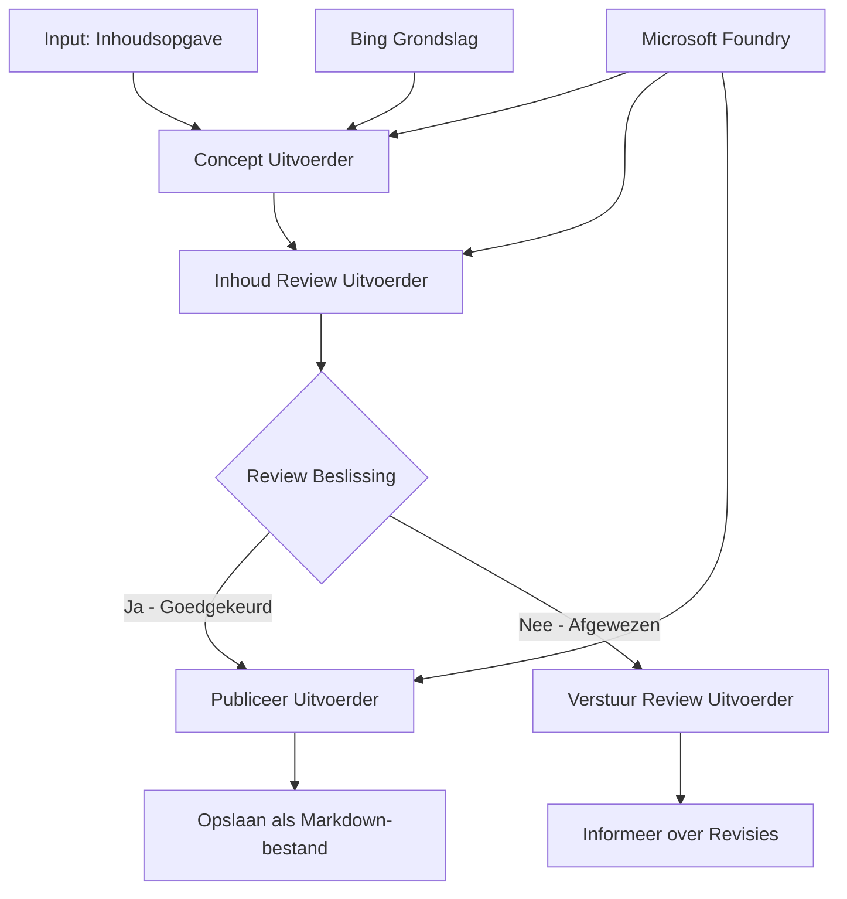

# 🔀 Conditionele Agent Workflows met Microsoft Foundry (.NET)

## 📋 Tutorial Intelligente Besluitgestuurde Workflow

Deze notebook demonstreert **conditionele workflowpatronen** met Microsoft Foundry en het Microsoft Agent Framework voor .NET. Je leert hoe je geavanceerde, besluitgedreven workflows bouwt die het verwerken intelligent routeren op basis van AI-analyse, bedrijfsregels en dynamische voorwaarden voor enterprise-grade automatisering.

## 🎯 Leerdoelen

### 🧠 **Intelligente Besluitarchitectuur**
- **Implementatie van Conditionele Logica**: Bouw complexe beslisbomen met meerdere vertakkingspunten
- **AI-gestuurde Routering**: Gebruik Microsoft Foundry-modellen voor intelligente routeringsbeslissingen
- **Dynamische Workflow Aanpassing**: Pas het gedrag van workflows aan op basis van runtime-analyse en voorwaarden
- **Integratie van Enterprise Regels**: Verwerk bedrijfslogica en compliance-eisen in workflows

### 🔀 **Geavanceerde Conditionele Patronen**
- **Meercriteria Besluitvorming**: Evalueer meerdere factoren voor routeringsbeslissingen
- **Contextbewuste Verwerking**: Maak beslissingen op basis van de geaccumuleerde workflowcontext en geschiedenis
- **Adaptieve Workflow Wijziging**: Pas verwerkingspaden dynamisch aan op basis van realtime omstandigheden
- **Integratie van Regelsystemen**: Implementeer geavanceerde bedrijfsregels binnen workflows

### 🏢 **Enterprise Conditionele Toepassingen**
- **Documentclassificatie & Routering**: Classificeer en routeer documenten automatisch naar juiste workflows
- **Klantenservice Triagering**: Intelligente routering van klantvragen naar gespecialiseerde afhandelteams
- **Compliance & Risicobehandeling**: Pas verschillende validatie- en beoordelingsprocessen toe op basis van risicobeoordeling
- **Kwaliteitsborgingsworkflows**: Routeer content door passende beoordelingsprocessen volgens kwaliteitsmetrics

## ⚙️ Vereisten & Setup

### 📦 **Benodigde NuGet-pakketten**

Geavanceerde pakketten voor conditionele workflowverwerking:

```xml
<!-- Core AI Framework -->
<PackageReference Include="Microsoft.Extensions.AI" Version="9.9.0" />

<!-- Azure AI Agents with Persistent State -->
<PackageReference Include="Azure.AI.Agents.Persistent" Version="1.2.0-beta.5" />

<!-- Azure Identity and Utilities -->
<PackageReference Include="Azure.Identity" Version="1.15.0" />
<PackageReference Include="System.Linq.Async" Version="6.0.3" />
<PackageReference Include="DotNetEnv" Version="3.1.1" />

<!-- Local Workflow Framework References -->
<!-- Microsoft.Agents.Workflows.dll - Advanced workflow orchestration -->
<!-- Microsoft.Agents.AI.AzureAI.dll - Microsoft Foundry integration -->
<!-- Microsoft.Agents.AI.dll - Core agent abstractions -->
```

### 🔑 **Microsoft Foundry Configuratie**

**Benodigde Azure Resources:**
- Microsoft Foundry workspace met conditionele verwerkingsmodellen
- Azure-abonnement met passende computequota's en permissies
- Geïmplementeerde AI-modellen voor besluitvorming en inhoudsanalyse
- (Optioneel) Bing Search API-verbinding voor grondslagmogelijkheden

**Omgevingsconfiguratie (.env bestand):**
```env
# Microsoft Foundry Configuration
AZURE_AI_PROJECT_ENDPOINT=https://your-project.cognitiveservices.azure.com/
BING_CONNECTION_ID=your-bing-connection-id
```

**Authenticatie Setup:**
```csharp
// Azure CLI or Managed Identity authentication
using Azure.Identity;
var credential = new AzureCliCredential();

// Load environment configuration
DotNetEnv.Env.Load("../../../.env");
```

### 🏗️ **Architectuur van de Conditionele Workflow**



**Belangrijke Componenten:**
- **Draft Executor**: AI-agent die initiële inhoudconcepten maakt vanuit outlines
- **Content Review Executor**: AI-agent die conceptkwaliteit en compliance beoordeelt
- **Conditionele Routering**: Besluitlogica die routering bepaalt op basis van reviewresultaten
- **Publiceer/Review Paden**: Gescheiden verwerkingspaden voor goedgekeurde versus afgewezen content
- **Statusbeheer**: Behoudt content- en reviewcontext doorheen de workflow

## 🎨 **Conditionele Workflow Ontwerppatronen**

### 📋 **Contentproductie met Kwaliteitscontroles**
```
Outline → Draft Creation → Quality Review → {Approve: Publish | Reject: Revise}
```

### 🎯 **Risicogebaseerde Documentverwerking**
```
Document → Risk Assessment → {Low: Standard | High: Enhanced Review}
```

### 🔍 **Intelligente Klantenservice Routering**
```
Customer Query → Analysis → {Simple: FAQ Bot | Complex: Human Agent}
```

### 💼 **Compliance-gedreven Workflows**
```
Content → Compliance Check → {Pass: Publish | Fail: Legal Review}
```

## 🏢 **Enterprise Conditionele Voordelen**

### 🎯 **Intelligente Automatisering**
- **Slimme Besluitvorming**: AI-gestuurde routeringsbeslissingen gebaseerd op inhoudsanalyse en context
- **Adaptieve Verwerking**: Workflows die zich automatisch aanpassen aan veranderende omstandigheden
- **Handhaving van Bedrijfsregels**: Automatische toepassing van complexe bedrijfslogica en beleidsregels
- **Contextbewuste Routering**: Beslissingen gebaseerd op volledige workflowgeschiedenis en verzamelde context

### 📈 **Operationele Uitmuntendheid**
- **Geoptimaliseerde Resource Toewijzing**: Werk routeren naar de meest geschikte specialisten en processen
- **Verminderde Handmatige Tussenkomst**: Geautomatiseerde besluitvorming minimaliseert behoefte aan menselijke routering
- **Snellere Oplostijden**: Directe routering naar passende expertise en verwerkingscapaciteiten
- **Consistente Toepassing**: Uniforme toepassing van bedrijfsregels en besluitcriteria

### 🛡️ **Risicomanagement & Compliance**
- **Geautomatiseerde Risicobeoordeling**: AI-gestuurde evaluatie van inhoud en risiconiveaus van situaties
- **Handhaving van Compliance**: Automatische routering via vereiste regelgevende processen
- **Toepassing van Beveiligingsprotocollen**: Verbeterde beveiligingsmaatregelen toegepast op basis van risicobeoordeling
- **Onderhoud van Audittrail**: Volledige documentatie van routeringsbeslissingen en onderbouwing

### 📊 **Analytics & Continue Verbetering**
- **Besluit Analytics**: Volg effectiviteit en nauwkeurigheid van routeringsbeslissingen
- **Patroonherkenning**: Identificeer trends en patronen in routeringsbeslissingen over tijd
- **Prestatieoptimalisatie**: Voortdurende verbetering van besluitcriteria en routeringsefficiëntie
- **Business Intelligence**: Inzichten in inhoudskarakteristieken en verwerkingsvereisten

### 🔧 **Technische Uitmuntendheid**
- **Persistent Statusbeheer**: Behoud complexe status door workflowuitvoering heen
- **Schaalbare Architectuur**: Ondersteun hoge volumes conditionele verwerkingsbehoeften
- **Integratiemogelijkheden**: Naadloze integratie met bestaande bedrijfsystemen en processen
- **Monitoring & Observability**: Uitgebreide tracking van workflowprestaties en beslissingen

Laten we intelligente, besluitgedreven enterprise workflows bouwen met .NET! 🚀

## 💻 De Code Uitvoeren

De volledige implementatie is beschikbaar in `04.dotnet-agent-framework-workflow-aifoundry-condition.cs`. Dit demonstreert een **contentproductieworkflow met kwaliteitscontroles**:

### 🏗️ **Workflow Architectuur**

```
Content Outline → Draft Creation → Quality Review → Conditional Routing:
                                                      ├─ Approved (>200 words) → Publish
                                                      └─ Rejected (<200 words) → Review Notification
```

**Agenten in de Workflow:**
1. **Evangelist Agent**: Maakt tutorialconcepten vanuit outlines met Bing-grondslag
2. **Content Reviewer Agent**: Beoordeelt conceptkwaliteit (aantal woorden, volledigheid)
3. **Publisher Agent**: Slaat goedgekeurde content op als getimestampte Markdown-bestanden

**Aangepaste Uitvoerders:**
1. **DraftExecutor**: Orkestreert conceptcreatie
2. **ContentReviewExecutor**: Voert kwaliteitsbeoordeling uit
3. **PublishExecutor**: Verzorgt publicatie van goedgekeurde inhoud
4. **SendReviewExecutor**: Beheert notificaties over afgewezen content

### 🚀 Het Voorbeeld Uitvoeren

**Vereisten:**
- Microsoft Foundry workspace geconfigureerd
- Azure CLI authenticatie (`az login`)
- (Optioneel) Bing Search verbinding voor grondslag

```bash
# Maak het script uitvoerbaar (Unix/Linux/macOS)
chmod +x 04.dotnet-agent-framework-workflow-aifoundry-condition.cs

# Voer de voorwaardelijke workflow uit
./04.dotnet-agent-framework-workflow-aifoundry-condition.cs
```

Of op Windows:
```powershell
dotnet run 04.dotnet-agent-framework-workflow-aifoundry-condition.cs
```

### 📝 Verwachte Uitvoer

De workflow zal:
1. **Agenten aanmaken**: Initialiseer drie gespecialiseerde Microsoft Foundry-agenten
2. **Concept genereren**: Evangelist-agent maakt tutorialconcept aan vanuit outline
3. **Content beoordelen**: Content Reviewer beoordeelt conceptkwaliteit
4. **Conditionele Routering**:
   - **Als goedgekeurd (>200 woorden)**: Publish executor slaat op als Markdown-bestand
   - **Als afgewezen (<200 woorden)**: Stuur reviewbericht
5. **Resultaten tonen**: Toon de einduitkomst van de workflow

### 🔧 Aanpassingsopties

**Wijzig beoordelingscriteria:**
```csharp
const string ContentReviewerInstructions = @"
You are a content reviewer...
1. Check if content is more than 500 words (instead of 200)
2. Verify technical accuracy
3. Ensure proper formatting
...";
```

**Voeg meer conditionele paden toe:**
```csharp
var workflow = new WorkflowBuilder(draftExecutor)
    .AddEdge(draftExecutor, contentReviewerExecutor)
    .AddEdge(contentReviewerExecutor, publishExecutor, condition: GetCondition("Excellent"))
    .AddEdge(contentReviewerExecutor, editExecutor, condition: GetCondition("Good"))
    .AddEdge(contentReviewerExecutor, sendReviewerExecutor, condition: GetCondition("Poor"))
    .Build();
```

**Verander inhoudseisen:**
```csharp
string OUTLINE_Content = @"
# Your Custom Topic
## Section 1
https://your-reference-url
## Section 2
...
";
```

### 🎯 Praktijktoepassingen

Dit conditionele workflowpatroon is ideaal voor:
- **Content Management Systemen**: Geautomatiseerde redactionele workflows met kwaliteitscontroles
- **Documentverwerking**: Routeer documenten op basis van classificatie en compliance
- **Klantenondersteuning**: Intelligente ticketroutering op basis van complexiteit en urgentie
- **Juridische Beoordeling**: Routeer contracten op basis van risicobeoordeling en waarde
- **HR-processen**: Routeer sollicitaties via passende screeningsworkflows

### 🔍 Begrip van Conditionele Logica

**Voorwaardefunctie:**
```csharp
public Func<object?, bool> GetCondition(string expectedResult) =>
    reviewResult => reviewResult is ReviewResult review && review.Result == expectedResult;
```

Deze functie maakt een predicaat dat:
1. Controleren of het resultaat van het type `ReviewResult` is
2. Vergelijkt de `Result`-eigenschap met de verwachte waarde
3. Geeft true/false terug om routering te bepalen

**Workflowranden met voorwaarden:**
```csharp
.AddEdge(contentReviewerExecutor, publishExecutor, condition: GetCondition("Yes"))
.AddEdge(contentReviewerExecutor, sendReviewerExecutor, condition: GetCondition("No"))
```

### 📊 Geavanceerde Functionaliteiten

**JSON Schema Validatie:**
De workflow gebruikt JSON-schema's om gestructureerde responsen te garanderen:

```csharp
// Define response structure
public class ReviewResult
{
    [JsonPropertyName("review_result")]
    public string Result { get; set; } = string.Empty;
    
    [JsonPropertyName("reason")]
    public string Reason { get; set; } = string.Empty;
    
    [JsonPropertyName("draft_content")]
    public string DraftContent { get; set; } = string.Empty;
}

// Apply to agent
ResponseFormat = ChatResponseFormat.ForJsonSchema(
    AIJsonUtilities.CreateJsonSchema(typeof(ReviewResult)), 
    "ReviewResult", 
    "Review Result From DraftContent"
)
```

**Bing Grondslag Integratie:**
De Evangelist-agent gebruikt Bing-grondslag om toegang te krijgen tot actuele informatie:

```csharp
var bingGroundingConfig = new BingGroundingSearchConfiguration(bing_conn_id);
BingGroundingToolDefinition bingGroundingTool = new(
    new BingGroundingSearchToolParameters([bingGroundingConfig])
);
```

Hiermee kan de agent URLs in de outline volgen en actuele informatie extraheren.

### 🛡️ Foutafhandeling

De workflow bevat robuuste foutafhandeling voor afgewezen content:
- Reviewfouten activeren het alternatieve pad
- Notificaties bieden duidelijke afwijzingsredenen
- Content wordt bewaard voor revisie

### 🔄 Workflow Uitbreiden

**Voeg een Revisielus toe:**
Maak een feedbacklus die content automatisch herconcepteert:

```csharp
.AddEdge(contentReviewerExecutor, publishExecutor, condition: GetCondition("Yes"))
.AddEdge(contentReviewerExecutor, draftExecutor, condition: GetCondition("No")) // Loop back
```

**Implementeer Meerdere Reviewniveaus:**
Voeg meerdere reviewstadia toe met verschillende criteria:

```csharp
.AddEdge(draftExecutor, technicalReviewer)
.AddEdge(technicalReviewer, editorialReviewer, condition: GetCondition("TechPass"))
.AddEdge(editorialReviewer, publishExecutor, condition: GetCondition("EditPass"))
```

Dit conditionele workflowpatroon vormt de basis voor het bouwen van geavanceerde, intelligente enterprise-automatiseringssystemen! 🚀

---

<!-- CO-OP TRANSLATOR DISCLAIMER START -->
**Disclaimer**:
Dit document is vertaald met behulp van de AI vertaaldienst [Co-op Translator](https://github.com/Azure/co-op-translator). Hoewel we streven naar nauwkeurigheid, dient u er rekening mee te houden dat geautomatiseerde vertalingen fouten of onnauwkeurigheden kunnen bevatten. Het originele document in de oorspronkelijke taal moet worden beschouwd als de gezaghebbende bron. Voor kritieke informatie wordt professionele menselijke vertaling aanbevolen. Wij zijn niet aansprakelijk voor eventuele misverstanden of verkeerde interpretaties die voortvloeien uit het gebruik van deze vertaling.
<!-- CO-OP TRANSLATOR DISCLAIMER END -->